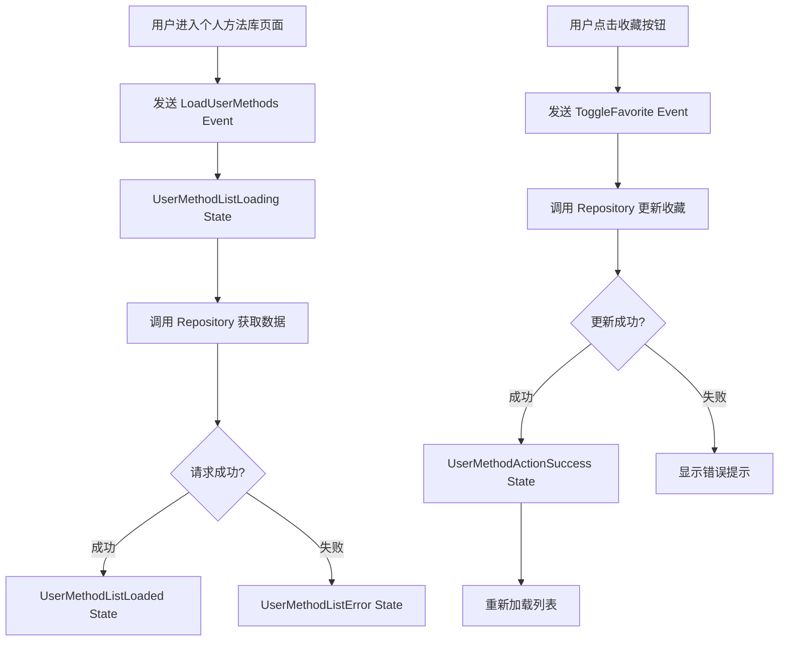
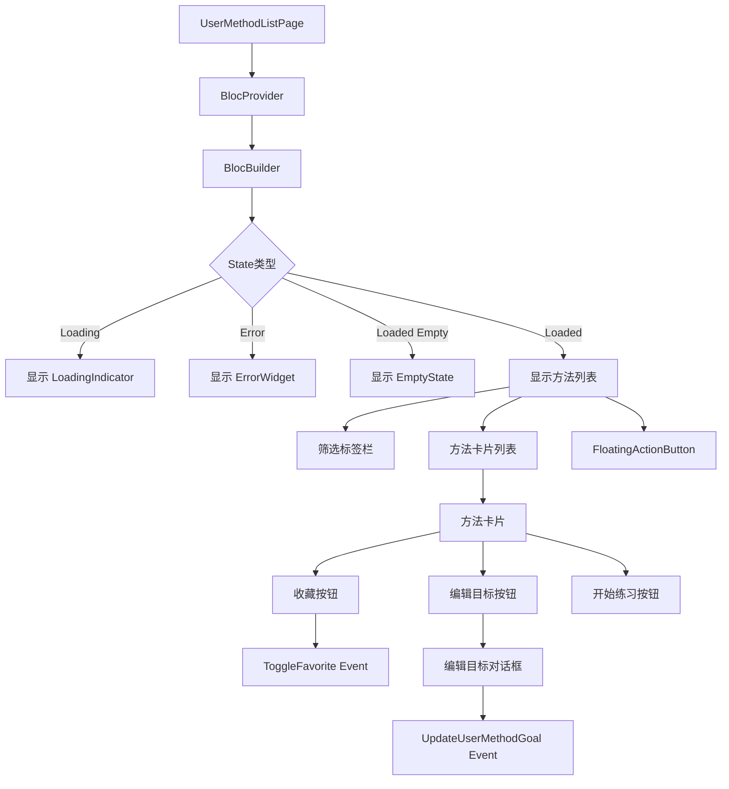
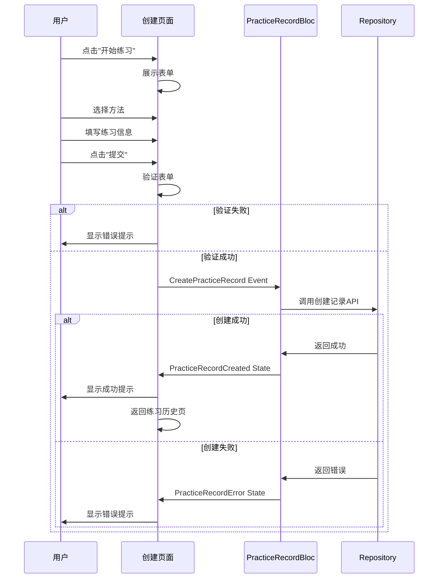
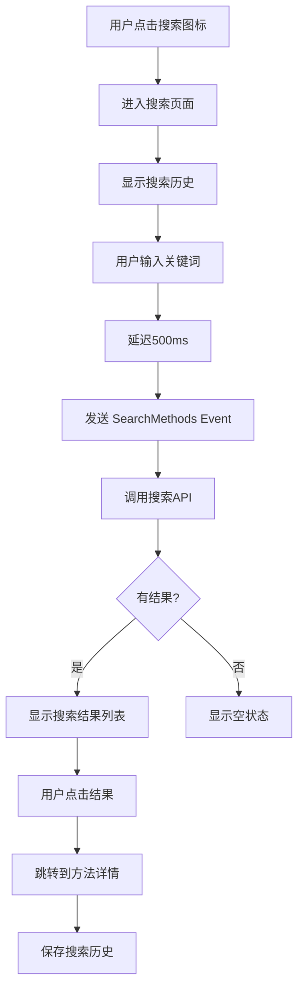
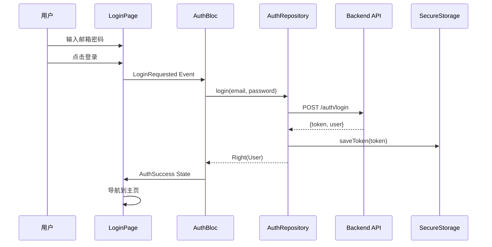
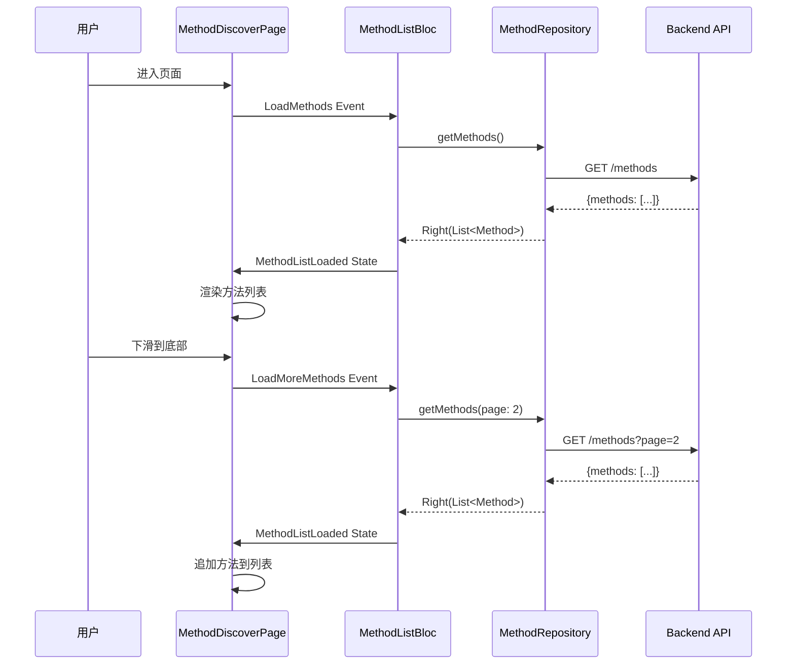
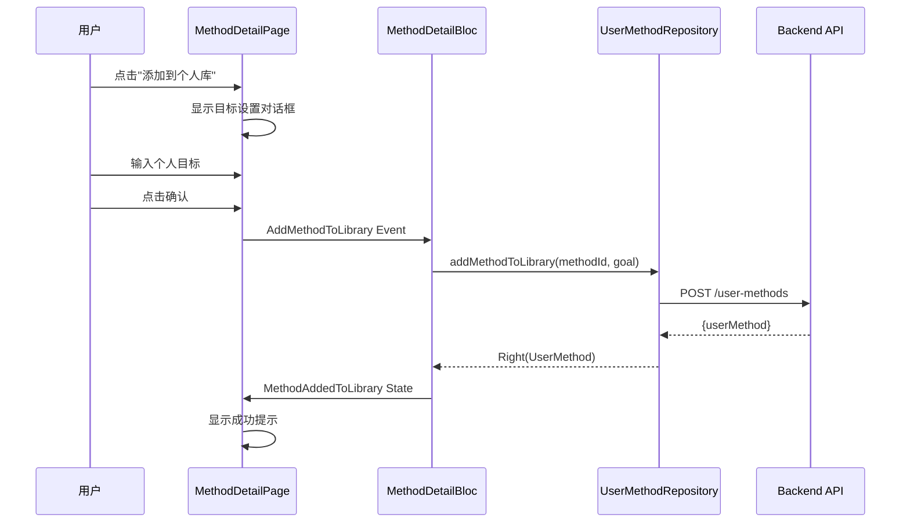
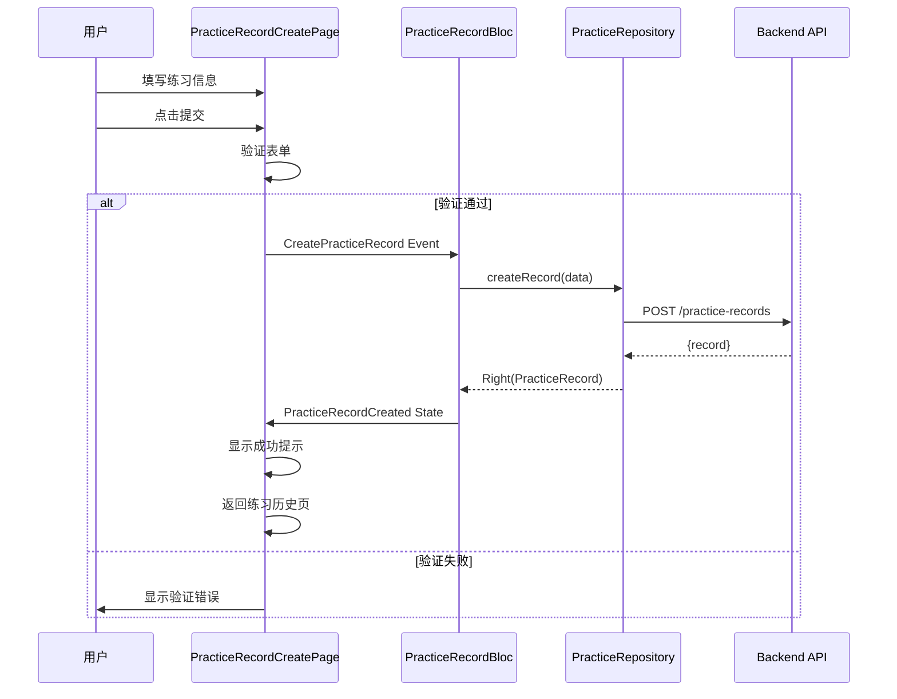
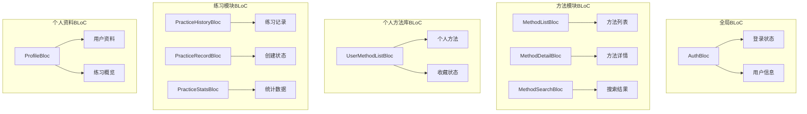

# Flutter应用完整开发设计文档

## 设计目标

完成Nian心理自助应用Flutter客户端的全部开发工作，消除所有未完成功能点，实现一个功能完备、可上线的移动应用。本设计旨在填补当前应用中的所有功能缺口，确保应用达到生产环境标准。

## 项目现状分析

### 已完成模块

根据项目现状，以下模块已基本完成：

**核心架构层**
- Clean Architecture 三层架构完整实现
- BLoC 状态管理模式全面应用
- 数据层、领域层、表现层完整搭建

**认证模块**
- 启动页、登录页、注册页完整实现
- AuthBloc 状态管理完整

**方法浏览模块**
- 方法发现页面（列表、筛选、分页）
- 方法详情页面
- 添加到个人库功能

**主框架**
- 底部导航栏（4个Tab）
- 主页状态保持

### 未完成功能点

通过代码分析，发现以下未完成的功能：

**个人方法库模块**
- BLoC层完全缺失（无状态管理）
- 页面仅为占位UI，无真实数据加载
- 未集成API接口
- 收藏、编辑目标、删除等功能未实现

**练习记录模块**
- 页面仅为占位UI，无真实数据
- BLoC层未集成
- 练习记录创建页面、统计页面路由未配置

**个人资料模块**
- ProfileBloc 部分功能标记为 TODO
- 修改昵称功能未对接API
- 主题切换未持久化
- 数据导出功能未实现
- 清除缓存功能未实现
- 修改密码页面未创建

**搜索功能**
- 方法搜索页面完全未实现

**通知功能**
- 通知功能入口存在但未实现

**路由管理**
- 练习创建、统计页面路由未配置
- 修改密码页面路由未配置

**main.dart 文件问题**
- 存在重复代码（70-82行与54-64行重复）

## 设计方案

### 阶段一：修复关键缺陷

#### 1.1 修复 main.dart 重复代码

**目标**：清理 main.dart 文件中的重复路由配置代码

**修改位置**：lib/main.dart 文件第70-82行

**修改策略**：删除重复的 onGenerateRoute 代码段，保留54-64行的正确实现

**预期结果**：文件结构清晰，无编译错误

---

### 阶段二：完成个人方法库模块

#### 2.1 创建个人方法库 BLoC 层

**目标**：实现个人方法库的状态管理

**需要创建的文件**：
- lib/presentation/user_methods/bloc/user_method_list_bloc.dart
- lib/presentation/user_methods/bloc/user_method_list_event.dart
- lib/presentation/user_methods/bloc/user_method_list_state.dart

**Event 定义**：
| Event 名称 | 参数 | 说明 |
|-----------|------|------|
| LoadUserMethods | 无 | 加载个人方法列表 |
| RefreshUserMethods | 无 | 刷新个人方法列表 |
| FilterUserMethodsByCategory | category (String?) | 按分类筛选 |
| ToggleFavorite | userMethodId (int) | 切换收藏状态 |
| UpdateUserMethodGoal | userMethodId (int), goal (String) | 更新个人目标 |
| DeleteUserMethod | userMethodId (int) | 删除个人方法 |

**State 定义**：
| State 名称 | 属性 | 说明 |
|-----------|------|------|
| UserMethodListInitial | 无 | 初始状态 |
| UserMethodListLoading | 无 | 加载中 |
| UserMethodListLoaded | methods (List), hasReachedMax (bool) | 加载成功 |
| UserMethodListError | message (String) | 加载失败 |
| UserMethodActionSuccess | message (String) | 操作成功（收藏、更新、删除） |

**业务逻辑流程**：



**依赖关系**：
- BLoC 依赖 UserMethodRepository（domain层）
- BLoC 通过 Repository 调用 UserMethodRemoteDataSource（data层）

#### 2.2 重构个人方法库页面

**目标**：将占位UI替换为真实数据驱动的界面

**修改文件**：lib/presentation/user_methods/pages/user_method_list_page.dart

**重构要点**：
- 集成 UserMethodListBloc
- 使用 BlocBuilder 响应状态变化
- 实现筛选逻辑（分类、收藏）
- 实现收藏切换功能
- 实现编辑目标对话框
- 实现删除确认对话框
- 添加错误处理和空状态展示
- 实现下拉刷新

**页面结构**：



**交互功能表**：
| 交互元素 | 触发动作 | BLoC Event | 预期结果 |
|---------|---------|-----------|---------|
| 筛选标签 | 点击分类 | FilterUserMethodsByCategory | 列表按分类过滤 |
| 收藏按钮 | 点击 | ToggleFavorite | 收藏状态切换 |
| 编辑目标按钮 | 点击 | 弹出对话框 | 显示目标输入框 |
| 对话框确认 | 点击保存 | UpdateUserMethodGoal | 目标更新成功 |
| 删除菜单 | 长按卡片 | DeleteUserMethod | 方法删除 |
| 开始练习按钮 | 点击 | 导航 | 跳转到练习创建页 |
| 添加方法按钮 | 点击 | 导航 | 跳转到方法发现页 |

---

### 阶段三：完成练习记录模块

#### 3.1 创建练习记录 BLoC 层

**目标**：为练习历史页面、创建页面、统计页面提供状态管理

**需要创建/完善的 BLoC**：

**PracticeHistoryBloc**（已存在，需完善）
- 加载练习记录列表
- 按时间范围筛选（本周、本月、全部）
- 删除练习记录

**PracticeRecordBloc**（已存在，需完善）
- 创建练习记录
- 表单验证
- 心理状态评分管理

**PracticeStatsBloc**（已存在，需完善）
- 加载统计数据
- 日期范围筛选
- 数据可视化准备

#### 3.2 重构练习历史页面

**目标**：集成 BLoC，显示真实数据

**修改文件**：lib/presentation/practice/pages/practice_history_page.dart

**重构要点**：
- 集成 PracticeHistoryBloc
- 加载真实练习记录
- 实现本周、本月、全部三个Tab的数据筛选
- 实现删除功能
- 添加空状态展示
- 实现下拉刷新

**数据展示结构**：
| 字段 | 数据来源 | 展示方式 |
|-----|---------|---------|
| 日期分组 | 练习记录的创建时间 | 今天、昨天、N天前 |
| 方法名称 | 关联的方法信息 | 文本展示 |
| 练习时长 | durationMinutes | 图标+文本 |
| 练习前评分 | moodBefore | 进度条+数值 |
| 练习后评分 | moodAfter | 进度条+数值 |
| 备注 | notes | 可选展示 |

#### 3.3 创建练习记录创建页面

**目标**：提供创建练习记录的完整表单

**需要创建的文件**：lib/presentation/practice/pages/practice_record_create_page.dart

**页面功能需求**：

**表单字段**：
| 字段名称 | 类型 | 是否必填 | 验证规则 | 默认值 |
|---------|------|---------|---------|--------|
| 选择方法 | 下拉选择 | 是 | 必须选择 | 无 |
| 练习时长 | 数字输入 | 是 | 1-300分钟 | 10 |
| 练习前评分 | 滑块 | 是 | 1-10 | 5 |
| 练习后评分 | 滑块 | 是 | 1-10 | 5 |
| 备注 | 多行文本 | 否 | 最多500字 | 空 |

**交互流程**：



**UI布局结构**：
- AppBar：标题"记录练习"，返回按钮
- 表单区域：所有输入字段，使用卡片容器包裹
- 方法选择器：显示个人方法库中的方法
- 评分滑块：可视化显示1-10分
- 底部操作栏：取消按钮、提交按钮

#### 3.4 完善练习统计页面

**目标**：展示练习数据的可视化统计

**修改文件**：lib/presentation/practice/pages/practice_stats_page.dart

**统计数据需求**：

**关键指标卡片**：
| 指标名称 | 计算逻辑 | 展示方式 |
|---------|---------|---------|
| 总练习次数 | 所有练习记录count | 大数字+图标 |
| 总练习时长 | sum(durationMinutes) | 小时+分钟 |
| 连续练习天数 | 连续有记录的天数 | 数字+火焰图标 |
| 平均心情改善 | avg(moodAfter - moodBefore) | 百分比 |

**图表需求**（使用 fl_chart）：
| 图表类型 | 展示内容 | X轴 | Y轴 |
|---------|---------|-----|-----|
| 折线图 | 练习频次趋势 | 日期（最近30天） | 练习次数 |
| 柱状图 | 各方法练习分布 | 方法名称 | 练习次数 |
| 饼图 | 练习分类占比 | 无 | 百分比 |

**时间范围筛选**：
- 近7天
- 近30天
- 近90天
- 全部

#### 3.5 配置练习模块路由

**目标**：将练习相关页面添加到路由系统

**修改文件**：lib/main.dart

**需要添加的路由**：
| 路由路径 | 页面组件 | 参数 | 说明 |
|---------|---------|------|------|
| /practice-create | PracticeRecordCreatePage | userMethodId (可选) | 创建练习记录 |
| /practice-stats | PracticeStatsPage | 无 | 练习统计 |

---

### 阶段四：完善个人资料模块

#### 4.1 完善 ProfileBloc 功能

**目标**：实现 ProfileBloc 中标记为 TODO 的功能

**修改文件**：lib/presentation/profile/bloc/profile_bloc.dart

**待实现功能**：

**连续练习天数计算**：
- 当前：硬编码为7天
- 改进：从统计数据中计算实际连续天数
- 逻辑：遍历练习记录，计算从今天往前连续有记录的天数

**更新昵称API对接**：
- 创建 UpdateProfile 事件处理
- 调用 AuthRepository 的更新资料接口
- 更新成功后发出 ProfileUpdated 状态
- 处理更新失败的错误

**主题切换持久化**：
- 使用 SharedPreferences 存储主题设置
- 提供 light、dark、system 三种模式
- 应用启动时读取保存的主题设置

**数据导出功能**：
- 导出用户所有练习记录
- 格式：JSON 或 CSV
- 使用 path_provider 获取文件路径
- 保存到应用文档目录
- 显示导出成功路径

#### 4.2 创建修改密码页面

**目标**：提供修改密码的用户界面

**需要创建的文件**：lib/presentation/profile/pages/change_password_page.dart

**表单字段**：
| 字段名称 | 类型 | 验证规则 |
|---------|------|---------|
| 当前密码 | 密码输入 | 必填 |
| 新密码 | 密码输入 | 必填，至少6位 |
| 确认新密码 | 密码输入 | 必填，与新密码一致 |

**交互流程**：
- 用户输入三个密码字段
- 客户端验证：新密码强度、两次密码一致性
- 提交到后端API：POST /auth/change-password
- 成功：显示提示，返回个人资料页
- 失败：显示错误信息（如当前密码错误）

**UI要求**：
- 所有密码输入框支持显示/隐藏切换
- 新密码输入框下方显示强度指示器
- 表单验证实时反馈

#### 4.3 实现清除缓存功能

**目标**：清理应用缓存数据

**涉及的缓存**：
- 网络请求缓存（Dio缓存）
- 图片缓存（CachedNetworkImage）
- 本地数据库缓存

**实现策略**：
- 创建 CacheManager 工具类
- 提供统一的清除缓存接口
- 计算缓存大小
- 清除后显示成功提示

**缓存管理表**：
| 缓存类型 | 清除方法 | 位置 |
|---------|---------|------|
| HTTP缓存 | 清除Dio缓存目录 | 应用缓存目录 |
| 图片缓存 | CachedNetworkImage.evictFromCache | 应用缓存目录 |
| 数据库缓存 | 清除SQLite临时表 | 数据库文件 |

#### 4.4 重构个人资料页面

**目标**：集成 ProfileBloc，显示真实用户数据

**修改文件**：lib/presentation/profile/pages/profile_page.dart

**数据对接**：
- 用户昵称：从 ProfileBloc 的 user 实体获取
- 注册时间：从 user.createdAt 格式化显示
- 练习统计：从 ProfileBloc 的统计数据获取
- 替换所有占位数据

**功能对接**：
- 修改昵称：调用 UpdateNickname Event
- 修改密码：导航到修改密码页
- 主题设置：调用 ChangeTheme Event
- 清除缓存：调用 CacheManager
- 数据导出：调用 ExportData Event

---

### 阶段五：实现搜索功能

#### 5.1 创建方法搜索页面

**目标**：提供方法搜索功能

**需要创建的文件**：
- lib/presentation/methods/pages/method_search_page.dart
- lib/presentation/methods/bloc/method_search_bloc.dart
- lib/presentation/methods/bloc/method_search_event.dart
- lib/presentation/methods/bloc/method_search_state.dart

**搜索功能需求**：

**搜索输入**：
- 实时搜索（用户输入延迟500ms后触发）
- 搜索历史记录（最多10条）
- 清空搜索历史

**搜索条件**：
| 条件类型 | 选项 | 说明 |
|---------|------|------|
| 关键词 | 文本输入 | 搜索方法名称、描述 |
| 分类 | 多选 | 焦虑缓解、睡眠改善等 |
| 难度 | 单选 | 入门、中级、高级 |

**搜索结果展示**：
- 使用与方法发现页相同的卡片样式
- 高亮显示匹配的关键词
- 支持点击跳转到详情页
- 显示搜索结果数量
- 无结果时显示建议

**交互流程**：



#### 5.2 更新方法发现页搜索入口

**目标**：将搜索按钮连接到搜索页面

**修改文件**：lib/presentation/methods/pages/method_discover_page.dart

**修改位置**：第78-84行的搜索按钮 onPressed 回调

**修改内容**：
- 移除 TODO 注释
- 添加导航到搜索页的逻辑

---

### 阶段六：优化和完善

#### 6.1 错误处理优化

**目标**：统一应用的错误处理策略

**策略表**：
| 错误类型 | 处理方式 | 用户提示 |
|---------|---------|---------|
| 网络超时 | 显示重试按钮 | "网络连接超时，请重试" |
| 服务器错误 | 记录日志，显示通用提示 | "服务器繁忙，请稍后再试" |
| 认证过期 | 清除token，跳转登录 | "登录已过期，请重新登录" |
| 数据验证 | 表单字段标红 | 具体字段错误信息 |
| 权限不足 | 显示提示，返回上页 | "您没有权限执行此操作" |

**实现要点**：
- 在 DioClient 的拦截器中统一处理 HTTP 错误
- 在 BLoC 中统一处理业务逻辑错误
- 使用 SnackBar 或 Dialog 显示错误信息
- 记录错误日志到 Logger

#### 6.2 加载状态优化

**目标**：提升用户体验，减少等待焦虑

**优化策略**：
| 场景 | 当前方案 | 优化方案 |
|------|---------|---------|
| 列表加载 | CircularProgressIndicator | Shimmer骨架屏 |
| 图片加载 | 占位灰色方块 | 渐进式加载+模糊占位 |
| 操作反馈 | 无 | 按钮loading状态 |
| 页面切换 | 无 | 页面过渡动画 |

**使用的组件**：
- shimmer 包：列表骨架屏
- cached_network_image：图片渐进式加载
- flutter_spinkit：多样化的loading动画

#### 6.3 空状态优化

**目标**：提供更友好的空状态提示

**空状态场景表**：
| 页面 | 空状态条件 | 图标 | 提示文案 | 操作按钮 |
|------|-----------|------|---------|---------|
| 方法发现 | 无方法数据 | library_books_outlined | "暂无方法数据" | 刷新 |
| 个人方法库 | 未添加方法 | bookmark_border | "还没有添加方法\n去发现感兴趣的方法吧" | 去发现 |
| 练习历史 | 无练习记录 | history | "还没有练习记录\n开始第一次练习吧" | 开始练习 |
| 搜索结果 | 搜索无结果 | search_off | "未找到相关方法\n换个关键词试试" | 清空搜索 |

**EmptyState组件改进**：
- 支持自定义操作按钮
- 支持插图（可选）
- 文案可配置

#### 6.4 主题切换功能

**目标**：支持浅色、深色、跟随系统三种主题模式

**实现方案**：

**主题管理器**：
- 创建 ThemeBloc 管理主题状态
- 使用 SharedPreferences 持久化主题设置
- 监听系统主题变化

**主题设置入口**：
- 个人资料页的"主题设置"菜单项
- 弹出底部选择器
- 三个选项：浅色、深色、跟随系统

**主题配置**：
- 浅色主题：已在 AppTheme.lightTheme 定义
- 深色主题：已在 AppTheme.darkTheme 定义
- 主色调：蓝色系
- 卡片、按钮、输入框统一风格

#### 6.5 路由优化

**目标**：统一路由管理，支持参数传递

**当前问题**：
- 使用传统的 MaterialPageRoute
- 路由定义分散在各个页面
- 参数传递不够类型安全

**优化方案**：
- 保持当前的 Named Routes 方案（已集成）
- 补充缺失的路由配置
- 优化 onGenerateRoute 的参数解析

**完整路由表**：
| 路由路径 | 页面 | 参数 | 权限要求 |
|---------|------|------|---------|
| / | SplashPage | 无 | 无 |
| /login | LoginPage | 无 | 未登录 |
| /register | RegisterPage | 无 | 未登录 |
| /home | MainPage | 无 | 已登录 |
| /method-detail | MethodDetailPage | methodId | 已登录 |
| /method-search | MethodSearchPage | 无 | 已登录 |
| /practice-create | PracticeRecordCreatePage | userMethodId? | 已登录 |
| /practice-stats | PracticeStatsPage | 无 | 已登录 |
| /change-password | ChangePasswordPage | 无 | 已登录 |

---

### 阶段七：测试准备

#### 7.1 单元测试

**目标**：为核心业务逻辑编写单元测试

**测试覆盖范围**：

**BLoC测试**（优先级：高）
- AuthBloc：登录、注册、登出逻辑
- MethodListBloc：列表加载、筛选、分页
- UserMethodListBloc：收藏、更新目标、删除
- PracticeRecordBloc：创建记录验证

**Repository测试**（优先级：中）
- 测试成功场景
- 测试失败场景
- 测试异常处理

**工具类测试**（优先级：低）
- 日期格式化
- 表单验证器
- 缓存管理器

**测试文件组织**：
```
test/
├── unit/
│   ├── blocs/
│   │   ├── auth_bloc_test.dart
│   │   ├── method_list_bloc_test.dart
│   │   └── user_method_list_bloc_test.dart
│   ├── repositories/
│   │   └── auth_repository_test.dart
│   └── utils/
│       └── validators_test.dart
```

#### 7.2 Widget测试

**目标**：测试关键Widget的UI交互

**测试场景**：
- 登录表单：输入验证、提交按钮状态
- 方法卡片：点击跳转、收藏切换
- 空状态组件：显示正确的提示信息
- 错误组件：重试按钮功能

#### 7.3 集成测试

**目标**：测试完整的用户流程

**核心用户流程**：
1. 注册 → 登录 → 浏览方法 → 查看详情 → 添加到个人库
2. 个人库 → 编辑目标 → 开始练习 → 记录练习 → 查看统计
3. 修改资料 → 修改密码 → 退出登录

---

## 数据流设计

### 用户认证流程



### 方法浏览流程



### 添加到个人库流程



### 创建练习记录流程



---

## 状态管理设计

### BLoC层次结构



### BLoC生命周期管理

**全局BLoC**：
- 在应用启动时创建（main.dart的BlocProvider）
- 应用关闭时销毁
- 示例：AuthBloc

**页面级BLoC**：
- 在页面的BlocProvider中创建
- 页面销毁时自动销毁
- 示例：MethodListBloc、UserMethodListBloc

**共享BLoC**：
- 在上层Widget创建，多个子Widget共享
- 使用BlocProvider.value传递
- 示例：在MainPage创建，Home、Methods、Practice共享

---

## UI/UX设计规范

### 视觉设计原则

**设计语言**：Material Design 3

**主色调**：
- Primary：蓝色 (#2196F3)
- Secondary：深蓝色 (#1976D2)
- Accent：浅蓝色 (#64B5F6)

**字体规范**：
| 用途 | 字号 | 字重 | 颜色 |
|------|------|------|------|
| 大标题 | 24sp | Bold | 主文字色 |
| 标题 | 18sp | Bold | 主文字色 |
| 正文 | 14sp | Regular | 主文字色 |
| 辅助文字 | 12sp | Regular | 次要文字色 |
| 按钮文字 | 14sp | Medium | 白色/主色 |

**间距规范**：
- 基础单位：8dp
- 小间距：8dp
- 中间距：16dp
- 大间距：24dp
- 页面边距：16dp

**圆角规范**：
- 卡片：12dp
- 按钮：8dp
- 输入框：8dp
- 图片：8dp

### 交互设计规范

**反馈机制**：
| 交互类型 | 反馈方式 | 持续时间 |
|---------|---------|---------|
| 按钮点击 | 水波纹+轻微缩放 | 300ms |
| 列表项点击 | 背景色变化 | 即时 |
| 表单提交 | 按钮loading | 请求完成 |
| 操作成功 | SnackBar提示 | 2秒 |
| 操作失败 | Dialog或SnackBar | 用户关闭 |

**页面过渡**：
- 主要导航：无动画（Tab切换）
- 次级页面：右滑入动画
- 对话框：淡入+缩放
- 底部表单：从底部滑入

**手势支持**：
- 下拉刷新：列表顶部下拉
- 上拉加载：列表底部上拉
- 左滑删除：练习记录、个人方法（可选）
- 长按：显示上下文菜单

---

## 性能优化策略

### 列表性能优化

**虚拟滚动**：
- 使用 ListView.builder 而非 ListView
- 只渲染可见区域的Widget
- 复用不可见的Widget

**图片优化**：
| 策略 | 实现方式 | 收益 |
|------|---------|------|
| 图片缓存 | CachedNetworkImage | 减少网络请求 |
| 图片压缩 | 后端返回缩略图 | 减少传输大小 |
| 懒加载 | 滚动到可见区域才加载 | 减少初始加载时间 |
| 占位图 | 显示模糊占位 | 提升感知速度 |

### 网络请求优化

**请求合并**：
- 避免短时间内重复请求
- 使用 debounce 处理搜索输入

**响应缓存**：
- 缓存方法列表（5分钟）
- 缓存方法详情（10分钟）
- 缓存用户资料（本地持久化）

**分页策略**：
- 每页20条数据
- 预加载：滚动到90%时触发加载
- 最多缓存100条数据

### 状态管理优化

**不可变状态**：
- 所有State使用不可变对象
- 使用copyWith方法更新状态
- 避免深层嵌套的状态对象

**状态颗粒度**：
- 细粒度：每个页面独立BLoC
- 粗粒度：全局共享AuthBloc
- 避免不必要的Widget rebuild

---

## 安全策略

### 数据安全

**敏感数据存储**：
| 数据类型 | 存储方式 | 加密 |
|---------|---------|------|
| JWT Token | SecureStorage | AES加密 |
| 用户密码 | 不存储 | N/A |
| 用户ID | SharedPreferences | 明文 |
| 练习记录 | SQLite | 明文 |

**网络安全**：
- 所有API请求使用HTTPS
- 在请求头中添加JWT Token
- 401状态码自动跳转登录
- 请求超时30秒

### 输入验证

**客户端验证**：
| 字段类型 | 验证规则 |
|---------|---------|
| 邮箱 | 正则表达式验证格式 |
| 密码 | 至少6位字符 |
| 昵称 | 2-20个字符 |
| 练习时长 | 1-300分钟 |
| 评分 | 1-10整数 |

**防止注入攻击**：
- 所有用户输入进行转义
- 使用参数化查询（SQLite）
- 不拼接SQL语句

---

## 实施计划

### 开发优先级

**P0（必须完成）**：
1. 修复 main.dart 重复代码
2. 完成个人方法库BLoC层
3. 重构个人方法库页面
4. 重构练习历史页面
5. 创建练习记录创建页面
6. 完善ProfileBloc功能
7. 配置所有路由

**P1（重要功能）**：
1. 创建修改密码页面
2. 实现方法搜索功能
3. 完善练习统计页面
4. 实现主题切换
5. 实现清除缓存

**P2（优化改进）**：
1. 添加Shimmer骨架屏
2. 优化空状态展示
3. 优化错误处理
4. 性能优化

**P3（测试相关）**：
1. 单元测试
2. Widget测试
3. 集成测试

### 开发顺序

**第一阶段：核心功能补全（3-4天）**
- Day 1：修复缺陷 + 个人方法库BLoC + 页面重构
- Day 2：练习模块BLoC + 页面重构 + 创建页面
- Day 3：ProfileBloc完善 + 修改密码页 + 路由配置
- Day 4：统计页面 + 数据可视化

**第二阶段：附加功能（2天）**
- Day 5：搜索功能 + 主题切换 + 清除缓存
- Day 6：错误处理 + 空状态 + 加载优化

**第三阶段：测试和优化（2-3天）**
- Day 7：单元测试 + Widget测试
- Day 8：集成测试 + Bug修复
- Day 9：性能优化 + 最终测试

---

## 验收标准

### 功能完整性

**核心功能检查清单**：
- [ ] 用户可以注册、登录、退出
- [ ] 用户可以浏览所有心理方法
- [ ] 用户可以查看方法详情
- [ ] 用户可以添加方法到个人库
- [ ] 用户可以设置和更新个人目标
- [ ] 用户可以收藏和取消收藏方法
- [ ] 用户可以删除个人方法
- [ ] 用户可以创建练习记录
- [ ] 用户可以查看练习历史
- [ ] 用户可以查看练习统计
- [ ] 用户可以搜索方法
- [ ] 用户可以修改昵称
- [ ] 用户可以修改密码
- [ ] 用户可以切换主题
- [ ] 用户可以导出数据
- [ ] 用户可以清除缓存

### 代码质量

**质量标准**：
- [ ] 无编译错误和警告
- [ ] 所有TODO注释已移除或实现
- [ ] 所有文件符合命名规范
- [ ] 所有公共方法有文档注释
- [ ] BLoC层状态管理完整
- [ ] 错误处理覆盖所有API调用
- [ ] 表单验证完整

### 用户体验

**UX检查清单**：
- [ ] 所有操作有明确的反馈（loading、成功、失败）
- [ ] 空状态有友好的提示和引导
- [ ] 错误信息清晰易懂
- [ ] 加载时间<3秒
- [ ] 页面过渡流畅
- [ ] 无明显UI卡顿
- [ ] 所有可点击元素有视觉反馈

### 测试覆盖

**测试要求**：
- [ ] 核心BLoC单元测试覆盖率 >80%
- [ ] 关键Widget测试覆盖率 >60%
- [ ] 至少3个核心用户流程集成测试
- [ ] 所有测试通过

---

## 风险与挑战

### 技术风险

| 风险项 | 可能性 | 影响 | 缓解措施 |
|-------|--------|------|---------|
| API接口不稳定 | 中 | 高 | 增加错误处理和重试机制 |
| 状态管理复杂度 | 中 | 中 | 遵循BLoC最佳实践，避免过度嵌套 |
| 性能问题 | 低 | 高 | 使用虚拟滚动、图片缓存 |
| 跨平台兼容性 | 低 | 中 | 只关注移动端（Android/iOS） |

### 时间风险

| 风险项 | 可能性 | 影响 | 缓解措施 |
|-------|--------|------|---------|
| 功能开发超时 | 中 | 中 | 按优先级开发，P2/P3功能可延后 |
| 测试时间不足 | 高 | 中 | 优先完成核心功能测试 |
| Bug修复耗时 | 中 | 中 | 预留2天缓冲时间 |

### 依赖风险

| 风险项 | 可能性 | 影响 | 缓解措施 |
|-------|--------|------|---------|
| 第三方包不兼容 | 低 | 中 | 使用稳定版本，阅读更新日志 |
| 后端API变更 | 低 | 高 | 与后端团队保持沟通 |

---

## 交付物清单

### 代码交付

- [ ] 所有源代码文件
- [ ] 更新后的 pubspec.yaml
- [ ] 更新后的 README.md
- [ ] 代码注释和文档

### 文档交付

- [ ] 功能完成清单
- [ ] API对接文档
- [ ] 测试报告
- [ ] 已知问题清单

### 配置文件

- [ ] 开发环境配置
- [ ] 生产环境配置
- [ ] 路由配置清单

---

## 后续优化方向

### 短期优化（1-2周）

**功能增强**：
- 方法收藏的快捷入口
- 练习提醒通知
- 练习记录的编辑和删除
- 方法详情的分享功能

**性能优化**：
- 使用 Flutter DevTools 分析性能瓶颈
- 优化大列表的渲染性能
- 减少不必要的Widget rebuild

### 中期优化（1-2个月）

**架构升级**：
- 引入 GetIt 依赖注入
- 迁移到 GoRouter 路由管理
- 使用 Freezed 生成不可变数据类

**功能扩展**：
- 用户头像上传
- 练习打卡日历
- 社区分享功能
- AI智能推荐

### 长期规划（3-6个月）

**多平台支持**：
- Web端适配
- 桌面端（Windows/macOS）适配
- 平板端优化

**高级功能**：
- 离线模式
- 数据同步
- 语音引导练习
- 视频课程

---

## 成功标准

### 开发完成标准

**必须达成**：
- 所有P0功能100%完成
- 所有P1功能80%以上完成
- 无阻塞性Bug
- 核心流程可正常使用

**期望达成**：
- P2功能50%以上完成
- 代码测试覆盖率>60%
- 性能指标达标

### 质量标准

**代码质量**：
- 通过 Dart Analyzer 检查
- 遵循 Flutter 最佳实践
- 无 TODO 标记残留

**用户体验**：
- 操作流畅，无明显卡顿
- 错误提示友好
- 空状态有引导

**稳定性**：
- 无闪退问题
- 网络异常可正常恢复
- 登录状态持久化
