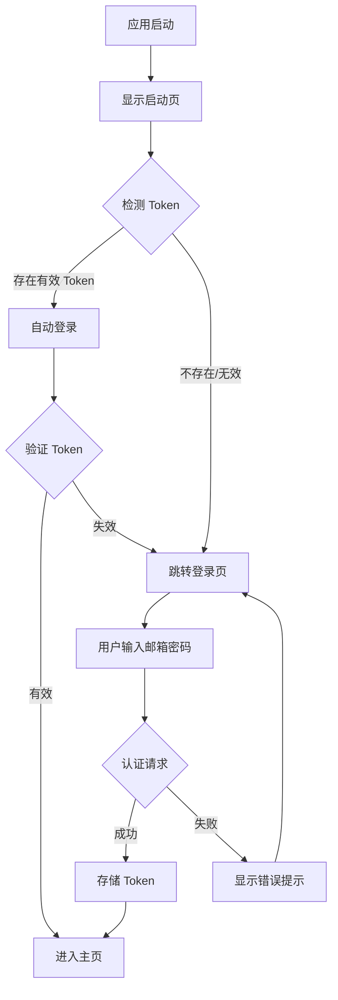

# 执行 Windows 客户端设计

## 1. 执行目标

在当前 Windows 开发环境中运行心理自助应用的 Flutter 客户端，验证应用在 Windows 桌面平台的功能完整性。

## 2. 前置条件验证

### 2.1 开发环境检查

| 检查项 | 要求 | 验证方式 |
|--------|------|----------|
| Flutter SDK | 3.0.0+ | 执行 `flutter --version` |
| Dart SDK | 3.0.0+ | 包含在 Flutter SDK 中 |
| Windows 开发者模式 | 已启用 | 确保符号链接权限 |
| Windows 平台支持 | 已配置 | 检查 `flutter_app/windows` 目录存在 |

### 2.2 Windows 开发者模式启用

**必要性**：Flutter Windows 构建依赖符号链接权限，未启用开发者模式会导致构建失败。

**启用步骤**：
1. 执行命令打开设置：`start ms-settings:developers`
2. 在"开发者选项"中启用"开发者模式"开关
3. 重启终端或 PowerShell 使设置生效

### 2.3 后端服务可用性

| 服务 | 默认地址 | 验证方式 |
|------|----------|----------|
| 后端 API | http://localhost:3000/api | 访问 /health 端点 |
| 数据库 | localhost:5432 | 通过 Docker Compose 启动 |

**后端启动方式**：
```
docker-compose up -d
```

## 3. 执行流程

### 3.1 依赖安装

**步骤**：
1. 进入 Flutter 应用目录：`cd flutter_app`
2. 安装项目依赖：`flutter pub get`
3. 验证依赖完整性：检查 `pubspec.lock` 生成

**依赖范围**：
- 核心框架：Flutter SDK、Dart SDK
- 状态管理：flutter_bloc、equatable
- 网络请求：dio、retrofit
- 本地存储：shared_preferences、sqflite、flutter_secure_storage
- UI 组件：cached_network_image、fl_chart 等

### 3.2 API 地址配置

**配置文件位置**：`lib/config/api_constants.dart`

**配置项**：
| 参数 | 默认值 | 说明 |
|------|--------|------|
| baseUrl | http://localhost:3000/api | 后端 API 基础地址 |

**配置原则**：
- 本地开发：使用 localhost
- 远程测试：替换为实际服务器 IP 或域名
- 生产环境：配置为正式域名

### 3.3 启动 Windows 客户端

**命令**：
```
flutter run -d windows
```

**执行逻辑**：
1. Flutter 检测可用设备（Windows 桌面）
2. 编译 Dart 代码为原生 Windows 二进制
3. 构建 Windows 应用窗口（基于 Win32 API）
4. 启动应用并显示启动页（Splash Page）

**可选参数**：
- `--release`：发布模式，启用代码优化
- `--debug`（默认）：调试模式，支持热重载
- `--profile`：性能分析模式

### 3.4 应用启动流程



**关键节点**：
- **Token 检测**：从 `flutter_secure_storage` 读取存储的 JWT Token
- **自动登录**：发送 Token 验证请求到 `/api/auth/me`
- **手动登录**：POST 请求到 `/api/auth/login`，返回 Token 后安全存储

## 4. 功能验证清单

### 4.1 认证模块

| 功能 | 验证步骤 | 预期结果 |
|------|----------|----------|
| 用户注册 | 点击"注册" → 填写邮箱/昵称/密码 → 提交 | 显示成功提示，自动登录 |
| 用户登录 | 填写邮箱/密码 → 点击登录 | Token 存储成功，跳转主页 |
| 自动登录 | 重启应用 | 自动进入主页（无需重新登录） |

### 4.2 方法浏览模块

| 功能 | 验证步骤 | 预期结果 |
|------|----------|----------|
| 方法列表 | 进入"发现"页 | 展示心理方法卡片列表 |
| 分类筛选 | 点击分类标签 | 列表刷新为对应分类方法 |
| 搜索 | 输入关键词 → 搜索 | 显示匹配结果 |
| 方法详情 | 点击方法卡片 | 显示完整内容、步骤、媒体 |

### 4.3 个人方法库模块

| 功能 | 验证步骤 | 预期结果 |
|------|----------|----------|
| 添加到库 | 详情页点击"添加到我的方法库" | 显示成功提示 |
| 收藏管理 | 进入"我的"页 → 查看收藏列表 | 显示已添加方法 |
| 设置目标 | 长按方法 → 设置目标天数 | 目标保存成功 |

### 4.4 练习记录模块

| 功能 | 验证步骤 | 预期结果 |
|------|----------|----------|
| 记录练习 | 详情页点击"开始练习" → 完成问卷 → 提交 | 记录保存成功 |
| 练习历史 | 进入"练习历史"页 | 显示历史记录列表 |
| 统计图表 | 进入"练习统计"页 | 显示练习次数、情绪趋势图 |

### 4.5 个人中心模块

| 功能 | 验证步骤 | 预期结果 |
|------|----------|----------|
| 主题切换 | 设置 → 切换深色/浅色模式 | 界面主题实时更新 |
| 隐私政策 | 点击"隐私政策" | 显示政策内容 |
| 退出登录 | 点击"退出登录" | Token 清除，返回登录页 |

## 5. 异常处理

### 5.1 构建阶段异常

| 异常类型 | 原因 | 解决方案 |
|----------|------|----------|
| 符号链接权限错误 | 未启用开发者模式 | 执行 `start ms-settings:developers` 启用 |
| 依赖缺失 | `pubspec.yaml` 版本冲突 | 执行 `flutter pub get` 重新安装 |
| CMake 配置失败 | Windows SDK 缺失 | 安装 Visual Studio 2022（含 C++ 桌面开发工具） |

### 5.2 运行阶段异常

| 异常类型 | 原因 | 解决方案 |
|----------|------|----------|
| 网络请求失败 | 后端服务未启动 | 执行 `docker-compose up -d` 启动后端 |
| Token 过期 | JWT 有效期已到 | 自动清除 Token，重新登录 |
| 数据加载失败 | API 地址配置错误 | 检查 `api_constants.dart` 中的 `baseUrl` |

### 5.3 降级策略

| 场景 | 降级行为 | 目的 |
|------|----------|------|
| 网络不可用 | 显示"网络连接失败"提示，提供重试按钮 | 避免应用崩溃 |
| API 返回 500 | 显示"服务暂时不可用"，记录日志 | 保证用户体验 |
| Token 失效 | 自动跳转登录页，清除本地 Token | 确保安全性 |

## 6. 调试工具

### 6.1 Flutter DevTools

**启动方式**：应用运行后，终端会显示 DevTools 链接（如 `http://127.0.0.1:9100`）

**功能范围**：
- **Inspector**：查看 Widget 树结构、布局边界
- **Timeline**：分析渲染性能、帧率
- **Memory**：监控内存使用、检测泄漏
- **Network**：查看 HTTP 请求/响应详情
- **Logging**：查看应用日志输出

### 6.2 热重载机制

| 功能 | 快捷键 | 适用场景 |
|------|--------|----------|
| 热重载 | `r`（终端中） | UI 布局调整、样式修改 |
| 热重启 | `R`（终端中） | 状态重置、路由变更 |
| 全量重启 | 重新运行 `flutter run` | 依赖更新、原生代码修改 |

### 6.3 日志系统

**日志级别**：
- `logger.v()`：详细调试信息
- `logger.d()`：调试信息
- `logger.i()`：一般信息
- `logger.w()`：警告
- `logger.e()`：错误

**日志输出位置**：Visual Studio Code 调试控制台或终端

## 7. 构建发布版本

### 7.1 发布构建

**命令**：
```
flutter build windows --release
```

**输出位置**：`build/windows/runner/Release/`

**产物包含**：
- `mental_app.exe`：主可执行文件
- `flutter_windows.dll`：Flutter 引擎
- `data/` 目录：资源文件（图片、字体等）

### 7.2 分发方式

| 方式 | 适用场景 | 分发内容 |
|------|----------|----------|
| 直接分发 | 内部测试 | 打包 `Release` 整个目录为 ZIP |
| MSIX 安装包 | Windows 应用商店 | 使用 `msix` 包构建安装程序 |
| 自定义安装程序 | 企业部署 | 使用 Inno Setup 或 NSIS |

## 8. 性能基准

### 8.1 启动性能

| 指标 | 目标值 | 测量方式 |
|------|--------|----------|
| 冷启动时间 | < 3 秒 | 应用启动到首屏可见 |
| 自动登录时间 | < 1 秒 | Token 验证到主页展示 |

### 8.2 运行性能

| 指标 | 目标值 | 说明 |
|------|--------|------|
| 帧率 | 60 FPS | 滚动列表时保持流畅 |
| 内存占用 | < 200 MB | 正常使用场景下 |
| API 响应时间 | < 500 ms | 本地网络环境 |

## 9. 验证标准

### 9.1 功能完整性

**通过标准**：
- 所有 12 个功能页面可正常访问
- 认证、方法浏览、练习记录核心流程无阻塞
- 数据持久化正常（Token、收藏、练习记录）

### 9.2 稳定性

**通过标准**：
- 连续运行 30 分钟无崩溃
- 网络切换（断网/恢复）无异常退出
- 内存无明显泄漏（长时间运行增长 < 50 MB）

### 9.3 用户体验

**通过标准**：
- 页面切换无卡顿（帧率 > 50 FPS）
- 错误提示友好（无原始异常堆栈暴露）
- 加载状态反馈及时（Shimmer 占位符）

## 10. 执行检查表

```
[ ] 1. 验证 Flutter 环境（flutter doctor）
[ ] 2. 启用 Windows 开发者模式
[ ] 3. 启动后端服务（docker-compose up -d）
[ ] 4. 进入 flutter_app 目录
[ ] 5. 安装依赖（flutter pub get）
[ ] 6. 配置 API 地址（api_constants.dart）
[ ] 7. 运行 Windows 客户端（flutter run -d windows）
[ ] 8. 验证启动页和自动登录
[ ] 9. 测试用户注册/登录
[ ] 10. 验证方法浏览和搜索
[ ] 11. 验证个人方法库功能
[ ] 12. 验证练习记录功能
[ ] 13. 验证个人中心设置
[ ] 14. 检查日志无严重错误
[ ] 15. 验证深色模式切换
[ ] 16. 测试退出登录和重新登录
```

## 11. 交付物

| 交付物 | 说明 |
|--------|------|
| 运行中的 Windows 应用 | 在开发机器上成功启动 |
| 功能验证报告 | 记录每项功能测试结果 |
| 异常日志（如有） | 运行过程中捕获的错误信息 |
| 性能数据（可选） | DevTools 捕获的帧率、内存数据 |
