# 全平台心理自助应用系统设计文档

## 1. 项目概述

### 1.1 项目目标
构建一个全平台心理自助应用系统，为用户提供个性化的心理自助方法选择和进度追踪功能，同时为管理员提供便捷的内容管理后台。

### 1.2 核心价值
- 用户可自主选择和实践多种心理自助方法
- 系统智能推荐适合用户的心理方法
- 完整的进度追踪和心理状态评估
- 管理员可灵活维护方法库内容
- 支持多平台无缝使用体验

### 1.3 平台支持
- iOS移动端
- Android移动端
- macOS桌面端
- Windows桌面端

## 2. 系统架构设计

### 2.1 整体架构

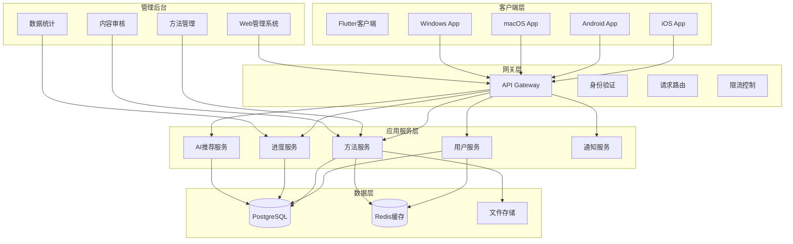

### 2.2 技术栈选型

| 层级 | 技术选型 | 选型理由 |
|------|---------|---------|
| 前端框架 | Flutter (Dart) | 单一代码库支持全平台，性能优异，UI组件丰富 |
| UI组件库 | Material + Cupertino | 同时支持Android和iOS原生风格 |
| 状态管理 | Bloc模式 | 适合复杂状态管理，可预测性强，便于测试 |
| 本地存储 | shared_preferences + sqflite | 轻量级配置存储 + 结构化离线数据 |
| 网络通信 | http + dio | 基础请求 + 高级功能（拦截器、取消等） |
| 本地通知 | flutter_local_notifications | 跨平台提醒功能 |
| 多媒体播放 | just_audio + video_player | 音频和视频内容播放 |
| 后端框架 | Node.js + Express (TypeScript) | 高并发性能，生态成熟，开发效率高 |
| 数据库 | PostgreSQL | 支持复杂查询，事务完整性强 |
| 缓存 | Redis | 高性能会话管理和热点数据缓存 |
| 文件存储 | 本地文件系统 | 适合本地部署场景 |
| 容器化 | Docker + Docker Compose | 一键部署，环境隔离 |
| 管理后台 | React + Ant Design | 成熟的后台UI框架，开发效率高 |

## 3. 功能模块设计

### 3.1 用户端功能模块

#### 3.1.1 用户认证模块

**功能描述**：
用户通过邮箱密码注册登录，系统维护用户会话状态。

**核心流程**：

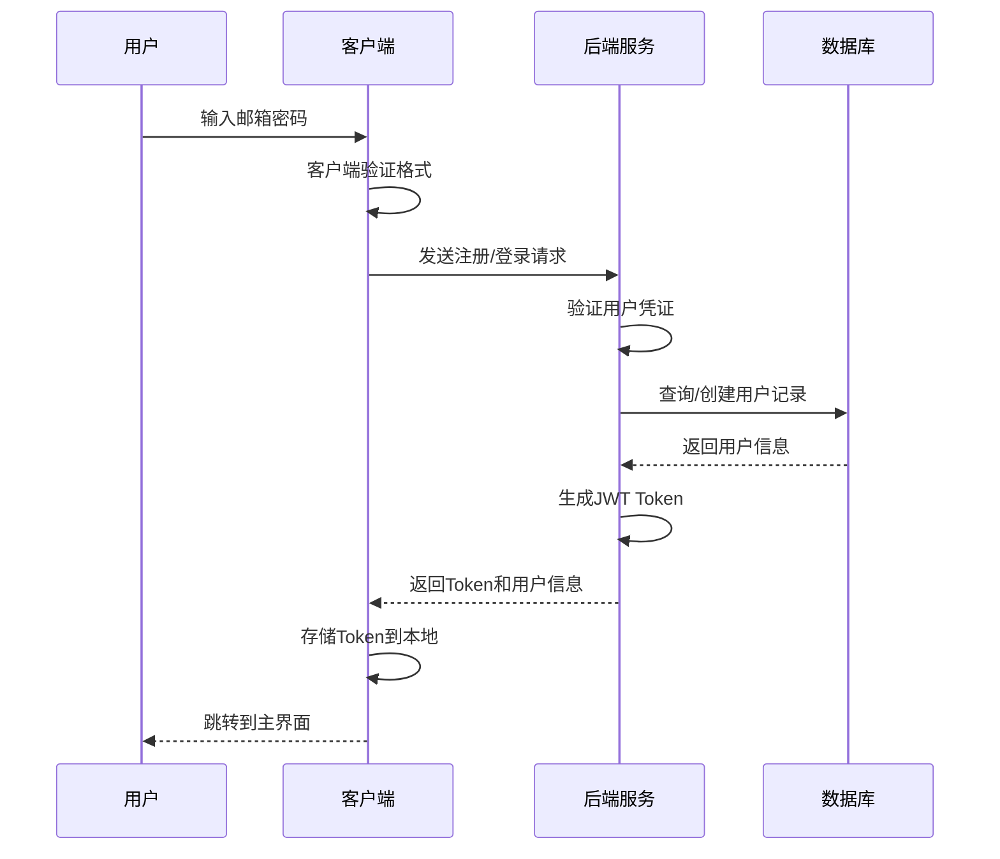

**数据验证规则**：
- 邮箱格式必须符合RFC 5322标准
- 密码长度至少8位，包含字母和数字
- 密码使用bcrypt加密存储，salt rounds为10

**会话管理策略**：
- Token有效期为7天
- Token存储在客户端安全存储中
- 每次API请求携带Token进行身份验证
- Token过期后自动跳转到登录页面

#### 3.1.2 方法浏览与选择模块

**功能描述**：
用户可以浏览所有心理自助方法，根据分类筛选，查看详情，并将感兴趣的方法添加到个人方法库。

**方法展示结构**：

| 字段 | 类型 | 说明 |
|------|------|------|
| 标题 | 文本 | 方法名称，不超过50字符 |
| 简介 | 文本 | 方法简短描述，不超过200字符 |
| 分类 | 枚举 | 放松技巧、认知调整、情绪管理、行为激活等 |
| 难度等级 | 枚举 | 入门、进阶、高级 |
| 预计时长 | 数值 | 单次练习建议时长（分钟） |
| 封面图片 | 文件URL | 方法封面展示图 |
| 内容类型 | 标签数组 | 文本、图片、音频、视频、交互式 |

**筛选和搜索能力**：
- 按分类筛选
- 按难度等级筛选
- 按时长范围筛选
- 关键词搜索标题和描述
- AI智能推荐（基于用户历史行为）

#### 3.1.3 方法详情与内容展示模块

**功能描述**：
提供方法的完整内容展示，支持文本、图片、音频、视频和交互式练习等多种内容形式。

**内容组织结构**：

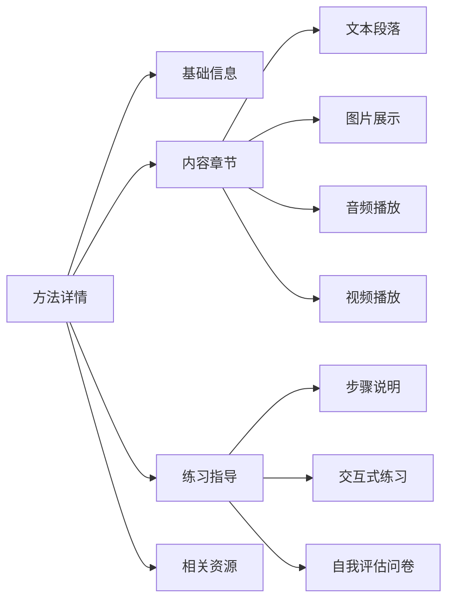

**多媒体内容处理**：
- 图片支持缩放和预览
- 音频支持播放、暂停、进度条控制
- 视频支持全屏播放、倍速播放
- 大文件内容支持断点续传下载
- 已下载内容缓存到本地，支持离线访问

**交互式练习设计**：
- 问卷填写：多选、单选、量表评分
- 引导式冥想：配合音频的文字提示
- 记录表单：用户自由输入心得和感受
- 进度追踪：系统记录完成状态

#### 3.1.4 个人方法库模块

**功能描述**：
用户选择的方法集中管理，展示学习进度和历史记录。

**进度追踪维度**：

| 维度 | 数据项 | 说明 |
|------|--------|------|
| 完成度 | 完成次数、目标次数 | 用户设定目标，系统统计实际完成 |
| 时长统计 | 累计练习时长 | 记录每次练习的实际时长 |
| 连续性 | 连续打卡天数 | 激励用户坚持练习 |
| 心理状态 | 练习前后评分 | 1-10分量表，评估心理状态变化 |
| 个人心得 | 文本记录 | 用户自由记录练习感受和收获 |
| 完成时间 | 时间戳数组 | 记录每次练习的完成时间 |

**数据可视化**：
- 周/月进度日历热力图
- 心理状态变化趋势曲线
- 各方法练习时长占比饼图
- 连续打卡成就展示

#### 3.1.5 AI推荐模块

**功能描述**：
基于用户历史行为和偏好，智能推荐适合的心理自助方法。

**推荐策略**：

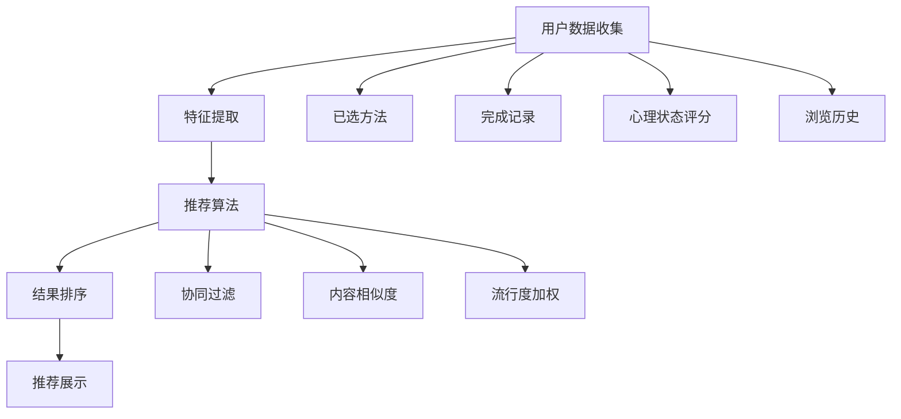

**推荐算法逻辑**：
- 协同过滤：推荐相似用户喜欢的方法
- 内容相似度：推荐与用户已选方法相似的内容
- 状态匹配：根据用户心理状态评分推荐适合的方法
- 新颖性平衡：避免推荐结果过于集中，保持多样性

**推荐触发时机**：
- 首页智能推荐区域（固定3-5个推荐）
- 用户完成一个方法后的推荐
- 用户首次使用时的新手引导推荐

#### 3.1.6 提醒通知模块

**功能描述**：
定时提醒用户进行心理练习，支持自定义提醒时间和频率。

**提醒类型**：

| 提醒类型 | 触发条件 | 内容策略 |
|---------|---------|---------|
| 定时提醒 | 用户设定的固定时间 | 提醒用户进行今日练习 |
| 打卡提醒 | 用户连续打卡后中断 | 鼓励用户继续坚持 |
| 目标提醒 | 接近完成目标时 | 激励用户完成目标 |
| 新方法推荐 | 系统更新内容后 | 通知用户有新方法上线 |

**提醒配置选项**：
- 开启/关闭提醒功能
- 选择提醒时间（支持多个时间段）
- 选择提醒频率（每天、工作日、周末、自定义）
- 选择提醒方式（通知、静音、震动）

### 3.2 管理后台功能模块

#### 3.2.1 管理员权限模块

**功能描述**：
管理后台支持多管理员使用，具备完整的权限管理体系。

**角色定义**：

| 角色 | 权限范围 | 说明 |
|------|---------|------|
| 超级管理员 | 所有权限 | 可管理其他管理员账号 |
| 内容管理员 | 方法CRUD、内容审核 | 负责内容维护和审核 |
| 数据分析员 | 只读数据统计 | 查看用户数据和统计报表 |

**权限控制粒度**：
- 方法管理：创建、编辑、删除、发布、下架
- 内容审核：审核待发布内容
- 用户管理：查看用户信息、禁用账号
- 数据统计：查看各类数据报表
- 系统配置：修改系统参数

#### 3.2.2 方法内容管理模块

**功能描述**：
提供完整的CRUD界面，管理员可便捷地维护心理自助方法库。

**方法创建流程**：

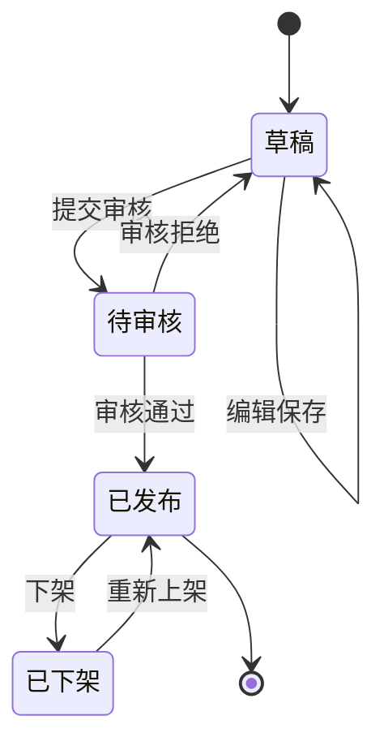

**内容编辑界面**：

表单字段设计：

| 字段组 | 字段项 | 输入方式 | 验证规则 |
|--------|--------|---------|---------|
| 基础信息 | 标题 | 文本输入 | 必填，最多50字符 |
| 基础信息 | 简介 | 多行文本 | 必填，最多200字符 |
| 基础信息 | 分类 | 下拉选择 | 必填，单选 |
| 基础信息 | 难度等级 | 单选按钮 | 必填 |
| 基础信息 | 预计时长 | 数字输入 | 必填，正整数 |
| 封面图片 | 图片文件 | 文件上传 | 必填，支持jpg/png，最大2MB |
| 内容章节 | 章节列表 | 动态表单 | 至少一个章节 |
| 章节内容 | 章节标题 | 文本输入 | 必填，最多30字符 |
| 章节内容 | 内容类型 | 多选框 | 至少选一种 |
| 章节内容 | 文本内容 | 富文本编辑器 | 可选 |
| 章节内容 | 图片内容 | 多文件上传 | 可选，每张最大5MB |
| 章节内容 | 音频内容 | 文件上传 | 可选，支持mp3/m4a，最大50MB |
| 章节内容 | 视频内容 | 文件上传 | 可选，支持mp4，最大200MB |
| 交互式内容 | 练习步骤 | 动态表单 | 可选 |
| 交互式内容 | 评估问卷 | 问卷编辑器 | 可选 |

**批量操作功能**：
- 批量上架/下架
- 批量修改分类
- 批量导出/导入（JSON格式）

#### 3.2.3 内容审核模块

**功能描述**：
待发布内容需经过审核流程，确保内容质量和合规性。

**审核流程**：

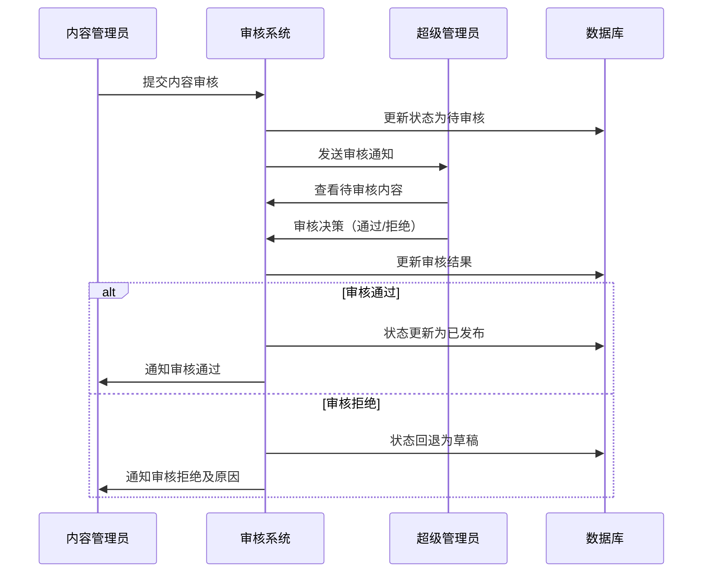

**审核检查点**：
- 内容完整性：必填字段是否完整
- 内容质量：文本是否清晰，多媒体是否正常
- 合规性：内容是否符合心理健康相关规范
- 专业性：方法描述是否准确专业

#### 3.2.4 数据统计模块

**功能描述**：
提供多维度的数据统计和可视化报表，帮助管理员了解应用使用情况。

**统计维度**：

| 统计类别 | 统计指标 | 图表类型 |
|---------|---------|---------|
| 用户统计 | 总用户数、新增用户、活跃用户 | 折线图 |
| 方法统计 | 总方法数、各分类占比、热门方法排行 | 饼图+排行榜 |
| 使用统计 | 方法选择次数、完成次数、平均时长 | 柱状图 |
| 趋势分析 | 日活、周活、月活变化趋势 | 折线图 |
| 心理状态 | 用户整体心理状态评分分布 | 直方图 |

**数据导出功能**：
- 支持导出CSV和Excel格式
- 可选择时间范围和统计维度
- 导出数据脱敏处理，保护用户隐私

## 4. 数据模型设计

### 4.1 核心数据实体

#### 4.1.1 用户表（users）

| 字段名 | 数据类型 | 约束 | 说明 |
|--------|---------|------|------|
| id | SERIAL | PRIMARY KEY | 用户唯一标识 |
| email | VARCHAR(255) | UNIQUE NOT NULL | 用户邮箱 |
| password_hash | VARCHAR(255) | NOT NULL | 加密后的密码 |
| nickname | VARCHAR(50) | | 用户昵称 |
| avatar_url | VARCHAR(255) | | 头像URL |
| created_at | TIMESTAMP | DEFAULT NOW() | 注册时间 |
| last_login_at | TIMESTAMP | | 最后登录时间 |
| is_active | BOOLEAN | DEFAULT TRUE | 账号是否激活 |

#### 4.1.2 心理自助方法表（methods）

| 字段名 | 数据类型 | 约束 | 说明 |
|--------|---------|------|------|
| id | SERIAL | PRIMARY KEY | 方法唯一标识 |
| title | VARCHAR(50) | NOT NULL | 方法标题 |
| description | VARCHAR(200) | NOT NULL | 方法简介 |
| category | VARCHAR(50) | NOT NULL | 方法分类 |
| difficulty | VARCHAR(20) | NOT NULL | 难度等级 |
| duration_minutes | INT | NOT NULL | 预计时长（分钟） |
| cover_image_url | VARCHAR(255) | | 封面图片URL |
| content_json | JSONB | NOT NULL | 方法完整内容（JSON格式） |
| status | VARCHAR(20) | DEFAULT 'draft' | 状态：draft/pending/published/archived |
| view_count | INT | DEFAULT 0 | 浏览次数 |
| select_count | INT | DEFAULT 0 | 被选择次数 |
| created_by | INT | REFERENCES users(id) | 创建人 |
| created_at | TIMESTAMP | DEFAULT NOW() | 创建时间 |
| updated_at | TIMESTAMP | DEFAULT NOW() | 更新时间 |
| published_at | TIMESTAMP | | 发布时间 |

**content_json结构示例**：

```
{
  "chapters": [
    {
      "title": "章节标题",
      "order": 1,
      "contents": [
        {
          "type": "text",
          "data": "文本内容"
        },
        {
          "type": "image",
          "data": "图片URL"
        },
        {
          "type": "audio",
          "data": "音频URL",
          "duration": 300
        },
        {
          "type": "video",
          "data": "视频URL",
          "duration": 600
        }
      ]
    }
  ],
  "exercises": [
    {
      "title": "练习标题",
      "type": "guided",
      "steps": ["步骤1", "步骤2"]
    }
  ],
  "questionnaires": [
    {
      "title": "自我评估",
      "questions": [
        {
          "question": "问题文本",
          "type": "scale",
          "options": [1, 2, 3, 4, 5]
        }
      ]
    }
  ]
}
```

#### 4.1.3 用户方法关联表（user_methods）

| 字段名 | 数据类型 | 约束 | 说明 |
|--------|---------|------|------|
| id | SERIAL | PRIMARY KEY | 关联唯一标识 |
| user_id | INT | REFERENCES users(id) | 用户ID |
| method_id | INT | REFERENCES methods(id) | 方法ID |
| selected_at | TIMESTAMP | DEFAULT NOW() | 选择时间 |
| target_count | INT | DEFAULT 0 | 目标完成次数 |
| completed_count | INT | DEFAULT 0 | 实际完成次数 |
| total_duration_minutes | INT | DEFAULT 0 | 累计练习时长 |
| continuous_days | INT | DEFAULT 0 | 连续打卡天数 |
| last_practice_at | TIMESTAMP | | 最后练习时间 |
| is_favorite | BOOLEAN | DEFAULT FALSE | 是否收藏 |

索引设计：
- 复合唯一索引：(user_id, method_id)
- 普通索引：user_id
- 普通索引：method_id

#### 4.1.4 练习记录表（practice_records）

| 字段名 | 数据类型 | 约束 | 说明 |
|--------|---------|------|------|
| id | SERIAL | PRIMARY KEY | 记录唯一标识 |
| user_id | INT | REFERENCES users(id) | 用户ID |
| method_id | INT | REFERENCES methods(id) | 方法ID |
| practice_date | DATE | NOT NULL | 练习日期 |
| duration_minutes | INT | NOT NULL | 本次练习时长 |
| mood_before | INT | | 练习前心理状态评分（1-10） |
| mood_after | INT | | 练习后心理状态评分（1-10） |
| notes | TEXT | | 用户心得记录 |
| questionnaire_result | JSONB | | 问卷填写结果 |
| created_at | TIMESTAMP | DEFAULT NOW() | 记录创建时间 |

索引设计：
- 复合索引：(user_id, practice_date)
- 复合索引：(user_id, method_id)

#### 4.1.5 提醒设置表（reminder_settings）

| 字段名 | 数据类型 | 约束 | 说明 |
|--------|---------|------|------|
| id | SERIAL | PRIMARY KEY | 设置唯一标识 |
| user_id | INT | REFERENCES users(id) UNIQUE | 用户ID |
| enabled | BOOLEAN | DEFAULT TRUE | 是否开启提醒 |
| reminder_times | JSONB | NOT NULL | 提醒时间配置 |
| reminder_days | JSONB | NOT NULL | 提醒日期配置 |
| notification_type | VARCHAR(20) | DEFAULT 'all' | 通知方式：all/silent/vibrate |
| created_at | TIMESTAMP | DEFAULT NOW() | 创建时间 |
| updated_at | TIMESTAMP | DEFAULT NOW() | 更新时间 |

**reminder_times和reminder_days结构示例**：

```
reminder_times: ["08:00", "20:00"]
reminder_days: {
  "type": "daily" | "weekdays" | "weekends" | "custom",
  "custom_days": [1, 3, 5]  // 仅当type为custom时有效
}
```

#### 4.1.6 管理员表（admins）

| 字段名 | 数据类型 | 约束 | 说明 |
|--------|---------|------|------|
| id | SERIAL | PRIMARY KEY | 管理员唯一标识 |
| username | VARCHAR(50) | UNIQUE NOT NULL | 管理员用户名 |
| password_hash | VARCHAR(255) | NOT NULL | 加密后的密码 |
| role | VARCHAR(20) | NOT NULL | 角色：super_admin/content_admin/analyst |
| email | VARCHAR(255) | UNIQUE NOT NULL | 管理员邮箱 |
| is_active | BOOLEAN | DEFAULT TRUE | 是否激活 |
| created_at | TIMESTAMP | DEFAULT NOW() | 创建时间 |
| last_login_at | TIMESTAMP | | 最后登录时间 |

#### 4.1.7 审核记录表（audit_logs）

| 字段名 | 数据类型 | 约束 | 说明 |
|--------|---------|------|------|
| id | SERIAL | PRIMARY KEY | 记录唯一标识 |
| method_id | INT | REFERENCES methods(id) | 方法ID |
| admin_id | INT | REFERENCES admins(id) | 审核人ID |
| action | VARCHAR(20) | NOT NULL | 操作：submit/approve/reject |
| status_before | VARCHAR(20) | | 操作前状态 |
| status_after | VARCHAR(20) | | 操作后状态 |
| comment | TEXT | | 审核意见 |
| created_at | TIMESTAMP | DEFAULT NOW() | 操作时间 |

### 4.2 数据关系图

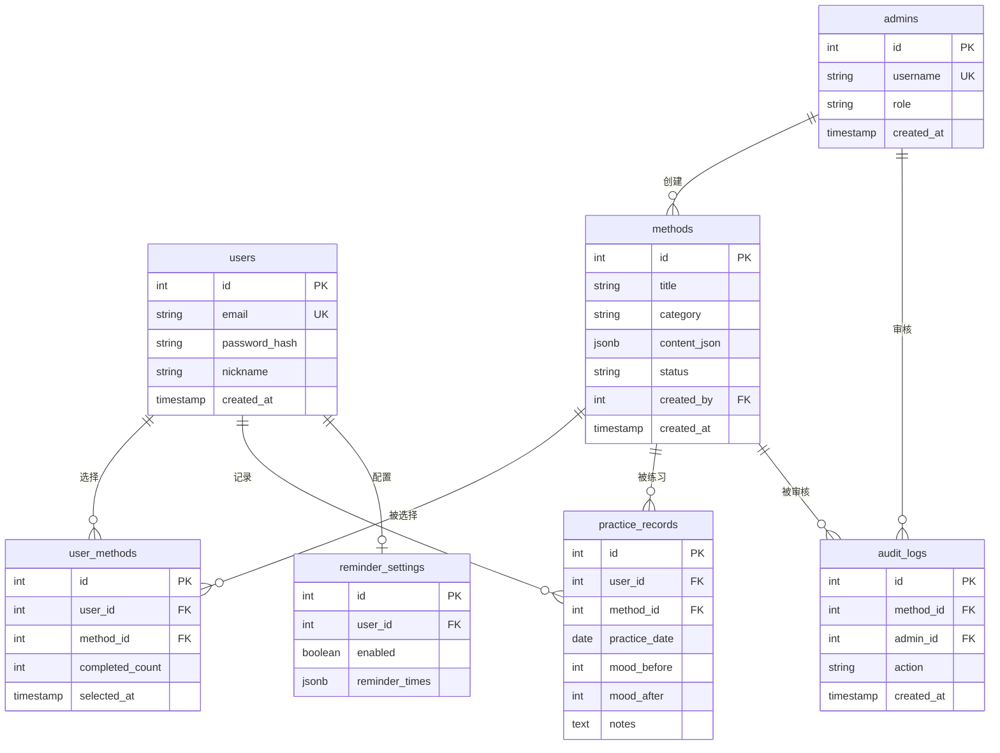

## 5. API接口设计

### 5.1 用户端API

#### 5.1.1 用户认证接口

**用户注册**

- 接口路径：POST /api/users/register
- 请求体：

| 字段 | 类型 | 必填 | 说明 |
|------|------|------|------|
| email | string | 是 | 用户邮箱 |
| password | string | 是 | 用户密码 |
| nickname | string | 否 | 用户昵称 |

- 响应体：

| 字段 | 类型 | 说明 |
|------|------|------|
| success | boolean | 是否成功 |
| message | string | 提示信息 |
| data.token | string | JWT Token |
| data.user | object | 用户信息对象 |

**用户登录**

- 接口路径：POST /api/users/login
- 请求体：

| 字段 | 类型 | 必填 | 说明 |
|------|------|------|------|
| email | string | 是 | 用户邮箱 |
| password | string | 是 | 用户密码 |

- 响应体：结构同注册接口

**获取当前用户信息**

- 接口路径：GET /api/users/me
- 请求头：Authorization: Bearer {token}
- 响应体：

| 字段 | 类型 | 说明 |
|------|------|------|
| success | boolean | 是否成功 |
| data | object | 用户信息对象 |

#### 5.1.2 方法相关接口

**获取方法列表**

- 接口路径：GET /api/methods
- 查询参数：

| 参数 | 类型 | 必填 | 说明 |
|------|------|------|------|
| category | string | 否 | 分类筛选 |
| difficulty | string | 否 | 难度筛选 |
| keyword | string | 否 | 关键词搜索 |
| page | int | 否 | 页码，默认1 |
| pageSize | int | 否 | 每页数量，默认20 |

- 响应体：

| 字段 | 类型 | 说明 |
|------|------|------|
| success | boolean | 是否成功 |
| data.list | array | 方法列表 |
| data.total | int | 总数 |
| data.page | int | 当前页码 |
| data.pageSize | int | 每页数量 |

**获取方法详情**

- 接口路径：GET /api/methods/:id
- 路径参数：id（方法ID）
- 响应体：

| 字段 | 类型 | 说明 |
|------|------|------|
| success | boolean | 是否成功 |
| data | object | 方法完整信息对象 |

**获取推荐方法**

- 接口路径：GET /api/methods/recommend
- 请求头：Authorization: Bearer {token}
- 查询参数：

| 参数 | 类型 | 必填 | 说明 |
|------|------|------|------|
| limit | int | 否 | 推荐数量，默认5 |

- 响应体：

| 字段 | 类型 | 说明 |
|------|------|------|
| success | boolean | 是否成功 |
| data | array | 推荐方法列表 |

#### 5.1.3 用户方法管理接口

**添加方法到个人库**

- 接口路径：POST /api/user/methods
- 请求头：Authorization: Bearer {token}
- 请求体：

| 字段 | 类型 | 必填 | 说明 |
|------|------|------|------|
| method_id | int | 是 | 方法ID |
| target_count | int | 否 | 目标完成次数 |

- 响应体：

| 字段 | 类型 | 说明 |
|------|------|------|
| success | boolean | 是否成功 |
| message | string | 提示信息 |

**获取个人方法列表**

- 接口路径：GET /api/user/methods
- 请求头：Authorization: Bearer {token}
- 响应体：

| 字段 | 类型 | 说明 |
|------|------|------|
| success | boolean | 是否成功 |
| data | array | 个人方法列表 |

**删除个人方法**

- 接口路径：DELETE /api/user/methods/:id
- 请求头：Authorization: Bearer {token}
- 路径参数：id（user_method关联ID）
- 响应体：标准成功/失败响应

**更新方法目标**

- 接口路径：PUT /api/user/methods/:id
- 请求头：Authorization: Bearer {token}
- 请求体：

| 字段 | 类型 | 必填 | 说明 |
|------|------|------|------|
| target_count | int | 否 | 目标完成次数 |
| is_favorite | boolean | 否 | 是否收藏 |

- 响应体：标准成功/失败响应

#### 5.1.4 练习记录接口

**记录一次练习**

- 接口路径：POST /api/user/practice
- 请求头：Authorization: Bearer {token}
- 请求体：

| 字段 | 类型 | 必填 | 说明 |
|------|------|------|------|
| method_id | int | 是 | 方法ID |
| duration_minutes | int | 是 | 练习时长 |
| mood_before | int | 否 | 练习前心理状态（1-10） |
| mood_after | int | 否 | 练习后心理状态（1-10） |
| notes | string | 否 | 心得记录 |
| questionnaire_result | object | 否 | 问卷结果 |

- 响应体：标准成功/失败响应

**获取练习历史**

- 接口路径：GET /api/user/practice
- 请求头：Authorization: Bearer {token}
- 查询参数：

| 参数 | 类型 | 必填 | 说明 |
|------|------|------|------|
| method_id | int | 否 | 筛选特定方法 |
| start_date | string | 否 | 开始日期 YYYY-MM-DD |
| end_date | string | 否 | 结束日期 YYYY-MM-DD |
| page | int | 否 | 页码 |
| pageSize | int | 否 | 每页数量 |

- 响应体：

| 字段 | 类型 | 说明 |
|------|------|------|
| success | boolean | 是否成功 |
| data.list | array | 练习记录列表 |
| data.total | int | 总数 |

**获取练习统计**

- 接口路径：GET /api/user/practice/statistics
- 请求头：Authorization: Bearer {token}
- 查询参数：

| 参数 | 类型 | 必填 | 说明 |
|------|------|------|------|
| period | string | 否 | 统计周期：week/month/year，默认month |

- 响应体：

| 字段 | 类型 | 说明 |
|------|------|------|
| success | boolean | 是否成功 |
| data.total_practices | int | 总练习次数 |
| data.total_duration | int | 总时长 |
| data.continuous_days | int | 连续打卡天数 |
| data.mood_trend | array | 心理状态趋势数据 |
| data.method_distribution | array | 方法练习分布 |

#### 5.1.5 提醒设置接口

**获取提醒设置**

- 接口路径：GET /api/user/reminder
- 请求头：Authorization: Bearer {token}
- 响应体：

| 字段 | 类型 | 说明 |
|------|------|------|
| success | boolean | 是否成功 |
| data | object | 提醒设置对象 |

**更新提醒设置**

- 接口路径：PUT /api/user/reminder
- 请求头：Authorization: Bearer {token}
- 请求体：

| 字段 | 类型 | 必填 | 说明 |
|------|------|------|------|
| enabled | boolean | 否 | 是否开启 |
| reminder_times | array | 否 | 提醒时间数组 |
| reminder_days | object | 否 | 提醒日期配置 |
| notification_type | string | 否 | 通知方式 |

- 响应体：标准成功/失败响应

### 5.2 管理后台API

#### 5.2.1 管理员认证接口

**管理员登录**

- 接口路径：POST /api/admin/login
- 请求体：

| 字段 | 类型 | 必填 | 说明 |
|------|------|------|------|
| username | string | 是 | 管理员用户名 |
| password | string | 是 | 密码 |

- 响应体：

| 字段 | 类型 | 说明 |
|------|------|------|
| success | boolean | 是否成功 |
| data.token | string | JWT Token |
| data.admin | object | 管理员信息 |

#### 5.2.2 方法管理接口

**创建方法**

- 接口路径：POST /api/admin/methods
- 请求头：Authorization: Bearer {token}
- 请求体：方法完整信息对象（参考数据模型）
- 响应体：

| 字段 | 类型 | 说明 |
|------|------|------|
| success | boolean | 是否成功 |
| data.id | int | 新创建的方法ID |
| message | string | 提示信息 |

**更新方法**

- 接口路径：PUT /api/admin/methods/:id
- 请求头：Authorization: Bearer {token}
- 请求体：方法信息对象（部分字段）
- 响应体：标准成功/失败响应

**删除方法**

- 接口路径：DELETE /api/admin/methods/:id
- 请求头：Authorization: Bearer {token}
- 响应体：标准成功/失败响应

**获取所有方法（含草稿）**

- 接口路径：GET /api/admin/methods
- 请求头：Authorization: Bearer {token}
- 查询参数：

| 参数 | 类型 | 必填 | 说明 |
|------|------|------|------|
| status | string | 否 | 状态筛选 |
| page | int | 否 | 页码 |
| pageSize | int | 否 | 每页数量 |

- 响应体：分页列表响应

**批量更新状态**

- 接口路径：POST /api/admin/methods/batch-update
- 请求头：Authorization: Bearer {token}
- 请求体：

| 字段 | 类型 | 必填 | 说明 |
|------|------|------|------|
| method_ids | array | 是 | 方法ID数组 |
| status | string | 是 | 目标状态 |

- 响应体：标准成功/失败响应

#### 5.2.3 内容审核接口

**提交审核**

- 接口路径：POST /api/admin/methods/:id/submit
- 请求头：Authorization: Bearer {token}
- 响应体：标准成功/失败响应

**审核通过**

- 接口路径：POST /api/admin/methods/:id/approve
- 请求头：Authorization: Bearer {token}
- 请求体：

| 字段 | 类型 | 必填 | 说明 |
|------|------|------|------|
| comment | string | 否 | 审核意见 |

- 响应体：标准成功/失败响应

**审核拒绝**

- 接口路径：POST /api/admin/methods/:id/reject
- 请求头：Authorization: Bearer {token}
- 请求体：

| 字段 | 类型 | 必填 | 说明 |
|------|------|------|------|
| comment | string | 是 | 拒绝原因 |

- 响应体：标准成功/失败响应

**获取待审核列表**

- 接口路径：GET /api/admin/methods/pending
- 请求头：Authorization: Bearer {token}
- 响应体：待审核方法列表

#### 5.2.4 数据统计接口

**获取用户统计**

- 接口路径：GET /api/admin/statistics/users
- 请求头：Authorization: Bearer {token}
- 查询参数：

| 参数 | 类型 | 必填 | 说明 |
|------|------|------|------|
| start_date | string | 否 | 开始日期 |
| end_date | string | 否 | 结束日期 |

- 响应体：

| 字段 | 类型 | 说明 |
|------|------|------|
| success | boolean | 是否成功 |
| data.total_users | int | 总用户数 |
| data.new_users | int | 新增用户数 |
| data.active_users | int | 活跃用户数 |
| data.trend | array | 趋势数据 |

**获取方法统计**

- 接口路径：GET /api/admin/statistics/methods
- 请求头：Authorization: Bearer {token}
- 响应体：

| 字段 | 类型 | 说明 |
|------|------|------|
| success | boolean | 是否成功 |
| data.total_methods | int | 总方法数 |
| data.category_distribution | array | 分类分布 |
| data.popular_methods | array | 热门方法排行 |

**获取练习统计**

- 接口路径：GET /api/admin/statistics/practices
- 请求头：Authorization: Bearer {token}
- 查询参数：同用户统计
- 响应体：

| 字段 | 类型 | 说明 |
|------|------|------|
| success | boolean | 是否成功 |
| data.total_practices | int | 总练习次数 |
| data.average_duration | float | 平均时长 |
| data.method_usage | array | 方法使用统计 |

**导出统计数据**

- 接口路径：GET /api/admin/statistics/export
- 请求头：Authorization: Bearer {token}
- 查询参数：

| 参数 | 类型 | 必填 | 说明 |
|------|------|------|------|
| type | string | 是 | 导出类型：users/methods/practices |
| format | string | 否 | 格式：csv/excel，默认csv |
| start_date | string | 否 | 开始日期 |
| end_date | string | 否 | 结束日期 |

- 响应：文件流

#### 5.2.5 文件上传接口

**上传图片**

- 接口路径：POST /api/admin/upload/image
- 请求头：Authorization: Bearer {token}
- 请求体：multipart/form-data，字段名file
- 文件限制：支持jpg/png，最大5MB
- 响应体：

| 字段 | 类型 | 说明 |
|------|------|------|
| success | boolean | 是否成功 |
| data.url | string | 图片访问URL |

**上传音频**

- 接口路径：POST /api/admin/upload/audio
- 请求头：Authorization: Bearer {token}
- 请求体：multipart/form-data
- 文件限制：支持mp3/m4a，最大50MB
- 响应体：同图片上传

**上传视频**

- 接口路径：POST /api/admin/upload/video
- 请求头：Authorization: Bearer {token}
- 请求体：multipart/form-data
- 文件限制：支持mp4，最大200MB
- 响应体：同图片上传

### 5.3 API通用规范

#### 5.3.1 请求规范

**请求头标准**：
- Content-Type: application/json（POST/PUT请求）
- Authorization: Bearer {token}（需要认证的接口）
- X-Client-Version: 客户端版本号
- X-Platform: ios/android/macos/windows

**分页参数标准**：
- page: 页码，从1开始
- pageSize: 每页数量，默认20，最大100

#### 5.3.2 响应规范

**成功响应格式**：

```
{
  "success": true,
  "data": {},
  "message": "操作成功"
}
```

**失败响应格式**：

```
{
  "success": false,
  "error": {
    "code": "ERROR_CODE",
    "message": "错误描述"
  }
}
```

**错误码定义**：

| 错误码 | HTTP状态码 | 说明 |
|--------|-----------|------|
| AUTH_FAILED | 401 | 认证失败 |
| TOKEN_EXPIRED | 401 | Token过期 |
| PERMISSION_DENIED | 403 | 权限不足 |
| NOT_FOUND | 404 | 资源不存在 |
| VALIDATION_ERROR | 400 | 参数验证失败 |
| DUPLICATE_ENTRY | 409 | 数据重复 |
| SERVER_ERROR | 500 | 服务器内部错误 |

## 6. 客户端设计

### 6.1 Flutter应用架构

#### 6.1.1 项目结构

```
lib/
├── main.dart                          # 应用入口
├── app.dart                           # 应用根组件
├── core/                              # 核心功能
│   ├── constants/                     # 常量定义
│   │   ├── api_constants.dart        # API地址常量
│   │   ├── app_constants.dart        # 应用常量
│   │   └── storage_keys.dart         # 存储键名
│   ├── network/                       # 网络层
│   │   ├── api_client.dart           # API客户端封装
│   │   ├── interceptors.dart         # 请求拦截器
│   │   └── api_exception.dart        # API异常处理
│   ├── storage/                       # 存储层
│   │   ├── local_storage.dart        # 本地存储封装
│   │   └── database_helper.dart      # 数据库辅助
│   ├── utils/                         # 工具类
│   │   ├── date_utils.dart           # 日期工具
│   │   ├── validator.dart            # 验证工具
│   │   └── logger.dart               # 日志工具
│   └── themes/                        # 主题配置
│       ├── app_theme.dart            # 主题定义
│       └── app_colors.dart           # 颜色定义
├── data/                              # 数据层
│   ├── models/                        # 数据模型
│   │   ├── user.dart                 # 用户模型
│   │   ├── method.dart               # 方法模型
│   │   ├── practice_record.dart      # 练习记录模型
│   │   └── reminder_setting.dart     # 提醒设置模型
│   ├── repositories/                  # 数据仓库
│   │   ├── user_repository.dart      # 用户数据仓库
│   │   ├── method_repository.dart    # 方法数据仓库
│   │   └── practice_repository.dart  # 练习数据仓库
│   └── providers/                     # 数据提供者
│       ├── auth_provider.dart        # 认证状态提供者
│       └── cache_provider.dart       # 缓存提供者
├── blocs/                             # 业务逻辑组件
│   ├── auth/                          # 认证Bloc
│   │   ├── auth_bloc.dart
│   │   ├── auth_event.dart
│   │   └── auth_state.dart
│   ├── method/                        # 方法Bloc
│   │   ├── method_bloc.dart
│   │   ├── method_event.dart
│   │   └── method_state.dart
│   ├── practice/                      # 练习Bloc
│   │   ├── practice_bloc.dart
│   │   ├── practice_event.dart
│   │   └── practice_state.dart
│   └── reminder/                      # 提醒Bloc
│       ├── reminder_bloc.dart
│       ├── reminder_event.dart
│       └── reminder_state.dart
├── ui/                                # 界面层
│   ├── pages/                         # 页面
│   │   ├── auth/                      # 认证相关页面
│   │   │   ├── login_page.dart
│   │   │   └── register_page.dart
│   │   ├── home/                      # 主页
│   │   │   ├── home_page.dart
│   │   │   └── widgets/
│   │   ├── method/                    # 方法相关页面
│   │   │   ├── method_list_page.dart
│   │   │   ├── method_detail_page.dart
│   │   │   └── widgets/
│   │   ├── practice/                  # 练习相关页面
│   │   │   ├── practice_page.dart
│   │   │   ├── practice_history_page.dart
│   │   │   └── widgets/
│   │   ├── profile/                   # 个人中心
│   │   │   ├── profile_page.dart
│   │   │   ├── settings_page.dart
│   │   │   └── widgets/
│   │   └── statistics/                # 统计页面
│   │       ├── statistics_page.dart
│   │       └── widgets/
│   ├── widgets/                       # 通用组件
│   │   ├── common_button.dart
│   │   ├── common_input.dart
│   │   ├── loading_indicator.dart
│   │   ├── empty_state.dart
│   │   └── error_widget.dart
│   └── routes/                        # 路由配置
│       └── app_router.dart
└── services/                          # 服务层
    ├── notification_service.dart      # 通知服务
    ├── audio_service.dart             # 音频服务
    ├── video_service.dart             # 视频服务
    └── analytics_service.dart         # 分析服务
```

#### 6.1.2 状态管理策略

**Bloc模式应用**：

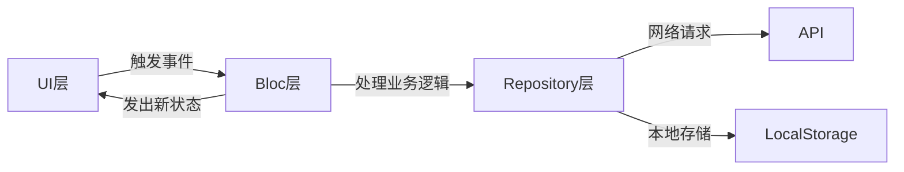

**状态管理原则**：
- 每个功能模块独立的Bloc
- UI组件不直接访问Repository，必须通过Bloc
- 状态不可变，每次更新产生新状态对象
- 使用BlocBuilder进行UI响应式更新
- 使用BlocListener处理副作用（导航、提示等）

#### 6.1.3 数据缓存策略

**缓存层级**：

| 层级 | 存储方式 | 用途 | 有效期 |
|------|---------|------|--------|
| 内存缓存 | 变量 | 当前会话热点数据 | 应用生命周期 |
| 本地配置 | shared_preferences | 用户偏好、Token | 永久 |
| 数据库缓存 | sqflite | 方法列表、练习记录 | 可配置 |
| 文件缓存 | 文件系统 | 图片、音视频 | 可配置 |

**缓存更新策略**：
- 方法列表：首次加载从缓存读取，后台更新，下次启动生效
- 方法详情：优先缓存，检测版本变化后更新
- 用户数据：实时同步到服务器，本地缓存作为离线备份
- 多媒体文件：渐进式下载，支持断点续传

#### 6.1.4 离线功能设计

**离线能力范围**：
- 已缓存的方法内容可离线浏览
- 已下载的多媒体文件可离线播放
- 练习记录本地保存，联网后自动同步
- 离线期间的用户操作队列化处理

**数据同步机制**：

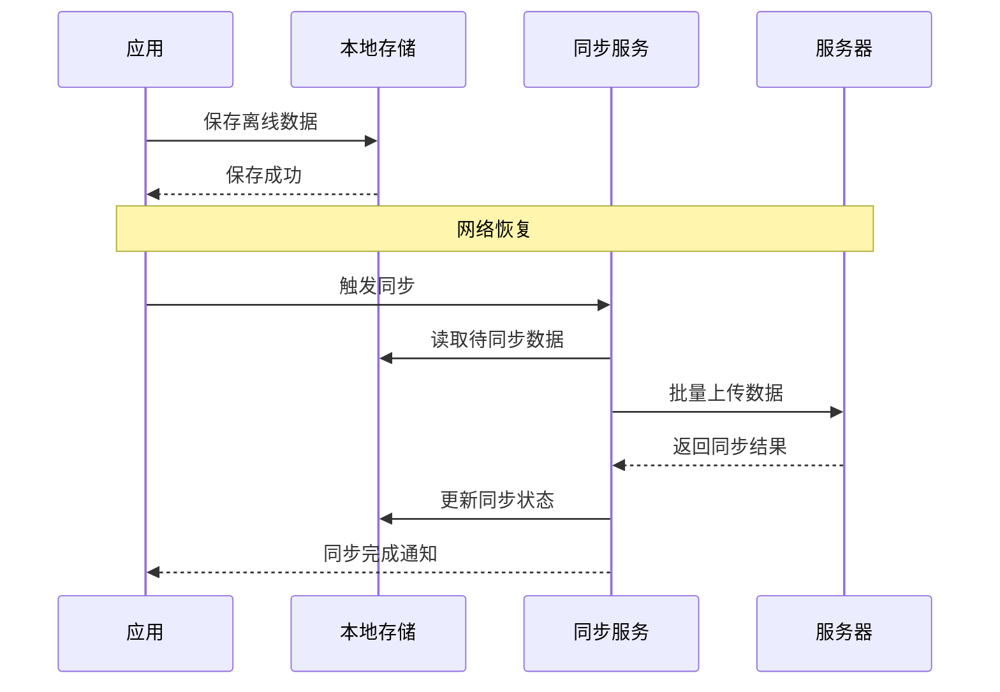

**冲突处理策略**：
- 用户数据：服务器优先
- 练习记录：合并本地和服务器记录
- 方法内容：服务器版本优先，本地缓存失效

### 6.2 平台适配

#### 6.2.1 移动端适配（iOS/Android）

**UI适配策略**：
- iOS使用Cupertino组件风格
- Android使用Material组件风格
- 根据平台自动切换导航模式（标签栏/底部导航）
- 遵循各平台的人机交互指南

**系统功能集成**：
- 本地通知推送
- 后台音频播放
- 系统分享功能
- 生物识别登录（指纹、面容）

#### 6.2.2 桌面端适配（macOS/Windows）

**UI适配调整**：
- 响应式布局，适配大屏幕尺寸
- 支持窗口拖拽缩放
- 支持鼠标悬停和键盘快捷键
- 菜单栏和系统托盘集成

**桌面特性支持**：
- 窗口最小化到系统托盘
- 系统通知中心集成
- 多窗口支持（可选）
- 文件拖放支持

#### 6.2.3 跨平台一致性

**保持一致的功能**：
- 核心业务逻辑完全一致
- 数据同步实时同步
- 用户体验流程一致

**允许差异的部分**：
- UI组件样式（遵循平台规范）
- 交互方式（触摸/鼠标）
- 系统集成特性（通知、分享等）

## 7. 部署方案设计

### 7.1 Docker部署架构

#### 7.1.1 容器组成

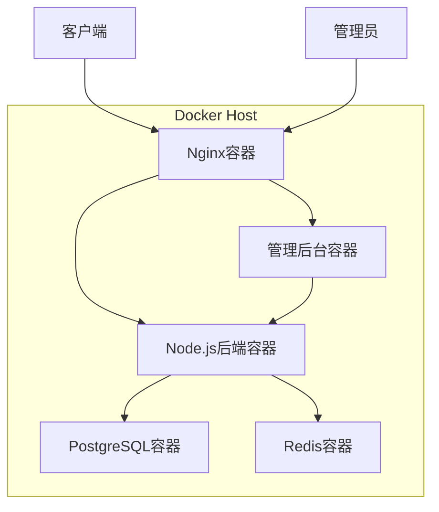

**容器职责**：

| 容器名称 | 基础镜像 | 端口映射 | 职责 |
|---------|---------|---------|------|
| nginx | nginx:alpine | 80:80, 443:443 | 反向代理、静态文件服务 |
| backend | node:18-alpine | 3000:3000 | 后端API服务 |
| postgres | postgres:15 | 5432:5432 | 数据库服务 |
| redis | redis:7-alpine | 6379:6379 | 缓存服务 |
| admin-web | nginx:alpine | 8080:80 | 管理后台前端 |

#### 7.1.2 Docker Compose配置

**服务编排设计**：

核心服务配置说明：

**Nginx服务**：
- 作为反向代理和静态资源服务器
- 将API请求转发到后端服务
- 将管理后台请求转发到admin-web服务
- 配置文件挂载到宿主机便于自定义

**Backend服务**：
- Node.js应用容器
- 依赖postgres和redis服务启动
- 环境变量配置数据库和Redis连接
- 文件上传目录挂载到宿主机持久化

**Postgres服务**：
- PostgreSQL数据库
- 数据目录挂载到宿主机持久化
- 通过环境变量配置用户名和密码
- 健康检查确保服务就绪

**Redis服务**：
- Redis缓存服务
- 数据持久化到宿主机
- 健康检查监控服务状态

**Admin-web服务**：
- 管理后台静态文件服务
- 通过Nginx提供Web访问

#### 7.1.3 环境变量配置

**后端服务环境变量**：

| 变量名 | 说明 | 默认值 |
|--------|------|--------|
| NODE_ENV | 运行环境 | production |
| PORT | 服务端口 | 3000 |
| DB_HOST | 数据库地址 | postgres |
| DB_PORT | 数据库端口 | 5432 |
| DB_NAME | 数据库名 | mental_app |
| DB_USER | 数据库用户 | postgres |
| DB_PASSWORD | 数据库密码 | 需配置 |
| REDIS_HOST | Redis地址 | redis |
| REDIS_PORT | Redis端口 | 6379 |
| JWT_SECRET | JWT密钥 | 需配置 |
| UPLOAD_PATH | 文件上传路径 | /app/uploads |

**数据库环境变量**：

| 变量名 | 说明 | 默认值 |
|--------|------|--------|
| POSTGRES_DB | 数据库名 | mental_app |
| POSTGRES_USER | 用户名 | postgres |
| POSTGRES_PASSWORD | 密码 | 需配置 |

### 7.2 部署流程

#### 7.2.1 环境准备

**系统要求**：
- 操作系统：Linux（推荐Ubuntu 20.04+）或macOS或Windows（需WSL2）
- Docker版本：20.10+
- Docker Compose版本：2.0+
- 磁盘空间：至少20GB可用空间
- 内存：至少4GB

**安装Docker和Docker Compose**：
- Linux系统按官方文档安装Docker Engine和Docker Compose插件
- macOS和Windows系统安装Docker Desktop（已包含Compose）

#### 7.2.2 部署步骤

**第一步：获取部署包**

部署包应包含以下内容：
- docker-compose.yml文件
- nginx配置文件
- 后端代码和Dockerfile
- 管理后台构建产物
- 数据库初始化脚本
- 环境变量配置模板

**第二步：配置环境变量**

复制环境变量模板文件，根据实际情况修改配置：
- 数据库密码
- JWT密钥
- Redis配置
- 文件存储路径

**第三步：初始化数据库**

执行数据库初始化脚本：
- 创建数据库表结构
- 插入默认管理员账号
- 插入示例方法数据（可选）

**第四步：启动服务**

使用Docker Compose一键启动所有服务，后台运行模式。

**第五步：验证部署**

检查所有容器是否正常运行，测试API健康检查接口，访问管理后台登录页面。

#### 7.2.3 数据库初始化

**初始化SQL脚本内容**：
- 创建所有数据表（参考数据模型设计）
- 创建必要的索引
- 插入默认超级管理员账号
- 插入方法分类枚举数据
- 插入示例心理自助方法（可选）

**管理员默认账号**：
- 用户名：admin
- 初始密码：admin123456（首次登录强制修改）
- 角色：super_admin

### 7.3 运维管理

#### 7.3.1 日志管理

**日志收集策略**：

| 日志类型 | 存储位置 | 保留时间 | 说明 |
|---------|---------|---------|------|
| Nginx访问日志 | /var/log/nginx/access.log | 30天 | HTTP请求日志 |
| Nginx错误日志 | /var/log/nginx/error.log | 30天 | Nginx错误 |
| 后端应用日志 | /app/logs/app.log | 30天 | 应用运行日志 |
| 后端错误日志 | /app/logs/error.log | 90天 | 应用错误日志 |
| PostgreSQL日志 | /var/lib/postgresql/data/log | 30天 | 数据库日志 |

**日志查看方式**：
- 使用docker logs命令查看容器实时日志
- 日志文件挂载到宿主机，可直接访问
- 支持日志文件轮转，避免磁盘占满

#### 7.3.2 备份恢复

**备份策略**：

| 备份对象 | 备份频率 | 备份方式 | 保留策略 |
|---------|---------|---------|---------|
| 数据库 | 每天凌晨2点 | pg_dump全量备份 | 保留最近30天 |
| 上传文件 | 每周一次 | 目录打包 | 保留最近12周 |
| 配置文件 | 修改时 | Git版本控制 | 永久保留 |

**备份脚本**：
提供自动化备份脚本，通过cron定时执行，备份文件命名包含时间戳，自动清理过期备份文件。

**恢复流程**：
- 停止相关服务
- 恢复数据库：使用pg_restore从备份文件恢复
- 恢复文件：解压备份文件到上传目录
- 重启服务并验证数据完整性

#### 7.3.3 监控告警

**监控指标**：

| 监控项 | 指标 | 告警阈值 |
|--------|------|---------|
| 服务可用性 | HTTP健康检查 | 连续3次失败 |
| CPU使用率 | 容器CPU占用 | 持续超过80% |
| 内存使用率 | 容器内存占用 | 持续超过85% |
| 磁盘空间 | 剩余可用空间 | 低于10% |
| 数据库连接数 | 活跃连接数 | 超过最大连接数80% |
| API响应时间 | 平均响应时间 | 超过2秒 |

**监控实现方式**：
- Docker自带的stats命令查看资源使用
- 后端暴露/health健康检查接口
- 定时脚本检查各项指标
- 告警通知通过邮件或webhook发送

#### 7.3.4 服务管理

**常用管理命令**：

| 操作 | 命令说明 |
|------|---------|
| 启动服务 | 使用docker-compose up启动所有服务 |
| 停止服务 | 使用docker-compose down停止并删除容器 |
| 重启服务 | 使用docker-compose restart重启服务 |
| 查看日志 | 使用docker-compose logs查看服务日志 |
| 查看状态 | 使用docker-compose ps查看容器状态 |
| 进入容器 | 使用docker exec进入容器终端 |
| 更新服务 | 拉取新镜像后重新创建容器 |

**服务升级流程**：
- 备份当前数据库和文件
- 拉取最新代码或镜像
- 停止旧服务
- 执行数据库迁移脚本（如有）
- 启动新服务
- 验证功能正常
- 如有问题回滚到备份

### 7.4 安全配置

#### 7.4.1 网络安全

**端口暴露策略**：
- 仅暴露Nginx的80和443端口到外部
- 数据库和Redis端口仅在内部网络访问
- 后端服务端口不直接暴露

**HTTPS配置**：
- 生产环境必须启用HTTPS
- 使用Let's Encrypt免费证书或购买商业证书
- 配置HTTP自动跳转到HTTPS
- 启用HSTS安全头

#### 7.4.2 数据安全

**密码安全**：
- 所有密码使用bcrypt加密存储
- JWT密钥必须设置为强随机字符串
- 数据库密码定期更换
- 禁用默认管理员密码

**文件上传安全**：
- 限制上传文件类型和大小
- 文件名随机化，防止路径遍历
- 上传文件病毒扫描（可选）
- 图片文件二次渲染，清除EXIF信息

#### 7.4.3 访问控制

**API访问限制**：
- 实施请求速率限制，防止暴力破解
- Token有效期控制
- IP白名单（管理后台可选）
- 异常请求自动封禁

**管理后台安全**：
- 管理后台与用户端分离部署
- 管理员登录日志记录
- 敏感操作二次确认
- 会话超时自动登出

## 8. 测试方案设计

### 8.1 测试范围

#### 8.1.1 功能测试

**用户端功能测试**：

| 功能模块 | 测试场景 | 验证点 |
|---------|---------|--------|
| 用户注册 | 正常注册、邮箱重复、密码格式错误 | 注册成功、错误提示准确 |
| 用户登录 | 正常登录、密码错误、Token有效性 | 登录成功、会话保持 |
| 方法浏览 | 列表加载、分类筛选、搜索功能 | 数据正确、筛选准确 |
| 方法详情 | 文本展示、图片加载、音视频播放 | 内容完整、播放正常 |
| 添加方法 | 添加到个人库、重复添加处理 | 添加成功、去重正确 |
| 练习记录 | 记录练习、心得保存、数据同步 | 保存成功、同步及时 |
| 进度统计 | 数据计算、图表展示、日期筛选 | 计算准确、可视化正确 |
| AI推荐 | 推荐结果、推荐理由、更新机制 | 推荐合理、实时更新 |
| 提醒功能 | 设置提醒、触发通知、通知内容 | 准时提醒、内容正确 |
| 离线功能 | 离线浏览、离线记录、数据同步 | 离线可用、同步无误 |

**管理后台功能测试**：

| 功能模块 | 测试场景 | 验证点 |
|---------|---------|--------|
| 管理员登录 | 正常登录、权限验证 | 登录成功、权限正确 |
| 方法创建 | 完整创建、字段验证、文件上传 | 保存成功、验证有效 |
| 方法编辑 | 修改内容、状态变更 | 更新成功、历史保留 |
| 方法删除 | 删除确认、关联数据处理 | 删除成功、数据一致 |
| 内容审核 | 提交审核、审核通过、审核拒绝 | 流程正确、状态更新 |
| 批量操作 | 批量上架、批量下架 | 操作成功、事务完整 |
| 数据统计 | 统计准确性、图表展示、数据导出 | 数据准确、导出正常 |
| 文件上传 | 各类文件上传、大小限制、格式限制 | 上传成功、限制生效 |

#### 8.1.2 跨平台测试

**测试平台覆盖**：

| 平台 | 测试版本 | 测试设备 | 重点测试项 |
|------|---------|---------|-----------|
| iOS | iOS 14+, iOS 17 | iPhone SE, iPhone 15 Pro | UI适配、通知、生物识别 |
| Android | Android 10+, Android 14 | 小米、华为、三星 | UI适配、后台运行、通知 |
| macOS | macOS 12+, macOS 14 | MacBook Pro | 窗口管理、键盘快捷键 |
| Windows | Windows 10, Windows 11 | 台式机、笔记本 | 窗口管理、系统集成 |

**跨平台一致性验证**：
- 核心功能在所有平台表现一致
- 数据同步实时准确
- UI适配各平台规范
- 性能表现符合预期

#### 8.1.3 性能测试

**性能指标要求**：

| 指标 | 目标值 | 测试方法 |
|------|--------|---------|
| 应用启动时间 | < 3秒 | 冷启动计时 |
| 页面切换响应 | < 500ms | 页面导航计时 |
| API响应时间 | < 1秒 | 网络请求监控 |
| 列表滚动帧率 | ≥ 55 FPS | 性能分析工具 |
| 内存占用 | < 200MB | 内存监控 |
| 包大小 | < 50MB | 构建产物检查 |

**并发测试**：
- 模拟100并发用户同时访问
- API接口响应时间不超过2秒
- 数据库连接池不溢出
- 系统无崩溃和错误

### 8.2 测试用例设计

#### 8.2.1 用户注册登录测试用例

**测试用例1：用户正常注册**

| 项目 | 内容 |
|------|------|
| 用例编号 | TC_AUTH_001 |
| 前置条件 | 应用已安装，未登录状态 |
| 测试步骤 | 1. 打开应用，点击注册按钮<br>2. 输入有效邮箱：test@example.com<br>3. 输入符合规则的密码：Test1234<br>4. 点击注册按钮 |
| 预期结果 | 1. 注册成功<br>2. 自动登录并跳转到主页<br>3. Token已保存到本地存储 |
| 实际结果 | 待测试 |
| 测试状态 | 待执行 |

**测试用例2：邮箱重复注册**

| 项目 | 内容 |
|------|------|
| 用例编号 | TC_AUTH_002 |
| 前置条件 | 邮箱test@example.com已注册 |
| 测试步骤 | 1. 尝试使用已注册邮箱test@example.com注册<br>2. 输入密码并提交 |
| 预期结果 | 1. 显示错误提示：该邮箱已被注册<br>2. 注册失败，停留在注册页面 |
| 实际结果 | 待测试 |
| 测试状态 | 待执行 |

**测试用例3：用户正常登录**

| 项目 | 内容 |
|------|------|
| 用例编号 | TC_AUTH_003 |
| 前置条件 | 用户已注册，邮箱test@example.com，密码Test1234 |
| 测试步骤 | 1. 输入邮箱test@example.com<br>2. 输入密码Test1234<br>3. 点击登录按钮 |
| 预期结果 | 1. 登录成功<br>2. 跳转到主页<br>3. Token已保存 |
| 实际结果 | 待测试 |
| 测试状态 | 待执行 |

#### 8.2.2 方法管理测试用例

**测试用例4：浏览方法列表**

| 项目 | 内容 |
|------|------|
| 用例编号 | TC_METHOD_001 |
| 前置条件 | 用户已登录，数据库有至少10个已发布方法 |
| 测试步骤 | 1. 进入方法浏览页面<br>2. 查看方法列表展示<br>3. 滚动加载更多 |
| 预期结果 | 1. 列表正常展示<br>2. 每个方法显示标题、封面、分类、时长<br>3. 滚动流畅，分页加载正常 |
| 实际结果 | 待测试 |
| 测试状态 | 待执行 |

**测试用例5：方法详情多媒体播放**

| 项目 | 内容 |
|------|------|
| 用例编号 | TC_METHOD_002 |
| 前置条件 | 选择一个包含音频和视频的方法 |
| 测试步骤 | 1. 进入方法详情页<br>2. 播放音频内容<br>3. 播放视频内容<br>4. 测试暂停、进度条控制 |
| 预期结果 | 1. 音频正常播放<br>2. 视频正常播放且可全屏<br>3. 控制功能正常<br>4. 后台播放音频不中断 |
| 实际结果 | 待测试 |
| 测试状态 | 待执行 |

**测试用例6：添加方法到个人库**

| 项目 | 内容 |
|------|------|
| 用例编号 | TC_METHOD_003 |
| 前置条件 | 用户已登录，查看方法详情 |
| 测试步骤 | 1. 点击「添加到我的方法」按钮<br>2. 设置目标次数为10次<br>3. 确认添加 |
| 预期结果 | 1. 添加成功提示<br>2. 个人方法库中显示该方法<br>3. 目标次数已设置 |
| 实际结果 | 待测试 |
| 测试状态 | 待执行 |

#### 8.2.3 练习记录测试用例

**测试用例7：记录一次练习**

| 项目 | 内容 |
|------|------|
| 用例编号 | TC_PRACTICE_001 |
| 前置条件 | 用户已添加方法到个人库 |
| 测试步骤 | 1. 进入练习页面<br>2. 选择练习前心理状态：5分<br>3. 完成练习<br>4. 选择练习后心理状态：7分<br>5. 填写心得：感觉放松了很多<br>6. 保存记录 |
| 预期结果 | 1. 记录保存成功<br>2. 完成次数+1<br>3. 连续打卡天数更新<br>4. 数据同步到服务器 |
| 实际结果 | 待测试 |
| 测试状态 | 待执行 |

**测试用例8：查看进度统计**

| 项目 | 内容 |
|------|------|
| 用例编号 | TC_PRACTICE_002 |
| 前置条件 | 用户有至少7天的练习记录 |
| 测试步骤 | 1. 进入统计页面<br>2. 查看周统计数据<br>3. 查看心理状态变化曲线<br>4. 查看方法分布 |
| 预期结果 | 1. 数据计算准确<br>2. 图表正常展示<br>3. 趋势曲线清晰<br>4. 数据可导出 |
| 实际结果 | 待测试 |
| 测试状态 | 待执行 |

#### 8.2.4 管理后台测试用例

**测试用例9：创建心理方法**

| 项目 | 内容 |
|------|------|
| 用例编号 | TC_ADMIN_001 |
| 前置条件 | 管理员已登录，角色为content_admin |
| 测试步骤 | 1. 进入方法管理页面<br>2. 点击创建方法按钮<br>3. 填写标题、简介、分类等基础信息<br>4. 上传封面图片<br>5. 添加章节内容（文本、图片、音频）<br>6. 保存为草稿 |
| 预期结果 | 1. 方法创建成功<br>2. 状态为草稿<br>3. 所有内容正确保存<br>4. 文件上传成功 |
| 实际结果 | 待测试 |
| 测试状态 | 待执行 |

**测试用例10：内容审核流程**

| 项目 | 内容 |
|------|------|
| 用例编号 | TC_ADMIN_002 |
| 前置条件 | 有待审核的方法 |
| 测试步骤 | 1. 内容管理员提交审核<br>2. 超级管理员查看待审核列表<br>3. 查看方法详情<br>4. 点击审核通过 |
| 预期结果 | 1. 方法状态更新为已发布<br>2. 审核记录已保存<br>3. 用户端可见该方法<br>4. 管理员收到审核通过通知 |
| 实际结果 | 待测试 |
| 测试状态 | 待执行 |

#### 8.2.5 跨平台测试用例

**测试用例11：iOS平台功能验证**

| 项目 | 内容 |
|------|------|
| 用例编号 | TC_PLATFORM_001 |
| 前置条件 | iOS应用已安装在iPhone设备上 |
| 测试步骤 | 1. 测试Cupertino风格组件展示<br>2. 测试本地通知推送<br>3. 测试Face ID登录<br>4. 测试后台音频播放 |
| 预期结果 | 1. UI符合iOS设计规范<br>2. 通知正常推送<br>3. 生物识别正常工作<br>4. 后台音频不中断 |
| 实际结果 | 待测试 |
| 测试状态 | 待执行 |

**测试用例12：Windows桌面端适配**

| 项目 | 内容 |
|------|------|
| 用例编号 | TC_PLATFORM_002 |
| 前置条件 | Windows应用已安装 |
| 测试步骤 | 1. 测试窗口缩放<br>2. 测试键盘快捷键<br>3. 测试系统托盘功能<br>4. 测试鼠标交互 |
| 预期结果 | 1. 响应式布局正常<br>2. 快捷键生效<br>3. 托盘菜单可用<br>4. 鼠标悬停效果正确 |
| 实际结果 | 待测试 |
| 测试状态 | 待执行 |

### 8.3 测试环境

#### 8.3.1 测试环境配置

**后端测试环境**：
- 服务器：本地Docker环境
- 数据库：PostgreSQL测试库（独立于生产环境）
- 缓存：Redis测试实例
- 测试数据：预置用户、方法、练习记录等测试数据

**前端测试环境**：
- iOS模拟器：Xcode自带模拟器（多版本）
- Android模拟器：Android Studio AVD（多设备）
- iOS真机：iPhone实体设备
- Android真机：主流品牌设备（小米、华为、三星）
- macOS：MacBook开发机
- Windows：Windows 10/11测试机

#### 8.3.2 测试数据准备

**用户测试数据**：
- 普通用户账号10个
- 管理员账号3个（不同角色）
- 各账号有不同的使用历史

**方法测试数据**：
- 各分类方法至少5个
- 包含不同难度等级
- 包含各种内容类型（纯文本、图片、音频、视频、交互式）
- 包含不同状态（草稿、待审核、已发布、已下架）

**练习记录测试数据**：
- 每个用户有连续的练习记录
- 覆盖不同日期范围
- 包含完整的心理状态评分

### 8.4 测试报告模板

#### 8.4.1 测试报告结构

**测试报告应包含以下章节**：

**1. 测试概述**
- 测试目的
- 测试范围
- 测试时间
- 测试人员

**2. 测试环境**
- 硬件环境
- 软件环境
- 网络环境
- 测试工具

**3. 测试执行情况**
- 测试用例总数
- 执行用例数
- 通过用例数
- 失败用例数
- 阻塞用例数
- 用例通过率

**4. 缺陷统计**

| 缺陷等级 | 数量 | 已修复 | 待修复 | 延期修复 |
|---------|------|--------|--------|----------|
| 致命 | 0 | 0 | 0 | 0 |
| 严重 | 0 | 0 | 0 | 0 |
| 一般 | 0 | 0 | 0 | 0 |
| 轻微 | 0 | 0 | 0 | 0 |
| 合计 | 0 | 0 | 0 | 0 |

**5. 测试结论**
- 功能完整性评估
- 性能表现评估
- 稳定性评估
- 兼容性评估
- 上线建议

**6. 附录**
- 详细测试用例执行记录
- 缺陷详情列表
- 测试截图
- 性能测试数据

#### 8.4.2 缺陷等级定义

| 等级 | 定义 | 示例 |
|------|------|------|
| 致命 | 系统崩溃、数据丢失、安全漏洞 | 应用闪退、数据库损坏、密码明文存储 |
| 严重 | 核心功能无法使用 | 无法登录、无法添加方法、无法记录练习 |
| 一般 | 功能异常但有替代方案 | 图片加载失败、统计数据不准确 |
| 轻微 | UI显示问题、文案错误 | 按钮样式错误、提示文字错别字 |

## 9. 风险评估与应对

### 9.1 技术风险

#### 9.1.1 跨平台兼容性风险

**风险描述**：
Flutter虽然支持全平台，但不同平台的特性差异可能导致功能表现不一致或特定平台出现问题。

**影响程度**：中等

**应对措施**：
- 早期在各平台进行技术验证
- 使用条件编译处理平台差异
- 建立完善的平台适配测试流程
- 关注Flutter社区平台兼容性问题

#### 9.1.2 多媒体性能风险

**风险描述**：
音视频播放在低端设备上可能出现卡顿、内存占用过高等问题。

**影响程度**：中等

**应对措施**：
- 采用流式加载和缓存策略
- 对多媒体文件进行压缩优化
- 设置多媒体质量档位，低端设备使用低质量
- 在低端设备上充分测试

#### 9.1.3 数据同步冲突风险

**风险描述**：
离线操作和多设备同时使用可能导致数据同步冲突。

**影响程度**：中等

**应对措施**：
- 设计明确的冲突解决策略
- 用户数据以服务器为准
- 练习记录采用合并策略
- 提供手动同步触发机制

### 9.2 业务风险

#### 9.2.1 内容质量风险

**风险描述**：
心理自助方法内容不专业或不准确，可能对用户产生负面影响。

**影响程度**：高

**应对措施**：
- 建立内容审核机制
- 聘请专业心理咨询师审核内容
- 提供用户反馈渠道
- 添加免责声明和专业建议提示

#### 9.2.2 用户隐私风险

**风险描述**：
用户的心理状态数据属于敏感信息，泄露会造成严重影响。

**影响程度**：高

**应对措施**：
- 数据传输使用HTTPS加密
- 敏感数据加密存储
- 严格的访问权限控制
- 定期安全审计
- 符合数据保护法规要求

#### 9.2.3 用户留存风险

**风险描述**：
用户可能使用几次后失去兴趣，导致活跃度低。

**影响程度**：中等

**应对措施**：
- 通过AI推荐提供个性化内容
- 提醒功能帮助用户养成习惯
- 进度可视化增强成就感
- 持续更新优质方法内容

### 9.3 运维风险

#### 9.3.1 服务器故障风险

**风险描述**：
服务器硬件故障或软件崩溃导致服务不可用。

**影响程度**：高

**应对措施**：
- 实施完善的备份策略
- 设置服务监控和告警
- 准备快速恢复预案
- 客户端离线功能降低影响

#### 9.3.2 数据丢失风险

**风险描述**：
数据库故障或误操作导致数据丢失。

**影响程度**：高

**应对措施**：
- 每日自动备份数据库
- 备份文件异地存储
- 定期验证备份可恢复性
- 重要操作记录审计日志

#### 9.3.3 扩展性风险

**风险描述**：
用户量增长后系统性能下降或无法承载。

**影响程度**：中等

**应对措施**：
- 架构设计预留扩展性
- 数据库读写分离
- 引入缓存层减轻数据库压力
- 静态资源使用CDN
- 监控性能指标及时优化

## 10. 项目实施计划

### 10.1 项目阶段划分

#### 10.1.1 阶段概览

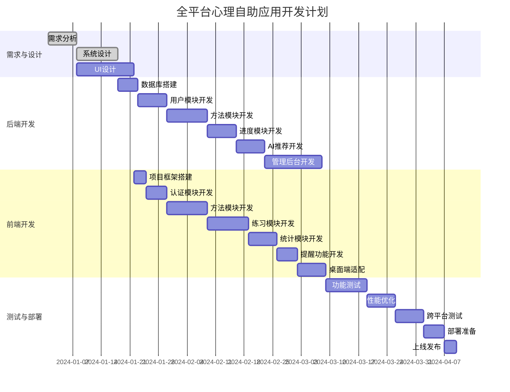

#### 10.1.2 里程碑节点

| 里程碑 | 日期 | 交付物 | 验收标准 |
|--------|------|--------|----------|
| 设计完成 | 2024-01-22 | 系统设计文档、UI设计稿 | 设计评审通过 |
| 后端核心完成 | 2024-02-16 | 用户、方法、进度API | 接口测试通过 |
| 前端移动端完成 | 2024-03-02 | iOS和Android应用 | 核心功能可用 |
| 桌面端完成 | 2024-03-09 | macOS和Windows应用 | 全平台可用 |
| 测试完成 | 2024-04-02 | 测试报告 | 无致命和严重缺陷 |
| 正式上线 | 2024-04-10 | 生产环境部署 | 系统稳定运行 |

### 10.2 资源需求

#### 10.2.1 人员配置

| 角色 | 人数 | 职责 | 时间投入 |
|------|------|------|----------|
| 产品经理 | 1 | 需求分析、产品设计、项目协调 | 全程 |
| UI设计师 | 1 | UI设计、交互设计、设计规范 | 前期2周 + 支持 |
| 后端工程师 | 2 | 后端API开发、数据库设计、管理后台 | 6周 |
| Flutter工程师 | 2 | 前端应用开发、平台适配 | 7周 |
| 测试工程师 | 1 | 测试用例编写、测试执行、缺陷跟踪 | 后期3周 |
| 运维工程师 | 1 | 部署方案、Docker配置、监控告警 | 后期1周 + 支持 |

#### 10.2.2 硬件资源

**开发设备**：
- MacBook Pro（Flutter开发，iOS构建）：2台
- Windows PC（Windows端测试）：1台
- iPhone真机（iOS测试）：2部
- Android真机（Android测试）：3部

**服务器资源**：
- 开发环境服务器：1台（4核8G内存）
- 测试环境服务器：1台（4核8G内存）
- 生产环境服务器：1台（8核16G内存）

### 10.3 质量保证

#### 10.3.1 代码质量

**代码规范**：
- 后端遵循Node.js最佳实践和ESLint规则
- 前端遵循Flutter官方代码规范和Dart lint规则
- 使用Prettier统一代码格式
- 代码提交前必须通过lint检查

**代码审查**：
- 所有代码通过Pull Request提交
- 至少一名团队成员审查后才能合并
- 关键模块需要两人审查
- 审查检查点：功能正确性、代码规范、性能、安全

**单元测试**：
- 后端核心业务逻辑单元测试覆盖率≥70%
- 前端关键组件和Bloc单元测试覆盖率≥60%
- 测试用例与功能代码同步提交

#### 10.3.2 版本控制

**分支策略**：
- main分支：生产环境代码，受保护
- develop分支：开发主分支
- feature/*分支：功能开发分支
- bugfix/*分支：缺陷修复分支
- release/*分支：发布准备分支

**版本号规范**：
- 采用语义化版本号：主版本号.次版本号.修订号
- 主版本号：重大架构变更或不兼容更新
- 次版本号：新功能添加，向下兼容
- 修订号：缺陷修复和小优化

#### 10.3.3 文档维护

**必备文档**：
- 系统设计文档（本文档）
- API接口文档（Swagger生成）
- 数据库设计文档
- 部署操作手册
- 测试报告
- 用户使用手册

**文档更新要求**：
- 接口变更必须同步更新API文档
- 数据库变更必须更新数据库文档
- 重大功能变更更新系统设计文档
- 文档与代码同步维护

## 11. 后续优化方向

### 11.1 功能扩展

**社区功能**：
- 用户可分享练习心得
- 用户间互相鼓励和支持
- 专业咨询师在线答疑
- 主题讨论小组

**付费增值功能**：
- 高级方法内容
- 一对一专业指导
- 定制化练习计划
- 无广告体验

**智能化增强**：
- 更精准的AI推荐算法
- 情绪识别和分析
- 智能练习提醒（根据用户状态）
- 语音交互式练习

**数据分析**：
- 用户行为分析仪表板
- 心理状态长期趋势报告
- 方法有效性分析
- 个性化改进建议

### 11.2 技术优化

**性能优化**：
- 图片懒加载和渐进式加载
- API响应数据压缩
- 数据库查询优化和索引调整
- 引入CDN加速静态资源

**架构升级**：
- 微服务化拆分（用户量增长后）
- 消息队列异步处理（通知、统计等）
- 数据库读写分离和分库分表
- 引入Kubernetes容器编排

**监控完善**：
- APM性能监控
- 用户行为埋点分析
- 错误日志聚合分析
- 实时告警推送

### 11.3 运营支持

**数据运营**：
- 用户增长分析
- 留存率和活跃度监控
- 方法使用热度排行
- A/B测试支持

**内容运营**：
- 定期更新方法库
- 专题活动和挑战
- 节日特别内容
- 用户反馈收集和处理

**用户运营**：
- 新用户引导优化
- 用户等级和成就系统
- 邀请奖励机制
- 用户流失预警和挽回

---

## 附录

### A. 术语表

| 术语 | 说明 |
|------|------|
| 心理自助方法 | 用户可自主实践的心理调节技巧和练习 |
| 练习记录 | 用户完成一次心理自助方法练习的详细记录 |
| 心理状态评分 | 用户自评的心理状态分数，范围1-10分 |
| 连续打卡 | 用户连续多天进行练习的天数统计 |
| AI推荐 | 基于用户行为和偏好的智能方法推荐 |
| 方法分类 | 心理自助方法的类别，如放松技巧、认知调整等 |
| 难度等级 | 方法的难易程度，分为入门、进阶、高级 |
| 交互式练习 | 需要用户参与互动的练习形式，如问卷、引导式练习 |
| 内容审核 | 管理员对待发布方法内容的审查流程 |
| JWT Token | JSON Web Token，用于用户身份认证的令牌 |
| Bloc | Business Logic Component，Flutter状态管理模式 |

### B. 参考资料

**技术文档**：
- Flutter官方文档：https://flutter.dev/docs
- Node.js官方文档：https://nodejs.org/docs
- PostgreSQL官方文档：https://www.postgresql.org/docs
- Docker官方文档：https://docs.docker.com

**设计规范**：
- Material Design：https://material.io/design
- iOS Human Interface Guidelines：https://developer.apple.com/design
- Windows Design Principles：https://docs.microsoft.com/windows/apps/design

**最佳实践**：
- Flutter最佳实践：https://flutter.dev/docs/testing/best-practices
- Node.js最佳实践：https://github.com/goldbergyoni/nodebestpractices
- RESTful API设计指南：https://restfulapi.net

### C. 变更记录

| 版本 | 日期 | 修改人 | 修改内容 |
|------|------|--------|----------|
| 1.0 | 2024-01-15 | 系统设计团队 | 初始版本，完整系统设计 || 用例编号 | TC_AUTH_001 |
| 前置条件 | 应