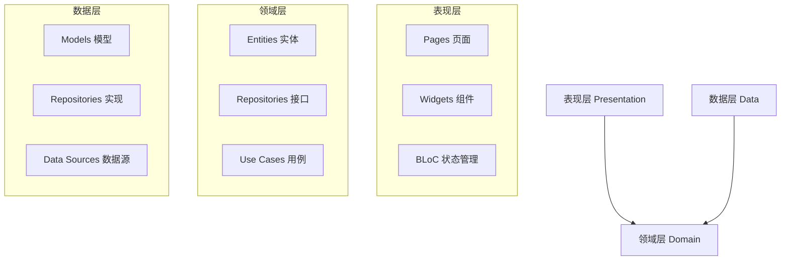
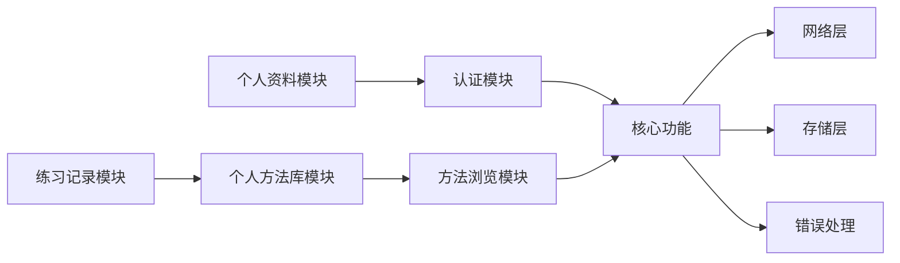
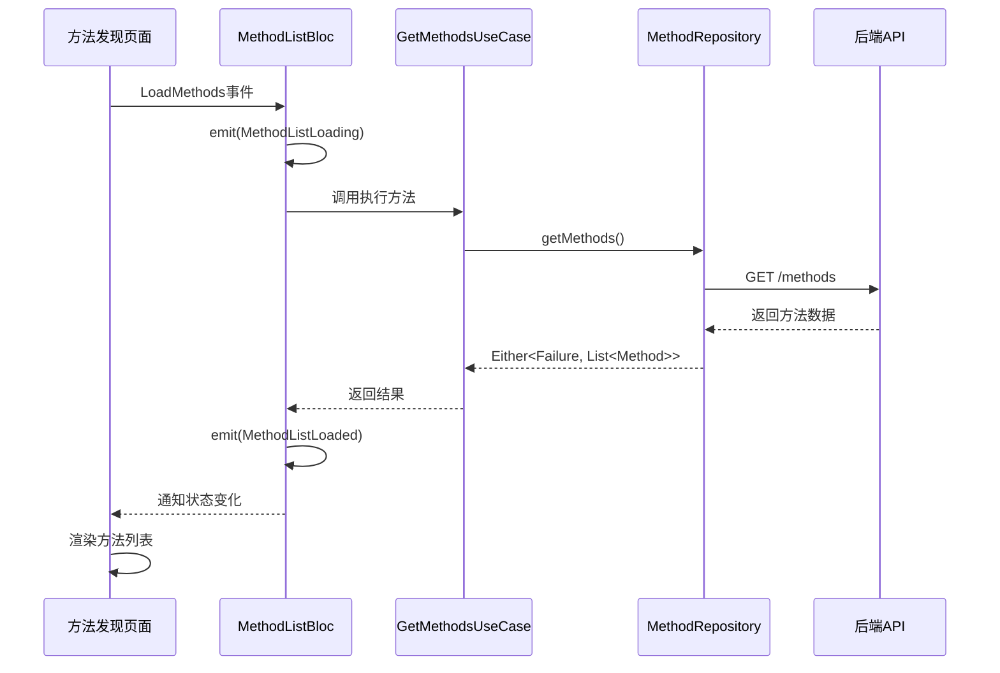
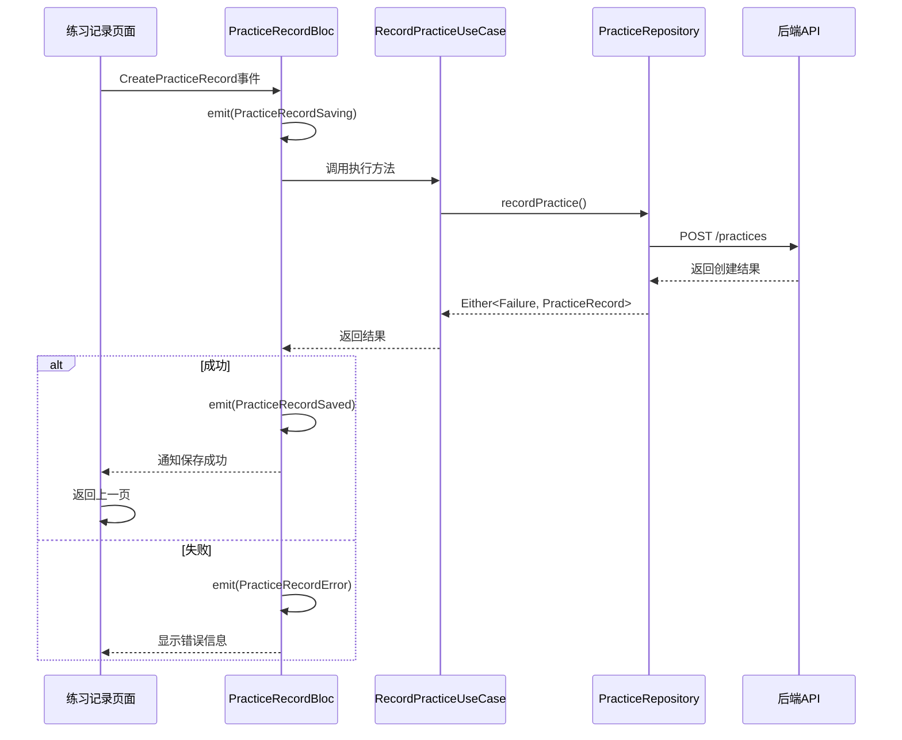

# Flutter 应用页面开发设计文档

## 设计概述

本设计文档定义了 Nian 心理自助应用 Flutter 客户端剩余页面的开发规划。当前应用已完成认证模块（登录、注册、启动页）和基础架构搭建，需要完成以下核心功能模块的页面开发：

1. 首页完善（包含底部导航栏）
2. 方法浏览模块
3. 个人方法库模块
4. 练习记录模块
5. 个人资料模块

## 目标与价值

### 业务目标
- 提供完整的心理自助方法浏览和管理功能
- 支持用户记录和追踪练习历史
- 展示个性化的数据统计和分析
- 提供流畅的用户体验和直观的界面设计

### 用户价值
- 便捷浏览和搜索各类心理自助方法
- 个性化管理个人方法库
- 记录练习过程和心理状态变化
- 可视化查看练习统计和趋势

### 技术价值
- 遵循 Clean Architecture 架构原则
- 使用 BLoC 模式进行状态管理
- 实现可维护和可扩展的代码结构
- 保持与现有代码风格和规范的一致性

## 系统架构

### 架构层次



### 模块依赖关系



## 功能模块设计

### 1. 首页改造（带底部导航）

#### 功能描述
将当前简单的首页改造为带底部导航栏的主框架页面，集成四个主要功能模块的入口。

#### 页面结构

| 页面元素 | 说明 |
|---------|------|
| 顶部区域 | 显示页面标题、搜索入口、通知图标 |
| 内容区域 | 根据底部导航选中项展示不同页面 |
| 底部导航栏 | 四个导航项：首页、我的方法、练习、我的 |

#### 导航项配置

| 导航项 | 图标 | 标签 | 目标页面 |
|-------|------|------|---------|
| 首页 | home | 首页 | 方法发现页面 |
| 我的方法 | library_books | 我的方法 | 个人方法库列表 |
| 练习 | assignment | 练习 | 练习历史列表 |
| 我的 | person | 我的 | 个人资料页面 |

#### 状态管理
- 不需要单独的 BLoC
- 使用 StatefulWidget 管理当前选中的导航索引
- 各子页面独立管理自己的状态

#### 行为规则
- 点击底部导航项切换页面内容
- 保持各页面的状态（避免频繁重建）
- 支持返回键处理（双击退出）

---

### 2. 方法浏览模块

#### 2.1 方法发现页面（首页内容）

**功能描述**：展示推荐方法、分类筛选、热门方法列表

**页面布局**

| 区域 | 内容 | 说明 |
|-----|------|------|
| 顶部横幅 | 欢迎语、每日推荐 | 简短的激励语句和推荐方法卡片 |
| 分类选择器 | 横向滚动的分类标签 | 焦虑缓解、睡眠改善等分类 |
| 方法列表 | 瀑布流或列表形式的方法卡片 | 支持下拉刷新和上拉加载更多 |

**交互行为**
- 点击分类标签触发筛选事件
- 点击方法卡片进入方法详情页
- 下拉刷新重新加载数据
- 滚动到底部自动加载下一页

**状态管理 - MethodListBloc**

状态定义：
- MethodListInitial：初始状态
- MethodListLoading：加载中
- MethodListLoaded：加载成功（包含方法列表、分页信息）
- MethodListError：加载失败（包含错误信息）
- MethodListLoadingMore：加载更多中

事件定义：
- LoadMethods：加载方法列表
- FilterMethodsByCategory：按分类筛选
- LoadMoreMethods：加载更多
- RefreshMethods：刷新列表

**数据流转**



#### 2.2 方法详情页

**功能描述**：展示方法的完整信息，支持添加到个人库

**页面结构**

| 模块 | 内容 | 展示方式 |
|-----|------|---------|
| 封面区域 | 方法封面图、标题、分类标签 | 顶部大图配文字叠加 |
| 基本信息 | 难度、时长、浏览次数 | 图标+文字的横向排列 |
| 详细描述 | 方法的详细说明 | 可折叠的文本区域 |
| 步骤说明 | 练习步骤（如有） | 带序号的步骤列表 |
| 媒体资源 | 音频或视频播放器（如有） | 嵌入式播放控件 |
| 操作按钮 | 添加到我的方法、开始练习 | 底部固定的操作栏 |

**交互行为**
- 页面加载时自动获取方法详情
- 点击"添加到我的方法"弹出目标设置对话框
- 点击"开始练习"跳转到练习记录页面
- 支持分享功能（可选）

**状态管理 - MethodDetailBloc**

状态定义：
- MethodDetailInitial：初始状态
- MethodDetailLoading：加载中
- MethodDetailLoaded：加载成功（包含方法详情）
- MethodDetailError：加载失败
- MethodAddedToLibrary：成功添加到个人库

事件定义：
- LoadMethodDetail：加载方法详情
- AddMethodToLibrary：添加到个人方法库
- StartPractice：开始练习

#### 2.3 方法搜索页面

**功能描述**：提供搜索框和搜索结果展示

**页面结构**

| 区域 | 内容 |
|-----|------|
| 搜索栏 | 输入框、搜索按钮、返回按钮 |
| 搜索建议 | 热门搜索词、历史搜索记录 |
| 搜索结果 | 匹配的方法列表 |
| 空状态 | 无搜索结果时的提示 |

**交互行为**
- 实时搜索（输入防抖）
- 点击搜索建议快速填充
- 点击结果进入方法详情
- 清空搜索历史

**状态管理 - MethodSearchBloc**

状态定义：
- MethodSearchInitial：初始状态（显示搜索建议）
- MethodSearching：搜索中
- MethodSearchLoaded：搜索完成（包含结果列表）
- MethodSearchEmpty：无搜索结果
- MethodSearchError：搜索失败

事件定义：
- SearchMethods：执行搜索
- ClearSearchHistory：清空历史
- LoadSearchSuggestions：加载搜索建议

---

### 3. 个人方法库模块

#### 3.1 个人方法库列表页

**功能描述**：展示用户添加到个人库的所有方法

**页面结构**

| 区域 | 内容 | 说明 |
|-----|------|------|
| 顶部筛选 | 全部/收藏/分类筛选 | Chip 或 Tab 形式 |
| 方法列表 | 个人方法卡片 | 包含进度信息和快捷操作 |
| 空状态 | 引导添加方法 | 显示在无数据时 |

**个人方法卡片信息**
- 方法名称和分类
- 个人目标（如果设置）
- 练习次数
- 上次练习时间
- 收藏状态
- 快捷操作：编辑、删除、开始练习

**交互行为**
- 点击卡片进入个人方法详情页
- 点击"开始练习"直接跳转练习记录页
- 左滑或长按显示删除选项
- 点击收藏图标切换收藏状态

**状态管理 - UserMethodBloc**

状态定义：
- UserMethodInitial：初始状态
- UserMethodLoading：加载中
- UserMethodLoaded：加载成功（包含方法列表）
- UserMethodError：加载失败
- UserMethodUpdated：方法更新成功
- UserMethodDeleted：方法删除成功

事件定义：
- LoadUserMethods：加载个人方法列表
- UpdateUserMethod：更新方法（目标、收藏状态）
- DeleteUserMethod：删除方法
- ToggleFavorite：切换收藏状态

#### 3.2 个人方法详情页

**功能描述**：展示方法详情和个人练习数据

**页面结构**

| 模块 | 内容 |
|-----|------|
| 方法信息 | 继承自方法详情页的基本信息 |
| 个人设置 | 个人目标、收藏状态 |
| 练习统计 | 总练习次数、连续天数、最近练习时间 |
| 练习历史 | 最近5条练习记录列表 |
| 操作按钮 | 编辑目标、删除方法、开始练习 |

**交互行为**
- 点击"编辑目标"弹出编辑对话框
- 点击"查看更多历史"跳转到练习历史页面（筛选当前方法）
- 点击"删除方法"显示确认对话框

---

### 4. 练习记录模块

#### 4.1 练习历史列表页

**功能描述**：展示用户的所有练习记录

**页面结构**

| 区域 | 内容 | 说明 |
|-----|------|------|
| 顶部统计 | 总练习次数、本周练习次数 | 卡片形式的快速统计 |
| 时间筛选 | 本周/本月/全部 | Tab 或下拉选择 |
| 记录列表 | 按日期分组的练习记录 | 列表+分组头 |
| 查看统计入口 | 跳转到统计页面的按钮 | 浮动操作按钮 |

**练习记录卡片信息**
- 方法名称
- 练习时长
- 练习前后心理状态评分
- 练习日期和时间
- 备注（如有）

**交互行为**
- 点击记录卡片查看详情
- 点击"查看统计"进入练习统计页
- 下拉刷新加载最新数据
- 上拉加载更多历史记录

**状态管理 - PracticeHistoryBloc**

状态定义：
- PracticeHistoryInitial：初始状态
- PracticeHistoryLoading：加载中
- PracticeHistoryLoaded：加载成功（包含记录列表、统计信息）
- PracticeHistoryError：加载失败

事件定义：
- LoadPracticeHistory：加载练习历史
- FilterByTimeRange：按时间范围筛选
- RefreshHistory：刷新历史记录

#### 4.2 练习记录创建页

**功能描述**：记录一次练习的详细信息

**页面结构**

| 字段 | 类型 | 说明 |
|-----|------|------|
| 选择方法 | 下拉选择 | 从个人方法库选择 |
| 练习时长 | 时间选择器 | 分钟数输入 |
| 练习前状态 | 滑动评分器 | 1-10分 |
| 练习后状态 | 滑动评分器 | 1-10分 |
| 练习日期 | 日期选择器 | 默认当天 |
| 备注 | 文本输入框 | 可选的文字记录 |
| 提交按钮 | 按钮 | 保存练习记录 |

**交互行为**
- 所有必填字段验证
- 滑动评分器提供视觉反馈（颜色变化）
- 提交成功后返回练习历史页面
- 提交失败显示错误提示

**状态管理 - PracticeRecordBloc**

状态定义：
- PracticeRecordInitial：初始状态
- PracticeRecordSaving：保存中
- PracticeRecordSaved：保存成功
- PracticeRecordError：保存失败

事件定义：
- CreatePracticeRecord：创建练习记录
- ValidateForm：表单验证

**数据流转**



#### 4.3 练习统计页面

**功能描述**：可视化展示练习数据和趋势

**页面结构**

| 模块 | 内容 | 可视化方式 |
|-----|------|-----------|
| 时间范围选择 | 最近7天/30天/90天 | 顶部选择器 |
| 总体统计卡片 | 总练习次数、总时长、平均评分改善 | 数字卡片 |
| 练习频率图表 | 每日练习次数 | 柱状图 |
| 心理状态趋势图 | 练习前后状态对比 | 折线图 |
| 方法分布图 | 各方法练习次数占比 | 饼图或横向条形图 |
| 连续练习记录 | 连续练习天数、最长连续记录 | 日历热力图 |

**交互行为**
- 切换时间范围重新加载数据
- 点击图表元素查看详细信息
- 支持图表缩放和拖动（如适用）

**状态管理 - PracticeStatsBloc**

状态定义：
- PracticeStatsInitial：初始状态
- PracticeStatsLoading：加载中
- PracticeStatsLoaded：加载成功（包含统计数据）
- PracticeStatsError：加载失败

事件定义：
- LoadPracticeStats：加载统计数据
- ChangeTimeRange：切换时间范围

---

### 5. 个人资料模块

#### 5.1 个人资料页面

**功能描述**：展示用户信息和应用设置入口

**页面结构**

| 区域 | 内容 | 说明 |
|-----|------|------|
| 头部卡片 | 头像、昵称、注册时间 | 可点击编辑 |
| 练习概览 | 总练习天数、总练习次数、连续天数 | 统计卡片 |
| 设置选项 | 列表形式的设置项 | 分组展示 |
| 退出登录 | 退出按钮 | 底部位置 |

**设置选项分组**

| 分组 | 选项 | 说明 |
|-----|------|------|
| 个人信息 | 修改昵称、修改密码 | 跳转到编辑页面 |
| 应用设置 | 主题设置、通知设置、语言设置 | 切换开关或选择器 |
| 数据管理 | 导出数据、清除缓存 | 操作按钮 |
| 关于 | 关于应用、隐私政策、用户协议 | 跳转到信息页 |

**交互行为**
- 点击头像可查看或修改头像（可选功能）
- 点击"修改昵称"弹出输入对话框
- 点击"退出登录"显示确认对话框
- 切换主题实时生效
- 导出数据生成文件并分享

**状态管理 - ProfileBloc**

状态定义：
- ProfileInitial：初始状态
- ProfileLoading：加载中
- ProfileLoaded：加载成功（包含用户信息和统计）
- ProfileError：加载失败
- ProfileUpdated：更新成功

事件定义：
- LoadProfile：加载个人资料
- UpdateNickname：更新昵称
- ChangeTheme：切换主题
- ExportData：导出数据
- Logout：退出登录

#### 5.2 修改密码页面

**功能描述**：允许用户修改登录密码

**页面结构**

| 字段 | 类型 | 验证规则 |
|-----|------|---------|
| 当前密码 | 密码输入框 | 必填 |
| 新密码 | 密码输入框 | 长度≥6，必填 |
| 确认新密码 | 密码输入框 | 与新密码一致 |
| 提交按钮 | 按钮 | 表单验证通过后可用 |

**交互行为**
- 实时验证输入格式
- 提交前验证所有字段
- 修改成功后返回个人资料页
- 显示密码可见性切换

---

## 共享组件设计

### UI 组件库

| 组件名称 | 用途 | 参数 |
|---------|------|------|
| AppButton | 统一样式的按钮 | 文本、颜色、加载状态、点击回调 |
| AppTextField | 统一样式的文本输入框 | 标签、提示、验证器、类型 |
| AppCard | 统一样式的卡片容器 | 子组件、边距、圆角 |
| LoadingIndicator | 加载指示器 | 尺寸、颜色 |
| ErrorWidget | 错误提示组件 | 错误信息、重试回调 |
| EmptyState | 空状态提示 | 图标、文字、操作按钮 |
| MethodCard | 方法卡片 | 方法数据、点击回调 |
| PracticeCard | 练习记录卡片 | 练习数据、点击回调 |
| RatingSlider | 心理状态评分滑块 | 当前值、变化回调 |
| StatCard | 统计数据卡片 | 标题、数值、图标 |

### 通用功能组件

| 组件 | 功能 | 实现方式 |
|-----|------|---------|
| AppScaffold | 统一的页面框架 | 封装 Scaffold 提供标准布局 |
| RefreshableList | 支持刷新和加载更多的列表 | 封装 RefreshIndicator 和滚动监听 |
| ConfirmDialog | 确认对话框 | 可复用的对话框组件 |
| InputDialog | 输入对话框 | 带输入框的对话框 |
| BottomSheet | 底部弹出菜单 | 标准样式的底部抽屉 |

---

## 数据模型

### 主要实体总结

| 实体 | 文件位置 | 说明 |
|-----|---------|------|
| User | domain/entities/user.dart | 已存在 |
| Method | domain/entities/method.dart | 已存在 |
| UserMethod | domain/entities/user_method.dart | 已存在 |
| PracticeRecord | domain/entities/practice_record.dart | 已存在 |
| PracticeStats | domain/entities/practice_stats.dart | 已存在 |

### 数据模型（Data Layer）

需要确保以下 Model 类已实现：

| 模型 | 对应实体 | 功能 |
|-----|---------|------|
| UserModel | User | JSON 序列化/反序列化 |
| MethodModel | Method | JSON 序列化/反序列化 |
| UserMethodModel | UserMethod | JSON 序列化/反序列化 |
| PracticeRecordModel | PracticeRecord | JSON 序列化/反序列化 |
| PracticeStatsModel | PracticeStats | JSON 序列化/反序列化 |

---

## 数据源和仓库

### Remote Data Sources（远程数据源）

当前已存在的数据源：
- AuthRemoteDataSource：认证相关 API 调用
- MethodRemoteDataSource：方法相关 API 调用
- PracticeRemoteDataSource：练习相关 API 调用

需要补充的数据源：
- UserMethodRemoteDataSource：个人方法库 API 调用

| 方法 | 端点 | 说明 |
|-----|------|------|
| addUserMethod | POST /user-methods | 添加方法到个人库 |
| getUserMethods | GET /user-methods | 获取个人方法列表 |
| updateUserMethod | PUT /user-methods/:id | 更新个人方法 |
| deleteUserMethod | DELETE /user-methods/:id | 删除个人方法 |

### Repository Implementations（仓库实现）

当前已存在的仓库实现：
- AuthRepositoryImpl
- MethodRepositoryImpl
- PracticeRepositoryImpl

需要补充的仓库实现：
- UserMethodRepositoryImpl

**实现职责**：
- 调用对应的 Remote Data Source
- 处理异常并转换为 Failure
- 将 Model 转换为 Entity
- 使用 Either 返回结果

---

## 路由配置

### 路由表

| 路由路径 | 页面 | 需要认证 |
|---------|------|---------|
| / | SplashPage | 否 |
| /login | LoginPage | 否 |
| /register | RegisterPage | 否 |
| /home | MainPage（带底部导航） | 是 |
| /method-detail/:id | MethodDetailPage | 是 |
| /method-search | MethodSearchPage | 是 |
| /user-method-detail/:id | UserMethodDetailPage | 是 |
| /practice-create | PracticeRecordCreatePage | 是 |
| /practice-stats | PracticeStatsPage | 是 |
| /profile | ProfilePage（嵌入在主页） | 是 |
| /change-password | ChangePasswordPage | 是 |

### 导航策略

**路由守卫**：
- 未登录用户访问需要认证的页面时自动跳转到登录页
- 已登录用户访问登录页时自动跳转到首页

**路由传参**：
- 使用路由参数传递 ID（如 methodId、recordId）
- 使用 arguments 传递复杂对象

**返回处理**：
- 主页面（带底部导航）拦截返回键，双击退出应用
- 其他页面正常返回

---

## 状态管理策略

### BLoC 使用规范

**命名规范**：
- Bloc 类：`<Feature>Bloc`
- Event 类：`<Feature>Event` + 具体事件如 `Load<Feature>`
- State 类：`<Feature>State` + 具体状态如 `<Feature>Loading`

**状态流转原则**：
- 每个 Event 必须触发至少一个新的 State
- State 应该是不可变的
- 使用 Equatable 实现状态相等性比较
- 避免在 BLoC 中直接操作 UI

**错误处理**：
- 网络错误、业务错误统一转换为 Failure
- 在 BLoC 层处理 Failure 并转换为 Error State
- Error State 包含用户友好的错误信息

### 依赖注入

使用 GetIt 进行依赖注入：

```
DioClient -> RemoteDataSource -> RepositoryImpl -> BLoC
```

**注册时机**：
- 应用启动时注册所有单例
- BLoC 使用工厂模式注册（每次创建新实例）
- Repository 和 DataSource 使用单例模式

---

## UI/UX 设计规范

### 主题配置

**颜色方案**：
- 主色：蓝色（#2196F3）- 平静、专业
- 辅助色：绿色（#4CAF50）- 成长、健康
- 错误色：红色（#F44336）
- 警告色：橙色（#FF9800）
- 成功色：绿色（#4CAF50）

**文字样式**：
- 标题：24sp，粗体
- 副标题：20sp，中粗
- 正文：16sp，常规
- 说明：14sp，浅色
- 小字：12sp，浅色

**间距规范**：
- 特大间距：24dp
- 大间距：16dp
- 中等间距：12dp
- 小间距：8dp
- 极小间距：4dp

### 交互设计

**加载状态**：
- 首次加载：显示全屏加载指示器
- 刷新：显示顶部加载指示器
- 加载更多：显示列表底部小型加载器
- 操作反馈：显示按钮内加载动画

**空状态**：
- 显示友好的图标和文案
- 提供引导操作按钮
- 避免纯文字提示

**错误处理**：
- 网络错误：提供重试按钮
- 业务错误：显示具体错误信息
- 使用 SnackBar 显示临时错误
- 使用对话框显示重要错误

**动画效果**：
- 页面切换：平滑的过渡动画
- 列表项：淡入动画
- 按钮点击：涟漪效果
- 数据加载：骨架屏或渐显效果

### 响应式设计

**屏幕适配**：
- 支持不同屏幕尺寸（手机、平板）
- 使用 MediaQuery 获取屏幕信息
- 关键尺寸使用相对单位

**横屏适配**：
- 列表类页面自适应列数
- 详情页面调整布局方向
- 表单页面保持单列布局

---

## 性能优化策略

### 列表优化

**懒加载**：
- 使用分页加载数据（每页20条）
- 滚动到底部自动加载下一页
- 缓存已加载数据避免重复请求

**图片优化**：
- 使用 CachedNetworkImage 缓存网络图片
- 提供占位图和错误图
- 根据显示尺寸加载合适分辨率

**列表渲染**：
- 使用 ListView.builder 实现虚拟滚动
- 提取列表项为独立 Widget
- 使用 const 构造函数优化重建

### 状态优化

**避免过度重建**：
- 使用 BlocBuilder 精确订阅状态变化
- 使用 const Widget 避免不必要的重建
- 使用 RepaintBoundary 隔离重绘区域

**数据缓存**：
- 本地缓存常用数据（方法列表、分类列表）
- 设置合理的缓存过期时间
- 网络请求失败时使用缓存数据

---

## 错误处理机制

### 异常分类

| 异常类型 | 说明 | 处理方式 |
|---------|------|---------|
| NetworkException | 网络连接失败 | 提示检查网络，提供重试 |
| TimeoutException | 请求超时 | 提示稍后重试 |
| ServerException | 服务器错误 | 显示错误信息，提供重试 |
| ValidationException | 数据验证失败 | 显示具体验证错误 |
| UnauthorizedException | 未授权 | 跳转到登录页 |

### 错误显示

**全局错误**：
- 使用 BlocListener 监听错误状态
- 使用 SnackBar 显示非阻塞错误
- 使用 Dialog 显示重要错误

**表单错误**：
- 实时验证输入内容
- 在输入框下方显示错误提示
- 防止提交无效表单

**网络错误**：
- 显示友好的错误图标和文案
- 提供"重试"按钮
- 网络恢复后自动重试（可选）

---

## 测试策略

### 单元测试

**测试覆盖**：
- BLoC：测试所有事件和状态流转
- Repository：测试数据转换和错误处理
- UseCase：测试业务逻辑

**Mock 策略**：
- 使用 Mockito 创建 Mock 对象
- Mock Repository 测试 BLoC
- Mock DataSource 测试 Repository

### Widget 测试

**测试内容**：
- 页面渲染是否正确
- 用户交互是否触发正确事件
- 状态变化是否正确更新 UI

**测试工具**：
- 使用 WidgetTester 模拟用户操作
- 使用 find 查找 Widget
- 使用 expect 验证结果

### 集成测试

**测试场景**：
- 完整的用户流程（登录→浏览方法→添加到库→记录练习）
- 网络请求和响应
- 数据持久化

---

## 开发计划

### 阶段一：基础页面框架（2-3天）

**任务清单**：
- [ ] 改造首页为带底部导航的主框架页面
- [ ] 创建方法发现页面（首页内容）基本结构
- [ ] 创建个人方法库列表页基本结构
- [ ] 创建练习历史列表页基本结构
- [ ] 创建个人资料页基本结构

**验收标准**：
- 底部导航可正常切换
- 各页面显示基本布局和占位内容
- 路由配置正确

### 阶段二：方法浏览功能（3-4天）

**任务清单**：
- [ ] 实现 MethodListBloc 及其事件和状态
- [ ] 完成方法发现页面的数据加载和展示
- [ ] 实现分类筛选功能
- [ ] 实现下拉刷新和上拉加载
- [ ] 创建 MethodDetailBloc
- [ ] 完成方法详情页的所有功能
- [ ] 实现添加到个人库功能
- [ ] 创建方法搜索页面和 MethodSearchBloc

**验收标准**：
- 可正常浏览方法列表
- 分类筛选生效
- 方法详情页展示完整信息
- 可成功添加到个人库

### 阶段三：个人方法库功能（2-3天）

**任务清单**：
- [ ] 创建 UserMethodRemoteDataSource
- [ ] 创建 UserMethodRepositoryImpl
- [ ] 实现 UserMethodBloc 及其事件和状态
- [ ] 完成个人方法库列表页的数据加载和展示
- [ ] 实现收藏、编辑、删除功能
- [ ] 创建个人方法详情页

**验收标准**：
- 可正常查看个人方法列表
- 收藏功能生效
- 可编辑个人目标
- 可删除方法

### 阶段四：练习记录功能（3-4天）

**任务清单**：
- [ ] 实现 PracticeHistoryBloc
- [ ] 完成练习历史列表页的数据加载和展示
- [ ] 实现时间筛选功能
- [ ] 创建 PracticeRecordBloc
- [ ] 完成练习记录创建页面
- [ ] 实现表单验证和提交
- [ ] 创建 PracticeStatsBloc
- [ ] 完成练习统计页面
- [ ] 集成 fl_chart 实现图表展示

**验收标准**：
- 可正常查看练习历史
- 可成功创建练习记录
- 统计数据准确展示
- 图表交互流畅

### 阶段五：个人资料功能（1-2天）

**任务清单**：
- [ ] 实现 ProfileBloc
- [ ] 完成个人资料页面展示
- [ ] 实现设置项功能（主题切换等）
- [ ] 创建修改密码页面
- [ ] 实现退出登录功能

**验收标准**：
- 可查看个人信息和统计
- 主题切换生效
- 可修改密码
- 退出登录正常

### 阶段六：共享组件和优化（2-3天）

**任务清单**：
- [ ] 提取和封装共享 UI 组件
- [ ] 优化列表性能（懒加载、缓存）
- [ ] 实现图片缓存
- [ ] 添加加载动画和骨架屏
- [ ] 优化错误处理和提示
- [ ] 完善空状态展示
- [ ] 调整整体 UI 细节

**验收标准**：
- 组件可复用
- 列表滚动流畅
- 加载体验良好
- 错误提示友好

### 阶段七：测试和修复（2-3天）

**任务清单**：
- [ ] 编写关键 BLoC 的单元测试
- [ ] 编写主要页面的 Widget 测试
- [ ] 端到端测试完整流程
- [ ] 修复发现的 Bug
- [ ] 性能测试和优化
- [ ] 代码审查和重构

**验收标准**：
- 测试覆盖率达标
- 无严重 Bug
- 性能符合预期

---

## 技术约束与风险

### 技术约束

**Flutter 版本**：
- Flutter SDK：3.16+
- Dart：3.2+

**依赖包限制**：
- 所有依赖包必须在 pubspec.yaml 中明确版本
- 避免使用废弃的包
- 优先使用官方或社区推荐的包

**平台兼容性**：
- 优先保证 Android 和 iOS 兼容
- Web、Desktop 平台作为次要目标
- 平台特定功能需要条件编译

### 潜在风险

**技术风险**：

| 风险 | 影响 | 应对措施 |
|-----|------|---------|
| 图表库性能问题 | 统计页面卡顿 | 限制数据点数量，使用采样 |
| 列表数据量大 | 内存占用高 | 实现分页和虚拟滚动 |
| 网络请求失败率高 | 用户体验差 | 实现重试机制和离线缓存 |
| 状态管理复杂 | 代码维护困难 | 严格遵循 BLoC 模式规范 |

**业务风险**：

| 风险 | 影响 | 应对措施 |
|-----|------|---------|
| API 接口变更 | 功能不可用 | 版本协商机制，向后兼容 |
| 数据格式不一致 | 解析失败 | 严格的数据验证和异常处理 |
| 用户数据丢失 | 用户投诉 | 实现数据备份和恢复机制 |

---

## 验收标准

### 功能完整性

- [ ] 所有计划页面已实现
- [ ] 所有 API 接口已对接
- [ ] 所有用户交互已实现
- [ ] 所有错误场景已处理

### 代码质量

- [ ] 遵循 Flutter 代码规范
- [ ] 遵循 Clean Architecture 架构
- [ ] 无严重的代码异味
- [ ] 关键逻辑有单元测试

### 用户体验

- [ ] 页面加载流畅（无明显卡顿）
- [ ] 交互反馈及时
- [ ] 错误提示友好
- [ ] 视觉风格统一

### 性能指标

- [ ] 首屏加载时间 < 3秒
- [ ] 列表滚动帧率 > 50fps
- [ ] 应用包体积 < 50MB
- [ ] 内存占用 < 200MB（正常使用）

---

## 附录

### API 端点总结

| 分类 | 方法 | 端点 | 说明 |
|-----|------|------|------|
| 认证 | POST | /auth/login | 用户登录 |
| 认证 | POST | /auth/register | 用户注册 |
| 认证 | POST | /auth/logout | 用户登出 |
| 方法 | GET | /methods | 获取方法列表 |
| 方法 | GET | /methods/:id | 获取方法详情 |
| 方法 | GET | /methods/categories | 获取分类列表 |
| 方法 | GET | /methods/recommend | 获取推荐方法 |
| 个人方法库 | POST | /user-methods | 添加到个人库 |
| 个人方法库 | GET | /user-methods | 获取个人方法列表 |
| 个人方法库 | PUT | /user-methods/:id | 更新个人方法 |
| 个人方法库 | DELETE | /user-methods/:id | 删除个人方法 |
| 练习记录 | POST | /practices | 创建练习记录 |
| 练习记录 | GET | /practices | 获取练习历史 |
| 练习记录 | GET | /practices/statistics | 获取练习统计 |

### 关键文件清单

**Presentation Layer**：
- lib/presentation/home/main_page.dart（新建）
- lib/presentation/methods/pages/method_discover_page.dart（新建）
- lib/presentation/methods/pages/method_detail_page.dart（新建）
- lib/presentation/methods/pages/method_search_page.dart（新建）
- lib/presentation/methods/bloc/method_list_bloc.dart（新建）
- lib/presentation/methods/bloc/method_detail_bloc.dart（新建）
- lib/presentation/methods/bloc/method_search_bloc.dart（新建）
- lib/presentation/user_methods/pages/user_method_list_page.dart（新建）
- lib/presentation/user_methods/pages/user_method_detail_page.dart（新建）
- lib/presentation/user_methods/bloc/user_method_bloc.dart（新建）
- lib/presentation/practice/pages/practice_history_page.dart（新建）
- lib/presentation/practice/pages/practice_record_create_page.dart（新建）
- lib/presentation/practice/pages/practice_stats_page.dart（新建）
- lib/presentation/practice/bloc/practice_history_bloc.dart（新建）
- lib/presentation/practice/bloc/practice_record_bloc.dart（新建）
- lib/presentation/practice/bloc/practice_stats_bloc.dart（新建）
- lib/presentation/profile/pages/profile_page.dart（新建）
- lib/presentation/profile/pages/change_password_page.dart（新建）
- lib/presentation/profile/bloc/profile_bloc.dart（新建）

**Data Layer**：
- lib/data/datasources/remote/user_method_remote_data_source.dart（新建）
- lib/data/repositories/user_method_repository_impl.dart（新建）
- lib/data/models/user_method_model.dart（需确认）

**Widgets**：
- lib/presentation/widgets/ 目录下的所有共享组件（部分新建）

### 参考资源

**Flutter 官方文档**：
- https://flutter.dev/docs

**BLoC 模式文档**：
- https://bloclibrary.dev/

**图表库文档**：
- https://pub.dev/packages/fl_chart

**Clean Architecture 参考**：
- https://blog.cleancoder.com/uncle-bob/2012/08/13/the-clean-architecture.html
- UpdateNickname：更新昵称
- ChangeTheme：切换主题
- ExportData：导出数据
- Logout：退出登录

#### 5.2 修改密码页面

**功能描述**：允许用户修改登录密码

**页面结构**

| 字段 | 类型 | 验证规则 |
|-----|------|---------|
| 当前密码 | 密码输入框 | 必填 |
| 新密码 | 密码输入框 | 长度≥6，必填 |
| 确认新密码 | 密码输入框 | 与新密码一致 |
| 提交按钮 | 按钮 | 表单验证通过后可用 |

**交互行为**
- 实时验证输入格式
- 提交前验证所有字段
- 修改成功后返回个人资料页
- 显示密码可见性切换

---

## 共享组件设计

### UI 组件库

| 组件名称 | 用途 | 参数 |
|---------|------|------|
| AppButton | 统一样式的按钮 | 文本、颜色、加载状态、点击回调 |
| AppTextField | 统一样式的文本输入框 | 标签、提示、验证器、类型 |
| AppCard | 统一样式的卡片容器 | 子组件、边距、圆角 |
| LoadingIndicator | 加载指示器 | 尺寸、颜色 |
| ErrorWidget | 错误提示组件 | 错误信息、重试回调 |
| EmptyState | 空状态提示 | 图标、文字、操作按钮 |
| MethodCard | 方法卡片 | 方法数据、点击回调 |
| PracticeCard | 练习记录卡片 | 练习数据、点击回调 |
| RatingSlider | 心理状态评分滑块 | 当前值、变化回调 |
| StatCard | 统计数据卡片 | 标题、数值、图标 |

### 通用功能组件

| 组件 | 功能 | 实现方式 |
|-----|------|---------|
| AppScaffold | 统一的页面框架 | 封装 Scaffold 提供标准布局 |
| RefreshableList | 支持刷新和加载更多的列表 | 封装 RefreshIndicator 和滚动监听 |
| ConfirmDialog | 确认对话框 | 可复用的对话框组件 |
| InputDialog | 输入对话框 | 带输入框的对话框 |
| BottomSheet | 底部弹出菜单 | 标准样式的底部抽屉 |

---

## 数据模型

### 主要实体总结

| 实体 | 文件位置 | 说明 |
|-----|---------|------|
| User | domain/entities/user.dart | 已存在 |
| Method | domain/entities/method.dart | 已存在 |
| UserMethod | domain/entities/user_method.dart | 已存在 |
| PracticeRecord | domain/entities/practice_record.dart | 已存在 |
| PracticeStats | domain/entities/practice_stats.dart | 已存在 |

### 数据模型（Data Layer）

需要确保以下 Model 类已实现：

| 模型 | 对应实体 | 功能 |
|-----|---------|------|
| UserModel | User | JSON 序列化/反序列化 |
| MethodModel | Method | JSON 序列化/反序列化 |
| UserMethodModel | UserMethod | JSON 序列化/反序列化 |
| PracticeRecordModel | PracticeRecord | JSON 序列化/反序列化 |
| PracticeStatsModel | PracticeStats | JSON 序列化/反序列化 |

---

## 数据源和仓库

### Remote Data Sources（远程数据源）

当前已存在的数据源：
- AuthRemoteDataSource：认证相关 API 调用
- MethodRemoteDataSource：方法相关 API 调用
- PracticeRemoteDataSource：练习相关 API 调用

需要补充的数据源：
- UserMethodRemoteDataSource：个人方法库 API 调用

| 方法 | 端点 | 说明 |
|-----|------|------|
| addUserMethod | POST /user-methods | 添加方法到个人库 |
| getUserMethods | GET /user-methods | 获取个人方法列表 |
| updateUserMethod | PUT /user-methods/:id | 更新个人方法 |
| deleteUserMethod | DELETE /user-methods/:id | 删除个人方法 |

### Repository Implementations（仓库实现）

当前已存在的仓库实现：
- AuthRepositoryImpl
- MethodRepositoryImpl
- PracticeRepositoryImpl

需要补充的仓库实现：
- UserMethodRepositoryImpl

**实现职责**：
- 调用对应的 Remote Data Source
- 处理异常并转换为 Failure
- 将 Model 转换为 Entity
- 使用 Either 返回结果

---

## 路由配置

### 路由表

| 路由路径 | 页面 | 需要认证 |
|---------|------|---------|
| / | SplashPage | 否 |
| /login | LoginPage | 否 |
| /register | RegisterPage | 否 |
| /home | MainPage（带底部导航） | 是 |
| /method-detail/:id | MethodDetailPage | 是 |
| /method-search | MethodSearchPage | 是 |
| /user-method-detail/:id | UserMethodDetailPage | 是 |
| /practice-create | PracticeRecordCreatePage | 是 |
| /practice-stats | PracticeStatsPage | 是 |
| /profile | ProfilePage（嵌入在主页） | 是 |
| /change-password | ChangePasswordPage | 是 |

### 导航策略

**路由守卫**：
- 未登录用户访问需要认证的页面时自动跳转到登录页
- 已登录用户访问登录页时自动跳转到首页

**路由传参**：
- 使用路由参数传递 ID（如 methodId、recordId）
- 使用 arguments 传递复杂对象

**返回处理**：
- 主页面（带底部导航）拦截返回键，双击退出应用
- 其他页面正常返回

---

## 状态管理策略

### BLoC 使用规范

**命名规范**：
- Bloc 类：`<Feature>Bloc`
- Event 类：`<Feature>Event` + 具体事件如 `Load<Feature>`
- State 类：`<Feature>State` + 具体状态如 `<Feature>Loading`

**状态流转原则**：
- 每个 Event 必须触发至少一个新的 State
- State 应该是不可变的
- 使用 Equatable 实现状态相等性比较
- 避免在 BLoC 中直接操作 UI

**错误处理**：
- 网络错误、业务错误统一转换为 Failure
- 在 BLoC 层处理 Failure 并转换为 Error State
- Error State 包含用户友好的错误信息

### 依赖注入

使用 GetIt 进行依赖注入：

```
DioClient -> RemoteDataSource -> RepositoryImpl -> BLoC
```

**注册时机**：
- 应用启动时注册所有单例
- BLoC 使用工厂模式注册（每次创建新实例）
- Repository 和 DataSource 使用单例模式

---

## UI/UX 设计规范

### 主题配置

**颜色方案**：
- 主色：蓝色（#2196F3）- 平静、专业
- 辅助色：绿色（#4CAF50）- 成长、健康
- 错误色：红色（#F44336）
- 警告色：橙色（#FF9800）
- 成功色：绿色（#4CAF50）

**文字样式**：
- 标题：24sp，粗体
- 副标题：20sp，中粗
- 正文：16sp，常规
- 说明：14sp，浅色
- 小字：12sp，浅色

**间距规范**：
- 特大间距：24dp
- 大间距：16dp
- 中等间距：12dp
- 小间距：8dp
- 极小间距：4dp

### 交互设计

**加载状态**：
- 首次加载：显示全屏加载指示器
- 刷新：显示顶部加载指示器
- 加载更多：显示列表底部小型加载器
- 操作反馈：显示按钮内加载动画

**空状态**：
- 显示友好的图标和文案
- 提供引导操作按钮
- 避免纯文字提示

**错误处理**：
- 网络错误：提供重试按钮
- 业务错误：显示具体错误信息
- 使用 SnackBar 显示临时错误
- 使用对话框显示重要错误

**动画效果**：
- 页面切换：平滑的过渡动画
- 列表项：淡入动画
- 按钮点击：涟漪效果
- 数据加载：骨架屏或渐显效果

### 响应式设计

**屏幕适配**：
- 支持不同屏幕尺寸（手机、平板）
- 使用 MediaQuery 获取屏幕信息
- 关键尺寸使用相对单位

**横屏适配**：
- 列表类页面自适应列数
- 详情页面调整布局方向
- 表单页面保持单列布局

---

## 性能优化策略

### 列表优化

**懒加载**：
- 使用分页加载数据（每页20条）
- 滚动到底部自动加载下一页
- 缓存已加载数据避免重复请求

**图片优化**：
- 使用 CachedNetworkImage 缓存网络图片
- 提供占位图和错误图
- 根据显示尺寸加载合适分辨率

**列表渲染**：
- 使用 ListView.builder 实现虚拟滚动
- 提取列表项为独立 Widget
- 使用 const 构造函数优化重建

### 状态优化

**避免过度重建**：
- 使用 BlocBuilder 精确订阅状态变化
- 使用 const Widget 避免不必要的重建
- 使用 RepaintBoundary 隔离重绘区域

**数据缓存**：
- 本地缓存常用数据（方法列表、分类列表）
- 设置合理的缓存过期时间
- 网络请求失败时使用缓存数据

---

## 错误处理机制

### 异常分类

| 异常类型 | 说明 | 处理方式 |
|---------|------|---------|
| NetworkException | 网络连接失败 | 提示检查网络，提供重试 |
| TimeoutException | 请求超时 | 提示稍后重试 |
| ServerException | 服务器错误 | 显示错误信息，提供重试 |
| ValidationException | 数据验证失败 | 显示具体验证错误 |
| UnauthorizedException | 未授权 | 跳转到登录页 |

### 错误显示

**全局错误**：
- 使用 BlocListener 监听错误状态
- 使用 SnackBar 显示非阻塞错误
- 使用 Dialog 显示重要错误

**表单错误**：
- 实时验证输入内容
- 在输入框下方显示错误提示
- 防止提交无效表单

**网络错误**：
- 显示友好的错误图标和文案
- 提供"重试"按钮
- 网络恢复后自动重试（可选）

---

## 测试策略

### 单元测试

**测试覆盖**：
- BLoC：测试所有事件和状态流转
- Repository：测试数据转换和错误处理
- UseCase：测试业务逻辑

**Mock 策略**：
- 使用 Mockito 创建 Mock 对象
- Mock Repository 测试 BLoC
- Mock DataSource 测试 Repository

### Widget 测试

**测试内容**：
- 页面渲染是否正确
- 用户交互是否触发正确事件
- 状态变化是否正确更新 UI

**测试工具**：
- 使用 WidgetTester 模拟用户操作
- 使用 find 查找 Widget
- 使用 expect 验证结果

### 集成测试

**测试场景**：
- 完整的用户流程（登录→浏览方法→添加到库→记录练习）
- 网络请求和响应
- 数据持久化

---

## 开发计划

### 阶段一：基础页面框架（2-3天）

**任务清单**：
- [ ] 改造首页为带底部导航的主框架页面
- [ ] 创建方法发现页面（首页内容）基本结构
- [ ] 创建个人方法库列表页基本结构
- [ ] 创建练习历史列表页基本结构
- [ ] 创建个人资料页基本结构

**验收标准**：
- 底部导航可正常切换
- 各页面显示基本布局和占位内容
- 路由配置正确

### 阶段二：方法浏览功能（3-4天）

**任务清单**：
- [ ] 实现 MethodListBloc 及其事件和状态
- [ ] 完成方法发现页面的数据加载和展示
- [ ] 实现分类筛选功能
- [ ] 实现下拉刷新和上拉加载
- [ ] 创建 MethodDetailBloc
- [ ] 完成方法详情页的所有功能
- [ ] 实现添加到个人库功能
- [ ] 创建方法搜索页面和 MethodSearchBloc

**验收标准**：
- 可正常浏览方法列表
- 分类筛选生效
- 方法详情页展示完整信息
- 可成功添加到个人库

### 阶段三：个人方法库功能（2-3天）

**任务清单**：
- [ ] 创建 UserMethodRemoteDataSource
- [ ] 创建 UserMethodRepositoryImpl
- [ ] 实现 UserMethodBloc 及其事件和状态
- [ ] 完成个人方法库列表页的数据加载和展示
- [ ] 实现收藏、编辑、删除功能
- [ ] 创建个人方法详情页

**验收标准**：
- 可正常查看个人方法列表
- 收藏功能生效
- 可编辑个人目标
- 可删除方法

### 阶段四：练习记录功能（3-4天）

**任务清单**：
- [ ] 实现 PracticeHistoryBloc
- [ ] 完成练习历史列表页的数据加载和展示
- [ ] 实现时间筛选功能
- [ ] 创建 PracticeRecordBloc
- [ ] 完成练习记录创建页面
- [ ] 实现表单验证和提交
- [ ] 创建 PracticeStatsBloc
- [ ] 完成练习统计页面
- [ ] 集成 fl_chart 实现图表展示

**验收标准**：
- 可正常查看练习历史
- 可成功创建练习记录
- 统计数据准确展示
- 图表交互流畅

### 阶段五：个人资料功能（1-2天）

**任务清单**：
- [ ] 实现 ProfileBloc
- [ ] 完成个人资料页面展示
- [ ] 实现设置项功能（主题切换等）
- [ ] 创建修改密码页面
- [ ] 实现退出登录功能

**验收标准**：
- 可查看个人信息和统计
- 主题切换生效
- 可修改密码
- 退出登录正常

### 阶段六：共享组件和优化（2-3天）

**任务清单**：
- [ ] 提取和封装共享 UI 组件
- [ ] 优化列表性能（懒加载、缓存）
- [ ] 实现图片缓存
- [ ] 添加加载动画和骨架屏
- [ ] 优化错误处理和提示
- [ ] 完善空状态展示
- [ ] 调整整体 UI 细节

**验收标准**：
- 组件可复用
- 列表滚动流畅
- 加载体验良好
- 错误提示友好

### 阶段七：测试和修复（2-3天）

**任务清单**：
- [ ] 编写关键 BLoC 的单元测试
- [ ] 编写主要页面的 Widget 测试
- [ ] 端到端测试完整流程
- [ ] 修复发现的 Bug
- [ ] 性能测试和优化
- [ ] 代码审查和重构

**验收标准**：
- 测试覆盖率达标
- 无严重 Bug
- 性能符合预期

---

## 技术约束与风险

### 技术约束

**Flutter 版本**：
- Flutter SDK：3.16+
- Dart：3.2+

**依赖包限制**：
- 所有依赖包必须在 pubspec.yaml 中明确版本
- 避免使用废弃的包
- 优先使用官方或社区推荐的包

**平台兼容性**：
- 优先保证 Android 和 iOS 兼容
- Web、Desktop 平台作为次要目标
- 平台特定功能需要条件编译

### 潜在风险

**技术风险**：

| 风险 | 影响 | 应对措施 |
|-----|------|---------|
| 图表库性能问题 | 统计页面卡顿 | 限制数据点数量，使用采样 |
| 列表数据量大 | 内存占用高 | 实现分页和虚拟滚动 |
| 网络请求失败率高 | 用户体验差 | 实现重试机制和离线缓存 |
| 状态管理复杂 | 代码维护困难 | 严格遵循 BLoC 模式规范 |

**业务风险**：

| 风险 | 影响 | 应对措施 |
|-----|------|---------|
| API 接口变更 | 功能不可用 | 版本协商机制，向后兼容 |
| 数据格式不一致 | 解析失败 | 严格的数据验证和异常处理 |
| 用户数据丢失 | 用户投诉 | 实现数据备份和恢复机制 |

---

## 验收标准

### 功能完整性

- [ ] 所有计划页面已实现
- [ ] 所有 API 接口已对接
- [ ] 所有用户交互已实现
- [ ] 所有错误场景已处理

### 代码质量

- [ ] 遵循 Flutter 代码规范
- [ ] 遵循 Clean Architecture 架构
- [ ] 无严重的代码异味
- [ ] 关键逻辑有单元测试

### 用户体验

- [ ] 页面加载流畅（无明显卡顿）
- [ ] 交互反馈及时
- [ ] 错误提示友好
- [ ] 视觉风格统一

### 性能指标

- [ ] 首屏加载时间 < 3秒
- [ ] 列表滚动帧率 > 50fps
- [ ] 应用包体积 < 50MB
- [ ] 内存占用 < 200MB（正常使用）

---

## 附录

### API 端点总结

| 分类 | 方法 | 端点 | 说明 |
|-----|------|------|------|
| 认证 | POST | /auth/login | 用户登录 |
| 认证 | POST | /auth/register | 用户注册 |
| 认证 | POST | /auth/logout | 用户登出 |
| 方法 | GET | /methods | 获取方法列表 |
| 方法 | GET | /methods/:id | 获取方法详情 |
| 方法 | GET | /methods/categories | 获取分类列表 |
| 方法 | GET | /methods/recommend | 获取推荐方法 |
| 个人方法库 | POST | /user-methods | 添加到个人库 |
| 个人方法库 | GET | /user-methods | 获取个人方法列表 |
| 个人方法库 | PUT | /user-methods/:id | 更新个人方法 |
| 个人方法库 | DELETE | /user-methods/:id | 删除个人方法 |
| 练习记录 | POST | /practices | 创建练习记录 |
| 练习记录 | GET | /practices | 获取练习历史 |
| 练习记录 | GET | /practices/statistics | 获取练习统计 |

### 关键文件清单

**Presentation Layer**：
- lib/presentation/home/main_page.dart（新建）
- lib/presentation/methods/pages/method_discover_page.dart（新建）
- lib/presentation/methods/pages/method_detail_page.dart（新建）
- lib/presentation/methods/pages/method_search_page.dart（新建）
- lib/presentation/methods/bloc/method_list_bloc.dart（新建）
- lib/presentation/methods/bloc/method_detail_bloc.dart（新建）
- lib/presentation/methods/bloc/method_search_bloc.dart（新建）
- lib/presentation/user_methods/pages/user_method_list_page.dart（新建）
- lib/presentation/user_methods/pages/user_method_detail_page.dart（新建）
- lib/presentation/user_methods/bloc/user_method_bloc.dart（新建）
- lib/presentation/practice/pages/practice_history_page.dart（新建）
- lib/presentation/practice/pages/practice_record_create_page.dart（新建）
- lib/presentation/practice/pages/practice_stats_page.dart（新建）
- lib/presentation/practice/bloc/practice_history_bloc.dart（新建）
- lib/presentation/practice/bloc/practice_record_bloc.dart（新建）
- lib/presentation/practice/bloc/practice_stats_bloc.dart（新建）
- lib/presentation/profile/pages/profile_page.dart（新建）
- lib/presentation/profile/pages/change_password_page.dart（新建）
- lib/presentation/profile/bloc/profile_bloc.dart（新建）

**Data Layer**：
- lib/data/datasources/remote/user_method_remote_data_source.dart（新建）
- lib/data/repositories/user_method_repository_impl.dart（新建）
- lib/data/models/user_method_model.dart（需确认）

**Widgets**：
- lib/presentation/widgets/ 目录下的所有共享组件（部分新建）

### 参考资源

**Flutter 官方文档**：
- https://flutter.dev/docs

**BLoC 模式文档**：
- https://bloclibrary.dev/

**图表库文档**：
- https://pub.dev/packages/fl_chart

**Clean Architecture 参考**：
- https://blog.cleancoder.com/uncle-bob/2012/08/13/the-clean-architecture.html
- UpdateNickname：更新昵称
- ChangeTheme：切换主题
- ExportData：导出数据
- Logout：退出登录

#### 5.2 修改密码页面

**功能描述**：允许用户修改登录密码

**页面结构**

| 字段 | 类型 | 验证规则 |
|-----|------|---------|
| 当前密码 | 密码输入框 | 必填 |
| 新密码 | 密码输入框 | 长度≥6，必填 |
| 确认新密码 | 密码输入框 | 与新密码一致 |
| 提交按钮 | 按钮 | 表单验证通过后可用 |

**交互行为**
- 实时验证输入格式
- 提交前验证所有字段
- 修改成功后返回个人资料页
- 显示密码可见性切换

---

## 共享组件设计

### UI 组件库

| 组件名称 | 用途 | 参数 |
|---------|------|------|
| AppButton | 统一样式的按钮 | 文本、颜色、加载状态、点击回调 |
| AppTextField | 统一样式的文本输入框 | 标签、提示、验证器、类型 |
| AppCard | 统一样式的卡片容器 | 子组件、边距、圆角 |
| LoadingIndicator | 加载指示器 | 尺寸、颜色 |
| ErrorWidget | 错误提示组件 | 错误信息、重试回调 |
| EmptyState | 空状态提示 | 图标、文字、操作按钮 |
| MethodCard | 方法卡片 | 方法数据、点击回调 |
| PracticeCard | 练习记录卡片 | 练习数据、点击回调 |
| RatingSlider | 心理状态评分滑块 | 当前值、变化回调 |
| StatCard | 统计数据卡片 | 标题、数值、图标 |

### 通用功能组件

| 组件 | 功能 | 实现方式 |
|-----|------|---------|
| AppScaffold | 统一的页面框架 | 封装 Scaffold 提供标准布局 |
| RefreshableList | 支持刷新和加载更多的列表 | 封装 RefreshIndicator 和滚动监听 |
| ConfirmDialog | 确认对话框 | 可复用的对话框组件 |
| InputDialog | 输入对话框 | 带输入框的对话框 |
| BottomSheet | 底部弹出菜单 | 标准样式的底部抽屉 |

---

## 数据模型

### 主要实体总结

| 实体 | 文件位置 | 说明 |
|-----|---------|------|
| User | domain/entities/user.dart | 已存在 |
| Method | domain/entities/method.dart | 已存在 |
| UserMethod | domain/entities/user_method.dart | 已存在 |
| PracticeRecord | domain/entities/practice_record.dart | 已存在 |
| PracticeStats | domain/entities/practice_stats.dart | 已存在 |

### 数据模型（Data Layer）

需要确保以下 Model 类已实现：

| 模型 | 对应实体 | 功能 |
|-----|---------|------|
| UserModel | User | JSON 序列化/反序列化 |
| MethodModel | Method | JSON 序列化/反序列化 |
| UserMethodModel | UserMethod | JSON 序列化/反序列化 |
| PracticeRecordModel | PracticeRecord | JSON 序列化/反序列化 |
| PracticeStatsModel | PracticeStats | JSON 序列化/反序列化 |

---

## 数据源和仓库

### Remote Data Sources（远程数据源）

当前已存在的数据源：
- AuthRemoteDataSource：认证相关 API 调用
- MethodRemoteDataSource：方法相关 API 调用
- PracticeRemoteDataSource：练习相关 API 调用

需要补充的数据源：
- UserMethodRemoteDataSource：个人方法库 API 调用

| 方法 | 端点 | 说明 |
|-----|------|------|
| addUserMethod | POST /user-methods | 添加方法到个人库 |
| getUserMethods | GET /user-methods | 获取个人方法列表 |
| updateUserMethod | PUT /user-methods/:id | 更新个人方法 |
| deleteUserMethod | DELETE /user-methods/:id | 删除个人方法 |

### Repository Implementations（仓库实现）

当前已存在的仓库实现：
- AuthRepositoryImpl
- MethodRepositoryImpl
- PracticeRepositoryImpl

需要补充的仓库实现：
- UserMethodRepositoryImpl

**实现职责**：
- 调用对应的 Remote Data Source
- 处理异常并转换为 Failure
- 将 Model 转换为 Entity
- 使用 Either 返回结果

---

## 路由配置

### 路由表

| 路由路径 | 页面 | 需要认证 |
|---------|------|---------|
| / | SplashPage | 否 |
| /login | LoginPage | 否 |
| /register | RegisterPage | 否 |
| /home | MainPage（带底部导航） | 是 |
| /method-detail/:id | MethodDetailPage | 是 |
| /method-search | MethodSearchPage | 是 |
| /user-method-detail/:id | UserMethodDetailPage | 是 |
| /practice-create | PracticeRecordCreatePage | 是 |
| /practice-stats | PracticeStatsPage | 是 |
| /profile | ProfilePage（嵌入在主页） | 是 |
| /change-password | ChangePasswordPage | 是 |

### 导航策略

**路由守卫**：
- 未登录用户访问需要认证的页面时自动跳转到登录页
- 已登录用户访问登录页时自动跳转到首页

**路由传参**：
- 使用路由参数传递 ID（如 methodId、recordId）
- 使用 arguments 传递复杂对象

**返回处理**：
- 主页面（带底部导航）拦截返回键，双击退出应用
- 其他页面正常返回

---

## 状态管理策略

### BLoC 使用规范

**命名规范**：
- Bloc 类：`<Feature>Bloc`
- Event 类：`<Feature>Event` + 具体事件如 `Load<Feature>`
- State 类：`<Feature>State` + 具体状态如 `<Feature>Loading`

**状态流转原则**：
- 每个 Event 必须触发至少一个新的 State
- State 应该是不可变的
- 使用 Equatable 实现状态相等性比较
- 避免在 BLoC 中直接操作 UI

**错误处理**：
- 网络错误、业务错误统一转换为 Failure
- 在 BLoC 层处理 Failure 并转换为 Error State
- Error State 包含用户友好的错误信息

### 依赖注入

使用 GetIt 进行依赖注入：

```
DioClient -> RemoteDataSource -> RepositoryImpl -> BLoC
```

**注册时机**：
- 应用启动时注册所有单例
- BLoC 使用工厂模式注册（每次创建新实例）
- Repository 和 DataSource 使用单例模式

---

## UI/UX 设计规范

### 主题配置

**颜色方案**：
- 主色：蓝色（#2196F3）- 平静、专业
- 辅助色：绿色（#4CAF50）- 成长、健康
- 错误色：红色（#F44336）
- 警告色：橙色（#FF9800）
- 成功色：绿色（#4CAF50）

**文字样式**：
- 标题：24sp，粗体
- 副标题：20sp，中粗
- 正文：16sp，常规
- 说明：14sp，浅色
- 小字：12sp，浅色

**间距规范**：
- 特大间距：24dp
- 大间距：16dp
- 中等间距：12dp
- 小间距：8dp
- 极小间距：4dp

### 交互设计

**加载状态**：
- 首次加载：显示全屏加载指示器
- 刷新：显示顶部加载指示器
- 加载更多：显示列表底部小型加载器
- 操作反馈：显示按钮内加载动画

**空状态**：
- 显示友好的图标和文案
- 提供引导操作按钮
- 避免纯文字提示

**错误处理**：
- 网络错误：提供重试按钮
- 业务错误：显示具体错误信息
- 使用 SnackBar 显示临时错误
- 使用对话框显示重要错误

**动画效果**：
- 页面切换：平滑的过渡动画
- 列表项：淡入动画
- 按钮点击：涟漪效果
- 数据加载：骨架屏或渐显效果

### 响应式设计

**屏幕适配**：
- 支持不同屏幕尺寸（手机、平板）
- 使用 MediaQuery 获取屏幕信息
- 关键尺寸使用相对单位

**横屏适配**：
- 列表类页面自适应列数
- 详情页面调整布局方向
- 表单页面保持单列布局

---

## 性能优化策略

### 列表优化

**懒加载**：
- 使用分页加载数据（每页20条）
- 滚动到底部自动加载下一页
- 缓存已加载数据避免重复请求

**图片优化**：
- 使用 CachedNetworkImage 缓存网络图片
- 提供占位图和错误图
- 根据显示尺寸加载合适分辨率

**列表渲染**：
- 使用 ListView.builder 实现虚拟滚动
- 提取列表项为独立 Widget
- 使用 const 构造函数优化重建

### 状态优化

**避免过度重建**：
- 使用 BlocBuilder 精确订阅状态变化
- 使用 const Widget 避免不必要的重建
- 使用 RepaintBoundary 隔离重绘区域

**数据缓存**：
- 本地缓存常用数据（方法列表、分类列表）
- 设置合理的缓存过期时间
- 网络请求失败时使用缓存数据

---

## 错误处理机制

### 异常分类

| 异常类型 | 说明 | 处理方式 |
|---------|------|---------|
| NetworkException | 网络连接失败 | 提示检查网络，提供重试 |
| TimeoutException | 请求超时 | 提示稍后重试 |
| ServerException | 服务器错误 | 显示错误信息，提供重试 |
| ValidationException | 数据验证失败 | 显示具体验证错误 |
| UnauthorizedException | 未授权 | 跳转到登录页 |

### 错误显示

**全局错误**：
- 使用 BlocListener 监听错误状态
- 使用 SnackBar 显示非阻塞错误
- 使用 Dialog 显示重要错误

**表单错误**：
- 实时验证输入内容
- 在输入框下方显示错误提示
- 防止提交无效表单

**网络错误**：
- 显示友好的错误图标和文案
- 提供"重试"按钮
- 网络恢复后自动重试（可选）

---

## 测试策略

### 单元测试

**测试覆盖**：
- BLoC：测试所有事件和状态流转
- Repository：测试数据转换和错误处理
- UseCase：测试业务逻辑

**Mock 策略**：
- 使用 Mockito 创建 Mock 对象
- Mock Repository 测试 BLoC
- Mock DataSource 测试 Repository

### Widget 测试

**测试内容**：
- 页面渲染是否正确
- 用户交互是否触发正确事件
- 状态变化是否正确更新 UI

**测试工具**：
- 使用 WidgetTester 模拟用户操作
- 使用 find 查找 Widget
- 使用 expect 验证结果

### 集成测试

**测试场景**：
- 完整的用户流程（登录→浏览方法→添加到库→记录练习）
- 网络请求和响应
- 数据持久化

---

## 开发计划

### 阶段一：基础页面框架（2-3天）

**任务清单**：
- [ ] 改造首页为带底部导航的主框架页面
- [ ] 创建方法发现页面（首页内容）基本结构
- [ ] 创建个人方法库列表页基本结构
- [ ] 创建练习历史列表页基本结构
- [ ] 创建个人资料页基本结构

**验收标准**：
- 底部导航可正常切换
- 各页面显示基本布局和占位内容
- 路由配置正确

### 阶段二：方法浏览功能（3-4天）

**任务清单**：
- [ ] 实现 MethodListBloc 及其事件和状态
- [ ] 完成方法发现页面的数据加载和展示
- [ ] 实现分类筛选功能
- [ ] 实现下拉刷新和上拉加载
- [ ] 创建 MethodDetailBloc
- [ ] 完成方法详情页的所有功能
- [ ] 实现添加到个人库功能
- [ ] 创建方法搜索页面和 MethodSearchBloc

**验收标准**：
- 可正常浏览方法列表
- 分类筛选生效
- 方法详情页展示完整信息
- 可成功添加到个人库

### 阶段三：个人方法库功能（2-3天）

**任务清单**：
- [ ] 创建 UserMethodRemoteDataSource
- [ ] 创建 UserMethodRepositoryImpl
- [ ] 实现 UserMethodBloc 及其事件和状态
- [ ] 完成个人方法库列表页的数据加载和展示
- [ ] 实现收藏、编辑、删除功能
- [ ] 创建个人方法详情页

**验收标准**：
- 可正常查看个人方法列表
- 收藏功能生效
- 可编辑个人目标
- 可删除方法

### 阶段四：练习记录功能（3-4天）

**任务清单**：
- [ ] 实现 PracticeHistoryBloc
- [ ] 完成练习历史列表页的数据加载和展示
- [ ] 实现时间筛选功能
- [ ] 创建 PracticeRecordBloc
- [ ] 完成练习记录创建页面
- [ ] 实现表单验证和提交
- [ ] 创建 PracticeStatsBloc
- [ ] 完成练习统计页面
- [ ] 集成 fl_chart 实现图表展示

**验收标准**：
- 可正常查看练习历史
- 可成功创建练习记录
- 统计数据准确展示
- 图表交互流畅

### 阶段五：个人资料功能（1-2天）

**任务清单**：
- [ ] 实现 ProfileBloc
- [ ] 完成个人资料页面展示
- [ ] 实现设置项功能（主题切换等）
- [ ] 创建修改密码页面
- [ ] 实现退出登录功能

**验收标准**：
- 可查看个人信息和统计
- 主题切换生效
- 可修改密码
- 退出登录正常

### 阶段六：共享组件和优化（2-3天）

**任务清单**：
- [ ] 提取和封装共享 UI 组件
- [ ] 优化列表性能（懒加载、缓存）
- [ ] 实现图片缓存
- [ ] 添加加载动画和骨架屏
- [ ] 优化错误处理和提示
- [ ] 完善空状态展示
- [ ] 调整整体 UI 细节

**验收标准**：
- 组件可复用
- 列表滚动流畅
- 加载体验良好
- 错误提示友好

### 阶段七：测试和修复（2-3天）

**任务清单**：
- [ ] 编写关键 BLoC 的单元测试
- [ ] 编写主要页面的 Widget 测试
- [ ] 端到端测试完整流程
- [ ] 修复发现的 Bug
- [ ] 性能测试和优化
- [ ] 代码审查和重构

**验收标准**：
- 测试覆盖率达标
- 无严重 Bug
- 性能符合预期

---

## 技术约束与风险

### 技术约束

**Flutter 版本**：
- Flutter SDK：3.16+
- Dart：3.2+

**依赖包限制**：
- 所有依赖包必须在 pubspec.yaml 中明确版本
- 避免使用废弃的包
- 优先使用官方或社区推荐的包

**平台兼容性**：
- 优先保证 Android 和 iOS 兼容
- Web、Desktop 平台作为次要目标
- 平台特定功能需要条件编译

### 潜在风险

**技术风险**：

| 风险 | 影响 | 应对措施 |
|-----|------|---------|
| 图表库性能问题 | 统计页面卡顿 | 限制数据点数量，使用采样 |
| 列表数据量大 | 内存占用高 | 实现分页和虚拟滚动 |
| 网络请求失败率高 | 用户体验差 | 实现重试机制和离线缓存 |
| 状态管理复杂 | 代码维护困难 | 严格遵循 BLoC 模式规范 |

**业务风险**：

| 风险 | 影响 | 应对措施 |
|-----|------|---------|
| API 接口变更 | 功能不可用 | 版本协商机制，向后兼容 |
| 数据格式不一致 | 解析失败 | 严格的数据验证和异常处理 |
| 用户数据丢失 | 用户投诉 | 实现数据备份和恢复机制 |

---

## 验收标准

### 功能完整性

- [ ] 所有计划页面已实现
- [ ] 所有 API 接口已对接
- [ ] 所有用户交互已实现
- [ ] 所有错误场景已处理

### 代码质量

- [ ] 遵循 Flutter 代码规范
- [ ] 遵循 Clean Architecture 架构
- [ ] 无严重的代码异味
- [ ] 关键逻辑有单元测试

### 用户体验

- [ ] 页面加载流畅（无明显卡顿）
- [ ] 交互反馈及时
- [ ] 错误提示友好
- [ ] 视觉风格统一

### 性能指标

- [ ] 首屏加载时间 < 3秒
- [ ] 列表滚动帧率 > 50fps
- [ ] 应用包体积 < 50MB
- [ ] 内存占用 < 200MB（正常使用）

---

## 附录

### API 端点总结

| 分类 | 方法 | 端点 | 说明 |
|-----|------|------|------|
| 认证 | POST | /auth/login | 用户登录 |
| 认证 | POST | /auth/register | 用户注册 |
| 认证 | POST | /auth/logout | 用户登出 |
| 方法 | GET | /methods | 获取方法列表 |
| 方法 | GET | /methods/:id | 获取方法详情 |
| 方法 | GET | /methods/categories | 获取分类列表 |
| 方法 | GET | /methods/recommend | 获取推荐方法 |
| 个人方法库 | POST | /user-methods | 添加到个人库 |
| 个人方法库 | GET | /user-methods | 获取个人方法列表 |
| 个人方法库 | PUT | /user-methods/:id | 更新个人方法 |
| 个人方法库 | DELETE | /user-methods/:id | 删除个人方法 |
| 练习记录 | POST | /practices | 创建练习记录 |
| 练习记录 | GET | /practices | 获取练习历史 |
| 练习记录 | GET | /practices/statistics | 获取练习统计 |

### 关键文件清单

**Presentation Layer**：
- lib/presentation/home/main_page.dart（新建）
- lib/presentation/methods/pages/method_discover_page.dart（新建）
- lib/presentation/methods/pages/method_detail_page.dart（新建）
- lib/presentation/methods/pages/method_search_page.dart（新建）
- lib/presentation/methods/bloc/method_list_bloc.dart（新建）
- lib/presentation/methods/bloc/method_detail_bloc.dart（新建）
- lib/presentation/methods/bloc/method_search_bloc.dart（新建）
- lib/presentation/user_methods/pages/user_method_list_page.dart（新建）
- lib/presentation/user_methods/pages/user_method_detail_page.dart（新建）
- lib/presentation/user_methods/bloc/user_method_bloc.dart（新建）
- lib/presentation/practice/pages/practice_history_page.dart（新建）
- lib/presentation/practice/pages/practice_record_create_page.dart（新建）
- lib/presentation/practice/pages/practice_stats_page.dart（新建）
- lib/presentation/practice/bloc/practice_history_bloc.dart（新建）
- lib/presentation/practice/bloc/practice_record_bloc.dart（新建）
- lib/presentation/practice/bloc/practice_stats_bloc.dart（新建）
- lib/presentation/profile/pages/profile_page.dart（新建）
- lib/presentation/profile/pages/change_password_page.dart（新建）
- lib/presentation/profile/bloc/profile_bloc.dart（新建）

**Data Layer**：
- lib/data/datasources/remote/user_method_remote_data_source.dart（新建）
- lib/data/repositories/user_method_repository_impl.dart（新建）
- lib/data/models/user_method_model.dart（需确认）

**Widgets**：
- lib/presentation/widgets/ 目录下的所有共享组件（部分新建）

### 参考资源

**Flutter 官方文档**：
- https://flutter.dev/docs

**BLoC 模式文档**：
- https://bloclibrary.dev/

**图表库文档**：
- https://pub.dev/packages/fl_chart

**Clean Architecture 参考**：
- https://blog.cleancoder.com/uncle-bob/2012/08/13/the-clean-architecture.html
