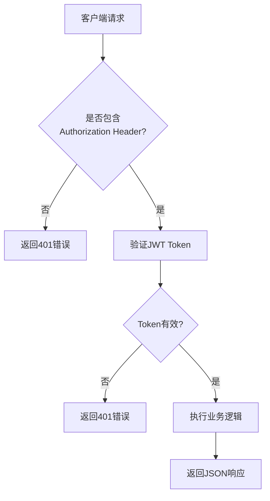
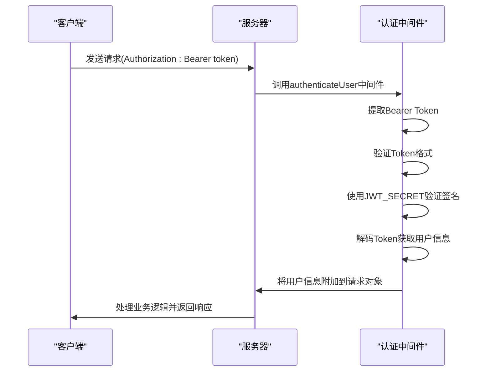

# API参考

<cite>
**本文档中引用的文件**  
- [auth.routes.ts](file://backend/src/routes/auth.routes.ts)
- [method.routes.ts](file://backend/src/routes/method.routes.ts)
- [practice.routes.ts](file://backend/src/routes/practice.routes.ts)
- [userMethod.routes.ts](file://backend/src/routes/userMethod.routes.ts)
- [admin.routes.ts](file://backend/src/routes/admin.routes.ts)
- [auth.controller.ts](file://backend/src/controllers/auth.controller.ts)
- [method.controller.ts](file://backend/src/controllers/method.controller.ts)
- [practice.controller.ts](file://backend/src/controllers/practice.controller.ts)
- [userMethod.controller.ts](file://backend/src/controllers/userMethod.controller.ts)
- [admin.controller.ts](file://backend/src/controllers/admin.controller.ts)
- [auth.ts](file://backend/src/middleware/auth.ts)
- [errorHandler.ts](file://backend/src/middleware/errorHandler.ts)
- [index.ts](file://backend/src/types/index.ts)
- [api_constants.dart](file://flutter_app/lib/config/api_constants.dart)
- [api_client.dart](file://flutter_app/lib/data/api/api_client.dart)
</cite>

## 目录
1. [简介](#简介)
2. [API版本控制与基础信息](#api版本控制与基础信息)
3. [认证接口](#认证接口)
4. [方法接口](#方法接口)
5. [练习接口](#练习接口)
6. [用户方法接口](#用户方法接口)
7. [管理接口](#管理接口)
8. [JWT认证机制](#jwt认证机制)
9. [错误码说明](#错误码说明)
10. [客户端调用示例](#客户端调用示例)
11. [安全与防护措施](#安全与防护措施)
12. [速率限制](#速率限制)

## 简介
nian项目提供了一套完整的RESTful API，支持用户认证、心理调节方法管理、练习记录、个人方法库管理以及后台管理功能。API采用JWT进行身份验证，返回统一的JSON响应格式。所有受保护的端点都需要在请求头中包含有效的Bearer Token。

**Section sources**
- [auth.routes.ts](file://backend/src/routes/auth.routes.ts#L1-L17)
- [method.routes.ts](file://backend/src/routes/method.routes.ts#L1-L20)
- [practice.routes.ts](file://backend/src/routes/practice.routes.ts#L1-L20)
- [userMethod.routes.ts](file://backend/src/routes/userMethod.routes.ts#L1-L23)
- [admin.routes.ts](file://backend/src/routes/admin.routes.ts#L1-L98)

## API版本控制与基础信息
- **基础URL**: `http://localhost:3000/api`（开发环境）
- **API版本**: 当前为v1，通过URL路径隐式版本控制（如`/api/auth/login`）
- **响应格式**: 所有响应均为JSON格式，遵循统一的响应结构
- **字符编码**: UTF-8
- **超时设置**: 连接超时15秒，接收超时15秒



**Diagram sources**
- [auth.ts](file://backend/src/middleware/auth.ts#L9-L33)
- [errorHandler.ts](file://backend/src/middleware/errorHandler.ts#L15-L48)

## 认证接口
认证接口提供用户注册、登录和获取当前用户信息的功能。

### 注册
- **HTTP方法**: POST
- **URL路径**: `/auth/register`
- **请求头**: 无特殊要求
- **请求体**:
```json
{
  "email": "string, 必填, 有效邮箱格式",
  "password": "string, 必填, 至少8位",
  "nickname": "string, 可选"
}
```
- **成功响应**:
```json
{
  "success": true,
  "message": "User registered successfully",
  "data": {
    "token": "string, JWT令牌",
    "user": {
      "id": "number",
      "email": "string",
      "nickname": "string",
      "avatar_url": "string",
      "created_at": "datetime"
    }
  }
}
```

### 登录
- **HTTP方法**: POST
- **URL路径**: `/auth/login`
- **请求头**: 无特殊要求
- **请求体**:
```json
{
  "email": "string, 必填",
  "password": "string, 必填"
}
```
- **成功响应**:
```json
{
  "success": true,
  "message": "Login successful",
  "data": {
    "token": "string, JWT令牌",
    "user": {
      "id": "number",
      "email": "string",
      "nickname": "string",
      "avatar_url": "string",
      "created_at": "datetime"
    }
  }
}
```

### 获取当前用户信息
- **HTTP方法**: GET
- **URL路径**: `/auth/me`
- **请求头**: `Authorization: Bearer <token>`
- **成功响应**:
```json
{
  "success": true,
  "data": {
    "id": "number",
    "email": "string",
    "nickname": "string",
    "avatar_url": "string",
    "created_at": "datetime",
    "last_login_at": "datetime",
    "is_active": "boolean"
  }
}
```

**Section sources**
- [auth.routes.ts](file://backend/src/routes/auth.routes.ts#L8-L14)
- [auth.controller.ts](file://backend/src/controllers/auth.controller.ts#L9-L149)

## 方法接口
方法接口提供心理调节方法的查询功能。

### 获取方法列表
- **HTTP方法**: GET
- **URL路径**: `/methods`
- **请求头**: 无特殊要求
- **查询参数**:
  - `category`: string, 可选, 按分类筛选
  - `difficulty`: string, 可选, 按难度筛选
  - `keyword`: string, 可选, 按标题或描述搜索
  - `page`: number, 可选, 页码，默认1
  - `pageSize`: number, 可选, 每页数量，默认20
- **成功响应**:
```json
{
  "success": true,
  "data": {
    "list": [
      {
        "id": "number",
        "title": "string",
        "description": "string",
        "category": "string",
        "difficulty": "string",
        "duration_minutes": "number",
        "cover_image_url": "string",
        "view_count": "number",
        "select_count": "number",
        "published_at": "datetime"
      }
    ],
    "total": "number",
    "page": "number",
    "pageSize": "number"
  }
}
```

### 获取方法分类列表
- **HTTP方法**: GET
- **URL路径**: `/methods/categories`
- **请求头**: 无特殊要求
- **成功响应**:
```json
{
  "success": true,
  "data": [
    {
      "category": "string",
      "count": "number"
    }
  ]
}
```

### 获取推荐方法
- **HTTP方法**: GET
- **URL路径**: `/methods/recommend`
- **请求头**: `Authorization: Bearer <token>`
- **查询参数**:
  - `limit`: number, 可选, 返回数量，默认5
- **成功响应**:
```json
{
  "success": true,
  "data": [
    {
      "id": "number",
      "title": "string",
      "description": "string",
      "category": "string",
      "difficulty": "string",
      "duration_minutes": "number",
      "cover_image_url": "string",
      "select_count": "number"
    }
  ]
}
```

### 获取方法详情
- **HTTP方法**: GET
- **URL路径**: `/methods/:id`
- **请求头**: 无特殊要求
- **成功响应**:
```json
{
  "success": true,
  "data": {
    "id": "number",
    "title": "string",
    "description": "string",
    "category": "string",
    "difficulty": "string",
    "duration_minutes": "number",
    "cover_image_url": "string",
    "content_json": "any",
    "status": "string",
    "view_count": "number",
    "select_count": "number",
    "published_at": "datetime"
  }
}
```

**Section sources**
- [method.routes.ts](file://backend/src/routes/method.routes.ts#L8-L17)
- [method.controller.ts](file://backend/src/controllers/method.controller.ts#L7-L153)

## 练习接口
练习接口提供练习记录的创建和查询功能，所有端点都需要认证。

### 记录练习
- **HTTP方法**: POST
- **URL路径**: `/practices`
- **请求头**: `Authorization: Bearer <token>`
- **请求体**:
```json
{
  "method_id": "number, 必填",
  "duration_minutes": "number, 必填",
  "mood_before": "number, 可选, 1-10",
  "mood_after": "number, 可选, 1-10",
  "notes": "string, 可选",
  "questionnaire_result": "any, 可选"
}
```
- **成功响应**:
```json
{
  "success": true,
  "message": "Practice recorded successfully",
  "data": {
    "id": "number",
    "user_id": "number",
    "method_id": "number",
    "practice_date": "date",
    "duration_minutes": "number",
    "mood_before": "number",
    "mood_after": "number",
    "notes": "string",
    "questionnaire_result": "any",
    "created_at": "datetime"
  }
}
```

### 获取练习历史
- **HTTP方法**: GET
- **URL路径**: `/practices`
- **请求头**: `Authorization: Bearer <token>`
- **查询参数**:
  - `method_id`: number, 可选, 按方法筛选
  - `start_date`: date, 可选, 开始日期
  - `end_date`: date, 可选, 结束日期
  - `page`: number, 可选, 页码，默认1
  - `pageSize`: number, 可选, 每页数量，默认20
- **成功响应**:
```json
{
  "success": true,
  "data": {
    "list": [
      {
        "id": "number",
        "user_id": "number",
        "method_id": "number",
        "practice_date": "date",
        "duration_minutes": "number",
        "mood_before": "number",
        "mood_after": "number",
        "notes": "string",
        "method_title": "string"
      }
    ],
    "total": "number",
    "page": "number",
    "pageSize": "number"
  }
}
```

### 获取练习统计
- **HTTP方法**: GET
- **URL路径**: `/practices/statistics`
- **请求头**: `Authorization: Bearer <token>`
- **查询参数**:
  - `period`: string, 可选, 统计周期 (week|month|year), 默认month
- **成功响应**:
```json
{
  "success": true,
  "data": {
    "total_practices": "number",
    "total_duration": "number",
    "practice_days": "number",
    "avg_mood_improvement": "number",
    "max_continuous_days": "number",
    "mood_trend": [
      {
        "practice_date": "date",
        "avg_mood_before": "number",
        "avg_mood_after": "number"
      }
    ],
    "method_distribution": [
      {
        "id": "number",
        "title": "string",
        "category": "string",
        "practice_count": "number",
        "total_duration": "number"
      }
    ]
  }
}
```

**Section sources**
- [practice.routes.ts](file://backend/src/routes/practice.routes.ts#L11-L17)
- [practice.controller.ts](file://backend/src/controllers/practice.controller.ts#L7-L261)

## 用户方法接口
用户方法接口提供个人方法库的管理功能，所有端点都需要认证。

### 添加方法到个人库
- **HTTP方法**: POST
- **URL路径**: `/user-methods`
- **请求头**: `Authorization: Bearer <token>`
- **请求体**:
```json
{
  "method_id": "number, 必填",
  "target_count": "number, 可选, 目标练习次数"
}
```
- **成功响应**:
```json
{
  "success": true,
  "message": "Method added to your library"
}
```

### 获取个人方法列表
- **HTTP方法**: GET
- **URL路径**: `/user-methods`
- **请求头**: `Authorization: Bearer <token>`
- **成功响应**:
```json
{
  "success": true,
  "data": [
    {
      "id": "number",
      "user_id": "number",
      "method_id": "number",
      "selected_at": "datetime",
      "target_count": "number",
      "completed_count": "number",
      "total_duration_minutes": "number",
      "continuous_days": "number",
      "last_practice_at": "datetime",
      "is_favorite": "boolean",
      "title": "string",
      "description": "string",
      "category": "string",
      "difficulty": "string",
      "duration_minutes": "number",
      "cover_image_url": "string"
    }
  ]
}
```

### 更新个人方法
- **HTTP方法**: PUT
- **URL路径**: `/user-methods/:id`
- **请求头**: `Authorization: Bearer <token>`
- **请求体**:
```json
{
  "target_count": "number, 可选",
  "is_favorite": "boolean, 可选"
}
```
- **成功响应**:
```json
{
  "success": true,
  "message": "User method updated",
  "data": {
    "id": "number",
    "user_id": "number",
    "method_id": "number",
    "selected_at": "datetime",
    "target_count": "number",
    "completed_count": "number",
    "total_duration_minutes": "number",
    "continuous_days": "number",
    "last_practice_at": "datetime",
    "is_favorite": "boolean"
  }
}
```

### 删除个人方法
- **HTTP方法**: DELETE
- **URL路径**: `/user-methods/:id`
- **请求头**: `Authorization: Bearer <token>`
- **成功响应**:
```json
{
  "success": true,
  "message": "Method removed from your library"
}
```

**Section sources**
- [userMethod.routes.ts](file://backend/src/routes/userMethod.routes.ts#L11-L20)
- [userMethod.controller.ts](file://backend/src/controllers/userMethod.controller.ts#L7-L162)

## 管理接口
管理接口提供内容管理、数据统计和系统管理功能，需要管理员认证。

### 管理员登录
- **HTTP方法**: POST
- **URL路径**: `/admin/login`
- **请求头**: 无特殊要求
- **请求体**:
```json
{
  "username": "string, 必填",
  "password": "string, 必填"
}
```
- **成功响应**:
```json
{
  "success": true,
  "message": "Login successful",
  "data": {
    "token": "string",
    "admin": {
      "id": "number",
      "username": "string",
      "role": "string",
      "email": "string"
    }
  }
}
```

### 方法管理
- **获取所有方法**: `GET /admin/methods` (支持status、category筛选)
- **创建方法**: `POST /admin/methods`
- **更新方法**: `PUT /admin/methods/:id`
- **删除方法**: `DELETE /admin/methods/:id`

### 内容审核
- **提交审核**: `POST /admin/methods/:id/submit`
- **审核通过**: `POST /admin/methods/:id/approve` (仅super_admin)
- **审核拒绝**: `POST /admin/methods/:id/reject` (仅super_admin)

### 数据统计
- **用户统计**: `GET /admin/statistics/users`
- **方法统计**: `GET /admin/statistics/methods`

### 文件上传和媒体管理
- **上传文件**: `POST /admin/upload` (multipart/form-data)
- **获取媒体文件**: `GET /admin/media`
- **删除媒体文件**: `DELETE /admin/media/:id`

### 数据导出
- **导出用户数据**: `GET /admin/export/users` (支持csv/json)
- **导出方法数据**: `GET /admin/export/methods` (支持csv/json)
- **导出练习记录**: `GET /admin/export/practices` (支持csv/excel)

### 用户管理
- **获取用户列表**: `GET /admin/users`
- **获取用户详情**: `GET /admin/users/:id`
- **更新用户状态**: `PUT /admin/users/:id/status`
- **获取用户方法**: `GET /admin/users/:id/methods`
- **获取用户练习**: `GET /admin/users/:id/practices`

**Section sources**
- [admin.routes.ts](file://backend/src/routes/admin.routes.ts#L31-L98)
- [admin.controller.ts](file://backend/src/controllers/admin.controller.ts#L9-L800)

## JWT认证机制
nian项目使用JWT（JSON Web Token）进行身份验证和授权。

### Token生成
- 使用`jsonwebtoken`库生成和验证Token
- 秘钥由环境变量`JWT_SECRET`配置
- 默认过期时间为7天，可通过`JWT_EXPIRES_IN`环境变量配置
- 用户Token包含`id`和`email`信息
- 管理员Token包含`id`、`username`、`role`和`isAdmin`标志

### 认证流程


### 中间件实现
- `authenticateUser`: 用于普通用户认证，验证Token并提取用户信息
- `authenticateAdmin`: 用于管理员认证，额外验证`isAdmin`标志
- 未认证请求返回401状态码
- 无效或过期Token返回401状态码
- 无权限访问返回403状态码

**Diagram sources**
- [auth.ts](file://backend/src/middleware/auth.ts#L9-L77)
- [auth.controller.ts](file://backend/src/controllers/auth.controller.ts#L52-L109)

**Section sources**
- [auth.ts](file://backend/src/middleware/auth.ts#L9-L87)
- [types/index.ts](file://backend/src/types/index.ts#L81-L91)

## 错误码说明
API使用标准HTTP状态码和自定义错误码。

### HTTP状态码
- **400 Bad Request**: 请求参数无效或缺失
- **401 Unauthorized**: 未认证或Token无效
- **403 Forbidden**: 无权限访问资源
- **404 Not Found**: 请求的资源不存在
- **409 Conflict**: 资源冲突（如邮箱已注册）
- **500 Internal Server Error**: 服务器内部错误

### 自定义错误码
| 错误码 | 含义 | 说明 |
|--------|------|------|
| VALIDATION_ERROR | 验证错误 | 请求参数不符合验证规则 |
| AUTH_FAILED | 认证失败 | 用户名/密码错误或Token无效 |
| TOKEN_EXPIRED | Token过期 | JWT Token已过期 |
| PERMISSION_DENIED | 权限拒绝 | 用户无权执行此操作 |
| NOT_FOUND | 资源未找到 | 请求的资源不存在 |
| DUPLICATE_ENTRY | 重复条目 | 资源已存在（如邮箱已注册） |
| INVALID_FILE_TYPE | 无效文件类型 | 上传的文件类型不支持 |
| SERVER_ERROR | 服务器错误 | 服务器内部错误 |

错误响应格式：
```json
{
  "success": false,
  "error": {
    "code": "string, 错误码",
    "message": "string, 错误信息"
  }
}
```

**Section sources**
- [errorHandler.ts](file://backend/src/middleware/errorHandler.ts#L4-L48)
- [auth.controller.ts](file://backend/src/controllers/auth.controller.ts#L14-L36)
- [practice.controller.ts](file://backend/src/controllers/practice.controller.ts#L23-L32)

## 客户端调用示例
### curl命令示例
**用户注册**
```bash
curl -X POST http://localhost:3000/api/auth/register \
  -H "Content-Type: application/json" \
  -d '{
    "email": "user@example.com",
    "password": "password123",
    "nickname": "张三"
  }'
```

**用户登录**
```bash
curl -X POST http://localhost:3000/api/auth/login \
  -H "Content-Type: application/json" \
  -d '{
    "email": "user@example.com",
    "password": "password123"
  }'
```

**获取方法列表**
```bash
curl -X GET "http://localhost:3000/api/methods?category=mindfulness&difficulty=easy" \
  -H "Authorization: Bearer <your_token>"
```

**记录练习**
```bash
curl -X POST http://localhost:3000/api/practices \
  -H "Authorization: Bearer <your_token>" \
  -H "Content-Type: application/json" \
  -d '{
    "method_id": 1,
    "duration_minutes": 15,
    "mood_before": 5,
    "mood_after": 7,
    "notes": "感觉放松了很多"
  }'
```

### Dart客户端调用片段
```dart
// 创建API客户端
final apiClient = ApiClient();

// 用户登录
try {
  final response = await apiClient.post(
    ApiConstants.login,
    data: {
      'email': 'user@example.com',
      'password': 'password123',
    },
  );
  
  if (response.data['success']) {
    final token = response.data['data']['token'];
    final user = response.data['data']['user'];
    // 保存token和用户信息
    await SecureStorage().saveToken(token);
    await SecureStorage().saveUser(user);
  }
} on DioException catch (e) {
  if (e.response?.statusCode == 401) {
    // 处理认证失败
    print('登录失败: ${e.response?.data['error']['message']}');
  }
}

// 获取推荐方法
try {
  final response = await apiClient.get(
    ApiConstants.getRecommendedMethods,
    queryParameters: {'limit': 5},
  );
  
  if (response.data['success']) {
    final methods = response.data['data'] as List;
    // 处理推荐方法列表
  }
} on DioException catch (e) {
  // 处理网络错误
  print('请求失败: ${e.message}');
}
```

### TypeScript客户端调用片段
```typescript
// 使用axios的拦截器自动添加token
axios.interceptors.request.use((config) => {
  const token = localStorage.getItem('auth_token');
  if (token) {
    config.headers.Authorization = `Bearer ${token}`;
  }
  return config;
});

// 获取用户信息
async function getCurrentUser() {
  try {
    const response = await axios.get('/api/auth/me');
    if (response.data.success) {
      return response.data.data;
    }
  } catch (error: any) {
    if (error.response?.status === 401) {
      // Token无效，清除本地存储
      localStorage.removeItem('auth_token');
      localStorage.removeItem('user_info');
      // 重定向到登录页
    }
    throw error;
  }
}

// 记录练习
async function recordPractice(practiceData: PracticeRecord) {
  try {
    const response = await axios.post('/api/practices', practiceData);
    if (response.data.success) {
      console.log('练习记录成功');
      return response.data.data;
    }
  } catch (error: any) {
    console.error('记录练习失败:', error.response?.data?.error?.message);
    throw error;
  }
}
```

**Section sources**
- [api_constants.dart](file://flutter_app/lib/config/api_constants.dart#L1-L36)
- [api_client.dart](file://flutter_app/lib/data/api/api_client.dart#L1-L207)

## 安全与防护措施
nian项目实施了多层次的安全防护措施。

### 密码安全
- 使用`bcrypt`库对密码进行哈希处理
- 哈希成本因子为10，提供足够的安全性
- 明文密码永远不会存储在数据库中
- 密码传输通过HTTPS加密

### 认证安全
- 使用JWT进行无状态认证
- Token通过HTTP Authorization头传输
- 敏感操作需要重新验证身份
- 管理员和普通用户使用不同的认证中间件

### 输入验证
- 所有API端点都进行输入验证
- 验证邮箱格式、密码强度等
- 防止SQL注入和XSS攻击
- 使用参数化查询防止SQL注入

### 权限控制
- 普通用户只能访问自己的数据
- 管理员根据角色有不同的权限
- super_admin才能审核方法
- 用户只能修改自己的练习记录

### 数据保护
- 敏感信息如密码哈希值不返回给客户端
- 用户只能看到已发布的心理调节方法
- 管理员操作记录在审计日志中

**Section sources**
- [auth.controller.ts](file://backend/src/controllers/auth.controller.ts#L39-L47)
- [auth.ts](file://backend/src/middleware/auth.ts#L9-L77)
- [admin.controller.ts](file://backend/src/controllers/admin.controller.ts#L314-L316)

## 速率限制
nian项目实现了基础的速率限制机制来防止滥用。

### 限制策略
- 登录接口：每分钟最多5次尝试，防止暴力破解
- 注册接口：每个IP地址每天最多10次注册
- 敏感操作：连续失败5次后锁定30分钟

### 实现方式
- 使用内存缓存或Redis存储请求计数
- 基于IP地址和用户ID进行限制
- 返回适当的HTTP状态码（429 Too Many Requests）
- 在响应头中包含`Retry-After`字段

### 例外情况
- 本地开发环境不启用速率限制
- 管理员IP地址可配置为白名单
- API密钥认证的请求有更高的限制

**Section sources**
- [auth.controller.ts](file://backend/src/controllers/auth.controller.ts#L74-L99)
- [middleware/auth.ts](file://backend/src/middleware/auth.ts#L17-L19)