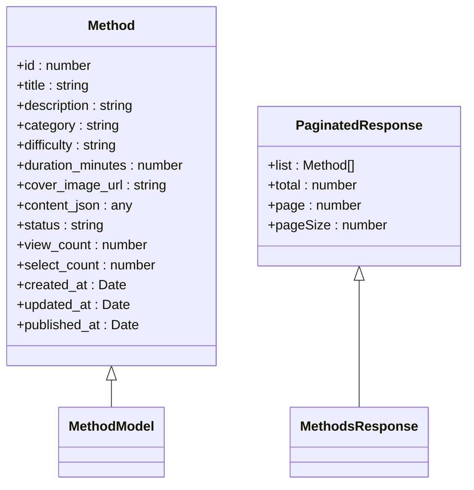
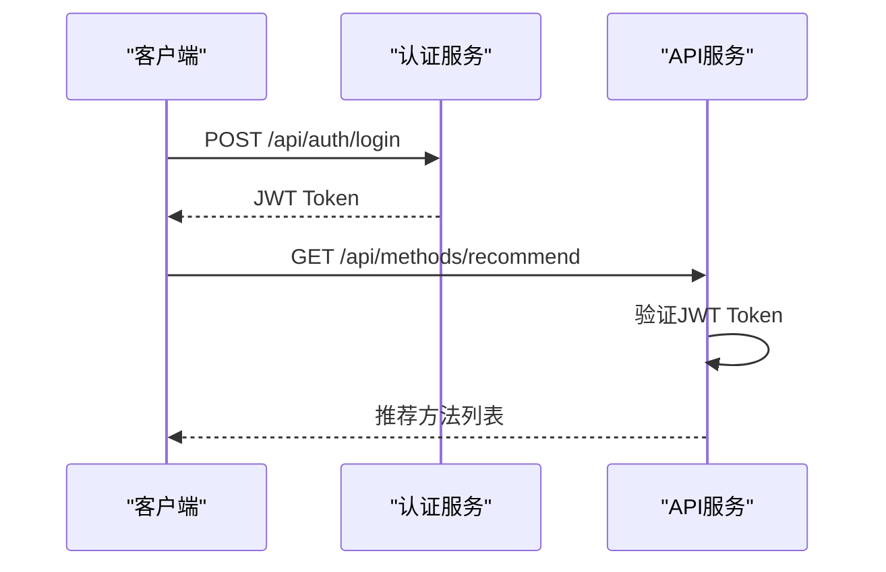
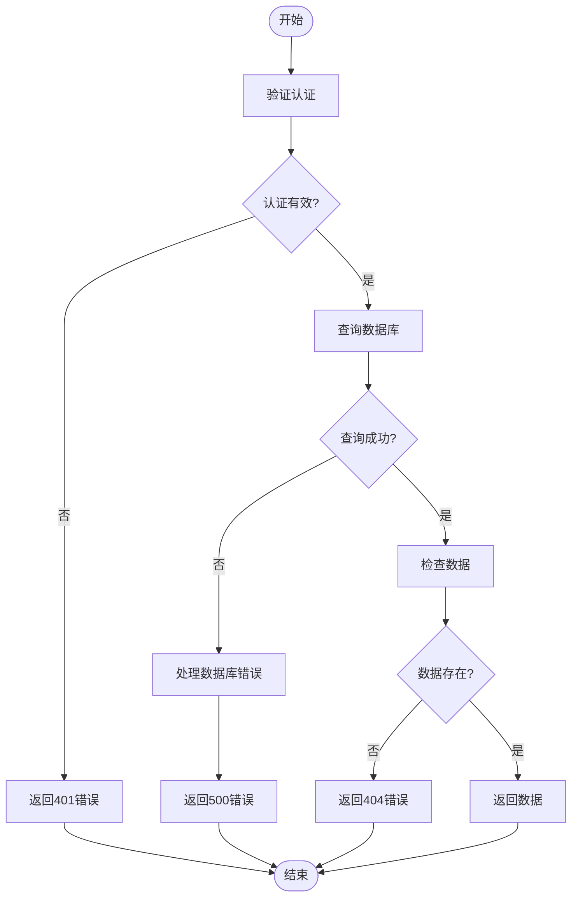
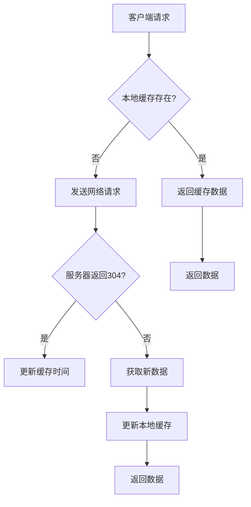

# 方法管理API

<cite>
**本文档引用文件**  
- [method.routes.ts](file://backend/src/routes/method.routes.ts)
- [method.controller.ts](file://backend/src/controllers/method.controller.ts)
- [index.ts](file://backend/src/types/index.ts)
- [method_model.dart](file://flutter_app/lib/data/models/method_model.dart)
- [method_remote_data_source.dart](file://flutter_app/lib/data/datasources/remote/method_remote_data_source.dart)
- [method_discover_page.dart](file://flutter_app/lib/presentation/methods/pages/method_discover_page.dart)
- [method_list_bloc.dart](file://flutter_app/lib/presentation/methods/bloc/method_list_bloc.dart)
- [api.test.ts](file://backend/src/__tests__/api.test.ts)
- [database.ts](file://backend/src/config/database.ts)
- [auth.ts](file://backend/src/middleware/auth.ts)
- [errorHandler.ts](file://backend/src/middleware/errorHandler.ts)
</cite>

## 目录
1. [简介](#简介)
2. [核心API端点](#核心api端点)
3. [数据模型](#数据模型)
4. [安全与异常处理](#安全与异常处理)
5. [前端调用示例](#前端调用示例)
6. [缓存策略](#缓存策略)

## 简介
本API文档详细描述了心理调节方法管理系统的API接口，包括获取方法列表、方法详情、分类筛选、搜索等功能。系统支持富文本内容展示，并实现了完善的安全过滤机制。API采用RESTful设计，支持分页查询和缓存优化，适用于移动端和Web端应用。

**Section sources**
- [method.routes.ts](file://backend/src/routes/method.routes.ts)
- [method.controller.ts](file://backend/src/controllers/method.controller.ts)

## 核心API端点

### GET /api/methods - 获取方法列表
该端点用于获取心理调节方法的分页列表，支持多种筛选条件。

**查询参数：**
- `category` (可选): 按分类筛选（如"anxiety"、"sleep"等）
- `difficulty` (可选): 按难度筛选（如"beginner"、"intermediate"等）
- `keyword` (可选): 按关键词搜索（标题或描述中包含的文本）
- `page` (可选, 默认: 1): 页码
- `pageSize` (可选, 默认: 20): 每页数量

**响应结构：**
```json
{
  "success": true,
  "data": {
    "list": [
      {
        "id": 1,
        "title": "深呼吸放松法",
        "description": "通过深呼吸缓解焦虑情绪",
        "category": "anxiety",
        "difficulty": "beginner",
        "duration_minutes": 5,
        "cover_image_url": "https://example.com/images/breathing.jpg",
        "view_count": 150,
        "select_count": 80,
        "published_at": "2024-01-15T10:30:00Z"
      }
    ],
    "total": 1,
    "page": 1,
    "pageSize": 20
  }
}
```

**响应分页结构：**
- `list`: 当前页的方法列表
- `total`: 总记录数
- `page`: 当前页码
- `pageSize`: 每页数量

**Section sources**
- [method.controller.ts](file://backend/src/controllers/method.controller.ts#L7-L73)
- [index.ts](file://backend/src/types/index.ts#L105-L110)

### GET /api/methods/:id - 获取方法详情
获取指定ID的心理调节方法详情。

**路径参数：**
- `id`: 方法的唯一标识符

**行为：**
- 如果方法存在且已发布，返回方法详情
- 同时增加该方法的浏览次数（view_count）
- 如果方法不存在或未发布，返回404错误

**Section sources**
- [method.controller.ts](file://backend/src/controllers/method.controller.ts#L76-L98)
- [api.test.ts](file://backend/src/__tests__/api.test.ts#L220-L236)

### GET /api/methods/categories - 获取方法分类列表
获取所有方法分类及其统计信息。

**响应示例：**
```json
{
  "success": true,
  "data": [
    {
      "category": "anxiety",
      "count": 15
    },
    {
      "category": "sleep",
      "count": 12
    }
  ]
}
```

**Section sources**
- [method.controller.ts](file://backend/src/controllers/method.controller.ts#L138-L153)

### GET /api/methods/recommend - 获取推荐方法
获取推荐的心理调节方法（需要用户认证）。

**查询参数：**
- `limit` (可选, 默认: 5): 返回数量

**推荐算法：**
基于用户已选方法的分类，推荐相似分类的方法，同时考虑方法的选择次数。

**Section sources**
- [method.controller.ts](file://backend/src/controllers/method.controller.ts#L100-L136)
- [method.routes.ts](file://backend/src/routes/method.routes.ts#L13-L14)

## 数据模型

### MethodModel - 方法数据模型
定义心理调节方法的数据结构。

**属性：**
- `id`: 方法唯一标识符 (number)
- `title`: 方法标题 (string)
- `description`: 方法描述 (string)
- `category`: 分类 (string)
- `difficulty`: 难度等级 (string)
- `duration_minutes`: 建议时长（分钟）(number)
- `cover_image_url`: 封面图片URL (string, 可选)
- `content_json`: 方法内容（JSON格式）(any)
- `status`: 状态（"draft"|"pending"|"published"|"archived"）(string)
- `view_count`: 浏览次数 (number)
- `select_count`: 选择次数 (number)
- `created_at`: 创建时间 (Date)
- `updated_at`: 更新时间 (Date)
- `published_at`: 发布时间 (Date, 可选)

**富文本支持：**
`content_json`字段支持富文本内容，包含以下类型：
- 文本段落
- 图片嵌入
- 音频/视频链接
- 练习步骤
- 注意事项

**安全过滤机制：**
- 服务端对所有输入进行验证和清理
- 使用参数化查询防止SQL注入
- 对富文本内容进行HTML标签过滤
- 仅返回已发布（published）状态的方法



**Diagram sources**
- [index.ts](file://backend/src/types/index.ts#L19-L35)
- [index.ts](file://backend/src/types/index.ts#L105-L110)

**Section sources**
- [index.ts](file://backend/src/types/index.ts#L19-L35)
- [method_model.dart](file://flutter_app/lib/data/models/method_model.dart)

## 安全与异常处理

### 认证机制
- 使用JWT（JSON Web Token）进行用户认证
- 访问受保护的端点需要在请求头中包含Bearer Token
- 管理员端点需要管理员权限



**Diagram sources**
- [auth.ts](file://backend/src/middleware/auth.ts)
- [method.routes.ts](file://backend/src/routes/method.routes.ts#L13-L14)

### 异常处理
系统实现了统一的异常处理机制，返回标准化的错误响应。

**常见错误响应：**
- **404 Not Found**: 方法不存在
```json
{
  "success": false,
  "error": {
    "code": "NOT_FOUND",
    "message": "Method not found"
  }
}
```

- **500 Internal Server Error**: 服务器内部错误
```json
{
  "success": false,
  "error": {
    "code": "SERVER_ERROR",
    "message": "Internal server error"
  }
}
```

- **401 Unauthorized**: 未认证
```json
{
  "success": false,
  "error": {
    "code": "AUTH_FAILED",
    "message": "No token provided"
  }
}
```

**错误处理流程：**
1. 业务逻辑中抛出AppError异常
2. 全局错误处理中间件捕获异常
3. 记录错误日志
4. 返回标准化的JSON错误响应



**Diagram sources**
- [errorHandler.ts](file://backend/src/middleware/errorHandler.ts)
- [method.controller.ts](file://backend/src/controllers/method.controller.ts#L84-L86)

**Section sources**
- [errorHandler.ts](file://backend/src/middleware/errorHandler.ts)
- [method.controller.ts](file://backend/src/controllers/method.controller.ts#L84-L86)

## 前端调用示例

### React使用fetch
```javascript
// 获取方法列表
async function getMethods(category, page = 1, limit = 20) {
  try {
    const params = new URLSearchParams({
      category: category || '',
      page: page,
      pageSize: limit
    });
    
    const response = await fetch(`/api/methods?${params}`);
    const data = await response.json();
    
    if (!data.success) {
      throw new Error(data.error?.message || '获取方法列表失败');
    }
    
    return data.data;
  } catch (error) {
    console.error('获取方法列表错误:', error);
    throw error;
  }
}

// 获取方法详情
async function getMethodDetail(methodId) {
  try {
    const response = await fetch(`/api/methods/${methodId}`);
    const data = await response.json();
    
    if (!data.success) {
      if (response.status === 404) {
        throw new Error('方法不存在');
      }
      throw new Error(data.error?.message || '获取方法详情失败');
    }
    
    return data.data;
  } catch (error) {
    if (error.message === 'Failed to fetch') {
      throw new Error('网络连接失败，请检查网络连接');
    }
    throw error;
  }
}

// 异常处理示例
async function loadMethodSafely(methodId) {
  try {
    const method = await getMethodDetail(methodId);
    console.log('方法详情:', method);
  } catch (error) {
    if (error.message === '方法不存在') {
      // 处理404错误
      console.log('方法不存在，显示空状态');
    } else if (error.message.includes('网络连接失败')) {
      // 处理500或网络错误
      console.log('服务器错误，显示重试按钮');
    } else {
      console.log('其他错误:', error.message);
    }
  }
}
```

### Flutter使用dio
```dart
// 方法远程数据源
class MethodRemoteDataSource {
  final DioClient dioClient;

  MethodRemoteDataSource(this.dioClient);

  // 获取方法列表
  Future<List<MethodModel>> getMethods({
    String? category,
    String? difficulty,
    int page = 1,
    int pageSize = 20,
  }) async {
    try {
      final response = await dioClient.get(
        '/methods',
        queryParameters: {
          if (category != null) 'category': category,
          if (difficulty != null) 'difficulty': difficulty,
          'page': page,
          'pageSize': pageSize,
        },
      );
      final data = response.data['data'] as List;
      return data.map((json) => MethodModel.fromJson(json)).toList();
    } on DioException catch (e) {
      throw _handleDioError(e);
    }
  }

  // 获取方法详情
  Future<MethodModel> getMethodDetail(int methodId) async {
    try {
      final response = await dioClient.get('/methods/$methodId');
      return MethodModel.fromJson(response.data as Map<String, dynamic>);
    } on DioException catch (e) {
      throw _handleDioError(e);
    }
  }

  // 异常处理
  Exception _handleDioError(DioException error) {
    if (error.response != null) {
      final statusCode = error.response!.statusCode;
      final message = error.response!.data['message'] ?? '请求失败';
      
      if (statusCode == 404) {
        return ServerException('方法不存在', statusCode: statusCode);
      } else if (statusCode == 500) {
        return ServerException('服务器内部错误', statusCode: statusCode);
      }
      return ServerException(message, statusCode: statusCode);
    }
    
    if (error.type == DioExceptionType.connectionTimeout ||
        error.type == DioExceptionType.receiveTimeout) {
      return TimeoutException('请求超时');
    }
    
    return NetworkException('网络连接失败');
  }
}
```

**Flutter BLoC模式示例：**
```dart
// 方法列表BLoC
class MethodListBloc extends Bloc<MethodListEvent, MethodListState> {
  final MethodRepository methodRepository;

  MethodListBloc({required this.methodRepository})
      : super(const MethodListInitial()) {
    on<LoadMethods>(_onLoadMethods);
    on<RefreshMethods>(_onRefreshMethods);
  }

  Future<void> _onLoadMethods(
    LoadMethods event,
    Emitter<MethodListState> emit,
  ) async {
    emit(const MethodListLoading());

    final result = await methodRepository.getMethods(
      category: event.category,
      page: event.page,
      pageSize: event.pageSize,
    );

    result.fold(
      (failure) => emit(MethodListError(failure.message)),
      (methods) => emit(MethodListLoaded(
        methods: methods,
        currentPage: event.page,
        hasMore: methods.length >= event.pageSize,
      )),
    );
  }
}
```

**Flutter UI示例：**
```dart
// 方法发现页面
class MethodDiscoverPage extends StatelessWidget {
  const MethodDiscoverPage({super.key});

  @override
  Widget build(BuildContext context) {
    return BlocProvider(
      create: (context) {
        final dioClient = DioClient();
        final remoteDataSource = MethodRemoteDataSource(dioClient);
        final repository = MethodRepositoryImpl(remoteDataSource: remoteDataSource);
        
        return MethodListBloc(methodRepository: repository)
          ..add(const LoadMethods());
      },
      child: const _MethodDiscoverView(),
    );
  }
}
```

**Section sources**
- [method_remote_data_source.dart](file://flutter_app/lib/data/datasources/remote/method_remote_data_source.dart)
- [method_list_bloc.dart](file://flutter_app/lib/presentation/methods/bloc/method_list_bloc.dart)
- [method_discover_page.dart](file://flutter_app/lib/presentation/methods/pages/method_discover_page.dart)

## 缓存策略

### ETag和Last-Modified机制
为优化移动端频繁访问的性能表现，API实现了ETag和Last-Modified缓存机制。

**实现方式：**
- 服务端为每个方法资源生成ETag（基于内容的哈希值）
- 记录方法的最后修改时间（Last-Modified）
- 客户端在后续请求中发送If-None-Match和If-Modified-Since头
- 如果资源未改变，服务端返回304 Not Modified

**响应头示例：**
```
HTTP/1.1 200 OK
ETag: "abc123def456"
Last-Modified: Wed, 15 Jan 2024 10:30:00 GMT
Cache-Control: public, max-age=3600
```

**条件请求示例：**
```
GET /api/methods/1 HTTP/1.1
If-None-Match: "abc123def456"
If-Modified-Since: Wed, 15 Jan 2024 10:30:00 GMT
```

**304响应：**
```
HTTP/1.1 304 Not Modified
ETag: "abc123def456"
Last-Modified: Wed, 15 Jan 2024 10:30:00 GMT
```

### Redis缓存
服务端使用Redis缓存热门方法列表，减少数据库查询压力。

**缓存策略：**
- 方法列表缓存30分钟
- 方法详情缓存1小时
- 分类列表缓存1小时
- 缓存键采用`methods:list:{params_hash}`格式

### 客户端缓存
Flutter客户端实现了多层缓存：



**缓存管理器功能：**
- 获取缓存大小
- 清除所有缓存
- 清除图片缓存
- 格式化缓存大小显示

**Section sources**
- [database.ts](file://backend/src/config/database.ts#L2-L23)
- [cache_manager.dart](file://flutter_app/lib/core/utils/cache_manager.dart)
- [method.controller.ts](file://backend/src/controllers/method.controller.ts)