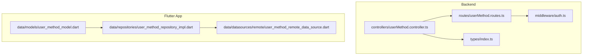
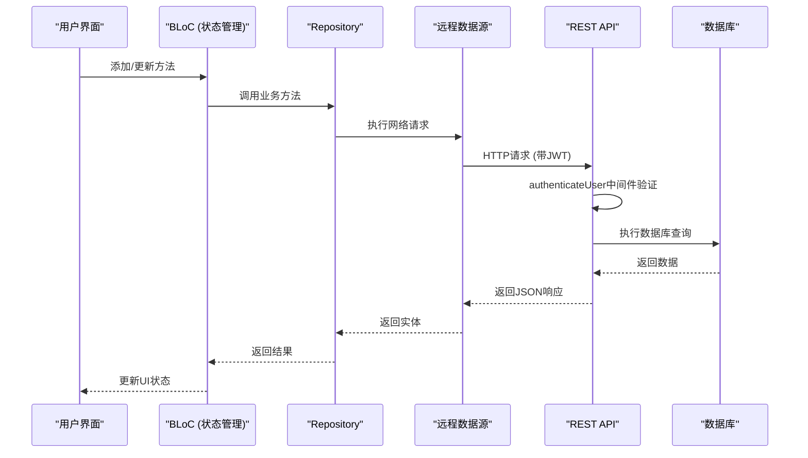
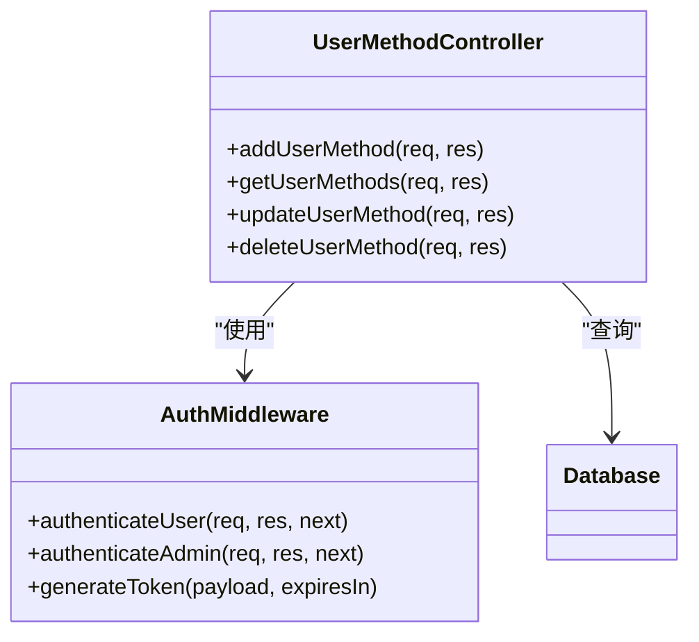
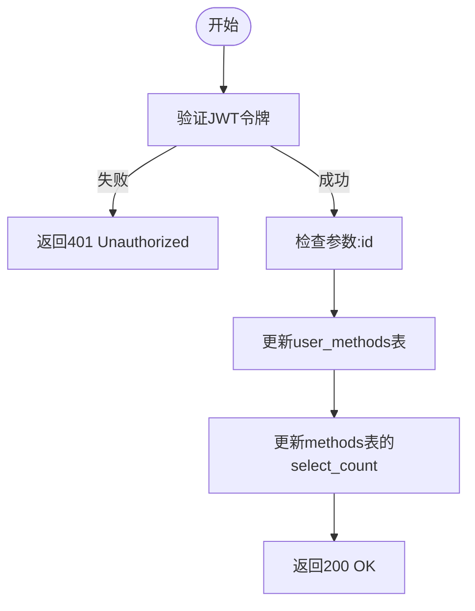
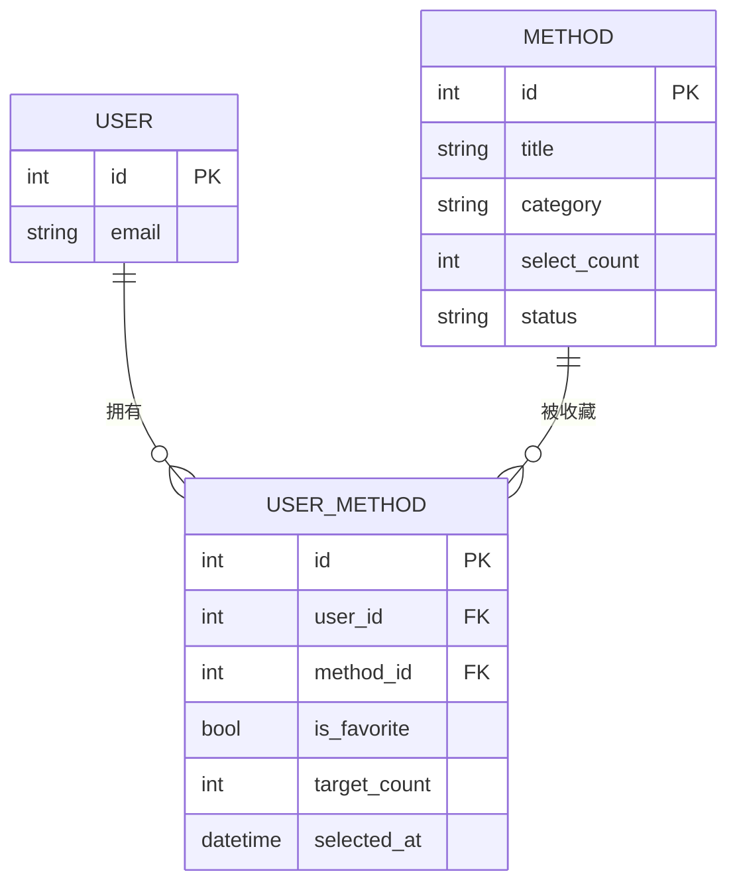
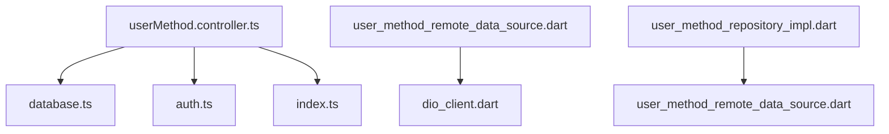

# 用户方法偏好API

<cite>
**本文档引用的文件**
- [userMethod.controller.ts](file://backend/src/controllers/userMethod.controller.ts)
- [userMethod.routes.ts](file://backend/src/routes/userMethod.routes.ts)
- [auth.ts](file://backend/src/middleware/auth.ts)
- [index.ts](file://backend/src/types/index.ts)
- [user_method_model.dart](file://flutter_app/lib/data/models/user_method_model.dart)
- [user_method_repository_impl.dart](file://flutter_app/lib/data/repositories/user_method_repository_impl.dart)
- [user_method_remote_data_source.dart](file://flutter_app/lib/data/datasources/remote/user_method_remote_data_source.dart)
- [method.controller.ts](file://backend/src/controllers/method.controller.ts)
</cite>

## 目录
1. [简介](#简介)
2. [项目结构](#项目结构)
3. [核心组件](#核心组件)
4. [架构概述](#架构概述)
5. [详细组件分析](#详细组件分析)
6. [依赖分析](#依赖分析)
7. [性能考虑](#性能考虑)
8. [故障排除指南](#故障排除指南)
9. [结论](#结论)

## 简介
本文档详细说明了用户个性化方法偏好管理的API，包括收藏、取消收藏和获取用户专属方法列表等操作。重点描述了`PUT /api/user-methods/:id`端点如何切换收藏状态，以及`GET /api/user-methods`返回用户已收藏方法的结构。同时说明了该接口与推荐算法的数据联动机制（如用于生成“常练方法”推荐），并提供React组件中调用该API实现收藏按钮状态切换的示例，讨论乐观更新（Optimistic Update）在UI响应性上的应用。强调该接口需用户认证且仅限操作自身数据。

## 项目结构
用户方法偏好管理功能分布在后端和前端两个主要部分。后端位于`backend/src`目录下，包含控制器、路由、中间件和类型定义；前端Flutter应用位于`flutter_app/lib`目录下，采用分层架构（数据、领域、展示层）组织代码。

**图表来源**
- [userMethod.controller.ts](file://backend/src/controllers/userMethod.controller.ts#L1-L162)
- [userMethod.routes.ts](file://backend/src/routes/userMethod.routes.ts#L1-L23)
- [user_method_model.dart](file://flutter_app/lib/data/models/user_method_model.dart#L1-L89)

**章节来源**
- [userMethod.controller.ts](file://backend/src/controllers/userMethod.controller.ts#L1-L162)
- [userMethod.routes.ts](file://backend/src/routes/userMethod.routes.ts#L1-L23)

## 核心组件
核心功能由后端的`userMethod.controller.ts`中的四个主要函数构成：`addUserMethod`、`getUserMethods`、`updateUserMethod`和`deleteUserMethod`。这些函数通过`userMethod.routes.ts`暴露为REST API，并受到`auth.ts`中`authenticateUser`中间件的保护。前端通过`UserMethodRemoteDataSource`调用这些API，并通过`UserMethodRepositoryImpl`封装业务逻辑。

**章节来源**
- [userMethod.controller.ts](file://backend/src/controllers/userMethod.controller.ts#L1-L162)
- [user_method_repository_impl.dart](file://flutter_app/lib/data/repositories/user_method_repository_impl.dart#L1-L84)

## 架构概述
系统采用典型的分层架构，从前端UI到后端数据库形成清晰的数据流。用户操作触发前端BLoC模式的状态管理，通过远程数据源调用受JWT认证保护的REST API，最终操作PostgreSQL数据库。

**图表来源**
- [userMethod.controller.ts](file://backend/src/controllers/userMethod.controller.ts#L1-L162)
- [user_method_remote_data_source.dart](file://flutter_app/lib/data/datasources/remote/user_method_remote_data_source.dart#L1-L86)
- [auth.ts](file://backend/src/middleware/auth.ts#L1-L87)

## 详细组件分析

### 用户方法控制器分析
后端控制器实现了完整的CRUD操作，所有操作都要求用户认证。`updateUserMethod`函数支持部分更新，允许单独修改`target_count`或`is_favorite`字段。

**图表来源**
- [userMethod.controller.ts](file://backend/src/controllers/userMethod.controller.ts#L1-L162)
- [auth.ts](file://backend/src/middleware/auth.ts#L1-L87)

### API端点分析
`PUT /api/user-methods/:id`端点用于切换收藏状态，通过更新`is_favorite`字段实现。该操作是幂等的，可以安全地重复调用。

**图表来源**
- [userMethod.controller.ts](file://backend/src/controllers/userMethod.controller.ts#L82-L131)
- [userMethod.routes.ts](file://backend/src/routes/userMethod.routes.ts#L17-L18)

### 推荐算法联动机制
用户的方法偏好数据被用于推荐算法。`getRecommendedMethods`函数查询用户已收藏方法的分类，并推荐同类的热门方法。

**图表来源**
- [method.controller.ts](file://backend/src/controllers/method.controller.ts#L100-L136)
- [userMethod.controller.ts](file://backend/src/controllers/userMethod.controller.ts#L7-L56)

## 依赖分析
系统依赖关系清晰，后端控制器依赖数据库连接池和认证中间件，前端数据源依赖Dio网络客户端。所有用户数据操作都通过`user_id`进行隔离，确保用户只能操作自己的数据。

**图表来源**
- [userMethod.controller.ts](file://backend/src/controllers/userMethod.controller.ts#L1-L162)
- [user_method_repository_impl.dart](file://flutter_app/lib/data/repositories/user_method_repository_impl.dart#L1-L84)

## 性能考虑
API设计考虑了性能优化，如在添加/删除方法时同步更新`methods`表的`select_count`字段，避免了后续推荐算法的复杂查询。数据库查询使用参数化查询防止SQL注入，并通过索引优化查询性能。

## 故障排除指南
常见问题包括认证失败（401）、方法不存在（404）和重复添加（409）。前端应妥善处理这些错误状态，并向用户提供清晰的反馈信息。

**章节来源**
- [userMethod.controller.ts](file://backend/src/controllers/userMethod.controller.ts#L1-L162)
- [user_method_remote_data_source.dart](file://flutter_app/lib/data/datasources/remote/user_method_remote_data_source.dart#L71-L85)

## 结论
用户方法偏好API设计合理，功能完整，安全可靠。通过JWT认证确保数据安全，通过清晰的分层架构保证代码可维护性。前端采用BLoC模式实现状态管理，结合乐观更新可提供流畅的用户体验。推荐算法有效利用用户偏好数据，为个性化服务提供支持。