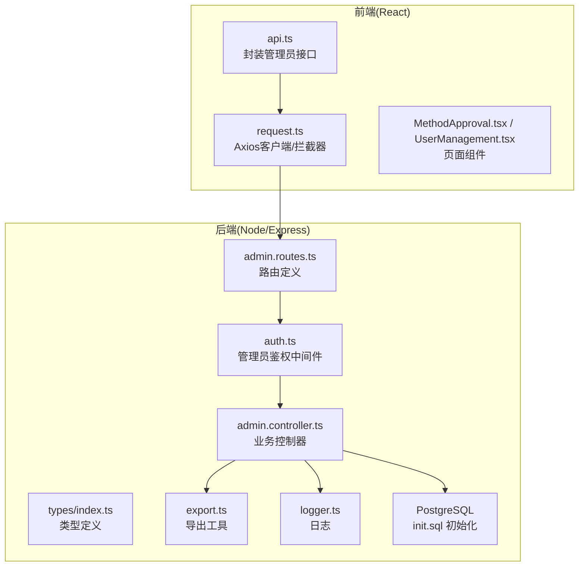
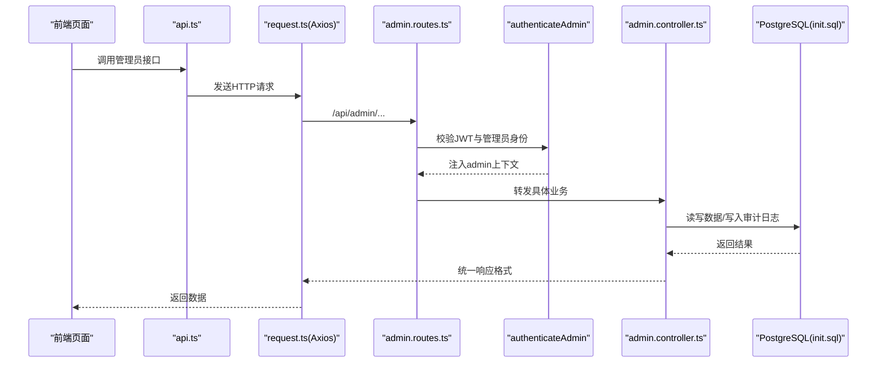
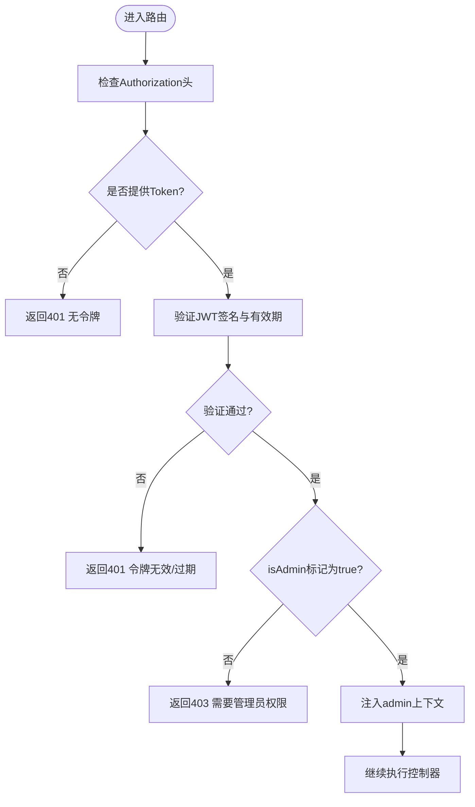
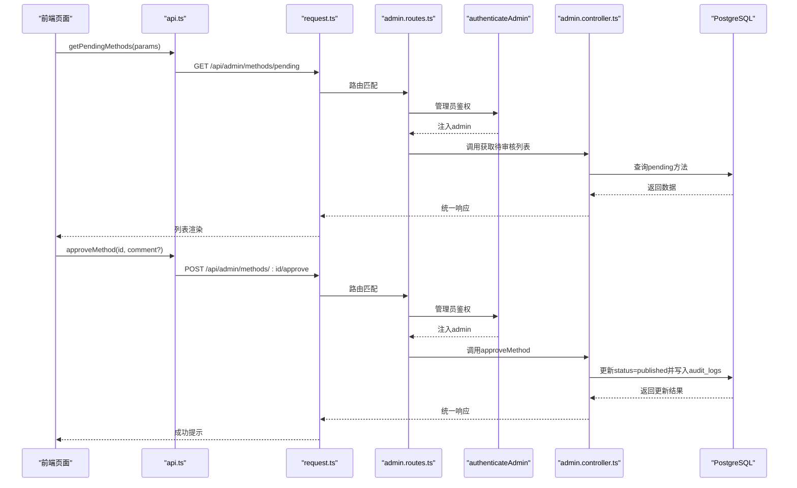
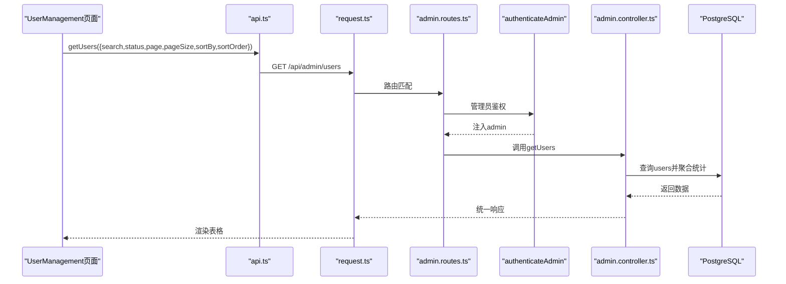
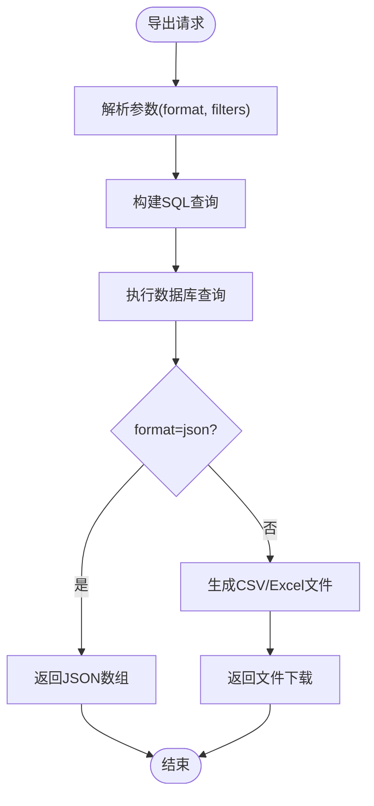
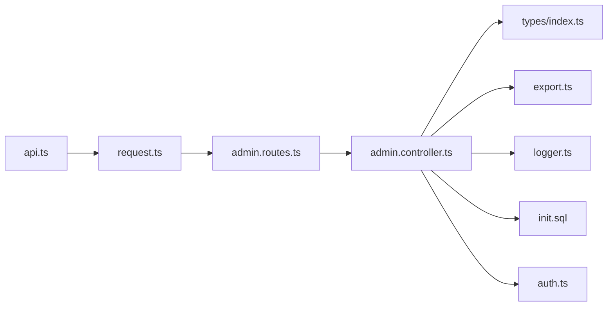

# 管理后台API

<cite>
**本文引用的文件**
- [backend/src/controllers/admin.controller.ts](file://backend/src/controllers/admin.controller.ts)
- [backend/src/routes/admin.routes.ts](file://backend/src/routes/admin.routes.ts)
- [backend/src/middleware/auth.ts](file://backend/src/middleware/auth.ts)
- [backend/src/types/index.ts](file://backend/src/types/index.ts)
- [backend/src/utils/export.ts](file://backend/src/utils/export.ts)
- [backend/src/utils/logger.ts](file://backend/src/utils/logger.ts)
- [database/init.sql](file://database/init.sql)
- [home/user/nian/admin-web/src/services/api.ts](file://home/user/nian/admin-web/src/services/api.ts)
- [home/user/nian/admin-web/src/utils/request.ts](file://home/user/nian/admin-web/src/utils/request.ts)
- [home/user/nian/admin-web/src/pages/MethodApproval.tsx](file://home/user/nian/admin-web/src/pages/MethodApproval.tsx)
- [home/user/nian/admin-web/src/pages/UserManagement.tsx](file://home/user/nian/admin-web/src/pages/UserManagement.tsx)
</cite>

## 目录
1. [简介](#简介)
2. [项目结构](#项目结构)
3. [核心组件](#核心组件)
4. [架构总览](#架构总览)
5. [详细组件分析](#详细组件分析)
6. [依赖关系分析](#依赖关系分析)
7. [性能考量](#性能考量)
8. [故障排查指南](#故障排查指南)
9. [结论](#结论)
10. [附录](#附录)

## 简介
本文件为“管理后台API”的参考文档，聚焦管理员专用接口，覆盖方法审核、用户管理、数据导出等能力。重点说明：
- 待审核方法列表查询与审核流程
- 用户查询与状态管理
- 数据导出能力（用户、方法、练习记录）
- 管理员权限验证机制（基于角色的访问控制）
- 敏感操作的日志记录与安全审计
- curl 测试命令示例与前端 React 页面调用方式

## 项目结构
后端采用 Express + PostgreSQL 架构，管理员相关接口集中在 admin 路由与控制器中；前端使用 React + Ant Design，通过 api.ts 封装调用后端 /api/admin/* 接口。

图表来源
- [backend/src/routes/admin.routes.ts](file://backend/src/routes/admin.routes.ts#L1-L98)
- [backend/src/controllers/admin.controller.ts](file://backend/src/controllers/admin.controller.ts#L1-L120)
- [backend/src/middleware/auth.ts](file://backend/src/middleware/auth.ts#L1-L87)
- [backend/src/utils/export.ts](file://backend/src/utils/export.ts#L1-L130)
- [database/init.sql](file://database/init.sql#L1-L150)

章节来源
- [backend/src/routes/admin.routes.ts](file://backend/src/routes/admin.routes.ts#L1-L98)
- [backend/src/controllers/admin.controller.ts](file://backend/src/controllers/admin.controller.ts#L1-L120)
- [backend/src/middleware/auth.ts](file://backend/src/middleware/auth.ts#L1-L87)
- [database/init.sql](file://database/init.sql#L1-L150)

## 核心组件
- 管理员路由与控制器：集中于 admin.routes.ts 与 admin.controller.ts，提供方法审核、用户管理、数据导出等接口。
- 管理员鉴权中间件：authenticateAdmin 实现基于 JWT 的管理员身份校验与角色检查。
- 类型与响应模型：types/index.ts 定义了管理员、方法、用户、分页等类型。
- 导出工具：export.ts 支持 CSV/Excel/JSON 导出与过期清理。
- 日志与审计：数据库中存在 audit_logs 表，记录方法审核的关键动作与状态变更。

章节来源
- [backend/src/controllers/admin.controller.ts](file://backend/src/controllers/admin.controller.ts#L1-L120)
- [backend/src/routes/admin.routes.ts](file://backend/src/routes/admin.routes.ts#L1-L98)
- [backend/src/middleware/auth.ts](file://backend/src/middleware/auth.ts#L1-L87)
- [backend/src/types/index.ts](file://backend/src/types/index.ts#L1-L126)
- [backend/src/utils/export.ts](file://backend/src/utils/export.ts#L1-L130)
- [database/init.sql](file://database/init.sql#L94-L141)

## 架构总览
管理员接口的请求链路如下：
- 前端通过 api.ts 发起 /api/admin/* 请求
- request.ts 在请求前注入 Authorization: Bearer token
- 后端路由 admin.routes.ts 将请求转发至对应控制器
- 控制器执行业务逻辑，必要时写入审计日志
- 数据库 schema 由 init.sql 提供，包含 admins、methods、audit_logs 等核心表

图表来源
- [home/user/nian/admin-web/src/services/api.ts](file://home/user/nian/admin-web/src/services/api.ts#L1-L61)
- [home/user/nian/admin-web/src/utils/request.ts](file://home/user/nian/admin-web/src/utils/request.ts#L1-L81)
- [backend/src/routes/admin.routes.ts](file://backend/src/routes/admin.routes.ts#L1-L98)
- [backend/src/middleware/auth.ts](file://backend/src/middleware/auth.ts#L1-L87)
- [backend/src/controllers/admin.controller.ts](file://backend/src/controllers/admin.controller.ts#L1-L120)
- [database/init.sql](file://database/init.sql#L1-L150)

## 详细组件分析

### 管理员权限验证（RBAC）
- 中间件 authenticateAdmin 负责：
  - 从 Authorization 头解析 Bearer Token
  - 使用 JWT_SECRET 验证签名与有效期
  - 校验 payload 中 isAdmin 标记
  - 校验失败返回 401/403
- 控制器层通过 req.admin 获取管理员身份与角色，用于细粒度权限控制（如仅 super_admin 可审核通过/拒绝）。

图表来源
- [backend/src/middleware/auth.ts](file://backend/src/middleware/auth.ts#L1-L87)

章节来源
- [backend/src/middleware/auth.ts](file://backend/src/middleware/auth.ts#L1-L87)

### 方法审核接口
- GET /api/admin/methods/pending
  - 功能：获取待审核方法列表（草稿提交后进入 pending）
  - 参数：分页、排序、筛选条件（如 category、status）
  - 响应：分页数据，包含方法详情与创建者信息
- PATCH /api/admin/methods/:id/approve
  - 功能：审核通过（仅 super_admin）
  - 参数：comment（可选）
  - 响应：更新后的已发布方法
  - 审计：写入 audit_logs，记录 action='approve'、status_before='pending'、status_after='published'
- PATCH /api/admin/methods/:id/reject
  - 功能：审核拒绝（仅 super_admin）
  - 参数：comment（必填）
  - 响应：更新后的草稿方法
  - 审计：写入 audit_logs，记录 action='reject'

图表来源
- [backend/src/routes/admin.routes.ts](file://backend/src/routes/admin.routes.ts#L1-L98)
- [backend/src/controllers/admin.controller.ts](file://backend/src/controllers/admin.controller.ts#L298-L387)
- [backend/src/middleware/auth.ts](file://backend/src/middleware/auth.ts#L1-L87)
- [database/init.sql](file://database/init.sql#L94-L141)

章节来源
- [backend/src/routes/admin.routes.ts](file://backend/src/routes/admin.routes.ts#L1-L98)
- [backend/src/controllers/admin.controller.ts](file://backend/src/controllers/admin.controller.ts#L298-L387)
- [database/init.sql](file://database/init.sql#L94-L141)

### 用户管理接口
- GET /api/admin/users
  - 功能：查询用户列表
  - 参数：search（邮箱/昵称模糊）、status（active/inactive）、分页、排序字段与顺序
  - 响应：分页数据，包含用户基础信息与统计（方法数、练习数）
- GET /api/admin/users/:id
  - 功能：获取用户详情（含统计指标）
- PUT /api/admin/users/:id/status
  - 功能：更新用户状态（启用/禁用）
- GET /api/admin/users/:id/methods
  - 功能：获取用户的方法库（含练习次数）
- GET /api/admin/users/:id/practices
  - 功能：获取用户练习记录（分页、日期范围）

图表来源
- [home/user/nian/admin-web/src/pages/UserManagement.tsx](file://home/user/nian/admin-web/src/pages/UserManagement.tsx#L1-L200)
- [backend/src/routes/admin.routes.ts](file://backend/src/routes/admin.routes.ts#L1-L98)
- [backend/src/controllers/admin.controller.ts](file://backend/src/controllers/admin.controller.ts#L750-L864)

章节来源
- [backend/src/routes/admin.routes.ts](file://backend/src/routes/admin.routes.ts#L1-L98)
- [backend/src/controllers/admin.controller.ts](file://backend/src/controllers/admin.controller.ts#L750-L864)
- [home/user/nian/admin-web/src/pages/UserManagement.tsx](file://home/user/nian/admin-web/src/pages/UserManagement.tsx#L1-L200)

### 数据导出接口
- GET /api/admin/export/users
  - 参数：format（csv/json，默认csv）、startDate、endDate、status（active/inactive）
  - 响应：CSV文件下载或JSON数组
- GET /api/admin/export/methods
  - 参数：format（csv/json，默认csv）、category、status（all/published/draft/pending/archived）
  - 响应：CSV文件下载或JSON数组
- GET /api/admin/export/practices
  - 参数：format（csv/excel/json，默认csv）、startDate、endDate、userId
  - 响应：CSV或Excel文件下载或JSON数组
- 工具实现：export.ts 生成导出文件并清理过期文件

图表来源
- [backend/src/controllers/admin.controller.ts](file://backend/src/controllers/admin.controller.ts#L608-L747)
- [backend/src/utils/export.ts](file://backend/src/utils/export.ts#L1-L130)

章节来源
- [backend/src/controllers/admin.controller.ts](file://backend/src/controllers/admin.controller.ts#L608-L747)
- [backend/src/utils/export.ts](file://backend/src/utils/export.ts#L1-L130)

### 审核日志与安全审计
- 审计表 audit_logs 字段：method_id、admin_id、action（submit/approve/reject）、status_before、status_after、comment、created_at
- 审核流程中会写入审计记录，便于追溯管理员操作轨迹
- 建议配合日志系统（logger.ts）记录关键事件，满足合规审计需求

章节来源
- [database/init.sql](file://database/init.sql#L94-L141)
- [backend/src/controllers/admin.controller.ts](file://backend/src/controllers/admin.controller.ts#L284-L386)
- [backend/src/utils/logger.ts](file://backend/src/utils/logger.ts#L1-L37)

## 依赖关系分析
- 路由依赖控制器：admin.routes.ts 明确绑定各接口到 admin.controller.ts 的函数
- 控制器依赖中间件：authenticateAdmin 保护受控路由
- 控制器依赖数据库：init.sql 定义 admins、methods、audit_logs 等表
- 导出依赖工具：export.ts 提供 CSV/Excel/JSON 导出与清理
- 前端依赖 api.ts 与 request.ts：统一注入 token 并处理 401 自动跳转

图表来源
- [backend/src/routes/admin.routes.ts](file://backend/src/routes/admin.routes.ts#L1-L98)
- [backend/src/controllers/admin.controller.ts](file://backend/src/controllers/admin.controller.ts#L1-L120)
- [backend/src/middleware/auth.ts](file://backend/src/middleware/auth.ts#L1-L87)
- [backend/src/types/index.ts](file://backend/src/types/index.ts#L1-L126)
- [backend/src/utils/export.ts](file://backend/src/utils/export.ts#L1-L130)
- [backend/src/utils/logger.ts](file://backend/src/utils/logger.ts#L1-L37)
- [database/init.sql](file://database/init.sql#L1-L150)
- [home/user/nian/admin-web/src/services/api.ts](file://home/user/nian/admin-web/src/services/api.ts#L1-L61)
- [home/user/nian/admin-web/src/utils/request.ts](file://home/user/nian/admin-web/src/utils/request.ts#L1-L81)

章节来源
- [backend/src/routes/admin.routes.ts](file://backend/src/routes/admin.routes.ts#L1-L98)
- [backend/src/controllers/admin.controller.ts](file://backend/src/controllers/admin.controller.ts#L1-L120)
- [backend/src/middleware/auth.ts](file://backend/src/middleware/auth.ts#L1-L87)
- [backend/src/types/index.ts](file://backend/src/types/index.ts#L1-L126)
- [backend/src/utils/export.ts](file://backend/src/utils/export.ts#L1-L130)
- [backend/src/utils/logger.ts](file://backend/src/utils/logger.ts#L1-L37)
- [database/init.sql](file://database/init.sql#L1-L150)
- [home/user/nian/admin-web/src/services/api.ts](file://home/user/nian/admin-web/src/services/api.ts#L1-L61)
- [home/user/nian/admin-web/src/utils/request.ts](file://home/user/nian/admin-web/src/utils/request.ts#L1-L81)

## 性能考量
- 分页与索引：用户与方法列表查询均支持分页与排序，数据库建有相应索引，建议按需传参避免全表扫描
- 导出性能：导出接口可能产生大文件，建议限制导出范围与并发，结合 export.ts 的过期清理策略
- 审计写入：审核通过/拒绝时写入 audit_logs，建议对高频操作进行批量或异步化优化（当前为同步写入）

[本节为通用建议，无需特定文件引用]

## 故障排查指南
- 401 未授权
  - 检查 Authorization 头是否携带 Bearer token
  - 检查 token 是否过期或签名无效
  - 前端 request.ts 对 401 会清除本地 token 并跳转登录
- 403 权限不足
  - 确认管理员账户 isAdmin=true 且角色满足接口要求（如 approve/reject 仅 super_admin）
- 404 资源不存在
  - 方法/用户不存在或状态不符合预期（如非 pending）
- 审核失败
  - approve/reject 需要正确角色；reject 需提供 comment
- 导出异常
  - 检查导出参数（如 practices 的日期范围）
  - 查看导出文件生成路径与权限

章节来源
- [backend/src/middleware/auth.ts](file://backend/src/middleware/auth.ts#L1-L87)
- [home/user/nian/admin-web/src/utils/request.ts](file://home/user/nian/admin-web/src/utils/request.ts#L1-L81)
- [backend/src/controllers/admin.controller.ts](file://backend/src/controllers/admin.controller.ts#L298-L387)
- [backend/src/controllers/admin.controller.ts](file://backend/src/controllers/admin.controller.ts#L608-L747)

## 结论
本管理后台API围绕管理员权限验证、方法审核、用户管理与数据导出构建，具备清晰的鉴权与审计机制。前端通过 api.ts 与 request.ts 统一调用后端接口，配合 React 页面完成管理任务。建议在生产环境中强化日志与审计、导出性能与安全策略，确保合规与稳定运行。

[本节为总结性内容，无需特定文件引用]

## 附录

### 接口规范与示例

- 获取待审核方法列表
  - 方法与路径：GET /api/admin/methods/pending
  - 请求头：Authorization: Bearer <token>
  - 查询参数：page、pageSize、category、status、sortBy、sortOrder
  - 响应：分页数据（items、total、page、pageSize、totalPages）
  - 示例 curl
    - curl -H "Authorization: Bearer <token>" "http://localhost:3000/api/admin/methods/pending?page=1&pageSize=20"

- 审核通过
  - 方法与路径：POST /api/admin/methods/:id/approve
  - 请求头：Authorization: Bearer <token>
  - 请求体：{ comment: "可选审核意见" }
  - 响应：更新后的已发布方法
  - 示例 curl
    - curl -X POST -H "Authorization: Bearer <token>" -H "Content-Type: application/json" -d '{"comment":"通过"}' "http://localhost:3000/api/admin/methods/1/approve"

- 审核拒绝
  - 方法与路径：POST /api/admin/methods/:id/reject
  - 请求头：Authorization: Bearer <token>
  - 请求体：{ comment: "必填拒绝原因" }
  - 响应：更新后的草稿方法
  - 示例 curl
    - curl -X POST -H "Authorization: Bearer <token>" -H "Content-Type: application/json" -d '{"comment":"内容违规"}' "http://localhost:3000/api/admin/methods/1/reject"

- 获取用户列表
  - 方法与路径：GET /api/admin/users
  - 请求头：Authorization: Bearer <token>
  - 查询参数：search、status、page、pageSize、sortBy、sortOrder
  - 响应：分页数据（items、total、page、pageSize、totalPages）
  - 示例 curl
    - curl -H "Authorization: Bearer <token>" "http://localhost:3000/api/admin/users?page=1&pageSize=20&status=active"

- 更新用户状态
  - 方法与路径：PUT /api/admin/users/:id/status
  - 请求头：Authorization: Bearer <token>
  - 请求体：{ is_active: true/false }
  - 响应：成功消息
  - 示例 curl
    - curl -X PUT -H "Authorization: Bearer <token>" -H "Content-Type: application/json" -d '{"is_active":false}' "http://localhost:3000/api/admin/users/1/status"

- 导出用户数据
  - 方法与路径：GET /api/admin/export/users
  - 请求头：Authorization: Bearer <token>
  - 查询参数：format（csv/json，默认csv）、startDate、endDate、status
  - 响应：CSV文件下载或JSON数组
  - 示例 curl
    - curl -H "Authorization: Bearer <token>" "http://localhost:3000/api/admin/export/users?format=csv&startDate=2024-01-01&endDate=2024-12-31"

- 导出方法数据
  - 方法与路径：GET /api/admin/export/methods
  - 请求头：Authorization: Bearer <token>
  - 查询参数：format（csv/json，默认csv）、category、status
  - 响应：CSV文件下载或JSON数组
  - 示例 curl
    - curl -H "Authorization: Bearer <token>" "http://localhost:3000/api/admin/export/methods?format=csv&status=published"

- 导出练习记录
  - 方法与路径：GET /api/admin/export/practices
  - 请求头：Authorization: Bearer <token>
  - 查询参数：format（csv/excel/json，默认csv）、startDate、endDate、userId
  - 响应：CSV/Excel文件下载或JSON数组
  - 示例 curl
    - curl -H "Authorization: Bearer <token>" "http://localhost:3000/api/admin/export/practices?format=csv&startDate=2024-01-01&endDate=2024-12-31"

### 前端调用方式
- React 页面通过 api.ts 调用后端接口，request.ts 自动注入 Authorization 头并处理 401 登录跳转
- MethodApproval 页面使用 getPendingMethods、approveMethod、rejectMethod
- UserManagement 页面使用 getUsers、getUserDetail、updateUserStatus、getUserMethods、getUserPractices

章节来源
- [home/user/nian/admin-web/src/services/api.ts](file://home/user/nian/admin-web/src/services/api.ts#L1-L61)
- [home/user/nian/admin-web/src/utils/request.ts](file://home/user/nian/admin-web/src/utils/request.ts#L1-L81)
- [home/user/nian/admin-web/src/pages/MethodApproval.tsx](file://home/user/nian/admin-web/src/pages/MethodApproval.tsx#L1-L180)
- [home/user/nian/admin-web/src/pages/UserManagement.tsx](file://home/user/nian/admin-web/src/pages/UserManagement.tsx#L1-L200)