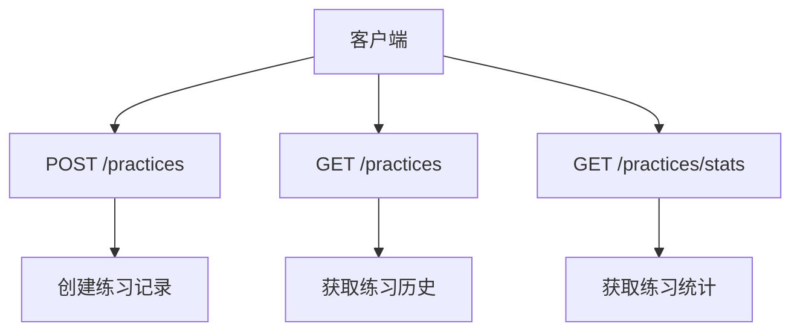
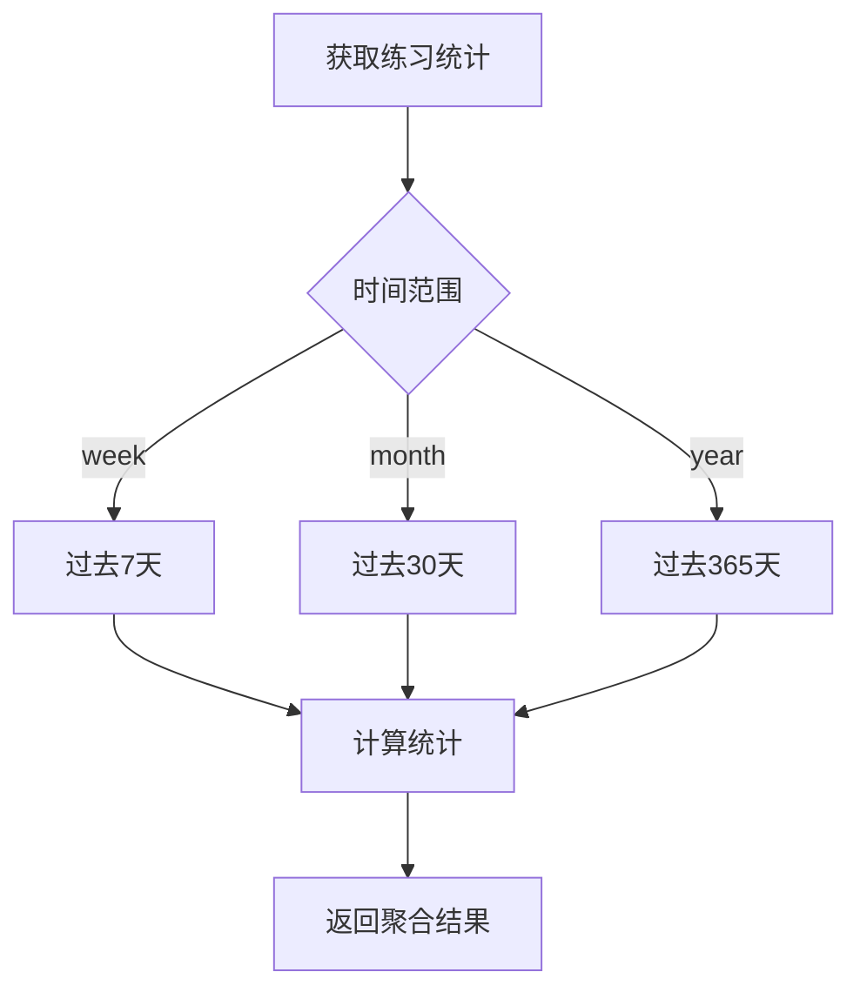
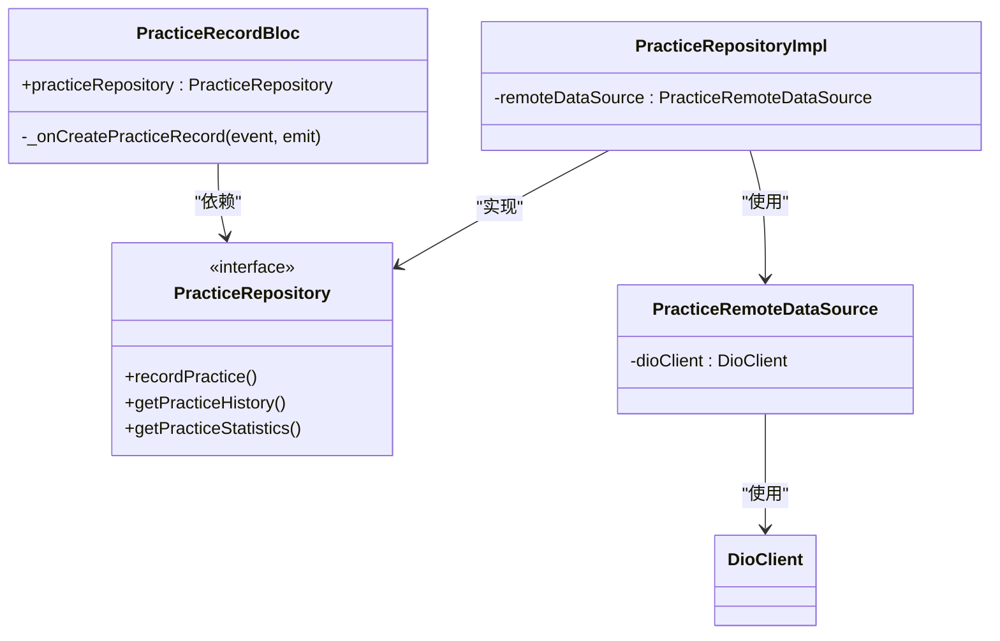
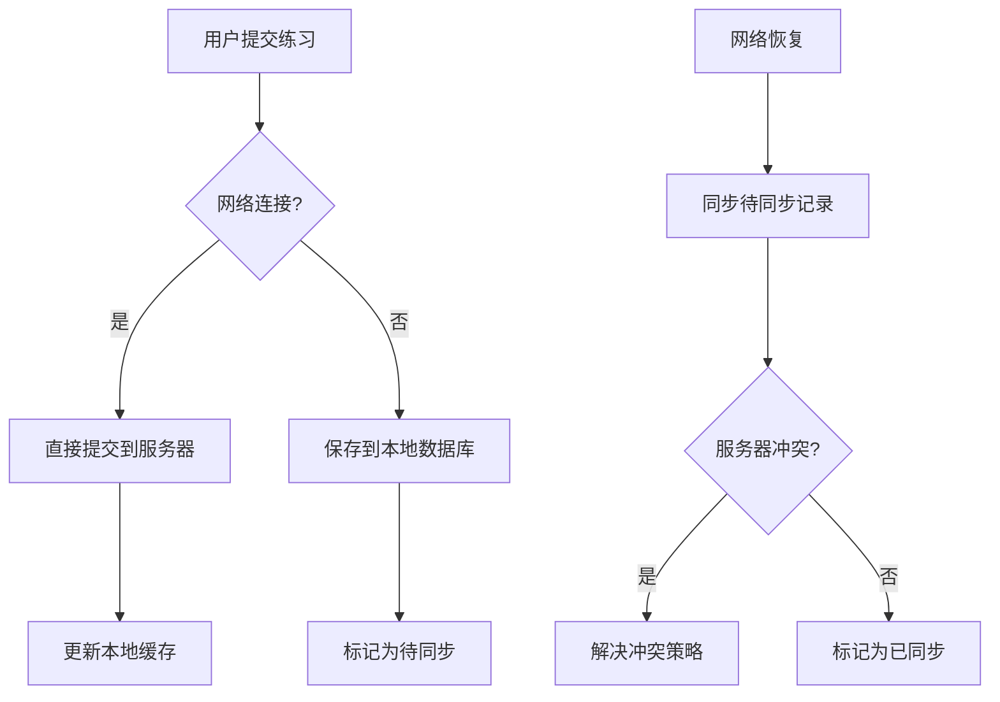
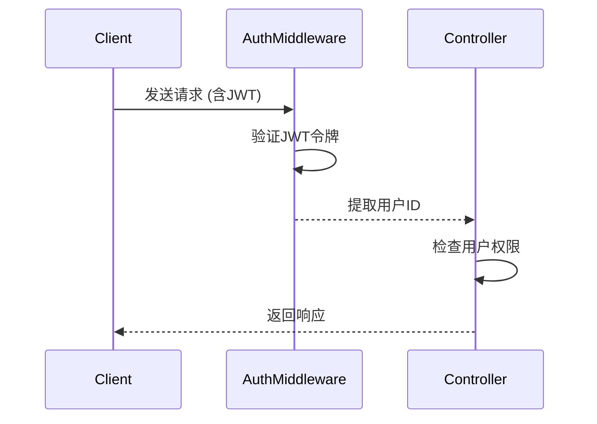

# 练习记录API

<cite>
**本文档引用的文件**
- [practice.controller.ts](file://backend/src/controllers/practice.controller.ts)
- [practice.routes.ts](file://backend/src/routes/practice.routes.ts)
- [api_constants.dart](file://flutter_app/lib/config/api_constants.dart)
- [practice_record_model.dart](file://flutter_app/lib/data/models/practice_record_model.dart)
- [practice_record.dart](file://flutter_app/lib/domain/entities/practice_record.dart)
- [practice_record_bloc.dart](file://flutter_app/lib/presentation/practice/bloc/practice_record_bloc.dart)
- [practice_remote_data_source.dart](file://flutter_app/lib/data/datasources/remote/practice_remote_data_source.dart)
- [practice_repository_impl.dart](file://flutter_app/lib/data/repositories/practice_repository_impl.dart)
- [practice_repository.dart](file://flutter_app/lib/domain/repositories/practice_repository.dart)
- [practice_record_create_page.dart](file://flutter_app/lib/presentation/practice/pages/practice_record_create_page.dart)
- [practice_history_page.dart](file://flutter_app/lib/presentation/practice/pages/practice_history_page.dart)
- [practice_stats_page.dart](file://flutter_app/lib/presentation/practice/pages/practice_stats_page.dart)
- [index.ts](file://backend/src/types/index.ts)
</cite>

## 目录
1. [简介](#简介)
2. [API端点](#api端点)
3. [请求体结构](#请求体结构)
4. [分页与时间范围过滤](#分页与时间范围过滤)
5. [统计聚合逻辑](#统计聚合逻辑)
6. [Flutter BLoC实现](#flutter-bloc实现)
7. [权限控制与数据验证](#权限控制与数据验证)
8. [错误处理](#错误处理)

## 简介
练习记录API提供了一套完整的练习记录管理功能，包括练习记录的创建、历史查询和统计汇总。该API设计遵循RESTful原则，为用户提供了一个结构化的接口来跟踪他们的练习活动。系统实现了完整的用户认证和权限控制，确保每个用户只能访问自己的练习数据。

**Section sources**
- [practice.controller.ts](file://backend/src/controllers/practice.controller.ts#L1-L261)
- [practice.routes.ts](file://backend/src/routes/practice.routes.ts#L1-L19)

## API端点
练习记录API提供了三个主要端点，分别用于创建练习记录、获取练习历史和获取练习统计。所有端点都需要用户认证，通过JWT令牌进行身份验证。



**Diagram sources**
- [practice.routes.ts](file://backend/src/routes/practice.routes.ts#L10-L17)
- [api_constants.dart](file://flutter_app/lib/config/api_constants.dart#L25-L27)

### 创建练习记录
`POST /practices` 端点用于创建新的练习记录。该端点需要身份验证，并在创建记录后返回完整的记录信息。

**Section sources**
- [practice.controller.ts](file://backend/src/controllers/practice.controller.ts#L7-L98)
- [practice.routes.ts](file://backend/src/routes/practice.routes.ts#L11)

### 获取练习历史
`GET /practices` 端点用于获取用户的练习历史记录。支持分页和多种过滤条件，返回分页的练习记录列表。

**Section sources**
- [practice.controller.ts](file://backend/src/controllers/practice.controller.ts#L102-L172)
- [practice.routes.ts](file://backend/src/routes/practice.routes.ts#L14)

### 获取练习统计
`GET /practices/stats` 端点用于获取用户的练习统计数据。返回聚合的统计信息，包括总练习次数、总时长、心情改善度等。

**Section sources**
- [practice.controller.ts](file://backend/src/controllers/practice.controller.ts#L175-L260)
- [practice.routes.ts](file://backend/src/routes/practice.routes.ts#L17)

## 请求体结构
创建练习记录的请求体包含多个字段，用于描述练习的详细信息。所有字段都遵循特定的数据类型和验证规则。

### POST /practices 请求体
```json
{
  "methodId": 1,
  "durationMinutes": 15,
  "moodBefore": 5,
  "moodAfter": 7,
  "notes": "今天的练习感觉很好"
}
```

**Section sources**
- [practice.controller.ts](file://backend/src/controllers/practice.controller.ts#L9-L16)
- [practice_record_model.dart](file://flutter_app/lib/data/models/practice_record_model.dart#L5-L16)

### 请求字段说明
| 字段 | 类型 | 必需 | 描述 |
|------|------|------|------|
| methodId | 整数 | 是 | 练习方法ID |
| durationMinutes | 整数 | 是 | 练习时长（分钟） |
| moodBefore | 整数 | 否 | 练习前心情评分（1-10） |
| moodAfter | 整数 | 否 | 练习后心情评分（1-10） |
| notes | 字符串 | 否 | 练习备注 |

**Section sources**
- [practice.controller.ts](file://backend/src/controllers/practice.controller.ts#L9-L16)
- [practice_record.dart](file://flutter_app/lib/domain/entities/practice_record.dart#L15-L33)

## 分页与时间范围过滤
获取练习历史的API支持分页和时间范围过滤，允许客户端灵活地获取所需的数据。

### GET /practices 查询参数
| 参数 | 类型 | 默认值 | 描述 |
|------|------|--------|------|
| page | 整数 | 1 | 页码 |
| pageSize | 整数 | 20 | 每页数量 |
| methodId | 整数 | 无 | 按方法ID过滤 |
| startDate | 日期 | 无 | 开始日期过滤 |
| endDate | 日期 | 无 | 结束日期过滤 |

**Section sources**
- [practice.controller.ts](file://backend/src/controllers/practice.controller.ts#L104-L110)
- [practice_history_page.dart](file://flutter_app/lib/presentation/practice/pages/practice_history_page.dart#L28)

### 分页响应结构
```json
{
  "success": true,
  "data": {
    "list": [...],
    "total": 100,
    "page": 1,
    "pageSize": 20
  }
}
```

**Section sources**
- [index.ts](file://backend/src/types/index.ts#L105-L110)
- [practice.controller.ts](file://backend/src/controllers/practice.controller.ts#L161-L166)

## 统计聚合逻辑
练习统计API实现了多种聚合逻辑，按不同时间范围计算用户的练习数据。

### 时间范围聚合


**Diagram sources**
- [practice.controller.ts](file://backend/src/controllers/practice.controller.ts#L183-L194)
- [practice_stats_page.dart](file://flutter_app/lib/presentation/practice/pages/practice_stats_page.dart#L137)

### 统计指标计算
| 指标 | 计算方式 | SQL示例 |
|------|---------|---------|
| 总练习次数 | COUNT(*) | `COUNT(*) as total_practices` |
| 总练习时长 | SUM(duration_minutes) | `SUM(duration_minutes) as total_duration` |
| 练习天数 | COUNT(DISTINCT practice_date) | `COUNT(DISTINCT practice_date) as practice_days` |
| 平均心情改善 | AVG(mood_after - mood_before) | `AVG(mood_after - mood_before) as avg_mood_improvement` |

**Section sources**
- [practice.controller.ts](file://backend/src/controllers/practice.controller.ts#L197-L206)
- [practice_stats.dart](file://flutter_app/lib/domain/entities/practice_stats.dart#L8-L20)

## Flutter BLoC实现
Flutter客户端使用BLoC模式实现了练习记录功能，提供了响应式的用户体验。

### BLoC架构


**Diagram sources**
- [practice_record_bloc.dart](file://flutter_app/lib/presentation/practice/bloc/practice_record_bloc.dart#L7-L36)
- [practice_repository_impl.dart](file://flutter_app/lib/data/repositories/practice_repository_impl.dart#L10-L82)

### 提交练习记录代码示例
```dart
// 在BLoC中处理创建练习记录事件
Future<void> _onCreatePracticeRecord(
  CreatePracticeRecord event,
  Emitter<PracticeRecordState> emit,
) async {
  emit(const PracticeRecordSaving());

  final result = await practiceRepository.recordPractice(
    methodId: event.methodId,
    durationMinutes: event.durationMinutes,
    moodBefore: event.moodBefore,
    moodAfter: event.moodAfter,
    note: event.note,
  );

  result.fold(
    (failure) => emit(PracticeRecordError(failure.message)),
    (record) => emit(PracticeRecordSaved(record)),
  );
}
```

**Section sources**
- [practice_record_bloc.dart](file://flutter_app/lib/presentation/practice/bloc/practice_record_bloc.dart#L16-L34)
- [practice_repository.dart](file://flutter_app/lib/domain/repositories/practice_repository.dart#L18-L24)

### 离线缓存与同步冲突处理


**Diagram sources**
- [practice_remote_data_source.dart](file://flutter_app/lib/data/datasources/remote/practice_remote_data_source.dart#L14-L32)
- [practice_repository_impl.dart](file://flutter_app/lib/data/repositories/practice_repository_impl.dart#L23-L38)

## 权限控制与数据验证
系统实现了严格的权限控制和数据验证机制，确保数据的安全性和完整性。

### 权限控制
所有练习记录相关的API端点都要求用户认证，通过中间件验证JWT令牌。每个用户只能访问和修改自己的练习记录。



**Diagram sources**
- [practice.routes.ts](file://backend/src/routes/practice.routes.ts#L8)
- [practice.controller.ts](file://backend/src/controllers/practice.controller.ts#L8)

### 数据验证规则
| 字段 | 验证规则 | 错误代码 |
|------|---------|---------|
| methodId | 必需，非空 | VALIDATION_ERROR |
| durationMinutes | 必需，非空 | VALIDATION_ERROR |
| moodBefore | 范围1-10 | VALIDATION_ERROR |
| moodAfter | 范围1-10 | VALIDATION_ERROR |

**Section sources**
- [practice.controller.ts](file://backend/src/controllers/practice.controller.ts#L22-L32)
- [practice_record.dart](file://flutter_app/lib/domain/entities/practice_record.dart#L23-L27)

## 错误处理
系统实现了全面的错误处理机制，为客户端提供清晰的错误信息。

### 错误响应结构
```json
{
  "success": false,
  "error": {
    "code": "VALIDATION_ERROR",
    "message": "mood_before must be between 1 and 10"
  }
}
```

**Section sources**
- [index.ts](file://backend/src/types/index.ts#L98-L101)
- [practice.controller.ts](file://backend/src/controllers/practice.controller.ts#L27-L31)

### 常见错误类型
| 错误代码 | 描述 | HTTP状态码 |
|---------|------|-----------|
| AUTH_FAILED | 认证失败 | 401 |
| VALIDATION_ERROR | 数据验证错误 | 400 |
| SERVER_ERROR | 服务器内部错误 | 500 |

**Section sources**
- [practice.controller.ts](file://backend/src/controllers/practice.controller.ts#L19-L20)
- [index.ts](file://backend/src/types/index.ts#L98-L101)