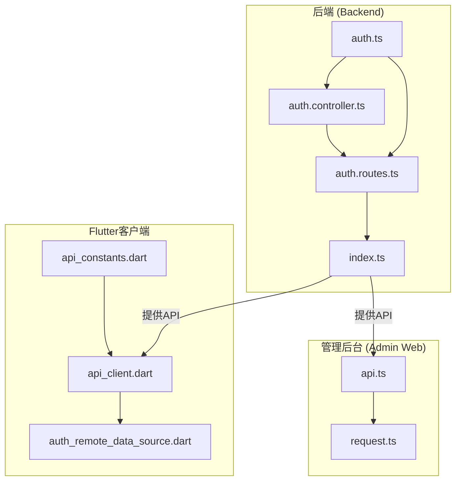
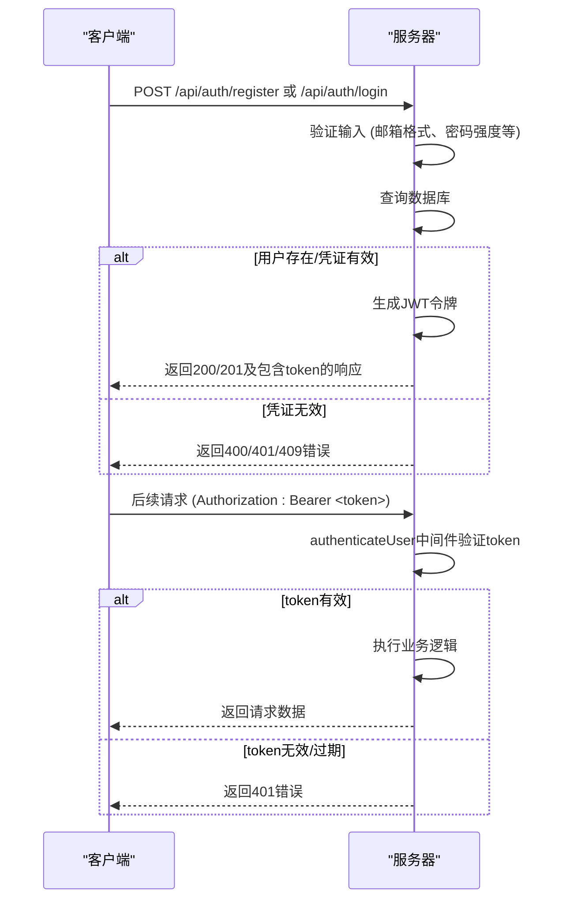
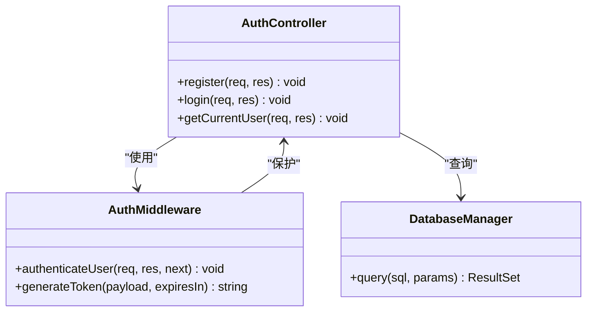
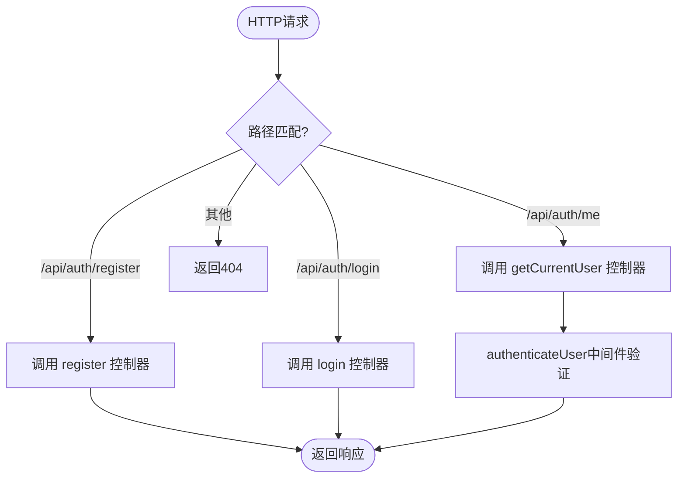
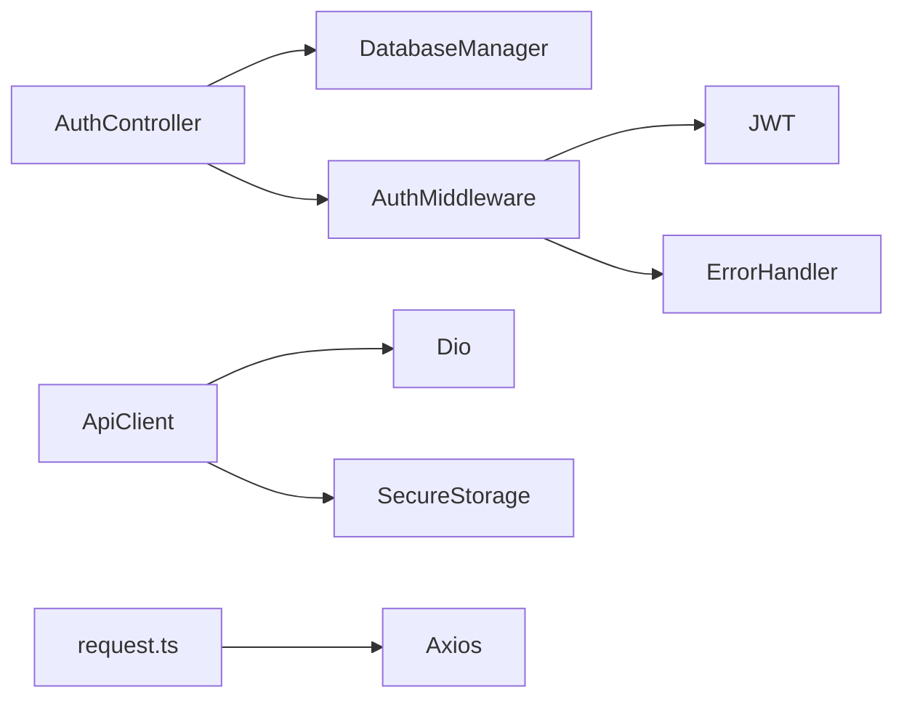

# 认证API

<cite>
**本文档引用文件**   
- [auth.controller.ts](file://backend/src/controllers/auth.controller.ts)
- [auth.routes.ts](file://backend/src/routes/auth.routes.ts)
- [auth.ts](file://backend/src/middleware/auth.ts)
- [api_client.dart](file://flutter_app/lib/data/api/api_client.dart)
- [auth_remote_data_source.dart](file://flutter_app/lib/data/datasources/remote/auth_remote_data_source.dart)
- [api.ts](file://home/user/nian/admin-web/src/services/api.ts)
- [request.ts](file://home/user/nian/admin-web/src/utils/request.ts)
- [api_constants.dart](file://flutter_app/lib/config/api_constants.dart)
- [index.ts](file://backend/src/index.ts)
</cite>

## 目录
1. [简介](#简介)
2. [项目结构](#项目结构)
3. [核心组件](#核心组件)
4. [架构概述](#架构概述)
5. [详细组件分析](#详细组件分析)
6. [依赖分析](#依赖分析)
7. [性能考虑](#性能考虑)
8. [故障排除指南](#故障排除指南)
9. [结论](#结论)
10. [附录](#附录)（如有必要）

## 简介
本文档详细描述了nian项目的用户认证API，涵盖注册、登录、获取当前用户信息等核心端点。文档明确了各接口的HTTP方法、URL路径、请求头、请求体参数及响应格式，特别说明了JWT令牌的生成、传递与有效期管理机制。同时提供了Flutter客户端（Dart语言）和管理后台（TypeScript语言）的调用示例，并阐述了系统的安全策略和错误处理规范。

## 项目结构
nian项目的认证功能分布在后端、Flutter客户端和管理后台三个主要部分。后端使用TypeScript和Express框架实现RESTful API，前端则分别使用Flutter和React构建移动应用和管理界面。



**图示来源**
- [auth.controller.ts](file://backend/src/controllers/auth.controller.ts#L1-L150)
- [auth.routes.ts](file://backend/src/routes/auth.routes.ts#L1-L17)
- [api_client.dart](file://flutter_app/lib/data/api/api_client.dart#L1-L207)
- [api.ts](file://home/user/nian/admin-web/src/services/api.ts#L1-L61)

## 核心组件
本节分析认证系统的核心功能组件，包括用户注册、登录和身份验证。

**本节来源**
- [auth.controller.ts](file://backend/src/controllers/auth.controller.ts#L1-L150)
- [auth.routes.ts](file://backend/src/routes/auth.routes.ts#L1-L17)

## 架构概述
nian项目的认证系统采用标准的JWT（JSON Web Token）无状态认证机制。用户通过提供凭据（邮箱/密码）进行登录或注册，服务器验证成功后生成JWT令牌并返回给客户端。客户端在后续请求中将此令牌放入`Authorization`头，由服务器中间件进行验证。



**图示来源**
- [auth.controller.ts](file://backend/src/controllers/auth.controller.ts#L1-L150)
- [auth.ts](file://backend/src/middleware/auth.ts#L1-L87)
- [index.ts](file://backend/src/index.ts#L1-L85)

## 详细组件分析
本节对认证系统的各个关键组件进行深入分析。

### 认证控制器分析
`auth.controller.ts` 文件定义了处理认证请求的核心业务逻辑。

#### 类图


**图示来源**
- [auth.controller.ts](file://backend/src/controllers/auth.controller.ts#L1-L150)
- [auth.ts](file://backend/src/middleware/auth.ts#L1-L87)

### 认证路由分析
`auth.routes.ts` 文件定义了认证API的URL路由，将HTTP请求映射到相应的控制器方法。



**图示来源**
- [auth.routes.ts](file://backend/src/routes/auth.routes.ts#L1-L17)
- [index.ts](file://backend/src/index.ts#L39)

### JWT认证机制分析
`auth.ts` 文件中的中间件实现了JWT的生成和验证逻辑。

```mermaid
flowchart TD
A[收到请求] --> B{包含Authorization头?}
B --> |否| C[返回401]
B --> |是| D{以"Bearer "开头?}
D --> |否| C
D --> |是| E[提取Token]
E --> F[使用JWT_SECRET验证签名]
F --> G{验证成功?}
G --> |否| H[返回401]
G --> |是| I[解析Payload]
I --> J[将用户信息存入req.user]
J --> K[调用next()继续处理]
```

**图示来源**
- [auth.ts](file://backend/src/middleware/auth.ts#L1-L87)

## 依赖分析
认证系统依赖于多个内部和外部组件。



**图示来源**
- [auth.controller.ts](file://backend/src/controllers/auth.controller.ts#L1-L150)
- [auth.ts](file://backend/src/middleware/auth.ts#L1-L87)
- [api_client.dart](file://flutter_app/lib/data/api/api_client.dart#L1-L207)
- [request.ts](file://home/user/nian/admin-web/src/utils/request.ts#L1-L81)

## 性能考虑
- **数据库查询**：认证操作涉及数据库查询，已通过参数化查询和索引优化来防止SQL注入并提升性能。
- **密码加密**：使用`bcrypt`进行密码哈希，`saltRounds=10`提供了良好的安全性和性能平衡。
- **连接池**：后端配置了数据库连接池，避免了频繁创建和销毁连接的开销。
- **缓存**：当前系统未实现API速率限制和登录失败次数限制，根据`QUALITY_REPORT.md`建议，这是未来性能和安全优化的重点。

## 故障排除指南
本节提供常见错误码及其处理建议。

**本节来源**
- [auth.controller.ts](file://backend/src/controllers/auth.controller.ts#L1-L150)
- [errorHandler.ts](file://backend/src/middleware/errorHandler.ts#L1-L97)
- [auth_remote_data_source.dart](file://flutter_app/lib/data/datasources/remote/auth_remote_data_source.dart#L1-L77)

### 常见错误码
| HTTP状态码 | 错误代码 | 含义 | 处理建议 |
| :--- | :--- | :--- | :--- |
| 400 | VALIDATION_ERROR | 输入验证失败 | 检查请求体中的`email`、`password`等字段是否符合格式要求（如邮箱格式、密码长度至少8位） |
| 401 | AUTH_FAILED | 认证失败 | 检查提供的邮箱和密码是否正确。对于401响应，客户端应清除本地存储的无效token。 |
| 401 | TOKEN_EXPIRED | 令牌过期或无效 | 用户需要重新登录以获取新令牌。 |
| 403 | PERMISSION_DENIED | 权限不足 | 检查用户账号是否被禁用（`is_active=false`）。 |
| 409 | DUPLICATE_ENTRY | 邮箱已存在 | 注册时使用了已注册的邮箱地址，应提示用户使用其他邮箱或直接登录。 |
| 500 | SERVER_ERROR | 服务器内部错误 | 通常是后端代码或数据库问题，应检查服务器日志。 |

### 安全策略
- **密码加密传输**：生产环境中必须通过HTTPS传输所有认证请求，以防止密码等敏感信息被窃听。
- **防止暴力破解**：根据`QUALITY_REPORT.md`，当前系统**尚未实现**速率限制（rate limiting）和登录失败次数限制，这是一个潜在的安全风险。建议使用`express-rate-limit`等中间件来保护`/login`和`/register`端点。
- **JWT密钥**：确保生产环境的`JWT_SECRET`环境变量设置为一个强随机字符串（建议32个字符以上），避免使用默认的`default-secret-key`。

## 结论
nian项目的认证API设计清晰，基于成熟的JWT标准，实现了用户注册、登录和身份验证的核心功能。后端代码结构良好，职责分离明确。客户端（Flutter和Web）均实现了自动的token管理和错误处理。主要的改进点在于**实施速率限制**以增强安全性，以及为API生成更完善的文档（如Swagger）。总体而言，该认证系统为应用提供了可靠的安全基础。

## 附录

### API端点详情
| 端点 | HTTP方法 | 描述 | 请求体 | 响应 |
| :--- | :--- | :--- | :--- | :--- |
| `/api/auth/register` | POST | 用户注册 | `{"email": "string", "password": "string", "nickname": "string"}` | `{"success": true, "data": {"token": "string", "user": {...}}}` |
| `/api/auth/login` | POST | 用户登录 | `{"email": "string", "password": "string"}` | `{"success": true, "data": {"token": "string", "user": {...}}}` |
| `/api/auth/me` | GET | 获取当前用户信息 | 无 | `{"success": true, "data": {...}}` |

### JWT令牌结构
JWT令牌由三部分组成（Header.Payload.Signature），其Payload部分包含：
```json
{
  "id": 123,
  "email": "user@example.com",
  "iat": 1700000000,
  "exp": 1700604800
}
```
- `id`: 用户ID
- `email`: 用户邮箱
- `iat`: 签发时间 (issued at)
- `exp`: 过期时间 (expiration)，默认有效期为7天（由`JWT_EXPIRES_IN`环境变量控制）。

### 客户端调用示例

#### Flutter (Dart)
```dart
// 1. 注册
final response = await apiClient.post('/auth/register', data: {
  'email': 'user@example.com',
  'password': 'securePassword123',
  'nickname': '昵称'
});
final token = response.data['data']['token'];

// 2. 登录后的请求 (ApiClient会自动添加token)
final userResponse = await apiClient.get('/auth/me');
```

#### 管理后台 (TypeScript)
```typescript
// 1. 登录
const response = await adminLogin({ username: 'admin', password: 'password' });
localStorage.setItem('admin_token', response.data.token);

// 2. 发起需要认证的请求 (request.ts会自动添加token)
const stats = await getAdminStats(); // 请求头会包含 Authorization: Bearer <token>
```