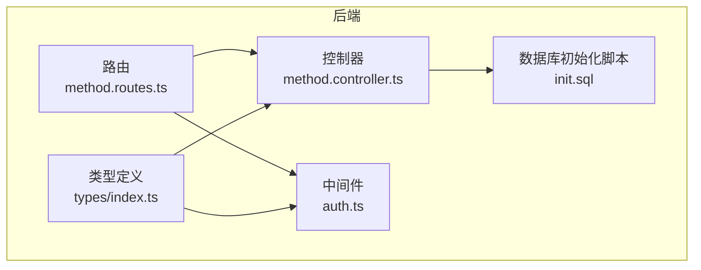
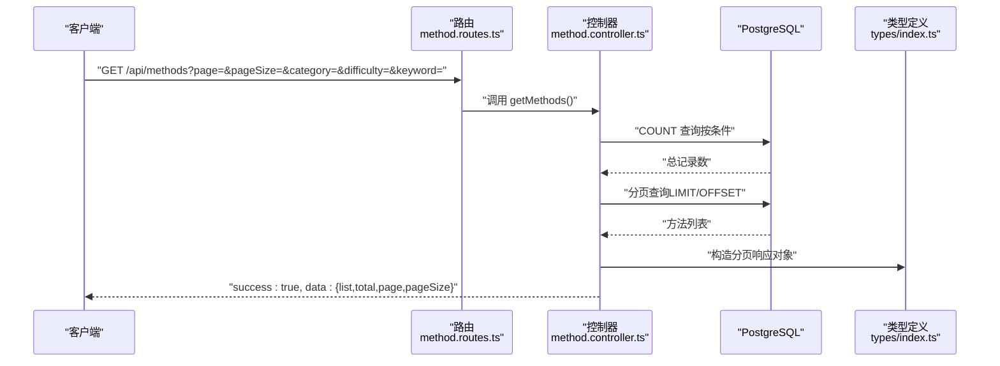
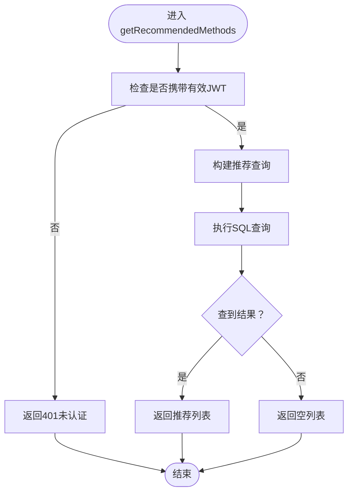
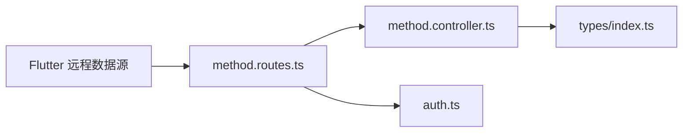

# 方法API

<cite>
**本文引用的文件**
- [backend/src/routes/method.routes.ts](file://backend/src/routes/method.routes.ts)
- [backend/src/controllers/method.controller.ts](file://backend/src/controllers/method.controller.ts)
- [backend/src/middleware/auth.ts](file://backend/src/middleware/auth.ts)
- [backend/src/types/index.ts](file://backend/src/types/index.ts)
- [database/init.sql](file://database/init.sql)
- [flutter_app/lib/data/datasources/remote/method_remote_data_source.dart](file://flutter_app/lib/data/datasources/remote/method_remote_data_source.dart)
- [docs/TEST_REPORT.md](file://docs/TEST_REPORT.md)
- [docs/QUALITY_REPORT.md](file://docs/QUALITY_REPORT.md)
- [home/user/nian/admin-web/nginx.conf](file://home/user/nian/admin-web/nginx.conf)
</cite>

## 目录
1. [简介](#简介)
2. [项目结构](#项目结构)
3. [核心组件](#核心组件)
4. [架构总览](#架构总览)
5. [详细组件分析](#详细组件分析)
6. [依赖关系分析](#依赖关系分析)
7. [性能与缓存策略](#性能与缓存策略)
8. [故障排查指南](#故障排查指南)
9. [结论](#结论)
10. [附录](#附录)

## 简介
本文件为 nian 项目“方法管理API”的完整技术文档，覆盖以下端点与能力：
- 列表查询：GET /api/methods（支持分类、难度、关键词、分页）
- 分类列表：GET /api/methods/categories
- 推荐列表：GET /api/methods/recommend（需JWT认证）
- 方法详情：GET /api/methods/:id

文档将详细说明各端点的查询参数、响应结构、推荐算法逻辑、错误处理、以及性能优化与缓存策略建议。

## 项目结构
后端采用 Express + PostgreSQL 的典型三层结构：
- 路由层：定义REST接口与鉴权中间件绑定
- 控制器层：实现业务逻辑与数据库查询
- 类型与中间件：统一请求/响应类型与JWT认证

图表来源
- [backend/src/routes/method.routes.ts](file://backend/src/routes/method.routes.ts#L1-L20)
- [backend/src/controllers/method.controller.ts](file://backend/src/controllers/method.controller.ts#L1-L153)
- [backend/src/middleware/auth.ts](file://backend/src/middleware/auth.ts#L1-L87)
- [backend/src/types/index.ts](file://backend/src/types/index.ts#L1-L126)
- [database/init.sql](file://database/init.sql#L1-L120)

章节来源
- [backend/src/routes/method.routes.ts](file://backend/src/routes/method.routes.ts#L1-L20)
- [backend/src/controllers/method.controller.ts](file://backend/src/controllers/method.controller.ts#L1-L153)
- [backend/src/middleware/auth.ts](file://backend/src/middleware/auth.ts#L1-L87)
- [backend/src/types/index.ts](file://backend/src/types/index.ts#L1-L126)
- [database/init.sql](file://database/init.sql#L1-L120)

## 核心组件
- 路由定义：在路由中声明四个方法API端点，并对推荐接口绑定JWT认证中间件。
- 控制器实现：分别实现列表、详情、推荐、分类四类查询；统一返回标准响应结构。
- 类型定义：明确方法实体、分页响应、认证请求扩展类型。
- 数据模型：methods 表包含标题、描述、分类、难度、时长、封面、内容JSON、状态、浏览/选择计数等字段；user_methods 关联用户与方法。

章节来源
- [backend/src/routes/method.routes.ts](file://backend/src/routes/method.routes.ts#L1-L20)
- [backend/src/controllers/method.controller.ts](file://backend/src/controllers/method.controller.ts#L1-L153)
- [backend/src/types/index.ts](file://backend/src/types/index.ts#L1-L126)
- [database/init.sql](file://database/init.sql#L19-L61)

## 架构总览
下面的序列图展示了“获取方法列表”的端到端流程。

图表来源
- [backend/src/routes/method.routes.ts](file://backend/src/routes/method.routes.ts#L1-L20)
- [backend/src/controllers/method.controller.ts](file://backend/src/controllers/method.controller.ts#L1-L73)
- [backend/src/types/index.ts](file://backend/src/types/index.ts#L94-L111)

## 详细组件分析

### 端点：GET /api/methods（方法列表）
- 功能：支持按分类、难度、关键词进行筛选，并分页返回已发布的心理自助方法。
- 查询参数
  - category：方法分类（可选）
  - difficulty：难度级别（可选）
  - keyword：关键词（可选，模糊匹配标题与描述）
  - page：页码，默认1
  - pageSize：每页条数，默认20
- 响应结构
  - success：布尔
  - data：分页对象
    - list：方法数组
    - total：总记录数
    - page：当前页
    - pageSize：每页数量
- 数据来源
  - 仅返回 status='published' 的方法
  - 默认按发布时间倒序排序
- 性能要点
  - 使用 LIMIT/OFFSET 实现分页
  - 条件查询通过参数化SQL构建，避免注入风险

章节来源
- [backend/src/controllers/method.controller.ts](file://backend/src/controllers/method.controller.ts#L1-L73)
- [backend/src/types/index.ts](file://backend/src/types/index.ts#L94-L111)
- [database/init.sql](file://database/init.sql#L19-L61)

### 端点：GET /api/methods/categories（方法分类）
- 功能：返回所有已发布方法的分类及其数量，按数量降序排列。
- 响应结构
  - success：布尔
  - data：数组，元素为 { category, count }

章节来源
- [backend/src/controllers/method.controller.ts](file://backend/src/controllers/method.controller.ts#L138-L152)

### 端点：GET /api/methods/recommend（个性化推荐）
- 功能：基于用户历史行为生成推荐列表（需JWT认证）。
- 认证要求
  - 需在请求头携带 Authorization: Bearer <token>
  - 中间件会校验令牌有效性并将用户信息注入请求对象
- 查询参数
  - limit：推荐数量，默认5
- 推荐算法逻辑
  - 排除用户已选过的方法
  - 优先推荐与用户已选方法相同分类的方法
  - 若无足够同类方法，则回退推荐 select_count 较高的热门方法
  - 最终按 select_count 降序、published_at 降序排序并限制数量
- 响应结构
  - success：布尔
  - data：方法数组（字段见“方法详情”小节）

图表来源
- [backend/src/controllers/method.controller.ts](file://backend/src/controllers/method.controller.ts#L100-L136)
- [backend/src/middleware/auth.ts](file://backend/src/middleware/auth.ts#L1-L33)

章节来源
- [backend/src/controllers/method.controller.ts](file://backend/src/controllers/method.controller.ts#L100-L136)
- [backend/src/middleware/auth.ts](file://backend/src/middleware/auth.ts#L1-L33)

### 端点：GET /api/methods/:id（方法详情）
- 功能：返回指定ID的已发布方法详情，并自动增加浏览次数。
- 参数
  - id：方法ID
- 响应结构
  - success：布尔
  - data：方法对象（包含标题、描述、分类、难度、时长、封面、内容JSON、状态、浏览/选择计数、创建/更新/发布时间等）
- 错误处理
  - 不存在或非已发布状态：返回404

章节来源
- [backend/src/controllers/method.controller.ts](file://backend/src/controllers/method.controller.ts#L75-L98)
- [database/init.sql](file://database/init.sql#L19-L61)

### 方法实体字段说明
- 字段清单（来源于数据库schema与类型定义）
  - id、title、description、category、difficulty、duration_minutes、cover_image_url、content_json、status、view_count、select_count、created_by、created_at、updated_at、published_at
- 说明
  - content_json：存储章节、练习、问卷等结构化内容
  - status：草稿/待审/已发布/归档
  - view_count/select_count：浏览与选择计数

章节来源
- [backend/src/types/index.ts](file://backend/src/types/index.ts#L18-L35)
- [database/init.sql](file://database/init.sql#L19-L61)

### 请求与响应示例
- 获取方法列表（分页与筛选）
  - 示例请求：GET /api/methods?page=1&pageSize=10&category=放松技巧&difficulty=入门&keyword=冥想
  - 预期响应：包含 list、total、page、pageSize 的分页对象
- 获取方法详情
  - 示例请求：GET /api/methods/1
  - 预期响应：包含完整方法信息的对象
- 获取推荐方法（需认证）
  - 示例请求：GET /api/methods/recommend?limit=5
  - 请求头：Authorization: Bearer <token>
  - 预期响应：推荐方法数组
- 获取分类列表
  - 示例请求：GET /api/methods/categories
  - 预期响应：分类数组，包含分类名与数量

章节来源
- [docs/TEST_REPORT.md](file://docs/TEST_REPORT.md#L910-L1008)

## 依赖关系分析
- 路由依赖控制器函数
- 控制器依赖数据库连接池与类型定义
- 推荐接口依赖JWT中间件进行用户身份校验
- 前端通过远程数据源调用后端API

图表来源
- [backend/src/routes/method.routes.ts](file://backend/src/routes/method.routes.ts#L1-L20)
- [backend/src/controllers/method.controller.ts](file://backend/src/controllers/method.controller.ts#L1-L153)
- [backend/src/middleware/auth.ts](file://backend/src/middleware/auth.ts#L1-L87)
- [flutter_app/lib/data/datasources/remote/method_remote_data_source.dart](file://flutter_app/lib/data/datasources/remote/method_remote_data_source.dart#L1-L83)

章节来源
- [backend/src/routes/method.routes.ts](file://backend/src/routes/method.routes.ts#L1-L20)
- [backend/src/controllers/method.controller.ts](file://backend/src/controllers/method.controller.ts#L1-L153)
- [backend/src/middleware/auth.ts](file://backend/src/middleware/auth.ts#L1-L87)
- [flutter_app/lib/data/datasources/remote/method_remote_data_source.dart](file://flutter_app/lib/data/datasources/remote/method_remote_data_source.dart#L1-L83)

## 性能与缓存策略
- 建议的性能优化（来自质量报告）
  - 引入Redis缓存策略
  - 启用API响应压缩（gzip）
  - 加强请求数据验证，减少无效查询
  - 对静态资源考虑CDN
  - 高并发场景考虑数据库读写分离
- Nginx侧压缩与静态资源缓存
  - 已启用gzip压缩与静态资源缓存头
  - API代理至后端服务

章节来源
- [docs/QUALITY_REPORT.md](file://docs/QUALITY_REPORT.md#L205-L234)
- [home/user/nian/admin-web/nginx.conf](file://home/user/nian/admin-web/nginx.conf#L1-L34)

## 故障排查指南
- 401 未认证（推荐接口）
  - 检查Authorization头是否正确携带Bearer Token
  - 确认Token未过期且签名有效
- 404 方法不存在
  - 确认方法ID存在且状态为已发布
  - 确认URL路径正确
- 分页参数异常
  - page与pageSize应为数字
  - 建议限制最大pageSize以避免过大响应
- 推荐结果为空
  - 用户可能已选完所有同类方法
  - 可尝试增大limit或等待更多热门方法上线

章节来源
- [backend/src/middleware/auth.ts](file://backend/src/middleware/auth.ts#L1-L33)
- [backend/src/controllers/method.controller.ts](file://backend/src/controllers/method.controller.ts#L75-L98)

## 结论
本API围绕“方法列表、分类、推荐、详情”四大能力构建，具备清晰的参数约束与一致的响应结构。推荐算法以用户历史行为为基础，兼顾热门度与类别相似性，适合在移动端进行个性化展示。建议结合Redis缓存、gzip压缩与合理的分页上限，进一步提升性能与用户体验。

## 附录

### API端点一览
- GET /api/methods
  - 查询参数：category、difficulty、keyword、page、pageSize
  - 响应：分页对象（list、total、page、pageSize）
- GET /api/methods/categories
  - 响应：分类数组（category、count）
- GET /api/methods/recommend
  - 查询参数：limit
  - 鉴权：Bearer Token
  - 响应：方法数组
- GET /api/methods/:id
  - 响应：方法详情对象

章节来源
- [backend/src/routes/method.routes.ts](file://backend/src/routes/method.routes.ts#L1-L20)
- [backend/src/controllers/method.controller.ts](file://backend/src/controllers/method.controller.ts#L1-L153)