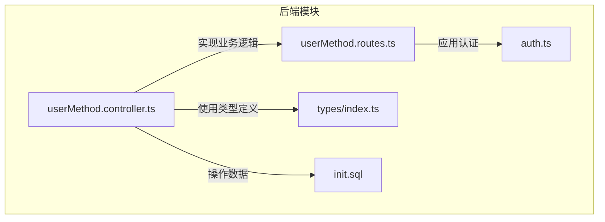
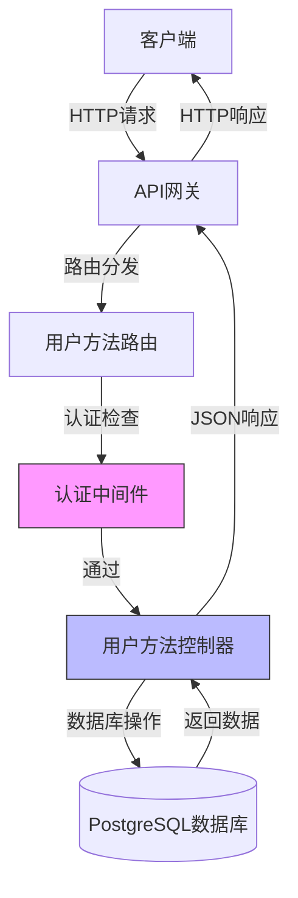
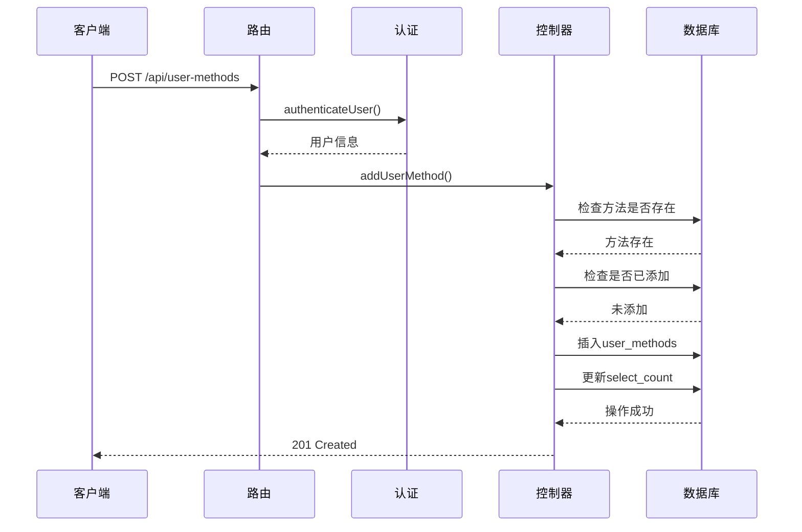
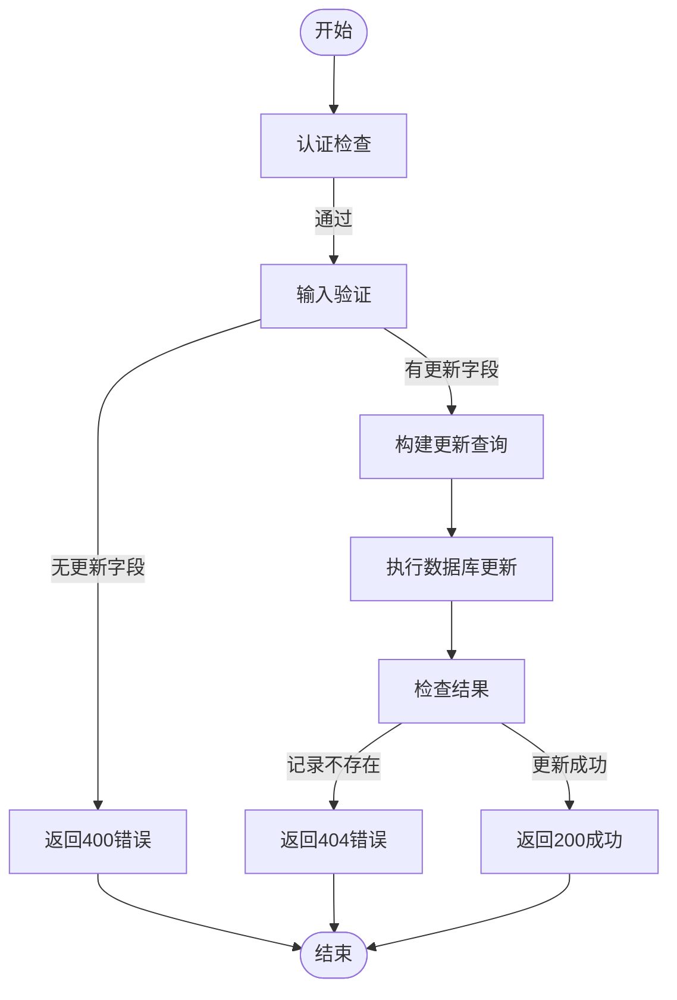
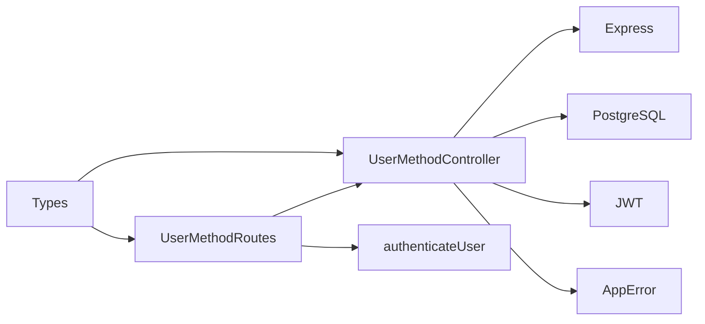

# 用户方法API

<cite>
**本文档中引用的文件**  
- [userMethod.controller.ts](file://backend/src/controllers/userMethod.controller.ts)
- [userMethod.routes.ts](file://backend/src/routes/userMethod.routes.ts)
- [auth.ts](file://backend/src/middleware/auth.ts)
- [index.ts](file://backend/src/types/index.ts)
- [init.sql](file://database/init.sql)
- [api.test.ts](file://backend/src/__tests__/api.test.ts)
</cite>

## 目录
1. [简介](#简介)
2. [项目结构](#项目结构)
3. [核心组件](#核心组件)
4. [架构概述](#架构概述)
5. [详细组件分析](#详细组件分析)
6. [依赖分析](#依赖分析)
7. [性能考虑](#性能考虑)
8. [故障排除指南](#故障排除指南)
9. [结论](#结论)

## 简介
用户方法API是nian项目的核心功能之一，允许用户管理个人心理自助方法库。该API提供完整的增删改查（CRUD）操作，支持用户收藏、更新和删除个性化方法。所有端点均通过JWT认证保护，确保数据安全和用户隐私。API设计注重用户体验，包含重复添加检测、权限验证和详细的错误处理机制。

## 项目结构
用户方法管理功能主要分布在后端控制器、路由和中间件模块中。核心逻辑位于`backend/src/controllers/userMethod.controller.ts`，路由定义在`backend/src/routes/userMethod.routes.ts`，认证由`backend/src/middleware/auth.ts`统一处理。数据库层面通过`database/init.sql`中的`user_methods`表存储用户与方法的关联关系。

**图示来源**  
- [userMethod.controller.ts](file://backend/src/controllers/userMethod.controller.ts#L1-L162)
- [userMethod.routes.ts](file://backend/src/routes/userMethod.routes.ts#L1-L23)
- [auth.ts](file://backend/src/middleware/auth.ts#L1-L87)
- [init.sql](file://database/init.sql#L43-L56)

## 核心组件
用户方法API的核心组件包括四个主要端点：添加方法、获取方法列表、更新方法和删除方法。每个操作都经过严格的输入验证和权限检查。系统通过`user_methods`表跟踪用户对方法的收藏状态、练习目标、收藏时间等元数据。当用户添加方法时，系统会自动增加该方法的全局选择计数，反映其受欢迎程度。

**节来源**  
- [userMethod.controller.ts](file://backend/src/controllers/userMethod.controller.ts#L7-L161)
- [init.sql](file://database/init.sql#L43-L56)

## 架构概述
用户方法API采用典型的分层架构，从路由层到控制器层再到数据访问层。所有请求首先通过`authenticateUser`中间件进行JWT认证，然后路由到相应的控制器方法。控制器负责业务逻辑处理，包括验证、数据库查询和响应生成。数据模型通过PostgreSQL表定义，确保数据完整性和关系约束。

**图示来源**  
- [userMethod.routes.ts](file://backend/src/routes/userMethod.routes.ts#L8-L20)
- [auth.ts](file://backend/src/middleware/auth.ts#L9-L33)
- [userMethod.controller.ts](file://backend/src/controllers/userMethod.controller.ts#L7-L161)

## 详细组件分析

### 添加方法到个人库
POST /api/user-methods端点允许用户将方法添加到个人收藏库。请求体必须包含`method_id`字段，可选`target_count`字段用于设置练习目标。系统首先验证用户身份，然后检查方法是否存在且已发布。为防止重复添加，系统会查询`user_methods`表确认该方法是否已存在于用户库中。如果一切验证通过，方法将被添加到用户库，同时该方法的全局选择计数会自动增加。

**图示来源**  
- [userMethod.controller.ts](file://backend/src/controllers/userMethod.controller.ts#L7-L56)
- [userMethod.routes.ts](file://backend/src/routes/userMethod.routes.ts#L11-L12)

### 获取用户方法列表
GET /api/user-methods端点返回当前用户收藏的所有方法列表。响应包含每个方法的详细信息（标题、描述、分类等）以及用户特定的状态，如收藏时间(`selected_at`)、最后练习时间(`last_practice_at`)、是否收藏(`is_favorite`)等。结果按收藏时间倒序排列，确保最新添加的方法显示在最前面。此操作通过JOIN查询`user_methods`和`methods`表来获取完整数据集。

**节来源**  
- [userMethod.controller.ts](file://backend/src/controllers/userMethod.controller.ts#L59-L80)
- [init.sql](file://database/init.sql#L43-L56)

### 更新用户方法
PUT /api/user-methods/:id端点支持更新用户方法记录的特定字段。当前支持`target_count`（练习目标次数）和`is_favorite`（是否收藏）两个可更新字段。系统使用动态SQL构建更新语句，只更新提供的字段。更新操作包含严格的权限检查，确保用户只能修改自己收藏的方法记录。如果指定的记录不存在或不属于当前用户，将返回404错误。

**图示来源**  
- [userMethod.controller.ts](file://backend/src/controllers/userMethod.controller.ts#L83-L131)
- [types/index.ts](file://backend/src/types/index.ts#L38-L49)

### 删除用户方法
DELETE /api/user-methods/:id端点从用户库中移除指定的方法。删除操作是用户特定的，只能删除属于当前用户的方法记录。成功删除后，系统会自动将该方法的全局选择计数减1（但不会低于0）。此设计确保了方法受欢迎程度统计的准确性。删除操作使用`RETURNING method_id`子句获取被删除记录的方法ID，以便后续更新操作。

**节来源**  
- [userMethod.controller.ts](file://backend/src/controllers/userMethod.controller.ts#L134-L161)
- [init.sql](file://database/init.sql#L43-L56)

## 依赖分析
用户方法API依赖多个核心组件协同工作。主要依赖包括：Express框架处理HTTP请求、PostgreSQL数据库存储数据、JWT进行用户认证。控制器依赖`pool`对象进行数据库连接，依赖`AppError`类进行错误处理。路由模块依赖控制器实现和认证中间件。类型定义文件为整个系统提供统一的接口规范。

**图示来源**  
- [userMethod.controller.ts](file://backend/src/controllers/userMethod.controller.ts#L1-L162)
- [userMethod.routes.ts](file://backend/src/routes/userMethod.routes.ts#L1-L23)
- [auth.ts](file://backend/src/middleware/auth.ts#L1-L87)

## 性能考虑
用户方法API在设计时考虑了性能优化。数据库层面，`user_methods`表在`user_id`和`method_id`字段上建立了索引，确保查询性能。`selected_at`字段的索引支持按收藏时间排序的高效查询。使用参数化查询防止SQL注入的同时也利于查询计划缓存。对于高频率的读操作（如获取方法列表），可以考虑引入Redis缓存机制进一步提升性能。

## 故障排除指南
常见问题包括：401未授权错误（缺少或无效JWT令牌）、409冲突错误（重复添加方法）、404未找到错误（操作不存在的记录或不属于自己的记录）。对于401错误，确保请求头包含正确的Bearer令牌。409错误表明用户尝试添加已存在的方法，前端应提供相应提示。404错误可能由于ID错误或权限不足，需检查路径参数和用户身份。所有错误都通过`errorHandler`中间件统一处理，返回结构化的错误响应。

**节来源**  
- [userMethod.controller.ts](file://backend/src/controllers/userMethod.controller.ts#L11-L18)
- [errorHandler.ts](file://backend/src/middleware/errorHandler.ts#L1-L97)

## 结论
用户方法API为nian项目提供了强大而安全的个人方法库管理功能。通过清晰的端点设计和严格的认证机制，确保了用户数据的完整性和安全性。API支持完整的CRUD操作，包含合理的业务逻辑和错误处理。未来可考虑增加更多个性化字段（如自定义标签、笔记）和批量操作支持，进一步提升用户体验。