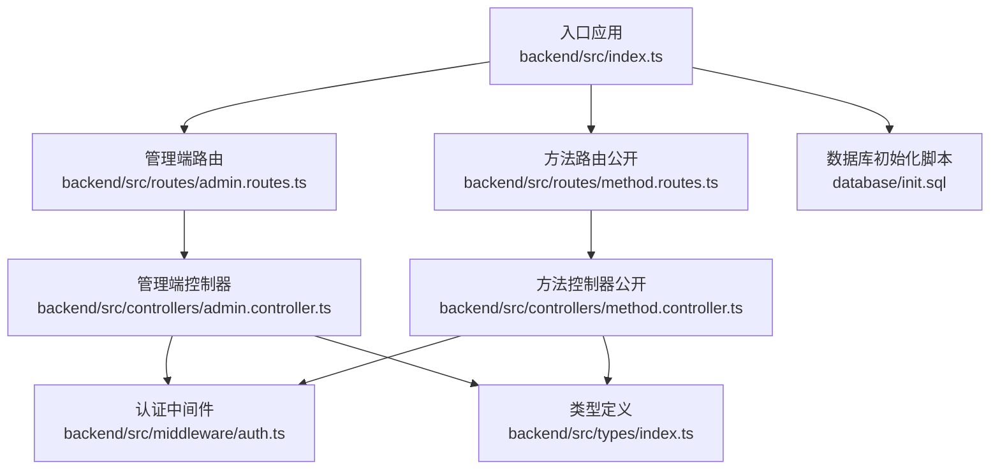
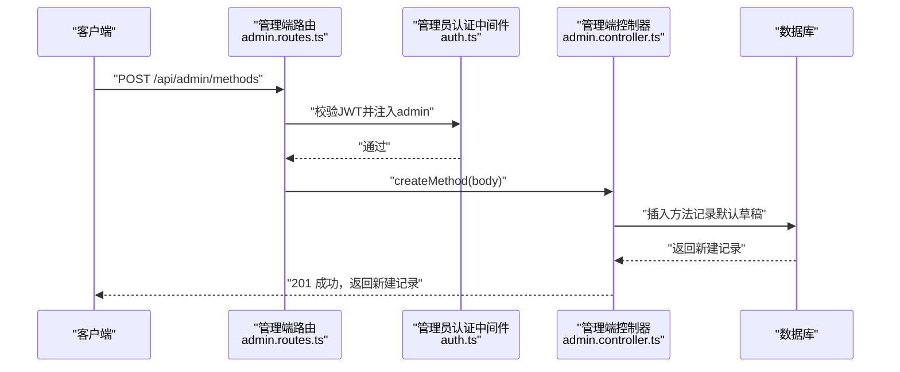
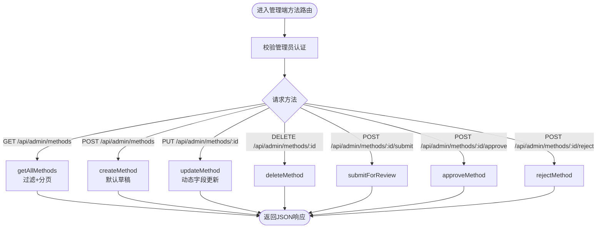
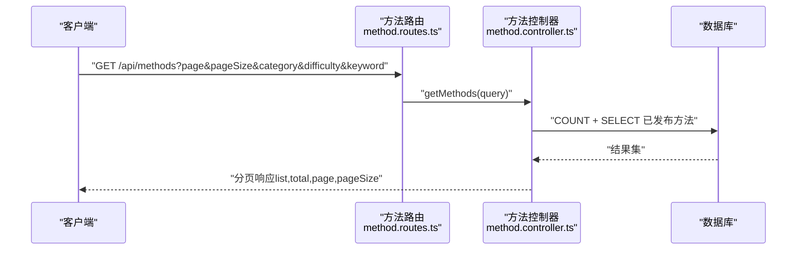
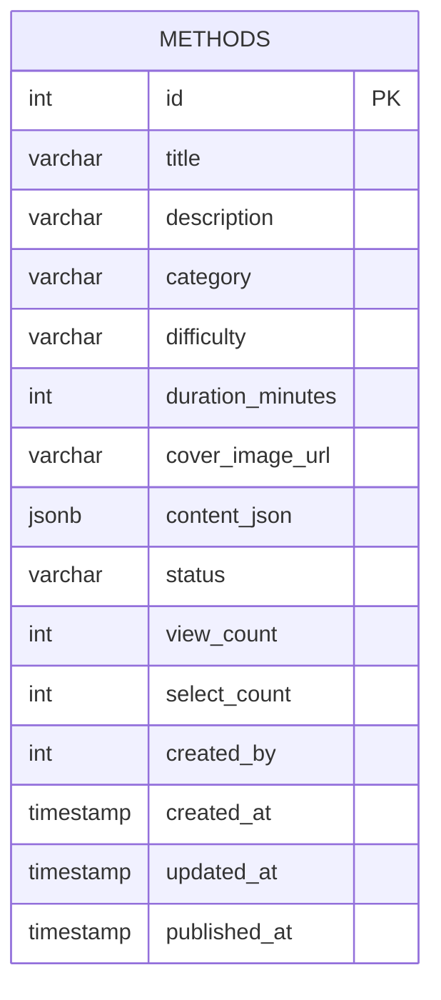
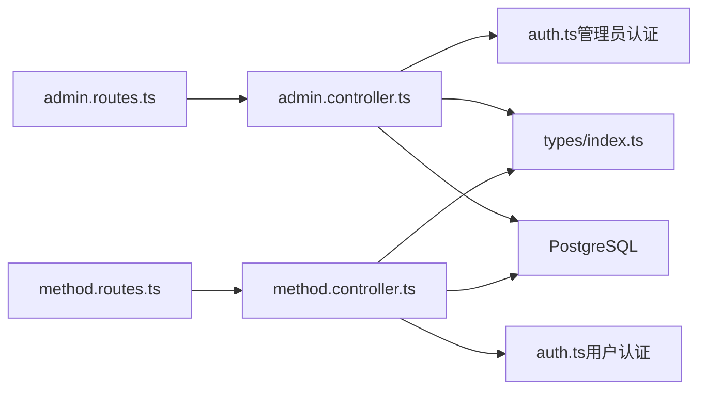

# 内容CRUD操作

<cite>
**本文引用的文件**
- [backend/src/index.ts](file://backend/src/index.ts)
- [backend/src/routes/admin.routes.ts](file://backend/src/routes/admin.routes.ts)
- [backend/src/controllers/admin.controller.ts](file://backend/src/controllers/admin.controller.ts)
- [backend/src/routes/method.routes.ts](file://backend/src/routes/method.routes.ts)
- [backend/src/controllers/method.controller.ts](file://backend/src/controllers/method.controller.ts)
- [backend/src/middleware/auth.ts](file://backend/src/middleware/auth.ts)
- [backend/src/types/index.ts](file://backend/src/types/index.ts)
- [database/init.sql](file://database/init.sql)
</cite>

## 目录
1. [简介](#简介)
2. [项目结构](#项目结构)
3. [核心组件](#核心组件)
4. [架构总览](#架构总览)
5. [详细组件分析](#详细组件分析)
6. [依赖关系分析](#依赖关系分析)
7. [性能考量](#性能考量)
8. [故障排查指南](#故障排查指南)
9. [结论](#结论)
10. [附录](#附录)

## 简介
本文件面向开发者，系统性说明 nian 项目中“心理调节方法”的内容 CRUD 操作 API。重点覆盖：
- 管理端 API：创建、读取、更新、删除方法，以及提交审核、审核通过与拒绝流程
- 前端公开 API：方法列表（支持分页、状态与分类过滤）、方法详情、推荐方法、分类列表
- 数据模型字段定义与约束
- 请求与响应结构说明
- 控制器与路由实现逻辑解析

目标是帮助开发者快速理解并正确使用这些接口，同时掌握后端实现的关键点与最佳实践。

## 项目结构
后端采用 Express + TypeScript 架构，按功能模块划分路由与控制器：
- 入口文件负责注册路由与中间件
- 管理端路由与控制器处理方法的增删改与审核
- 公开方法路由与控制器处理前端展示所需的数据读取能力
- 类型定义统一在 types 中维护
- 数据库初始化脚本定义了方法表及索引

图表来源
- [backend/src/index.ts](file://backend/src/index.ts#L1-L85)
- [backend/src/routes/admin.routes.ts](file://backend/src/routes/admin.routes.ts#L1-L98)
- [backend/src/routes/method.routes.ts](file://backend/src/routes/method.routes.ts#L1-L20)
- [backend/src/controllers/admin.controller.ts](file://backend/src/controllers/admin.controller.ts#L1-L200)
- [backend/src/controllers/method.controller.ts](file://backend/src/controllers/method.controller.ts#L1-L153)
- [backend/src/middleware/auth.ts](file://backend/src/middleware/auth.ts#L1-L87)
- [backend/src/types/index.ts](file://backend/src/types/index.ts#L1-L126)
- [database/init.sql](file://database/init.sql#L1-L120)

章节来源
- [backend/src/index.ts](file://backend/src/index.ts#L1-L85)
- [backend/src/routes/admin.routes.ts](file://backend/src/routes/admin.routes.ts#L1-L98)
- [backend/src/routes/method.routes.ts](file://backend/src/routes/method.routes.ts#L1-L20)
- [backend/src/controllers/admin.controller.ts](file://backend/src/controllers/admin.controller.ts#L1-L200)
- [backend/src/controllers/method.controller.ts](file://backend/src/controllers/method.controller.ts#L1-L153)
- [backend/src/middleware/auth.ts](file://backend/src/middleware/auth.ts#L1-L87)
- [backend/src/types/index.ts](file://backend/src/types/index.ts#L1-L126)
- [database/init.sql](file://database/init.sql#L1-L120)

## 核心组件
- 管理端方法管理路由与控制器
  - GET /api/admin/methods：列出所有方法（含草稿），支持状态与分类过滤、分页
  - POST /api/admin/methods：创建方法，默认状态为草稿
  - PUT /api/admin/methods/:id：更新方法字段
  - DELETE /api/admin/methods/:id：删除方法
  - POST /api/admin/methods/:id/submit：提交审核（草稿→待审）
  - POST /api/admin/methods/:id/approve：审核通过（待审→已发布）
  - POST /api/admin/methods/:id/reject：审核拒绝（待审→草稿）

- 公开方法路由与控制器
  - GET /api/methods：获取已发布的方法列表（支持分类、难度、关键词过滤与分页）
  - GET /api/methods/categories：获取已发布方法的分类列表
  - GET /api/methods/recommend：获取推荐方法（需登录）
  - GET /api/methods/:id：获取方法详情（浏览量+1）

- 认证中间件
  - 管理员认证：校验 JWT 并注入 admin 信息
  - 用户认证：校验 JWT 并注入 user 信息

- 数据模型
  - 方法实体包含标题、描述、分类、难度、持续时间、封面图、内容 JSON、状态、统计字段、创建者与时间戳等

章节来源
- [backend/src/routes/admin.routes.ts](file://backend/src/routes/admin.routes.ts#L1-L98)
- [backend/src/controllers/admin.controller.ts](file://backend/src/controllers/admin.controller.ts#L68-L264)
- [backend/src/routes/method.routes.ts](file://backend/src/routes/method.routes.ts#L1-L20)
- [backend/src/controllers/method.controller.ts](file://backend/src/controllers/method.controller.ts#L1-L153)
- [backend/src/middleware/auth.ts](file://backend/src/middleware/auth.ts#L1-L87)
- [backend/src/types/index.ts](file://backend/src/types/index.ts#L18-L36)
- [database/init.sql](file://database/init.sql#L19-L42)

## 架构总览
下面的序列图展示了“管理端创建方法”的典型调用链路，体现路由、中间件与控制器之间的协作。

图表来源
- [backend/src/routes/admin.routes.ts](file://backend/src/routes/admin.routes.ts#L30-L40)
- [backend/src/middleware/auth.ts](file://backend/src/middleware/auth.ts#L36-L77)
- [backend/src/controllers/admin.controller.ts](file://backend/src/controllers/admin.controller.ts#L129-L164)
- [database/init.sql](file://database/init.sql#L19-L42)

章节来源
- [backend/src/routes/admin.routes.ts](file://backend/src/routes/admin.routes.ts#L1-L98)
- [backend/src/controllers/admin.controller.ts](file://backend/src/controllers/admin.controller.ts#L129-L164)
- [backend/src/middleware/auth.ts](file://backend/src/middleware/auth.ts#L36-L77)
- [database/init.sql](file://database/init.sql#L19-L42)

## 详细组件分析

### 管理端方法 CRUD 与审核流程
- 路由注册
  - 管理端路由集中于 admin.routes.ts，对 /api/admin/methods 的 GET/POST/PUT/DELETE 进行绑定，并在 34 行启用管理员认证中间件
- 控制器实现要点
  - 列表：getAllMethods 支持 status、category、page、pageSize 参数，返回分页结果
  - 创建：createMethod 校验必填字段，写入默认状态 draft
  - 更新：updateMethod 动态拼接更新字段，未传入的字段不更新；若无字段可更新则报错
  - 删除：deleteMethod 返回删除成功消息
  - 审核：submitForReview 将草稿提交为待审；approveMethod 仅超级管理员可执行，将待审改为已发布并记录日志；rejectMethod 仅超级管理员可执行，将待审退回草稿并记录日志

图表来源
- [backend/src/routes/admin.routes.ts](file://backend/src/routes/admin.routes.ts#L30-L46)
- [backend/src/controllers/admin.controller.ts](file://backend/src/controllers/admin.controller.ts#L68-L264)

章节来源
- [backend/src/routes/admin.routes.ts](file://backend/src/routes/admin.routes.ts#L1-L98)
- [backend/src/controllers/admin.controller.ts](file://backend/src/controllers/admin.controller.ts#L68-L264)

### 公开方法读取能力
- 路由注册
  - 公开方法路由集中于 method.routes.ts，提供 GET /、GET /categories、GET /recommend、GET /:id
- 控制器实现要点
  - 列表：getMethods 仅查询状态为 published 的方法，支持 category、difficulty、keyword 过滤与分页
  - 详情：getMethodById 查询已发布方法并增加浏览计数
  - 推荐：getRecommendedMethods 需要登录，基于用户已选方法的分类与热门度进行推荐
  - 分类：getCategories 返回已发布方法的分类分布

图表来源
- [backend/src/routes/method.routes.ts](file://backend/src/routes/method.routes.ts#L1-L20)
- [backend/src/controllers/method.controller.ts](file://backend/src/controllers/method.controller.ts#L7-L73)
- [database/init.sql](file://database/init.sql#L19-L42)

章节来源
- [backend/src/routes/method.routes.ts](file://backend/src/routes/method.routes.ts#L1-L20)
- [backend/src/controllers/method.controller.ts](file://backend/src/controllers/method.controller.ts#L7-L73)

### 数据模型与字段说明
- 方法实体字段
  - id、title、description、category、difficulty、duration_minutes、cover_image_url、content_json、status、view_count、select_count、created_by、created_at、updated_at、published_at
- 字段约束与默认值
  - status 默认 draft
  - view_count、select_count 默认 0
  - created_at、updated_at、published_at 使用时间戳
  - content_json 为 JSONB 类型，用于存储章节、练习、问卷等结构化内容
- 索引
  - methods 表对 status、category、difficulty、created_at 建有索引，提升查询效率

图表来源
- [database/init.sql](file://database/init.sql#L19-L42)
- [backend/src/types/index.ts](file://backend/src/types/index.ts#L18-L36)

章节来源
- [database/init.sql](file://database/init.sql#L19-L42)
- [backend/src/types/index.ts](file://backend/src/types/index.ts#L18-L36)

### 认证与授权
- 管理员认证中间件
  - 从 Authorization 头解析 Bearer Token，校验 JWT，注入 admin 信息（id、username、role）
  - 仅管理员可访问管理端路由
- 用户认证中间件
  - 从 Authorization 头解析 Bearer Token，校验 JWT，注入 user 信息（id、email）
  - 用于推荐方法等需要登录的场景

章节来源
- [backend/src/middleware/auth.ts](file://backend/src/middleware/auth.ts#L1-L87)

## 依赖关系分析
- 路由到控制器
  - admin.routes.ts 将 /api/admin/* 映射到 admin.controller.ts 的对应函数
  - method.routes.ts 将 /api/methods/* 映射到 method.controller.ts 的对应函数
- 控制器到数据库
  - 控制器通过数据库连接池执行 SQL 查询与更新
- 控制器到中间件
  - 管理端方法操作依赖管理员认证中间件
  - 公开方法详情与推荐依赖用户认证中间件
- 类型定义
  - 控制器与路由共享 types/index.ts 中的 Method、AuthRequest、PaginatedResponse 等类型

图表来源
- [backend/src/routes/admin.routes.ts](file://backend/src/routes/admin.routes.ts#L1-L98)
- [backend/src/controllers/admin.controller.ts](file://backend/src/controllers/admin.controller.ts#L1-L200)
- [backend/src/routes/method.routes.ts](file://backend/src/routes/method.routes.ts#L1-L20)
- [backend/src/controllers/method.controller.ts](file://backend/src/controllers/method.controller.ts#L1-L153)
- [backend/src/middleware/auth.ts](file://backend/src/middleware/auth.ts#L1-L87)
- [backend/src/types/index.ts](file://backend/src/types/index.ts#L1-L126)

章节来源
- [backend/src/routes/admin.routes.ts](file://backend/src/routes/admin.routes.ts#L1-L98)
- [backend/src/controllers/admin.controller.ts](file://backend/src/controllers/admin.controller.ts#L1-L200)
- [backend/src/routes/method.routes.ts](file://backend/src/routes/method.routes.ts#L1-L20)
- [backend/src/controllers/method.controller.ts](file://backend/src/controllers/method.controller.ts#L1-L153)
- [backend/src/middleware/auth.ts](file://backend/src/middleware/auth.ts#L1-L87)
- [backend/src/types/index.ts](file://backend/src/types/index.ts#L1-L126)

## 性能考量
- 查询优化
  - methods 表对 status、category、difficulty、created_at 建有索引，建议在高频过滤字段上保持合理索引策略
- 分页与排序
  - 列表接口均支持分页参数，避免一次性返回大量数据
- 浏览计数
  - 详情接口在返回前增加 view_count，注意并发场景下的原子性更新
- JSONB 内容
  - content_json 为 JSONB 类型，适合灵活的内容结构，但复杂查询可能影响性能，建议在业务层尽量减少深度检索

章节来源
- [database/init.sql](file://database/init.sql#L38-L42)
- [backend/src/controllers/method.controller.ts](file://backend/src/controllers/method.controller.ts#L76-L98)

## 故障排查指南
- 常见错误码与原因
  - 400 VALIDATION_ERROR：缺少必填字段、文件类型不支持、文件过大、导出缺少必要参数等
  - 401 AUTH_FAILED：未提供令牌、令牌无效或过期、非管理员访问管理端接口
  - 403 PERMISSION_DENIED：权限不足（如仅超级管理员可审核）
  - 404 NOT_FOUND：资源不存在（方法、媒体文件等）
- 定位思路
  - 检查请求头 Authorization 是否携带正确的 Bearer 令牌
  - 核对必填字段是否完整（创建/更新方法）
  - 确认方法状态流转是否符合预期（草稿→待审→已发布）
  - 查看数据库索引与查询条件是否匹配

章节来源
- [backend/src/controllers/admin.controller.ts](file://backend/src/controllers/admin.controller.ts#L129-L264)
- [backend/src/controllers/method.controller.ts](file://backend/src/controllers/method.controller.ts#L7-L73)
- [backend/src/middleware/auth.ts](file://backend/src/middleware/auth.ts#L1-L87)

## 结论
- 管理端提供了完整的方法生命周期管理：创建（草稿）、编辑、提交审核、审核通过/拒绝、删除
- 公开端提供了方法列表、详情、推荐与分类等读取能力，满足前端展示需求
- 数据模型清晰，字段约束明确，配合索引与分页可支撑稳定运行
- 建议在生产环境强化鉴权与输入校验，完善日志与监控，确保审核流程的可追溯性

## 附录

### API 参考与示例

- 管理端方法列表（GET /api/admin/methods）
  - 查询参数
    - status：方法状态（draft/pending/published/archived）
    - category：分类
    - page/pageSize：分页
  - 响应
    - 分页对象：list、total、page、pageSize
  - 示例
    - GET /api/admin/methods?status=draft&page=1&pageSize=20

- 创建方法（POST /api/admin/methods）
  - 请求体字段
    - title、description、category、difficulty、duration_minutes、cover_image_url、content_json
  - 默认状态
    - draft
  - 示例
    - POST /api/admin/methods
    - Body：包含上述字段

- 更新方法（PUT /api/admin/methods/:id）
  - 路径参数
    - id：方法ID
  - 请求体字段（可选）
    - title、description、category、difficulty、duration_minutes、cover_image_url、content_json
  - 示例
    - PUT /api/admin/methods/123
    - Body：可只包含需要更新的字段

- 删除方法（DELETE /api/admin/methods/:id）
  - 路径参数
    - id：方法ID
  - 示例
    - DELETE /api/admin/methods/123

- 提交审核（POST /api/admin/methods/:id/submit）
  - 路径参数
    - id：方法ID
  - 示例
    - POST /api/admin/methods/123/submit

- 审核通过（POST /api/admin/methods/:id/approve）
  - 路径参数
    - id：方法ID
  - 请求体
    - comment：审核意见（可选）
  - 示例
    - POST /api/admin/methods/123/approve
    - Body：{ comment: "内容优质" }

- 审核拒绝（POST /api/admin/methods/:id/reject）
  - 路径参数
    - id：方法ID
  - 请求体
    - comment：拒绝原因（必填）
  - 示例
    - POST /api/admin/methods/123/reject
    - Body：{ comment: "内容不符合规范" }

- 公开方法列表（GET /api/methods）
  - 查询参数
    - category、difficulty、keyword、page、pageSize
  - 示例
    - GET /api/methods?category=放松技巧&difficulty=入门&page=1&pageSize=20

- 方法详情（GET /api/methods/:id）
  - 路径参数
    - id：方法ID
  - 示例
    - GET /api/methods/123

- 推荐方法（GET /api/methods/recommend）
  - 需要登录
  - 查询参数
    - limit：推荐数量（可选）
  - 示例
    - GET /api/methods/recommend?limit=5

- 分类列表（GET /api/methods/categories）
  - 示例
    - GET /api/methods/categories

章节来源
- [backend/src/routes/admin.routes.ts](file://backend/src/routes/admin.routes.ts#L30-L46)
- [backend/src/controllers/admin.controller.ts](file://backend/src/controllers/admin.controller.ts#L68-L264)
- [backend/src/routes/method.routes.ts](file://backend/src/routes/method.routes.ts#L1-L20)
- [backend/src/controllers/method.controller.ts](file://backend/src/controllers/method.controller.ts#L7-L73)