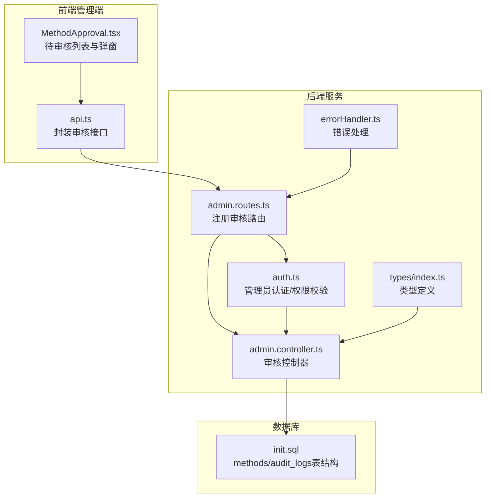
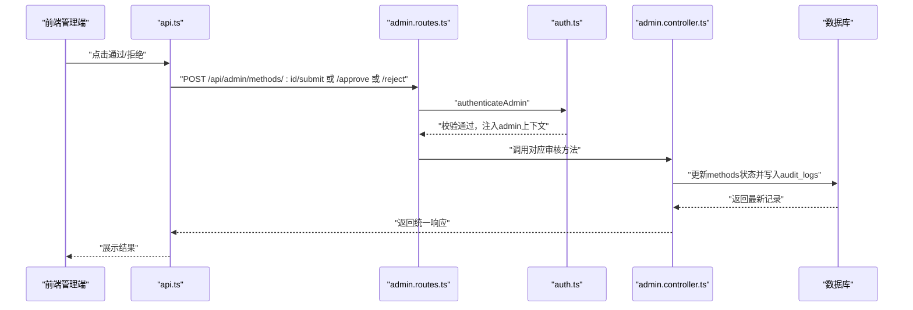
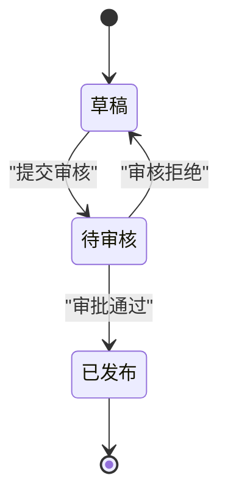
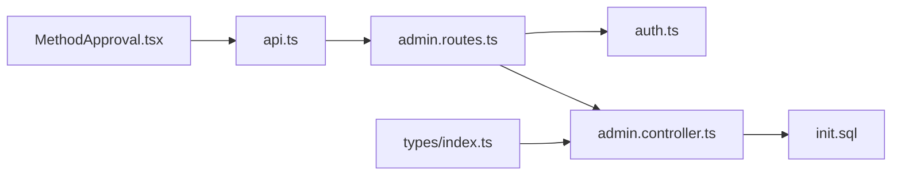

# 内容审核流程

<cite>
**本文引用的文件**
- [backend/src/controllers/admin.controller.ts](file://backend/src/controllers/admin.controller.ts)
- [backend/src/routes/admin.routes.ts](file://backend/src/routes/admin.routes.ts)
- [backend/src/middleware/auth.ts](file://backend/src/middleware/auth.ts)
- [backend/src/middleware/errorHandler.ts](file://backend/src/middleware/errorHandler.ts)
- [backend/src/types/index.ts](file://backend/src/types/index.ts)
- [database/init.sql](file://database/init.sql)
- [home/user/nian/admin-web/src/services/api.ts](file://home/user/nian/admin-web/src/services/api.ts)
- [home/user/nian/admin-web/src/pages/MethodApproval.tsx](file://home/user/nian/admin-web/src/pages/MethodApproval.tsx)
</cite>

## 目录
1. [简介](#简介)
2. [项目结构](#项目结构)
3. [核心组件](#核心组件)
4. [架构总览](#架构总览)
5. [详细组件分析](#详细组件分析)
6. [依赖关系分析](#依赖关系分析)
7. [性能考量](#性能考量)
8. [故障排查指南](#故障排查指南)
9. [结论](#结论)
10. [附录](#附录)

## 简介
本文件面向nian项目“心理调节方法”的内容审核流程，系统化梳理从草稿到发布的完整生命周期：创建草稿、提交审核、超级管理员批准发布、退回修改等关键节点；明确审核权限控制（仅super_admin可批准/拒绝）、审核日志记录（audit_logs表）的结构与用途；并提供各审核操作的请求示例、响应数据与错误处理场景，帮助开发者快速理解业务规则与安全控制。

## 项目结构
围绕审核流程的关键后端模块与数据库结构如下：
- 路由层：定义审核相关接口（提交、批准、拒绝）
- 控制器层：实现审核逻辑、权限校验、状态变更与日志记录
- 中间件层：管理员认证与权限校验
- 类型定义：统一响应结构与实体类型
- 数据库：methods表的状态字段与audit_logs表的审计记录

图表来源
- [backend/src/routes/admin.routes.ts](file://backend/src/routes/admin.routes.ts#L1-L98)
- [backend/src/controllers/admin.controller.ts](file://backend/src/controllers/admin.controller.ts#L266-L387)
- [backend/src/middleware/auth.ts](file://backend/src/middleware/auth.ts#L36-L77)
- [backend/src/middleware/errorHandler.ts](file://backend/src/middleware/errorHandler.ts#L1-L97)
- [backend/src/types/index.ts](file://backend/src/types/index.ts#L18-L35)
- [database/init.sql](file://database/init.sql#L19-L36)
- [database/init.sql](file://database/init.sql#L109-L123)
- [home/user/nian/admin-web/src/services/api.ts](file://home/user/nian/admin-web/src/services/api.ts#L49-L61)
- [home/user/nian/admin-web/src/pages/MethodApproval.tsx](file://home/user/nian/admin-web/src/pages/MethodApproval.tsx#L1-L120)

章节来源
- [backend/src/routes/admin.routes.ts](file://backend/src/routes/admin.routes.ts#L1-L98)
- [backend/src/controllers/admin.controller.ts](file://backend/src/controllers/admin.controller.ts#L266-L387)
- [database/init.sql](file://database/init.sql#L19-L36)
- [database/init.sql](file://database/init.sql#L109-L123)

## 核心组件
- 审核路由与控制器
  - 提交审核：POST /api/admin/methods/:id/submit
  - 审批通过：POST /api/admin/methods/:id/approve
  - 审核拒绝：POST /api/admin/methods/:id/reject
- 管理员认证与权限
  - 管理员登录成功后携带角色信息，仅super_admin可执行批准/拒绝
- 审核日志
  - audit_logs表记录method_id、admin_id、action、status_before、status_after、comment、created_at

章节来源
- [backend/src/routes/admin.routes.ts](file://backend/src/routes/admin.routes.ts#L42-L46)
- [backend/src/controllers/admin.controller.ts](file://backend/src/controllers/admin.controller.ts#L266-L387)
- [backend/src/middleware/auth.ts](file://backend/src/middleware/auth.ts#L36-L77)
- [database/init.sql](file://database/init.sql#L109-L123)

## 架构总览
审核流程在后端采用“路由 -> 中间件 -> 控制器 -> 数据库”的分层设计，前端通过api.ts封装请求，MethodApproval页面负责展示待审核列表与交互。

图表来源
- [backend/src/routes/admin.routes.ts](file://backend/src/routes/admin.routes.ts#L42-L46)
- [backend/src/middleware/auth.ts](file://backend/src/middleware/auth.ts#L36-L77)
- [backend/src/controllers/admin.controller.ts](file://backend/src/controllers/admin.controller.ts#L266-L387)
- [database/init.sql](file://database/init.sql#L109-L123)
- [home/user/nian/admin-web/src/services/api.ts](file://home/user/nian/admin-web/src/services/api.ts#L49-L61)

## 详细组件分析

### 审核生命周期与状态流转
- 初始状态：创建方法时默认状态为draft
- 提交审核：将状态从draft切换至pending，并记录一次audit_logs
- 审批通过：仅super_admin可执行，将状态从pending切换至published，并记录一次audit_logs
- 审核拒绝：仅super_admin可执行，将状态从pending切回draft，并记录一次audit_logs

图表来源
- [backend/src/controllers/admin.controller.ts](file://backend/src/controllers/admin.controller.ts#L266-L387)
- [database/init.sql](file://database/init.sql#L19-L36)
- [database/init.sql](file://database/init.sql#L109-L123)

章节来源
- [backend/src/controllers/admin.controller.ts](file://backend/src/controllers/admin.controller.ts#L266-L387)
- [database/init.sql](file://database/init.sql#L19-L36)

### 提交流程（POST /api/admin/methods/:id/submit）
- 请求路径：POST /api/admin/methods/:id/submit
- 身份要求：管理员登录后携带token
- 业务规则：
  - 仅当当前状态为draft时允许提交
  - 成功后状态变更为pending
  - 写入audit_logs(action='submit', status_before='draft', status_after='pending')
- 错误场景：
  - 未登录或token无效：返回401
  - 方法不存在或状态非draft：返回404
- 响应结构：success + data（包含最新方法记录）

章节来源
- [backend/src/routes/admin.routes.ts](file://backend/src/routes/admin.routes.ts#L42-L46)
- [backend/src/controllers/admin.controller.ts](file://backend/src/controllers/admin.controller.ts#L266-L296)
- [backend/src/middleware/auth.ts](file://backend/src/middleware/auth.ts#L36-L77)
- [database/init.sql](file://database/init.sql#L109-L123)

### 审批通过流程（POST /api/admin/methods/:id/approve）
- 请求路径：POST /api/admin/methods/:id/approve
- 身份要求：管理员登录后携带token，且角色为super_admin
- 业务规则：
  - 仅当当前状态为pending时允许批准
  - 成功后状态变更为published，并设置published_at
  - 写入audit_logs(action='approve', status_before='pending', status_after='published', comment可选)
- 错误场景：
  - 未登录或token无效：返回401
  - 非super_admin：返回403
  - 方法不存在或状态非pending：返回404
- 响应结构：success + data（包含最新方法记录）

章节来源
- [backend/src/routes/admin.routes.ts](file://backend/src/routes/admin.routes.ts#L42-L46)
- [backend/src/controllers/admin.controller.ts](file://backend/src/controllers/admin.controller.ts#L299-L340)
- [backend/src/middleware/auth.ts](file://backend/src/middleware/auth.ts#L36-L77)
- [database/init.sql](file://database/init.sql#L109-L123)

### 审核拒绝流程（POST /api/admin/methods/:id/reject）
- 请求路径：POST /api/admin/methods/:id/reject
- 身份要求：管理员登录后携带token，且角色为super_admin
- 业务规则：
  - 仅当当前状态为pending时允许拒绝
  - 成功后状态切回draft
  - 写入audit_logs(action='reject', status_before='pending', status_after='draft', comment必填)
- 错误场景：
  - 未登录或token无效：返回401
  - 非super_admin：返回403
  - 缺少拒绝评论：返回400
  - 方法不存在或状态非pending：返回404
- 响应结构：success + data（包含最新方法记录）

章节来源
- [backend/src/routes/admin.routes.ts](file://backend/src/routes/admin.routes.ts#L42-L46)
- [backend/src/controllers/admin.controller.ts](file://backend/src/controllers/admin.controller.ts#L342-L387)
- [backend/src/middleware/auth.ts](file://backend/src/middleware/auth.ts#L36-L77)
- [database/init.sql](file://database/init.sql#L109-L123)

### 权限控制机制
- 管理员认证中间件：
  - 校验Authorization头是否为Bearer Token
  - 解析token并注入admin上下文（包含id、username、role）
- 审核权限：
  - approve/reject仅允许role为super_admin的管理员执行
- 前端交互：
  - MethodApproval页面在拒绝时强制要求填写comment
  - approve时comment为可选

章节来源
- [backend/src/middleware/auth.ts](file://backend/src/middleware/auth.ts#L36-L77)
- [backend/src/controllers/admin.controller.ts](file://backend/src/controllers/admin.controller.ts#L299-L340)
- [backend/src/controllers/admin.controller.ts](file://backend/src/controllers/admin.controller.ts#L342-L387)
- [home/user/nian/admin-web/src/pages/MethodApproval.tsx](file://home/user/nian/admin-web/src/pages/MethodApproval.tsx#L222-L255)

### 审核日志记录（audit_logs表）
- 字段说明：
  - method_id：关联方法ID
  - admin_id：操作管理员ID
  - action：操作类型（submit、approve、reject）
  - status_before：变更前状态
  - status_after：变更后状态
  - comment：审核意见/拒绝原因
  - created_at：记录时间
- 用途：
  - 追踪每条方法的审核历史
  - 支持审计与复盘

章节来源
- [database/init.sql](file://database/init.sql#L109-L123)

### 前端集成要点
- 接口封装：
  - api.ts中提供approveMethod与rejectMethod，分别携带comment参数
- 页面交互：
  - MethodApproval.tsx展示待审核列表，支持展开预览content_json
  - 拒绝时强制校验comment非空

章节来源
- [home/user/nian/admin-web/src/services/api.ts](file://home/user/nian/admin-web/src/services/api.ts#L49-L61)
- [home/user/nian/admin-web/src/pages/MethodApproval.tsx](file://home/user/nian/admin-web/src/pages/MethodApproval.tsx#L1-L120)
- [home/user/nian/admin-web/src/pages/MethodApproval.tsx](file://home/user/nian/admin-web/src/pages/MethodApproval.tsx#L222-L255)

## 依赖关系分析
- 路由依赖中间件进行管理员认证
- 控制器依赖数据库进行状态更新与日志写入
- 类型定义统一了响应结构与实体字段
- 前端通过api.ts与后端路由对接

图表来源
- [backend/src/routes/admin.routes.ts](file://backend/src/routes/admin.routes.ts#L1-L98)
- [backend/src/middleware/auth.ts](file://backend/src/middleware/auth.ts#L36-L77)
- [backend/src/controllers/admin.controller.ts](file://backend/src/controllers/admin.controller.ts#L266-L387)
- [backend/src/types/index.ts](file://backend/src/types/index.ts#L18-L35)
- [database/init.sql](file://database/init.sql#L19-L36)
- [database/init.sql](file://database/init.sql#L109-L123)
- [home/user/nian/admin-web/src/services/api.ts](file://home/user/nian/admin-web/src/services/api.ts#L49-L61)
- [home/user/nian/admin-web/src/pages/MethodApproval.tsx](file://home/user/nian/admin-web/src/pages/MethodApproval.tsx#L1-L120)

章节来源
- [backend/src/routes/admin.routes.ts](file://backend/src/routes/admin.routes.ts#L1-L98)
- [backend/src/controllers/admin.controller.ts](file://backend/src/controllers/admin.controller.ts#L266-L387)
- [backend/src/middleware/auth.ts](file://backend/src/middleware/auth.ts#L36-L77)
- [backend/src/types/index.ts](file://backend/src/types/index.ts#L18-L35)
- [database/init.sql](file://database/init.sql#L19-L36)
- [database/init.sql](file://database/init.sql#L109-L123)
- [home/user/nian/admin-web/src/services/api.ts](file://home/user/nian/admin-web/src/services/api.ts#L49-L61)
- [home/user/nian/admin-web/src/pages/MethodApproval.tsx](file://home/user/nian/admin-web/src/pages/MethodApproval.tsx#L1-L120)

## 性能考量
- 审核操作均为单行更新与插入，数据库层面开销较小
- 审核日志按method_id、admin_id、created_at建立索引，便于查询与统计
- 建议在高并发场景下：
  - 对methods表的status字段建立索引（已有）
  - 对audit_logs表的method_id、admin_id、created_at建立索引（已有）
  - 合理设置分页参数，避免一次性拉取过多待审核数据

章节来源
- [database/init.sql](file://database/init.sql#L38-L41)
- [database/init.sql](file://database/init.sql#L110-L123)

## 故障排查指南
- 常见错误码与场景
  - 401 未认证：Authorization头缺失或token无效
  - 403 权限不足：非super_admin尝试approve/reject
  - 400 参数错误：reject缺少comment；创建/更新缺少必填字段
  - 404 资源不存在：方法不存在或状态不符合预期
  - 500 服务器错误：其他异常情况
- 建议排查步骤
  - 确认管理员token有效且角色为super_admin
  - 确认方法状态符合操作前提（draft/pending）
  - 检查请求参数完整性（如reject的comment）
  - 查看后端日志定位具体异常

章节来源
- [backend/src/controllers/admin.controller.ts](file://backend/src/controllers/admin.controller.ts#L266-L387)
- [backend/src/middleware/errorHandler.ts](file://backend/src/middleware/errorHandler.ts#L1-L97)

## 结论
nian项目的心理调节方法审核流程以清晰的状态机为核心，结合严格的管理员权限控制与完整的审计日志，确保内容发布过程的可控性与可追溯性。前后端通过标准化的接口与统一的响应结构协作，既满足业务需求又具备良好的扩展性。

## 附录

### API定义与示例（路径与参数）
- 提交审核
  - 方法：POST
  - 路径：/api/admin/methods/:id/submit
  - 身份：管理员token
  - 成功状态：200
  - 响应：success + data（最新方法记录）
  - 失败：401/404
- 审批通过
  - 方法：POST
  - 路径：/api/admin/methods/:id/approve
  - 身份：管理员token（super_admin）
  - 参数：comment（可选）
  - 成功状态：200
  - 响应：success + data（最新方法记录）
  - 失败：401/403/404
- 审核拒绝
  - 方法：POST
  - 路径：/api/admin/methods/:id/reject
  - 身份：管理员token（super_admin）
  - 参数：comment（必填）
  - 成功状态：200
  - 响应：success + data（最新方法记录）
  - 失败：401/403/400/404

章节来源
- [backend/src/routes/admin.routes.ts](file://backend/src/routes/admin.routes.ts#L42-L46)
- [backend/src/controllers/admin.controller.ts](file://backend/src/controllers/admin.controller.ts#L266-L387)
- [home/user/nian/admin-web/src/services/api.ts](file://home/user/nian/admin-web/src/services/api.ts#L49-L61)