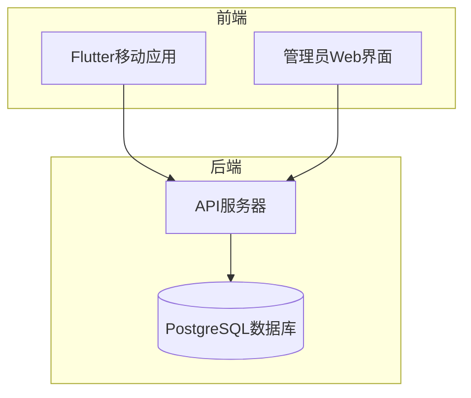
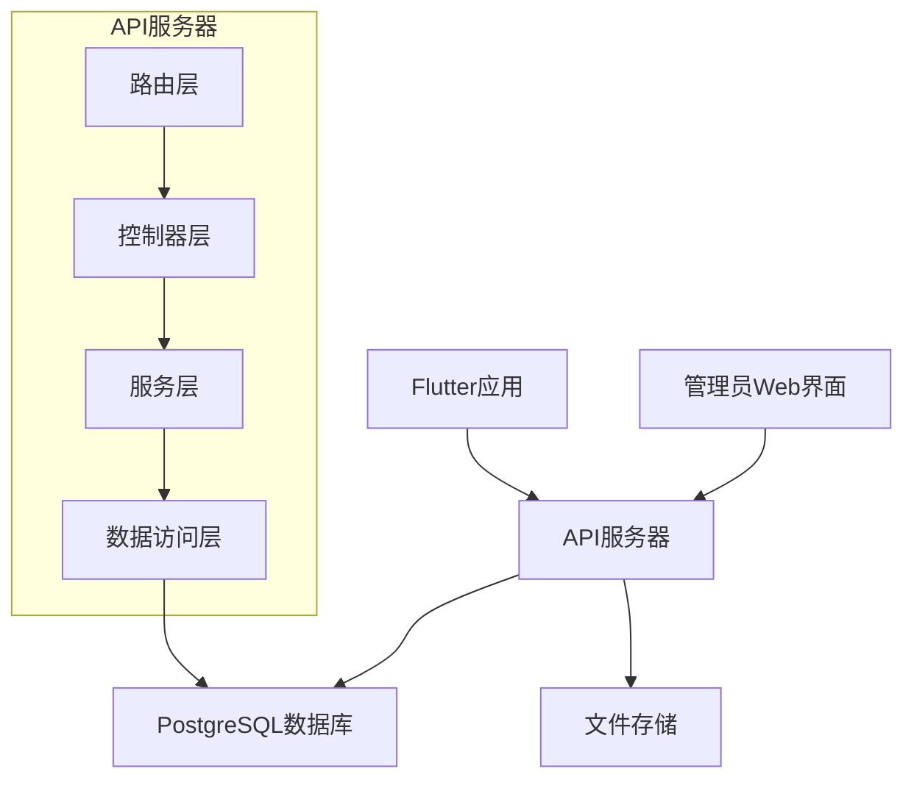
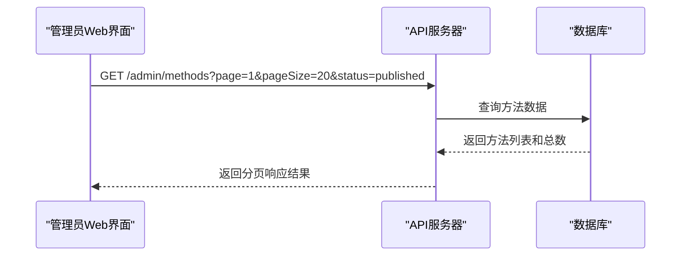
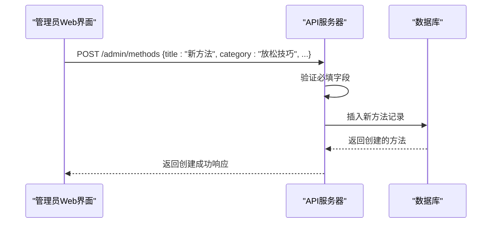
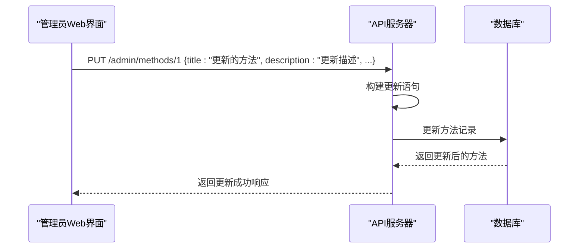
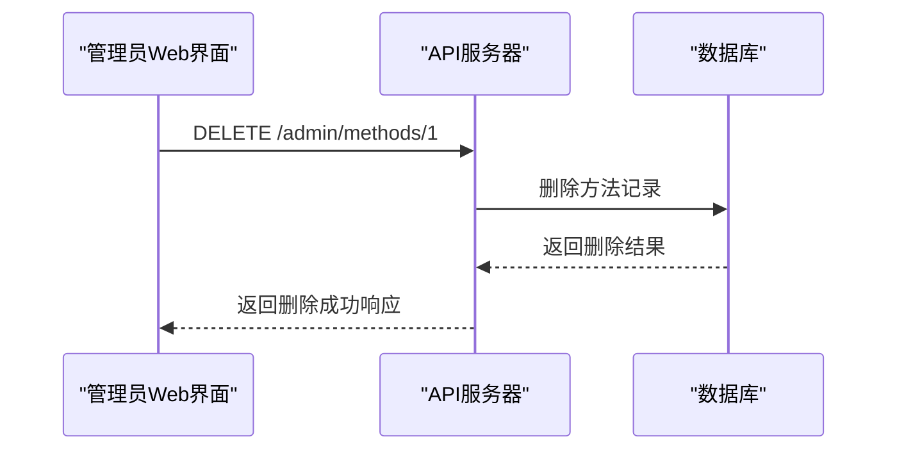
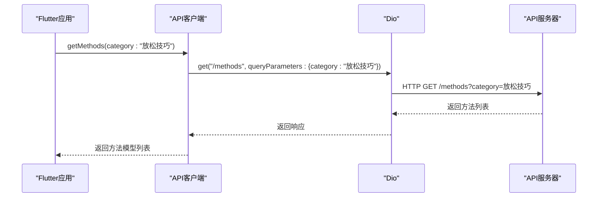
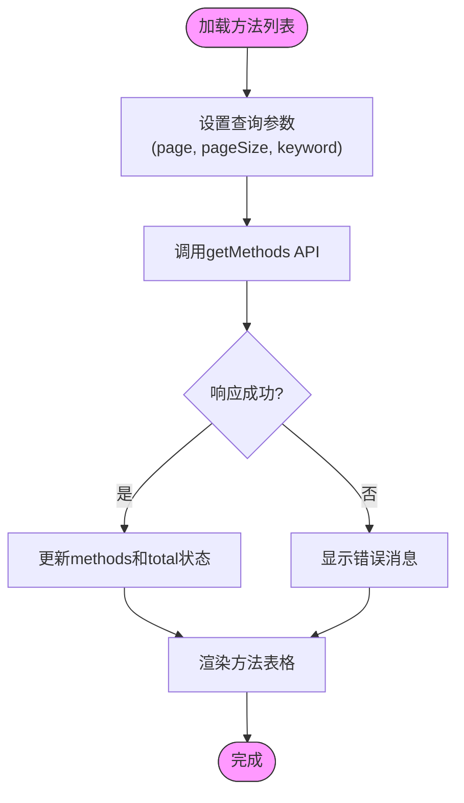
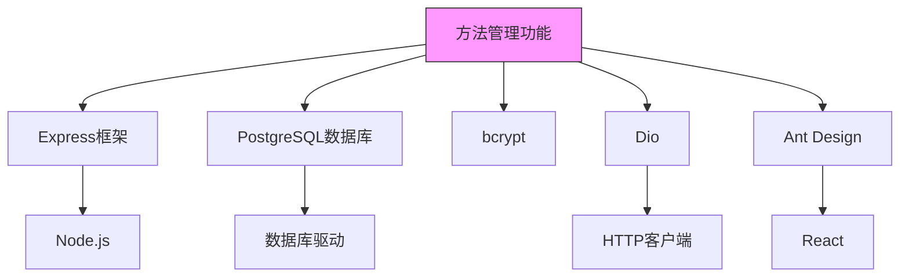

# 内容管理

<cite>
**本文档引用的文件**
- [method.routes.ts](file://backend/src/routes/method.routes.ts)
- [admin.routes.ts](file://backend/src/routes/admin.routes.ts)
- [method.controller.ts](file://backend/src/controllers/method.controller.ts)
- [admin.controller.ts](file://backend/src/controllers/admin.controller.ts)
- [types/index.ts](file://backend/src/types/index.ts)
- [database/init.sql](file://database/init.sql)
- [api.ts](file://home/user/nian/admin-web/src/services/api.ts)
- [MethodList.tsx](file://home/user/nian/admin-web/src/pages/MethodList.tsx)
- [api_constants.dart](file://flutter_app/lib/config/api_constants.dart)
- [api_client.dart](file://flutter_app/lib/data/api/api_client.dart)
- [method_model.dart](file://flutter_app/lib/data/models/method_model.dart)
- [method.dart](file://flutter_app/lib/domain/entities/method.dart)
- [method_remote_data_source.dart](file://flutter_app/lib/data/datasources/remote/method_remote_data_source.dart)
</cite>

## 目录
1. [简介](#简介)
2. [项目结构](#项目结构)
3. [核心组件](#核心组件)
4. [架构概述](#架构概述)
5. [详细组件分析](#详细组件分析)
6. [依赖分析](#依赖分析)
7. [性能考虑](#性能考虑)
8. [故障排除指南](#故障排除指南)
9. [结论](#结论)

## 简介
本文档全面介绍了nian项目中心理调节方法内容管理的API功能。文档详细说明了方法的CRUD操作，包括获取方法列表、创建新方法、更新现有方法和删除方法。同时解释了方法数据模型的各个字段，并提供了各操作的请求示例和响应数据结构，帮助开发者理解如何通过API管理内容。

## 项目结构
nian项目采用前后端分离的架构，包含后端API服务、Flutter移动应用和管理员Web界面三个主要部分。后端使用Node.js和Express框架提供RESTful API，数据库使用PostgreSQL。Flutter应用作为用户端，管理员Web界面使用React构建，两者都通过API与后端进行交互。



**图表来源**
- [backend/src/routes](file://backend/src/routes)
- [flutter_app/lib](file://flutter_app/lib)
- [home/user/nian/admin-web/src](file://home/user/nian/admin-web/src)

**章节来源**
- [backend](file://backend)
- [flutter_app](file://flutter_app)
- [home/user/nian/admin-web](file://home/user/nian/admin-web)

## 核心组件
心理调节方法内容管理的核心组件包括方法数据模型、CRUD操作API、管理员认证机制和前后端交互逻辑。后端通过Express路由定义API端点，控制器处理业务逻辑，数据库存储方法数据。前端通过API客户端与后端通信，实现方法的展示和管理功能。

**章节来源**
- [backend/src/controllers/method.controller.ts](file://backend/src/controllers/method.controller.ts#L6-L153)
- [backend/src/controllers/admin.controller.ts](file://backend/src/controllers/admin.controller.ts#L68-L264)
- [types/index.ts](file://backend/src/types/index.ts#L19-L35)

## 架构概述
nian项目的内容管理架构采用分层设计，包括表现层、业务逻辑层和数据访问层。表现层由Flutter应用和管理员Web界面组成，负责用户交互。业务逻辑层由后端API服务实现，处理方法的CRUD操作和业务规则。数据访问层通过PostgreSQL数据库存储和管理方法数据。



**图表来源**
- [backend/src/routes/admin.routes.ts](file://backend/src/routes/admin.routes.ts#L36-L40)
- [backend/src/controllers/admin.controller.ts](file://backend/src/controllers/admin.controller.ts#L129-L264)
- [database/init.sql](file://database/init.sql#L19-L36)

**章节来源**
- [backend/src](file://backend/src)
- [database/init.sql](file://database/init.sql)

## 详细组件分析

### 方法数据模型分析
心理调节方法的数据模型定义了方法的各个属性，包括基本信息、分类、难度、时长、封面图片和内容等。模型还包含状态字段，用于管理方法的生命周期。

```mermaid
classDiagram
class Method {
+id : number
+title : string
+description : string
+category : string
+difficulty : string
+duration_minutes : number
+cover_image_url : string
+content_json : any
+status : string
+view_count : number
+select_count : number
+created_at : Date
+updated_at : Date
+published_at : Date
}
Method : +status : 'draft' | 'pending' | 'published' | 'archived'
```

**图表来源**
- [types/index.ts](file://backend/src/types/index.ts#L19-L35)
- [database/init.sql](file://database/init.sql#L20-L35)

**章节来源**
- [types/index.ts](file://backend/src/types/index.ts#L19-L35)
- [database/init.sql](file://database/init.sql#L19-L36)

### CRUD操作分析
方法的CRUD操作通过管理员API实现，包括获取方法列表、创建新方法、更新现有方法和删除方法。这些操作需要管理员认证，确保只有授权用户才能管理内容。

#### 获取方法列表
获取方法列表的API支持分页、状态和分类过滤，返回分页响应结果。



**图表来源**
- [admin.routes.ts](file://backend/src/routes/admin.routes.ts#L37)
- [admin.controller.ts](file://backend/src/controllers/admin.controller.ts#L68-L127)
- [MethodList.tsx](file://home/user/nian/admin-web/src/pages/MethodList.tsx#L25-L30)

**章节来源**
- [admin.controller.ts](file://backend/src/controllers/admin.controller.ts#L68-L127)

#### 创建新方法
创建新方法的API将新方法保存到数据库，并自动设置为草稿状态，等待后续审核发布。



**图表来源**
- [admin.routes.ts](file://backend/src/routes/admin.routes.ts#L38)
- [admin.controller.ts](file://backend/src/controllers/admin.controller.ts#L129-L164)
- [api.ts](file://home/user/nian/admin-web/src/services/api.ts#L37)

**章节来源**
- [admin.controller.ts](file://backend/src/controllers/admin.controller.ts#L129-L164)

#### 更新现有方法
更新现有方法的API允许管理员修改方法的各个属性，更新后的方法仍保持原有状态。



**图表来源**
- [admin.routes.ts](file://backend/src/routes/admin.routes.ts#L39)
- [admin.controller.ts](file://backend/src/controllers/admin.controller.ts#L166-L245)
- [api.ts](file://home/user/nian/admin-web/src/services/api.ts#L41)

**章节来源**
- [admin.controller.ts](file://backend/src/controllers/admin.controller.ts#L166-L245)

#### 删除方法
删除方法的API从数据库中移除指定的方法记录，执行后无法恢复。



**图表来源**
- [admin.routes.ts](file://backend/src/routes/admin.routes.ts#L40)
- [admin.controller.ts](file://backend/src/controllers/admin.controller.ts#L247-L264)
- [api.ts](file://home/user/nian/admin-web/src/services/api.ts#L45)

**章节来源**
- [admin.controller.ts](file://backend/src/controllers/admin.controller.ts#L247-L264)

### 前端交互分析
前端应用通过API客户端与后端进行交互，实现方法的展示和管理功能。Flutter应用和管理员Web界面都封装了API调用，提供一致的用户体验。

#### Flutter应用方法管理
Flutter应用通过Dio客户端调用API，获取和管理心理调节方法。



**图表来源**
- [api_client.dart](file://flutter_app/lib/data/api/api_client.dart#L47-L57)
- [method_remote_data_source.dart](file://flutter_app/lib/data/datasources/remote/method_remote_data_source.dart#L13-L30)
- [api_constants.dart](file://flutter_app/lib/config/api_constants.dart#L15)

**章节来源**
- [flutter_app/lib/data](file://flutter_app/lib/data)

#### 管理员Web界面方法管理
管理员Web界面使用Ant Design组件和自定义API服务，提供直观的方法管理界面。



**图表来源**
- [MethodList.tsx](file://home/user/nian/admin-web/src/pages/MethodList.tsx#L18-L30)
- [api.ts](file://home/user/nian/admin-web/src/services/api.ts#L29)
- [MethodList.tsx](file://home/user/nian/admin-web/src/pages/MethodList.tsx#L148-L164)

**章节来源**
- [home/user/nian/admin-web/src/pages/MethodList.tsx](file://home/user/nian/admin-web/src/pages/MethodList.tsx)
- [home/user/nian/admin-web/src/services/api.ts](file://home/user/nian/admin-web/src/services/api.ts)

## 依赖分析
心理调节方法内容管理功能依赖于多个组件和外部服务。后端依赖Express框架处理HTTP请求，PostgreSQL数据库存储数据，bcrypt库处理密码加密。前端Flutter应用依赖Dio库进行HTTP通信，管理员Web界面依赖Ant Design组件库构建用户界面。



**图表来源**
- [package.json](file://backend/package.json)
- [pubspec.yaml](file://flutter_app/pubspec.yaml)
- [package.json](file://home/user/nian/admin-web/package.json)

**章节来源**
- [backend/package.json](file://backend/package.json)
- [flutter_app/pubspec.yaml](file://flutter_app/pubspec.yaml)
- [home/user/nian/admin-web/package.json](file://home/user/nian/admin-web/package.json)

## 性能考虑
在设计和实现心理调节方法内容管理功能时，考虑了多个性能优化点。数据库查询使用参数化查询防止SQL注入，同时添加了适当的索引提高查询效率。API响应采用分页机制，避免一次性返回大量数据。前后端都实现了错误处理和超时机制，确保系统的稳定性和可靠性。

## 故障排除指南
在使用心理调节方法内容管理API时，可能会遇到各种问题。以下是一些常见问题及其解决方案：

1. **认证失败**：确保管理员已登录并获取有效的JWT令牌。
2. **权限不足**：检查管理员角色是否具有执行特定操作的权限。
3. **数据库连接问题**：检查数据库服务是否正常运行，连接配置是否正确。
4. **API超时**：检查网络连接，适当增加超时设置。
5. **数据验证错误**：确保请求数据符合API要求的格式和必填字段。

**章节来源**
- [admin.controller.ts](file://backend/src/controllers/admin.controller.ts#L8-L66)
- [middleware/auth.ts](file://backend/src/middleware/auth.ts)
- [api_client.dart](file://flutter_app/lib/data/api/api_client.dart#L22-L40)

## 结论
nian项目的心里调节方法内容管理功能提供了完整的CRUD操作，支持分页、过滤和搜索功能。通过清晰的数据模型和API设计，实现了高效的内容管理。前后端分离的架构使得系统具有良好的可维护性和扩展性。管理员Web界面和Flutter应用提供了友好的用户交互体验，使得内容管理更加便捷高效。