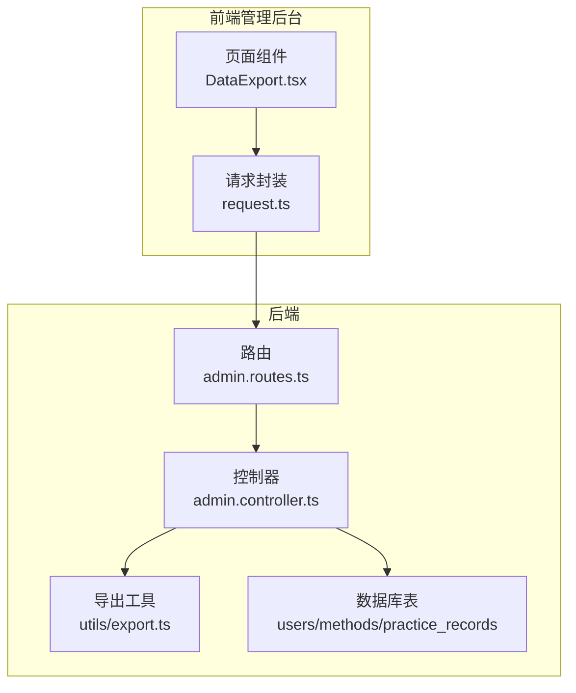
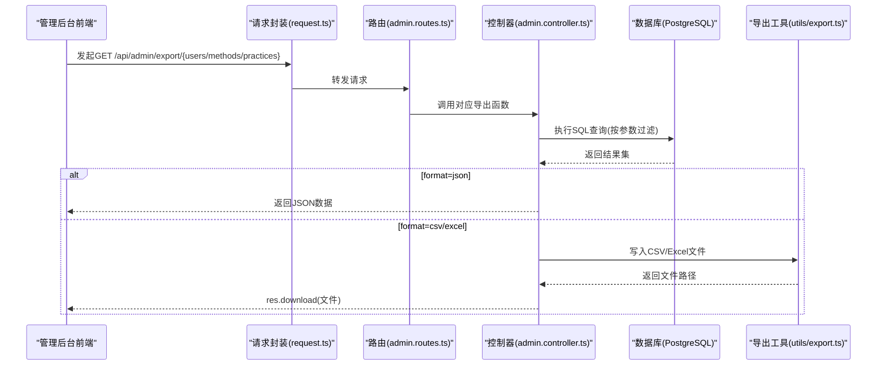
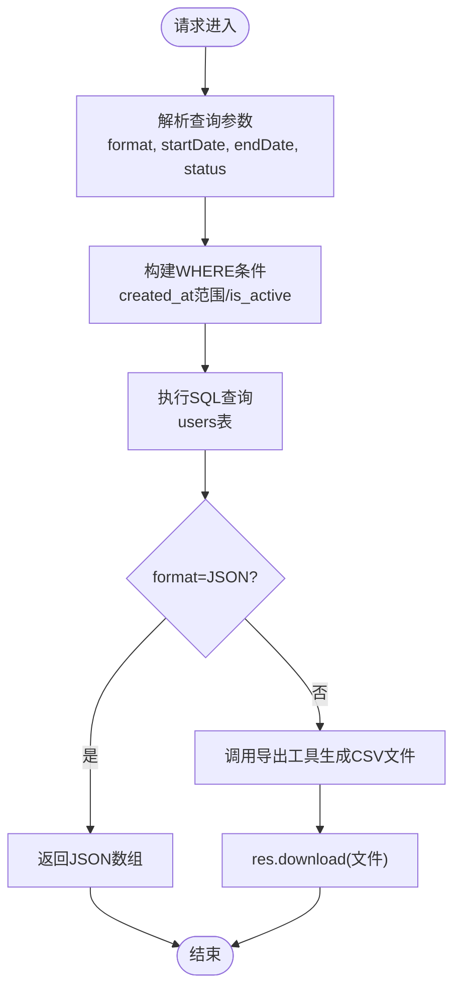
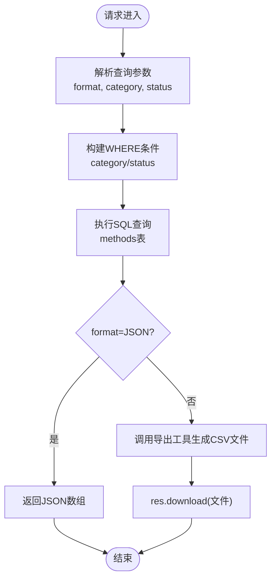
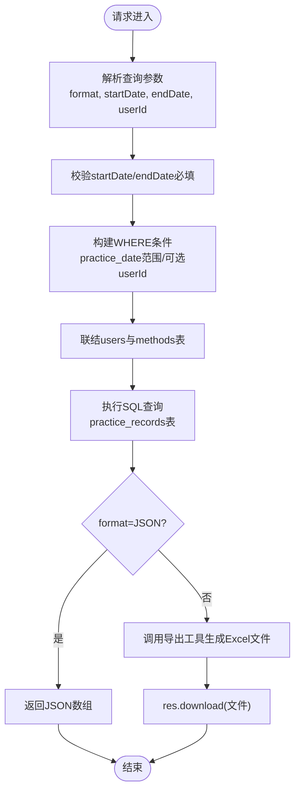
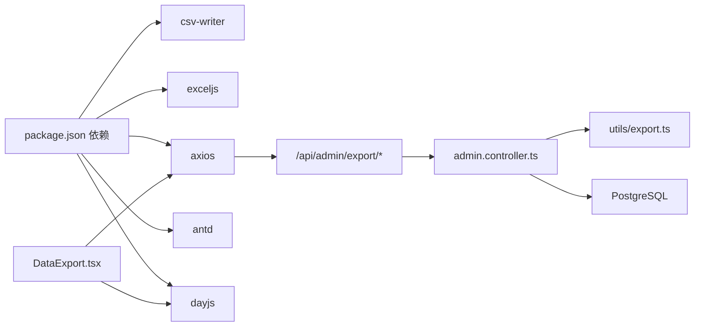

# 数据导出

<cite>
**本文引用的文件**
- [backend/src/routes/admin.routes.ts](file://backend/src/routes/admin.routes.ts)
- [backend/src/controllers/admin.controller.ts](file://backend/src/controllers/admin.controller.ts)
- [backend/src/utils/export.ts](file://backend/src/utils/export.ts)
- [database/init.sql](file://database/init.sql)
- [home/user/nian/admin-web/src/pages/DataExport.tsx](file://home/user/nian/admin-web/src/pages/DataExport.tsx)
- [home/user/nian/admin-web/src/utils/request.ts](file://home/user/nian/admin-web/src/utils/request.ts)
- [backend/package.json](file://backend/package.json)
</cite>

## 目录
1. [简介](#简介)
2. [项目结构](#项目结构)
3. [核心组件](#核心组件)
4. [架构总览](#架构总览)
5. [详细组件分析](#详细组件分析)
6. [依赖关系分析](#依赖关系分析)
7. [性能考虑](#性能考虑)
8. [故障排查指南](#故障排查指南)
9. [结论](#结论)
10. [附录](#附录)

## 简介
本文件面向nian项目的“数据导出”功能，围绕以下三个后端API端点展开：
- GET /api/admin/export/users：导出用户数据，支持CSV与JSON两种格式，支持按日期范围与状态筛选。
- GET /api/admin/export/methods：导出方法数据，支持CSV与JSON两种格式，支持按分类与状态筛选。
- GET /api/admin/export/practices：导出练习记录，支持CSV、Excel与JSON三种格式，必须提供日期范围，可选按用户筛选。

文档将说明各端点的查询参数、筛选逻辑、后端导出实现（CSV/Excel/JSON）、响应流程（res.download）以及在管理后台的集成方式与使用示例。

## 项目结构
数据导出功能涉及后端路由、控制器、导出工具与数据库表结构，同时管理后台前端提供可视化界面调用这些API。

图表来源
- [backend/src/routes/admin.routes.ts](file://backend/src/routes/admin.routes.ts#L56-L60)
- [backend/src/controllers/admin.controller.ts](file://backend/src/controllers/admin.controller.ts#L608-L747)
- [backend/src/utils/export.ts](file://backend/src/utils/export.ts#L1-L130)
- [database/init.sql](file://database/init.sql#L5-L79)
- [home/user/nian/admin-web/src/pages/DataExport.tsx](file://home/user/nian/admin-web/src/pages/DataExport.tsx#L1-L294)
- [home/user/nian/admin-web/src/utils/request.ts](file://home/user/nian/admin-web/src/utils/request.ts#L1-L81)

章节来源
- [backend/src/routes/admin.routes.ts](file://backend/src/routes/admin.routes.ts#L56-L60)
- [backend/src/controllers/admin.controller.ts](file://backend/src/controllers/admin.controller.ts#L608-L747)
- [backend/src/utils/export.ts](file://backend/src/utils/export.ts#L1-L130)
- [database/init.sql](file://database/init.sql#L5-L79)
- [home/user/nian/admin-web/src/pages/DataExport.tsx](file://home/user/nian/admin-web/src/pages/DataExport.tsx#L1-L294)
- [home/user/nian/admin-web/src/utils/request.ts](file://home/user/nian/admin-web/src/utils/request.ts#L1-L81)

## 核心组件
- 路由层：在路由中定义三个导出端点，均受管理员鉴权保护。
- 控制器层：实现三个导出函数，分别查询users、methods、practice_records表，按查询参数过滤，生成CSV/Excel/JSON文件并通过res.download返回。
- 导出工具：提供CSV/Excel/JSON写入能力，并统一生成带时间戳的文件名，定期清理过期导出文件。
- 数据库表：users、methods、practice_records包含导出所需字段；练习记录导出会联结users与methods表获取用户邮箱与方法标题。

章节来源
- [backend/src/routes/admin.routes.ts](file://backend/src/routes/admin.routes.ts#L56-L60)
- [backend/src/controllers/admin.controller.ts](file://backend/src/controllers/admin.controller.ts#L608-L747)
- [backend/src/utils/export.ts](file://backend/src/utils/export.ts#L1-L130)
- [database/init.sql](file://database/init.sql#L5-L79)

## 架构总览
后端采用Express + PostgreSQL，前端管理后台基于React+Ant Design，通过Axios封装统一访问/api前缀。导出流程如下：

图表来源
- [backend/src/routes/admin.routes.ts](file://backend/src/routes/admin.routes.ts#L56-L60)
- [backend/src/controllers/admin.controller.ts](file://backend/src/controllers/admin.controller.ts#L608-L747)
- [backend/src/utils/export.ts](file://backend/src/utils/export.ts#L1-L130)
- [home/user/nian/admin-web/src/utils/request.ts](file://home/user/nian/admin-web/src/utils/request.ts#L1-L81)

## 详细组件分析

### 端点：GET /api/admin/export/users
- 功能：导出用户数据，支持CSV与JSON两种格式。
- 查询参数
  - format：输出格式，可选csv、json，默认csv
  - startDate：开始日期（YYYY-MM-DD），用于筛选注册时间
  - endDate：结束日期（YYYY-MM-DD），用于筛选注册时间
  - status：用户状态，可选active、inactive；传入则按is_active过滤
- 查询逻辑
  - 若提供startDate/endDate，则按created_at范围过滤
  - 若status为active/inactive，则按is_active=true/false过滤
  - 最终按created_at降序排序
- 输出
  - format=json：直接返回JSON数组
  - format=csv：调用导出工具生成CSV文件并通过res.download返回

图表来源
- [backend/src/controllers/admin.controller.ts](file://backend/src/controllers/admin.controller.ts#L608-L655)
- [backend/src/utils/export.ts](file://backend/src/utils/export.ts#L18-L37)

章节来源
- [backend/src/controllers/admin.controller.ts](file://backend/src/controllers/admin.controller.ts#L608-L655)
- [database/init.sql](file://database/init.sql#L5-L18)

### 端点：GET /api/admin/export/methods
- 功能：导出方法数据，支持CSV与JSON两种格式。
- 查询参数
  - format：输出格式，可选csv、json，默认csv
  - category：方法分类，如“放松技巧”、“认知调整”等
  - status：方法状态，可选draft、pending、published；传入则按status过滤
- 查询逻辑
  - 若提供category，则按category过滤
  - 若status为draft/pending/published，则按status过滤
  - 最终按created_at降序排序
- 输出
  - format=json：直接返回JSON数组
  - format=csv：调用导出工具生成CSV文件并通过res.download返回

图表来源
- [backend/src/controllers/admin.controller.ts](file://backend/src/controllers/admin.controller.ts#L658-L698)
- [backend/src/utils/export.ts](file://backend/src/utils/export.ts#L40-L61)

章节来源
- [backend/src/controllers/admin.controller.ts](file://backend/src/controllers/admin.controller.ts#L658-L698)
- [database/init.sql](file://database/init.sql#L20-L36)

### 端点：GET /api/admin/export/practices
- 功能：导出练习记录，支持CSV、Excel与JSON三种格式。
- 查询参数
  - format：输出格式，可选csv、excel、json，默认excel
  - startDate：开始日期（YYYY-MM-DD），必填
  - endDate：结束日期（YYYY-MM-DD），必填
  - userId：用户ID，可选，按用户过滤
- 查询逻辑
  - 必须提供startDate与endDate，否则抛出参数校验错误
  - 按practice_date范围过滤
  - 可选按pr.user_id过滤
  - 联结users与methods表获取用户邮箱与方法标题
  - 最终按practice_date降序排序
- 输出
  - format=json：直接返回JSON数组
  - format=excel/csv：调用导出工具生成Excel文件并通过res.download返回

图表来源
- [backend/src/controllers/admin.controller.ts](file://backend/src/controllers/admin.controller.ts#L700-L747)
- [backend/src/utils/export.ts](file://backend/src/utils/export.ts#L63-L103)

章节来源
- [backend/src/controllers/admin.controller.ts](file://backend/src/controllers/admin.controller.ts#L700-L747)
- [database/init.sql](file://database/init.sql#L63-L79)

### 后端导出工具：utils/export.ts
- CSV导出
  - 用户：导出列包含id、email、nickname、created_at、last_login_at、is_active
  - 方法：导出列包含id、title、category、difficulty、duration_minutes、status、view_count、select_count、created_at
- Excel导出
  - 练习记录：工作表名为“练习记录”，列包含id、user_email、method_title、practice_date、duration_minutes、mood_before、mood_after、mood_improvement、notes；自动生成mood_improvement列
- JSON导出
  - 将任意数据数组序列化为JSON文件
- 文件命名与清理
  - 使用时间戳生成唯一文件名
  - 默认导出目录exports，启动时自动创建
  - 定期清理24小时前生成的导出文件

章节来源
- [backend/src/utils/export.ts](file://backend/src/utils/export.ts#L1-L130)

### 数据库表结构要点
- users：id、email、nickname、avatar_url、created_at、last_login_at、is_active
- methods：id、title、description、category、difficulty、duration_minutes、status、view_count、select_count、created_by、created_at、updated_at、published_at
- practice_records：id、user_id、method_id、practice_date、duration_minutes、mood_before、mood_after、notes、questionnaire_result、created_at

章节来源
- [database/init.sql](file://database/init.sql#L5-L79)

### 管理后台集成与使用示例
- 前端页面DataExport.tsx
  - 支持选择数据类型（users/methods/practices）、导出格式（csv/excel/json）
  - 用户数据导出：可选日期范围与用户状态
  - 方法数据导出：可选分类与方法状态
  - 练习记录导出：必须选择日期范围，可选按用户ID筛选
  - 响应处理：根据format选择JSON或Blob下载，自动命名并触发浏览器下载
- 请求封装request.ts
  - baseURL为/api，自动注入Authorization头（Bearer token）
  - 统一处理401未授权跳转登录
- 使用示例
  - 导出用户CSV：GET /api/admin/export/users?format=csv&startDate=2024-01-01&endDate=2024-12-31&status=active
  - 导出方法JSON：GET /api/admin/export/methods?format=json&category=放松技巧&status=published
  - 导出练习Excel：GET /api/admin/export/practices?format=excel&startDate=2024-01-01&endDate=2024-12-31&userId=123

章节来源
- [home/user/nian/admin-web/src/pages/DataExport.tsx](file://home/user/nian/admin-web/src/pages/DataExport.tsx#L1-L294)
- [home/user/nian/admin-web/src/utils/request.ts](file://home/user/nian/admin-web/src/utils/request.ts#L1-L81)

## 依赖关系分析
- 后端依赖
  - csv-writer：生成CSV文件
  - exceljs：生成Excel文件
  - express：路由与响应
  - pg：PostgreSQL连接
- 前端依赖
  - axios：HTTP请求
  - antd：UI组件
  - dayjs：日期格式化

图表来源
- [backend/package.json](file://backend/package.json#L17-L33)
- [home/user/nian/admin-web/src/pages/DataExport.tsx](file://home/user/nian/admin-web/src/pages/DataExport.tsx#L1-L294)
- [home/user/nian/admin-web/src/utils/request.ts](file://home/user/nian/admin-web/src/utils/request.ts#L1-L81)
- [backend/src/controllers/admin.controller.ts](file://backend/src/controllers/admin.controller.ts#L608-L747)
- [backend/src/utils/export.ts](file://backend/src/utils/export.ts#L1-L130)

章节来源
- [backend/package.json](file://backend/package.json#L17-L33)
- [home/user/nian/admin-web/src/pages/DataExport.tsx](file://home/user/nian/admin-web/src/pages/DataExport.tsx#L1-L294)
- [home/user/nian/admin-web/src/utils/request.ts](file://home/user/nian/admin-web/src/utils/request.ts#L1-L81)

## 性能考虑
- 大数据量导出
  - 练习记录导出必须提供日期范围，建议限制在合理区间（如3个月内），避免超大数据量导致内存与I/O压力
  - CSV/Excel写入为一次性落盘，建议在低峰时段执行
- 文件清理
  - 默认保留24小时，避免磁盘占用持续增长
- 建议
  - 对高频导出场景可考虑分页或异步任务队列（当前实现为同步生成文件并立即下载）

## 故障排查指南
- 参数缺失
  - 练习记录导出必须提供startDate与endDate，否则会返回参数校验错误
- 权限问题
  - 所有导出端点均需管理员登录并携带有效token，401时前端会清除token并跳转登录
- 文件下载异常
  - 确认后端exports目录可写且磁盘空间充足
  - 浏览器可能阻止弹窗下载，检查弹窗策略
- 格式选择
  - 练习记录导出支持excel/csv/json；其他端点默认csv，若选择json需前端正确处理响应类型

章节来源
- [backend/src/controllers/admin.controller.ts](file://backend/src/controllers/admin.controller.ts#L700-L747)
- [home/user/nian/admin-web/src/utils/request.ts](file://home/user/nian/admin-web/src/utils/request.ts#L1-L81)
- [backend/src/utils/export.ts](file://backend/src/utils/export.ts#L114-L129)

## 结论
nian项目的“数据导出”功能通过简洁的查询参数与统一的导出工具，实现了用户、方法与练习记录的多格式导出。后端采用CSV/Excel/JSON三种输出，前端提供直观的筛选与下载体验。建议在生产环境中结合文件清理策略与合理的导出窗口，保障系统稳定性与用户体验。

## 附录
- 端点一览
  - GET /api/admin/export/users
  - GET /api/admin/export/methods
  - GET /api/admin/export/practices
- 查询参数速查
  - users：format、startDate、endDate、status
  - methods：format、category、status
  - practices：format、startDate、endDate、userId