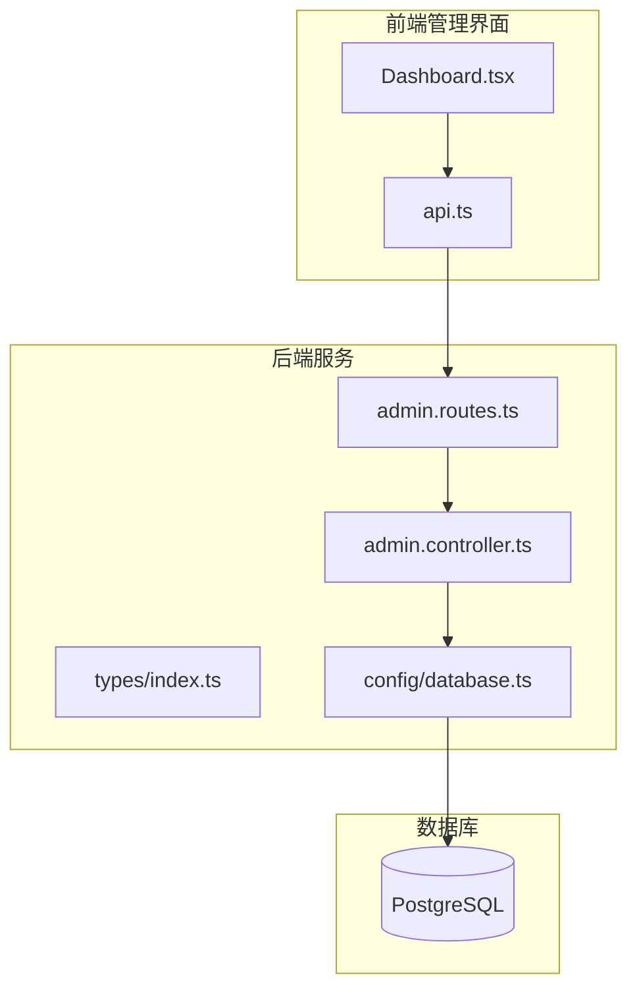
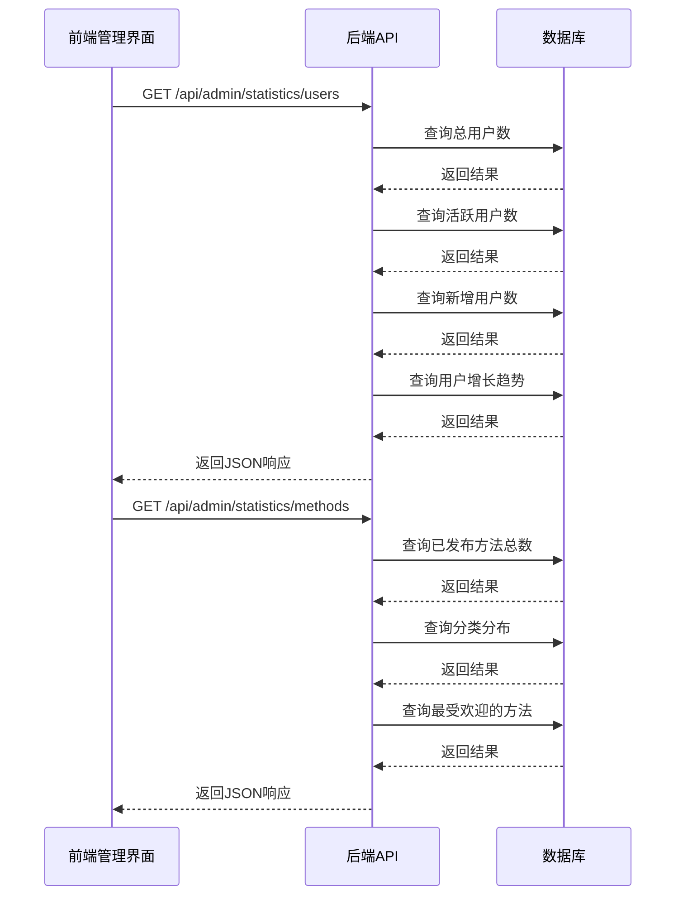
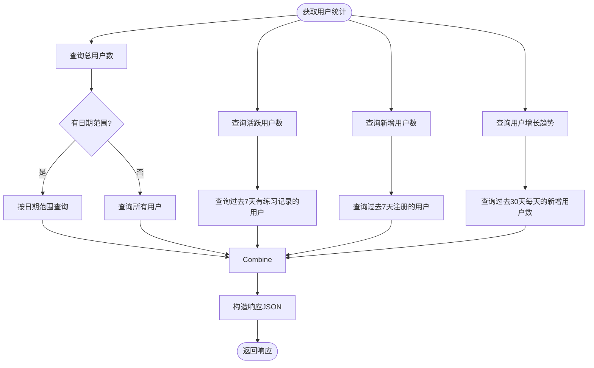
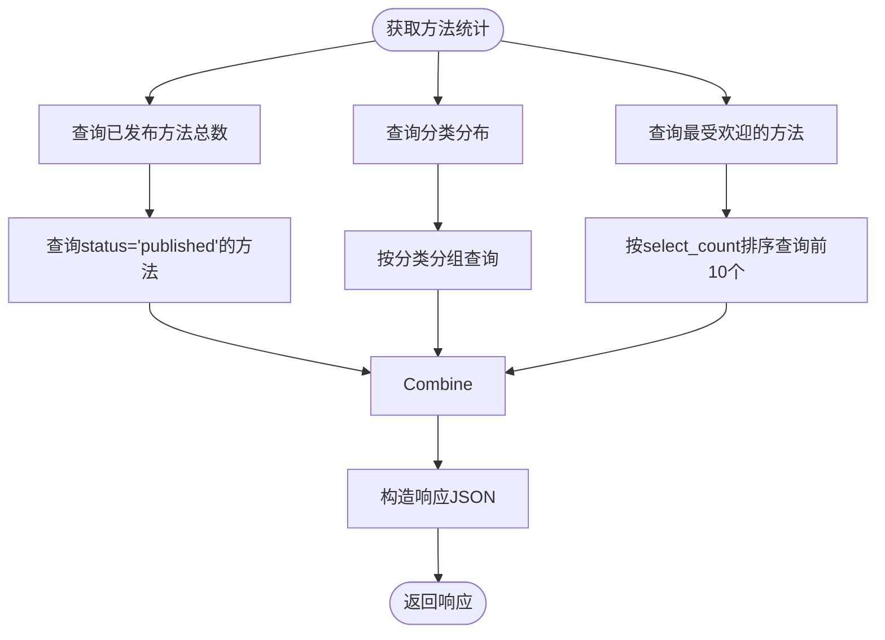

# 数据统计

<cite>
**本文档引用的文件**  
- [admin.routes.ts](file://backend/src/routes/admin.routes.ts)
- [admin.controller.ts](file://backend/src/controllers/admin.controller.ts)
- [types/index.ts](file://backend/src/types/index.ts)
- [init.sql](file://database/init.sql)
- [Dashboard.tsx](file://home/user/nian/admin-web/src/pages/Dashboard.tsx)
- [api.ts](file://home/user/nian/admin-web/src/services/api.ts)
</cite>

## 目录
1. [简介](#简介)
2. [项目结构](#项目结构)
3. [核心组件](#核心组件)
4. [架构概述](#架构概述)
5. [详细组件分析](#详细组件分析)
6. [依赖分析](#依赖分析)
7. [性能考虑](#性能考虑)
8. [故障排除指南](#故障排除指南)
9. [结论](#结论)
10. [附录](#附录)（如有必要）

## 简介
本文档详细介绍了nian项目中数据统计API的设计与实现。重点说明了管理员统计端点如何提供用户和方法的关键运营指标，帮助管理员全面了解平台的使用状况和内容表现。文档涵盖了`GET /api/admin/statistics/users`和`GET /api/admin/statistics/methods`两个核心端点的功能、查询参数、响应结构和实现逻辑。

## 项目结构
nian项目采用前后端分离的架构。后端使用Node.js和Express框架，前端管理界面使用React构建。数据统计功能主要在后端的`admin.controller.ts`中实现，通过`admin.routes.ts`暴露API端点。数据库使用PostgreSQL，其模式定义在`init.sql`文件中。



**图表来源**  
- [admin.routes.ts](file://backend/src/routes/admin.routes.ts#L1-L98)
- [admin.controller.ts](file://backend/src/controllers/admin.controller.ts#L1-L1428)
- [Dashboard.tsx](file://home/user/nian/admin-web/src/pages/Dashboard.tsx#L1-L107)

**章节来源**  
- [admin.routes.ts](file://backend/src/routes/admin.routes.ts#L1-L98)
- [admin.controller.ts](file://backend/src/controllers/admin.controller.ts#L1-L1428)

## 核心组件
数据统计功能的核心是`getUserStatistics`和`getMethodStatistics`两个控制器方法。它们分别从数据库中查询用户和方法的聚合数据，并以统一的JSON格式返回给前端。这些数据被用于管理后台的仪表盘，展示平台的关键运营指标。

**章节来源**  
- [admin.controller.ts](file://backend/src/controllers/admin.controller.ts#L389-L482)

## 架构概述
数据统计API的架构遵循典型的RESTful设计模式。前端通过HTTP GET请求访问统计端点，后端控制器处理请求，执行数据库查询，并返回JSON响应。数据库查询利用了PostgreSQL的聚合函数和视图来高效地计算统计指标。



**图表来源**  
- [admin.controller.ts](file://backend/src/controllers/admin.controller.ts#L389-L482)
- [admin.routes.ts](file://backend/src/routes/admin.routes.ts#L47-L50)

## 详细组件分析

### 用户统计分析
`GET /api/admin/statistics/users`端点提供用户相关的关键指标。它支持通过`start_date`和`end_date`查询参数来过滤特定时间范围内的用户数据。

#### 用户统计响应结构
```json
{
  "success": true,
  "data": {
    "total_users": 1500,
    "active_users": 320,
    "new_users": 45,
    "trend": [
      {"date": "2024-01-01", "count": 5},
      {"date": "2024-01-02", "count": 8},
      {"date": "2024-01-03", "count": 12}
    ]
  }
}
```

- `total_users`: 指定时间范围内的总用户数
- `active_users`: 过去7天内有练习记录的用户数
- `new_users`: 过去7天内注册的新用户数
- `trend`: 过去30天内每天的新增用户数，用于绘制增长趋势图



**图表来源**  
- [admin.controller.ts](file://backend/src/controllers/admin.controller.ts#L389-L435)

**章节来源**  
- [admin.controller.ts](file://backend/src/controllers/admin.controller.ts#L389-L435)
- [init.sql](file://database/init.sql#L5-L14)

### 方法统计分析
`GET /api/admin/statistics/methods`端点提供方法相关的统计数据，帮助管理员了解内容的受欢迎程度和分类分布。

#### 方法统计响应结构
```json
{
  "success": true,
  "data": {
    "total_methods": 25,
    "category_distribution": [
      {"category": "放松技巧", "count": 12},
      {"category": "认知调整", "count": 8},
      {"category": "情绪管理", "count": 5}
    ],
    "popular_methods": [
      {
        "id": 1,
        "title": "深呼吸放松法",
        "category": "放松技巧",
        "select_count": 150,
        "view_count": 320
      },
      {
        "id": 2,
        "title": "正念冥想",
        "category": "放松技巧",
        "select_count": 120,
        "view_count": 280
      }
    ]
  }
}
```

- `total_methods`: 已发布方法的总数
- `category_distribution`: 按分类统计的已发布方法数量
- `popular_methods`: 按选择次数排序的最受欢迎的10个方法



**图表来源**  
- [admin.controller.ts](file://backend/src/controllers/admin.controller.ts#L437-L467)

**章节来源**  
- [admin.controller.ts](file://backend/src/controllers/admin.controller.ts#L437-L467)
- [init.sql](file://database/init.sql#L20-L36)

### 统计查询参数
两个统计端点都支持灵活的查询参数，以便管理员获取特定时间范围内的数据。

| 参数 | 类型 | 描述 | 示例 |
|------|------|------|------|
| start_date | string | 开始日期（YYYY-MM-DD） | 2024-01-01 |
| end_date | string | 结束日期（YYYY-MM-DD） | 2024-01-31 |

当同时提供`start_date`和`end_date`时，统计结果将仅包含该时间范围内的数据。如果没有提供日期参数，则返回所有时间的数据。

**章节来源**  
- [admin.controller.ts](file://backend/src/controllers/admin.controller.ts#L391-L399)

## 依赖分析
数据统计功能依赖于多个组件和外部服务。后端控制器依赖于数据库连接池和类型定义，前端依赖于API客户端和服务。数据库模式中的视图（如`user_practice_stats`和`method_popularity`）为统计查询提供了优化的基础。

```mermaid
graph TD
A[getUserStatistics] --> B[pool]
A --> C[users表]
A --> D[practice_records表]
E[getMethodStatistics] --> B
E --> F[methods表]
G[Dashboard] --> H[getAdminStats]
H --> I[apiClient]
I --> J[/api/admin/statistics/*]
```

**图表来源**  
- [admin.controller.ts](file://backend/src/controllers/admin.controller.ts#L389-L482)
- [types/index.ts](file://backend/src/types/index.ts#L1-L126)
- [init.sql](file://database/init.sql#L1-L349)

**章节来源**  
- [admin.controller.ts](file://backend/src/controllers/admin.controller.ts#L1-L1428)
- [types/index.ts](file://backend/src/types/index.ts#L1-L126)

## 性能考虑
为了确保统计查询的性能，系统采用了多种优化策略。数据库查询使用了索引（如`idx_users_created_at`和`idx_methods_status`）来加速数据检索。对于复杂的统计需求，系统使用了数据库视图（如`user_practice_stats`）来预计算常用指标。此外，`select_count`和`view_count`等统计字段在方法表中直接存储，避免了实时计算的开销。

## 故障排除指南
如果统计API返回错误或数据不准确，请检查以下几点：
1. 确认管理员已正确登录并具有访问权限
2. 检查数据库连接是否正常
3. 验证查询参数的格式是否正确
4. 确认相关数据表中存在预期的数据

**章节来源**  
- [admin.controller.ts](file://backend/src/controllers/admin.controller.ts#L389-L482)
- [middleware/errorHandler.ts](file://backend/src/middleware/errorHandler.ts)

## 结论
nian项目的数据统计API为管理员提供了全面的平台运营洞察。通过`/api/admin/statistics/users`和`/api/admin/statistics/methods`端点，管理员可以监控用户增长、活跃度和内容表现，从而做出数据驱动的决策。API设计简洁明了，响应结构清晰，便于前端集成和展示。