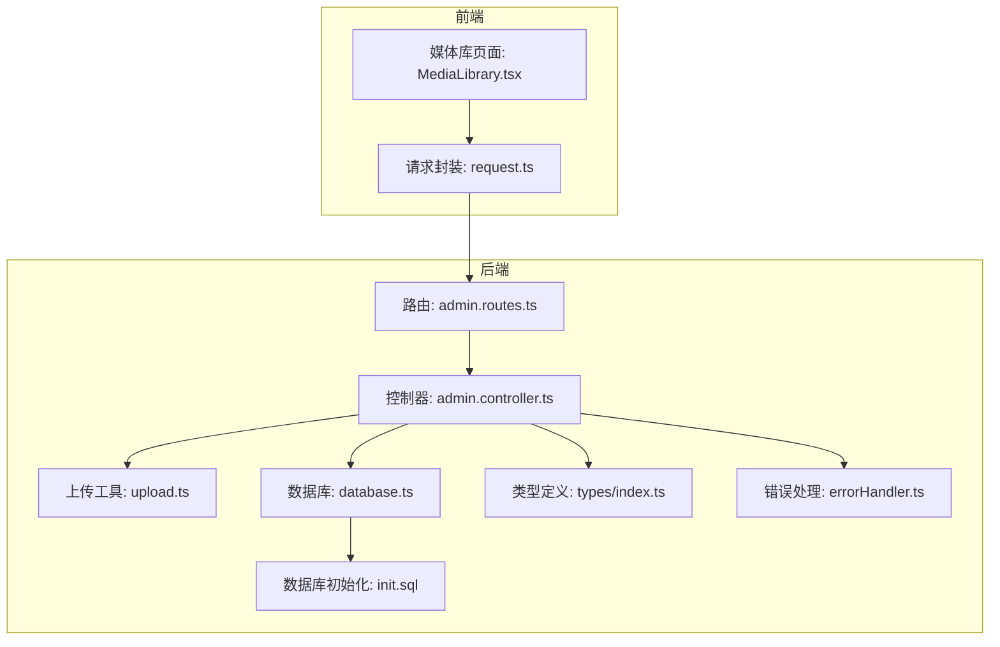
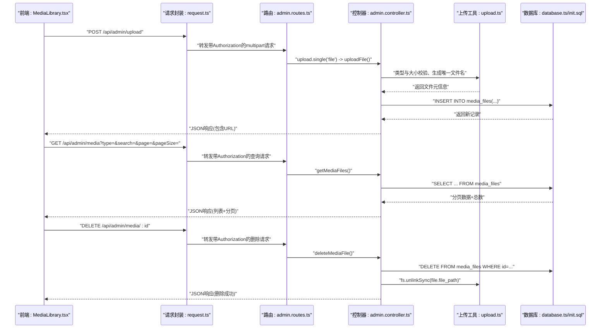
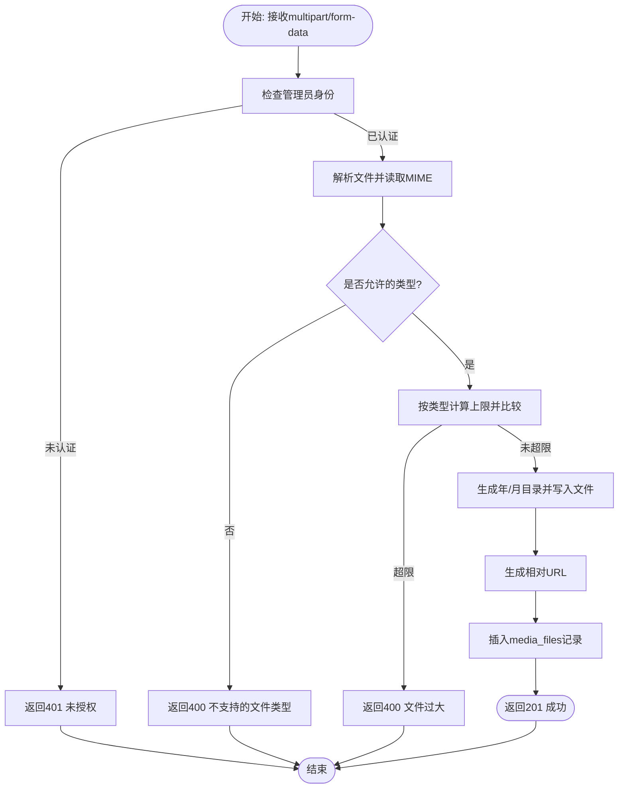
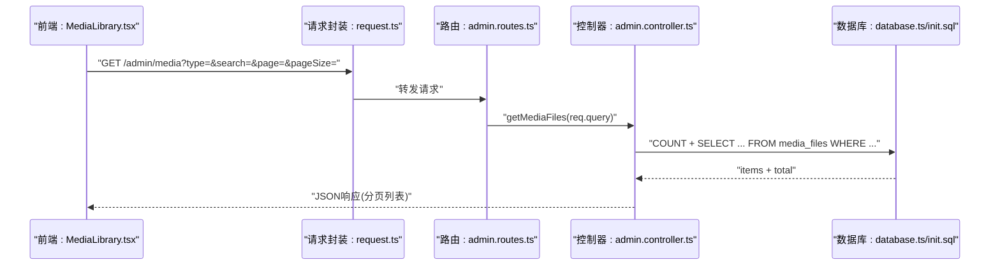
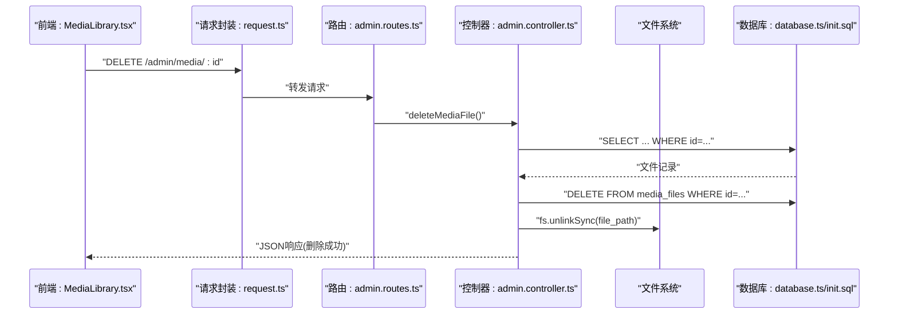
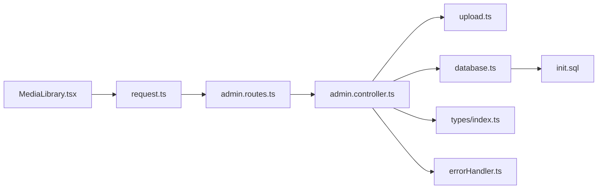
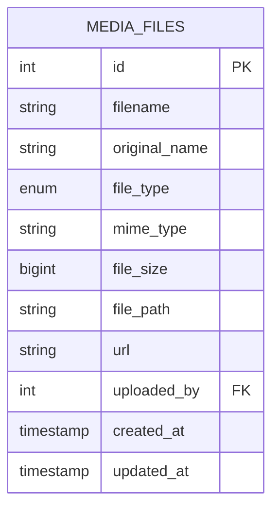

# 文件管理

<cite>
**本文引用的文件**
- [backend/src/routes/admin.routes.ts](file://backend/src/routes/admin.routes.ts)
- [backend/src/controllers/admin.controller.ts](file://backend/src/controllers/admin.controller.ts)
- [backend/src/utils/upload.ts](file://backend/src/utils/upload.ts)
- [backend/src/config/database.ts](file://backend/src/config/database.ts)
- [database/init.sql](file://database/init.sql)
- [backend/src/types/index.ts](file://backend/src/types/index.ts)
- [backend/src/middleware/errorHandler.ts](file://backend/src/middleware/errorHandler.ts)
- [home/user/nian/admin-web/src/pages/MediaLibrary.tsx](file://home/user/nian/admin-web/src/pages/MediaLibrary.tsx)
- [home/user/nian/admin-web/src/utils/request.ts](file://home/user/nian/admin-web/src/utils/request.ts)
</cite>

## 目录
1. [简介](#简介)
2. [项目结构](#项目结构)
3. [核心组件](#核心组件)
4. [架构总览](#架构总览)
5. [详细组件分析](#详细组件分析)
6. [依赖关系分析](#依赖关系分析)
7. [性能考量](#性能考量)
8. [故障排查指南](#故障排查指南)
9. [结论](#结论)
10. [附录](#附录)

## 简介
本文件面向nian项目的“文件上传与媒体管理”能力，围绕以下目标进行系统化说明：
- 详述POST /api/admin/upload的文件上传流程，包括支持的文件类型（图片、音频、视频）、大小限制与MIME类型校验策略。
- 解释上传后文件元信息如何写入media_files数据库表，并生成可访问URL。
- 说明GET /api/admin/media如何按类型与关键字检索分页列出媒体文件。
- 解释DELETE /api/admin/media/:id如何安全删除媒体文件（数据库记录与文件系统物理文件同步移除）。
- 提供上传表单构建示例与常见错误处理建议。

## 项目结构
后端采用Express + PostgreSQL + Redis的组合，文件上传与媒体管理由路由层、控制器层、工具层与数据库层协同完成；前端使用React + Ant Design在管理后台提供媒体库界面。

图表来源
- [backend/src/routes/admin.routes.ts](file://backend/src/routes/admin.routes.ts#L50-L55)
- [backend/src/controllers/admin.controller.ts](file://backend/src/controllers/admin.controller.ts#L469-L604)
- [backend/src/utils/upload.ts](file://backend/src/utils/upload.ts#L1-L128)
- [backend/src/config/database.ts](file://backend/src/config/database.ts#L1-L47)
- [database/init.sql](file://database/init.sql#L125-L143)
- [backend/src/types/index.ts](file://backend/src/types/index.ts#L112-L126)
- [backend/src/middleware/errorHandler.ts](file://backend/src/middleware/errorHandler.ts#L1-L97)
- [home/user/nian/admin-web/src/pages/MediaLibrary.tsx](file://home/user/nian/admin-web/src/pages/MediaLibrary.tsx#L127-L167)
- [home/user/nian/admin-web/src/utils/request.ts](file://home/user/nian/admin-web/src/utils/request.ts#L1-L40)

章节来源
- [backend/src/routes/admin.routes.ts](file://backend/src/routes/admin.routes.ts#L50-L55)
- [backend/src/controllers/admin.controller.ts](file://backend/src/controllers/admin.controller.ts#L469-L604)
- [backend/src/utils/upload.ts](file://backend/src/utils/upload.ts#L1-L128)
- [backend/src/config/database.ts](file://backend/src/config/database.ts#L1-L47)
- [database/init.sql](file://database/init.sql#L125-L143)
- [backend/src/types/index.ts](file://backend/src/types/index.ts#L112-L126)
- [backend/src/middleware/errorHandler.ts](file://backend/src/middleware/errorHandler.ts#L1-L97)
- [home/user/nian/admin-web/src/pages/MediaLibrary.tsx](file://home/user/nian/admin-web/src/pages/MediaLibrary.tsx#L127-L167)
- [home/user/nian/admin-web/src/utils/request.ts](file://home/user/nian/admin-web/src/utils/request.ts#L1-L40)

## 核心组件
- 路由层：定义/admin/upload、/admin/media等端点，绑定鉴权中间件与控制器。
- 控制器层：实现上传、列表查询、删除等业务逻辑。
- 上传工具层：负责Multer配置、文件类型与大小校验、文件命名、URL生成与物理删除。
- 数据库层：PostgreSQL连接池与Redis客户端，媒体表结构定义。
- 类型与错误处理：统一的响应结构与错误类，便于前后端一致处理。
- 前端媒体库：提供上传、预览、复制URL、删除、分页与筛选。

章节来源
- [backend/src/routes/admin.routes.ts](file://backend/src/routes/admin.routes.ts#L50-L55)
- [backend/src/controllers/admin.controller.ts](file://backend/src/controllers/admin.controller.ts#L469-L604)
- [backend/src/utils/upload.ts](file://backend/src/utils/upload.ts#L1-L128)
- [backend/src/config/database.ts](file://backend/src/config/database.ts#L1-L47)
- [database/init.sql](file://database/init.sql#L125-L143)
- [backend/src/types/index.ts](file://backend/src/types/index.ts#L112-L126)
- [backend/src/middleware/errorHandler.ts](file://backend/src/middleware/errorHandler.ts#L1-L97)
- [home/user/nian/admin-web/src/pages/MediaLibrary.tsx](file://home/user/nian/admin-web/src/pages/MediaLibrary.tsx#L127-L167)

## 架构总览
后端通过Express路由接收请求，经鉴权中间件后进入控制器；控制器调用上传工具完成文件校验与落盘，再写入数据库media_files表；前端通过Ant Design组件与Axios封装发起请求并展示结果。

图表来源
- [backend/src/routes/admin.routes.ts](file://backend/src/routes/admin.routes.ts#L50-L55)
- [backend/src/controllers/admin.controller.ts](file://backend/src/controllers/admin.controller.ts#L469-L604)
- [backend/src/utils/upload.ts](file://backend/src/utils/upload.ts#L1-L128)
- [backend/src/config/database.ts](file://backend/src/config/database.ts#L1-L47)
- [database/init.sql](file://database/init.sql#L125-L143)
- [home/user/nian/admin-web/src/pages/MediaLibrary.tsx](file://home/user/nian/admin-web/src/pages/MediaLibrary.tsx#L127-L167)
- [home/user/nian/admin-web/src/utils/request.ts](file://home/user/nian/admin-web/src/utils/request.ts#L1-L40)

## 详细组件分析

### 上传流程与规则
- 支持的文件类型
  - 图片：jpeg、jpg、png、gif、webp
  - 音频：mpeg/mp3、wav、m4a/x-m4a
  - 视频：mp4、webm、quicktime
- 大小限制
  - 图片：≤5MB
  - 音频：≤20MB
  - 视频：≤100MB
  - 通用最大值：100MB（由Multer全局限制）
- 存储位置
  - 采用年/月两级目录结构，确保磁盘分布均衡。
- 文件命名
  - 使用时间戳+随机数作为前缀，保留原始扩展名，避免同名冲突。
- URL生成
  - 基于文件物理路径生成相对URL，前端拼接基础地址即可访问。
- 数据库写入
  - 字段：filename、original_name、file_type、mime_type、file_size、file_path、url、uploaded_by。
  - file_type根据MIME前缀自动判定为image/audio/video。
- 错误处理
  - 非管理员上传：返回未授权。
  - 无文件或类型不被允许：返回参数错误。
  - 超过类型限制：返回文件过大。
  - 数据库写入异常：返回服务器错误。

图表来源
- [backend/src/utils/upload.ts](file://backend/src/utils/upload.ts#L27-L81)
- [backend/src/utils/upload.ts](file://backend/src/utils/upload.ts#L94-L128)
- [backend/src/controllers/admin.controller.ts](file://backend/src/controllers/admin.controller.ts#L472-L513)
- [database/init.sql](file://database/init.sql#L125-L143)

章节来源
- [backend/src/utils/upload.ts](file://backend/src/utils/upload.ts#L27-L81)
- [backend/src/utils/upload.ts](file://backend/src/utils/upload.ts#L94-L128)
- [backend/src/controllers/admin.controller.ts](file://backend/src/controllers/admin.controller.ts#L472-L513)
- [database/init.sql](file://database/init.sql#L125-L143)

### GET /api/admin/media 列表与过滤
- 查询参数
  - type: image/audio/video/all（默认all）
  - search: 模糊匹配filename或original_name
  - page/pageSize: 分页
- 返回结构
  - items: 列表项（包含uploaded_by_name）
  - total、page、pageSize、totalPages
- 数据库查询
  - 动态拼接WHERE条件，按创建时间倒序，LIMIT/OFFSET分页。
- 前端交互
  - 媒体库页面支持类型筛选与关键词搜索，分页控件联动。

图表来源
- [backend/src/routes/admin.routes.ts](file://backend/src/routes/admin.routes.ts#L52-L54)
- [backend/src/controllers/admin.controller.ts](file://backend/src/controllers/admin.controller.ts#L516-L573)
- [database/init.sql](file://database/init.sql#L125-L143)
- [home/user/nian/admin-web/src/pages/MediaLibrary.tsx](file://home/user/nian/admin-web/src/pages/MediaLibrary.tsx#L75-L99)

章节来源
- [backend/src/routes/admin.routes.ts](file://backend/src/routes/admin.routes.ts#L52-L54)
- [backend/src/controllers/admin.controller.ts](file://backend/src/controllers/admin.controller.ts#L516-L573)
- [database/init.sql](file://database/init.sql#L125-L143)
- [home/user/nian/admin-web/src/pages/MediaLibrary.tsx](file://home/user/nian/admin-web/src/pages/MediaLibrary.tsx#L75-L99)

### DELETE /api/admin/media/:id 删除
- 步骤
  1) 读取media_files记录确认存在
  2) 删除数据库记录
  3) 删除物理文件（fs.unlinkSync）
  4) 返回成功响应
- 安全性
  - 仅管理员可调用（路由层已鉴权）
  - 不存在时返回404
  - 物理删除失败不影响数据库回滚（需注意一致性）

图表来源
- [backend/src/routes/admin.routes.ts](file://backend/src/routes/admin.routes.ts#L53-L55)
- [backend/src/controllers/admin.controller.ts](file://backend/src/controllers/admin.controller.ts#L576-L604)
- [database/init.sql](file://database/init.sql#L125-L143)
- [home/user/nian/admin-web/src/pages/MediaLibrary.tsx](file://home/user/nian/admin-web/src/pages/MediaLibrary.tsx#L169-L178)

章节来源
- [backend/src/routes/admin.routes.ts](file://backend/src/routes/admin.routes.ts#L53-L55)
- [backend/src/controllers/admin.controller.ts](file://backend/src/controllers/admin.controller.ts#L576-L604)
- [database/init.sql](file://database/init.sql#L125-L143)
- [home/user/nian/admin-web/src/pages/MediaLibrary.tsx](file://home/user/nian/admin-web/src/pages/MediaLibrary.tsx#L169-L178)

### 上传表单构建示例与最佳实践
- 表单要素
  - 单文件上传字段名为file
  - Content-Type: multipart/form-data
  - 需携带Authorization: Bearer <token>
- 前端示例要点（基于媒体库页面）
  - 使用Ant Design Upload组件，设置action为/admin/upload
  - beforeUpload中执行类型与大小二次校验（与后端保持一致）
  - 上传完成后刷新列表与统计
- 后端路由绑定
  - 路由使用upload.single('file')中间件，再调用uploadFile控制器

章节来源
- [home/user/nian/admin-web/src/pages/MediaLibrary.tsx](file://home/user/nian/admin-web/src/pages/MediaLibrary.tsx#L127-L167)
- [backend/src/routes/admin.routes.ts](file://backend/src/routes/admin.routes.ts#L52-L52)
- [backend/src/controllers/admin.controller.ts](file://backend/src/controllers/admin.controller.ts#L472-L513)
- [backend/src/utils/upload.ts](file://backend/src/utils/upload.ts#L27-L81)

## 依赖关系分析
- 路由依赖控制器与中间件（鉴权），控制器依赖上传工具与数据库连接池。
- 上传工具依赖Multer、文件系统与自定义错误类。
- 数据库层依赖PostgreSQL连接池与Redis客户端。
- 前端依赖Axios拦截器自动注入token并处理401跳转。

图表来源
- [backend/src/routes/admin.routes.ts](file://backend/src/routes/admin.routes.ts#L50-L55)
- [backend/src/controllers/admin.controller.ts](file://backend/src/controllers/admin.controller.ts#L469-L604)
- [backend/src/utils/upload.ts](file://backend/src/utils/upload.ts#L1-L128)
- [backend/src/config/database.ts](file://backend/src/config/database.ts#L1-L47)
- [database/init.sql](file://database/init.sql#L125-L143)
- [backend/src/types/index.ts](file://backend/src/types/index.ts#L112-L126)
- [backend/src/middleware/errorHandler.ts](file://backend/src/middleware/errorHandler.ts#L1-L97)
- [home/user/nian/admin-web/src/pages/MediaLibrary.tsx](file://home/user/nian/admin-web/src/pages/MediaLibrary.tsx#L127-L167)
- [home/user/nian/admin-web/src/utils/request.ts](file://home/user/nian/admin-web/src/utils/request.ts#L1-L40)

章节来源
- [backend/src/routes/admin.routes.ts](file://backend/src/routes/admin.routes.ts#L50-L55)
- [backend/src/controllers/admin.controller.ts](file://backend/src/controllers/admin.controller.ts#L469-L604)
- [backend/src/utils/upload.ts](file://backend/src/utils/upload.ts#L1-L128)
- [backend/src/config/database.ts](file://backend/src/config/database.ts#L1-L47)
- [database/init.sql](file://database/init.sql#L125-L143)
- [backend/src/types/index.ts](file://backend/src/types/index.ts#L112-L126)
- [backend/src/middleware/errorHandler.ts](file://backend/src/middleware/errorHandler.ts#L1-L97)
- [home/user/nian/admin-web/src/pages/MediaLibrary.tsx](file://home/user/nian/admin-web/src/pages/MediaLibrary.tsx#L127-L167)
- [home/user/nian/admin-web/src/utils/request.ts](file://home/user/nian/admin-web/src/utils/request.ts#L1-L40)

## 性能考量
- 存储分层
  - 年/月目录结构有助于分散磁盘I/O热点，提升大规模文件场景的稳定性。
- 上传并发
  - Multer默认单文件上传，若需要批量上传建议在前端聚合或后端引入队列。
- 数据库索引
  - media_files对file_type、uploaded_by、created_at建有索引，有利于按类型与时间排序查询。
- 前端渲染
  - 列表分页加载，预览时按需请求资源，避免一次性加载过多媒体导致卡顿。

[本节为通用指导，无需列出具体文件来源]

## 故障排查指南
- 常见错误码与含义
  - 400 VALIDATION_ERROR/INVALID_FILE_TYPE/FILE_TOO_LARGE：参数缺失、类型不被允许、超出大小限制
  - 400 AUTH_FAILED：未登录或非管理员
  - 404 NOT_FOUND：媒体文件不存在
  - 500 SERVER_ERROR：服务器内部错误
- 排查步骤
  - 检查Authorization头是否正确传递
  - 确认文件类型与大小是否符合要求
  - 查看数据库media_files是否存在对应记录
  - 检查文件系统路径是否存在且可读写
  - 查看后端日志定位异常堆栈
- 建议
  - 前端在beforeUpload中做二次校验，减少无效请求
  - 对于视频等大文件，建议提供进度条与断点续传方案（当前实现未包含）

章节来源
- [backend/src/middleware/errorHandler.ts](file://backend/src/middleware/errorHandler.ts#L1-L97)
- [backend/src/controllers/admin.controller.ts](file://backend/src/controllers/admin.controller.ts#L472-L604)
- [backend/src/utils/upload.ts](file://backend/src/utils/upload.ts#L27-L81)

## 结论
nian项目的文件上传与媒体管理功能具备清晰的职责划分：路由层负责入口与鉴权，控制器层承载业务逻辑，上传工具层统一处理类型、大小、命名与URL生成，数据库层以media_files表承载元数据。前端媒体库页面提供了完整的上传、浏览、筛选、删除与预览体验。整体设计简洁可靠，易于扩展与维护。

[本节为总结性内容，无需列出具体文件来源]

## 附录

### API定义与参数
- POST /api/admin/upload
  - 请求体：multipart/form-data，字段file
  - 成功响应：包含media_files记录（含url）
- GET /api/admin/media
  - 查询参数：type、search、page、pageSize
  - 成功响应：items、total、page、pageSize、totalPages
- DELETE /api/admin/media/:id
  - 路径参数：id
  - 成功响应：删除成功消息

章节来源
- [backend/src/routes/admin.routes.ts](file://backend/src/routes/admin.routes.ts#L52-L55)
- [backend/src/controllers/admin.controller.ts](file://backend/src/controllers/admin.controller.ts#L472-L604)
- [database/init.sql](file://database/init.sql#L125-L143)

### 数据模型（media_files）

图表来源
- [database/init.sql](file://database/init.sql#L125-L143)