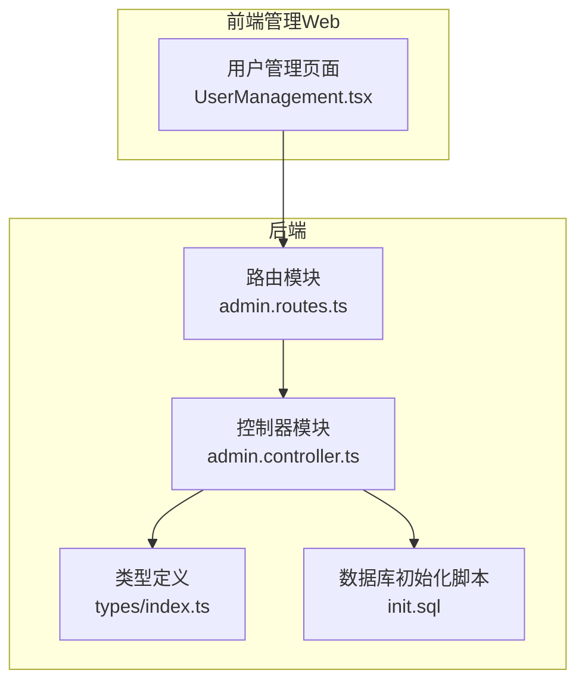
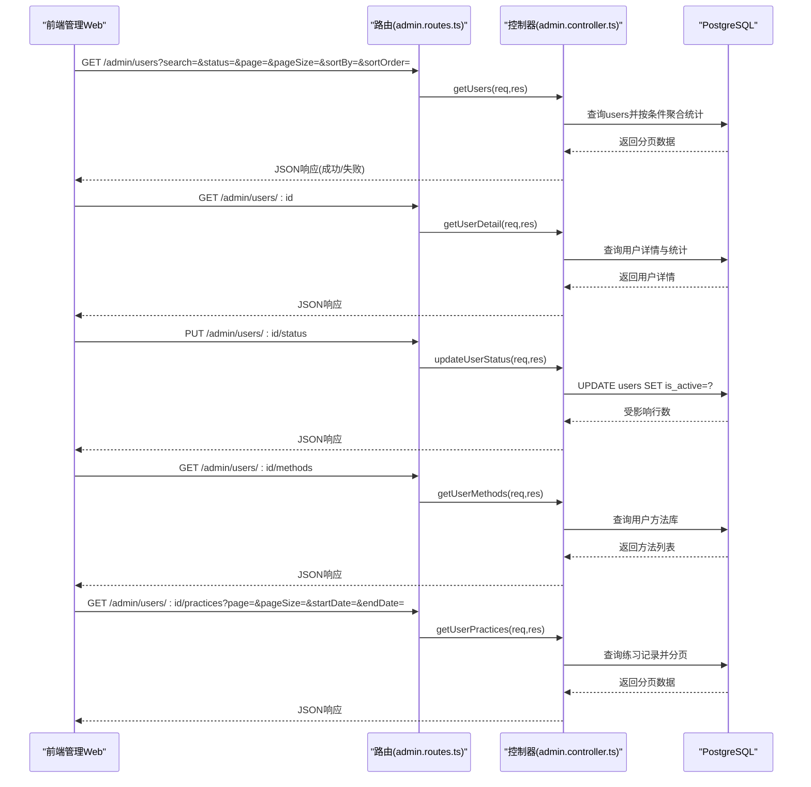
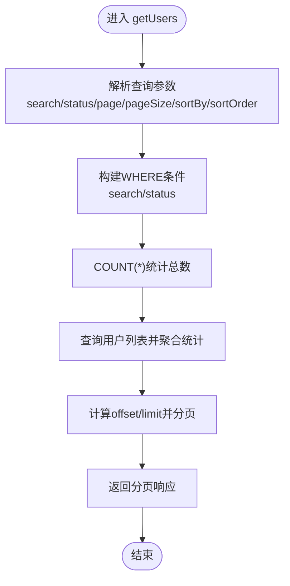
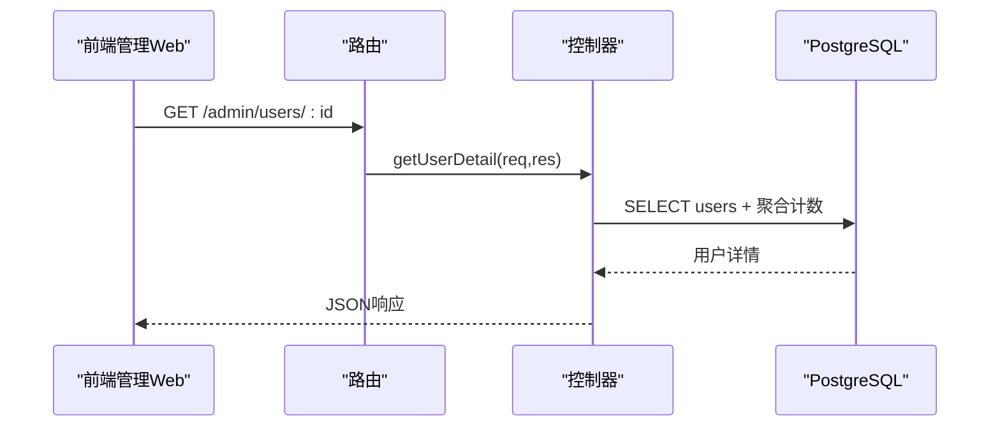
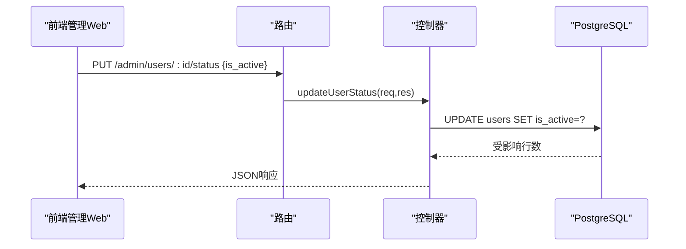
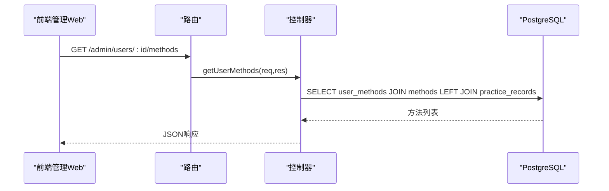
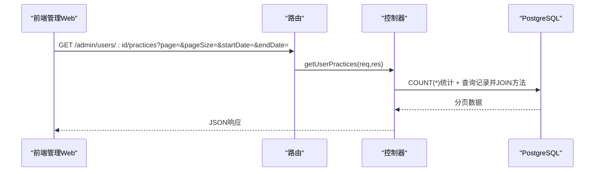
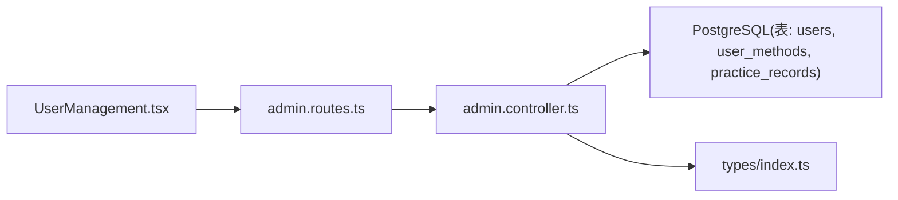
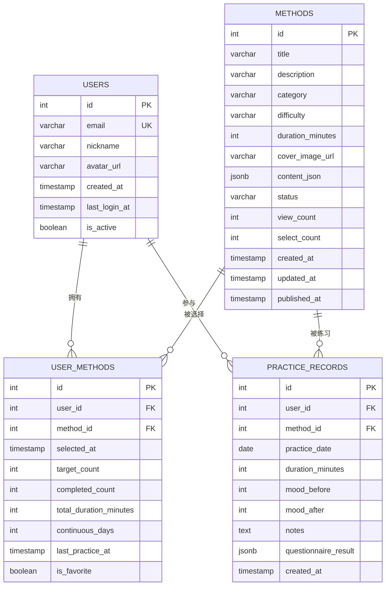

# 用户管理

<cite>
**本文引用的文件**
- [backend/src/controllers/admin.controller.ts](file://backend/src/controllers/admin.controller.ts)
- [backend/src/routes/admin.routes.ts](file://backend/src/routes/admin.routes.ts)
- [backend/src/types/index.ts](file://backend/src/types/index.ts)
- [database/init.sql](file://database/init.sql)
- [home/user/nian/admin-web/src/pages/UserManagement.tsx](file://home/user/nian/admin-web/src/pages/UserManagement.tsx)
</cite>

## 目录
1. [简介](#简介)
2. [项目结构](#项目结构)
3. [核心组件](#核心组件)
4. [架构总览](#架构总览)
5. [详细组件分析](#详细组件分析)
6. [依赖关系分析](#依赖关系分析)
7. [性能考虑](#性能考虑)
8. [故障排查指南](#故障排查指南)
9. [结论](#结论)
10. [附录](#附录)

## 简介
本文件面向 nian 项目的“用户管理”功能，围绕以下后端接口进行深入说明：
- GET /api/admin/users：获取用户列表，支持搜索、状态过滤与分页
- GET /api/admin/users/:id：获取指定用户详情，返回基础信息与统计指标
- PUT /api/admin/users/:id/status：更新用户状态（激活/禁用）
- GET /api/admin/users/:id/methods：获取用户的个性化方法库
- GET /api/admin/users/:id/practices：获取用户的练习记录，支持日期范围与分页

同时结合数据库表结构与前端管理界面，解释各接口的请求参数、响应结构及典型使用场景。

## 项目结构
后端采用 Express + PostgreSQL 架构，控制器负责处理业务逻辑，路由定义 REST 接口；前端管理 Web 使用 Ant Design 组件展示用户列表、详情与统计。

图表来源
- [backend/src/routes/admin.routes.ts](file://backend/src/routes/admin.routes.ts#L60-L67)
- [backend/src/controllers/admin.controller.ts](file://backend/src/controllers/admin.controller.ts#L751-L816)
- [backend/src/types/index.ts](file://backend/src/types/index.ts#L1-L126)
- [database/init.sql](file://database/init.sql#L1-L140)
- [home/user/nian/admin-web/src/pages/UserManagement.tsx](file://home/user/nian/admin-web/src/pages/UserManagement.tsx#L90-L141)

章节来源
- [backend/src/routes/admin.routes.ts](file://backend/src/routes/admin.routes.ts#L60-L67)
- [backend/src/controllers/admin.controller.ts](file://backend/src/controllers/admin.controller.ts#L751-L816)
- [backend/src/types/index.ts](file://backend/src/types/index.ts#L1-L126)
- [database/init.sql](file://database/init.sql#L1-L140)
- [home/user/nian/admin-web/src/pages/UserManagement.tsx](file://home/user/nian/admin-web/src/pages/UserManagement.tsx#L90-L141)

## 核心组件
- 路由层：在 admin.routes.ts 中定义了用户管理相关接口，均受管理员鉴权保护。
- 控制器层：admin.controller.ts 实现了用户列表查询、详情查询、状态更新、用户方法库与练习记录查询等逻辑。
- 类型定义：types/index.ts 定义了用户、方法、练习记录等核心类型，确保前后端契约一致。
- 数据库：init.sql 定义了 users、user_methods、practice_records 等关键表及其索引，支撑用户管理功能。

章节来源
- [backend/src/routes/admin.routes.ts](file://backend/src/routes/admin.routes.ts#L60-L67)
- [backend/src/controllers/admin.controller.ts](file://backend/src/controllers/admin.controller.ts#L751-L816)
- [backend/src/types/index.ts](file://backend/src/types/index.ts#L1-L126)
- [database/init.sql](file://database/init.sql#L1-L140)

## 架构总览
后端接口调用链路如下：前端管理 Web 通过 HTTP 请求访问 /admin/* 路由，路由层将请求转发至对应控制器，控制器基于数据库连接池执行 SQL 查询，最终返回统一格式的响应。

图表来源
- [backend/src/routes/admin.routes.ts](file://backend/src/routes/admin.routes.ts#L60-L67)
- [backend/src/controllers/admin.controller.ts](file://backend/src/controllers/admin.controller.ts#L751-L816)
- [backend/src/controllers/admin.controller.ts](file://backend/src/controllers/admin.controller.ts#L818-L864)
- [backend/src/controllers/admin.controller.ts](file://backend/src/controllers/admin.controller.ts#L866-L947)

## 详细组件分析

### GET /api/admin/users：用户列表（搜索、状态过滤、分页）
- 功能概述
  - 支持关键词搜索（邮箱或昵称模糊匹配）、状态筛选（激活/禁用）、排序字段与顺序、分页参数。
  - 返回每条用户记录的收藏方法数与练习次数，便于快速掌握用户活跃度。
- 请求参数
  - 查询字符串：
    - search：关键词（邮箱或昵称）
    - status：all/active/inactive
    - page：页码，默认 1
    - pageSize：每页条数，默认 20
    - sortBy：排序字段，支持 created_at/last_login_at/method_count/practice_count
    - sortOrder：排序顺序，desc/asc
- 响应结构
  - data.items：用户列表，包含基础信息与统计字段
  - data.total/page/pageSize：分页元信息
- 处理逻辑要点
  - 动态拼接 WHERE 条件与 ORDER 子句，分别统计总数与查询数据，避免重复扫描。
  - 使用 LEFT JOIN 聚合计数，保证即使无方法或练习记录也能返回 0。
- 性能建议
  - 建议为 users 表的 email、created_at 等常用过滤/排序列建立索引（数据库脚本已包含基础索引）。

图表来源
- [backend/src/controllers/admin.controller.ts](file://backend/src/controllers/admin.controller.ts#L751-L816)
- [database/init.sql](file://database/init.sql#L1-L18)

章节来源
- [backend/src/controllers/admin.controller.ts](file://backend/src/controllers/admin.controller.ts#L751-L816)
- [database/init.sql](file://database/init.sql#L1-L18)
- [home/user/nian/admin-web/src/pages/UserManagement.tsx](file://home/user/nian/admin-web/src/pages/UserManagement.tsx#L90-L116)

### GET /api/admin/users/:id：用户详情（基础信息+统计）
- 功能概述
  - 返回用户的基础信息（ID、邮箱、昵称、头像、注册时间、最后登录时间、状态）以及统计指标：
    - method_count：收藏/选择的方法数
    - practice_count：练习次数
    - total_practice_duration：总练习时长（分钟）
    - avg_mood_improvement：平均心情改善值
- 请求参数
  - 路径参数：id（用户ID）
- 响应结构
  - data：单个用户对象，包含上述字段
- 处理逻辑要点
  - 使用 LEFT JOIN 聚合统计，COALESCE 处理空值，确保数值字段稳定输出。

图表来源
- [backend/src/routes/admin.routes.ts](file://backend/src/routes/admin.routes.ts#L62-L62)
- [backend/src/controllers/admin.controller.ts](file://backend/src/controllers/admin.controller.ts#L818-L864)
- [database/init.sql](file://database/init.sql#L1-L140)

章节来源
- [backend/src/controllers/admin.controller.ts](file://backend/src/controllers/admin.controller.ts#L818-L864)
- [database/init.sql](file://database/init.sql#L1-L140)
- [home/user/nian/admin-web/src/pages/UserManagement.tsx](file://home/user/nian/admin-web/src/pages/UserManagement.tsx#L118-L141)

### PUT /api/admin/users/:id/status：更新用户状态
- 功能概述
  - 将用户状态切换为激活或禁用，用于封禁/解封账户。
- 请求参数
  - 路径参数：id（用户ID）
  - 请求体：{ is_active: boolean }
- 响应结构
  - 成功返回通用成功响应
- 处理逻辑要点
  - 校验 is_active 字段存在性，防止误传。
  - 直接 UPDATE users 表对应字段。

图表来源
- [backend/src/routes/admin.routes.ts](file://backend/src/routes/admin.routes.ts#L64-L64)
- [backend/src/controllers/admin.controller.ts](file://backend/src/controllers/admin.controller.ts#L846-L864)

章节来源
- [backend/src/controllers/admin.controller.ts](file://backend/src/controllers/admin.controller.ts#L846-L864)
- [home/user/nian/admin-web/src/pages/UserManagement.tsx](file://home/user/nian/admin-web/src/pages/UserManagement.tsx#L149-L157)

### GET /api/admin/users/:id/methods：用户个性化方法库
- 功能概述
  - 返回用户已选择/收藏的方法列表，包含方法名称、分类、难度、练习次数等。
- 请求参数
  - 路径参数：id（用户ID）
- 响应结构
  - data：方法列表数组
- 处理逻辑要点
  - JOIN methods 获取方法元信息，LEFT JOIN practice_records 统计该用户对某方法的练习次数。
  - 按选择时间倒序排列。

图表来源
- [backend/src/routes/admin.routes.ts](file://backend/src/routes/admin.routes.ts#L65-L65)
- [backend/src/controllers/admin.controller.ts](file://backend/src/controllers/admin.controller.ts#L866-L906)
- [database/init.sql](file://database/init.sql#L43-L75)

章节来源
- [backend/src/controllers/admin.controller.ts](file://backend/src/controllers/admin.controller.ts#L866-L906)
- [database/init.sql](file://database/init.sql#L43-L75)
- [home/user/nian/admin-web/src/pages/UserManagement.tsx](file://home/user/nian/admin-web/src/pages/UserManagement.tsx#L121-L135)

### GET /api/admin/users/:id/practices：用户练习记录（分页+日期过滤）
- 功能概述
  - 返回用户的练习记录，支持按日期范围过滤与分页。
- 请求参数
  - 路径参数：id（用户ID）
  - 查询字符串：
    - page/pageSize：分页
    - startDate/endDate：日期范围过滤
- 响应结构
  - data.items：练习记录列表
  - data.total/page/pageSize：分页元信息
- 处理逻辑要点
  - 动态拼接 WHERE 条件，先 COUNT 再 LIMIT/OFFSET 查询，保证分页一致性。
  - JOIN methods 获取方法名称，便于展示。

图表来源
- [backend/src/routes/admin.routes.ts](file://backend/src/routes/admin.routes.ts#L66-L66)
- [backend/src/controllers/admin.controller.ts](file://backend/src/controllers/admin.controller.ts#L888-L947)
- [database/init.sql](file://database/init.sql#L63-L75)

章节来源
- [backend/src/controllers/admin.controller.ts](file://backend/src/controllers/admin.controller.ts#L888-L947)
- [database/init.sql](file://database/init.sql#L63-L75)
- [home/user/nian/admin-web/src/pages/UserManagement.tsx](file://home/user/nian/admin-web/src/pages/UserManagement.tsx#L121-L135)

## 依赖关系分析
- 路由到控制器
  - admin.routes.ts 将 /admin/users、/admin/users/:id、/admin/users/:id/status、/admin/users/:id/methods、/admin/users/:id/practices 映射到对应控制器函数。
- 控制器到数据库
  - admin.controller.ts 通过连接池执行 SQL 查询，涉及 users、user_methods、practice_records 等表。
- 类型约束
  - types/index.ts 定义了用户、方法、练习记录等类型，确保控制器返回结构与前端消费一致。
- 前端调用
  - UserManagement.tsx 发起 GET /admin/users 列表请求，以及 GET /admin/users/:id、/admin/users/:id/methods、/admin/users/:id/practices 的详情与明细请求。

图表来源
- [backend/src/routes/admin.routes.ts](file://backend/src/routes/admin.routes.ts#L60-L67)
- [backend/src/controllers/admin.controller.ts](file://backend/src/controllers/admin.controller.ts#L751-L947)
- [backend/src/types/index.ts](file://backend/src/types/index.ts#L1-L126)
- [database/init.sql](file://database/init.sql#L1-L140)
- [home/user/nian/admin-web/src/pages/UserManagement.tsx](file://home/user/nian/admin-web/src/pages/UserManagement.tsx#L90-L141)

章节来源
- [backend/src/routes/admin.routes.ts](file://backend/src/routes/admin.routes.ts#L60-L67)
- [backend/src/controllers/admin.controller.ts](file://backend/src/controllers/admin.controller.ts#L751-L947)
- [backend/src/types/index.ts](file://backend/src/types/index.ts#L1-L126)
- [database/init.sql](file://database/init.sql#L1-L140)
- [home/user/nian/admin-web/src/pages/UserManagement.tsx](file://home/user/nian/admin-web/src/pages/UserManagement.tsx#L90-L141)

## 性能考虑
- 索引优化
  - users 表已具备 email、created_at 等索引，建议根据实际查询热点增加复合索引（如按状态+创建时间、按状态+最后登录时间）。
  - user_methods 与 practice_records 已具备常用索引，可进一步评估是否需要复合索引以覆盖高频过滤条件。
- 查询优化
  - 列表与详情接口均采用 LEFT JOIN 聚合计数，避免多次往返数据库。
  - 分页查询先 COUNT 再 LIMIT/OFFSET，确保分页准确性。
- 前端交互
  - 列表支持多字段排序与筛选，建议在前端缓存分页状态，减少不必要的重复请求。

[本节为通用指导，无需列出具体文件来源]

## 故障排查指南
- 常见错误与定位
  - 参数缺失：如 PUT /admin/users/:id/status 缺少 is_active 字段会触发校验错误。
  - 用户不存在：GET /admin/users/:id 在用户不存在时返回“未找到”错误。
  - 认证失败：未登录或令牌无效会导致 401/403。
- 建议排查步骤
  - 检查路由是否正确映射到控制器函数。
  - 核对数据库连接与表结构是否与类型定义一致。
  - 查看控制器中的条件拼接与参数绑定是否正确。
  - 结合前端请求参数与响应，确认排序字段与分页参数是否符合预期。

章节来源
- [backend/src/controllers/admin.controller.ts](file://backend/src/controllers/admin.controller.ts#L846-L864)
- [backend/src/controllers/admin.controller.ts](file://backend/src/controllers/admin.controller.ts#L818-L864)
- [backend/src/controllers/admin.controller.ts](file://backend/src/controllers/admin.controller.ts#L888-L947)

## 结论
nian 项目的用户管理功能通过清晰的路由-控制器-数据库三层结构实现了完整的用户生命周期管理能力：列表检索、详情统计、状态变更、方法库与练习记录查询。配合前端管理界面，管理员可以高效地监控与运营用户数据。后续可在索引与查询层面持续优化，以提升大规模数据下的响应性能。

[本节为总结性内容，无需列出具体文件来源]

## 附录

### 数据模型概览（与用户管理相关）

图表来源
- [database/init.sql](file://database/init.sql#L1-L140)

### 响应数据字段说明（与用户管理相关）
- 用户列表项
  - id、email、nickname、avatar_url、created_at、last_login_at、is_active、method_count、practice_count
- 用户详情
  - 在列表项基础上，新增 total_practice_duration、avg_mood_improvement
- 用户方法库
  - 包含方法元信息（title/category/difficulty）与练习次数
- 用户练习记录
  - 包含方法名、练习日期、时长、心情前后值、备注等

章节来源
- [backend/src/controllers/admin.controller.ts](file://backend/src/controllers/admin.controller.ts#L751-L816)
- [backend/src/controllers/admin.controller.ts](file://backend/src/controllers/admin.controller.ts#L818-L864)
- [backend/src/controllers/admin.controller.ts](file://backend/src/controllers/admin.controller.ts#L866-L947)
- [backend/src/types/index.ts](file://backend/src/types/index.ts#L1-L126)