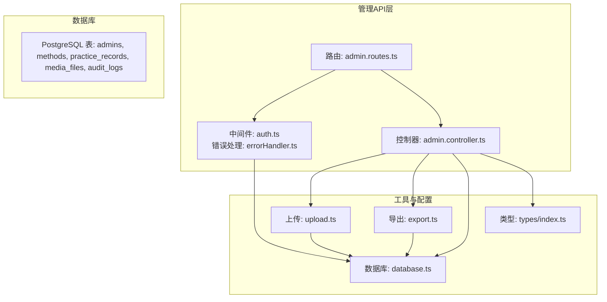
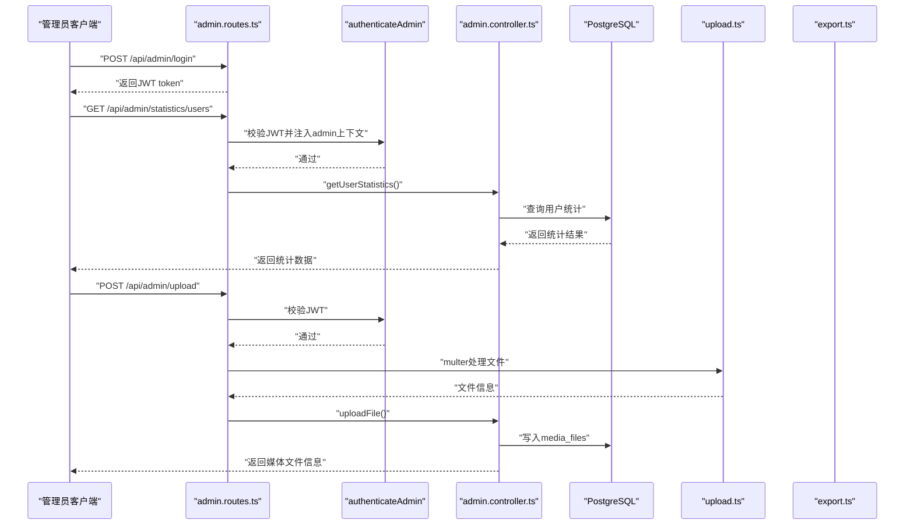
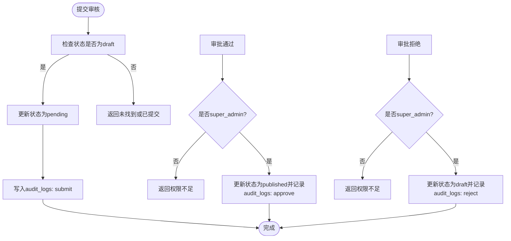
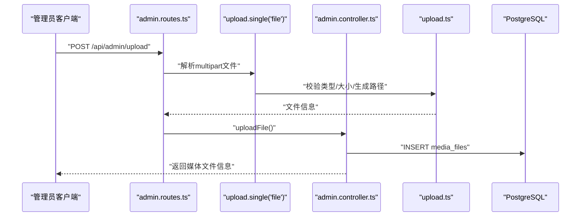
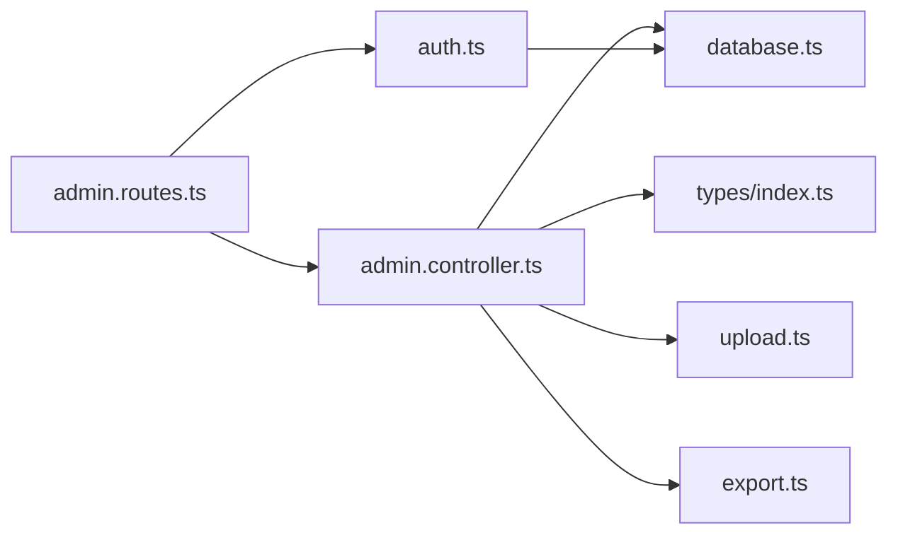

# 管理API

<cite>
**本文引用的文件**
- [backend/src/controllers/admin.controller.ts](file://backend/src/controllers/admin.controller.ts)
- [backend/src/middleware/auth.ts](file://backend/src/middleware/auth.ts)
- [backend/src/routes/admin.routes.ts](file://backend/src/routes/admin.routes.ts)
- [backend/src/utils/upload.ts](file://backend/src/utils/upload.ts)
- [backend/src/utils/export.ts](file://backend/src/utils/export.ts)
- [backend/src/types/index.ts](file://backend/src/types/index.ts)
- [backend/src/config/database.ts](file://backend/src/config/database.ts)
- [backend/src/middleware/errorHandler.ts](file://backend/src/middleware/errorHandler.ts)
- [database/init.sql](file://database/init.sql)
</cite>

## 目录
1. [简介](#简介)
2. [项目结构](#项目结构)
3. [核心组件](#核心组件)
4. [架构总览](#架构总览)
5. [详细组件分析](#详细组件分析)
6. [依赖关系分析](#依赖关系分析)
7. [性能考量](#性能考量)
8. [故障排查指南](#故障排查指南)
9. [结论](#结论)
10. [附录](#附录)

## 简介
本文件面向nian项目管理后台API，提供全面的技术与使用说明，覆盖管理员登录、内容管理（方法）、用户管理、数据统计、文件上传与媒体管理、数据导出等能力。所有管理API（除登录外）均需通过管理员认证中间件进行鉴权，采用JWT令牌承载管理员身份与角色信息。本文同时给出POST /api/admin/login的认证机制说明、方法管理的CRUD与审核流程、用户管理接口的查询与状态变更、统计数据指标说明、文件上传与媒体管理策略、数据导出的CSV/Excel/JSON生成与下载机制，并提供完整的管理操作流程示例。

## 项目结构
后端采用Express + TypeScript + PostgreSQL + Redis，管理API集中在admin模块，路由统一由admin.routes.ts挂载，控制器集中处理业务逻辑，中间件负责认证与错误处理，工具模块提供文件上传与导出能力，类型定义确保前后端契约一致。

图表来源
- [backend/src/routes/admin.routes.ts](file://backend/src/routes/admin.routes.ts#L1-L98)
- [backend/src/middleware/auth.ts](file://backend/src/middleware/auth.ts#L1-L87)
- [backend/src/controllers/admin.controller.ts](file://backend/src/controllers/admin.controller.ts#L1-L1428)
- [backend/src/utils/upload.ts](file://backend/src/utils/upload.ts#L1-L128)
- [backend/src/utils/export.ts](file://backend/src/utils/export.ts#L1-L130)
- [backend/src/config/database.ts](file://backend/src/config/database.ts#L1-L47)
- [database/init.sql](file://database/init.sql#L71-L141)

章节来源
- [backend/src/routes/admin.routes.ts](file://backend/src/routes/admin.routes.ts#L1-L98)
- [backend/src/controllers/admin.controller.ts](file://backend/src/controllers/admin.controller.ts#L1-L1428)
- [backend/src/middleware/auth.ts](file://backend/src/middleware/auth.ts#L1-L87)
- [backend/src/utils/upload.ts](file://backend/src/utils/upload.ts#L1-L128)
- [backend/src/utils/export.ts](file://backend/src/utils/export.ts#L1-L130)
- [backend/src/config/database.ts](file://backend/src/config/database.ts#L1-L47)
- [database/init.sql](file://database/init.sql#L71-L141)

## 核心组件
- 管理员认证中间件：提供JWT校验与管理员身份注入，确保除登录外的所有管理API均受保护。
- 管理控制器：集中实现方法管理、用户管理、统计、媒体与导出等业务逻辑。
- 路由定义：统一挂载管理API，按资源分组组织，便于维护与扩展。
- 上传与导出工具：封装文件类型与大小限制、存储路径生成、CSV/Excel导出与清理策略。
- 类型定义：统一请求/响应结构、分页模型、实体模型，保证契约清晰。
- 错误处理：统一AppError异常与错误响应格式，便于前端处理。

章节来源
- [backend/src/middleware/auth.ts](file://backend/src/middleware/auth.ts#L1-L87)
- [backend/src/controllers/admin.controller.ts](file://backend/src/controllers/admin.controller.ts#L1-L1428)
- [backend/src/routes/admin.routes.ts](file://backend/src/routes/admin.routes.ts#L1-L98)
- [backend/src/utils/upload.ts](file://backend/src/utils/upload.ts#L1-L128)
- [backend/src/utils/export.ts](file://backend/src/utils/export.ts#L1-L130)
- [backend/src/types/index.ts](file://backend/src/types/index.ts#L1-L126)
- [backend/src/middleware/errorHandler.ts](file://backend/src/middleware/errorHandler.ts#L1-L97)

## 架构总览
管理API采用“路由 -> 中间件 -> 控制器 -> 数据库/工具”的分层设计。登录接口无需认证，其余管理接口均通过authenticateAdmin中间件进行JWT校验与管理员身份注入；控制器调用数据库连接池与Redis客户端完成数据持久化与缓存；上传与导出工具分别处理文件IO与临时文件清理。

图表来源
- [backend/src/routes/admin.routes.ts](file://backend/src/routes/admin.routes.ts#L1-L98)
- [backend/src/middleware/auth.ts](file://backend/src/middleware/auth.ts#L35-L77)
- [backend/src/controllers/admin.controller.ts](file://backend/src/controllers/admin.controller.ts#L1-L1428)
- [backend/src/utils/upload.ts](file://backend/src/utils/upload.ts#L1-L128)
- [backend/src/utils/export.ts](file://backend/src/utils/export.ts#L1-L130)
- [backend/src/config/database.ts](file://backend/src/config/database.ts#L1-L47)

## 详细组件分析

### 管理员登录（POST /api/admin/login）
- 功能概述：接收用户名与密码，校验管理员是否存在且启用，验证密码哈希，更新最后登录时间，签发包含管理员身份与角色的JWT。
- 关键行为：
  - 参数校验：用户名与密码必填。
  - 查询管理员：按username查询admins表，若不存在或未启用则拒绝。
  - 密码校验：使用bcrypt比较明文与hash。
  - 登录成功：更新last_login_at，生成JWT并返回token与管理员基本信息。
- 返回结构：success、message、data（token与admin简要信息）。
- 异常：参数缺失、认证失败、账户禁用、服务器错误。

章节来源
- [backend/src/controllers/admin.controller.ts](file://backend/src/controllers/admin.controller.ts#L1-L66)
- [backend/src/middleware/auth.ts](file://backend/src/middleware/auth.ts#L80-L87)
- [database/init.sql](file://database/init.sql#L94-L108)

### 方法管理（/api/admin/methods）
- 资源说明：方法实体包含标题、描述、分类、难度、时长、封面、内容JSON、状态、计数与时间戳等字段。
- CRUD操作：
  - GET /api/admin/methods：分页查询，支持status、category过滤，按创建时间倒序。
  - POST /api/admin/methods：创建方法，默认状态为draft，写入创建者信息。
  - PUT /api/admin/methods/:id：按字段增量更新，无字段则报错。
  - DELETE /api/admin/methods/:id：删除方法。
- 审核流程：
  - POST /api/admin/methods/:id/submit：将草稿提交为pending，记录audit_logs。
  - POST /api/admin/methods/:id/approve：仅super_admin可批准，状态置published并记录audit_logs。
  - POST /api/admin/methods/:id/reject：仅super_admin可拒绝，状态回退至draft并记录audit_logs。
- 审核日志：记录method_id、admin_id、action、状态前后值与评论。

图表来源
- [backend/src/controllers/admin.controller.ts](file://backend/src/controllers/admin.controller.ts#L266-L387)
- [database/init.sql](file://database/init.sql#L110-L124)

章节来源
- [backend/src/controllers/admin.controller.ts](file://backend/src/controllers/admin.controller.ts#L68-L164)
- [backend/src/controllers/admin.controller.ts](file://backend/src/controllers/admin.controller.ts#L266-L387)
- [backend/src/types/index.ts](file://backend/src/types/index.ts#L18-L36)
- [database/init.sql](file://database/init.sql#L110-L124)

### 用户管理（/api/admin/users）
- 列表查询：GET /api/admin/users 支持search、status、page、pageSize、sortBy、sortOrder。
- 详情查询：GET /api/admin/users/:id 返回用户基础信息、方法数量、练习数量、总时长、平均心情改善。
- 更新状态：PUT /api/admin/users/:id/status 接收is_active布尔值。
- 用户方法库：GET /api/admin/users/:id/methods 返回用户收藏/选中的方法及其练习次数。
- 用户练习记录：GET /api/admin/users/:id/practices 支持分页与日期范围筛选。

章节来源
- [backend/src/controllers/admin.controller.ts](file://backend/src/controllers/admin.controller.ts#L818-L947)
- [backend/src/controllers/admin.controller.ts](file://backend/src/controllers/admin.controller.ts#L1229-L1428)
- [backend/src/types/index.ts](file://backend/src/types/index.ts#L1-L126)

### 数据统计（/api/admin/statistics）
- 用户统计（GET /api/admin/statistics/users）：
  - 总用户数、近7天活跃用户数、近7天新增用户数、近30天用户趋势。
- 方法统计（GET /api/admin/statistics/methods）：
  - 发布方法总数、按分类分布、按被选择次数排行Top10。

章节来源
- [backend/src/controllers/admin.controller.ts](file://backend/src/controllers/admin.controller.ts#L389-L467)
- [backend/src/controllers/admin.controller.ts](file://backend/src/controllers/admin.controller.ts#L437-L467)

### 文件上传与媒体管理（/api/admin/upload, /api/admin/media）
- 上传接口：POST /api/admin/upload（multipart/form-data），单文件字段名为file。
- 支持类型与大小限制：
  - 图片：jpg、jpeg、png、gif、webp，最大5MB。
  - 音频：mp3、wav、m4a、x-m4a，最大20MB。
  - 视频：mp4、webm、quicktime，最大100MB。
  - 通用最大100MB。
- 上传策略：
  - 目录：按年/月创建子目录，避免单目录过大。
  - 文件名：时间戳+随机串，保留原扩展名。
  - URL：/uploads/{filename}。
  - 数据库：写入media_files，包含原始名、类型、MIME、大小、物理路径、URL与上传者。
- 媒体列表：GET /api/admin/media 支持type/all、search、分页。
- 删除媒体：DELETE /api/admin/media/:id 同步删除数据库记录与物理文件。

图表来源
- [backend/src/routes/admin.routes.ts](file://backend/src/routes/admin.routes.ts#L50-L55)
- [backend/src/utils/upload.ts](file://backend/src/utils/upload.ts#L1-L128)
- [backend/src/controllers/admin.controller.ts](file://backend/src/controllers/admin.controller.ts#L471-L513)
- [database/init.sql](file://database/init.sql#L126-L141)

章节来源
- [backend/src/utils/upload.ts](file://backend/src/utils/upload.ts#L1-L128)
- [backend/src/controllers/admin.controller.ts](file://backend/src/controllers/admin.controller.ts#L471-L513)
- [backend/src/controllers/admin.controller.ts](file://backend/src/controllers/admin.controller.ts#L515-L604)
- [database/init.sql](file://database/init.sql#L126-L141)

### 数据导出（/api/admin/export）
- 用户导出：GET /api/admin/export/users
  - 支持format=json/csv，startDate/endDate，status(active/inactive)。
  - CSV：调用exportUsersToCSV生成文件并下载。
- 方法导出：GET /api/admin/export/methods
  - 支持format=json/csv，category，status(all/published/draft等)。
  - CSV：调用exportMethodsToCSV生成文件并下载。
- 练习记录导出：GET /api/admin/export/practices
  - 必填startDate/endDate，支持userId。
  - format=json/excel/csv：调用exportPracticesToExcel生成xlsx并下载。
- 导出文件清理：导出目录exports下超过24小时的文件会被清理。

章节来源
- [backend/src/controllers/admin.controller.ts](file://backend/src/controllers/admin.controller.ts#L608-L747)
- [backend/src/controllers/admin.controller.ts](file://backend/src/controllers/admin.controller.ts#L1088-L1227)
- [backend/src/utils/export.ts](file://backend/src/utils/export.ts#L1-L130)

## 依赖关系分析
- 路由依赖中间件：admin.routes.ts在登录后统一挂载authenticateAdmin，确保后续管理接口受保护。
- 控制器依赖：
  - 数据库：通过pool连接PostgreSQL，执行查询与写入。
  - 上传：upload.ts提供类型校验、大小限制、存储路径与URL生成。
  - 导出：export.ts提供CSV/Excel生成与清理策略。
- 类型定义：types/index.ts统一了Admin、Method、User、MediaFile、分页与响应结构。
- 错误处理：errorHandler.ts捕获AppError并返回标准化错误响应。

图表来源
- [backend/src/routes/admin.routes.ts](file://backend/src/routes/admin.routes.ts#L1-L98)
- [backend/src/middleware/auth.ts](file://backend/src/middleware/auth.ts#L1-L87)
- [backend/src/controllers/admin.controller.ts](file://backend/src/controllers/admin.controller.ts#L1-L1428)
- [backend/src/types/index.ts](file://backend/src/types/index.ts#L1-L126)
- [backend/src/config/database.ts](file://backend/src/config/database.ts#L1-L47)
- [backend/src/utils/upload.ts](file://backend/src/utils/upload.ts#L1-L128)
- [backend/src/utils/export.ts](file://backend/src/utils/export.ts#L1-L130)

章节来源
- [backend/src/routes/admin.routes.ts](file://backend/src/routes/admin.routes.ts#L1-L98)
- [backend/src/middleware/auth.ts](file://backend/src/middleware/auth.ts#L1-L87)
- [backend/src/controllers/admin.controller.ts](file://backend/src/controllers/admin.controller.ts#L1-L1428)
- [backend/src/types/index.ts](file://backend/src/types/index.ts#L1-L126)
- [backend/src/config/database.ts](file://backend/src/config/database.ts#L1-L47)
- [backend/src/utils/upload.ts](file://backend/src/utils/upload.ts#L1-L128)
- [backend/src/utils/export.ts](file://backend/src/utils/export.ts#L1-L130)

## 性能考量
- 分页与索引：方法、用户、媒体、练习记录等查询均支持分页，建议结合数据库索引优化（如用户创建时间、练习记录日期、媒体类型等）。
- 导出性能：CSV/Excel生成在服务端进行，建议控制导出范围与并发，避免长时间阻塞；可考虑异步任务队列与定时清理。
- 上传性能：文件按年/月分目录存储，减少单目录文件数量；上传大小限制防止超大文件占用带宽与磁盘。
- 缓存：Redis用于会话与缓存，初始化与优雅关闭需正确配置，避免连接泄漏。

[本节为通用指导，不直接分析具体文件]

## 故障排查指南
- 认证失败：检查Authorization头是否以Bearer开头，token是否过期或无效；确认JWT_SECRET配置正确。
- 权限不足：approve/reject仅super_admin可用；检查管理员角色。
- 参数校验：登录缺少用户名/密码、创建方法缺少必填字段、导出缺少必要日期参数等。
- 文件问题：不支持的文件类型、文件过大、上传失败或找不到文件。
- 数据库连接：确认PostgreSQL与Redis连接正常，初始化与关闭流程正确。

章节来源
- [backend/src/middleware/errorHandler.ts](file://backend/src/middleware/errorHandler.ts#L1-L97)
- [backend/src/middleware/auth.ts](file://backend/src/middleware/auth.ts#L1-L87)
- [backend/src/utils/upload.ts](file://backend/src/utils/upload.ts#L1-L128)
- [backend/src/controllers/admin.controller.ts](file://backend/src/controllers/admin.controller.ts#L1-L1428)

## 结论
nian管理API围绕管理员身份与权限展开，提供从内容到用户、从统计到媒体与导出的完整后台能力。通过统一的JWT认证中间件与标准化的错误处理，系统具备良好的安全性与可维护性。建议在生产环境完善监控、日志与告警，优化数据库索引与导出任务调度，确保高并发下的稳定性与性能。

[本节为总结性内容，不直接分析具体文件]

## 附录

### 管理操作流程示例
- 管理员登录
  - 步骤：向POST /api/admin/login发送用户名与密码，获取token。
  - 注意：后续请求需在Authorization头中携带Bearer token。
- 创建方法并提交审核
  - 步骤：POST /api/admin/methods创建草稿；POST /api/admin/methods/:id/submit提交审核；等待super_admin审批。
- 审批通过/拒绝
  - 步骤：super_admin调用POST /api/admin/methods/:id/approve或POST /api/admin/methods/:id/reject。
- 用户管理
  - 步骤：GET /api/admin/users查询用户列表；GET /api/admin/users/:id查看详情；PUT /api/admin/users/:id/status更新状态。
- 数据统计
  - 步骤：GET /api/admin/statistics/users与GET /api/admin/statistics/methods获取指标。
- 文件上传与媒体管理
  - 步骤：POST /api/admin/upload上传文件；GET /api/admin/media分页查看；DELETE /api/admin/media/:id删除。
- 数据导出
  - 步骤：GET /api/admin/export/users?format=csv/json；GET /api/admin/export/methods?format=csv/json；GET /api/admin/export/practices?format=excel/csv&startDate=&endDate=。

章节来源
- [backend/src/routes/admin.routes.ts](file://backend/src/routes/admin.routes.ts#L1-L98)
- [backend/src/controllers/admin.controller.ts](file://backend/src/controllers/admin.controller.ts#L1-L1428)
- [backend/src/utils/upload.ts](file://backend/src/utils/upload.ts#L1-L128)
- [backend/src/utils/export.ts](file://backend/src/utils/export.ts#L1-L130)