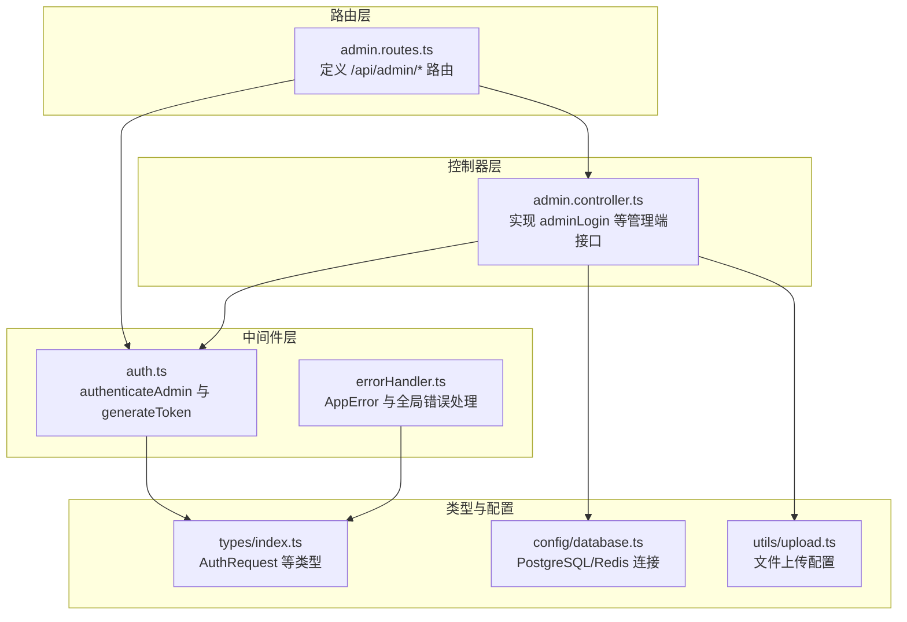
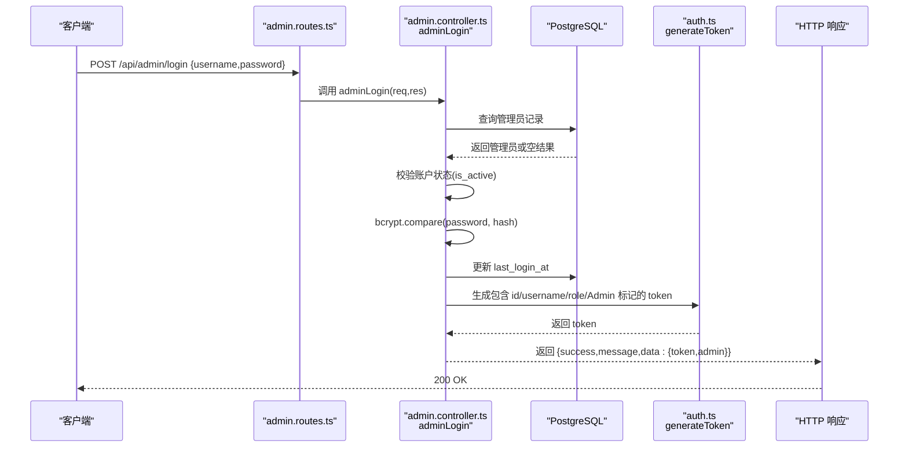
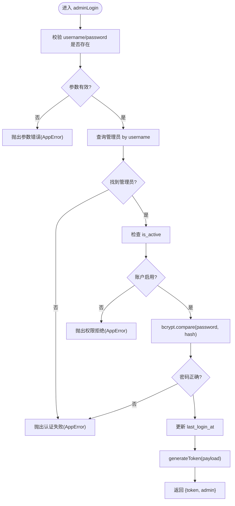
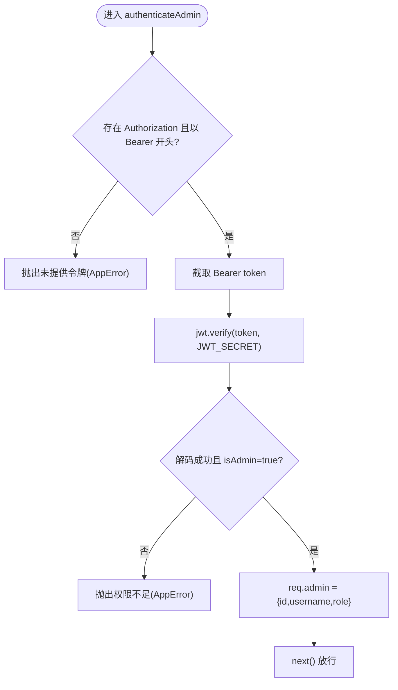
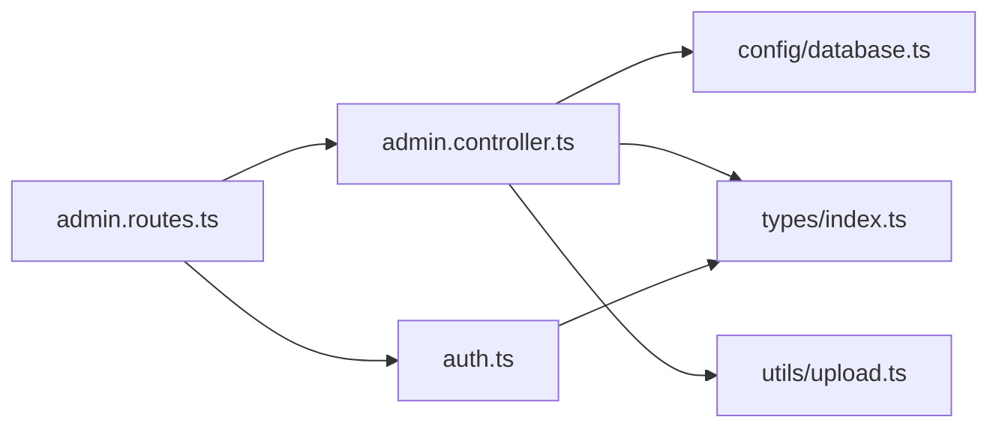

# 管理员认证

<cite>
**本文引用的文件**
- [backend/src/controllers/admin.controller.ts](file://backend/src/controllers/admin.controller.ts)
- [backend/src/middleware/auth.ts](file://backend/src/middleware/auth.ts)
- [backend/src/routes/admin.routes.ts](file://backend/src/routes/admin.routes.ts)
- [backend/src/types/index.ts](file://backend/src/types/index.ts)
- [backend/src/middleware/errorHandler.ts](file://backend/src/middleware/errorHandler.ts)
- [backend/src/config/database.ts](file://backend/src/config/database.ts)
- [backend/src/utils/upload.ts](file://backend/src/utils/upload.ts)
- [backend/package.json](file://backend/package.json)
- [database/init.sql](file://database/init.sql)
</cite>

## 目录
1. [简介](#简介)
2. [项目结构](#项目结构)
3. [核心组件](#核心组件)
4. [架构总览](#架构总览)
5. [详细组件分析](#详细组件分析)
6. [依赖关系分析](#依赖关系分析)
7. [性能与安全考量](#性能与安全考量)
8. [故障排查指南](#故障排查指南)
9. [结论](#结论)

## 简介
本文件聚焦于 nian 项目的管理员认证机制，围绕 POST /api/admin/login 端点展开，系统性说明管理员登录流程、JWT 令牌签发与校验、中间件对令牌的解析与权限检查、以及后续请求中认证令牌的使用方式。同时总结密码哈希存储的安全实践（bcrypt）与常见错误处理策略，帮助开发者快速理解并正确集成与维护该认证体系。

## 项目结构
后端采用分层设计：
- 路由层：定义 /api/admin 登录与受保护资源的访问入口
- 控制器层：实现登录逻辑、业务接口
- 中间件层：提供用户与管理员认证中间件、错误处理
- 类型定义：统一请求/响应与扩展类型
- 数据库配置：PostgreSQL 连接池与 Redis 客户端
- 工具模块：文件上传、日志、导出等

图表来源
- [backend/src/routes/admin.routes.ts](file://backend/src/routes/admin.routes.ts#L1-L68)
- [backend/src/controllers/admin.controller.ts](file://backend/src/controllers/admin.controller.ts#L1-L66)
- [backend/src/middleware/auth.ts](file://backend/src/middleware/auth.ts#L1-L87)
- [backend/src/middleware/errorHandler.ts](file://backend/src/middleware/errorHandler.ts#L1-L97)
- [backend/src/types/index.ts](file://backend/src/types/index.ts#L80-L91)
- [backend/src/config/database.ts](file://backend/src/config/database.ts#L1-L47)
- [backend/src/utils/upload.ts](file://backend/src/utils/upload.ts#L1-L128)

章节来源
- [backend/src/routes/admin.routes.ts](file://backend/src/routes/admin.routes.ts#L1-L68)
- [backend/src/controllers/admin.controller.ts](file://backend/src/controllers/admin.controller.ts#L1-L66)
- [backend/src/middleware/auth.ts](file://backend/src/middleware/auth.ts#L1-L87)
- [backend/src/types/index.ts](file://backend/src/types/index.ts#L80-L91)
- [backend/src/config/database.ts](file://backend/src/config/database.ts#L1-L47)
- [backend/src/utils/upload.ts](file://backend/src/utils/upload.ts#L1-L128)

## 核心组件
- 管理员登录控制器：负责接收用户名与密码、查询管理员、校验账户状态、比对密码哈希、更新最后登录时间、签发 JWT 并返回响应
- 管理员认证中间件：从 Authorization 头解析 Bearer 令牌，验证签名与过期，检查 isAdmin 标记，将管理员信息注入请求对象
- 令牌生成工具：基于 jsonwebtoken 使用密钥与过期时间生成 JWT
- 错误处理：统一抛出 AppError，由全局中间件转换为标准错误响应
- 类型扩展：AuthRequest 扩展 express.Request，携带 admin 字段

章节来源
- [backend/src/controllers/admin.controller.ts](file://backend/src/controllers/admin.controller.ts#L1-L66)
- [backend/src/middleware/auth.ts](file://backend/src/middleware/auth.ts#L35-L87)
- [backend/src/middleware/errorHandler.ts](file://backend/src/middleware/errorHandler.ts#L1-L97)
- [backend/src/types/index.ts](file://backend/src/types/index.ts#L80-L91)

## 架构总览
POST /api/admin/login 的端到端调用序列如下：

图表来源
- [backend/src/routes/admin.routes.ts](file://backend/src/routes/admin.routes.ts#L30-L33)
- [backend/src/controllers/admin.controller.ts](file://backend/src/controllers/admin.controller.ts#L1-L66)
- [backend/src/middleware/auth.ts](file://backend/src/middleware/auth.ts#L80-L87)
- [backend/src/config/database.ts](file://backend/src/config/database.ts#L1-L47)

章节来源
- [backend/src/routes/admin.routes.ts](file://backend/src/routes/admin.routes.ts#L30-L33)
- [backend/src/controllers/admin.controller.ts](file://backend/src/controllers/admin.controller.ts#L1-L66)
- [backend/src/middleware/auth.ts](file://backend/src/middleware/auth.ts#L80-L87)
- [backend/src/config/database.ts](file://backend/src/config/database.ts#L1-L47)

## 详细组件分析

### 管理员登录流程（POST /api/admin/login）
- 输入参数：username、password（必填）
- 校验与查询：
  - 参数校验：缺失任一参数即返回错误
  - 查询管理员：按 username 精确匹配
  - 账户状态：若 is_active=false，拒绝访问
- 凭据验证：
  - 使用 bcrypt.compare 对明文密码与数据库中的 password_hash 进行比对
  - 失败则返回认证失败
- 更新登录时间：
  - 成功后更新 last_login_at 为当前时间
- 令牌签发：
  - 调用 generateToken，载荷包含 id、username、role、isAdmin=true
  - 使用 JWT_SECRET 与过期时间（默认 7 天）生成 token
- 响应结构：
  - success=true
  - message="Login successful"
  - data.token 与 data.admin（id、username、role、email）

图表来源
- [backend/src/controllers/admin.controller.ts](file://backend/src/controllers/admin.controller.ts#L1-L66)
- [backend/src/middleware/auth.ts](file://backend/src/middleware/auth.ts#L80-L87)

章节来源
- [backend/src/controllers/admin.controller.ts](file://backend/src/controllers/admin.controller.ts#L1-L66)

### 管理员认证中间件（authenticateAdmin）
- 请求头解析：
  - 从 Authorization 头提取 Bearer token
  - 若缺少或格式不正确，返回未提供令牌或无效令牌错误
- 令牌验证：
  - 使用 JWT_SECRET 验证签名与过期
  - 解析载荷，要求 isAdmin=true
- 注入上下文：
  - 将 {id, username, role} 写入 req.admin
  - 放行后续路由处理器
- 异常处理：
  - 非 AppError 的异常统一转换为“令牌无效或过期”

图表来源
- [backend/src/middleware/auth.ts](file://backend/src/middleware/auth.ts#L35-L77)

章节来源
- [backend/src/middleware/auth.ts](file://backend/src/middleware/auth.ts#L35-L77)

### JWT 生成与使用
- 生成：
  - generateToken 接收 payload 与可选过期时间，默认使用环境变量 JWT_EXPIRES_IN 或 7 天
  - 使用 JWT_SECRET 签名
- 使用：
  - 客户端在后续请求的 Authorization 头中携带 Bearer token
  - 管理员认证中间件负责解析与校验

章节来源
- [backend/src/middleware/auth.ts](file://backend/src/middleware/auth.ts#L80-L87)

### 响应与错误处理
- 成功响应：
  - 200 OK，包含 success=true、message、data.token 与 data.admin
- 失败响应：
  - 400：参数缺失或格式错误
  - 401：认证失败（用户名/密码错误、令牌无效或过期）
  - 403：账户禁用或权限不足
  - 404：资源不存在
  - 500：服务器内部错误
- 统一错误格式：
  - AppError 包装状态码、错误代码与消息
  - errorHandler 将其转换为 {success:false,error:{code,message}}

章节来源
- [backend/src/controllers/admin.controller.ts](file://backend/src/controllers/admin.controller.ts#L1-L66)
- [backend/src/middleware/errorHandler.ts](file://backend/src/middleware/errorHandler.ts#L1-L97)

### 数据库与类型支撑
- 数据库：
  - PostgreSQL 连接池用于执行查询与更新
  - admins 表包含 username、password_hash、role、is_active、last_login_at 等字段
- 类型：
  - AuthRequest 扩展 express.Request，新增 admin 字段
  - Admin/ AdminWithPassword 定义管理员实体与带密码的变体

章节来源
- [backend/src/config/database.ts](file://backend/src/config/database.ts#L1-L47)
- [backend/src/types/index.ts](file://backend/src/types/index.ts#L65-L91)
- [database/init.sql](file://database/init.sql#L94-L108)

## 依赖关系分析
- 路由到控制器：
  - /api/admin/login -> adminLogin
  - /api/admin/* -> authenticateAdmin 全局中间件
- 控制器到中间件：
  - adminLogin 使用 generateToken
- 控制器到数据库：
  - 查询管理员、更新 last_login_at
- 中间件到类型：
  - authenticateAdmin 读取 req.admin 并写入

图表来源
- [backend/src/routes/admin.routes.ts](file://backend/src/routes/admin.routes.ts#L1-L68)
- [backend/src/controllers/admin.controller.ts](file://backend/src/controllers/admin.controller.ts#L1-L66)
- [backend/src/middleware/auth.ts](file://backend/src/middleware/auth.ts#L1-L87)
- [backend/src/types/index.ts](file://backend/src/types/index.ts#L80-L91)
- [backend/src/config/database.ts](file://backend/src/config/database.ts#L1-L47)
- [backend/src/utils/upload.ts](file://backend/src/utils/upload.ts#L1-L128)

章节来源
- [backend/src/routes/admin.routes.ts](file://backend/src/routes/admin.routes.ts#L1-L68)
- [backend/src/controllers/admin.controller.ts](file://backend/src/controllers/admin.controller.ts#L1-L66)
- [backend/src/middleware/auth.ts](file://backend/src/middleware/auth.ts#L1-L87)
- [backend/src/types/index.ts](file://backend/src/types/index.ts#L80-L91)
- [backend/src/config/database.ts](file://backend/src/config/database.ts#L1-L47)
- [backend/src/utils/upload.ts](file://backend/src/utils/upload.ts#L1-L128)

## 性能与安全考量
- 密码安全
  - bcrypt 用于密码哈希存储，避免明文存储
  - bcrypt 在控制器中用于 compare 与 hash（用户侧），管理员登录同样使用 bcrypt.compare 验证
- 令牌安全
  - 使用强密钥 JWT_SECRET，建议在部署环境中妥善保管
  - 设置合理过期时间（默认 7 天），避免长期有效令牌带来的风险
- 数据库性能
  - admins 表对 username 建有索引，登录查询具备良好性能
  - 更新 last_login_at 为轻量写操作，影响较小
- 错误处理
  - 统一 AppError 与 errorHandler，避免泄露敏感信息
- 文件上传
  - 上传中间件限制文件类型与大小，防止恶意文件上传

章节来源
- [backend/src/controllers/admin.controller.ts](file://backend/src/controllers/admin.controller.ts#L1-L66)
- [backend/src/middleware/auth.ts](file://backend/src/middleware/auth.ts#L80-L87)
- [database/init.sql](file://database/init.sql#L94-L108)
- [backend/src/utils/upload.ts](file://backend/src/utils/upload.ts#L1-L128)

## 故障排查指南
- 登录失败（401）
  - 可能原因：用户名/密码错误、账户被禁用、令牌无效或过期
  - 排查要点：确认 credentials 正确；检查 admins.is_active；确认 Authorization 头格式为 Bearer token
- 权限不足（403）
  - 可能原因：令牌非管理员（isAdmin=false）
  - 排查要点：确认签发时载荷包含 isAdmin=true
- 参数错误（400）
  - 可能原因：缺少 username/password 或文件类型/大小不合法
  - 排查要点：检查请求体字段与文件类型限制
- 服务器错误（500）
  - 可能原因：数据库连接异常、Redis 连接问题
  - 排查要点：查看日志与环境变量配置

章节来源
- [backend/src/middleware/errorHandler.ts](file://backend/src/middleware/errorHandler.ts#L1-L97)
- [backend/src/config/database.ts](file://backend/src/config/database.ts#L1-L47)
- [backend/src/utils/upload.ts](file://backend/src/utils/upload.ts#L1-L128)

## 结论
nian 项目的管理员认证以 bcrypt 哈希与 JWT 为核心，实现了从登录到中间件鉴权的完整闭环。POST /api/admin/login 提供了清晰的登录流程与标准化响应；authenticateAdmin 中间件确保后续管理端接口的安全访问。配合统一的错误处理与数据库索引优化，整体具备良好的安全性与可维护性。建议在生产环境中强化密钥管理与令牌过期策略，并持续监控数据库与中间件运行状态。