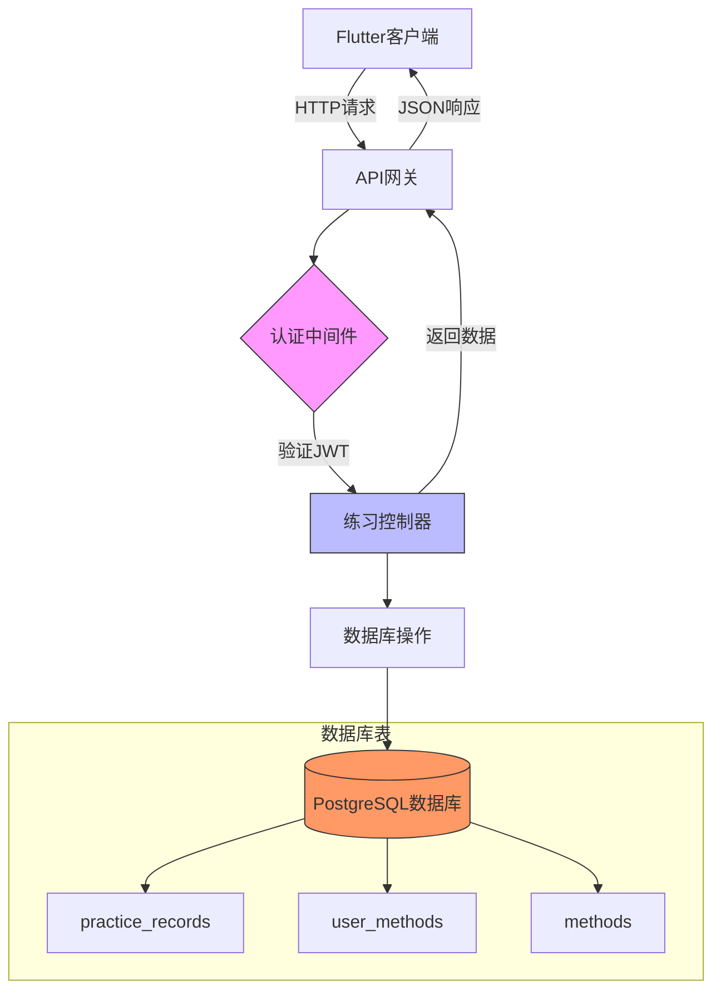

# 练习API

<cite>
**本文档中引用的文件**  
- [practice.controller.ts](file://backend/src/controllers/practice.controller.ts)
- [practice.routes.ts](file://backend/src/routes/practice.routes.ts)
- [auth.ts](file://backend/src/middleware/auth.ts)
- [index.ts](file://backend/src/types/index.ts)
- [init.sql](file://database/init.sql)
- [practice_remote_data_source.dart](file://flutter_app/lib/data/datasources/remote/practice_remote_data_source.dart)
- [practice_record_model.dart](file://flutter_app/lib/data/models/practice_record_model.dart)
</cite>

## 目录
1. [介绍](#介绍)
2. [核心功能](#核心功能)
3. [POST /api/practice 创建练习记录](#post-apipractice-创建练习记录)
4. [GET /api/practice 获取练习历史](#get-apipractice-获取练习历史)
5. [GET /api/practice/statistics 获取统计信息](#get-apipracticestatistics-获取统计信息)
6. [认证机制](#认证机制)
7. [使用场景示例](#使用场景示例)
8. [错误处理](#错误处理)
9. [数据模型](#数据模型)
10. [架构概览](#架构概览)

## 介绍
本API文档详细说明了nian项目中的练习记录功能，涵盖练习创建、历史查询和统计分析三大核心功能。系统支持用户记录每次练习的详细信息，包括练习方法、时长、情绪变化等，并提供分页查询和聚合统计功能。所有API端点均需JWT认证，确保数据安全。

**Section sources**
- [practice.controller.ts](file://backend/src/controllers/practice.controller.ts)

## 核心功能
练习API提供以下三大核心功能：
- **练习记录创建**：用户完成一次练习后，可提交详细的练习数据
- **练习历史查看**：支持分页查询和按条件筛选的练习记录浏览
- **统计分析**：提供多维度的练习数据聚合统计，帮助用户了解练习趋势

这些功能共同构成了用户练习行为的完整数据闭环，支持用户持续追踪和改善心理健康状况。

**Section sources**
- [practice.controller.ts](file://backend/src/controllers/practice.controller.ts)

## POST /api/practice 创建练习记录

### 请求体结构
创建练习记录的POST请求需要在请求体中包含以下字段：

| 字段名 | 类型 | 必填 | 描述 | 约束 |
|--------|------|------|------|------|
| method_id | number | 是 | 练习方法ID | 必须为存在的方法ID |
| duration_minutes | number | 是 | 练习时长（分钟） | 必须大于0 |
| mood_before | number | 否 | 练习前心理状态评分 | 1-10分，1表示最差，10表示最好 |
| mood_after | number | 否 | 练习后心理状态评分 | 1-10分，1表示最差，10表示最好 |
| notes | string | 否 | 练习备注 | 最大长度500字符 |
| questionnaire_result | object | 否 | 问卷调查结果 | JSON格式数据 |

### 成功响应格式
当练习记录成功创建后，服务器返回201状态码和以下响应格式：

```json
{
  "success": true,
  "message": "Practice recorded successfully",
  "data": {
    "id": 123,
    "user_id": 456,
    "method_id": 789,
    "practice_date": "2024-01-15",
    "duration_minutes": 15,
    "mood_before": 5,
    "mood_after": 7,
    "notes": "今天的练习感觉不错",
    "created_at": "2024-01-15T10:30:00Z"
  }
}
```

### 事务处理
创建练习记录采用数据库事务处理，确保数据一致性：
1. 插入练习记录到`practice_records`表
2. 更新`user_methods`表中的练习统计信息
3. 计算并更新连续打卡天数

**Section sources**
- [practice.controller.ts](file://backend/src/controllers/practice.controller.ts#L7-L98)
- [init.sql](file://database/init.sql#L62-L78)

## GET /api/practice 获取练习历史

### 分页查询参数
该端点支持分页查询和多种筛选条件：

| 参数名 | 类型 | 必填 | 描述 | 默认值 |
|--------|------|------|------|--------|
| page | number | 否 | 页码 | 1 |
| pageSize | number | 否 | 每页大小 | 20 |
| method_id | number | 否 | 按方法ID筛选 | 无 |
| start_date | string | 否 | 开始日期（YYYY-MM-DD） | 无 |
| end_date | string | 否 | 结束日期（YYYY-MM-DD） | 无 |

### 响应格式
返回分页的练习记录列表，包含总记录数和分页信息：

```json
{
  "success": true,
  "data": {
    "list": [
      {
        "id": 123,
        "user_id": 456,
        "method_id": 789,
        "method_title": "深呼吸放松法",
        "practice_date": "2024-01-15",
        "duration_minutes": 15,
        "mood_before": 5,
        "mood_after": 7,
        "notes": "今天的练习感觉不错",
        "created_at": "2024-01-15T10:30:00Z"
      }
    ],
    "total": 1,
    "page": 1,
    "pageSize": 20
  }
}
```

### 查询逻辑
- 支持按时间范围、方法ID等条件组合筛选
- 结果按练习日期降序和创建时间降序排列
- 自动关联方法表，返回方法标题

**Section sources**
- [practice.controller.ts](file://backend/src/controllers/practice.controller.ts#L101-L172)
- [init.sql](file://database/init.sql#L62-L78)

## GET /api/practice/statistics 获取统计信息

### 统计指标
该端点返回用户练习行为的聚合统计信息，支持按不同时间周期查询（通过`period`参数指定）：

| 参数 | 可选值 | 描述 |
|------|--------|------|
| period | week, month, year | 统计周期 | 

### 返回的统计指标
```json
{
  "success": true,
  "data": {
    "total_practices": 25,
    "total_duration": 375,
    "practice_days": 18,
    "avg_mood_improvement": "0.85",
    "max_continuous_days": 7,
    "mood_trend": [
      {
        "practice_date": "2024-01-10",
        "avg_mood_before": 5.2,
        "avg_mood_after": 6.8
      }
    ],
    "method_distribution": [
      {
        "id": 1,
        "title": "深呼吸放松法",
        "category": "放松技巧",
        "practice_count": 15,
        "total_duration": 225
      }
    ]
  }
}
```

### 具体统计内容
- **总练习次数**：指定周期内的练习总次数
- **总练习时长**：所有练习的累计时长（分钟）
- **练习天数**：实际进行练习的天数
- **平均情绪改善**：练习后心理状态评分提升的平均值
- **最长连续打卡天数**：历史最长的连续练习天数
- **情绪趋势**：每日练习前后心理状态的平均变化趋势
- **方法分布**：各练习方法的使用次数和时长分布

**Section sources**
- [practice.controller.ts](file://backend/src/controllers/practice.controller.ts#L174-L260)
- [init.sql](file://database/init.sql#L316-L327)

## 认证机制

### JWT认证
所有练习相关的API端点都需要JWT认证，通过`authenticateUser`中间件统一应用：

```typescript
router.use(authenticateUser);
```

### 认证流程
1. 客户端在请求头中包含`Authorization: Bearer <token>` 
2. 服务器验证JWT token的有效性和未过期状态
3. 解析用户信息并附加到请求对象中
4. 允许请求继续处理

### 认证失败响应
当认证失败时，返回相应的错误信息：

```json
{
  "success": false,
  "error": {
    "code": "AUTH_FAILED",
    "message": "No token provided"
  }
}
```

或

```json
{
  "success": false,
  "error": {
    "code": "TOKEN_EXPIRED", 
    "message": "Invalid or expired token"
  }
}
```

**Section sources**
- [practice.routes.ts](file://backend/src/routes/practice.routes.ts#L8)
- [auth.ts](file://backend/src/middleware/auth.ts#L9-L33)

## 使用场景示例

### 完整用户流程
以下是用户完成一次练习并查看统计信息的完整流程：

#### 1. 创建练习记录
```http
POST /api/practice
Authorization: Bearer <valid_token>
Content-Type: application/json

{
  "method_id": 1,
  "duration_minutes": 15,
  "mood_before": 5,
  "mood_after": 7,
  "notes": "今天的练习感觉不错"
}
```

#### 2. 查看练习历史
```http
GET /api/practice?page=1&pageSize=10&method_id=1
Authorization: Bearer <valid_token>
```

#### 3. 获取统计信息
```http
GET /api/practice/statistics?period=month
Authorization: Bearer <valid_token>
```

### 前端实现
在Flutter应用中，通过`PracticeRemoteDataSource`调用这些API：

```dart
final dataSource = PracticeRemoteDataSource(dioClient);
// 记录练习
final record = await dataSource.recordPractice(
  methodId: 1,
  durationMinutes: 15,
  moodBefore: 5,
  moodAfter: 7,
  notes: '今天的练习感觉不错',
);
// 获取统计
final stats = await dataSource.getPracticeStats();
```

**Section sources**
- [practice_remote_data_source.dart](file://flutter_app/lib/data/datasources/remote/practice_remote_data_source.dart)
- [practice.controller.ts](file://backend/src/controllers/practice.controller.ts)

## 错误处理

### 数据验证失败
当请求数据不符合验证规则时，返回400状态码和详细错误信息：

```json
{
  "success": false,
  "error": {
    "code": "VALIDATION_ERROR",
    "message": "method_id and duration_minutes are required"
  }
}
```

或

```json
{
  "success": false,
  "error": {
    "code": "VALIDATION_ERROR",
    "message": "mood_before must be between 1 and 10"
  }
}
```

### 其他常见错误
- **401 Unauthorized**：未提供token或token无效
- **500 Internal Server Error**：服务器内部错误
- **404 Not Found**：请求的资源不存在

### 错误代码表
| 错误代码 | 描述 | 可能原因 |
|----------|------|----------|
| AUTH_FAILED | 认证失败 | 未提供token或token格式错误 |
| TOKEN_EXPIRED | token过期 | token已过期或无效 |
| VALIDATION_ERROR | 数据验证错误 | 请求数据不符合验证规则 |
| SERVER_ERROR | 服务器错误 | 服务器内部异常 |

**Section sources**
- [practice.controller.ts](file://backend/src/controllers/practice.controller.ts)
- [errorHandler.ts](file://backend/src/middleware/errorHandler.ts)

## 数据模型

### 练习记录表 (practice_records)
| 字段 | 类型 | 约束 | 描述 |
|------|------|------|------|
| id | SERIAL | PRIMARY KEY | 记录ID |
| user_id | INT | NOT NULL, FOREIGN KEY | 用户ID |
| method_id | INT | NOT NULL, FOREIGN KEY | 方法ID |
| practice_date | DATE | NOT NULL | 练习日期 |
| duration_minutes | INT | NOT NULL | 练习时长（分钟） |
| mood_before | INT | CHECK(1-10) | 练习前心理状态 |
| mood_after | INT | CHECK(1-10) | 练习后心理状态 |
| notes | TEXT | | 练习备注 |
| questionnaire_result | JSONB | | 问卷结果 |
| created_at | TIMESTAMP | DEFAULT NOW() | 创建时间 |

### 前端实体模型
在Flutter应用中，`PracticeRecordModel`映射后端数据结构：

```dart
class PracticeRecordModel extends PracticeRecord {
  const PracticeRecordModel({
    required super.id,
    required super.userId,
    required super.methodId,
    required super.durationMinutes,
    required super.moodBefore,
    required super.moodAfter,
    super.notes,
    required super.practicedAt,
  });
}
```

**Section sources**
- [init.sql](file://database/init.sql#L62-L78)
- [practice_record_model.dart](file://flutter_app/lib/data/models/practice_record_model.dart)

## 架构概览



**Diagram sources**
- [practice.routes.ts](file://backend/src/routes/practice.routes.ts)
- [practice.controller.ts](file://backend/src/controllers/practice.controller.ts)
- [init.sql](file://database/init.sql)

**Section sources**
- [practice.routes.ts](file://backend/src/routes/practice.routes.ts)
- [practice.controller.ts](file://backend/src/controllers/practice.controller.ts)
- [init.sql](file://database/init.sql)