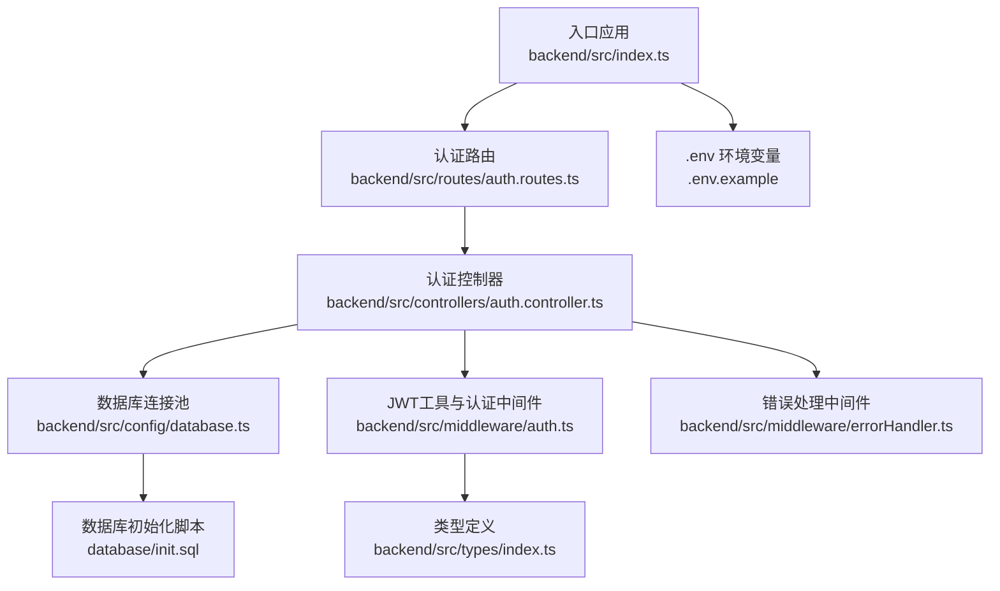
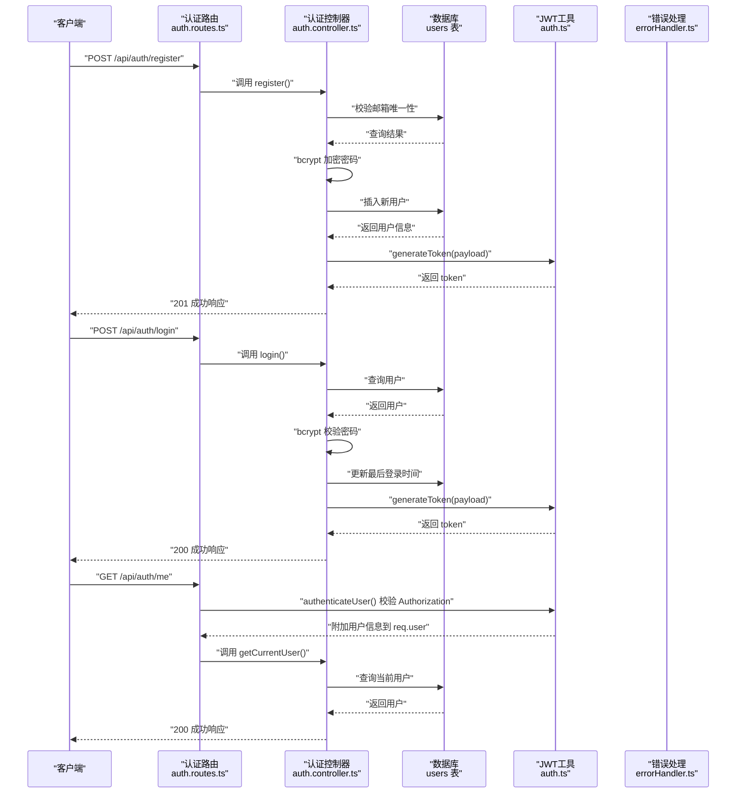
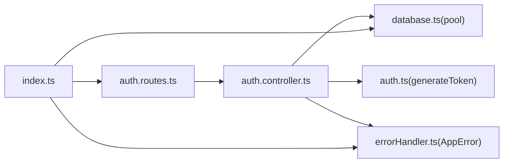

# 认证API

<cite>
**本文引用的文件**
- [backend/src/index.ts](file://backend/src/index.ts)
- [backend/src/routes/auth.routes.ts](file://backend/src/routes/auth.routes.ts)
- [backend/src/controllers/auth.controller.ts](file://backend/src/controllers/auth.controller.ts)
- [backend/src/middleware/auth.ts](file://backend/src/middleware/auth.ts)
- [backend/src/middleware/errorHandler.ts](file://backend/src/middleware/errorHandler.ts)
- [backend/src/types/index.ts](file://backend/src/types/index.ts)
- [backend/src/config/database.ts](file://backend/src/config/database.ts)
- [.env.example](file://.env.example)
- [database/init.sql](file://database/init.sql)
</cite>

## 目录
1. [简介](#简介)
2. [项目结构](#项目结构)
3. [核心组件](#核心组件)
4. [架构总览](#架构总览)
5. [详细组件分析](#详细组件分析)
6. [依赖关系分析](#依赖关系分析)
7. [性能考虑](#性能考虑)
8. [故障排查指南](#故障排查指南)
9. [结论](#结论)
10. [附录](#附录)

## 简介
本文件为 nian 项目认证 API 的权威技术文档，覆盖以下三个端点：
- POST /api/auth/register：用户注册，返回用户基本信息与 JWT 令牌
- POST /api/auth/login：用户登录，返回 JWT 令牌
- GET /api/auth/me：获取当前登录用户信息（受认证保护）

文档重点说明：
- 请求体字段与校验规则
- 响应格式与成功/失败场景
- 密码加密存储机制（bcrypt）
- JWT 令牌生成与有效期配置
- 认证中间件对 Authorization 头的解析与校验
- curl 示例与常见错误响应

## 项目结构
认证相关代码按“路由 -> 控制器 -> 中间件 -> 类型定义 -> 数据库”的分层组织，入口文件负责挂载路由与全局中间件。

图表来源
- [backend/src/index.ts](file://backend/src/index.ts#L1-L85)
- [backend/src/routes/auth.routes.ts](file://backend/src/routes/auth.routes.ts#L1-L17)
- [backend/src/controllers/auth.controller.ts](file://backend/src/controllers/auth.controller.ts#L1-L150)
- [backend/src/middleware/auth.ts](file://backend/src/middleware/auth.ts#L1-L87)
- [backend/src/middleware/errorHandler.ts](file://backend/src/middleware/errorHandler.ts#L1-L97)
- [backend/src/types/index.ts](file://backend/src/types/index.ts#L1-L126)
- [.env.example](file://.env.example#L1-L60)
- [database/init.sql](file://database/init.sql#L1-L349)

章节来源
- [backend/src/index.ts](file://backend/src/index.ts#L1-L85)
- [backend/src/routes/auth.routes.ts](file://backend/src/routes/auth.routes.ts#L1-L17)

## 核心组件
- 路由层：定义 /api/auth 下的注册、登录、获取当前用户信息三个端点，并在 me 端点启用认证中间件
- 控制器层：实现注册、登录、查询当前用户的具体业务逻辑
- 中间件层：提供用户认证中间件与 JWT 工具函数；统一错误处理
- 类型层：定义用户、请求扩展、通用响应等类型
- 数据层：PostgreSQL 连接池与用户表结构

章节来源
- [backend/src/routes/auth.routes.ts](file://backend/src/routes/auth.routes.ts#L1-L17)
- [backend/src/controllers/auth.controller.ts](file://backend/src/controllers/auth.controller.ts#L1-L150)
- [backend/src/middleware/auth.ts](file://backend/src/middleware/auth.ts#L1-L87)
- [backend/src/middleware/errorHandler.ts](file://backend/src/middleware/errorHandler.ts#L1-L97)
- [backend/src/types/index.ts](file://backend/src/types/index.ts#L1-L126)
- [backend/src/config/database.ts](file://backend/src/config/database.ts#L1-L47)
- [database/init.sql](file://database/init.sql#L1-L349)

## 架构总览
认证端点的调用链路如下：

图表来源
- [backend/src/routes/auth.routes.ts](file://backend/src/routes/auth.routes.ts#L1-L17)
- [backend/src/controllers/auth.controller.ts](file://backend/src/controllers/auth.controller.ts#L1-L150)
- [backend/src/middleware/auth.ts](file://backend/src/middleware/auth.ts#L1-L87)
- [backend/src/middleware/errorHandler.ts](file://backend/src/middleware/errorHandler.ts#L1-L97)
- [database/init.sql](file://database/init.sql#L1-L349)

## 详细组件分析

### 注册端点：POST /api/auth/register
- 请求路径：/api/auth/register
- 请求方式：POST
- 请求体字段
  - email：必填，邮箱格式校验
  - password：必填，长度至少 8 位
  - nickname：可选
- 响应
  - 状态码：201
  - data.token：JWT 令牌
  - data.user：用户基本信息（id、email、nickname、avatar_url、created_at）
- 校验与业务逻辑
  - 输入校验：必填字段与邮箱格式
  - 唯一性校验：数据库层 users.email 唯一索引
  - 密码加密：使用 bcrypt，成本因子为 10
  - 写入用户：同时写入 last_login_at
  - 令牌签发：generateToken(payload)，默认有效期来自环境变量
- 错误场景
  - 400：缺少 email/password 或邮箱格式不正确或密码长度不足
  - 409：邮箱已存在
  - 500：服务器内部错误

章节来源
- [backend/src/controllers/auth.controller.ts](file://backend/src/controllers/auth.controller.ts#L1-L68)
- [backend/src/middleware/auth.ts](file://backend/src/middleware/auth.ts#L80-L87)
- [database/init.sql](file://database/init.sql#L1-L349)
- [.env.example](file://.env.example#L1-L60)

### 登录端点：POST /api/auth/login
- 请求路径：/api/auth/login
- 请求方式：POST
- 请求体字段
  - email：必填
  - password：必填
- 响应
  - 状态码：200
  - data.token：JWT 令牌
  - data.user：用户基本信息（id、email、nickname、avatar_url、created_at）
- 认证流程
  - 查询用户：按 email 查找
  - 账号状态：检查 is_active
  - 密码校验：bcrypt.compare
  - 更新登录时间：last_login_at
  - 令牌签发：generateToken(payload)
- 错误场景
  - 400：缺少 email/password
  - 401：邮箱或密码错误
  - 403：账号被禁用
  - 500：服务器内部错误

章节来源
- [backend/src/controllers/auth.controller.ts](file://backend/src/controllers/auth.controller.ts#L71-L125)
- [backend/src/middleware/auth.ts](file://backend/src/middleware/auth.ts#L80-L87)
- [database/init.sql](file://database/init.sql#L1-L349)

### 获取当前用户：GET /api/auth/me
- 请求路径：/api/auth/me
- 请求方式：GET
- 认证保护
  - 使用 authenticateUser 中间件
  - 从 Authorization 头解析 Bearer 令牌
  - 校验 JWT 有效性并解码，将用户信息附加到 req.user
- 响应
  - 状态码：200
  - data：用户完整信息（含 created_at、last_login_at、is_active）
- 错误场景
  - 401：未提供 token、token 无效或过期
  - 404：用户不存在
  - 500：服务器内部错误

章节来源
- [backend/src/routes/auth.routes.ts](file://backend/src/routes/auth.routes.ts#L1-L17)
- [backend/src/controllers/auth.controller.ts](file://backend/src/controllers/auth.controller.ts#L127-L150)
- [backend/src/middleware/auth.ts](file://backend/src/middleware/auth.ts#L1-L33)
- [backend/src/types/index.ts](file://backend/src/types/index.ts#L80-L91)

### JWT 令牌生成与有效期
- 生成函数：generateToken(payload, expiresIn?)
- 默认有效期：从环境变量读取，默认 7 天
- 密钥来源：JWT_SECRET 环境变量
- 令牌内容：包含用户标识（id、email）等必要字段

章节来源
- [backend/src/middleware/auth.ts](file://backend/src/middleware/auth.ts#L80-L87)
- [.env.example](file://.env.example#L1-L60)

### 认证中间件 authenticateUser
- 解析 Authorization 头：要求 Bearer 前缀
- 校验 JWT：使用 JWT_SECRET 验证签名与过期
- 附加用户信息：将解码后的用户信息注入 req.user
- 错误处理：401 无 token、无效或过期 token

章节来源
- [backend/src/middleware/auth.ts](file://backend/src/middleware/auth.ts#L1-L33)
- [backend/src/types/index.ts](file://backend/src/types/index.ts#L80-L91)

### 错误处理与统一响应
- 自定义异常类：AppError，携带 statusCode、code、message
- 全局错误处理器：将 AppError 转换为统一 JSON 响应
- 非 AppError：默认 500 服务器错误

章节来源
- [backend/src/middleware/errorHandler.ts](file://backend/src/middleware/errorHandler.ts#L1-L97)

### 数据模型与数据库
- 用户表 users 字段：id、email（唯一）、password_hash、nickname、avatar_url、created_at、last_login_at、is_active
- 索引：email、created_at
- 初始化脚本：包含用户表结构与示例数据

章节来源
- [database/init.sql](file://database/init.sql#L1-L349)

## 依赖关系分析
- 控制器依赖
  - 数据库连接池：pool
  - JWT 工具：generateToken
  - 错误处理：AppError
- 路由依赖
  - 控制器：register、login、getCurrentUser
  - 认证中间件：authenticateUser
- 应用入口依赖
  - 路由挂载：/api/auth
  - 全局中间件：CORS、Helmet、JSON 解析、静态资源、错误处理

图表来源
- [backend/src/routes/auth.routes.ts](file://backend/src/routes/auth.routes.ts#L1-L17)
- [backend/src/controllers/auth.controller.ts](file://backend/src/controllers/auth.controller.ts#L1-L150)
- [backend/src/middleware/auth.ts](file://backend/src/middleware/auth.ts#L1-L87)
- [backend/src/middleware/errorHandler.ts](file://backend/src/middleware/errorHandler.ts#L1-L97)
- [backend/src/config/database.ts](file://backend/src/config/database.ts#L1-L47)
- [backend/src/index.ts](file://backend/src/index.ts#L1-L85)

## 性能考虑
- 密码哈希成本因子：10，平衡安全与性能
- 数据库连接池：最大连接数、空闲超时、连接超时参数已配置
- JWT 验证：仅进行签名与过期校验，开销极低
- 建议
  - 生产环境使用更强的 JWT_SECRET
  - 对高频接口可结合缓存优化用户查询
  - 合理设置 JWT_EXPIRES_IN，平衡用户体验与安全

[本节为通用建议，无需列出章节来源]

## 故障排查指南
- 400 验证错误
  - 症状：缺少 email/password、邮箱格式不正确、密码长度不足
  - 排查：确认请求体字段与格式
- 409 邮箱已存在
  - 症状：注册时提示邮箱已被注册
  - 排查：更换邮箱或执行登录
- 401 未授权/令牌无效
  - 症状：me 请求失败或登录失败
  - 排查：确认 Authorization 头格式为 Bearer <token>；检查 JWT_SECRET 是否正确；确认 token 未过期
- 403 账号被禁用
  - 症状：登录时报权限拒绝
  - 排查：检查数据库中 is_active 字段
- 500 服务器错误
  - 症状：数据库连接失败或未知异常
  - 排查：查看日志；检查 .env 配置与数据库连通性

章节来源
- [backend/src/controllers/auth.controller.ts](file://backend/src/controllers/auth.controller.ts#L1-L150)
- [backend/src/middleware/auth.ts](file://backend/src/middleware/auth.ts#L1-L87)
- [backend/src/middleware/errorHandler.ts](file://backend/src/middleware/errorHandler.ts#L1-L97)

## 结论
nian 项目的认证 API 采用清晰的分层设计：路由定义端点、控制器实现业务、中间件处理认证与错误、类型定义保证一致性。注册与登录均采用 bcrypt 存储密码，JWT 令牌默认有效期可配置，认证中间件严格校验 Authorization 头。整体架构简洁、可维护性强，适合进一步扩展管理员认证与刷新策略。

[本节为总结，无需列出章节来源]

## 附录

### API 规范与示例

- 注册
  - 请求
    - URL：POST /api/auth/register
    - Body：{ email, password, nickname? }
  - 响应
    - 201：{ success: true, message, data: { token, user } }
  - curl 示例
    - curl -X POST http://localhost:3000/api/auth/register -H "Content-Type: application/json" -d '{"email":"test@example.com","password":"yourStrongPass123","nickname":"昵称"}'

- 登录
  - 请求
    - URL：POST /api/auth/login
    - Body：{ email, password }
  - 响应
    - 200：{ success: true, message, data: { token, user } }
  - curl 示例
    - curl -X POST http://localhost:3000/api/auth/login -H "Content-Type: application/json" -d '{"email":"test@example.com","password":"yourStrongPass123"}'

- 获取当前用户
  - 请求
    - URL：GET /api/auth/me
    - Header：Authorization: Bearer <token>
  - 响应
    - 200：{ success: true, data: user }
  - curl 示例
    - curl -X GET http://localhost:3000/api/auth/me -H "Authorization: Bearer <token>"

- 错误响应示例
  - 400：{ success: false, error: { code, message } }
  - 401：{ success: false, error: { code, message } }
  - 403：{ success: false, error: { code, message } }
  - 409：{ success: false, error: { code, message } }
  - 404：{ success: false, error: { code, message } }
  - 500：{ success: false, error: { code, message } }

章节来源
- [backend/src/controllers/auth.controller.ts](file://backend/src/controllers/auth.controller.ts#L1-L150)
- [backend/src/middleware/auth.ts](file://backend/src/middleware/auth.ts#L1-L87)
- [backend/src/middleware/errorHandler.ts](file://backend/src/middleware/errorHandler.ts#L1-L97)

### 环境变量与配置
- JWT_SECRET：JWT 密钥（建议至少 32 字符）
- JWT_EXPIRES_IN：令牌有效期（例如 7d）
- 数据库连接：DB_HOST、DB_PORT、DB_NAME、DB_USER、DB_PASSWORD
- Redis 连接：REDIS_HOST、REDIS_PORT

章节来源
- [.env.example](file://.env.example#L1-L60)

### 数据库表结构参考
- users 表字段：id、email（UNIQUE）、password_hash、nickname、avatar_url、created_at、last_login_at、is_active

章节来源
- [database/init.sql](file://database/init.sql#L1-L349)