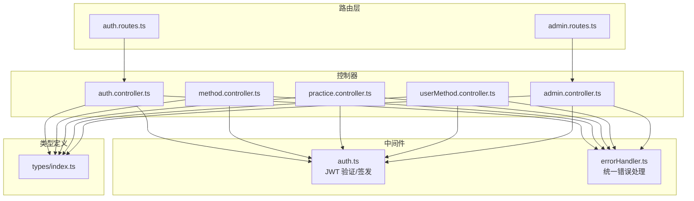
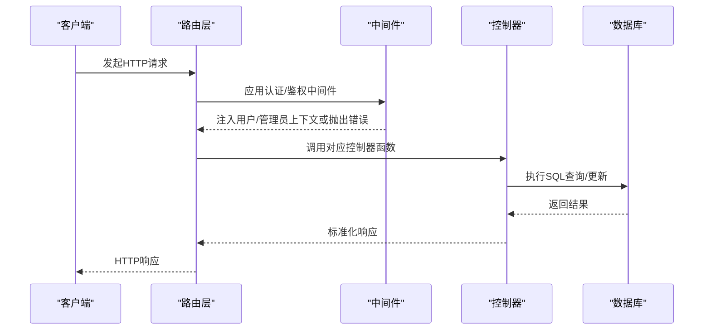
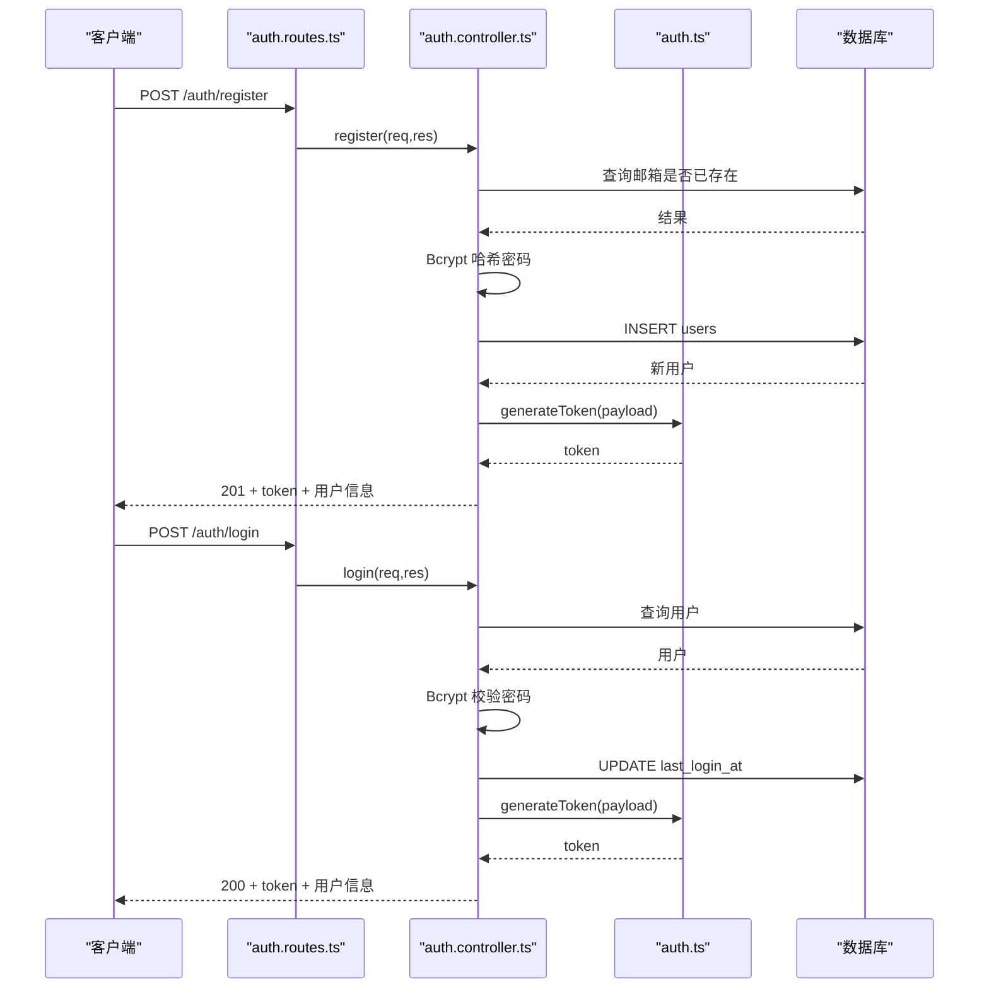
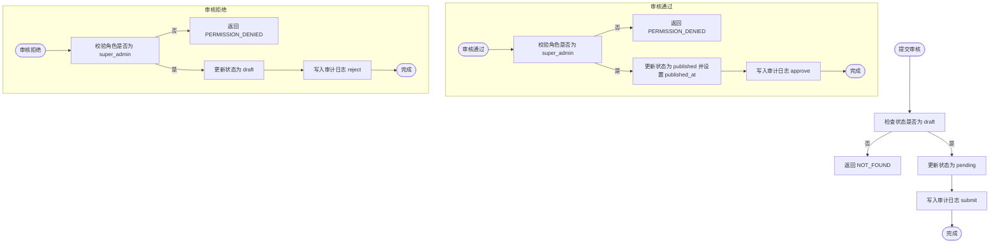
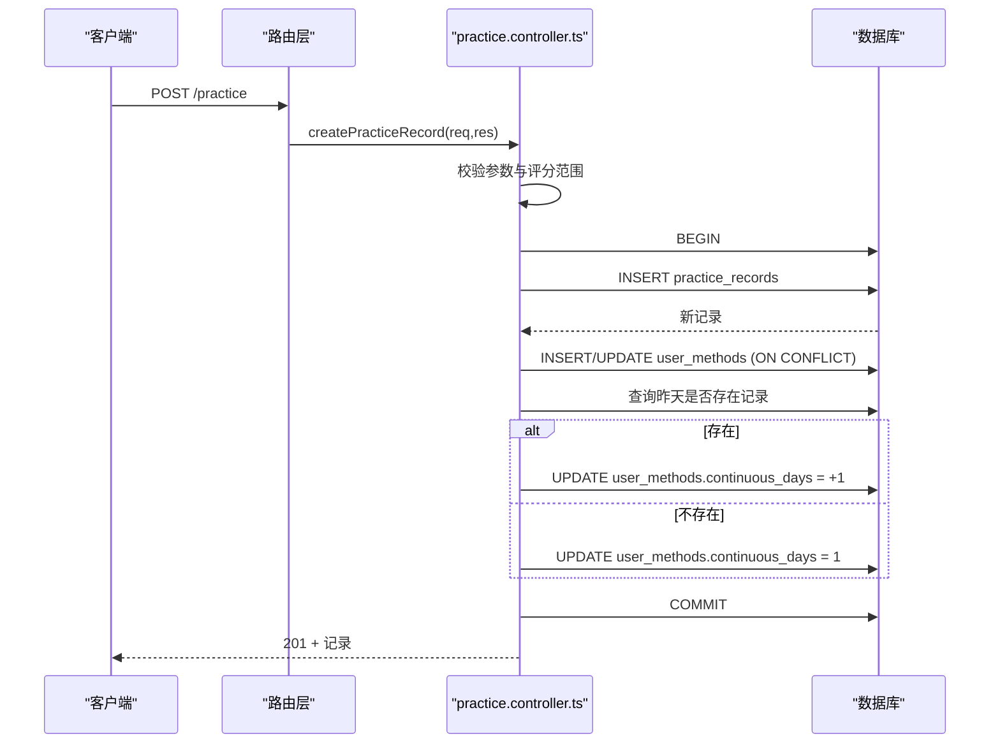
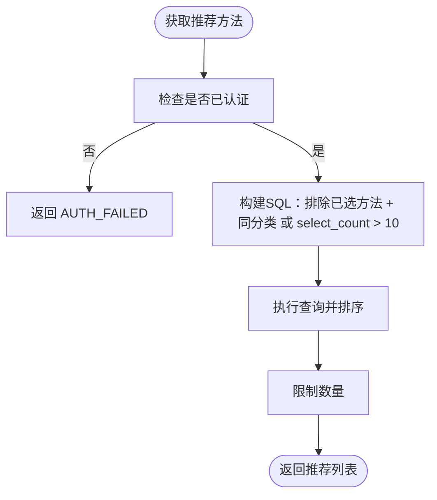
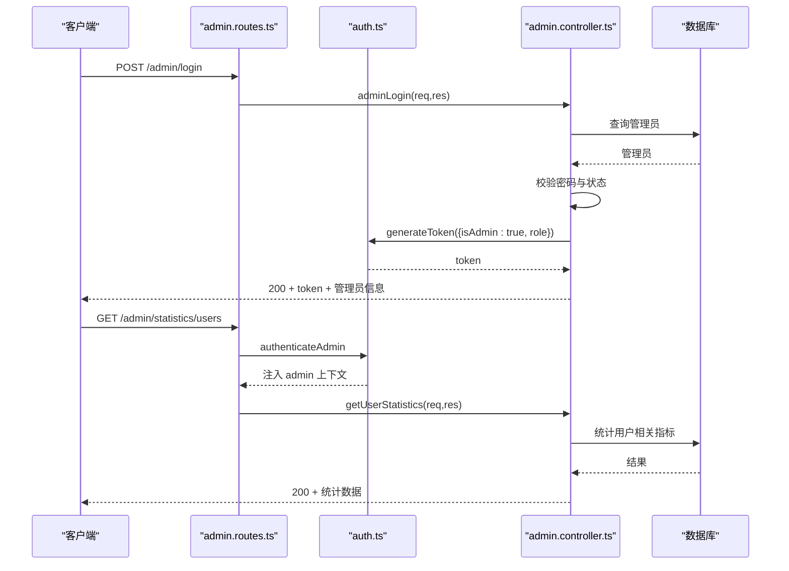
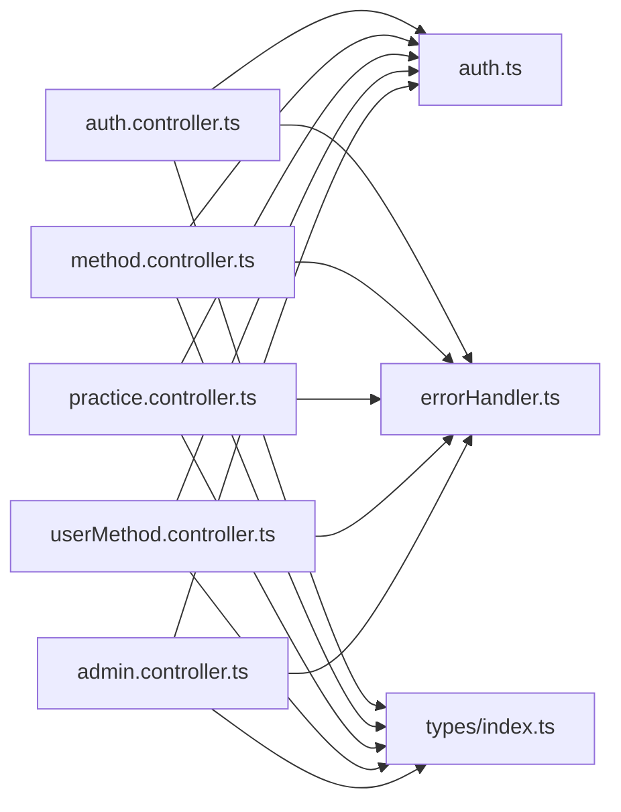

# 业务逻辑层

<cite>
**本文引用的文件**
- [backend/src/controllers/auth.controller.ts](file://backend/src/controllers/auth.controller.ts)
- [backend/src/controllers/method.controller.ts](file://backend/src/controllers/method.controller.ts)
- [backend/src/controllers/practice.controller.ts](file://backend/src/controllers/practice.controller.ts)
- [backend/src/controllers/userMethod.controller.ts](file://backend/src/controllers/userMethod.controller.ts)
- [backend/src/controllers/admin.controller.ts](file://backend/src/controllers/admin.controller.ts)
- [backend/src/middleware/auth.ts](file://backend/src/middleware/auth.ts)
- [backend/src/middleware/errorHandler.ts](file://backend/src/middleware/errorHandler.ts)
- [backend/src/types/index.ts](file://backend/src/types/index.ts)
- [backend/src/routes/auth.routes.ts](file://backend/src/routes/auth.routes.ts)
- [backend/src/routes/admin.routes.ts](file://backend/src/routes/admin.routes.ts)
</cite>

## 目录
1. [引言](#引言)
2. [项目结构](#项目结构)
3. [核心组件](#核心组件)
4. [架构总览](#架构总览)
5. [详细组件分析](#详细组件分析)
6. [依赖关系分析](#依赖关系分析)
7. [性能考量](#性能考量)
8. [故障排查指南](#故障排查指南)
9. [结论](#结论)

## 引言
本文件聚焦于 nian 后端业务逻辑层，系统性解析各控制器（Controller）的核心业务处理流程，覆盖用户注册与登录、JWT 令牌生成与验证、方法内容审核状态管理、练习记录创建与统计更新、个性化推荐算法、管理员权限验证与批量操作等关键能力。文档同时提供流程图与序列图，帮助读者快速把握控制流与数据流，并给出潜在性能瓶颈与优化建议。

## 项目结构
后端采用按职责分层的组织方式：
- 控制器层：封装具体业务接口，负责请求参数解析、调用仓储/服务、返回标准化响应。
- 中间件层：认证与鉴权、错误处理。
- 类型定义：统一前后端交互的数据模型与扩展的 Express 请求类型。
- 路由层：将 HTTP 路径映射到控制器函数，并挂载中间件。

图表来源
- [backend/src/routes/auth.routes.ts](file://backend/src/routes/auth.routes.ts#L1-L17)
- [backend/src/routes/admin.routes.ts](file://backend/src/routes/admin.routes.ts#L1-L98)
- [backend/src/middleware/auth.ts](file://backend/src/middleware/auth.ts#L1-L87)
- [backend/src/middleware/errorHandler.ts](file://backend/src/middleware/errorHandler.ts#L1-L97)
- [backend/src/controllers/auth.controller.ts](file://backend/src/controllers/auth.controller.ts#L1-L150)
- [backend/src/controllers/method.controller.ts](file://backend/src/controllers/method.controller.ts#L1-L153)
- [backend/src/controllers/practice.controller.ts](file://backend/src/controllers/practice.controller.ts#L1-L261)
- [backend/src/controllers/userMethod.controller.ts](file://backend/src/controllers/userMethod.controller.ts#L1-L162)
- [backend/src/controllers/admin.controller.ts](file://backend/src/controllers/admin.controller.ts#L1-L1428)
- [backend/src/types/index.ts](file://backend/src/types/index.ts#L1-L126)

章节来源
- [backend/src/routes/auth.routes.ts](file://backend/src/routes/auth.routes.ts#L1-L17)
- [backend/src/routes/admin.routes.ts](file://backend/src/routes/admin.routes.ts#L1-L98)
- [backend/src/middleware/auth.ts](file://backend/src/middleware/auth.ts#L1-L87)
- [backend/src/middleware/errorHandler.ts](file://backend/src/middleware/errorHandler.ts#L1-L97)
- [backend/src/types/index.ts](file://backend/src/types/index.ts#L1-L126)

## 核心组件
- 认证与授权中间件：提供用户与管理员两类认证，统一签发 JWT 并在受保护路由中校验。
- 错误处理中间件：捕获业务异常并输出统一结构化错误响应。
- 控制器层：围绕用户、方法、练习、用户方法、管理员等模块实现业务逻辑。

章节来源
- [backend/src/middleware/auth.ts](file://backend/src/middleware/auth.ts#L1-L87)
- [backend/src/middleware/errorHandler.ts](file://backend/src/middleware/errorHandler.ts#L1-L97)
- [backend/src/types/index.ts](file://backend/src/types/index.ts#L1-L126)

## 架构总览
下图展示从路由到控制器、中间件与数据库的调用链路与职责边界。

图表来源
- [backend/src/routes/auth.routes.ts](file://backend/src/routes/auth.routes.ts#L1-L17)
- [backend/src/routes/admin.routes.ts](file://backend/src/routes/admin.routes.ts#L1-L98)
- [backend/src/middleware/auth.ts](file://backend/src/middleware/auth.ts#L1-L87)
- [backend/src/controllers/auth.controller.ts](file://backend/src/controllers/auth.controller.ts#L1-L150)
- [backend/src/controllers/admin.controller.ts](file://backend/src/controllers/admin.controller.ts#L1-L1428)

## 详细组件分析

### 认证与授权：auth.controller.ts 与 auth.ts
- 用户注册流程要点
  - 输入校验：邮箱、密码必填；邮箱格式校验；密码长度校验。
  - 去重检查：按邮箱查询用户是否存在。
  - 密码加密：使用 Bcrypt 对明文密码进行哈希存储。
  - 用户创建：插入 users 表，返回用户基本信息。
  - 令牌签发：调用中间件 generateToken 生成 JWT。
  - 响应结构：包含 token 与用户信息。
- 登录流程要点
  - 输入校验：邮箱与密码必填。
  - 用户查询：按邮箱查找用户。
  - 账号状态：检查 is_active 是否启用。
  - 密码验证：使用 Bcrypt.compare 校验。
  - 登录时间更新：更新 last_login_at。
  - 令牌签发：生成 JWT。
- 当前用户信息
  - 依赖认证中间件注入的用户上下文，查询用户并返回。

图表来源
- [backend/src/routes/auth.routes.ts](file://backend/src/routes/auth.routes.ts#L1-L17)
- [backend/src/controllers/auth.controller.ts](file://backend/src/controllers/auth.controller.ts#L1-L150)
- [backend/src/middleware/auth.ts](file://backend/src/middleware/auth.ts#L1-L87)

章节来源
- [backend/src/controllers/auth.controller.ts](file://backend/src/controllers/auth.controller.ts#L1-L150)
- [backend/src/middleware/auth.ts](file://backend/src/middleware/auth.ts#L1-L87)
- [backend/src/middleware/errorHandler.ts](file://backend/src/middleware/errorHandler.ts#L1-L97)

### 方法内容审核状态管理：method.controller.ts 与 admin.controller.ts
- 方法列表与详情
  - 列表：支持按 category、difficulty、keyword 过滤，分页查询 published 的方法，统计总数并返回分页响应。
  - 详情：查询 published 的方法，阅读量 view_count 自增。
- 推荐算法
  - 基于用户已选方法的分类集合，推荐未选过且满足“同分类”或“select_count 较高”的方法，按 select_count 与发布时间排序。
- 审核状态管理（管理员）
  - 提交审核：将 draft 方法状态更新为 pending，并写入审计日志。
  - 审核通过：仅 super_admin 可执行，将 pending 方法发布并写入审计日志。
  - 审核拒绝：仅 super_admin 可执行，将 pending 方法退回 draft 并写入审计日志。

图表来源
- [backend/src/controllers/admin.controller.ts](file://backend/src/controllers/admin.controller.ts#L266-L387)

章节来源
- [backend/src/controllers/method.controller.ts](file://backend/src/controllers/method.controller.ts#L1-L153)
- [backend/src/controllers/admin.controller.ts](file://backend/src/controllers/admin.controller.ts#L266-L387)

### 练习记录创建与统计更新：practice.controller.ts
- 创建练习记录
  - 参数校验：method_id 与 duration_minutes 必填；mood_before/mood_after 在 1~10 区间。
  - 事务保障：BEGIN/COMMIT/ROLLBACK。
  - 插入 practice_records。
  - 更新 user_methods：ON CONFLICT 使用增量更新 completed_count、total_duration_minutes、last_practice_at。
  - 连续打卡天数：若昨天存在记录则连续天数+1，否则重置为1。
- 练习历史查询
  - 支持按 method_id、start_date、end_date 过滤，分页查询并返回总条数。
- 练习统计
  - 总体统计：总次数、总时长、练习天数、平均情绪改善。
  - 心理状态趋势：按日期聚合平均情绪前后值。
  - 方法分布：按方法统计次数与时长。
  - 最长连续天数：从 user_methods 查询最大连续天数。

图表来源
- [backend/src/controllers/practice.controller.ts](file://backend/src/controllers/practice.controller.ts#L1-L99)

章节来源
- [backend/src/controllers/practice.controller.ts](file://backend/src/controllers/practice.controller.ts#L1-L261)

### 个性化推荐算法：method.controller.ts
- 触发条件：需用户已登录（通过认证中间件），查询时从用户上下文中读取用户 ID。
- 推荐策略：排除用户已选方法；优先推荐与用户已选方法相同分类的方法；若无匹配，则推荐 select_count 较高的热门方法；最终按 select_count 降序、发布时间降序排序并限制数量。

图表来源
- [backend/src/controllers/method.controller.ts](file://backend/src/controllers/method.controller.ts#L100-L136)

章节来源
- [backend/src/controllers/method.controller.ts](file://backend/src/controllers/method.controller.ts#L100-L136)

### 管理员权限验证与批量操作：admin.controller.ts
- 权限验证
  - 管理员登录：查询 admins 表，校验 is_active 与密码，签发带 isAdmin、role 的 JWT。
  - 路由守卫：authenticateAdmin 中间件校验 Bearer Token 并确保 isAdmin=true。
- 方法管理
  - 列表：支持 status、category 过滤，分页返回。
  - 创建：默认状态为 draft。
  - 更新：动态拼接字段，避免无效更新。
  - 删除：软删除/硬删除取决于业务需求，此处为硬删除。
- 审核流程
  - 提交审核、审核通过、审核拒绝，均写入审计日志。
- 统计与导出
  - 用户统计：总用户、近7日活跃用户、近7日新增、近30日新增趋势。
  - 方法统计：发布态总数、分类分布、热门方法。
  - 数据导出：用户、方法、练习记录支持 JSON/CSV/Excel。
- 媒体管理
  - 文件上传：根据 MIME 类型判定 image/audio/video，生成 URL 并入库。
  - 媒体列表：按类型与关键词搜索，分页返回。
  - 删除媒体：删除数据库记录并同步删除物理文件。
- 用户管理
  - 用户列表：支持搜索、状态过滤、排序与分页。
  - 用户详情：汇总方法数、练习数、总时长、平均情绪改善。
  - 更新用户状态：启用/禁用。
  - 用户方法库与练习记录：按日期范围查询并分页。

图表来源
- [backend/src/routes/admin.routes.ts](file://backend/src/routes/admin.routes.ts#L1-L98)
- [backend/src/middleware/auth.ts](file://backend/src/middleware/auth.ts#L1-L87)
- [backend/src/controllers/admin.controller.ts](file://backend/src/controllers/admin.controller.ts#L1-L467)

章节来源
- [backend/src/controllers/admin.controller.ts](file://backend/src/controllers/admin.controller.ts#L1-L1428)
- [backend/src/routes/admin.routes.ts](file://backend/src/routes/admin.routes.ts#L1-L98)
- [backend/src/middleware/auth.ts](file://backend/src/middleware/auth.ts#L1-L87)

## 依赖关系分析
- 控制器对中间件的依赖
  - 认证中间件：用于用户与管理员两类认证，分别注入 user/admin 上下文。
  - 错误处理：统一捕获 AppError 并输出标准错误响应。
- 控制器对类型定义的依赖
  - 统一使用 User、Method、UserMethod、PracticeRecord、Admin 等类型，保证接口一致性。
- 控制器对数据库的依赖
  - 通过连接池 pool 执行 SQL，涉及查询、插入、更新、事务与审计日志写入。

图表来源
- [backend/src/controllers/auth.controller.ts](file://backend/src/controllers/auth.controller.ts#L1-L150)
- [backend/src/controllers/method.controller.ts](file://backend/src/controllers/method.controller.ts#L1-L153)
- [backend/src/controllers/practice.controller.ts](file://backend/src/controllers/practice.controller.ts#L1-L261)
- [backend/src/controllers/userMethod.controller.ts](file://backend/src/controllers/userMethod.controller.ts#L1-L162)
- [backend/src/controllers/admin.controller.ts](file://backend/src/controllers/admin.controller.ts#L1-L1428)
- [backend/src/middleware/auth.ts](file://backend/src/middleware/auth.ts#L1-L87)
- [backend/src/middleware/errorHandler.ts](file://backend/src/middleware/errorHandler.ts#L1-L97)
- [backend/src/types/index.ts](file://backend/src/types/index.ts#L1-L126)

章节来源
- [backend/src/controllers/auth.controller.ts](file://backend/src/controllers/auth.controller.ts#L1-L150)
- [backend/src/controllers/method.controller.ts](file://backend/src/controllers/method.controller.ts#L1-L153)
- [backend/src/controllers/practice.controller.ts](file://backend/src/controllers/practice.controller.ts#L1-L261)
- [backend/src/controllers/userMethod.controller.ts](file://backend/src/controllers/userMethod.controller.ts#L1-L162)
- [backend/src/controllers/admin.controller.ts](file://backend/src/controllers/admin.controller.ts#L1-L1428)
- [backend/src/middleware/auth.ts](file://backend/src/middleware/auth.ts#L1-L87)
- [backend/src/middleware/errorHandler.ts](file://backend/src/middleware/errorHandler.ts#L1-L97)
- [backend/src/types/index.ts](file://backend/src/types/index.ts#L1-L126)

## 性能考量
- 密码加密成本
  - Bcrypt 的成本因子影响 CPU 时间，建议在生产环境评估吞吐与延迟平衡，必要时结合异步队列或缓存策略。
- 数据库事务
  - 练习记录创建使用事务，确保一致性但会占用连接资源。建议：
    - 控制事务内操作数量，避免长时间持有连接。
    - 对高频写入场景考虑批量写入或异步落库。
- 查询与索引
  - 方法列表与筛选、练习历史与统计查询较多使用 WHERE 与 ORDER BY，建议：
    - 为 users、methods、practice_records、user_methods 建立常用过滤字段索引（如 status、category、user_id、method_id、practice_date）。
    - 对统计类查询使用物化视图或定期汇总表降低复杂度。
- 推荐算法
  - 推荐查询包含子查询与 IN/EXISTS，建议：
    - 为 user_methods(method_id,user_id) 建立复合索引。
    - 对 select_count 高频查询建立索引。
- 文件上传与删除
  - 物理文件删除需同步 IO，建议：
    - 将删除操作放入后台任务队列，避免阻塞主请求。
    - 对大文件采用分块上传与断点续传。
- 缓存策略
  - 对热点数据（如方法详情、热门方法、用户统计）引入 Redis 缓存，减少数据库压力。
- 日志与监控
  - 对慢查询、错误率、事务回滚进行监控告警，及时发现性能瓶颈。

[本节为通用性能建议，不直接分析具体代码文件]

## 故障排查指南
- 常见错误类型
  - VALIDATION_ERROR：输入参数缺失或格式不合法（如邮箱、密码、评分范围）。
  - AUTH_FAILED：缺少令牌、令牌无效或用户未认证。
  - TOKEN_EXPIRED：JWT 过期或签名失败。
  - PERMISSION_DENIED：非管理员访问管理员路由或权限不足（如仅 super_admin 可审核）。
  - DUPLICATE_ENTRY：重复注册或重复添加方法。
  - NOT_FOUND：用户、方法、媒体文件不存在。
- 排查步骤
  - 检查路由是否正确挂载认证中间件（用户/管理员）。
  - 核对请求头 Authorization 是否为 Bearer Token。
  - 校验 JWT_SECRET 环境变量配置。
  - 查看数据库约束与唯一索引（邮箱、方法选择去重）。
  - 关注事务回滚路径与审计日志，定位状态变更问题。
  - 对慢查询进行 EXPLAIN 分析，补充索引。

章节来源
- [backend/src/middleware/errorHandler.ts](file://backend/src/middleware/errorHandler.ts#L1-L97)
- [backend/src/middleware/auth.ts](file://backend/src/middleware/auth.ts#L1-L87)
- [backend/src/controllers/auth.controller.ts](file://backend/src/controllers/auth.controller.ts#L1-L150)
- [backend/src/controllers/admin.controller.ts](file://backend/src/controllers/admin.controller.ts#L1-L1428)

## 结论
本业务逻辑层围绕用户、方法、练习、用户方法与管理员五大领域构建了清晰的控制器职责边界，配合认证中间件与统一错误处理，实现了从注册登录、JWT 签发与校验、方法审核、练习记录与统计、个性化推荐到管理员权限与批量操作的完整闭环。建议后续在性能方面加强索引与缓存、优化事务与 IO、完善监控与告警，以支撑更高并发与更复杂的业务演进。