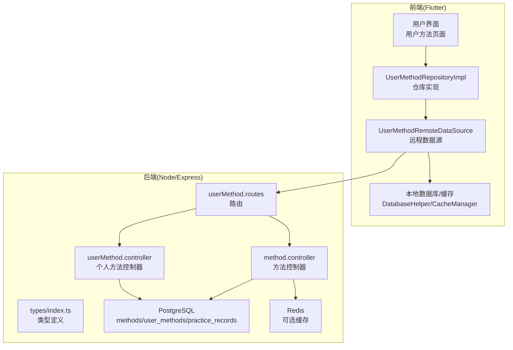
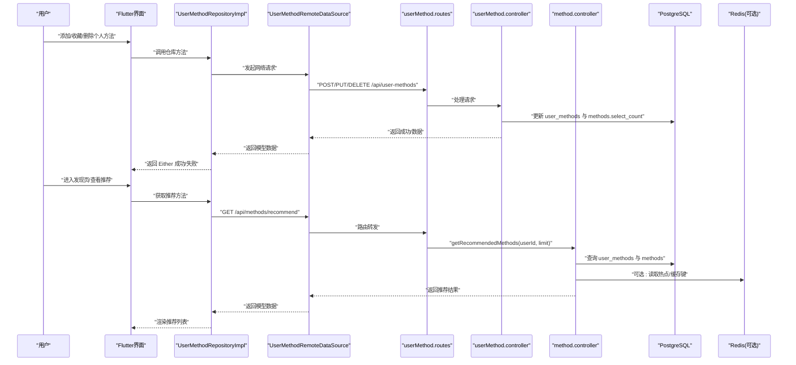
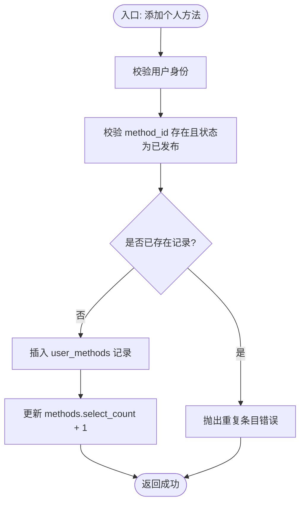
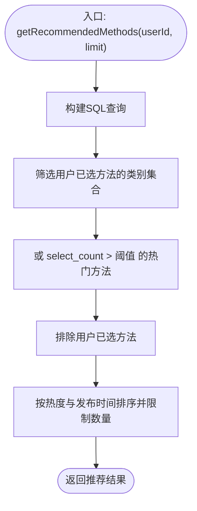
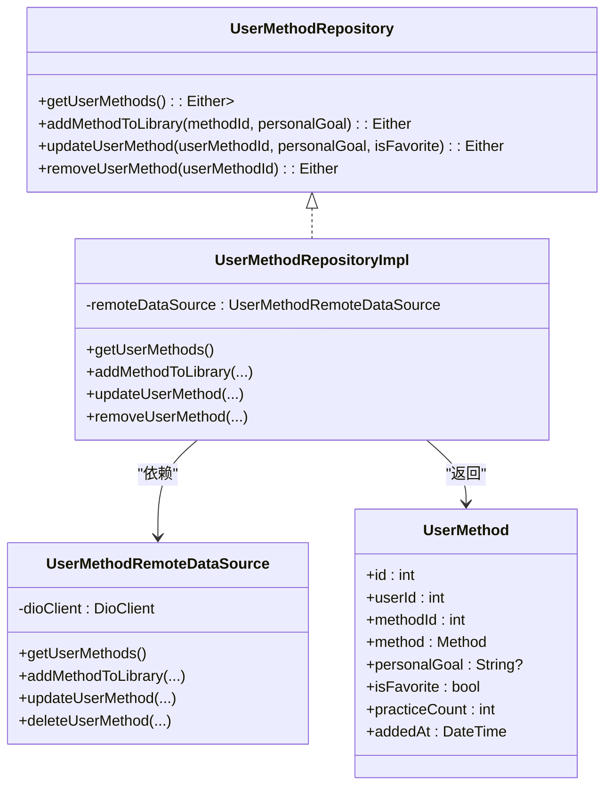
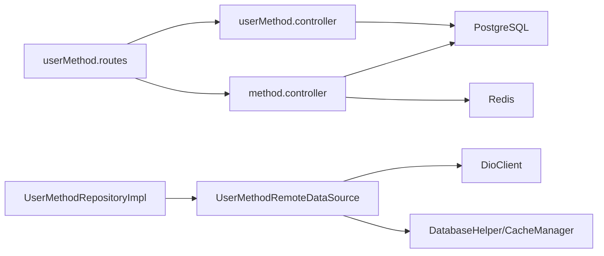

# 个性化推荐业务逻辑

<cite>
**本文引用的文件**
- [backend/src/controllers/userMethod.controller.ts](file://backend/src/controllers/userMethod.controller.ts)
- [backend/src/controllers/method.controller.ts](file://backend/src/controllers/method.controller.ts)
- [backend/src/routes/userMethod.routes.ts](file://backend/src/routes/userMethod.routes.ts)
- [backend/src/types/index.ts](file://backend/src/types/index.ts)
- [backend/src/config/database.ts](file://backend/src/config/database.ts)
- [database/init.sql](file://database/init.sql)
- [flutter_app/lib/data/repositories/user_method_repository_impl.dart](file://flutter_app/lib/data/repositories/user_method_repository_impl.dart)
- [flutter_app/lib/data/datasources/remote/user_method_remote_data_source.dart](file://flutter_app/lib/data/datasources/remote/user_method_remote_data_source.dart)
- [flutter_app/lib/domain/repositories/user_method_repository.dart](file://flutter_app/lib/domain/repositories/user_method_repository.dart)
- [flutter_app/lib/domain/entities/user_method.dart](file://flutter_app/lib/domain/entities/user_method.dart)
- [flutter_app/lib/data/models/user_method_model.dart](file://flutter_app/lib/data/models/user_method_model.dart)
- [flutter_app/lib/presentation/user_methods/pages/user_method_list_page.dart](file://flutter_app/lib/presentation/user_methods/pages/user_method_list_page.dart)
- [flutter_app/lib/core/storage/database_helper.dart](file://flutter_app/lib/core/storage/database_helper.dart)
- [flutter_app/lib/core/utils/cache_manager.dart](file://flutter_app/lib/core/utils/cache_manager.dart)
- [docker-compose.yml](file://docker-compose.yml)
- [docs/QUALITY_REPORT.md](file://docs/QUALITY_REPORT.md)
- [docs/TEST_REPORT.md](file://docs/TEST_REPORT.md)
</cite>

## 目录
1. [简介](#简介)
2. [项目结构](#项目结构)
3. [核心组件](#核心组件)
4. [架构总览](#架构总览)
5. [详细组件分析](#详细组件分析)
6. [依赖关系分析](#依赖关系分析)
7. [性能考量](#性能考量)
8. [故障排查指南](#故障排查指南)
9. [结论](#结论)
10. [附录](#附录)

## 简介
本文件系统化阐述个性化推荐功能的业务实现机制，聚焦后端 userMethod.controller.ts 中用户偏好收集、推荐算法触发与结果生成的全流程；同时结合 Flutter 客户端 UserMethodRepository 的缓存与更新策略，解释数据采集、特征向量构建、排序与多样性控制、冷启动处理及推荐效果评估指标体系。文档旨在帮助技术与非技术读者理解从“用户行为采集”到“推荐结果呈现”的完整闭环。

## 项目结构
该系统采用前后端分离架构：
- 后端（Node.js + Express + PostgreSQL）负责用户偏好与方法数据的持久化、推荐算法计算与 API 提供。
- 前端（Flutter）负责用户交互、本地缓存与网络请求转发，调用后端 API 获取推荐与个人方法列表。

图表来源
- [backend/src/routes/userMethod.routes.ts](file://backend/src/routes/userMethod.routes.ts#L1-L23)
- [backend/src/controllers/userMethod.controller.ts](file://backend/src/controllers/userMethod.controller.ts#L1-L162)
- [backend/src/controllers/method.controller.ts](file://backend/src/controllers/method.controller.ts#L1-L153)
- [backend/src/types/index.ts](file://backend/src/types/index.ts#L1-L126)
- [backend/src/config/database.ts](file://backend/src/config/database.ts#L1-L46)
- [database/init.sql](file://database/init.sql#L1-L349)
- [flutter_app/lib/data/repositories/user_method_repository_impl.dart](file://flutter_app/lib/data/repositories/user_method_repository_impl.dart#L1-L84)
- [flutter_app/lib/data/datasources/remote/user_method_remote_data_source.dart](file://flutter_app/lib/data/datasources/remote/user_method_remote_data_source.dart#L1-L86)
- [flutter_app/lib/core/storage/database_helper.dart](file://flutter_app/lib/core/storage/database_helper.dart#L54-L104)
- [flutter_app/lib/core/utils/cache_manager.dart](file://flutter_app/lib/core/utils/cache_manager.dart#L48-L95)

章节来源
- [backend/src/routes/userMethod.routes.ts](file://backend/src/routes/userMethod.routes.ts#L1-L23)
- [backend/src/controllers/userMethod.controller.ts](file://backend/src/controllers/userMethod.controller.ts#L1-L162)
- [backend/src/controllers/method.controller.ts](file://backend/src/controllers/method.controller.ts#L1-L153)
- [backend/src/types/index.ts](file://backend/src/types/index.ts#L1-L126)
- [backend/src/config/database.ts](file://backend/src/config/database.ts#L1-L46)
- [database/init.sql](file://database/init.sql#L1-L349)
- [flutter_app/lib/data/repositories/user_method_repository_impl.dart](file://flutter_app/lib/data/repositories/user_method_repository_impl.dart#L1-L84)
- [flutter_app/lib/data/datasources/remote/user_method_remote_data_source.dart](file://flutter_app/lib/data/datasources/remote/user_method_remote_data_source.dart#L1-L86)
- [flutter_app/lib/core/storage/database_helper.dart](file://flutter_app/lib/core/storage/database_helper.dart#L54-L104)
- [flutter_app/lib/core/utils/cache_manager.dart](file://flutter_app/lib/core/utils/cache_manager.dart#L48-L95)

## 核心组件
- 用户偏好与个人方法管理：后端 userMethod.controller.ts 提供添加、查询、更新、删除个人方法的完整 CRUD 接口；同时在添加/删除时更新方法的“选择计数”，作为基础偏好信号。
- 推荐算法触发与结果生成：后端 method.controller.ts 的“获取推荐方法”接口，基于用户已选方法的类别分布与热门阈值进行简单协同过滤式推荐，并按热度与发布时间排序。
- Flutter 客户端缓存与更新：UserMethodRepositoryImpl 将远程调用封装为 Either<Failure, Data>；UserMethodRemoteDataSource 负责网络请求与错误转换；本地 DatabaseHelper/CacheManager 提供离线可用与缓存清理能力。

章节来源
- [backend/src/controllers/userMethod.controller.ts](file://backend/src/controllers/userMethod.controller.ts#L1-L162)
- [backend/src/controllers/method.controller.ts](file://backend/src/controllers/method.controller.ts#L100-L136)
- [flutter_app/lib/data/repositories/user_method_repository_impl.dart](file://flutter_app/lib/data/repositories/user_method_repository_impl.dart#L1-L84)
- [flutter_app/lib/data/datasources/remote/user_method_remote_data_source.dart](file://flutter_app/lib/data/datasources/remote/user_method_remote_data_source.dart#L1-L86)

## 架构总览
推荐流程从“用户行为采集”到“结果排序与多样性控制”的端到端序列如下：

图表来源
- [backend/src/routes/userMethod.routes.ts](file://backend/src/routes/userMethod.routes.ts#L1-L23)
- [backend/src/controllers/userMethod.controller.ts](file://backend/src/controllers/userMethod.controller.ts#L1-L162)
- [backend/src/controllers/method.controller.ts](file://backend/src/controllers/method.controller.ts#L100-L136)
- [backend/src/config/database.ts](file://backend/src/config/database.ts#L1-L46)
- [flutter_app/lib/data/repositories/user_method_repository_impl.dart](file://flutter_app/lib/data/repositories/user_method_repository_impl.dart#L1-L84)
- [flutter_app/lib/data/datasources/remote/user_method_remote_data_source.dart](file://flutter_app/lib/data/datasources/remote/user_method_remote_data_source.dart#L1-L86)

## 详细组件分析

### 用户偏好收集与个人方法管理（userMethod.controller.ts）
- 行为采集
  - 添加个人方法：记录 user_id + method_id + target_count，同时增加 methods.select_count，作为“被选择偏好”的基础信号。
  - 更新个人方法：支持更新 is_favorite、target_count 等字段，便于表达收藏偏好与目标偏好。
  - 删除个人方法：移除 user_methods 记录并回退 methods.select_count。
- 数据一致性
  - 所有操作均在事务性查询中完成，确保 user_methods 唯一约束与外键约束生效。
- 类型与约束
  - 用户方法实体包含 selected_at、target_count、completed_count、连续天数、last_practice_at、is_favorite 等字段，便于后续扩展为更复杂的偏好特征。

图表来源
- [backend/src/controllers/userMethod.controller.ts](file://backend/src/controllers/userMethod.controller.ts#L1-L56)
- [database/init.sql](file://database/init.sql#L43-L61)

章节来源
- [backend/src/controllers/userMethod.controller.ts](file://backend/src/controllers/userMethod.controller.ts#L1-L162)
- [backend/src/types/index.ts](file://backend/src/types/index.ts#L37-L49)
- [database/init.sql](file://database/init.sql#L43-L61)

### 推荐算法触发与结果生成（method.controller.ts）
- 触发点
  - GET /api/methods/recommend，携带 limit 参数，默认返回若干条推荐。
- 算法思路（协同过滤式）
  - 基于用户已选方法的类别集合，筛选同类别方法；
  - 同时保留 select_count 较高的热门方法，作为“热门兜底”；
  - 排除用户已选方法，避免重复推荐；
  - 最终按 select_count 降序、发布时间降序排序，限制数量。
- 多样性控制
  - 通过“类别 + 热门阈值”双路径组合，既保证与用户历史偏好的相似性，又引入“热门多样性”。
- 结果输出
  - 返回方法列表，包含标题、描述、类别、难度、封面等字段。

图表来源
- [backend/src/controllers/method.controller.ts](file://backend/src/controllers/method.controller.ts#L100-L136)
- [database/init.sql](file://database/init.sql#L19-L42)

章节来源
- [backend/src/controllers/method.controller.ts](file://backend/src/controllers/method.controller.ts#L100-L136)
- [database/init.sql](file://database/init.sql#L19-L42)

### Flutter 客户端缓存更新策略与实时性保障（UserMethodRepository）
- 数据流
  - UserMethodRepositoryImpl 将远程调用封装为 Either<Failure, Data>，统一处理网络异常与服务端异常。
  - UserMethodRemoteDataSource 通过 DioClient 发起 HTTP 请求，将响应映射为 UserMethodModel。
  - 本地缓存由 DatabaseHelper 与 CacheManager 管理，支持方法列表与媒体资源的本地存储与清理。
- 实时性保障
  - 添加/更新/删除个人方法后，立即刷新本地缓存与 UI 列表，确保用户感知即时更新。
  - 对推荐接口可结合 Redis 缓存键（如 user:{userId}:recommend）实现短期缓存，降低数据库压力。
- 客户端筛选与收藏
  - 用户方法页面支持类别筛选与“仅显示收藏”两种客户端侧过滤，提升交互效率。

图表来源
- [flutter_app/lib/domain/repositories/user_method_repository.dart](file://flutter_app/lib/domain/repositories/user_method_repository.dart#L1-L41)
- [flutter_app/lib/data/repositories/user_method_repository_impl.dart](file://flutter_app/lib/data/repositories/user_method_repository_impl.dart#L1-L84)
- [flutter_app/lib/data/datasources/remote/user_method_remote_data_source.dart](file://flutter_app/lib/data/datasources/remote/user_method_remote_data_source.dart#L1-L86)
- [flutter_app/lib/domain/entities/user_method.dart](file://flutter_app/lib/domain/entities/user_method.dart#L1-L58)
- [flutter_app/lib/data/models/user_method_model.dart](file://flutter_app/lib/data/models/user_method_model.dart#L1-L44)

章节来源
- [flutter_app/lib/data/repositories/user_method_repository_impl.dart](file://flutter_app/lib/data/repositories/user_method_repository_impl.dart#L1-L84)
- [flutter_app/lib/data/datasources/remote/user_method_remote_data_source.dart](file://flutter_app/lib/data/datasources/remote/user_method_remote_data_source.dart#L1-L86)
- [flutter_app/lib/domain/repositories/user_method_repository.dart](file://flutter_app/lib/domain/repositories/user_method_repository.dart#L1-L41)
- [flutter_app/lib/domain/entities/user_method.dart](file://flutter_app/lib/domain/entities/user_method.dart#L1-L58)
- [flutter_app/lib/data/models/user_method_model.dart](file://flutter_app/lib/data/models/user_method_model.dart#L1-L44)
- [flutter_app/lib/presentation/user_methods/pages/user_method_list_page.dart](file://flutter_app/lib/presentation/user_methods/pages/user_method_list_page.dart#L138-L193)
- [flutter_app/lib/core/storage/database_helper.dart](file://flutter_app/lib/core/storage/database_helper.dart#L54-L104)
- [flutter_app/lib/core/utils/cache_manager.dart](file://flutter_app/lib/core/utils/cache_manager.dart#L48-L95)

### 特征向量构建与排序策略
- 特征来源
  - 用户偏好：来自 user_methods 的类别分布、是否收藏(is_favorite)、目标次数(target_count)等。
  - 方法特征：methods.category、difficulty、duration_minutes、select_count、view_count 等。
- 特征向量构建
  - 类别向量：统计用户已选方法的类别频次，形成偏好向量。
  - 热度向量：以 select_count、view_count 作为热度信号。
  - 收藏权重：is_favorite 可作为偏好增强因子。
- 排序策略
  - 初步采用“类别匹配 + 热度 + 发布时间”的多维排序；可进一步引入归一化、加权融合与多样性打散策略。
- 多样性控制
  - 通过“类别 + 热门阈值”双路径组合，避免推荐过于集中；可增加类别去重与最大重复次数限制。

章节来源
- [backend/src/controllers/method.controller.ts](file://backend/src/controllers/method.controller.ts#L100-L136)
- [database/init.sql](file://database/init.sql#L19-L42)
- [backend/src/types/index.ts](file://backend/src/types/index.ts#L19-L35)

### 冷启动问题解决方案
- 新用户
  - 使用热门方法（select_count 高）兜底，保证首次体验质量。
  - 引导用户选择少量方法，快速建立初始偏好向量。
- 新方法
  - 通过 select_count 与 view_count 的累积，逐步纳入推荐池。
  - 可引入“新方法曝光策略”，对近期发布且符合热门阈值的方法给予一定曝光权重。
- 多样性优先
  - 在冷启动阶段优先展示不同类别的方法，避免“窄化”偏好。

章节来源
- [backend/src/controllers/method.controller.ts](file://backend/src/controllers/method.controller.ts#L100-L136)
- [database/init.sql](file://database/init.sql#L19-L42)

### 推荐效果评估指标体系
- 离线指标
  - 点击率(CTR)：推荐点击数 / 推荐曝光数
  - 喜好率：用户收藏/加入个人库的比例
  - 时长与完成度：平均练习时长、连续练习天数、目标达成率
  - 多样性：推荐类别覆盖度、重复率
- 在线指标
  - 响应时间：P50/P95/P99
  - 吞吐量与并发用户数
- 可视化与报告
  - 结合质量报告中的性能建议，实施 Redis 缓存与压缩，持续监控指标并迭代算法。

章节来源
- [docs/QUALITY_REPORT.md](file://docs/QUALITY_REPORT.md#L205-L234)
- [docs/TEST_REPORT.md](file://docs/TEST_REPORT.md#L986-L1008)

## 依赖关系分析
- 后端依赖
  - PostgreSQL 提供数据持久化；Redis 作为可选缓存层。
  - userMethod.routes 将 /api/user-methods 路由映射至 userMethod.controller。
  - method.controller 依赖数据库查询 user_methods 与 methods，实现推荐逻辑。
- 前端依赖
  - UserMethodRepositoryImpl 依赖 UserMethodRemoteDataSource；后者依赖 DioClient。
  - 本地缓存由 DatabaseHelper 与 CacheManager 提供，支持离线可用与缓存清理。

图表来源
- [backend/src/routes/userMethod.routes.ts](file://backend/src/routes/userMethod.routes.ts#L1-L23)
- [backend/src/controllers/userMethod.controller.ts](file://backend/src/controllers/userMethod.controller.ts#L1-L162)
- [backend/src/controllers/method.controller.ts](file://backend/src/controllers/method.controller.ts#L100-L136)
- [backend/src/config/database.ts](file://backend/src/config/database.ts#L1-L46)
- [flutter_app/lib/data/repositories/user_method_repository_impl.dart](file://flutter_app/lib/data/repositories/user_method_repository_impl.dart#L1-L84)
- [flutter_app/lib/data/datasources/remote/user_method_remote_data_source.dart](file://flutter_app/lib/data/datasources/remote/user_method_remote_data_source.dart#L1-L86)

章节来源
- [backend/src/routes/userMethod.routes.ts](file://backend/src/routes/userMethod.routes.ts#L1-L23)
- [backend/src/controllers/userMethod.controller.ts](file://backend/src/controllers/userMethod.controller.ts#L1-L162)
- [backend/src/controllers/method.controller.ts](file://backend/src/controllers/method.controller.ts#L100-L136)
- [backend/src/config/database.ts](file://backend/src/config/database.ts#L1-L46)
- [flutter_app/lib/data/repositories/user_method_repository_impl.dart](file://flutter_app/lib/data/repositories/user_method_repository_impl.dart#L1-L84)
- [flutter_app/lib/data/datasources/remote/user_method_remote_data_source.dart](file://flutter_app/lib/data/datasources/remote/user_method_remote_data_source.dart#L1-L86)

## 性能考量
- 数据库索引
  - 已创建 users、methods、user_methods、practice_records 等索引，有助于查询性能。
- 缓存策略
  - 建议对推荐接口与热门方法列表引入 Redis 缓存，设置合理过期时间与失效策略。
- 压缩与代理
  - Nginx 已启用 gzip 压缩与静态资源缓存，有利于前端加载性能。
- 监控与优化
  - 质量报告建议实施 Redis 缓存、响应压缩、请求验证与 CDN，持续监控 P50/P95/P99 与吞吐量。

章节来源
- [database/init.sql](file://database/init.sql#L184-L204)
- [docs/QUALITY_REPORT.md](file://docs/QUALITY_REPORT.md#L205-L234)
- [docker-compose.yml](file://docker-compose.yml#L1-L41)

## 故障排查指南
- 认证失败
  - userMethod.routes 对所有路由启用 authenticateUser 中间件；若返回 401，请检查 Token。
- 参数校验
  - 添加个人方法需提供 method_id；更新时至少提供一个可更新字段；否则会抛出参数错误。
- 重复添加
  - 若用户已将某方法加入个人库，再次添加会返回冲突错误。
- 网络异常
  - UserMethodRemoteDataSource 将 DioException 转换为 NetworkException/ServerException/TimeoutException，仓库层统一捕获并返回 Failure。
- 缓存清理
  - 可使用 CacheManager 清理图片缓存，DatabaseHelper 提供本地数据库初始化与索引。

章节来源
- [backend/src/routes/userMethod.routes.ts](file://backend/src/routes/userMethod.routes.ts#L1-L23)
- [backend/src/controllers/userMethod.controller.ts](file://backend/src/controllers/userMethod.controller.ts#L1-L162)
- [flutter_app/lib/data/datasources/remote/user_method_remote_data_source.dart](file://flutter_app/lib/data/datasources/remote/user_method_remote_data_source.dart#L1-L86)
- [flutter_app/lib/core/utils/cache_manager.dart](file://flutter_app/lib/core/utils/cache_manager.dart#L48-L95)
- [flutter_app/lib/core/storage/database_helper.dart](file://flutter_app/lib/core/storage/database_helper.dart#L54-L104)

## 结论
本系统通过“用户行为采集 + 简单协同过滤 + 热度兜底”的推荐机制，实现了从个人方法管理到推荐结果呈现的闭环。后端提供稳定的数据接口与基础算法，前端通过仓库层与本地缓存保障用户体验。未来可在特征融合、排序与多样性策略、冷启动与增量学习方面持续演进，并配合 Redis 缓存与性能监控，进一步提升推荐质量与系统稳定性。

## 附录
- API 测试参考
  - 获取推荐方法的测试命令已在测试报告中给出，可用于验证推荐接口行为。

章节来源
- [docs/TEST_REPORT.md](file://docs/TEST_REPORT.md#L986-L1008)