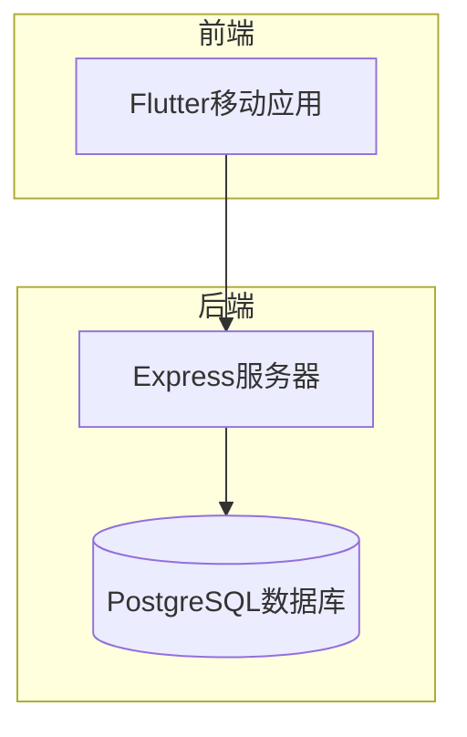
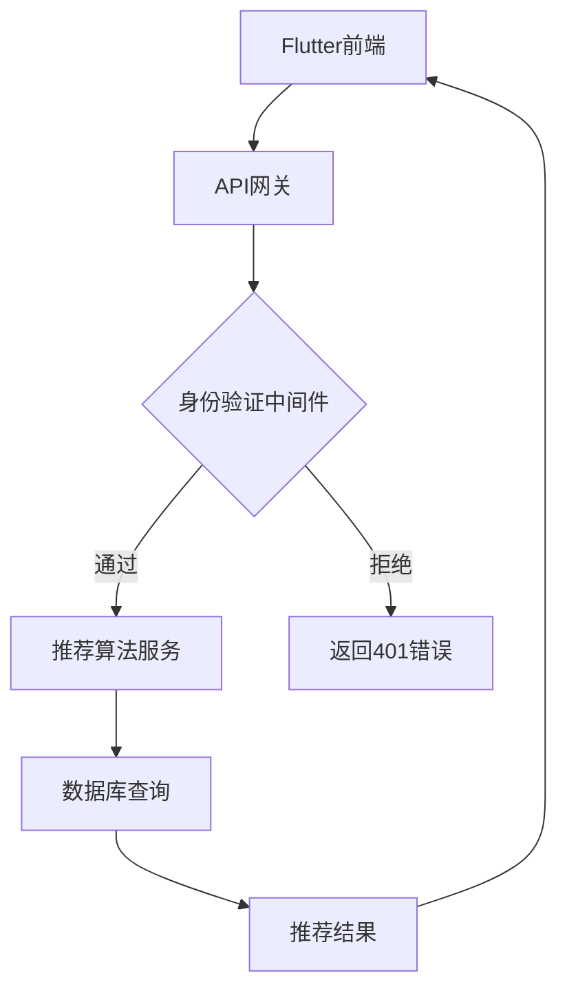
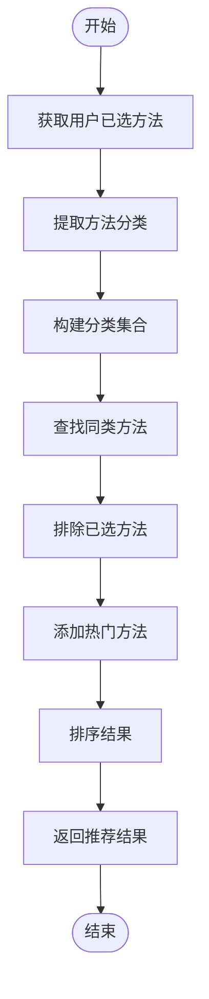
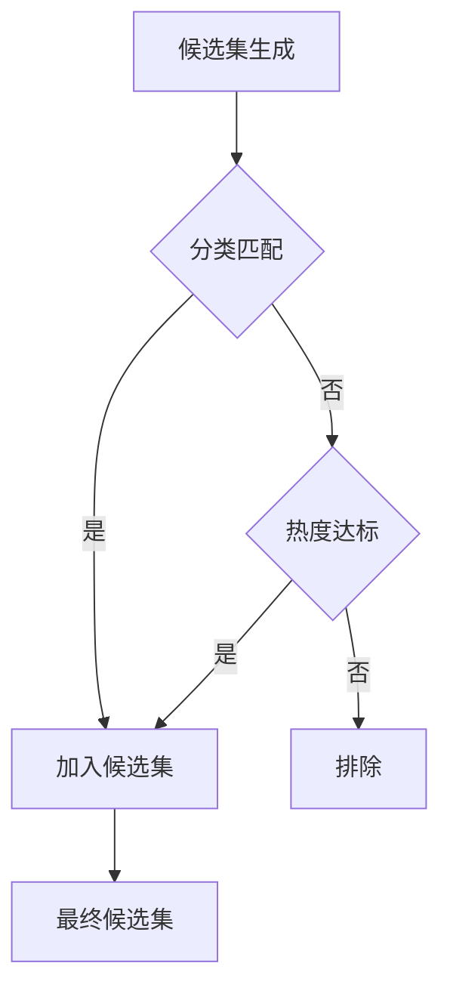
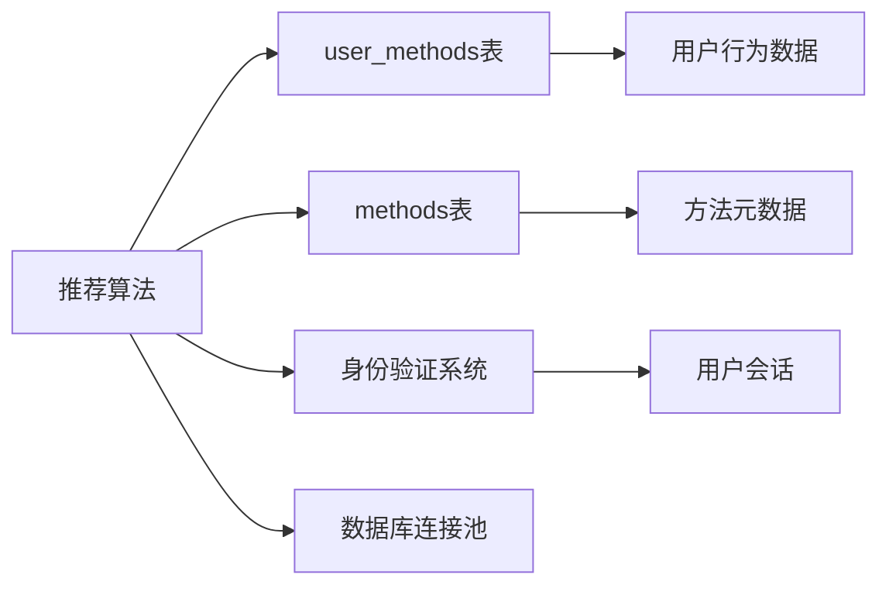

# 推荐算法实现

<cite>
**本文档引用的文件**
- [userMethod.controller.ts](file://backend/src/controllers/userMethod.controller.ts)
- [method.controller.ts](file://backend/src/controllers/method.controller.ts)
- [init.sql](file://database/init.sql)
- [types/index.ts](file://backend/src/types/index.ts)
</cite>

## 目录
1. [简介](#简介)
2. [项目结构](#项目结构)
3. [核心组件](#核心组件)
4. [架构概述](#架构概述)
5. [详细组件分析](#详细组件分析)
6. [依赖分析](#依赖分析)
7. [性能考虑](#性能考虑)
8. [故障排除指南](#故障排除指南)
9. [结论](#结论)
10. [附录](#附录)（如有必要）

## 简介
本文档深入解析了用户方法推荐算法的实现机制，重点说明了基于用户历史行为的协同过滤与内容相似度计算的具体实现方式。系统通过分析用户已添加的方法，结合方法分类和热度数据，为用户提供个性化的心理自助方法推荐。推荐算法综合考虑了用户偏好、方法热度和内容相似度等多个维度，实现了有效的个性化推荐。

## 项目结构
本项目采用前后端分离的架构设计，后端使用Node.js + Express框架，前端为Flutter移动应用。推荐算法的核心逻辑位于后端控制器中，通过REST API为前端提供推荐数据。



**图表来源**
- [userMethod.controller.ts](file://backend/src/controllers/userMethod.controller.ts)
- [method.controller.ts](file://backend/src/controllers/method.controller.ts)

**章节来源**
- [userMethod.controller.ts](file://backend/src/controllers/userMethod.controller.ts)
- [method.controller.ts](file://backend/src/controllers/method.controller.ts)

## 核心组件
推荐算法的核心组件包括用户方法控制器、方法控制器和数据库模型。系统通过`getRecommendedMethods`函数实现推荐逻辑，基于用户已选方法的分类特征进行相似方法推荐。算法同时考虑了方法的热度指标（select_count），确保新用户也能获得有效的推荐结果。

**章节来源**
- [method.controller.ts](file://backend/src/controllers/method.controller.ts#L100-L136)
- [userMethod.controller.ts](file://backend/src/controllers/userMethod.controller.ts)

## 架构概述
系统采用典型的三层架构：表现层（Flutter前端）、业务逻辑层（Express控制器）和数据访问层（PostgreSQL数据库）。推荐功能通过API路由暴露，经过身份验证后执行推荐算法逻辑。



**图表来源**
- [method.controller.ts](file://backend/src/controllers/method.controller.ts#L100-L136)
- [userMethod.routes.ts](file://backend/src/routes/userMethod.routes.ts)

## 详细组件分析

### 推荐算法分析
推荐算法基于用户历史行为数据，通过SQL查询实现协同过滤和内容相似度计算。系统首先获取用户已添加方法的分类集合，然后推荐相同分类的其他方法，同时包含高热度方法作为补充。

#### 特征向量构建
系统使用方法分类作为主要特征向量，通过用户已选方法的分类分布构建用户偏好模型。每个方法的分类属性构成了内容特征的基础。



**图表来源**
- [method.controller.ts](file://backend/src/controllers/method.controller.ts#L100-L136)
- [init.sql](file://database/init.sql#L19-L36)

#### 相似度计算
系统采用基于分类匹配的相似度计算方法，属于内容相似度的一种简化形式。如果候选方法的分类在用户偏好分类集合中，则认为具有高相似度。

```sql
-- 分类匹配条件
m.category IN (
    SELECT DISTINCT me.category 
    FROM user_methods um 
    JOIN methods me ON um.method_id = me.id 
    WHERE um.user_id = $1
)
```

**章节来源**
- [method.controller.ts](file://backend/src/controllers/method.controller.ts#L119-L124)

#### 候选集生成
候选集生成策略结合了协同过滤和热度推荐两种方法。系统首先基于用户历史行为生成个性化候选集，然后补充高热度方法，确保推荐多样性。



**图表来源**
- [method.controller.ts](file://backend/src/controllers/method.controller.ts#L118-L126)
- [init.sql](file://database/init.sql#L30-L31)

#### 加权排序机制
推荐结果采用复合排序策略，优先考虑热度（select_count）和新鲜度（published_at）。这种加权排序机制平衡了个性化和流行度两个维度。

```sql
-- 排序规则
ORDER BY m.select_count DESC, m.published_at DESC
```

**章节来源**
- [method.controller.ts](file://backend/src/controllers/method.controller.ts#L127-L128)

#### 冷启动问题应对
系统通过"或"条件处理算法冷启动问题。对于新用户或数据稀疏用户，系统会推荐选择次数超过10的热门方法，确保所有用户都能获得有效推荐。

```sql
-- 冷启动解决方案
OR m.select_count > 10
```

**章节来源**
- [method.controller.ts](file://backend/src/controllers/method.controller.ts#L125-L126)

## 依赖分析
推荐算法依赖于多个核心组件和数据表，形成了紧密的依赖关系网络。



**图表来源**
- [method.controller.ts](file://backend/src/controllers/method.controller.ts#L100-L136)
- [init.sql](file://database/init.sql)

**章节来源**
- [method.controller.ts](file://backend/src/controllers/method.controller.ts)
- [init.sql](file://database/init.sql)

## 性能考虑
推荐算法的性能表现良好，主要得益于数据库索引优化和简单的查询逻辑。系统在methods表的status、category等字段上建立了索引，确保查询效率。对于未来可能的性能优化，可以考虑引入Redis缓存热门推荐结果。

## 故障排除指南
当推荐功能出现问题时，应首先检查用户身份验证状态和数据库连接。常见的问题包括：用户未登录导致401错误、数据库查询超时、推荐结果为空等。建议通过查看API响应码和日志来定位具体问题。

**章节来源**
- [method.controller.ts](file://backend/src/controllers/method.controller.ts#L105-L107)
- [userMethod.controller.ts](file://backend/src/controllers/userMethod.controller.ts#L11-L13)

## 结论
当前的推荐算法实现了基于用户历史行为的个性化推荐，采用了简单有效的协同过滤和内容相似度计算方法。系统通过分类匹配和热度补充的策略，较好地解决了冷启动问题。未来可扩展的方向包括：引入更复杂的相似度计算（如余弦相似度）、增加用户画像维度、实现A/B测试框架等。