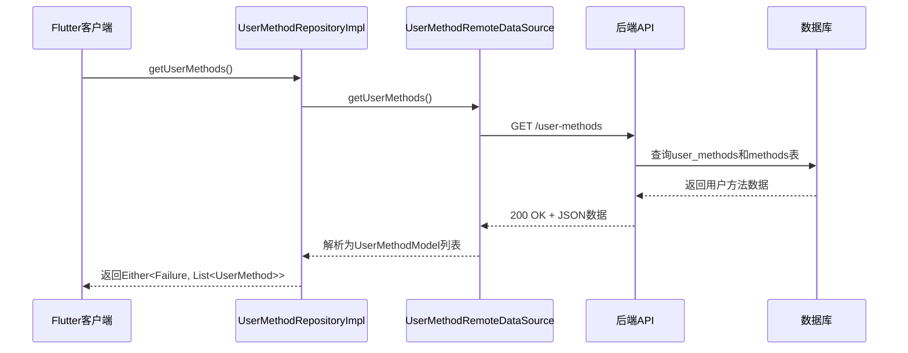
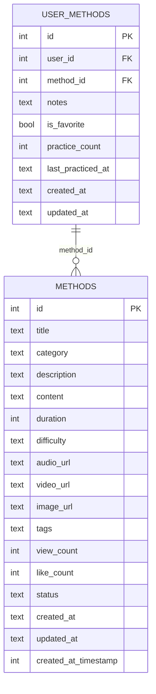

# 推荐结果交付与缓存

<cite>
**本文档引用文件**  
- [userMethod.controller.ts](file://backend/src/controllers/userMethod.controller.ts)
- [method.controller.ts](file://backend/src/controllers/method.controller.ts)
- [user_method_repository_impl.dart](file://flutter_app/lib/data/repositories/user_method_repository_impl.dart)
- [database_helper.dart](file://flutter_app/lib/core/storage/database_helper.dart)
- [init.sql](file://database/init.sql)
- [api_constants.dart](file://flutter_app/lib/config/api_constants.dart)
</cite>

## 目录
1. [推荐结果封装格式与HTTP响应结构](#推荐结果封装格式与http响应结构)
2. [错误处理机制](#错误处理机制)
3. [客户端本地缓存策略](#客户端本地缓存策略)
4. [离线可用性设计](#离线可用性设计)
5. [前后端数据同步协作模式](#前后端数据同步协作模式)
6. [推荐结果多样性控制](#推荐结果多样性控制)
7. [性能优化与用户体验平衡](#性能优化与用户体验平衡)

## 推荐结果封装格式与HTTP响应结构

推荐结果通过 `/methods/recommend` 接口提供，该接口返回标准化的JSON响应结构。响应体包含 `success` 标志位和 `data` 字段，其中 `data` 为推荐方法的数组。每个推荐方法对象包含ID、标题、描述、分类、难度、持续时间、封面图片URL和选择次数等核心属性。

后端使用 `getRecommendedMethods` 控制器函数处理推荐请求，基于用户已选方法的分类进行相似推荐，并排除用户已添加的方法。推荐结果按选择次数降序和发布时间降序排列，支持通过 `limit` 查询参数控制返回数量，默认返回5条。



**图示来源**  
- [user_method_repository_impl.dart](file://flutter_app/lib/data/repositories/user_method_repository_impl.dart#L15-L25)
- [userMethod.controller.ts](file://backend/src/controllers/userMethod.controller.ts#L58-L80)

**本节来源**  
- [method.controller.ts](file://backend/src/controllers/method.controller.ts#L100-L136)
- [api_constants.dart](file://flutter_app/lib/config/api_constants.dart#L17)

## 错误处理机制

系统采用分层错误处理机制，确保错误信息的准确传递和用户友好展示。后端使用 `AppError` 类封装错误，包含状态码、错误代码和消息。常见错误包括认证失败（401）、参数验证错误（400）、资源未找到（404）和重复条目（409）。

前端通过Dart的 `Either<Failure, T>` 类型安全地处理结果，将网络异常、服务器异常和其他异常分别转换为 `NetworkFailure`、`ServerFailure` 和 `UnknownFailure`。在 `UserMethodRepositoryImpl` 中，每个方法都包含完整的异常捕获逻辑，确保不会抛出未处理的异常。

```mermaid
flowchart TD
A[API请求] --> B{响应成功?}
B --> |是| C[解析数据]
B --> |否| D{错误类型}
D --> E[DioException]
E --> F{响应是否存在?}
F --> |是| G[ServerException]
F --> |否| H{超时类型?}
H --> |是| I[TimeoutException]
H --> |否| J[NetworkException]
G --> K[ServerFailure]
I --> L[NetworkFailure]
J --> M[NetworkFailure]
K --> N[返回Left(Failure)]
L --> N
M --> N
C --> O[返回Right(Data)]
```

**图示来源**  
- [user_method_repository_impl.dart](file://flutter_app/lib/data/repositories/user_method_repository_impl.dart#L16-L25)
- [user_method_remote_data_source.dart](file://flutter_app/lib/data/datasources/remote/user_method_remote_data_source.dart#L71-L84)

**本节来源**  
- [userMethod.controller.ts](file://backend/src/controllers/userMethod.controller.ts#L3-L4)
- [user_method_repository_impl.dart](file://flutter_app/lib/data/repositories/user_method_repository_impl.dart#L14-L25)

## 客户端本地缓存策略

Flutter客户端采用SQLite数据库进行本地缓存，通过 `DatabaseHelper` 管理数据库连接和表结构。系统创建了 `methods`、`user_methods` 和 `practice_records` 三张核心表，分别缓存方法数据、用户方法关联和练习记录。

缓存时效性通过应用启动时的数据同步机制控制。当用户登录或刷新数据时，客户端会从服务器获取最新数据并更新本地数据库。缓存更新触发条件包括：应用启动、用户手动刷新、添加/更新/删除方法操作后。



**图示来源**  
- [database_helper.dart](file://flutter_app/lib/core/storage/database_helper.dart#L64-L113)
- [init.sql](file://database/init.sql#L44-L56)

**本节来源**  
- [database_helper.dart](file://flutter_app/lib/core/storage/database_helper.dart#L63-L113)
- [init.sql](file://database/init.sql#L43-L56)

## 离线可用性设计

系统通过本地数据库缓存实现离线可用性。所有核心数据（方法信息、用户方法库、练习记录）都存储在设备本地的SQLite数据库中。当网络不可用时，应用自动切换到离线模式，从本地数据库读取数据。

离线操作支持包括：查看已缓存的方法列表、查看个人方法库、记录练习（暂存本地）。当网络恢复时，系统自动同步本地变更到服务器。`DatabaseHelper` 提供了完整的CRUD操作接口，确保离线数据的一致性和完整性。

**本节来源**  
- [database_helper.dart](file://flutter_app/lib/core/storage/database_helper.dart#L169-L177)
- [user_method_repository_impl.dart](file://flutter_app/lib/data/repositories/user_method_repository_impl.dart#L15-L25)

## 前后端数据同步协作模式

系统采用基于HTTP轮询的同步机制，而非长连接或事件驱动。主要同步场景包括：
1. 应用启动时自动同步用户方法库
2. 用户手动下拉刷新
3. 执行增删改操作后立即同步

同步过程为单向推拉模式：写操作由客户端发起，通过API推送到服务器；读操作由客户端主动拉取服务器最新数据。这种设计简化了系统复杂性，避免了实时同步的维护成本。

**本节来源**  
- [user_method_repository_impl.dart](file://flutter_app/lib/data/repositories/user_method_repository_impl.dart#L14-L82)
- [userMethod.controller.ts](file://backend/src/controllers/userMethod.controller.ts#L7-L161)

## 推荐结果多样性控制

推荐算法通过多种机制防止内容过度集中：
1. **排除已选方法**：使用 `NOT IN` 子查询排除用户已添加的方法
2. **分类多样性**：基于用户已选方法的多个分类进行推荐
3. **热度补充**：引入选择次数大于10的热门方法作为补充推荐
4. **排序策略**：结合选择次数和发布时间进行综合排序

后端 `getRecommendedMethods` 函数实现了这些控制逻辑，确保推荐结果既有个性化相关性，又具备足够的多样性。

**本节来源**  
- [method.controller.ts](file://backend/src/controllers/method.controller.ts#L109-L128)
- [init.sql](file://database/init.sql#L30-L31)

## 性能优化与用户体验平衡

系统通过以下实践平衡性能与用户体验：
1. **分页加载**：方法列表接口支持分页，减少单次数据传输量
2. **本地缓存**：减少网络请求频率，提升响应速度
3. **索引优化**：数据库关键字段建立索引，提高查询效率
4. **错误降级**：网络异常时展示缓存数据，保证基本功能可用

API响应示例：
```json
{
  "success": true,
  "data": {
    "list": [
      {
        "id": 1,
        "title": "深呼吸放松法",
        "category": "放松技巧",
        "difficulty": "入门",
        "duration_minutes": 10,
        "cover_image_url": "https://example.com/image.jpg",
        "select_count": 25
      }
    ],
    "total": 1,
    "page": 1,
    "pageSize": 20
  }
}
```

客户端缓存代码路径：
- [database_helper.dart](file://flutter_app/lib/core/storage/database_helper.dart#L64-L113)
- [user_method_repository_impl.dart](file://flutter_app/lib/data/repositories/user_method_repository_impl.dart#L15-L25)

**本节来源**  
- [method.controller.ts](file://backend/src/controllers/method.controller.ts#L6-L73)
- [user_method_repository_impl.dart](file://flutter_app/lib/data/repositories/user_method_repository_impl.dart#L15-L25)