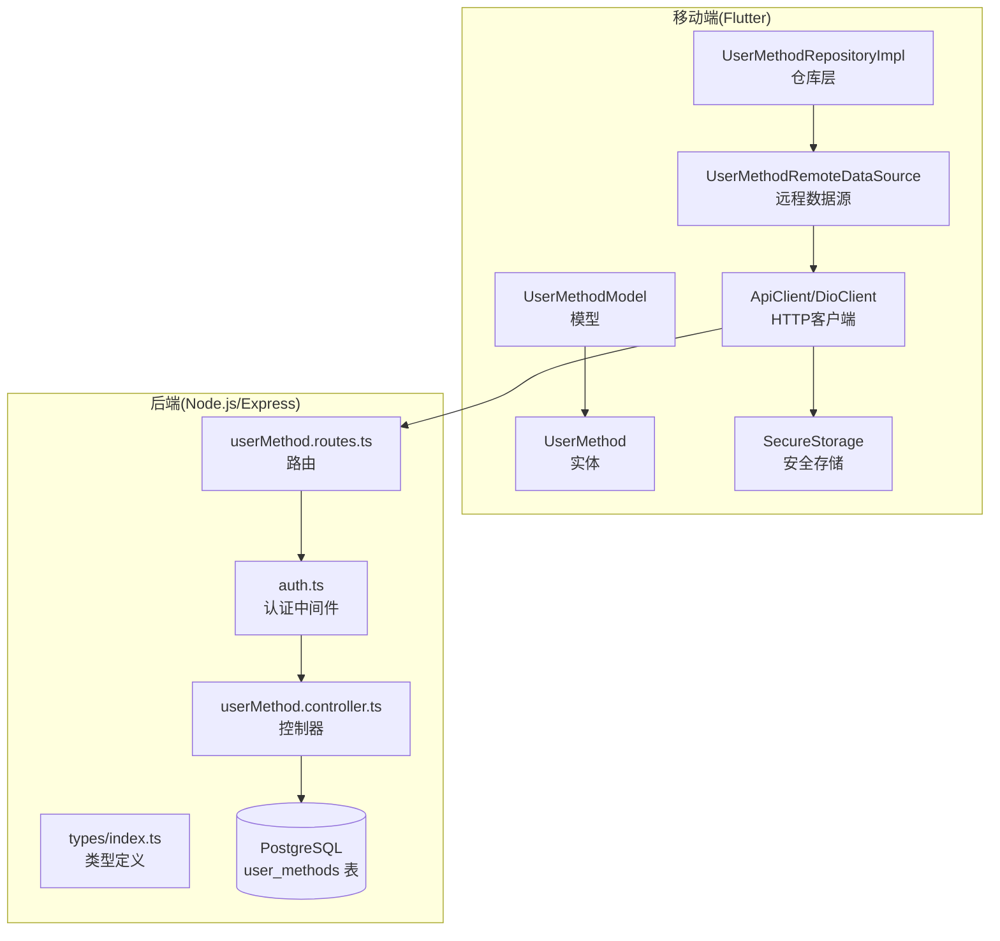
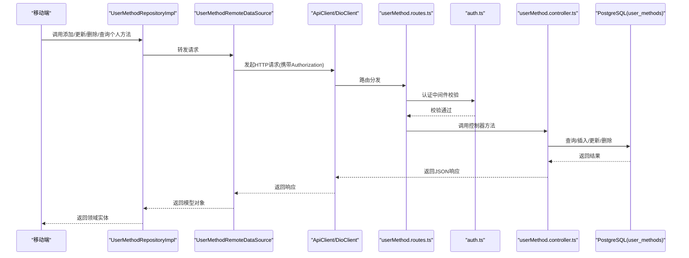
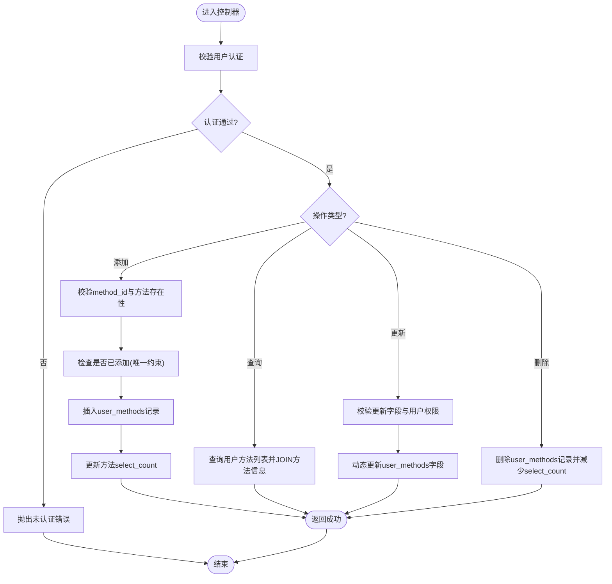
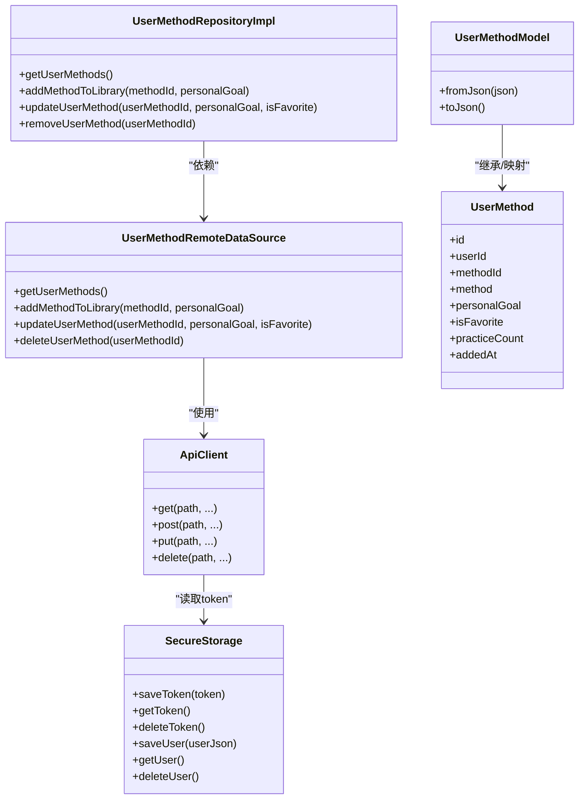
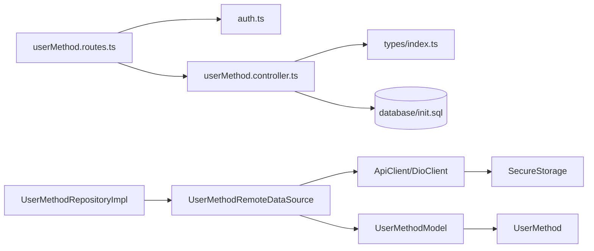

# 用户偏好数据采集

<cite>
**本文引用的文件**
- [backend/src/controllers/userMethod.controller.ts](file://backend/src/controllers/userMethod.controller.ts)
- [backend/src/routes/userMethod.routes.ts](file://backend/src/routes/userMethod.routes.ts)
- [backend/src/middleware/auth.ts](file://backend/src/middleware/auth.ts)
- [backend/src/middleware/errorHandler.ts](file://backend/src/middleware/errorHandler.ts)
- [backend/src/types/index.ts](file://backend/src/types/index.ts)
- [database/init.sql](file://database/init.sql)
- [flutter_app/lib/data/repositories/user_method_repository_impl.dart](file://flutter_app/lib/data/repositories/user_method_repository_impl.dart)
- [flutter_app/lib/data/datasources/remote/user_method_remote_data_source.dart](file://flutter_app/lib/data/datasources/remote/user_method_remote_data_source.dart)
- [flutter_app/lib/data/models/user_method_model.dart](file://flutter_app/lib/data/models/user_method_model.dart)
- [flutter_app/lib/domain/entities/user_method.dart](file://flutter_app/lib/domain/entities/user_method.dart)
- [flutter_app/lib/data/api/api_client.dart](file://flutter_app/lib/data/api/api_client.dart)
- [flutter_app/lib/config/api_constants.dart](file://flutter_app/lib/config/api_constants.dart)
- [flutter_app/lib/data/storage/secure_storage.dart](file://flutter_app/lib/data/storage/secure_storage.dart)
</cite>

## 目录
1. [简介](#简介)
2. [项目结构](#项目结构)
3. [核心组件](#核心组件)
4. [架构总览](#架构总览)
5. [详细组件分析](#详细组件分析)
6. [依赖关系分析](#依赖关系分析)
7. [性能考量](#性能考量)
8. [故障排查指南](#故障排查指南)
9. [结论](#结论)
10. [附录](#附录)

## 简介
本文件围绕后端控制器 userMethod.controller.ts 中实现的“用户偏好数据采集”机制进行系统化梳理，重点覆盖以下方面：
- 用户选择行为的捕获时机与触发路径
- 数据字段定义（如方法ID、选择频率、使用时长等）
- 数据持久化流程与数据库约束
- 通过 userMethod.routes.ts 暴露的 API 端点如何被移动端调用
- 数据采集的完整性与一致性保障措施
- 结合 Flutter 端 UserMethodRepositoryImpl 的事件上报异步处理与错误重试策略
- 实际代码示例的路径定位与请求处理逻辑说明
- 数据隐私合规性处理方案建议

## 项目结构
本项目采用前后端分离架构，用户偏好数据采集主要涉及后端 Express 控制器与路由层、数据库层，以及前端 Flutter 应用的数据源与仓库层。关键文件分布如下：
- 后端：控制器与路由负责接收移动端请求、执行业务校验与持久化；数据库初始化脚本定义了 user_methods 表及索引。
- 前端：仓库层封装对远程数据源的调用；远程数据源通过 DioClient 发起 HTTP 请求；模型层负责 JSON 与实体之间的转换。

图表来源
- [backend/src/routes/userMethod.routes.ts](file://backend/src/routes/userMethod.routes.ts#L1-L23)
- [backend/src/controllers/userMethod.controller.ts](file://backend/src/controllers/userMethod.controller.ts#L1-L162)
- [backend/src/middleware/auth.ts](file://backend/src/middleware/auth.ts#L1-L87)
- [backend/src/types/index.ts](file://backend/src/types/index.ts#L1-L126)
- [database/init.sql](file://database/init.sql#L43-L61)
- [flutter_app/lib/data/repositories/user_method_repository_impl.dart](file://flutter_app/lib/data/repositories/user_method_repository_impl.dart#L1-L84)
- [flutter_app/lib/data/datasources/remote/user_method_remote_data_source.dart](file://flutter_app/lib/data/datasources/remote/user_method_remote_data_source.dart#L1-L86)
- [flutter_app/lib/data/models/user_method_model.dart](file://flutter_app/lib/data/models/user_method_model.dart#L1-L89)
- [flutter_app/lib/domain/entities/user_method.dart](file://flutter_app/lib/domain/entities/user_method.dart#L1-L59)
- [flutter_app/lib/data/api/api_client.dart](file://flutter_app/lib/data/api/api_client.dart#L1-L207)
- [flutter_app/lib/data/storage/secure_storage.dart](file://flutter_app/lib/data/storage/secure_storage.dart#L1-L46)

章节来源
- [backend/src/routes/userMethod.routes.ts](file://backend/src/routes/userMethod.routes.ts#L1-L23)
- [backend/src/controllers/userMethod.controller.ts](file://backend/src/controllers/userMethod.controller.ts#L1-L162)
- [database/init.sql](file://database/init.sql#L43-L61)
- [flutter_app/lib/data/repositories/user_method_repository_impl.dart](file://flutter_app/lib/data/repositories/user_method_repository_impl.dart#L1-L84)
- [flutter_app/lib/data/datasources/remote/user_method_remote_data_source.dart](file://flutter_app/lib/data/datasources/remote/user_method_remote_data_source.dart#L1-L86)

## 核心组件
- 后端控制器 userMethod.controller.ts
  - 提供添加个人方法、获取个人方法列表、更新个人方法、删除个人方法四个核心接口。
  - 在添加个人方法时，会校验方法存在性与用户认证，避免重复添加，并更新方法的选择计数。
  - 在删除个人方法时，会减少方法的选择计数，保证计数非负。
- 后端路由 userMethod.routes.ts
  - 所有路由均通过认证中间件，确保仅登录用户可访问。
  - 定义了 POST /、GET /、PUT /:id、DELETE /:id 四个端点。
- 类型定义 types/index.ts
  - 定义了 UserMethod 接口，包含用户方法关联表中的关键字段：id、user_id、method_id、selected_at、target_count、completed_count、total_duration_minutes、continuous_days、last_practice_at、is_favorite。
- 数据库初始化 init.sql
  - user_methods 表包含上述字段，并设置 user_id 与 method_id 的唯一性约束，防止重复添加。
  - 提供索引优化查询性能。
- 前端仓库与数据源
  - UserMethodRepositoryImpl 将远程调用结果映射为领域实体，统一处理异常。
  - UserMethodRemoteDataSource 通过 DioClient 调用后端 API，构造请求参数并解析响应。
  - UserMethodModel 与 UserMethod 实体之间进行 JSON 转换。

章节来源
- [backend/src/controllers/userMethod.controller.ts](file://backend/src/controllers/userMethod.controller.ts#L1-L162)
- [backend/src/routes/userMethod.routes.ts](file://backend/src/routes/userMethod.routes.ts#L1-L23)
- [backend/src/types/index.ts](file://backend/src/types/index.ts#L37-L49)
- [database/init.sql](file://database/init.sql#L43-L61)
- [flutter_app/lib/data/repositories/user_method_repository_impl.dart](file://flutter_app/lib/data/repositories/user_method_repository_impl.dart#L1-L84)
- [flutter_app/lib/data/datasources/remote/user_method_remote_data_source.dart](file://flutter_app/lib/data/datasources/remote/user_method_remote_data_source.dart#L1-L86)
- [flutter_app/lib/data/models/user_method_model.dart](file://flutter_app/lib/data/models/user_method_model.dart#L1-L89)
- [flutter_app/lib/domain/entities/user_method.dart](file://flutter_app/lib/domain/entities/user_method.dart#L1-L59)

## 架构总览
用户偏好数据采集的端到端流程如下：
- 移动端通过仓库层发起请求，远程数据源调用后端 API。
- 后端路由层进行认证校验，控制器执行业务逻辑并访问数据库。
- 数据库层维护 user_methods 表，确保数据完整性与一致性。
- 响应返回移动端，模型层完成 JSON 到实体的转换。

图表来源
- [flutter_app/lib/data/repositories/user_method_repository_impl.dart](file://flutter_app/lib/data/repositories/user_method_repository_impl.dart#L1-L84)
- [flutter_app/lib/data/datasources/remote/user_method_remote_data_source.dart](file://flutter_app/lib/data/datasources/remote/user_method_remote_data_source.dart#L1-L86)
- [flutter_app/lib/data/api/api_client.dart](file://flutter_app/lib/data/api/api_client.dart#L1-L207)
- [backend/src/routes/userMethod.routes.ts](file://backend/src/routes/userMethod.routes.ts#L1-L23)
- [backend/src/middleware/auth.ts](file://backend/src/middleware/auth.ts#L1-L87)
- [backend/src/controllers/userMethod.controller.ts](file://backend/src/controllers/userMethod.controller.ts#L1-L162)
- [database/init.sql](file://database/init.sql#L43-L61)

## 详细组件分析

### 后端控制器：用户偏好数据采集与持久化
- 添加个人方法
  - 校验用户认证与 method_id 必填。
  - 校验方法存在且状态为 published。
  - 避免重复添加（唯一约束）。
  - 插入 user_methods 记录并更新 methods 的 select_count。
- 获取个人方法列表
  - 通过 JOIN 返回用户方法及其关联方法的元信息，按 selected_at 降序排列。
- 更新个人方法
  - 支持动态更新字段（如 target_count、is_favorite），并校验用户权限。
- 删除个人方法
  - 校验用户权限，删除记录并减少方法的选择计数，保证非负。

图表来源
- [backend/src/controllers/userMethod.controller.ts](file://backend/src/controllers/userMethod.controller.ts#L1-L162)
- [database/init.sql](file://database/init.sql#L43-L61)

章节来源
- [backend/src/controllers/userMethod.controller.ts](file://backend/src/controllers/userMethod.controller.ts#L1-L162)
- [database/init.sql](file://database/init.sql#L43-L61)

### 后端路由与认证
- 路由层
  - 使用 authenticateUser 中间件保护所有端点。
  - 定义四类端点：POST /（添加）、GET /（查询）、PUT /:id（更新）、DELETE /:id（删除）。
- 认证中间件
  - 从 Authorization 头提取 Bearer Token 并验证有效性。
  - 将用户信息注入到请求上下文中，供控制器使用。

章节来源
- [backend/src/routes/userMethod.routes.ts](file://backend/src/routes/userMethod.routes.ts#L1-L23)
- [backend/src/middleware/auth.ts](file://backend/src/middleware/auth.ts#L1-L87)

### 数据模型与类型定义
- 后端类型 UserMethod
  - 字段：id、user_id、method_id、selected_at、target_count、completed_count、total_duration_minutes、continuous_days、last_practice_at、is_favorite。
- 前端实体 UserMethod
  - 字段：id、userId、methodId、method、personalGoal、isFavorite、practiceCount、addedAt。
- 模型转换
  - UserMethodModel.fromJson 与 toJson 负责 JSON 与实体之间的序列化/反序列化。

章节来源
- [backend/src/types/index.ts](file://backend/src/types/index.ts#L37-L49)
- [flutter_app/lib/domain/entities/user_method.dart](file://flutter_app/lib/domain/entities/user_method.dart#L1-L59)
- [flutter_app/lib/data/models/user_method_model.dart](file://flutter_app/lib/data/models/user_method_model.dart#L1-L89)

### 数据库设计与约束
- user_methods 表
  - 主键：id
  - 外键：user_id 引用 users(id)，method_id 引用 methods(id)
  - 唯一性：(user_id, method_id)
  - 时间戳：selected_at，默认当前时间
  - 计数字段：target_count、completed_count、total_duration_minutes、continuous_days
  - 状态字段：is_favorite
- methods 表
  - select_count 字段用于统计方法被选择的次数，与 user_methods 关联。

章节来源
- [database/init.sql](file://database/init.sql#L43-L61)
- [database/init.sql](file://database/init.sql#L19-L36)

### 移动端调用链路与异步处理
- 仓库层
  - UserMethodRepositoryImpl 对远程调用进行统一封装，捕获网络异常与服务端异常并转换为 Failure。
- 远程数据源
  - UserMethodRemoteDataSource 通过 DioClient 发起请求，构造请求体（如 methodId、personalGoal、isFavorite），解析响应为 UserMethodModel。
- HTTP 客户端
  - ApiClient 在请求拦截器中自动附加 Authorization 头，处理 401 错误并清理本地 token。
- 安全存储
  - SecureStorage 负责 token 与用户信息的安全存储与读取。

图表来源
- [flutter_app/lib/data/repositories/user_method_repository_impl.dart](file://flutter_app/lib/data/repositories/user_method_repository_impl.dart#L1-L84)
- [flutter_app/lib/data/datasources/remote/user_method_remote_data_source.dart](file://flutter_app/lib/data/datasources/remote/user_method_remote_data_source.dart#L1-L86)
- [flutter_app/lib/data/api/api_client.dart](file://flutter_app/lib/data/api/api_client.dart#L1-L207)
- [flutter_app/lib/data/storage/secure_storage.dart](file://flutter_app/lib/data/storage/secure_storage.dart#L1-L46)
- [flutter_app/lib/data/models/user_method_model.dart](file://flutter_app/lib/data/models/user_method_model.dart#L1-L89)
- [flutter_app/lib/domain/entities/user_method.dart](file://flutter_app/lib/domain/entities/user_method.dart#L1-L59)

章节来源
- [flutter_app/lib/data/repositories/user_method_repository_impl.dart](file://flutter_app/lib/data/repositories/user_method_repository_impl.dart#L1-L84)
- [flutter_app/lib/data/datasources/remote/user_method_remote_data_source.dart](file://flutter_app/lib/data/datasources/remote/user_method_remote_data_source.dart#L1-L86)
- [flutter_app/lib/data/api/api_client.dart](file://flutter_app/lib/data/api/api_client.dart#L1-L207)
- [flutter_app/lib/data/storage/secure_storage.dart](file://flutter_app/lib/data/storage/secure_storage.dart#L1-L46)

### 数据字段定义与采集范围
- 用户选择行为的关键字段
  - 方法ID：method_id（后端 UserMethod 接口与数据库字段一致）
  - 选择时间：selected_at（默认当前时间）
  - 目标次数：target_count（可由移动端传入或默认值）
  - 完成次数：completed_count（初始为 0）
  - 总时长（分钟）：total_duration_minutes（初始为 0）
  - 连续天数：continuous_days（初始为 0）
  - 最近练习时间：last_practice_at（初始为空）
  - 收藏标记：is_favorite（布尔）
- 方法热度统计字段
  - methods.select_count：用于统计方法被选择的次数，与 user_methods 关联。

章节来源
- [backend/src/types/index.ts](file://backend/src/types/index.ts#L37-L49)
- [database/init.sql](file://database/init.sql#L43-L61)
- [database/init.sql](file://database/init.sql#L19-L36)

### 数据采集的完整性与一致性保障
- 唯一性约束
  - user_methods(user_id, method_id) 防止重复添加同一方法。
- 事务与原子性
  - 添加与更新方法选择计数在单次请求内完成，避免并发导致的计数不一致。
- 删除一致性
  - 删除 user_methods 记录时同步减少 methods.select_count，保证非负。
- 认证与授权
  - 所有端点均需认证，控制器进一步校验用户 ID 与资源归属，防止越权访问。
- 错误处理
  - 自定义 AppError 统一返回错误码与消息，便于前端处理。

章节来源
- [database/init.sql](file://database/init.sql#L43-L61)
- [backend/src/controllers/userMethod.controller.ts](file://backend/src/controllers/userMethod.controller.ts#L1-L162)
- [backend/src/middleware/auth.ts](file://backend/src/middleware/auth.ts#L1-L87)
- [backend/src/middleware/errorHandler.ts](file://backend/src/middleware/errorHandler.ts#L1-L97)

### 移动端事件上报与错误重试策略
- 异步处理
  - 仓库层使用 Future/Either 模式封装异步调用，避免阻塞主线程。
- 错误分类
  - 网络异常、服务端异常、未知异常分别映射为不同的 Failure 类型，便于 UI 层差异化提示。
- 重试策略建议
  - 基于 Dio 的超时与重试配置，可在 ApiClient 层增加 retry 与 exponential backoff。
  - 对于幂等操作（如添加/更新），可在仓库层实现有限次重试与去抖。
  - 对于非幂等操作（如删除），应谨慎重试并确保幂等键或去重策略。
- 401 处理
  - ApiClient 在拦截器中检测 401，自动清除本地 token 与用户信息，引导重新登录。

章节来源
- [flutter_app/lib/data/repositories/user_method_repository_impl.dart](file://flutter_app/lib/data/repositories/user_method_repository_impl.dart#L1-L84)
- [flutter_app/lib/data/datasources/remote/user_method_remote_data_source.dart](file://flutter_app/lib/data/datasources/remote/user_method_remote_data_source.dart#L1-L86)
- [flutter_app/lib/data/api/api_client.dart](file://flutter_app/lib/data/api/api_client.dart#L1-L207)

### 实际代码示例（路径定位）
- 添加个人方法
  - 路由：POST /user-methods
  - 控制器：addUserMethod
  - 参考路径：[backend/src/routes/userMethod.routes.ts](file://backend/src/routes/userMethod.routes.ts#L1-L23)、[backend/src/controllers/userMethod.controller.ts](file://backend/src/controllers/userMethod.controller.ts#L1-L56)
- 获取个人方法列表
  - 路由：GET /user-methods
  - 控制器：getUserMethods
  - 参考路径：[backend/src/routes/userMethod.routes.ts](file://backend/src/routes/userMethod.routes.ts#L1-L23)、[backend/src/controllers/userMethod.controller.ts](file://backend/src/controllers/userMethod.controller.ts#L58-L80)
- 更新个人方法
  - 路由：PUT /user-methods/:id
  - 控制器：updateUserMethod
  - 参考路径：[backend/src/routes/userMethod.routes.ts](file://backend/src/routes/userMethod.routes.ts#L1-L23)、[backend/src/controllers/userMethod.controller.ts](file://backend/src/controllers/userMethod.controller.ts#L82-L131)
- 删除个人方法
  - 路由：DELETE /user-methods/:id
  - 控制器：deleteUserMethod
  - 参考路径：[backend/src/routes/userMethod.routes.ts](file://backend/src/routes/userMethod.routes.ts#L1-L23)、[backend/src/controllers/userMethod.controller.ts](file://backend/src/controllers/userMethod.controller.ts#L133-L161)
- 移动端调用
  - 仓库：UserMethodRepositoryImpl
  - 远程数据源：UserMethodRemoteDataSource
  - 参考路径：[flutter_app/lib/data/repositories/user_method_repository_impl.dart](file://flutter_app/lib/data/repositories/user_method_repository_impl.dart#L1-L84)、[flutter_app/lib/data/datasources/remote/user_method_remote_data_source.dart](file://flutter_app/lib/data/datasources/remote/user_method_remote_data_source.dart#L1-L86)

## 依赖关系分析
- 后端
  - userMethod.routes.ts 依赖 authenticateUser 中间件与 userMethod.controller.ts 导出的控制器函数。
  - userMethod.controller.ts 依赖数据库连接池与自定义 AppError。
  - types/index.ts 为控制器与路由提供类型定义。
- 前端
  - UserMethodRepositoryImpl 依赖 UserMethodRemoteDataSource。
  - UserMethodRemoteDataSource 依赖 ApiClient 与 UserMethodModel。
  - ApiClient 依赖 SecureStorage 与 ApiConstants。

图表来源
- [backend/src/routes/userMethod.routes.ts](file://backend/src/routes/userMethod.routes.ts#L1-L23)
- [backend/src/middleware/auth.ts](file://backend/src/middleware/auth.ts#L1-L87)
- [backend/src/controllers/userMethod.controller.ts](file://backend/src/controllers/userMethod.controller.ts#L1-L162)
- [backend/src/types/index.ts](file://backend/src/types/index.ts#L1-L126)
- [database/init.sql](file://database/init.sql#L43-L61)
- [flutter_app/lib/data/repositories/user_method_repository_impl.dart](file://flutter_app/lib/data/repositories/user_method_repository_impl.dart#L1-L84)
- [flutter_app/lib/data/datasources/remote/user_method_remote_data_source.dart](file://flutter_app/lib/data/datasources/remote/user_method_remote_data_source.dart#L1-L86)
- [flutter_app/lib/data/api/api_client.dart](file://flutter_app/lib/data/api/api_client.dart#L1-L207)
- [flutter_app/lib/data/storage/secure_storage.dart](file://flutter_app/lib/data/storage/secure_storage.dart#L1-L46)
- [flutter_app/lib/data/models/user_method_model.dart](file://flutter_app/lib/data/models/user_method_model.dart#L1-L89)
- [flutter_app/lib/domain/entities/user_method.dart](file://flutter_app/lib/domain/entities/user_method.dart#L1-L59)

章节来源
- [backend/src/routes/userMethod.routes.ts](file://backend/src/routes/userMethod.routes.ts#L1-L23)
- [backend/src/controllers/userMethod.controller.ts](file://backend/src/controllers/userMethod.controller.ts#L1-L162)
- [backend/src/middleware/auth.ts](file://backend/src/middleware/auth.ts#L1-L87)
- [backend/src/types/index.ts](file://backend/src/types/index.ts#L1-L126)
- [database/init.sql](file://database/init.sql#L43-L61)
- [flutter_app/lib/data/repositories/user_method_repository_impl.dart](file://flutter_app/lib/data/repositories/user_method_repository_impl.dart#L1-L84)
- [flutter_app/lib/data/datasources/remote/user_method_remote_data_source.dart](file://flutter_app/lib/data/datasources/remote/user_method_remote_data_source.dart#L1-L86)
- [flutter_app/lib/data/api/api_client.dart](file://flutter_app/lib/data/api/api_client.dart#L1-L207)
- [flutter_app/lib/data/storage/secure_storage.dart](file://flutter_app/lib/data/storage/secure_storage.dart#L1-L46)

## 性能考量
- 数据库索引
  - user_methods(user_id)、method_id、selected_at 等索引有助于提升查询性能。
- 查询优化
  - 获取个人方法列表时使用 JOIN 与排序，建议在高并发场景下考虑分页与缓存。
- 并发控制
  - 添加与更新选择计数应尽量保持原子性，避免竞态条件。
- 网络层
  - ApiClient 的超时与重试策略应在移动端合理配置，避免频繁重试造成服务器压力。

[本节为通用指导，无需列出具体文件来源]

## 故障排查指南
- 常见错误与处理
  - 未认证：检查 Authorization 头是否正确传递 Bearer Token。
  - 参数校验失败：确认 method_id、更新字段等必填项。
  - 资源不存在：确认方法存在且状态为 published。
  - 重复添加：检查 user_methods 唯一性约束。
- 日志与错误码
  - 使用统一的 AppError 返回错误码与消息，便于前端定位问题。
- 401 自动清理
  - ApiClient 拦截器在 401 时自动清除本地 token 与用户信息，需引导用户重新登录。

章节来源
- [backend/src/middleware/errorHandler.ts](file://backend/src/middleware/errorHandler.ts#L1-L97)
- [backend/src/middleware/auth.ts](file://backend/src/middleware/auth.ts#L1-L87)
- [flutter_app/lib/data/api/api_client.dart](file://flutter_app/lib/data/api/api_client.dart#L1-L207)

## 结论
本机制通过后端控制器与路由层的严格校验、数据库层面的唯一性与计数一致性保障，以及移动端仓库层的统一异常处理与安全存储，构建了完整的用户偏好数据采集闭环。建议在移动端引入合理的重试与幂等策略，并持续优化数据库索引与查询性能，以满足高并发场景下的稳定性与一致性需求。

[本节为总结性内容，无需列出具体文件来源]

## 附录
- API 端点清单（移动端常用地）
  - GET /user-methods：获取个人方法列表
  - POST /user-methods：添加个人方法
  - PUT /user-methods/:id：更新个人方法
  - DELETE /user-methods/:id：删除个人方法
- 数据隐私合规性建议
  - 仅收集必要字段（如 method_id、selected_at、is_favorite 等），避免收集敏感个人信息。
  - 明确数据使用目的与期限，提供用户撤回同意与删除数据的权利。
  - 采用 HTTPS 传输与安全存储，定期审计日志与访问控制。
  - 在前端与后端均实现最小权限原则与输入校验，防止注入与越权。

章节来源
- [flutter_app/lib/config/api_constants.dart](file://flutter_app/lib/config/api_constants.dart#L1-L73)
- [flutter_app/lib/data/storage/secure_storage.dart](file://flutter_app/lib/data/storage/secure_storage.dart#L1-L46)