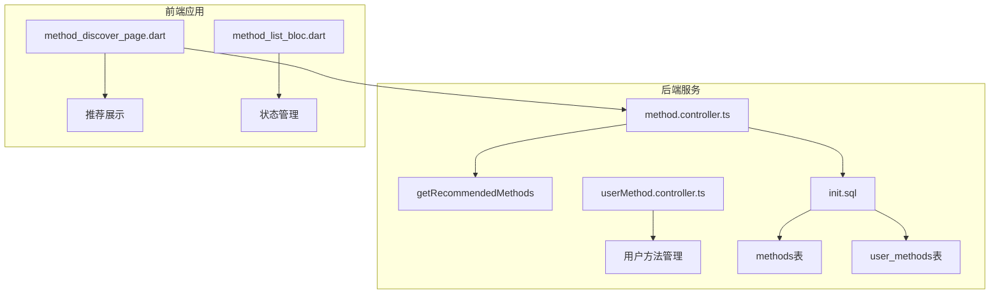
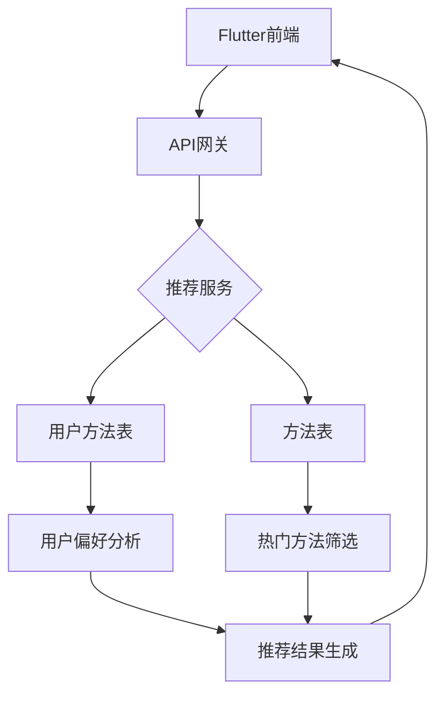
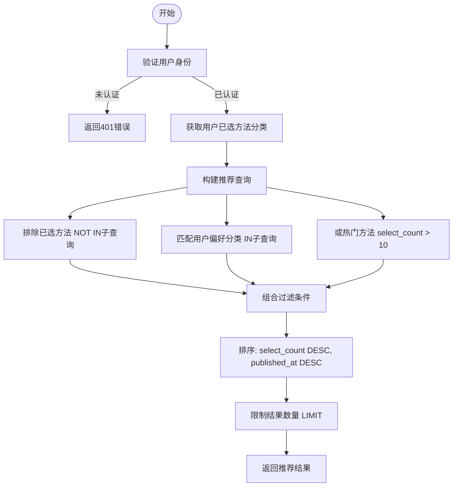
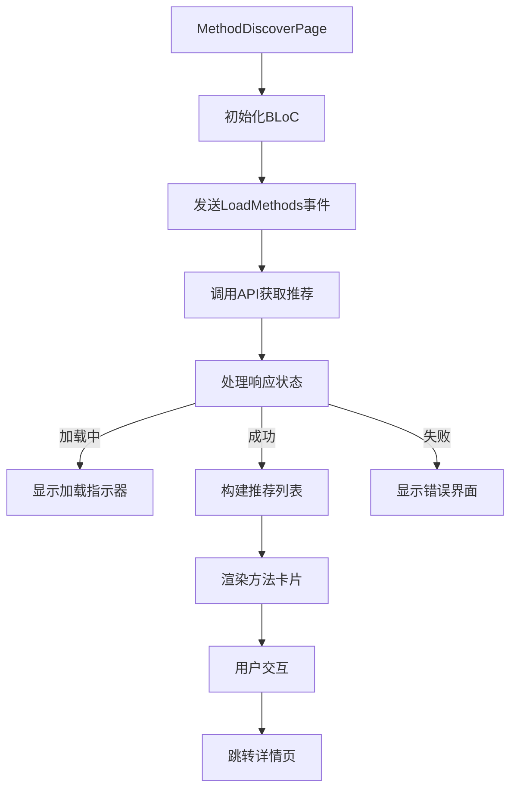
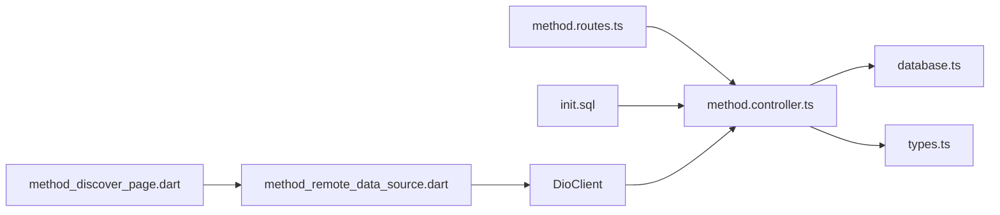

# 个性化推荐引擎

<cite>
**本文档引用的文件**  
- [method.controller.ts](file://backend/src/controllers/method.controller.ts#L100-L136)
- [method.routes.ts](file://backend/src/routes/method.routes.ts#L14)
- [init.sql](file://database/init.sql#L20-L56)
- [method_discover_page.dart](file://flutter_app/lib/presentation/methods/pages/method_discover_page.dart)
- [userMethod.controller.ts](file://backend/src/controllers/userMethod.controller.ts)
</cite>

## 目录
1. [简介](#简介)
2. [项目结构](#项目结构)
3. [核心组件](#核心组件)
4. [架构概览](#架构概览)
5. [详细组件分析](#详细组件分析)
6. [依赖分析](#依赖分析)
7. [性能考量](#性能考量)
8. [故障排除指南](#故障排除指南)
9. [结论](#结论)

## 简介
本文档深入解析基于用户行为的个性化推荐算法实现机制，重点分析 `getRecommendedMethods` 函数的推荐逻辑。系统通过分析用户已选择方法的分类特征，匹配相似分类的未选方法，并结合热门方法（选择次数 > 10）进行混合推荐。文档涵盖SQL查询中的多重条件过滤、排序策略、时间复杂度分析、数据库性能影响以及移动端推荐模块的展示场景和更新频率，最后讨论算法优化方向。

## 项目结构
本项目采用前后端分离架构，后端使用Node.js + Express + PostgreSQL，前端为Flutter移动端应用。推荐功能主要涉及后端控制器、数据库表结构和前端展示页面。

**图表来源**  
- [method.controller.ts](file://backend/src/controllers/method.controller.ts#L100-L136)
- [init.sql](file://database/init.sql#L20-L56)
- [method_discover_page.dart](file://flutter_app/lib/presentation/methods/pages/method_discover_page.dart)

## 核心组件
核心推荐功能由后端 `getRecommendedMethods` 函数实现，通过复杂的SQL查询实现个性化推荐逻辑。该函数结合用户偏好分类和热门方法进行混合推荐，确保推荐结果既个性化又具有普适价值。

**章节来源**  
- [method.controller.ts](file://backend/src/controllers/method.controller.ts#L100-L136)
- [init.sql](file://database/init.sql#L20-L56)

## 架构概览
系统采用三层架构：数据层（PostgreSQL）、业务逻辑层（Express控制器）和表现层（Flutter应用）。推荐引擎作为业务逻辑的核心组件，连接用户行为数据和前端展示。

**图表来源**  
- [method.controller.ts](file://backend/src/controllers/method.controller.ts#L100-L136)
- [init.sql](file://database/init.sql#L20-L56)

## 详细组件分析

### 推荐算法分析
推荐算法通过SQL查询实现复杂的推荐逻辑，包含多重条件过滤和排序策略。

#### 推荐逻辑流程图

**图表来源**  
- [method.controller.ts](file://backend/src/controllers/method.controller.ts#L100-L136)
- [init.sql](file://database/init.sql#L20-L56)

#### SQL查询分析
推荐算法的核心是复杂的SQL查询，包含以下关键要素：

**多重条件过滤机制**
- **NOT IN子查询**：排除用户已选择的方法，确保推荐结果的新颖性
- **IN子查询**：匹配用户偏好分类，实现个性化推荐
- **OR条件**：包含热门方法（选择次数>10），增加推荐多样性

**排序策略**
- 主排序：选择次数降序（`select_count DESC`），优先推荐热门方法
- 次排序：发布时间降序（`published_at DESC`），确保新方法有机会被推荐

**章节来源**  
- [method.controller.ts](file://backend/src/controllers/method.controller.ts#L110-L128)
- [init.sql](file://database/init.sql#L20-L56)

### 移动端展示分析
推荐结果在Flutter应用的发现页面进行展示，采用现代化的UI设计和流畅的交互体验。

#### 页面展示流程

**图表来源**  
- [method_discover_page.dart](file://flutter_app/lib/presentation/methods/pages/method_discover_page.dart)
- [method_list_bloc.dart](file://flutter_app/lib/presentation/methods/bloc/method_list_bloc.dart)

## 依赖分析
推荐系统涉及多个组件的协同工作，形成紧密的依赖关系。

**图表来源**  
- [method.controller.ts](file://backend/src/controllers/method.controller.ts)
- [method.routes.ts](file://backend/src/routes/method.routes.ts)
- [init.sql](file://database/init.sql)
- [method_discover_page.dart](file://flutter_app/lib/presentation/methods/pages/method_discover_page.dart)

**章节来源**  
- [method.controller.ts](file://backend/src/controllers/method.controller.ts#L100-L136)
- [method.routes.ts](file://backend/src/routes/method.routes.ts#L14)
- [method_discover_page.dart](file://flutter_app/lib/presentation/methods/pages/method_discover_page.dart)

## 性能考量
推荐算法的性能直接影响用户体验和系统负载，需要从多个维度进行评估。

### 时间复杂度分析
- **数据库查询复杂度**：O(log n) 到 O(n)，取决于索引使用情况
- **IN子查询复杂度**：O(m)，其中m为用户已选方法数量
- **整体复杂度**：受数据库优化器影响，通常为O(n log n)

### 数据库性能优化
- **索引优化**：在`methods`表的`status`、`category`、`select_count`字段上建立索引
- **查询缓存**：对热门推荐结果进行缓存，减少数据库压力
- **分页处理**：限制返回结果数量，避免大数据量查询

**章节来源**  
- [method.controller.ts](file://backend/src/controllers/method.controller.ts#L110-L128)
- [init.sql](file://database/init.sql#L38-L42)

## 故障排除指南
### 常见问题及解决方案
- **推荐结果为空**：检查用户是否已选择任何方法，确保有足够数据生成推荐
- **推荐结果不准确**：验证用户偏好分类是否正确提取，检查热门方法阈值设置
- **性能问题**：监控数据库查询执行计划，优化索引策略

**章节来源**  
- [method.controller.ts](file://backend/src/controllers/method.controller.ts#L100-L136)
- [init.sql](file://database/init.sql#L20-L56)

## 结论
当前推荐算法实现了基于用户偏好和热门趋势的混合推荐机制，通过精心设计的SQL查询实现了高效的推荐逻辑。系统在保证个性化的同时，也考虑了推荐结果的多样性和新颖性。未来可通过引入协同过滤或机器学习模型进一步提升推荐精准度，同时优化数据库查询性能，确保系统在高并发场景下的稳定性。