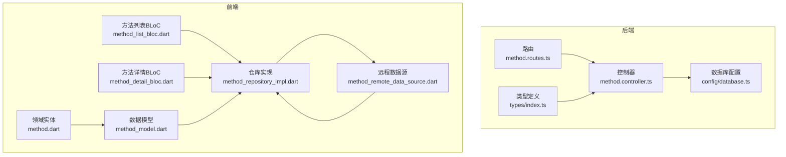
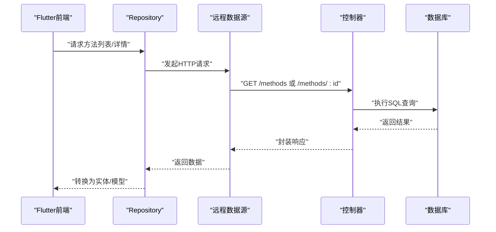
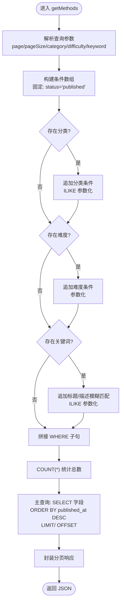
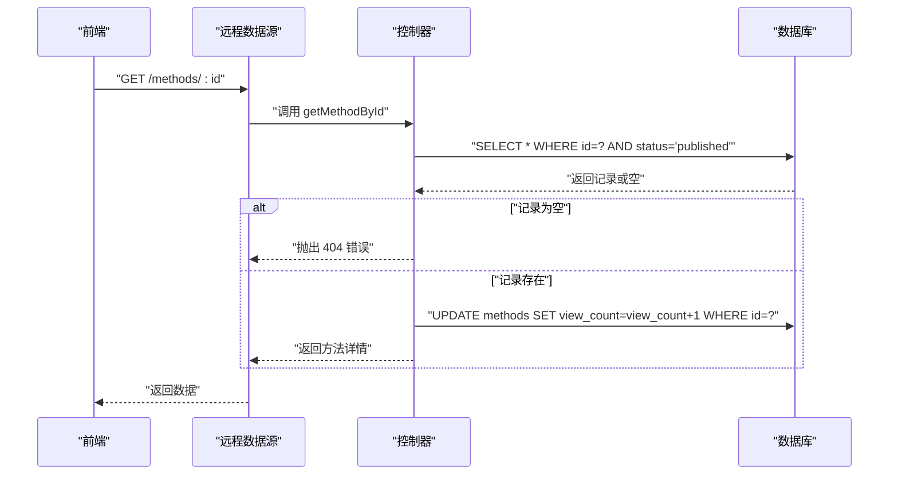
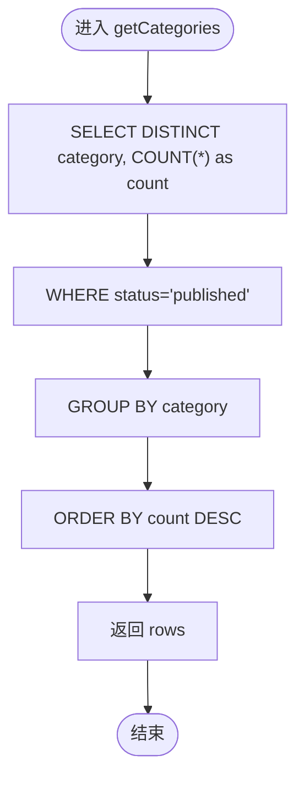
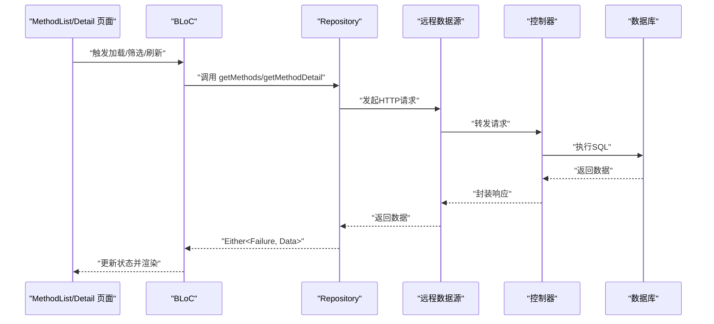
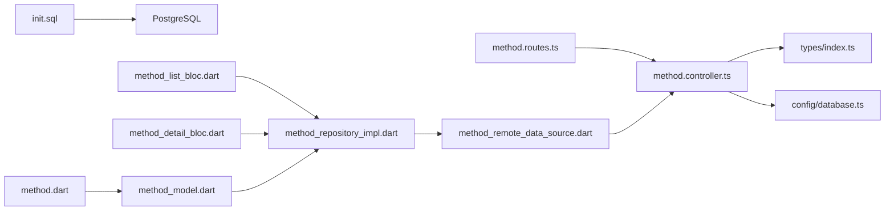

# 方法内容管理

<cite>
**本文引用的文件**
- [backend/src/controllers/method.controller.ts](file://backend/src/controllers/method.controller.ts)
- [backend/src/routes/method.routes.ts](file://backend/src/routes/method.routes.ts)
- [backend/src/types/index.ts](file://backend/src/types/index.ts)
- [backend/src/config/database.ts](file://backend/src/config/database.ts)
- [database/init.sql](file://database/init.sql)
- [flutter_app/lib/data/datasources/remote/method_remote_data_source.dart](file://flutter_app/lib/data/datasources/remote/method_remote_data_source.dart)
- [flutter_app/lib/data/repositories/method_repository_impl.dart](file://flutter_app/lib/data/repositories/method_repository_impl.dart)
- [flutter_app/lib/presentation/methods/bloc/method_list_bloc.dart](file://flutter_app/lib/presentation/methods/bloc/method_list_bloc.dart)
- [flutter_app/lib/presentation/methods/bloc/method_detail_bloc.dart](file://flutter_app/lib/presentation/methods/bloc/method_detail_bloc.dart)
- [flutter_app/lib/data/models/method_model.dart](file://flutter_app/lib/data/models/method_model.dart)
- [flutter_app/lib/domain/entities/method.dart](file://flutter_app/lib/domain/entities/method.dart)
</cite>

## 目录
1. [简介](#简介)
2. [项目结构](#项目结构)
3. [核心组件](#核心组件)
4. [架构总览](#架构总览)
5. [详细组件分析](#详细组件分析)
6. [依赖关系分析](#依赖关系分析)
7. [性能考量](#性能考量)
8. [故障排查指南](#故障排查指南)
9. [结论](#结论)
10. [附录](#附录)

## 简介
本文件围绕“心理调节方法”的内容管理机制进行深入解析，重点聚焦后端控制器 method.controller.ts 中的 getMethods、getMethodById 和 getCategories 三个方法的实现逻辑。文档将详细说明：
- 公开状态（published）方法的查询条件构建
- 分页参数处理策略
- 分类统计功能的 SQL 聚合实现
- 列表查询中动态 WHERE 子句的生成策略（分类、难度、关键词搜索的条件组合）
- 前端 MethodList 与 MethodDetail 页面与后端响应的数据结构映射关系
- 查询性能优化建议（索引设计与结果缓存）

## 项目结构
后端采用 Express + PostgreSQL 的架构，控制器负责处理 HTTP 请求，路由定义接口路径，类型定义统一了数据契约；前端 Flutter 通过 Repository/DataSource 抽象网络访问，并在 BLoC 中协调状态。

图表来源
- [backend/src/routes/method.routes.ts](file://backend/src/routes/method.routes.ts#L1-L20)
- [backend/src/controllers/method.controller.ts](file://backend/src/controllers/method.controller.ts#L1-L153)
- [backend/src/types/index.ts](file://backend/src/types/index.ts#L1-L126)
- [backend/src/config/database.ts](file://backend/src/config/database.ts#L1-L200)
- [flutter_app/lib/data/repositories/method_repository_impl.dart](file://flutter_app/lib/data/repositories/method_repository_impl.dart#L1-L74)
- [flutter_app/lib/data/datasources/remote/method_remote_data_source.dart](file://flutter_app/lib/data/datasources/remote/method_remote_data_source.dart#L1-L83)
- [flutter_app/lib/presentation/methods/bloc/method_list_bloc.dart](file://flutter_app/lib/presentation/methods/bloc/method_list_bloc.dart#L1-L133)
- [flutter_app/lib/presentation/methods/bloc/method_detail_bloc.dart](file://flutter_app/lib/presentation/methods/bloc/method_detail_bloc.dart#L1-L141)
- [flutter_app/lib/data/models/method_model.dart](file://flutter_app/lib/data/models/method_model.dart#L1-L54)
- [flutter_app/lib/domain/entities/method.dart](file://flutter_app/lib/domain/entities/method.dart#L1-L77)

章节来源
- [backend/src/routes/method.routes.ts](file://backend/src/routes/method.routes.ts#L1-L20)
- [backend/src/controllers/method.controller.ts](file://backend/src/controllers/method.controller.ts#L1-L153)
- [backend/src/types/index.ts](file://backend/src/types/index.ts#L1-L126)
- [flutter_app/lib/data/repositories/method_repository_impl.dart](file://flutter_app/lib/data/repositories/method_repository_impl.dart#L1-L74)
- [flutter_app/lib/data/datasources/remote/method_remote_data_source.dart](file://flutter_app/lib/data/datasources/remote/method_remote_data_source.dart#L1-L83)

## 核心组件
- 后端控制器方法
  - getMethods：支持分类、难度、关键词搜索的动态 WHERE 条件构建，分页查询与总数统计
  - getMethodById：按 ID 查询公开方法，并增加浏览计数
  - getCategories：按分类统计公开方法数量
- 类型契约
  - Method 接口、分页响应接口、统一 API 响应结构
- 前端数据流
  - Repository/DataSource 负责网络调用，BLoC 协调状态，Model/Entity 负责数据映射

章节来源
- [backend/src/controllers/method.controller.ts](file://backend/src/controllers/method.controller.ts#L1-L153)
- [backend/src/types/index.ts](file://backend/src/types/index.ts#L1-L126)
- [flutter_app/lib/data/repositories/method_repository_impl.dart](file://flutter_app/lib/data/repositories/method_repository_impl.dart#L1-L74)
- [flutter_app/lib/data/datasources/remote/method_remote_data_source.dart](file://flutter_app/lib/data/datasources/remote/method_remote_data_source.dart#L1-L83)

## 架构总览
后端通过路由将请求分发至控制器，控制器使用数据库连接池执行 SQL 查询；前端通过 Repository/DataSource 发起 HTTP 请求，BLoC 管理状态，最终在页面渲染。

图表来源
- [backend/src/routes/method.routes.ts](file://backend/src/routes/method.routes.ts#L1-L20)
- [backend/src/controllers/method.controller.ts](file://backend/src/controllers/method.controller.ts#L1-L153)
- [flutter_app/lib/data/repositories/method_repository_impl.dart](file://flutter_app/lib/data/repositories/method_repository_impl.dart#L1-L74)
- [flutter_app/lib/data/datasources/remote/method_remote_data_source.dart](file://flutter_app/lib/data/datasources/remote/method_remote_data_source.dart#L1-L83)

## 详细组件分析

### 控制器方法：getMethods
- 功能概述
  - 支持多维筛选：分类、难度、关键词（标题/描述模糊匹配）
  - 公开状态限定：仅查询 status='published' 的方法
  - 分页：根据 page 与 pageSize 计算 offset 与 limit
  - 返回：总数与分页数据，统一响应结构
- 动态 WHERE 子句生成策略
  - 条件数组：以公开状态为固定条件，按需追加分类、难度、关键词条件
  - 参数化查询：使用 $n 占位符与参数数组，避免 SQL 注入
  - 关键词搜索：对标题与描述分别使用 ILIKE 并合并为 OR 条件
- 分页参数处理
  - offset = (page - 1) × pageSize
  - limit = pageSize
  - 在查询中使用 LIMIT 与 OFFSET 实现分页
- 性能与复杂度
  - 查询包含 COUNT(*) 与主查询，时间复杂度 O(N)（N 为满足条件的结果数）
  - WHERE 条件数量与参数个数线性相关，建议配合索引优化
- 错误处理
  - 未发现记录时抛出错误（由中间件捕获），返回统一错误响应

图表来源
- [backend/src/controllers/method.controller.ts](file://backend/src/controllers/method.controller.ts#L1-L73)

章节来源
- [backend/src/controllers/method.controller.ts](file://backend/src/controllers/method.controller.ts#L1-L73)

### 控制器方法：getMethodById
- 功能概述
  - 通过 ID 查询公开方法（status='published'）
  - 若不存在则抛出 404 错误
  - 成功后增加浏览计数 view_count
- 查询与更新
  - 单条查询 + 更新操作，保证一致性
  - 返回统一响应结构

图表来源
- [backend/src/controllers/method.controller.ts](file://backend/src/controllers/method.controller.ts#L76-L98)
- [flutter_app/lib/data/datasources/remote/method_remote_data_source.dart](file://flutter_app/lib/data/datasources/remote/method_remote_data_source.dart#L36-L44)

章节来源
- [backend/src/controllers/method.controller.ts](file://backend/src/controllers/method.controller.ts#L76-L98)
- [flutter_app/lib/data/datasources/remote/method_remote_data_source.dart](file://flutter_app/lib/data/datasources/remote/method_remote_data_source.dart#L36-L44)

### 控制器方法：getCategories
- 功能概述
  - 统计公开方法按分类的数量
  - 使用 DISTINCT 去重分类，COUNT(*) 统计数量，按数量降序排序
- SQL 聚合要点
  - WHERE status='published'
  - GROUP BY category
  - ORDER BY COUNT(*) DESC

图表来源
- [backend/src/controllers/method.controller.ts](file://backend/src/controllers/method.controller.ts#L138-L152)

章节来源
- [backend/src/controllers/method.controller.ts](file://backend/src/controllers/method.controller.ts#L138-L152)

### 前端数据结构映射与交互流程
- 数据模型与实体
  - MethodModel 与 Method 实体字段存在差异（如后端字段名与前端命名），需在 Model 层做字段映射
  - MethodModel.fromJson 将后端响应 data 字段映射为前端实体
- 前端调用链
  - MethodListBLoC：发起 getMethods 请求，携带 category、difficulty、page、pageSize
  - MethodDetailBLoC：发起 getMethodDetail 请求，携带 methodId
  - RepositoryImpl：统一异常处理，返回 Either<Failure, Data>
  - RemoteDataSource：通过 DioClient 发送 HTTP 请求，解析响应 data 字段
- MethodList 页面
  - 通过 BLoC 状态驱动 UI，支持分类筛选、分页加载更多、刷新
- MethodDetail 页面
  - 展示封面、基本信息、描述、步骤、注意事项等，支持添加到个人方法库

图表来源
- [flutter_app/lib/presentation/methods/bloc/method_list_bloc.dart](file://flutter_app/lib/presentation/methods/bloc/method_list_bloc.dart#L1-L133)
- [flutter_app/lib/presentation/methods/bloc/method_detail_bloc.dart](file://flutter_app/lib/presentation/methods/bloc/method_detail_bloc.dart#L1-L141)
- [flutter_app/lib/data/repositories/method_repository_impl.dart](file://flutter_app/lib/data/repositories/method_repository_impl.dart#L1-L74)
- [flutter_app/lib/data/datasources/remote/method_remote_data_source.dart](file://flutter_app/lib/data/datasources/remote/method_remote_data_source.dart#L1-L83)
- [backend/src/controllers/method.controller.ts](file://backend/src/controllers/method.controller.ts#L1-L153)

章节来源
- [flutter_app/lib/presentation/methods/bloc/method_list_bloc.dart](file://flutter_app/lib/presentation/methods/bloc/method_list_bloc.dart#L1-L133)
- [flutter_app/lib/presentation/methods/bloc/method_detail_bloc.dart](file://flutter_app/lib/presentation/methods/bloc/method_detail_bloc.dart#L1-L141)
- [flutter_app/lib/data/repositories/method_repository_impl.dart](file://flutter_app/lib/data/repositories/method_repository_impl.dart#L1-L74)
- [flutter_app/lib/data/datasources/remote/method_remote_data_source.dart](file://flutter_app/lib/data/datasources/remote/method_remote_data_source.dart#L1-L83)
- [flutter_app/lib/data/models/method_model.dart](file://flutter_app/lib/data/models/method_model.dart#L1-L54)
- [flutter_app/lib/domain/entities/method.dart](file://flutter_app/lib/domain/entities/method.dart#L1-L77)

## 依赖关系分析
- 后端
  - 路由依赖控制器方法
  - 控制器依赖数据库连接池与类型定义
  - 数据库初始化脚本定义了方法表与索引
- 前端
  - Repository 依赖 RemoteDataSource
  - BLoC 依赖 Repository
  - Model/Entity 作为数据载体，承担字段映射职责

图表来源
- [backend/src/routes/method.routes.ts](file://backend/src/routes/method.routes.ts#L1-L20)
- [backend/src/controllers/method.controller.ts](file://backend/src/controllers/method.controller.ts#L1-L153)
- [backend/src/types/index.ts](file://backend/src/types/index.ts#L1-L126)
- [backend/src/config/database.ts](file://backend/src/config/database.ts#L1-L200)
- [database/init.sql](file://database/init.sql#L1-L349)
- [flutter_app/lib/data/repositories/method_repository_impl.dart](file://flutter_app/lib/data/repositories/method_repository_impl.dart#L1-L74)
- [flutter_app/lib/data/datasources/remote/method_remote_data_source.dart](file://flutter_app/lib/data/datasources/remote/method_remote_data_source.dart#L1-L83)
- [flutter_app/lib/presentation/methods/bloc/method_list_bloc.dart](file://flutter_app/lib/presentation/methods/bloc/method_list_bloc.dart#L1-L133)
- [flutter_app/lib/presentation/methods/bloc/method_detail_bloc.dart](file://flutter_app/lib/presentation/methods/bloc/method_detail_bloc.dart#L1-L141)
- [flutter_app/lib/data/models/method_model.dart](file://flutter_app/lib/data/models/method_model.dart#L1-L54)
- [flutter_app/lib/domain/entities/method.dart](file://flutter_app/lib/domain/entities/method.dart#L1-L77)

章节来源
- [backend/src/routes/method.routes.ts](file://backend/src/routes/method.routes.ts#L1-L20)
- [backend/src/controllers/method.controller.ts](file://backend/src/controllers/method.controller.ts#L1-L153)
- [backend/src/types/index.ts](file://backend/src/types/index.ts#L1-L126)
- [database/init.sql](file://database/init.sql#L1-L349)
- [flutter_app/lib/data/repositories/method_repository_impl.dart](file://flutter_app/lib/data/repositories/method_repository_impl.dart#L1-L74)
- [flutter_app/lib/data/datasources/remote/method_remote_data_source.dart](file://flutter_app/lib/data/datasources/remote/method_remote_data_source.dart#L1-L83)

## 性能考量
- 索引设计建议
  - 已有索引：methods.status、methods.category、methods.difficulty、methods.created_at
  - 建议新增复合索引以覆盖常见查询模式：
    - (status, category, published_at)：加速公开方法按分类筛选与排序
    - (status, difficulty, published_at)：加速公开方法按难度筛选与排序
    - (status, title, description)：提升关键词搜索性能（若使用 ILIKE）
- 结果缓存策略
  - 分类统计：getCategories 结果相对稳定，可考虑短期缓存（如 5-10 分钟）
  - 方法列表：热门分类或热门方法可缓存热点数据，降低数据库压力
  - 缓存键建议：包含筛选条件与分页参数，避免脏读
- 查询优化
  - 使用参数化查询避免 SQL 注入，同时利于执行计划复用
  - COUNT(*) 与主查询分离，减少重复扫描
  - 对高频查询字段保持索引，避免全表扫描

章节来源
- [database/init.sql](file://database/init.sql#L1-L349)
- [backend/src/controllers/method.controller.ts](file://backend/src/controllers/method.controller.ts#L1-L153)

## 故障排查指南
- 404 未找到
  - getMethodById 在无记录时抛出 404 错误，前端应提示用户或回退
- 网络异常
  - RemoteDataSource 将 Dio 异常转换为统一异常类型，Repository 层捕获并返回 Failure
- 数据映射问题
  - MethodModel.fromJson 与后端字段不一致可能导致空值或字段错位，需检查字段映射
- 分页边界
  - 当 pageSize 超过实际数据量时，需确保前端正确处理 hasMore 与空列表

章节来源
- [backend/src/controllers/method.controller.ts](file://backend/src/controllers/method.controller.ts#L76-L98)
- [flutter_app/lib/data/datasources/remote/method_remote_data_source.dart](file://flutter_app/lib/data/datasources/remote/method_remote_data_source.dart#L1-L83)
- [flutter_app/lib/data/repositories/method_repository_impl.dart](file://flutter_app/lib/data/repositories/method_repository_impl.dart#L1-L74)
- [flutter_app/lib/data/models/method_model.dart](file://flutter_app/lib/data/models/method_model.dart#L1-L54)

## 结论
- getMethods 通过动态 WHERE 子句与参数化查询实现了灵活的筛选与分页，公开状态限定保障了内容可见性
- getMethodById 在查询后更新浏览计数，体现了用户行为追踪
- getCategories 通过 COUNT(*) 与 GROUP BY 实现分类统计，为前端提供分类导航与筛选依据
- 前后端通过统一的 API 响应结构与数据模型映射，形成清晰的调用链路
- 建议进一步完善索引与缓存策略，以提升查询性能与用户体验

## 附录
- 数据库初始化脚本中定义了方法表与常用索引，为查询性能提供基础保障
- 类型定义明确了 Method 字段与分页响应结构，便于前后端协作

章节来源
- [database/init.sql](file://database/init.sql#L1-L349)
- [backend/src/types/index.ts](file://backend/src/types/index.ts#L1-L126)