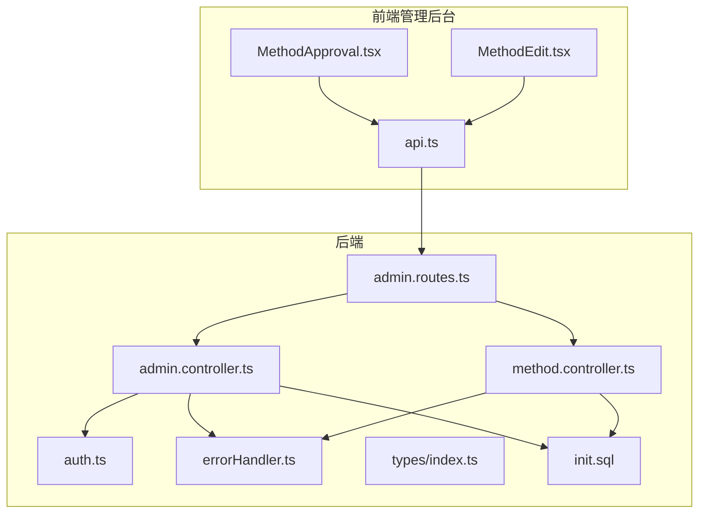
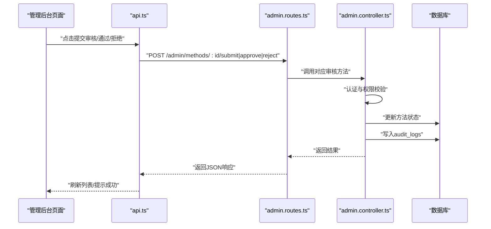
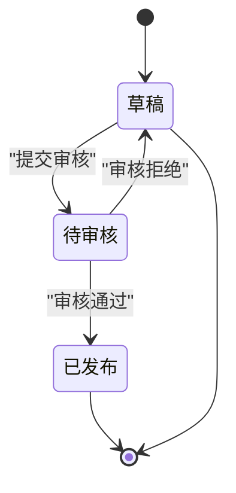
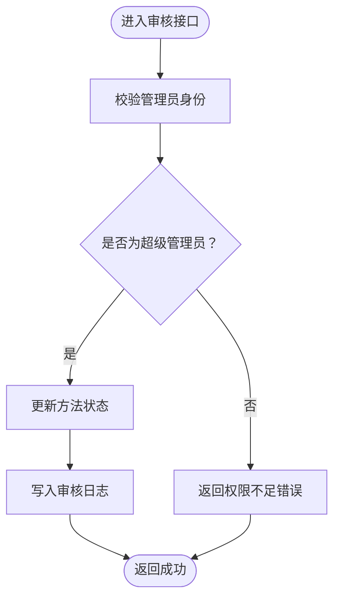
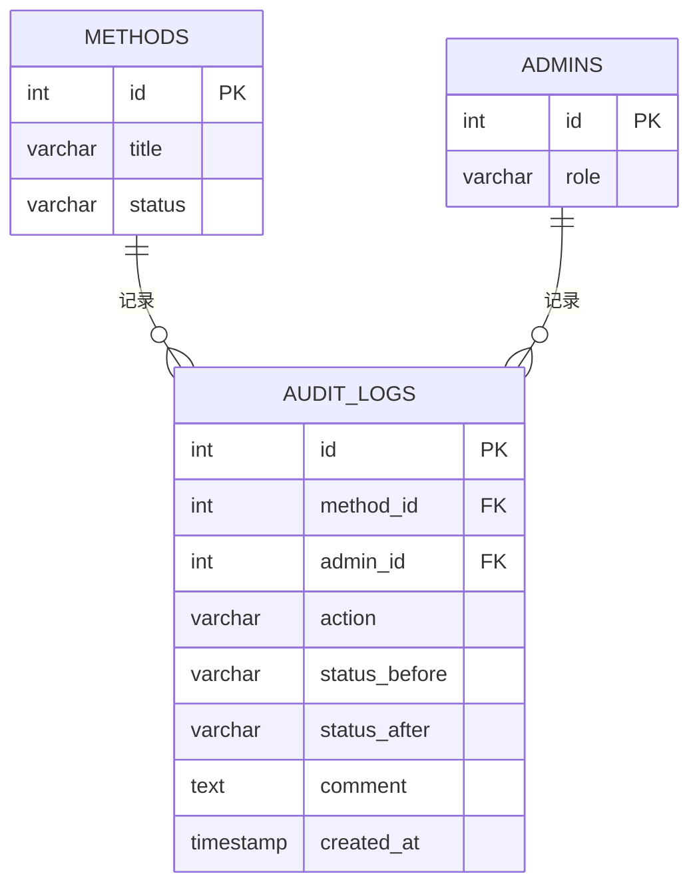
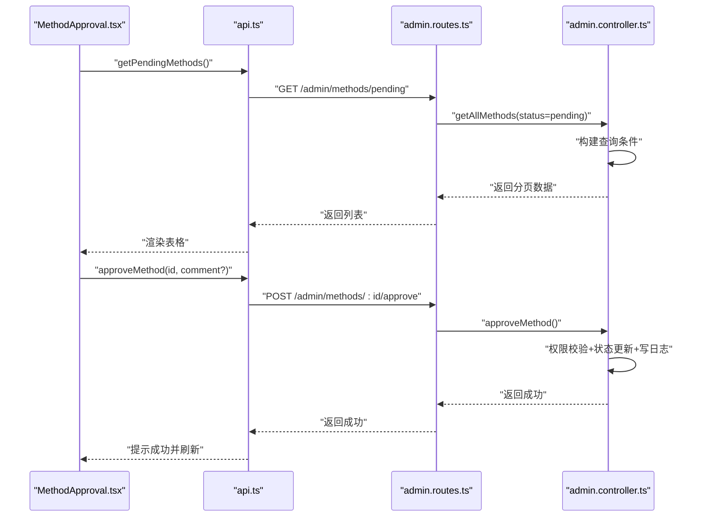
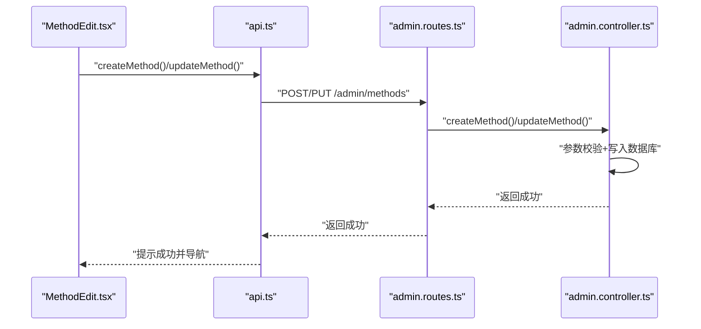
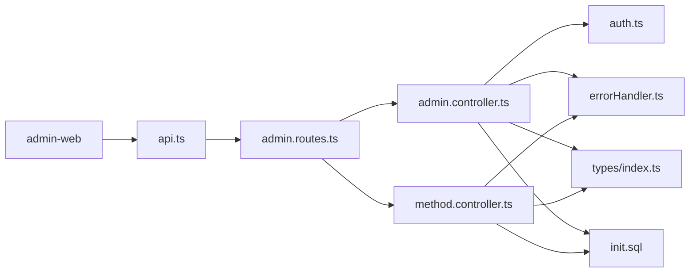

# 方法审核工作流

<cite>
**本文引用的文件**
- [backend/src/controllers/admin.controller.ts](file://backend/src/controllers/admin.controller.ts)
- [backend/src/controllers/method.controller.ts](file://backend/src/controllers/method.controller.ts)
- [backend/src/middleware/auth.ts](file://backend/src/middleware/auth.ts)
- [backend/src/middleware/errorHandler.ts](file://backend/src/middleware/errorHandler.ts)
- [backend/src/routing/admin.routes.ts](file://backend/src/routes/admin.routes.ts)
- [backend/src/types/index.ts](file://backend/src/types/index.ts)
- [database/init.sql](file://database/init.sql)
- [home/user/nian/admin-web/src/pages/MethodApproval.tsx](file://home/user/nian/admin-web/src/pages/MethodApproval.tsx)
- [home/user/nian/admin-web/src/pages/MethodEdit.tsx](file://home/user/nian/admin-web/src/pages/MethodEdit.tsx)
- [home/user/nian/admin-web/src/services/api.ts](file://home/user/nian/admin-web/src/services/api.ts)
</cite>

## 目录
1. [引言](#引言)
2. [项目结构](#项目结构)
3. [核心组件](#核心组件)
4. [架构总览](#架构总览)
5. [详细组件分析](#详细组件分析)
6. [依赖关系分析](#依赖关系分析)
7. [性能考量](#性能考量)
8. [故障排查指南](#故障排查指南)
9. [结论](#结论)

## 引言
本文件系统性阐述心理调节方法的审核工作流机制，围绕后端控制器中“提交审核”“审核通过”“审核拒绝”三个关键方法展开，结合数据库表结构与管理后台页面交互，完整说明：
- 方法状态机的转换规则：草稿（draft）→待审核（pending）→发布（published）或退回草稿（draft）
- 权限控制逻辑：仅“超级管理员”具备审批权限
- 审核日志（audit_logs）记录机制：操作类型、状态变更前后值、审核意见
- 管理后台 MethodApproval 与 MethodEdit 页面与后端 API 的交互流程
- 工作流异常处理策略：重复提交、越权操作等

## 项目结构
后端采用 Express + TypeScript，按职责分层组织：
- 路由层：定义 REST 接口，绑定到控制器
- 控制器层：实现业务逻辑（方法 CRUD、审核、统计、文件上传等）
- 中间件层：认证与错误处理
- 类型定义：统一的数据模型与响应结构
- 数据库：PostgreSQL 初始化脚本，包含方法、管理员、审核日志等表

图表来源
- [backend/src/routes/admin.routes.ts](file://backend/src/routes/admin.routes.ts#L1-L98)
- [backend/src/controllers/admin.controller.ts](file://backend/src/controllers/admin.controller.ts#L1-L1428)
- [backend/src/controllers/method.controller.ts](file://backend/src/controllers/method.controller.ts#L1-L153)
- [backend/src/middleware/auth.ts](file://backend/src/middleware/auth.ts#L1-L87)
- [backend/src/middleware/errorHandler.ts](file://backend/src/middleware/errorHandler.ts#L1-L97)
- [backend/src/types/index.ts](file://backend/src/types/index.ts#L1-L126)
- [database/init.sql](file://database/init.sql#L1-L349)

章节来源
- [backend/src/routes/admin.routes.ts](file://backend/src/routes/admin.routes.ts#L1-L98)
- [backend/src/controllers/admin.controller.ts](file://backend/src/controllers/admin.controller.ts#L1-L1428)
- [backend/src/controllers/method.controller.ts](file://backend/src/controllers/method.controller.ts#L1-L153)
- [backend/src/middleware/auth.ts](file://backend/src/middleware/auth.ts#L1-L87)
- [backend/src/middleware/errorHandler.ts](file://backend/src/middleware/errorHandler.ts#L1-L97)
- [backend/src/types/index.ts](file://backend/src/types/index.ts#L1-L126)
- [database/init.sql](file://database/init.sql#L1-L349)

## 核心组件
- 审核控制器方法
  - 提交审核：将草稿方法置为待审核
  - 审核通过：仅超级管理员可执行，将待审核方法置为已发布
  - 审核拒绝：仅超级管理员可执行，将待审核方法退回草稿
- 权限中间件：验证管理员身份与角色
- 错误处理中间件：统一错误响应
- 数据模型：方法状态枚举、管理员角色枚举
- 审核日志表：记录每次审核动作的状态变更与意见

章节来源
- [backend/src/controllers/admin.controller.ts](file://backend/src/controllers/admin.controller.ts#L266-L387)
- [backend/src/middleware/auth.ts](file://backend/src/middleware/auth.ts#L35-L77)
- [backend/src/middleware/errorHandler.ts](file://backend/src/middleware/errorHandler.ts#L1-L97)
- [backend/src/types/index.ts](file://backend/src/types/index.ts#L18-L74)
- [database/init.sql](file://database/init.sql#L109-L123)

## 架构总览
后端通过路由将请求分发到控制器，控制器在执行业务前进行认证与权限校验，再访问数据库完成状态更新与日志记录；前端管理后台通过服务封装调用后端接口，驱动 MethodApproval 与 MethodEdit 页面。

图表来源
- [home/user/nian/admin-web/src/services/api.ts](file://home/user/nian/admin-web/src/services/api.ts#L1-L61)
- [backend/src/routes/admin.routes.ts](file://backend/src/routes/admin.routes.ts#L1-L98)
- [backend/src/controllers/admin.controller.ts](file://backend/src/controllers/admin.controller.ts#L266-L387)
- [database/init.sql](file://database/init.sql#L109-L123)

## 详细组件分析

### 方法状态机与转换规则
- 初始状态：草稿（draft）
- 提交审核：草稿 → 待审核（pending）
- 审核通过：待审核 → 已发布（published），同时记录发布时间
- 审核拒绝：待审核 → 草稿（draft），并要求提供拒绝原因
- 并发约束：使用“状态 = 当前期望值”的原子更新，避免竞态导致的非法状态跳转

图表来源
- [backend/src/controllers/admin.controller.ts](file://backend/src/controllers/admin.controller.ts#L266-L387)
- [database/init.sql](file://database/init.sql#L19-L36)

章节来源
- [backend/src/controllers/admin.controller.ts](file://backend/src/controllers/admin.controller.ts#L266-L387)
- [database/init.sql](file://database/init.sql#L19-L36)

### 权限控制逻辑（超级管理员）
- 管理员认证中间件：从 Authorization 头解析 JWT，注入管理员上下文
- 审核权限：仅 role 为“super_admin”的管理员可执行 approveMethod 与 rejectMethod
- 越权场景：非超级管理员尝试审批将被拒绝

图表来源
- [backend/src/middleware/auth.ts](file://backend/src/middleware/auth.ts#L35-L77)
- [backend/src/controllers/admin.controller.ts](file://backend/src/controllers/admin.controller.ts#L299-L387)
- [backend/src/types/index.ts](file://backend/src/types/index.ts#L66-L74)

章节来源
- [backend/src/middleware/auth.ts](file://backend/src/middleware/auth.ts#L35-L77)
- [backend/src/controllers/admin.controller.ts](file://backend/src/controllers/admin.controller.ts#L299-L387)
- [backend/src/types/index.ts](file://backend/src/types/index.ts#L66-L74)

### 审核日志（audit_logs）记录机制
- 字段：method_id、admin_id、action（submit/approve/reject）、status_before、status_after、comment、created_at
- 记录时机：
  - 提交审核：action=submit，status_before=draft，status_after=pending
  - 审核通过：action=approve，status_before=pending，status_after=published，附带审核意见
  - 审核拒绝：action=reject，status_before=pending，status_after=draft，附带拒绝原因
- 查询与统计：可通过 method_id 或 admin_id 进行审计追踪

图表来源
- [database/init.sql](file://database/init.sql#L19-L36)
- [database/init.sql](file://database/init.sql#L94-L108)
- [database/init.sql](file://database/init.sql#L109-L123)
- [backend/src/controllers/admin.controller.ts](file://backend/src/controllers/admin.controller.ts#L284-L381)

章节来源
- [database/init.sql](file://database/init.sql#L109-L123)
- [backend/src/controllers/admin.controller.ts](file://backend/src/controllers/admin.controller.ts#L284-L381)

### 管理后台交互流程（MethodApproval 与 MethodEdit）

#### MethodApproval 页面
- 功能：展示待审核方法列表，支持分页与展开预览；弹窗输入审核意见或拒绝原因，提交后刷新列表
- 关键交互：
  - 加载待审核方法：调用后端“获取待审核方法”接口
  - 审核通过：调用“批准方法”接口，附带可选评论
  - 审核拒绝：调用“拒绝方法”接口，强制要求评论
- 前端校验：拒绝时若未填写评论则阻止提交

图表来源
- [home/user/nian/admin-web/src/pages/MethodApproval.tsx](file://home/user/nian/admin-web/src/pages/MethodApproval.tsx#L1-L367)
- [home/user/nian/admin-web/src/services/api.ts](file://home/user/nian/admin-web/src/services/api.ts#L49-L61)
- [backend/src/routes/admin.routes.ts](file://backend/src/routes/admin.routes.ts#L41-L46)
- [backend/src/controllers/admin.controller.ts](file://backend/src/controllers/admin.controller.ts#L299-L340)

章节来源
- [home/user/nian/admin-web/src/pages/MethodApproval.tsx](file://home/user/nian/admin-web/src/pages/MethodApproval.tsx#L1-L367)
- [home/user/nian/admin-web/src/services/api.ts](file://home/user/nian/admin-web/src/services/api.ts#L49-L61)
- [backend/src/routes/admin.routes.ts](file://backend/src/routes/admin.routes.ts#L41-L46)
- [backend/src/controllers/admin.controller.ts](file://backend/src/controllers/admin.controller.ts#L299-L340)

#### MethodEdit 页面
- 功能：新建/编辑方法，支持选择状态（草稿/待审核/已发布），保存后跳转列表
- 关键交互：
  - 新建：调用“创建方法”，初始状态通常为草稿
  - 编辑：调用“更新方法”，可修改状态
  - 提交审核：在编辑页将状态设为“待审核”并保存，或单独调用提交审核接口
- 前端校验：JSON 内容格式校验，防止无效内容入库

图表来源
- [home/user/nian/admin-web/src/pages/MethodEdit.tsx](file://home/user/nian/admin-web/src/pages/MethodEdit.tsx#L1-L393)
- [home/user/nian/admin-web/src/services/api.ts](file://home/user/nian/admin-web/src/services/api.ts#L29-L47)
- [backend/src/routes/admin.routes.ts](file://backend/src/routes/admin.routes.ts#L36-L40)
- [backend/src/controllers/admin.controller.ts](file://backend/src/controllers/admin.controller.ts#L129-L245)

章节来源
- [home/user/nian/admin-web/src/pages/MethodEdit.tsx](file://home/user/nian/admin-web/src/pages/MethodEdit.tsx#L1-L393)
- [home/user/nian/admin-web/src/services/api.ts](file://home/user/nian/admin-web/src/services/api.ts#L29-L47)
- [backend/src/routes/admin.routes.ts](file://backend/src/routes/admin.routes.ts#L36-L40)
- [backend/src/controllers/admin.controller.ts](file://backend/src/controllers/admin.controller.ts#L129-L245)

### 审核流程异常处理
- 重复提交
  - 触发条件：草稿以外状态再次提交
  - 处理：控制器检查当前状态为 draft，否则抛出“未找到或已提交”错误
- 越权操作
  - 触发条件：非超级管理员调用审批接口
  - 处理：控制器读取管理员角色，非 super_admin 返回权限不足
- 缺少必要字段
  - 触发条件：拒绝审批未提供评论
  - 处理：控制器校验 comment 存在，否则返回参数错误
- 方法不存在
  - 触发条件：更新/删除/审批的目标方法不存在
  - 处理：控制器查询无结果时返回“未找到”
- 认证失败
  - 触发条件：缺少或无效的 Authorization 头
  - 处理：中间件抛出认证失败错误

章节来源
- [backend/src/controllers/admin.controller.ts](file://backend/src/controllers/admin.controller.ts#L266-L387)
- [backend/src/middleware/auth.ts](file://backend/src/middleware/auth.ts#L35-L77)
- [backend/src/middleware/errorHandler.ts](file://backend/src/middleware/errorHandler.ts#L1-L97)

## 依赖关系分析
- 路由到控制器：admin.routes.ts 将 /admin/* 请求映射到 admin.controller.ts 的具体方法
- 控制器到中间件：admin.controller.ts 使用 authenticateAdmin 进行管理员认证，使用 AppError 统一错误处理
- 控制器到数据库：通过连接池执行 SQL，维护方法状态与审核日志
- 类型定义：types/index.ts 统一了方法状态与管理员角色的类型约束
- 前端到后端：admin-web 通过 api.ts 封装请求，MethodApproval/MethodEdit 与后端接口一一对应

图表来源
- [backend/src/routes/admin.routes.ts](file://backend/src/routes/admin.routes.ts#L1-L98)
- [backend/src/controllers/admin.controller.ts](file://backend/src/controllers/admin.controller.ts#L1-L1428)
- [backend/src/controllers/method.controller.ts](file://backend/src/controllers/method.controller.ts#L1-L153)
- [backend/src/middleware/auth.ts](file://backend/src/middleware/auth.ts#L1-L87)
- [backend/src/middleware/errorHandler.ts](file://backend/src/middleware/errorHandler.ts#L1-L97)
- [backend/src/types/index.ts](file://backend/src/types/index.ts#L1-L126)
- [database/init.sql](file://database/init.sql#L1-L349)
- [home/user/nian/admin-web/src/services/api.ts](file://home/user/nian/admin-web/src/services/api.ts#L1-L61)

章节来源
- [backend/src/routes/admin.routes.ts](file://backend/src/routes/admin.routes.ts#L1-L98)
- [backend/src/controllers/admin.controller.ts](file://backend/src/controllers/admin.controller.ts#L1-L1428)
- [backend/src/controllers/method.controller.ts](file://backend/src/controllers/method.controller.ts#L1-L153)
- [backend/src/middleware/auth.ts](file://backend/src/middleware/auth.ts#L1-L87)
- [backend/src/middleware/errorHandler.ts](file://backend/src/middleware/errorHandler.ts#L1-L97)
- [backend/src/types/index.ts](file://backend/src/types/index.ts#L1-L126)
- [database/init.sql](file://database/init.sql#L1-L349)
- [home/user/nian/admin-web/src/services/api.ts](file://home/user/nian/admin-web/src/services/api.ts#L1-L61)

## 性能考量
- 状态查询与分页：后端对方法列表查询使用 LIMIT/OFFSET，配合索引提升分页性能
- 审核日志查询：按 method_id、admin_id、created_at 建立索引，便于审计与报表
- 并发更新：使用“状态 = 期望值”的原子更新，减少锁竞争与重试成本
- 前端缓存：管理后台页面可利用本地状态缓存减少重复请求

[本节为通用建议，无需特定文件来源]

## 故障排查指南
- 提交审核报错“未找到或已提交”
  - 检查方法是否存在且状态确为 draft
  - 章节来源: [backend/src/controllers/admin.controller.ts](file://backend/src/controllers/admin.controller.ts#L275-L283)
- 审批时报“权限不足”
  - 确认当前管理员角色为 super_admin
  - 章节来源: [backend/src/controllers/admin.controller.ts](file://backend/src/controllers/admin.controller.ts#L308-L316)
- 拒绝审批失败“缺少拒绝原因”
  - 确保提交时包含 comment 字段
  - 章节来源: [backend/src/controllers/admin.controller.ts](file://backend/src/controllers/admin.controller.ts#L342-L354)
- 审核日志缺失
  - 检查数据库 audit_logs 表是否正常写入
  - 章节来源: [database/init.sql](file://database/init.sql#L109-L123)
- 前端无法加载待审核列表
  - 检查 /admin/methods/pending 接口是否正确映射到 getAllMethods
  - 章节来源: [backend/src/routes/admin.routes.ts](file://backend/src/routes/admin.routes.ts#L36-L40)

## 结论
该审核工作流以“草稿→待审核→发布/退回草稿”的状态机为核心，通过严格的管理员认证与角色校验确保审批安全，借助 audit_logs 实现完整的审计轨迹。管理后台 MethodApproval 与 MethodEdit 页面与后端 API 协同，形成清晰的前后端交互闭环。异常处理覆盖了重复提交、越权操作、参数缺失等常见问题，保障系统稳定运行。