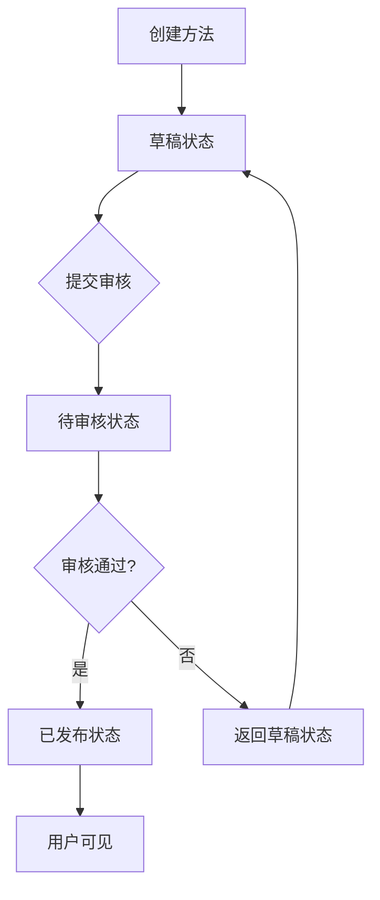
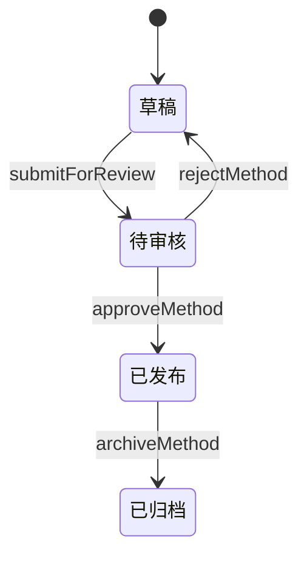
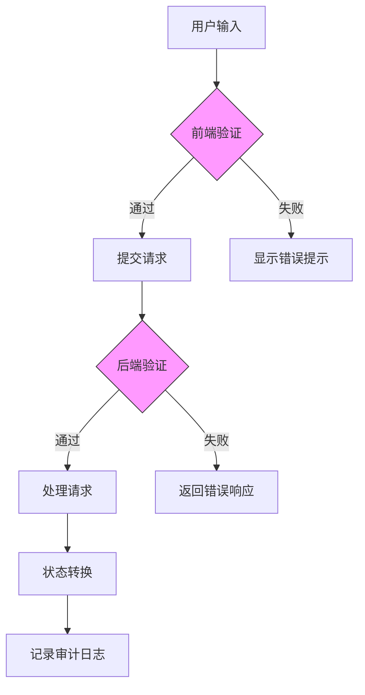
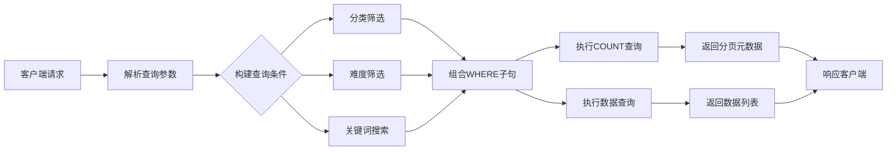
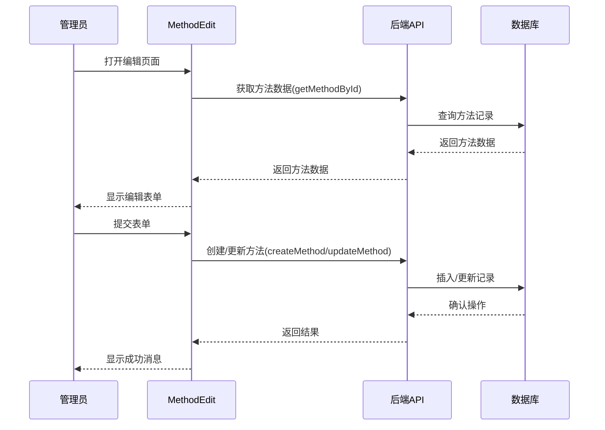
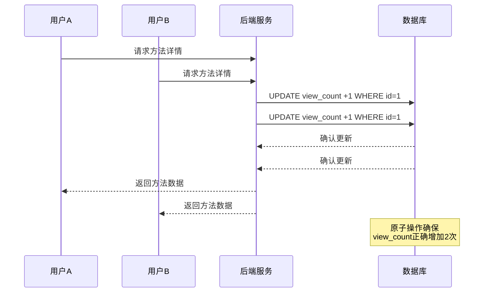

# 方法管理业务逻辑

<cite>
**本文档引用的文件**
- [method.controller.ts](file://backend/src/controllers/method.controller.ts)
- [admin.controller.ts](file://backend/src/controllers/admin.controller.ts)
- [method.routes.ts](file://backend/src/routes/method.routes.ts)
- [admin.routes.ts](file://backend/src/routes/admin.routes.ts)
- [types/index.ts](file://backend/src/types/index.ts)
- [database.ts](file://backend/src/config/database.ts)
- [init.sql](file://database/init.sql)
- [MethodApproval.tsx](file://home/user/nian/admin-web/src/pages/MethodApproval.tsx)
- [MethodEdit.tsx](file://home/user/nian/admin-web/src/pages/MethodEdit.tsx)
- [api.ts](file://home/user/nian/admin-web/src/services/api.ts)
</cite>

## 目录
1. [简介](#简介)
2. [核心业务流程](#核心业务流程)
3. [方法状态管理](#方法状态管理)
4. [数据验证规则](#数据验证规则)
5. [分类筛选与搜索机制](#分类筛选与搜索机制)
6. [管理后台操作联动](#管理后台操作联动)
7. [高并发数据一致性](#高并发数据一致性)
8. [结论](#结论)

## 简介
心理调节方法管理模块是系统的核心内容管理组件，负责方法内容的全生命周期管理。该模块实现了从方法创建、审核、发布到用户使用的完整流程，通过严格的权限控制和数据验证确保内容质量和系统安全。系统采用前后端分离架构，后端提供RESTful API接口，前端管理界面实现可视化操作，为管理员提供高效的内容管理体验。

## 核心业务流程

心理调节方法管理模块的核心业务流程涵盖了方法从创建到发布的完整生命周期。整个流程始于管理员在管理后台创建新方法或编辑现有方法，通过`MethodEdit`页面进行内容编辑。创建或编辑完成后，方法首先进入"草稿"状态，此时仅创建者可见。

当管理员准备提交审核时，调用`submitForReview`接口将方法状态从"草稿"变更为"待审核"。此操作触发审核流程，方法进入待审核队列，等待超级管理员审批。在`MethodApproval`页面，超级管理员可以查看所有待审核方法，通过`getPendingMethods`接口获取待审核列表。

审核通过后，方法状态变更为"已发布"，并设置`published_at`时间戳，此时方法对所有用户可见，可通过前端应用浏览和使用。若审核被拒绝，方法状态返回"草稿"状态，创建者可根据拒绝原因进行修改后重新提交。

**图示来源**
- [admin.controller.ts](file://backend/src/controllers/admin.controller.ts#L267-L387)
- [MethodApproval.tsx](file://home/user/nian/admin-web/src/pages/MethodApproval.tsx#L23-L366)
- [MethodEdit.tsx](file://home/user/nian/admin-web/src/pages/MethodEdit.tsx#L44-L74)

**本节来源**
- [admin.controller.ts](file://backend/src/controllers/admin.controller.ts#L129-L387)
- [MethodApproval.tsx](file://home/user/nian/admin-web/src/pages/MethodApproval.tsx#L1-L366)
- [MethodEdit.tsx](file://home/user/nian/admin-web/src/pages/MethodEdit.tsx#L1-L393)

## 方法状态管理

方法状态管理是内容审核流程的核心，系统定义了四种状态：草稿(draft)、待审核(pending)、已发布(published)和已归档(archived)。这些状态通过`Method`类型中的`status`字段实现，状态转换受到严格的权限和条件控制。

状态转换遵循特定的规则和权限要求。从"草稿"到"待审核"的转换由内容创建者发起，但必须满足内容完整性的基本要求。从"待审核"到"已发布"的转换仅限超级管理员(super_admin)执行，这是系统安全的关键控制点。在`approveMethod`控制器中，通过查询管理员角色来验证权限，确保只有超级管理员才能批准方法发布。

状态转换过程中，系统会记录详细的审核日志。每次状态变更都会在`audit_logs`表中创建记录，包含方法ID、管理员ID、操作类型、状态变更前后值以及审核意见。这种审计机制为内容管理提供了完整的追溯能力，确保所有操作都有据可查。

**图示来源**
- [types/index.ts](file://backend/src/types/index.ts#L28)
- [admin.controller.ts](file://backend/src/controllers/admin.controller.ts#L267-L387)
- [init.sql](file://database/init.sql#L110-L119)

**本节来源**
- [admin.controller.ts](file://backend/src/controllers/admin.controller.ts#L267-L387)
- [init.sql](file://database/init.sql#L29-L30)

## 数据验证规则

系统实施了多层次的数据验证规则，确保方法内容的质量和一致性。验证规则在前端和后端同时实施，形成双重保障机制。

在前端管理界面，`MethodEdit`组件通过Ant Design表单验证规则实施客户端验证。标题字段限制为50个字符以内，描述字段限制为200个字符以内，且均为必填项。内容字段要求输入有效的JSON格式，包含预定义的结构如"steps"（步骤）和"tips"（提示）等字段。

后端验证在`admin.controller.ts`中实现，通过控制器逻辑进行更严格的验证。创建方法时，系统检查所有必填字段是否提供，包括标题、描述、分类、难度、时长和内容JSON。内容JSON字段存储为JSONB类型，数据库层面确保其格式有效性。系统还验证分类和难度的取值是否在预定义范围内。

**图示来源**
- [MethodEdit.tsx](file://home/user/nian/admin-web/src/pages/MethodEdit.tsx#L107-L174)
- [admin.controller.ts](file://backend/src/controllers/admin.controller.ts#L147-L149)
- [init.sql](file://database/init.sql#L22-L26)

**本节来源**
- [MethodEdit.tsx](file://home/user/nian/admin-web/src/pages/MethodEdit.tsx#L104-L179)
- [admin.controller.ts](file://backend/src/controllers/admin.controller.ts#L147-L149)

## 分类筛选与搜索机制

系统实现了高效的分类筛选与搜索机制，支持用户快速定位所需的心理调节方法。后端通过`getMethods`控制器提供灵活的查询接口，支持按分类、难度等级和关键词进行复合筛选。

数据库查询优化是搜索性能的关键。系统在`methods`表上创建了多个索引，包括`idx_methods_status`、`idx_methods_category`和`idx_methods_difficulty`，确保筛选操作的高效执行。对于关键词搜索，系统使用PostgreSQL的ILIKE操作符实现不区分大小写的模糊匹配，同时通过`LIMIT`和`OFFSET`实现分页，避免一次性加载过多数据。

搜索功能支持多条件组合查询。客户端可以同时指定分类、难度和关键词参数，后端动态构建WHERE子句。查询构建采用参数化查询方式，有效防止SQL注入攻击。系统还实现了查询结果计数功能，通过独立的COUNT查询获取总记录数，为分页提供依据。

**图示来源**
- [method.controller.ts](file://backend/src/controllers/method.controller.ts#L19-L60)
- [init.sql](file://database/init.sql#L38-L40)
- [method.routes.ts](file://backend/src/routes/method.routes.ts#L8)

**本节来源**
- [method.controller.ts](file://backend/src/controllers/method.controller.ts#L6-L73)
- [init.sql](file://database/init.sql#L38-L40)

## 管理后台操作联动

管理后台的`MethodApproval`和`MethodEdit`页面与后端API形成了紧密的操作联动，实现了直观高效的内容管理体验。这种前后端协同设计提升了管理员的工作效率和操作准确性。

`MethodEdit`页面作为方法创建和编辑的入口，通过表单界面收集方法内容。页面预设了分类和难度的选项列表，确保数据一致性。提交操作触发`createMethod`或`updateMethod`API调用，将数据持久化到数据库。页面还集成了JSON格式验证，实时反馈内容结构的正确性。

`MethodApproval`页面专注于审核流程，以表格形式展示所有待审核方法。页面提供"通过"和"拒绝"操作按钮，对应调用`approveMethod`和`rejectMethod`API。审核操作需要提供审核意见，特别是拒绝时必须填写原因，这确保了审核过程的透明性和可追溯性。

**图示来源**
- [MethodEdit.tsx](file://home/user/nian/admin-web/src/pages/MethodEdit.tsx#L23-L74)
- [MethodApproval.tsx](file://home/user/nian/admin-web/src/pages/MethodApproval.tsx#L39-L69)
- [api.ts](file://home/user/nian/admin-web/src/services/api.ts#L37-L43)

**本节来源**
- [MethodEdit.tsx](file://home/user/nian/admin-web/src/pages/MethodEdit.tsx#L1-L393)
- [MethodApproval.tsx](file://home/user/nian/admin-web/src/pages/MethodApproval.tsx#L1-L366)

## 高并发数据一致性

在高并发场景下，系统通过多种机制保障数据一致性，防止因并发操作导致的数据异常。核心策略包括数据库事务、行级锁和原子操作。

对于关键的计数器字段如`view_count`和`select_count`，系统采用原子更新操作。在`getMethodById`控制器中，浏览次数的增加通过`UPDATE methods SET view_count = view_count + 1`语句实现，这是原子操作，避免了读取-修改-写入模式可能引发的竞争条件。

审核流程中的状态转换也设计了并发控制。在`approveMethod`和`rejectMethod`控制器中，状态更新语句包含`WHERE id = $1 AND status = 'pending'`条件，确保只有处于"待审核"状态的方法才能被处理。这种条件更新避免了多个管理员同时处理同一方法导致的状态不一致。

**图示来源**
- [method.controller.ts](file://backend/src/controllers/method.controller.ts#L89-L92)
- [userMethod.controller.ts](file://backend/src/controllers/userMethod.controller.ts#L47-L49)
- [admin.controller.ts](file://backend/src/controllers/admin.controller.ts#L319-L321)

**本节来源**
- [method.controller.ts](file://backend/src/controllers/method.controller.ts#L75-L98)
- [userMethod.controller.ts](file://backend/src/controllers/userMethod.controller.ts#L39-L50)

## 结论
心理调节方法管理模块通过严谨的状态管理、多层次的验证机制和高效的查询优化，构建了一个安全可靠的内容管理系统。系统采用前后端分离架构，管理后台与后端API紧密协作，为管理员提供了直观高效的操作体验。在高并发场景下，通过原子操作和条件更新等机制保障数据一致性，确保系统稳定运行。整体设计充分考虑了内容质量、操作安全和用户体验，为心理自助应用提供了坚实的内容管理基础。