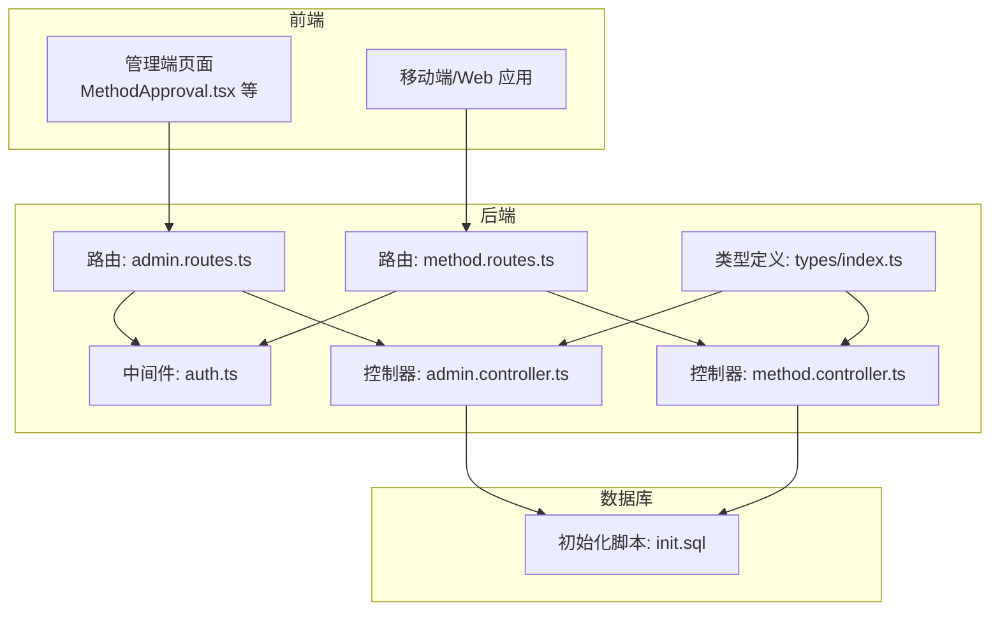
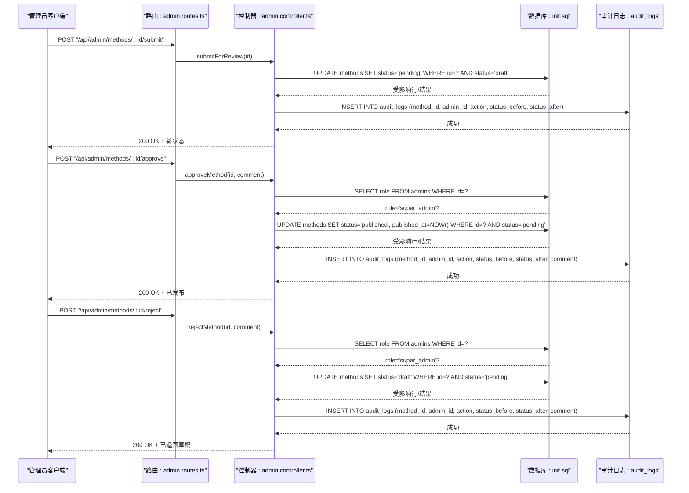
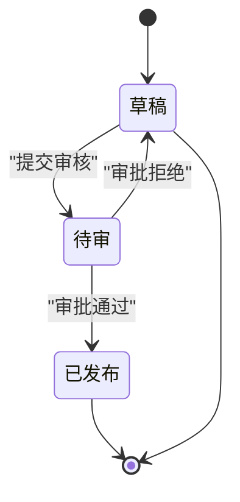
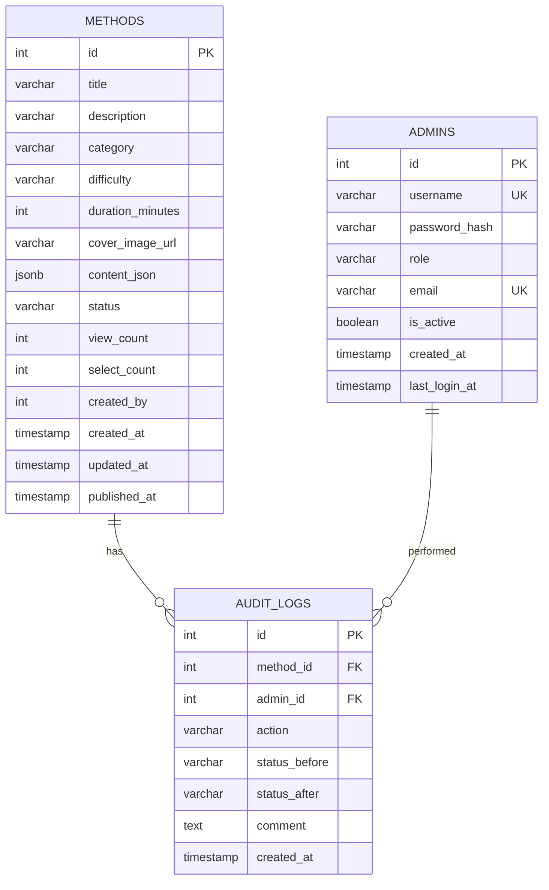
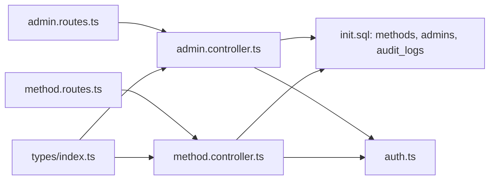

# 内容审核工作流

<cite>
**本文引用的文件**
- [backend/src/controllers/admin.controller.ts](file://backend/src/controllers/admin.controller.ts)
- [backend/src/controllers/method.controller.ts](file://backend/src/controllers/method.controller.ts)
- [backend/src/routes/admin.routes.ts](file://backend/src/routes/admin.routes.ts)
- [backend/src/routes/method.routes.ts](file://backend/src/routes/method.routes.ts)
- [backend/src/middleware/auth.ts](file://backend/src/middleware/auth.ts)
- [backend/src/types/index.ts](file://backend/src/types/index.ts)
- [database/init.sql](file://database/init.sql)
</cite>

## 目录
1. [引言](#引言)
2. [项目结构](#项目结构)
3. [核心组件](#核心组件)
4. [架构总览](#架构总览)
5. [详细组件分析](#详细组件分析)
6. [依赖关系分析](#依赖关系分析)
7. [性能考量](#性能考量)
8. [故障排查指南](#故障排查指南)
9. [结论](#结论)

## 引言
本文件围绕“心理调节方法”的内容审核状态机进行深入解析，覆盖从创建草稿、提交审核、到审批通过/拒绝的完整工作流。重点说明：
- 状态转换规则：draft → pending → published/draft 的条件与业务逻辑
- approveMethod 与 rejectMethod 中的超级管理员权限校验（super_admin 角色检查）及对应 HTTP 状态码
- 审核日志 audit_logs 的记录内容与追溯原理
- 实际场景示例：审核拒绝时 comment 的必填校验；审核通过后 published_at 时间戳的自动更新

## 项目结构
后端采用 Express + PostgreSQL，控制器负责业务逻辑，路由定义接口，中间件负责认证鉴权，数据库初始化脚本定义了方法表、管理员表与审计日志表等核心结构。

图表来源
- [backend/src/routes/admin.routes.ts](file://backend/src/routes/admin.routes.ts#L1-L98)
- [backend/src/routes/method.routes.ts](file://backend/src/routes/method.routes.ts#L1-L20)
- [backend/src/controllers/admin.controller.ts](file://backend/src/controllers/admin.controller.ts#L1-L387)
- [backend/src/controllers/method.controller.ts](file://backend/src/controllers/method.controller.ts#L1-L153)
- [backend/src/middleware/auth.ts](file://backend/src/middleware/auth.ts#L1-L87)
- [backend/src/types/index.ts](file://backend/src/types/index.ts#L1-L126)
- [database/init.sql](file://database/init.sql#L1-L349)

章节来源
- [backend/src/routes/admin.routes.ts](file://backend/src/routes/admin.routes.ts#L1-L98)
- [backend/src/routes/method.routes.ts](file://backend/src/routes/method.routes.ts#L1-L20)
- [backend/src/controllers/admin.controller.ts](file://backend/src/controllers/admin.controller.ts#L1-L387)
- [backend/src/controllers/method.controller.ts](file://backend/src/controllers/method.controller.ts#L1-L153)
- [backend/src/middleware/auth.ts](file://backend/src/middleware/auth.ts#L1-L87)
- [backend/src/types/index.ts](file://backend/src/types/index.ts#L1-L126)
- [database/init.sql](file://database/init.sql#L1-L349)

## 核心组件
- 审核控制器（admin.controller.ts）：提供创建方法、提交审核、审批通过、审批拒绝等接口，并在各操作中写入审计日志
- 方法控制器（method.controller.ts）：提供公开方法列表、详情、推荐等接口，查询时默认只返回已发布的状态
- 路由（admin.routes.ts/method.routes.ts）：定义审核相关接口路径与认证中间件
- 认证中间件（auth.ts）：区分用户与管理员的鉴权，管理员中间件会注入 admin 对象（包含 role）
- 类型定义（types/index.ts）：统一方法实体与管理员角色类型
- 数据库（init.sql）：定义 methods、admins、audit_logs 表结构与索引

章节来源
- [backend/src/controllers/admin.controller.ts](file://backend/src/controllers/admin.controller.ts#L1-L387)
- [backend/src/controllers/method.controller.ts](file://backend/src/controllers/method.controller.ts#L1-L153)
- [backend/src/routes/admin.routes.ts](file://backend/src/routes/admin.routes.ts#L1-L98)
- [backend/src/routes/method.routes.ts](file://backend/src/routes/method.routes.ts#L1-L20)
- [backend/src/middleware/auth.ts](file://backend/src/middleware/auth.ts#L1-L87)
- [backend/src/types/index.ts](file://backend/src/types/index.ts#L1-L126)
- [database/init.sql](file://database/init.sql#L1-L349)

## 架构总览
审核工作流的关键交互如下：

图表来源
- [backend/src/routes/admin.routes.ts](file://backend/src/routes/admin.routes.ts#L30-L75)
- [backend/src/controllers/admin.controller.ts](file://backend/src/controllers/admin.controller.ts#L266-L387)
- [database/init.sql](file://database/init.sql#L19-L36)
- [database/init.sql](file://database/init.sql#L109-L124)

## 详细组件分析

### 状态机与转换规则
- 初始状态：创建方法时默认 status=draft
- 提交审核：仅当当前状态为 draft 时允许提交，成功后进入 pending
- 审批通过：仅当当前状态为 pending 且调用者为 super_admin 时允许通过，成功后进入 published 并自动写入 published_at
- 审核拒绝：仅当当前状态为 pending 且调用者为 super_admin 时允许拒绝，成功后回到 draft

图表来源
- [backend/src/controllers/admin.controller.ts](file://backend/src/controllers/admin.controller.ts#L266-L387)
- [database/init.sql](file://database/init.sql#L19-L36)

章节来源
- [backend/src/controllers/admin.controller.ts](file://backend/src/controllers/admin.controller.ts#L266-L387)
- [database/init.sql](file://database/init.sql#L19-L36)

### 审核接口与权限校验
- 提交审核（submitForReview）
  - 条件：当前状态必须为 draft
  - 结果：状态变为 pending
  - 日志：记录 action='submit'，status_before='draft'，status_after='pending'

- 审核通过（approveMethod）
  - 条件：
    - 当前状态必须为 pending
    - 调用者必须为 super_admin
  - 结果：状态变为 published，同时写入 published_at
  - 日志：记录 action='approve'，status_before='pending'，status_after='published'，comment 可选

- 审核拒绝（rejectMethod）
  - 条件：
    - 当前状态必须为 pending
    - 调用者必须为 super_admin
    - body 中必须包含 comment
  - 结果：状态回到 draft
  - 日志：记录 action='reject'，status_before='pending'，status_after='draft'，comment 必填

章节来源
- [backend/src/controllers/admin.controller.ts](file://backend/src/controllers/admin.controller.ts#L266-L387)
- [backend/src/middleware/auth.ts](file://backend/src/middleware/auth.ts#L36-L77)
- [database/init.sql](file://database/init.sql#L109-L124)

### 审核日志表结构与追溯
audit_logs 字段说明：
- method_id：关联方法 id
- admin_id：执行审核的管理员 id
- action：动作类型（submit/approve/reject）
- status_before/status_after：状态变更前后值
- comment：审核意见（拒绝时必填）
- created_at：记录时间

图表来源
- [database/init.sql](file://database/init.sql#L19-L36)
- [database/init.sql](file://database/init.sql#L95-L108)
- [database/init.sql](file://database/init.sql#L109-L124)

章节来源
- [database/init.sql](file://database/init.sql#L19-L36)
- [database/init.sql](file://database/init.sql#L95-L108)
- [database/init.sql](file://database/init.sql#L109-L124)

### 审核流程的错误处理与 HTTP 状态码
- 未认证/令牌无效：401 AUTH_FAILED
- 权限不足：403 PERMISSION_DENIED（非 super_admin）
- 资源不存在或状态不符：404 NOT_FOUND（如草稿不存在、非 pending 状态）
- 参数校验失败：400 VALIDATION_ERROR（如拒绝时缺少 comment）

章节来源
- [backend/src/controllers/admin.controller.ts](file://backend/src/controllers/admin.controller.ts#L266-L387)
- [backend/src/middleware/auth.ts](file://backend/src/middleware/auth.ts#L36-L77)

### 实际场景示例
- 审核拒绝时必须提供 comment 的验证逻辑
  - 接口参数 body.comment 必须存在，否则返回 400
  - 同时仅 super_admin 可执行拒绝
- 审核通过后 published_at 自动更新
  - 审批通过时，数据库将方法的 published_at 设置为当前时间
  - 该行为由控制器直接写入，无需前端传入

章节来源
- [backend/src/controllers/admin.controller.ts](file://backend/src/controllers/admin.controller.ts#L298-L340)
- [backend/src/controllers/admin.controller.ts](file://backend/src/controllers/admin.controller.ts#L342-L387)
- [database/init.sql](file://database/init.sql#L19-L36)

## 依赖关系分析
- 控制器依赖：
  - admin.controller.ts 依赖数据库连接池、AppError 错误处理、类型定义与认证中间件
  - method.controller.ts 依赖数据库连接池、AppError、分页类型
- 路由依赖：
  - admin.routes.ts 将 /api/admin/* 路径绑定到 admin.controller.ts 的方法，并在 34 行启用管理员认证中间件
  - method.routes.ts 将 /api/methods/* 路径绑定到 method.controller.ts 的方法
- 数据库依赖：
  - methods 表包含状态与发布时间字段
  - audit_logs 表记录每次审核动作与状态变更
  - admins 表包含角色字段，用于权限校验

图表来源
- [backend/src/routes/admin.routes.ts](file://backend/src/routes/admin.routes.ts#L1-L98)
- [backend/src/routes/method.routes.ts](file://backend/src/routes/method.routes.ts#L1-L20)
- [backend/src/controllers/admin.controller.ts](file://backend/src/controllers/admin.controller.ts#L1-L387)
- [backend/src/controllers/method.controller.ts](file://backend/src/controllers/method.controller.ts#L1-L153)
- [backend/src/middleware/auth.ts](file://backend/src/middleware/auth.ts#L1-L87)
- [backend/src/types/index.ts](file://backend/src/types/index.ts#L1-L126)
- [database/init.sql](file://database/init.sql#L19-L36)
- [database/init.sql](file://database/init.sql#L95-L108)
- [database/init.sql](file://database/init.sql#L109-L124)

章节来源
- [backend/src/routes/admin.routes.ts](file://backend/src/routes/admin.routes.ts#L1-L98)
- [backend/src/routes/method.routes.ts](file://backend/src/routes/method.routes.ts#L1-L20)
- [backend/src/controllers/admin.controller.ts](file://backend/src/controllers/admin.controller.ts#L1-L387)
- [backend/src/controllers/method.controller.ts](file://backend/src/controllers/method.controller.ts#L1-L153)
- [backend/src/middleware/auth.ts](file://backend/src/middleware/auth.ts#L1-L87)
- [backend/src/types/index.ts](file://backend/src/types/index.ts#L1-L126)
- [database/init.sql](file://database/init.sql#L19-L36)
- [database/init.sql](file://database/init.sql#L95-L108)
- [database/init.sql](file://database/init.sql#L109-L124)

## 性能考量
- 审核日志审计：每次审核都会插入一条 audit_logs 记录，建议对 method_id、admin_id、created_at 建立索引，便于快速检索与报表统计
- 方法查询：公开方法列表默认按 published_at 降序排序，有利于展示最新已发布方法
- 状态过滤：方法列表与详情查询均基于 status 字段，建议对 status 建立索引以提升查询效率

章节来源
- [database/init.sql](file://database/init.sql#L38-L41)
- [database/init.sql](file://database/init.sql#L121-L123)
- [backend/src/controllers/method.controller.ts](file://backend/src/controllers/method.controller.ts#L1-L153)

## 故障排查指南
- 提交审核返回 404
  - 可能原因：方法不存在或状态已非 draft
  - 处理建议：确认方法 id 正确且状态为 draft
- 审批通过返回 403
  - 可能原因：当前管理员角色不是 super_admin
  - 处理建议：使用具有 super_admin 角色的管理员账户
- 审核拒绝返回 400
  - 可能原因：请求体缺少 comment
  - 处理建议：在 body 中提供拒绝理由
- 审批通过后 published_at 未更新
  - 可能原因：状态非 pending 或非 super_admin
  - 处理建议：先确保状态为 pending，再使用 super_admin 账户操作

章节来源
- [backend/src/controllers/admin.controller.ts](file://backend/src/controllers/admin.controller.ts#L266-L387)
- [backend/src/middleware/auth.ts](file://backend/src/middleware/auth.ts#L36-L77)

## 结论
本审核工作流通过明确的状态机与严格的权限控制，确保只有具备 super_admin 权限的管理员可以批准或拒绝内容。系统在关键节点记录审计日志，形成完整的可追溯性。通过数据库层的约束与控制器层的校验，实现了草稿→待审→已发布/草稿的闭环管理，并在通过时自动维护发布时间戳，满足发布流程的完整性要求。