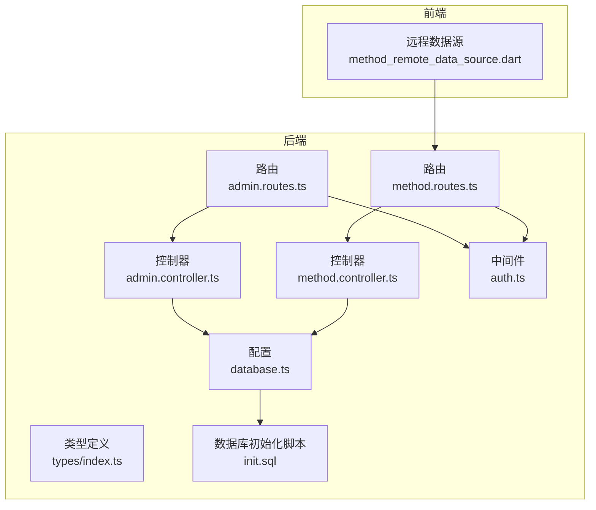
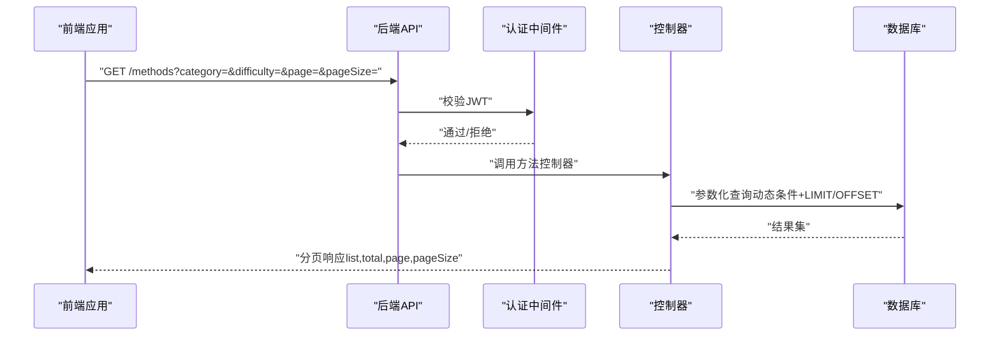
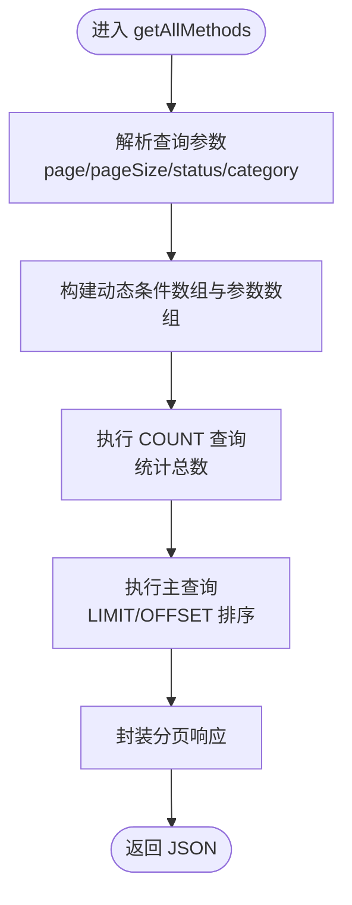
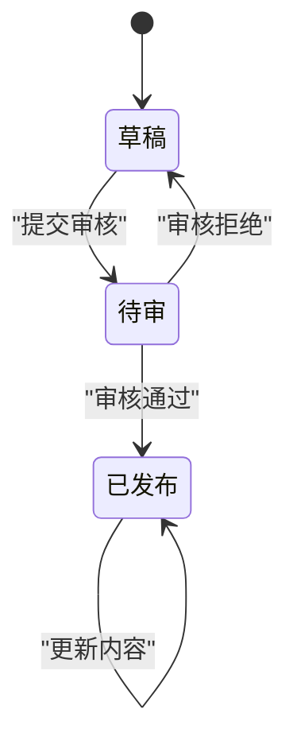
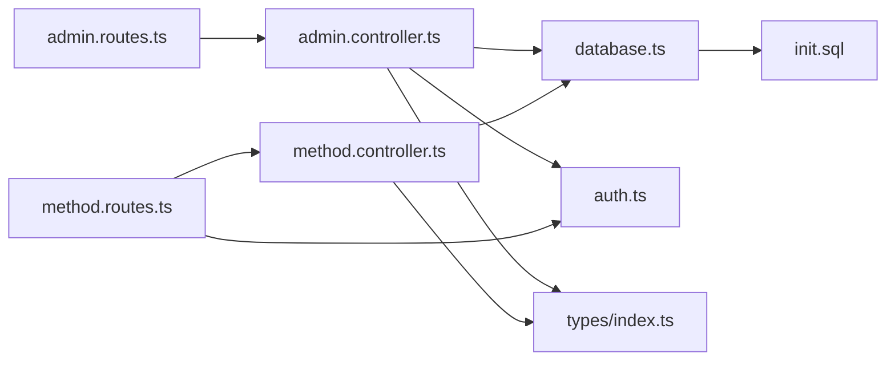

# 内容管理与审核逻辑

<cite>
**本文引用的文件**
- [backend/src/controllers/admin.controller.ts](file://backend/src/controllers/admin.controller.ts)
- [backend/src/routers/admin.routes.ts](file://backend/src/routers/admin.routes.ts)
- [backend/src/controllers/method.controller.ts](file://backend/src/controllers/method.controller.ts)
- [backend/src/routers/method.routes.ts](file://backend/src/routers/method.routes.ts)
- [backend/src/middleware/auth.ts](file://backend/src/middleware/auth.ts)
- [backend/src/config/database.ts](file://backend/src/config/database.ts)
- [backend/src/types/index.ts](file://backend/src/types/index.ts)
- [database/init.sql](file://database/init.sql)
- [flutter_app/lib/data/datasources/remote/method_remote_data_source.dart](file://flutter_app/lib/data/datasources/remote/method_remote_data_source.dart)
</cite>

## 目录
1. [引言](#引言)
2. [项目结构](#项目结构)
3. [核心组件](#核心组件)
4. [架构总览](#架构总览)
5. [详细组件分析](#详细组件分析)
6. [依赖关系分析](#依赖关系分析)
7. [性能考量](#性能考量)
8. [故障排查指南](#故障排查指南)
9. [结论](#结论)
10. [附录](#附录)

## 引言
本文件面向“心理调节方法”的内容管理与审核流程，系统化梳理从创建、编辑到发布的完整生命周期，重点解析以下接口与机制：
- 分页查询接口 getAllMethods 的实现细节与 offset/limit 计算
- 动态条件拼接的安全性与 SQL 注入防护
- 软删除与硬删除的权衡与实现策略
- 审核工作流 submitForReview→approveMethod/rejectMethod 的状态机设计
- 超级管理员权限校验（super_admin 角色检查）
- 审核日志记录与追溯（audit_logs 表）

同时给出实际使用场景示例，如方法创建时的必填字段验证与更新时的空更新防护，帮助开发者快速落地与排错。

## 项目结构
后端采用 Express + PostgreSQL + Redis 的技术栈，按职责拆分为控制器、路由、中间件、类型定义与数据库初始化脚本；前端 Flutter 应用通过远程数据源调用后端 API。

图表来源
- [backend/src/routers/admin.routes.ts](file://backend/src/routers/admin.routes.ts#L1-L69)
- [backend/src/routers/method.routes.ts](file://backend/src/routers/method.routes.ts#L1-L20)
- [backend/src/controllers/admin.controller.ts](file://backend/src/controllers/admin.controller.ts#L1-L120)
- [backend/src/controllers/method.controller.ts](file://backend/src/controllers/method.controller.ts#L1-L73)
- [backend/src/middleware/auth.ts](file://backend/src/middleware/auth.ts#L1-L87)
- [backend/src/config/database.ts](file://backend/src/config/database.ts#L1-L47)
- [database/init.sql](file://database/init.sql#L1-L124)
- [flutter_app/lib/data/datasources/remote/method_remote_data_source.dart](file://flutter_app/lib/data/datasources/remote/method_remote_data_source.dart#L1-L83)

章节来源
- [backend/src/routers/admin.routes.ts](file://backend/src/routers/admin.routes.ts#L1-L69)
- [backend/src/routers/method.routes.ts](file://backend/src/routers/method.routes.ts#L1-L20)
- [backend/src/controllers/admin.controller.ts](file://backend/src/controllers/admin.controller.ts#L1-L120)
- [backend/src/controllers/method.controller.ts](file://backend/src/controllers/method.controller.ts#L1-L73)
- [backend/src/middleware/auth.ts](file://backend/src/middleware/auth.ts#L1-L87)
- [backend/src/config/database.ts](file://backend/src/config/database.ts#L1-L47)
- [database/init.sql](file://database/init.sql#L1-L124)
- [flutter_app/lib/data/datasources/remote/method_remote_data_source.dart](file://flutter_app/lib/data/datasources/remote/method_remote_data_source.dart#L1-L83)

## 核心组件
- 管理端方法控制器（admin.controller.ts）
  - 提供方法全量查询、创建、更新、删除、提交审核、审核通过、审核拒绝等能力
  - 使用参数化查询防止 SQL 注入，严格校验输入与权限
- 方法展示控制器（method.controller.ts）
  - 提供公开方法列表、详情、推荐、分类等查询接口
  - 对公开查询限制为 status='published'
- 路由层（admin.routes.ts、method.routes.ts）
  - 将 HTTP 请求映射到对应控制器函数
  - 管理端路由统一使用管理员认证中间件
- 认证中间件（auth.ts）
  - 用户与管理员 JWT 校验，区分角色与权限
- 类型定义（types/index.ts）
  - 统一定义 Method、Admin、AuthRequest 等类型，确保前后端契约一致
- 数据库初始化（init.sql）
  - 定义 methods、admins、audit_logs 等核心表结构及索引
- 前端远程数据源（method_remote_data_source.dart）
  - 封装 GET /methods、GET /methods/:id 等调用，处理错误与分页参数

章节来源
- [backend/src/controllers/admin.controller.ts](file://backend/src/controllers/admin.controller.ts#L68-L127)
- [backend/src/controllers/method.controller.ts](file://backend/src/controllers/method.controller.ts#L6-73)
- [backend/src/routers/admin.routes.ts](file://backend/src/routers/admin.routes.ts#L1-L69)
- [backend/src/routers/method.routes.ts](file://backend/src/routers/method.routes.ts#L1-L20)
- [backend/src/middleware/auth.ts](file://backend/src/middleware/auth.ts#L1-L87)
- [backend/src/types/index.ts](file://backend/src/types/index.ts#L1-L126)
- [database/init.sql](file://database/init.sql#L1-L124)
- [flutter_app/lib/data/datasources/remote/method_remote_data_source.dart](file://flutter_app/lib/data/datasources/remote/method_remote_data_source.dart#L1-L83)

## 架构总览
后端通过路由层接收请求，经认证中间件校验后交由控制器处理，控制器使用参数化查询访问数据库，最终返回标准化响应。前端通过远程数据源调用后端接口。

图表来源
- [backend/src/routers/method.routes.ts](file://backend/src/routers/method.routes.ts#L1-L20)
- [backend/src/controllers/method.controller.ts](file://backend/src/controllers/method.controller.ts#L6-73)
- [backend/src/middleware/auth.ts](file://backend/src/middleware/auth.ts#L1-L87)
- [backend/src/config/database.ts](file://backend/src/config/database.ts#L1-L47)

## 详细组件分析

### 分页查询与动态条件拼接（getAllMethods 与 getMethods）
- 分页参数
  - page 默认 1，pageSize 默认 20
  - offset = (page - 1) × pageSize，limit = pageSize
- 动态条件
  - 支持 status、category 等过滤，使用参数占位符 $n，避免字符串拼接
  - where 条件数组与参数数组一一对应，保证 SQL 注入防护
- 性能与索引
  - methods 表包含 status、category、difficulty、created_at 等索引，有利于过滤与排序
- 返回结构
  - 返回 list、total、page、pageSize 字段，便于前端渲染与交互

图表来源
- [backend/src/controllers/admin.controller.ts](file://backend/src/controllers/admin.controller.ts#L68-L127)
- [database/init.sql](file://database/init.sql#L19-L61)

章节来源
- [backend/src/controllers/admin.controller.ts](file://backend/src/controllers/admin.controller.ts#L68-L127)
- [database/init.sql](file://database/init.sql#L19-L61)

### 方法创建（createMethod）
- 必填字段校验
  - 标题、描述、分类、难度、时长、内容 JSON 为必填项，缺失则抛出参数错误
- 状态与归属
  - 新建默认状态为 draft，记录创建者（管理员 ID）
- 安全性
  - 参数化插入，避免注入风险
- 实际使用示例
  - 创建新方法时，前端需传入上述必填字段；若缺少任一项，后端将返回参数错误

章节来源
- [backend/src/controllers/admin.controller.ts](file://backend/src/controllers/admin.controller.ts#L129-L164)

### 方法更新（updateMethod）
- 空更新防护
  - 若 body 中未携带任何可更新字段，直接抛出参数错误，避免无意义更新
- 动态字段更新
  - 仅对非 undefined 的字段构建 SET 子句，参数化传参，保证安全与灵活性
- 结果处理
  - 未找到记录时返回未找到错误；成功返回最新记录

章节来源
- [backend/src/controllers/admin.controller.ts](file://backend/src/controllers/admin.controller.ts#L166-L245)

### 方法删除（deleteMethod）
- 删除策略
  - 当前实现为硬删除（DELETE），直接移除记录
- 审计与追溯
  - 可在审计日志中记录删除事件，但当前控制器未显式写入 audit_logs
- 建议
  - 若需保留历史与可恢复能力，建议改为软删除（添加 archived 状态或 deleted_at 字段），并在查询侧屏蔽已软删记录

章节来源
- [backend/src/controllers/admin.controller.ts](file://backend/src/controllers/admin.controller.ts#L247-L264)

### 审核工作流（submitForReview → approveMethod/rejectMethod）
- 状态机设计
  - 初始状态：draft
  - 提交审核：pending
  - 审核通过：published（同时写入 published_at）
  - 审核拒绝：回到 draft
- 权限控制
  - approveMethod 与 rejectMethod 仅允许 role=super_admin 的管理员操作
- 日志记录
  - 每次状态变更均写入 audit_logs，记录 method_id、admin_id、action、status_before、status_after、comment
- 审核日志表结构
  - 包含 method_id、admin_id、action、status_before、status_after、comment、created_at 等字段

图表来源
- [backend/src/controllers/admin.controller.ts](file://backend/src/controllers/admin.controller.ts#L266-L387)
- [database/init.sql](file://database/init.sql#L109-L124)

章节来源
- [backend/src/controllers/admin.controller.ts](file://backend/src/controllers/admin.controller.ts#L266-L387)
- [database/init.sql](file://database/init.sql#L109-L124)

### 审核日志与追溯（audit_logs）
- 表结构要点
  - method_id 外键，action 取值限定为 submit/approve/reject
  - 记录每次状态变更的时间点与评论
- 追溯能力
  - 可按方法或管理员维度查询历史变更，用于审计与问题回溯
- 建议
  - 在前端或管理后台提供审计日志列表，支持按时间、方法、管理员筛选

章节来源
- [database/init.sql](file://database/init.sql#L109-L124)

### 公开方法查询（getMethods）
- 查询范围
  - 仅返回 status='published' 的方法，保障对外可见内容一致性
- 搜索与过滤
  - 支持 keyword（标题/描述模糊匹配）、category、difficulty、分页
- 性能
  - 使用索引字段进行过滤与排序，LIMIT/OFFSET 控制返回数量

章节来源
- [backend/src/controllers/method.controller.ts](file://backend/src/controllers/method.controller.ts#L6-73)
- [database/init.sql](file://database/init.sql#L19-L61)

### 认证与权限（authenticateAdmin）
- 管理员 JWT 校验
  - 从 Authorization 头解析 Bearer Token，校验签名与过期
  - 解析出管理员身份与角色，注入到 req.admin
- 权限判断
  - 仅 role=super_admin 可执行审核通过/拒绝
- 用户认证
  - 用户 JWT 校验用于其他需要登录的接口（如推荐）

章节来源
- [backend/src/middleware/auth.ts](file://backend/src/middleware/auth.ts#L1-L87)

### 前端调用示例（Flutter）
- 获取方法列表
  - 调用 GET /methods，传入 category、difficulty、page、pageSize
- 错误处理
  - 捕获 DioException，根据响应状态码与 message 提示用户
- 详情与搜索
  - GET /methods/:id 与 GET /methods/search（若存在）用于详情与搜索

章节来源
- [flutter_app/lib/data/datasources/remote/method_remote_data_source.dart](file://flutter_app/lib/data/datasources/remote/method_remote_data_source.dart#L1-L83)

## 依赖关系分析
- 控制器依赖
  - admin.controller.ts 依赖数据库连接池、认证中间件、AppError
  - method.controller.ts 依赖数据库连接池、AppError
- 路由依赖
  - admin.routes.ts 与 method.routes.ts 依赖各自控制器与认证中间件
- 数据库依赖
  - init.sql 定义 methods、admins、audit_logs 等核心表，包含索引与触发器
- 类型依赖
  - types/index.ts 统一了 Method、Admin、AuthRequest 等类型，确保前后端契约一致

图表来源
- [backend/src/routers/admin.routes.ts](file://backend/src/routers/admin.routes.ts#L1-L69)
- [backend/src/routers/method.routes.ts](file://backend/src/routers/method.routes.ts#L1-L20)
- [backend/src/controllers/admin.controller.ts](file://backend/src/controllers/admin.controller.ts#L1-L120)
- [backend/src/controllers/method.controller.ts](file://backend/src/controllers/method.controller.ts#L1-L73)
- [backend/src/middleware/auth.ts](file://backend/src/middleware/auth.ts#L1-L87)
- [backend/src/config/database.ts](file://backend/src/config/database.ts#L1-L47)
- [backend/src/types/index.ts](file://backend/src/types/index.ts#L1-L126)
- [database/init.sql](file://database/init.sql#L1-L124)

章节来源
- [backend/src/routers/admin.routes.ts](file://backend/src/routers/admin.routes.ts#L1-L69)
- [backend/src/routers/method.routes.ts](file://backend/src/routers/method.routes.ts#L1-L20)
- [backend/src/controllers/admin.controller.ts](file://backend/src/controllers/admin.controller.ts#L1-L120)
- [backend/src/controllers/method.controller.ts](file://backend/src/controllers/method.controller.ts#L1-L73)
- [backend/src/middleware/auth.ts](file://backend/src/middleware/auth.ts#L1-L87)
- [backend/src/config/database.ts](file://backend/src/config/database.ts#L1-L47)
- [backend/src/types/index.ts](file://backend/src/types/index.ts#L1-L126)
- [database/init.sql](file://database/init.sql#L1-L124)

## 性能考量
- 分页与索引
  - 使用 LIMIT/OFFSET 控制返回量；methods 表已建立多字段索引，有助于过滤与排序
- 动态条件
  - 通过参数占位符构建 WHERE 条件，避免全表扫描
- 触发器
  - update_updated_at_column 触发器自动维护 updated_at，减少业务层冗余代码
- 建议
  - 对高频查询（如按 category/difficulty/published_at）可考虑复合索引优化
  - 对大数据量场景，可引入缓存层（Redis）存储热门方法列表

章节来源
- [database/init.sql](file://database/init.sql#L19-L61)
- [database/init.sql](file://database/init.sql#L301-L315)

## 故障排查指南
- 参数错误（400）
  - 创建/更新/导出等接口缺少必填字段时会返回参数错误
- 未认证（401）
  - 缺少 Authorization 或 Token 无效/过期
- 权限不足（403）
  - 非 super_admin 执行审核通过/拒绝
- 未找到（404）
  - 方法不存在、状态不符合预期（如草稿无法直接提交审核）
- 审核日志缺失
  - 确认是否正确调用 submit/approve/reject 接口，且管理员已登录

章节来源
- [backend/src/controllers/admin.controller.ts](file://backend/src/controllers/admin.controller.ts#L129-L164)
- [backend/src/controllers/admin.controller.ts](file://backend/src/controllers/admin.controller.ts#L166-L245)
- [backend/src/controllers/admin.controller.ts](file://backend/src/controllers/admin.controller.ts#L266-L387)
- [backend/src/middleware/auth.ts](file://backend/src/middleware/auth.ts#L1-L87)

## 结论
本系统围绕“心理调节方法”的内容生命周期提供了完善的管理与审核能力：
- 通过参数化查询与动态条件拼接，有效防范 SQL 注入，保障安全性
- 分页查询采用 offset/limit 计算，配合索引提升性能
- 审核工作流以状态机形式清晰表达草稿→待审→发布/退回的流转，配合审计日志实现可追溯
- 建议在删除策略上引入软删除以增强可恢复性，并在前端完善错误提示与重试机制

## 附录

### API 定义与使用要点
- 获取方法列表（公开）
  - 方法：GET
  - 路径：/methods
  - 查询参数：category、difficulty、keyword、page、pageSize
  - 返回：分页响应（list、total、page、pageSize）
- 获取方法详情（公开）
  - 方法：GET
  - 路径：/methods/:id
  - 返回：方法详情（浏览次数自增）
- 管理端获取方法列表（含草稿）
  - 方法：GET
  - 路径：/admin/methods
  - 查询参数：status、category、page、pageSize
  - 返回：分页响应（含 creator_name）
- 创建方法
  - 方法：POST
  - 路径：/admin/methods
  - 请求体：title、description、category、difficulty、duration_minutes、content_json、cover_image_url（可选）
  - 返回：新建方法（默认 draft）
- 更新方法
  - 方法：PUT
  - 路径：/admin/methods/:id
  - 请求体：可选字段（title/description/category/difficulty/duration_minutes/cover_image_url/content_json）
  - 返回：更新后的记录（若无字段更新将报错）
- 删除方法
  - 方法：DELETE
  - 路径：/admin/methods/:id
  - 返回：删除成功消息（当前为硬删除）
- 提交审核
  - 方法：POST
  - 路径：/admin/methods/:id/submit
  - 返回：状态变更为 pending，并写入 audit_logs
- 审核通过
  - 方法：POST
  - 路径：/admin/methods/:id/approve
  - 请求体：comment（可选）
  - 返回：状态变更为 published，并写入 audit_logs
- 审核拒绝
  - 方法：POST
  - 路径：/admin/methods/:id/reject
  - 请求体：comment（必填）
  - 返回：状态变更为 draft，并写入 audit_logs

章节来源
- [backend/src/controllers/method.controller.ts](file://backend/src/controllers/method.controller.ts#L6-73)
- [backend/src/controllers/admin.controller.ts](file://backend/src/controllers/admin.controller.ts#L68-L127)
- [backend/src/controllers/admin.controller.ts](file://backend/src/controllers/admin.controller.ts#L129-L164)
- [backend/src/controllers/admin.controller.ts](file://backend/src/controllers/admin.controller.ts#L166-L245)
- [backend/src/controllers/admin.controller.ts](file://backend/src/controllers/admin.controller.ts#L247-L264)
- [backend/src/controllers/admin.controller.ts](file://backend/src/controllers/admin.controller.ts#L266-L387)