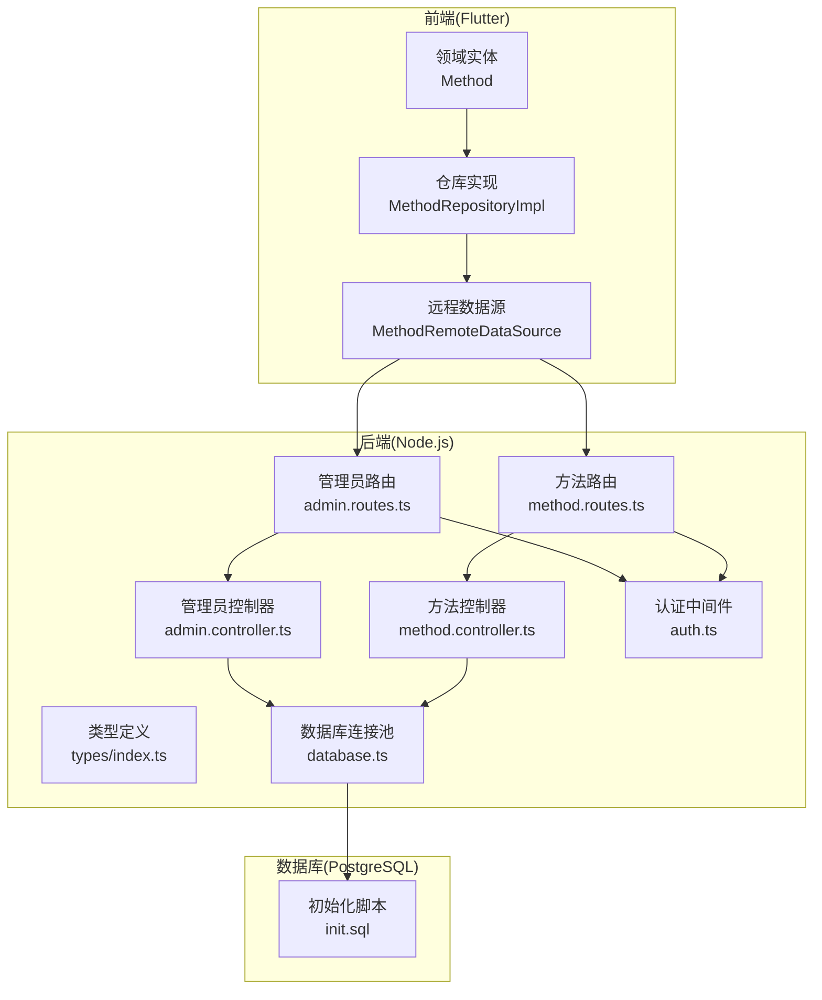
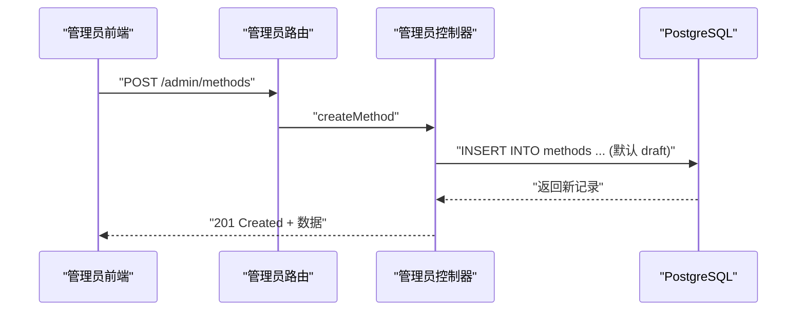
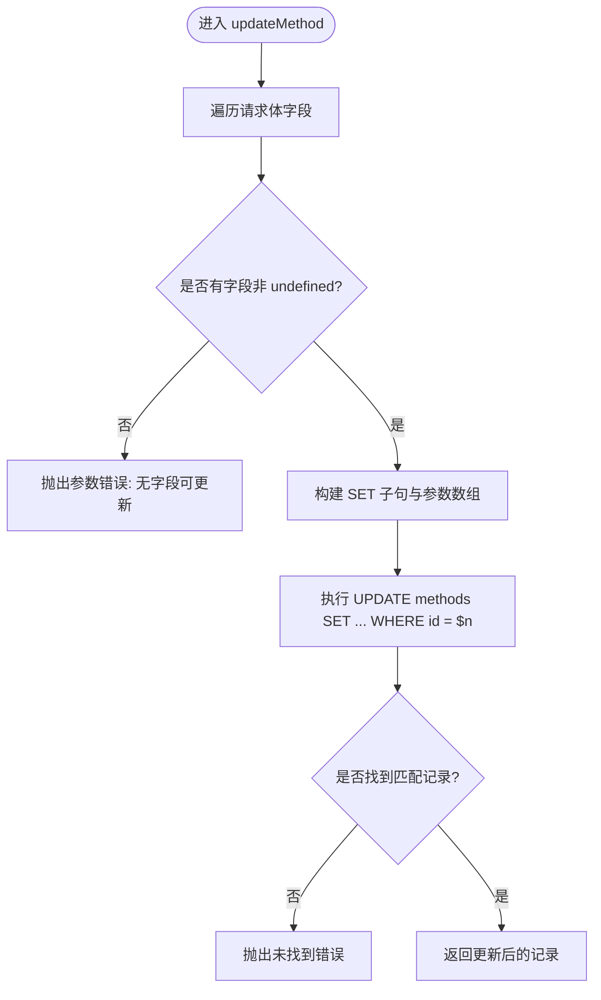
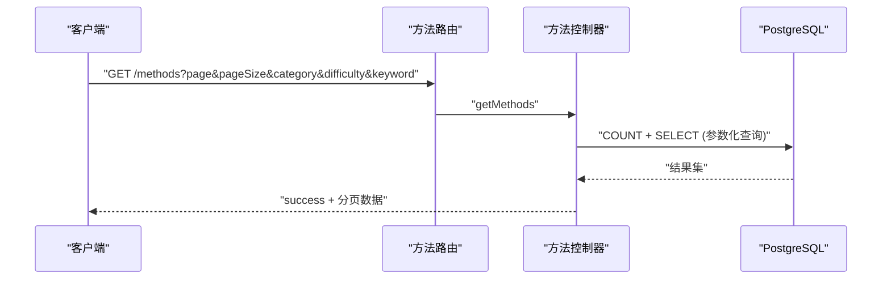
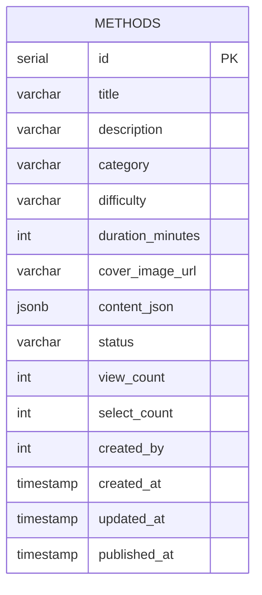
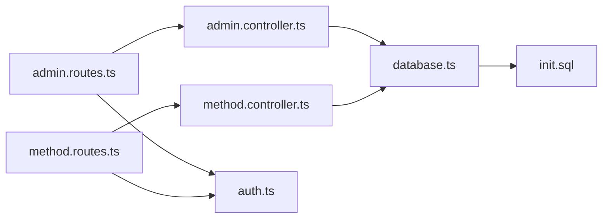

# 方法管理逻辑

<cite>
**本文引用的文件**
- [backend/src/controllers/admin.controller.ts](file://backend/src/controllers/admin.controller.ts)
- [backend/src/controllers/method.controller.ts](file://backend/src/controllers/method.controller.ts)
- [backend/src/routes/admin.routes.ts](file://backend/src/routes/admin.routes.ts)
- [backend/src/routes/method.routes.ts](file://backend/src/routes/method.routes.ts)
- [backend/src/middleware/auth.ts](file://backend/src/middleware/auth.ts)
- [backend/src/config/database.ts](file://backend/src/config/database.ts)
- [backend/src/types/index.ts](file://backend/src/types/index.ts)
- [database/init.sql](file://database/init.sql)
- [flutter_app/lib/data/datasources/remote/method_remote_data_source.dart](file://flutter_app/lib/data/datasources/remote/method_remote_data_source.dart)
- [flutter_app/lib/data/repositories/method_repository_impl.dart](file://flutter_app/lib/data/repositories/method_repository_impl.dart)
- [flutter_app/lib/domain/entities/method.dart](file://flutter_app/lib/domain/entities/method.dart)
</cite>

## 目录
1. [引言](#引言)
2. [项目结构](#项目结构)
3. [核心组件](#核心组件)
4. [架构总览](#架构总览)
5. [详细组件分析](#详细组件分析)
6. [依赖关系分析](#依赖关系分析)
7. [性能考量](#性能考量)
8. [故障排查指南](#故障排查指南)
9. [结论](#结论)
10. [附录](#附录)

## 引言
本文件围绕“心理调节方法”的全生命周期管理进行深入解析，覆盖创建、查询、更新与删除四个核心操作。重点包括：
- createMethod 的必填字段校验与默认状态设置
- getAllMethods 的分页参数处理与动态条件查询的安全实现
- updateMethod 的动态字段拼接与空更新防护
- deleteMethod 的硬删除实现
- 结合数据库 methods 表结构解释字段含义与约束
- 提供实际使用示例，包括创建方法的请求参数构造与更新方法的增量更新模式

## 项目结构
后端采用 Express + PostgreSQL + Redis 的技术栈，按职责拆分为控制器、路由、中间件、类型定义与数据库初始化脚本；前端 Flutter 应用通过远程数据源调用后端接口。

图表来源
- [backend/src/routes/admin.routes.ts](file://backend/src/routes/admin.routes.ts#L1-L69)
- [backend/src/routes/method.routes.ts](file://backend/src/routes/method.routes.ts#L1-L20)
- [backend/src/controllers/admin.controller.ts](file://backend/src/controllers/admin.controller.ts#L69-L264)
- [backend/src/controllers/method.controller.ts](file://backend/src/controllers/method.controller.ts#L1-L73)
- [backend/src/middleware/auth.ts](file://backend/src/middleware/auth.ts#L1-L87)
- [backend/src/config/database.ts](file://backend/src/config/database.ts#L1-L47)
- [database/init.sql](file://database/init.sql#L19-L36)

章节来源
- [backend/src/routes/admin.routes.ts](file://backend/src/routes/admin.routes.ts#L1-L69)
- [backend/src/routes/method.routes.ts](file://backend/src/routes/method.routes.ts#L1-L20)
- [backend/src/controllers/admin.controller.ts](file://backend/src/controllers/admin.controller.ts#L69-L264)
- [backend/src/controllers/method.controller.ts](file://backend/src/controllers/method.controller.ts#L1-L73)
- [backend/src/middleware/auth.ts](file://backend/src/middleware/auth.ts#L1-L87)
- [backend/src/config/database.ts](file://backend/src/config/database.ts#L1-L47)
- [database/init.sql](file://database/init.sql#L19-L36)

## 核心组件
- 管理员控制器：提供方法的创建、更新、删除、审核流程与后台列表查询。
- 方法控制器：提供公开方法列表、详情、推荐、分类等面向用户的查询能力。
- 路由层：将 HTTP 请求映射到对应控制器方法，并在管理员路由中统一挂载管理员认证中间件。
- 认证中间件：为管理员路由提供 JWT 校验与角色判定，为用户路由提供用户态注入。
- 类型定义：统一前后端交互的数据模型与分页响应结构。
- 数据库初始化：定义 methods 表结构、索引与触发器，确保字段约束与自动更新时间。

章节来源
- [backend/src/controllers/admin.controller.ts](file://backend/src/controllers/admin.controller.ts#L69-L264)
- [backend/src/controllers/method.controller.ts](file://backend/src/controllers/method.controller.ts#L1-L73)
- [backend/src/routes/admin.routes.ts](file://backend/src/routes/admin.routes.ts#L1-L69)
- [backend/src/routes/method.routes.ts](file://backend/src/routes/method.routes.ts#L1-L20)
- [backend/src/middleware/auth.ts](file://backend/src/middleware/auth.ts#L1-L87)
- [backend/src/types/index.ts](file://backend/src/types/index.ts#L18-L35)
- [database/init.sql](file://database/init.sql#L19-L36)

## 架构总览
管理员侧方法管理通过路由层进入管理员控制器，执行创建/更新/删除等操作；用户侧方法查询通过方法路由进入方法控制器，返回公开数据。两者均依赖数据库连接池与统一的错误处理。

图表来源
- [backend/src/routes/admin.routes.ts](file://backend/src/routes/admin.routes.ts#L36-L40)
- [backend/src/controllers/admin.controller.ts](file://backend/src/controllers/admin.controller.ts#L129-L164)
- [database/init.sql](file://database/init.sql#L19-L36)

## 详细组件分析

### 管理员方法管理（创建/更新/删除/审核）
- createMethod
  - 必填字段校验：标题、描述、分类、难度、时长、内容 JSON 为必填项，缺失则抛出参数错误。
  - 默认状态：插入时显式设置状态为草稿。
  - 返回：返回完整创建后的记录。
- updateMethod
  - 动态字段拼接：仅当字段存在且非 undefined 时才加入更新集合，避免空更新。
  - 空更新防护：若无任何字段被更新，直接抛出参数错误。
  - 返回：返回更新后的记录。
- deleteMethod
  - 硬删除：直接执行 DELETE FROM methods WHERE id = $1，返回成功消息。
- 审核流程
  - 提交审核：将状态从草稿更新为待审。
  - 审核通过：仅超级管理员可操作，将状态更新为已发布并写入发布时间。
  - 审核拒绝：仅超级管理员可操作，将状态回退为草稿，并记录拒绝原因。

图表来源
- [backend/src/controllers/admin.controller.ts](file://backend/src/controllers/admin.controller.ts#L166-L245)

章节来源
- [backend/src/controllers/admin.controller.ts](file://backend/src/controllers/admin.controller.ts#L129-L264)

### 用户方法查询（公开列表/详情/推荐/分类）
- getMethods
  - 分页参数：page、pageSize 默认值与 offset/limit 计算。
  - 动态条件：status 固定为已发布；category、difficulty、keyword 支持多条件组合查询。
  - 安全性：使用参数化查询，防止 SQL 注入；ILIKE 实现大小写无关模糊匹配。
  - 返回：分页响应对象包含 list、total、page、pageSize。
- getMethodById
  - 仅返回已发布的方法；命中后增加浏览计数。
- getRecommendedMethods
  - 基于用户已选方法的分类与热门度进行推荐，限制数量。
- getCategories
  - 返回已发布方法的分类与数量统计。

图表来源
- [backend/src/routes/method.routes.ts](file://backend/src/routes/method.routes.ts#L1-L18)
- [backend/src/controllers/method.controller.ts](file://backend/src/controllers/method.controller.ts#L1-L73)
- [database/init.sql](file://database/init.sql#L19-L36)

章节来源
- [backend/src/controllers/method.controller.ts](file://backend/src/controllers/method.controller.ts#L1-L73)
- [backend/src/routes/method.routes.ts](file://backend/src/routes/method.routes.ts#L1-L18)

### 数据库 methods 表结构与约束
- 字段与含义
  - id：主键
  - title：标题，必填
  - description：描述，必填
  - category：分类，必填
  - difficulty：难度，必填
  - duration_minutes：建议时长，必填
  - cover_image_url：封面图 URL
  - content_json：方法内容（JSONB），必填
  - status：状态，默认草稿
  - view_count/select_count：浏览/选择计数，默认 0
  - created_by：创建者（管理员）
  - created_at/updated_at：创建与更新时间，默认当前时间
  - published_at：发布时间
- 索引
  - 对 status、category、difficulty、created_at 建立索引，提升查询效率
- 触发器
  - 自动更新 updated_at 列

图表来源
- [database/init.sql](file://database/init.sql#L19-L36)

章节来源
- [database/init.sql](file://database/init.sql#L19-L36)

### 前端集成与使用示例
- 前端调用链
  - MethodRemoteDataSource：封装 HTTP 请求，支持分页与过滤参数。
  - MethodRepositoryImpl：统一异常转换与返回 Either。
  - Domain Entity Method：承载展示所需字段。
- 创建方法请求参数构造
  - 必填字段：title、description、category、difficulty、duration_minutes、content_json
  - 可选字段：cover_image_url
  - 默认状态：服务端会设置为草稿
- 更新方法增量更新模式
  - 仅传递需要变更的字段，避免 undefined 字段参与更新
  - 若无字段可更新，服务端会拒绝该请求

章节来源
- [flutter_app/lib/data/datasources/remote/method_remote_data_source.dart](file://flutter_app/lib/data/datasources/remote/method_remote_data_source.dart#L12-L34)
- [flutter_app/lib/data/repositories/method_repository_impl.dart](file://flutter_app/lib/data/repositories/method_repository_impl.dart#L14-L36)
- [flutter_app/lib/domain/entities/method.dart](file://flutter_app/lib/domain/entities/method.dart#L1-L77)
- [backend/src/controllers/admin.controller.ts](file://backend/src/controllers/admin.controller.ts#L129-L245)

## 依赖关系分析
- 控制器依赖
  - 管理员控制器依赖数据库连接池与认证中间件，负责方法的全生命周期管理。
  - 方法控制器依赖数据库连接池与认证中间件，负责公开查询。
- 路由依赖
  - 管理员路由统一挂载管理员认证中间件，保护方法管理与审核接口。
  - 方法路由部分接口需要用户认证中间件。
- 数据库依赖
  - methods 表结构与索引直接影响查询性能与安全性。
  - 触发器保证 updated_at 自动更新。

图表来源
- [backend/src/routes/admin.routes.ts](file://backend/src/routes/admin.routes.ts#L1-L69)
- [backend/src/routes/method.routes.ts](file://backend/src/routes/method.routes.ts#L1-L20)
- [backend/src/controllers/admin.controller.ts](file://backend/src/controllers/admin.controller.ts#L69-L264)
- [backend/src/controllers/method.controller.ts](file://backend/src/controllers/method.controller.ts#L1-L73)
- [backend/src/middleware/auth.ts](file://backend/src/middleware/auth.ts#L1-L87)
- [backend/src/config/database.ts](file://backend/src/config/database.ts#L1-L47)
- [database/init.sql](file://database/init.sql#L19-L36)

章节来源
- [backend/src/routes/admin.routes.ts](file://backend/src/routes/admin.routes.ts#L1-L69)
- [backend/src/routes/method.routes.ts](file://backend/src/routes/method.routes.ts#L1-L20)
- [backend/src/controllers/admin.controller.ts](file://backend/src/controllers/admin.controller.ts#L69-L264)
- [backend/src/controllers/method.controller.ts](file://backend/src/controllers/method.controller.ts#L1-L73)
- [backend/src/middleware/auth.ts](file://backend/src/middleware/auth.ts#L1-L87)
- [backend/src/config/database.ts](file://backend/src/config/database.ts#L1-L47)
- [database/init.sql](file://database/init.sql#L19-L36)

## 性能考量
- 分页与索引
  - 使用 offset/limit 实现分页，配合 status、category、difficulty、created_at 等索引，降低查询成本。
- 参数化查询
  - 所有动态条件均通过参数绑定，避免 SQL 注入并提升缓存命中率。
- 触发器与自动更新
  - updated_at 触发器减少应用层重复逻辑，保持一致性。
- 建议
  - 对高频查询字段（如 status、category）建立复合索引以进一步优化。
  - 对 keyword 模糊查询可考虑全文索引或专用搜索服务（如 PostgreSQL 的 tsvector）。

## 故障排查指南
- 常见错误与定位
  - 参数错误：创建/更新时缺少必填字段或无字段可更新。
  - 未找到：更新/删除/详情查询时 ID 不存在。
  - 权限不足：非管理员访问管理员路由或非超级管理员执行审核操作。
  - 认证失败：缺少或无效的 Bearer Token。
- 排查步骤
  - 检查请求头 Authorization 是否携带有效 Token。
  - 核对请求体字段是否满足必填要求。
  - 确认目标记录状态与权限级别是否允许当前操作。
  - 查看数据库连接与 Redis 连接状态。

章节来源
- [backend/src/controllers/admin.controller.ts](file://backend/src/controllers/admin.controller.ts#L129-L264)
- [backend/src/controllers/method.controller.ts](file://backend/src/controllers/method.controller.ts#L1-L73)
- [backend/src/middleware/auth.ts](file://backend/src/middleware/auth.ts#L1-L87)

## 结论
本系统围绕 methods 表实现了方法的全生命周期管理：管理员侧负责创建、更新、删除与审核，用户侧提供公开查询与推荐。通过严格的参数校验、参数化查询与索引设计，保障了功能正确性与运行性能。前端通过统一的数据源与仓库层对接后端 API，形成清晰的调用链路。

## 附录
- 关键实现路径参考
  - 创建方法：[createMethod](file://backend/src/controllers/admin.controller.ts#L129-L164)
  - 更新方法：[updateMethod](file://backend/src/controllers/admin.controller.ts#L166-L245)
  - 删除方法：[deleteMethod](file://backend/src/controllers/admin.controller.ts#L247-L264)
  - 公开列表查询：[getMethods](file://backend/src/controllers/method.controller.ts#L1-L73)
  - 详情查询：[getMethodById](file://backend/src/controllers/method.controller.ts#L76-L98)
  - 推荐查询：[getRecommendedMethods](file://backend/src/controllers/method.controller.ts#L100-L136)
  - 分类查询：[getCategories](file://backend/src/controllers/method.controller.ts#L138-L153)
  - 管理员路由挂载：[admin.routes.ts](file://backend/src/routes/admin.routes.ts#L36-L40)
  - 方法路由挂载：[method.routes.ts](file://backend/src/routes/method.routes.ts#L7-L17)
  - 认证中间件：[auth.ts](file://backend/src/middleware/auth.ts#L1-L87)
  - 数据库初始化：[init.sql](file://database/init.sql#L19-L36)