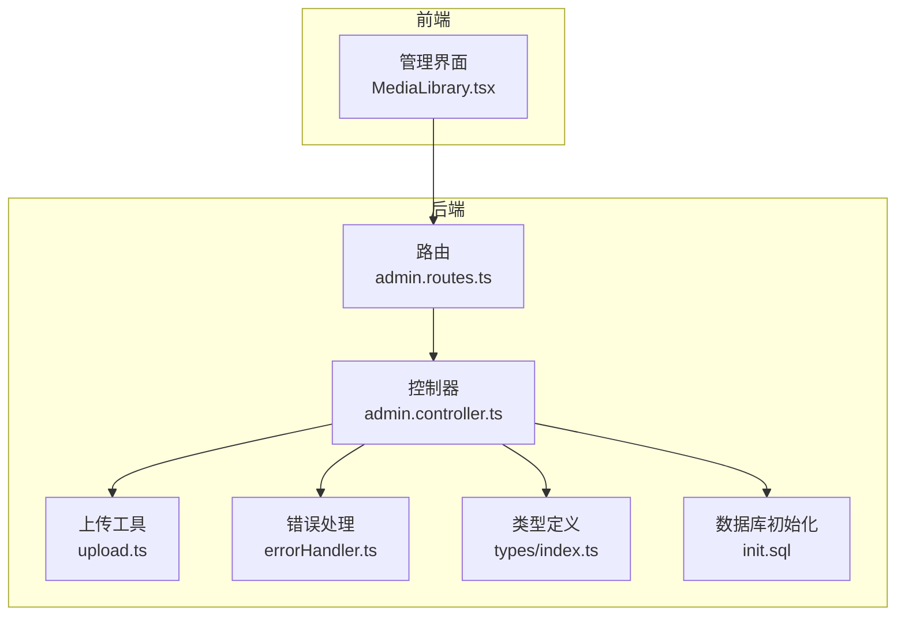
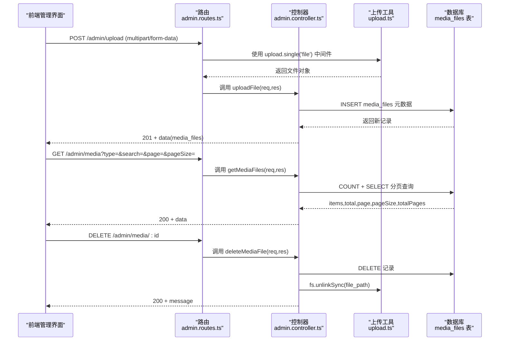
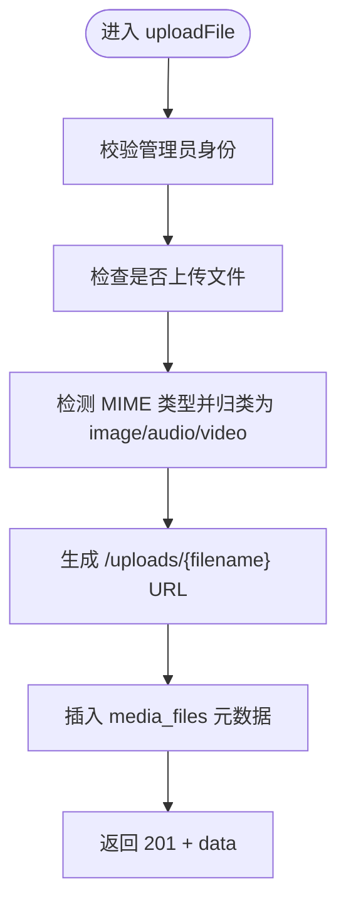
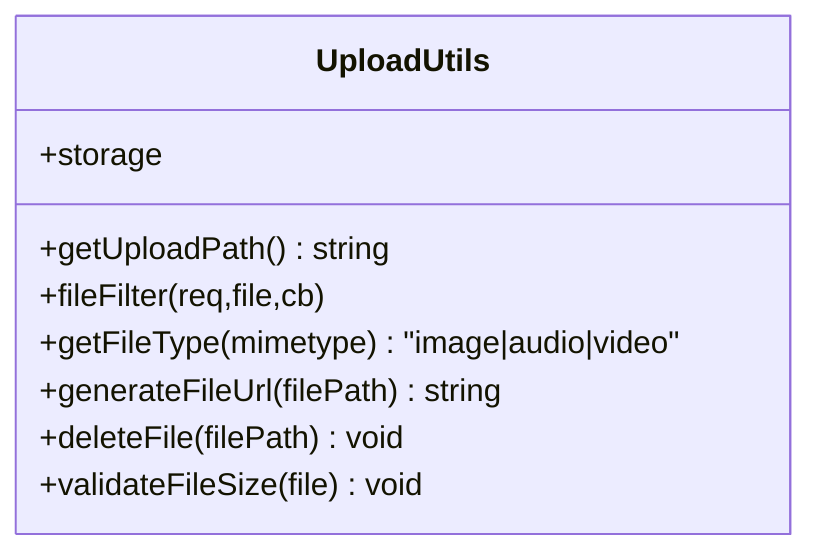
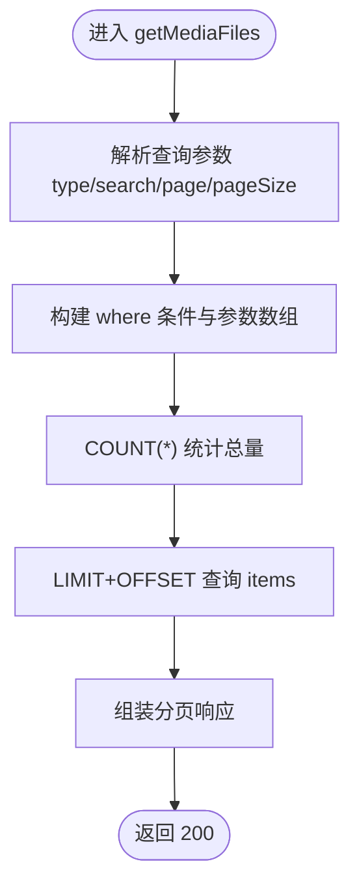
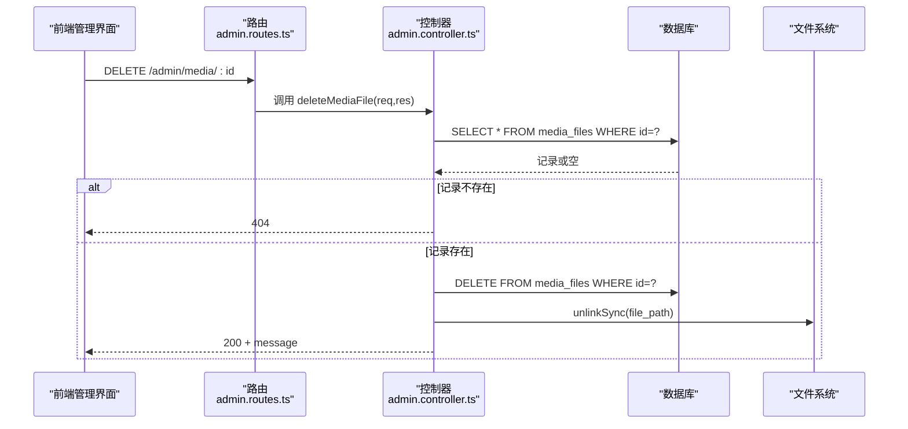
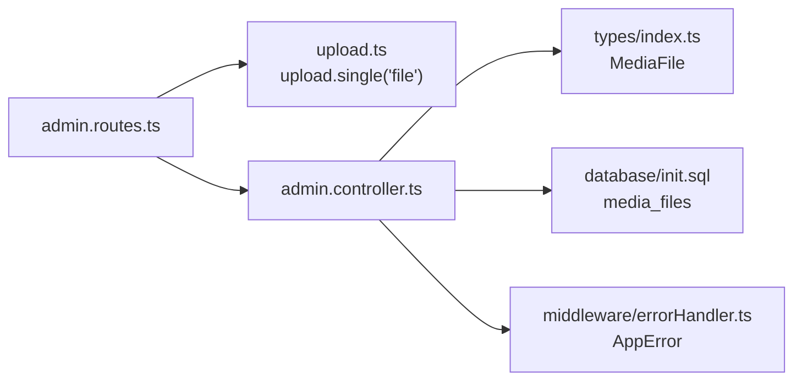

# 媒体文件管理逻辑

<cite>
**本文引用的文件**
- [backend/src/utils/upload.ts](file://backend/src/utils/upload.ts)
- [backend/src/controllers/admin.controller.ts](file://backend/src/controllers/admin.controller.ts)
- [backend/src/routes/admin.routes.ts](file://backend/src/routes/admin.routes.ts)
- [backend/src/middleware/errorHandler.ts](file://backend/src/middleware/errorHandler.ts)
- [backend/src/types/index.ts](file://backend/src/types/index.ts)
- [database/init.sql](file://database/init.sql)
- [home/user/nian/admin-web/src/pages/MediaLibrary.tsx](file://home/user/nian/admin-web/src/pages/MediaLibrary.tsx)
</cite>

## 目录
1. [简介](#简介)
2. [项目结构](#项目结构)
3. [核心组件](#核心组件)
4. [架构总览](#架构总览)
5. [详细组件分析](#详细组件分析)
6. [依赖关系分析](#依赖关系分析)
7. [性能与安全考量](#性能与安全考量)
8. [故障排查指南](#故障排查指南)
9. [结论](#结论)

## 简介
本文件系统化说明媒体文件管理功能的实现机制，覆盖文件上传、类型识别、存储管理与物理删除的完整流程。重点解析：
- uploadFile 控制器如何通过 multer 中间件处理文件上传，包括 MIME 类型检测（image/audio/video 分类）、文件路径生成与数据库元数据存储（media_files 表）。
- getMediaFiles 接口的搜索过滤功能实现，包括多条件组合查询（文件类型、关键词搜索）与分页响应结构。
- deleteMediaFile 的事务性处理策略：先删除数据库记录再清理物理文件，并对 fs.unlinkSync 同步删除进行异常处理。
- 结合 upload.ts 工具类，解释文件存储配置（如存储目录、文件名生成规则）的最佳实践。

## 项目结构
媒体文件管理相关代码分布在后端控制器、路由、工具类与数据库初始化脚本中；前端管理界面负责调用后端接口并展示结果。

图表来源
- [backend/src/routes/admin.routes.ts](file://backend/src/routes/admin.routes.ts#L51-L54)
- [backend/src/controllers/admin.controller.ts](file://backend/src/controllers/admin.controller.ts#L472-L604)
- [backend/src/utils/upload.ts](file://backend/src/utils/upload.ts#L1-L127)
- [backend/src/middleware/errorHandler.ts](file://backend/src/middleware/errorHandler.ts#L1-L48)
- [backend/src/types/index.ts](file://backend/src/types/index.ts#L112-L125)
- [database/init.sql](file://database/init.sql#L125-L141)
- [home/user/nian/admin-web/src/pages/MediaLibrary.tsx](file://home/user/nian/admin-web/src/pages/MediaLibrary.tsx#L75-L99)

章节来源
- [backend/src/routes/admin.routes.ts](file://backend/src/routes/admin.routes.ts#L51-L54)
- [backend/src/controllers/admin.controller.ts](file://backend/src/controllers/admin.controller.ts#L472-L604)
- [backend/src/utils/upload.ts](file://backend/src/utils/upload.ts#L1-L127)
- [database/init.sql](file://database/init.sql#L125-L141)
- [home/user/nian/admin-web/src/pages/MediaLibrary.tsx](file://home/user/nian/admin-web/src/pages/MediaLibrary.tsx#L75-L99)

## 核心组件
- 上传工具 upload.ts：封装 multer 配置、文件类型判断、文件大小限制、路径生成与物理删除等能力。
- 管理员控制器 admin.controller.ts：提供 uploadFile、getMediaFiles、deleteMediaFile 三个关键接口。
- 路由 admin.routes.ts：将 HTTP 请求映射到对应控制器方法，并挂载 multer 单文件上传中间件。
- 错误处理 middleware/errorHandler.ts：统一捕获 AppError 并返回标准错误响应。
- 类型定义 types/index.ts：定义 MediaFile 接口，确保前后端一致的数据结构。
- 数据库初始化 database/init.sql：创建 media_files 表及索引，定义字段与约束。

章节来源
- [backend/src/utils/upload.ts](file://backend/src/utils/upload.ts#L1-L127)
- [backend/src/controllers/admin.controller.ts](file://backend/src/controllers/admin.controller.ts#L472-L604)
- [backend/src/routes/admin.routes.ts](file://backend/src/routes/admin.routes.ts#L51-L54)
- [backend/src/middleware/errorHandler.ts](file://backend/src/middleware/errorHandler.ts#L1-L48)
- [backend/src/types/index.ts](file://backend/src/types/index.ts#L112-L125)
- [database/init.sql](file://database/init.sql#L125-L141)

## 架构总览
媒体文件管理采用“路由 -> 控制器 -> 工具/数据库”的分层设计。上传流程通过 multer 将文件写入磁盘并生成唯一文件名，随后将元数据持久化至 media_files 表；查询接口支持按类型与关键词过滤并分页返回；删除接口先删记录再删物理文件，保证一致性。

图表来源
- [backend/src/routes/admin.routes.ts](file://backend/src/routes/admin.routes.ts#L51-L54)
- [backend/src/controllers/admin.controller.ts](file://backend/src/controllers/admin.controller.ts#L472-L604)
- [backend/src/utils/upload.ts](file://backend/src/utils/upload.ts#L108-L117)
- [database/init.sql](file://database/init.sql#L125-L141)

## 详细组件分析

### 上传流程与类型识别（uploadFile）
- 路由绑定：使用 upload.single('file') 将 multipart/form-data 中名为 file 的字段交给 multer 处理。
- 类型识别：根据文件的 MIME 类型前缀进行 image/audio/video 判断，不符合则抛出 AppError。
- URL 生成：基于文件名生成 /uploads/{filename} 的 URL。
- 元数据入库：将 filename、original_name、file_type、mime_type、file_size、file_path、url、uploaded_by 写入 media_files 表。
- 响应：返回 201 与 data.media_files 对象。

图表来源
- [backend/src/controllers/admin.controller.ts](file://backend/src/controllers/admin.controller.ts#L472-L513)
- [backend/src/utils/upload.ts](file://backend/src/utils/upload.ts#L83-L106)

章节来源
- [backend/src/routes/admin.routes.ts](file://backend/src/routes/admin.routes.ts#L51-L54)
- [backend/src/controllers/admin.controller.ts](file://backend/src/controllers/admin.controller.ts#L472-L513)

### 文件类型识别与存储配置（upload.ts）
- 目录结构：自动创建 uploads/year/month 子目录，按年月组织文件，便于管理与清理。
- 文件名生成：采用 timestamp-randomsuffix.ext 的规则，避免同名冲突。
- 类型与大小限制：提供 getFileType 与 getFileSizeLimit，fileFilter 限定允许的 MIME 类型集合，limits 控制最大文件体积。
- URL 生成：从绝对路径中提取相对 uploads 路径并转换为 URL 路径。
- 物理删除：deleteFile 包装 fs.unlinkSync，包含存在性检查与异常捕获。

图表来源
- [backend/src/utils/upload.ts](file://backend/src/utils/upload.ts#L1-L127)

章节来源
- [backend/src/utils/upload.ts](file://backend/src/utils/upload.ts#L1-L127)

### 搜索与分页（getMediaFiles）
- 查询参数：type（all|image|audio|video）、search（关键词模糊匹配 filename 或 original_name）、page、pageSize。
- 动态拼接 where 条件：按 type 与 search 组合，使用 ILIKE 进行大小写不敏感匹配。
- 分页计算：offset=(page-1)*pageSize，limit=pageSize。
- 总量统计：先 COUNT(*) 得到 total，再 LIMIT+OFFSET 查询数据。
- 响应结构：data.items、data.total、data.page、data.pageSize、data.totalPages。

图表来源
- [backend/src/controllers/admin.controller.ts](file://backend/src/controllers/admin.controller.ts#L516-L573)

章节来源
- [backend/src/controllers/admin.controller.ts](file://backend/src/controllers/admin.controller.ts#L516-L573)
- [backend/src/types/index.ts](file://backend/src/types/index.ts#L112-L125)

### 删除流程与事务性策略（deleteMediaFile）
- 查询：先按 id 查询 media_files 记录，不存在则抛出 404。
- 删除顺序：先执行 DELETE FROM media_files，再同步删除物理文件 fs.unlinkSync。
- 异常处理：fs.unlinkSync 外层 try/catch 已在工具 deleteFile 中处理，控制器中直接调用 unlinkSync，若文件不存在则静默忽略。

图表来源
- [backend/src/controllers/admin.controller.ts](file://backend/src/controllers/admin.controller.ts#L575-L604)
- [backend/src/utils/upload.ts](file://backend/src/utils/upload.ts#L108-L117)

章节来源
- [backend/src/controllers/admin.controller.ts](file://backend/src/controllers/admin.controller.ts#L575-L604)
- [backend/src/utils/upload.ts](file://backend/src/utils/upload.ts#L108-L117)

### 前端调用与展示（MediaLibrary.tsx）
- 上传：使用 Ant Design Upload 组件，onChange 中监听 done/error，完成后刷新列表与统计。
- 查询：GET /admin/media，携带 type/search/page/pageSize 参数。
- 删除：DELETE /admin/media/:id，确认后刷新列表与统计。
- 预览与复制 URL：根据后端返回的 url 字段生成完整 URL 并复制。

章节来源
- [home/user/nian/admin-web/src/pages/MediaLibrary.tsx](file://home/user/nian/admin-web/src/pages/MediaLibrary.tsx#L75-L99)
- [home/user/nian/admin-web/src/pages/MediaLibrary.tsx](file://home/user/nian/admin-web/src/pages/MediaLibrary.tsx#L169-L178)
- [home/user/nian/admin-web/src/pages/MediaLibrary.tsx](file://home/user/nian/admin-web/src/pages/MediaLibrary.tsx#L379-L393)

## 依赖关系分析
- 路由依赖：admin.routes.ts 依赖 upload.ts 的 upload 单文件中间件与 admin.controller.ts 的三个接口。
- 控制器依赖：admin.controller.ts 依赖数据库连接池 pool、AppError 错误类、MediaFile 类型定义。
- 工具依赖：upload.ts 依赖 multer、path、fs、AppError。
- 数据库依赖：init.sql 定义 media_files 表结构与索引，供控制器读写。

图表来源
- [backend/src/routes/admin.routes.ts](file://backend/src/routes/admin.routes.ts#L51-L54)
- [backend/src/controllers/admin.controller.ts](file://backend/src/controllers/admin.controller.ts#L472-L604)
- [backend/src/utils/upload.ts](file://backend/src/utils/upload.ts#L1-L127)
- [backend/src/middleware/errorHandler.ts](file://backend/src/middleware/errorHandler.ts#L1-L48)
- [backend/src/types/index.ts](file://backend/src/types/index.ts#L112-L125)
- [database/init.sql](file://database/init.sql#L125-L141)

章节来源
- [backend/src/routes/admin.routes.ts](file://backend/src/routes/admin.routes.ts#L51-L54)
- [backend/src/controllers/admin.controller.ts](file://backend/src/controllers/admin.controller.ts#L472-L604)
- [backend/src/utils/upload.ts](file://backend/src/utils/upload.ts#L1-L127)
- [backend/src/middleware/errorHandler.ts](file://backend/src/middleware/errorHandler.ts#L1-L48)
- [backend/src/types/index.ts](file://backend/src/types/index.ts#L112-L125)
- [database/init.sql](file://database/init.sql#L125-L141)

## 性能与安全考量
- 存储组织：按年月子目录存放，有利于批量清理与容量管理。
- 文件名唯一性：timestamp-randomsuffix.ext 可有效避免重名冲突。
- 类型与大小限制：通过 fileFilter 与 getFileSizeLimit 控制上传类型与体积，防止恶意或超大文件占用空间。
- 分页查询：COUNT + LIMIT+OFFSET，建议配合索引（file_type、uploaded_by、created_at）提升查询性能。
- 删除策略：先删记录后删文件，避免悬挂文件；fs.unlinkSync 同步删除，失败不影响后续流程但需记录日志以便人工干预。
- 安全建议：生产环境建议开启 HTTPS、限制上传目录权限、对 URL 访问增加鉴权与白名单校验。

[本节为通用指导，无需列出具体文件来源]

## 故障排查指南
- 上传失败（无效类型）：检查 fileFilter 是否包含该 MIME 类型，或控制器中类型判断分支是否覆盖。
- 上传失败（文件过大）：确认 getFileSizeLimit 与 limits 配置，或调用 validateFileSize。
- 查询无结果：确认 type 与 search 参数是否正确传入，SQL 条件是否生效。
- 删除失败：检查 file_path 是否存在且可读写，fs.unlinkSync 是否抛错；必要时查看日志定位。
- 错误响应：统一由 errorHandler 捕获 AppError 并返回 {success:false, error:{code,message}}。

章节来源
- [backend/src/utils/upload.ts](file://backend/src/utils/upload.ts#L27-L41)
- [backend/src/utils/upload.ts](file://backend/src/utils/upload.ts#L43-L53)
- [backend/src/utils/upload.ts](file://backend/src/utils/upload.ts#L119-L127)
- [backend/src/middleware/errorHandler.ts](file://backend/src/middleware/errorHandler.ts#L1-L48)
- [backend/src/controllers/admin.controller.ts](file://backend/src/controllers/admin.controller.ts#L575-L604)

## 结论
媒体文件管理模块通过清晰的分层设计与严格的类型/大小限制，实现了稳定可靠的上传、检索与删除能力。upload.ts 提供了完善的存储配置与工具函数，admin.controller.ts 的三个接口覆盖了完整的业务闭环。配合前端管理界面，形成从上传、筛选、分页到删除的一体化体验。建议在生产环境中进一步强化访问控制、日志审计与定期巡检，确保系统的安全性与可靠性。