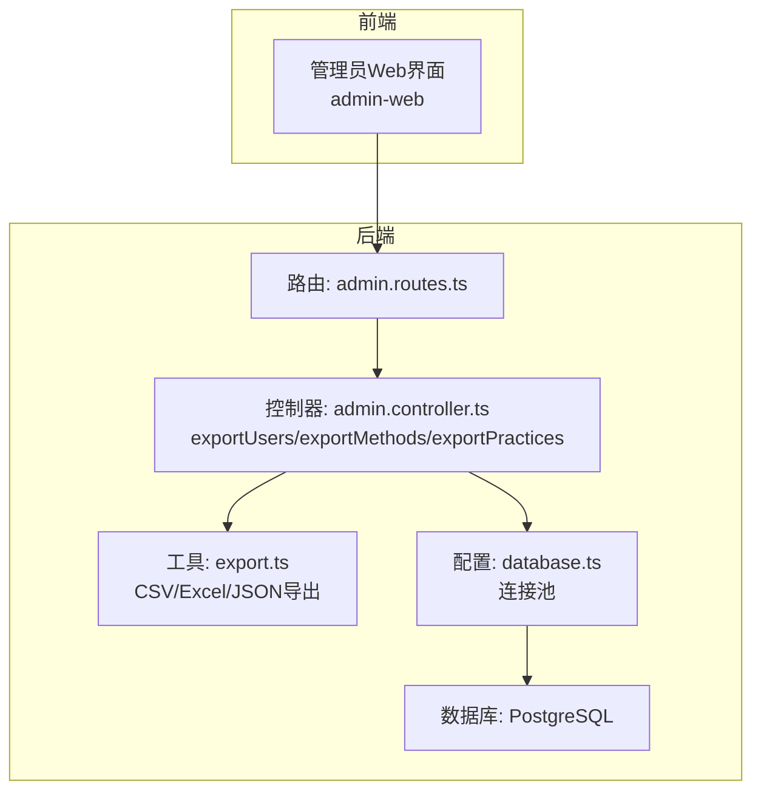
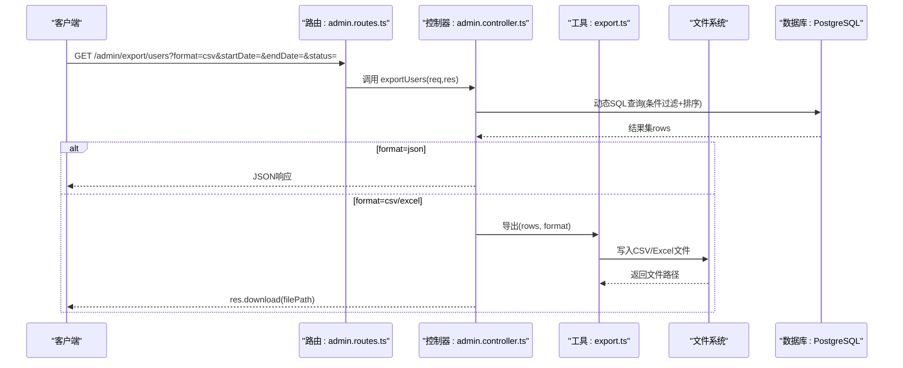
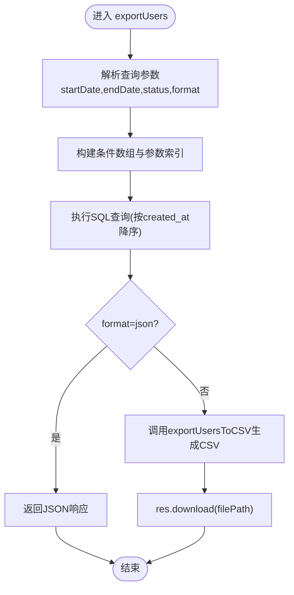
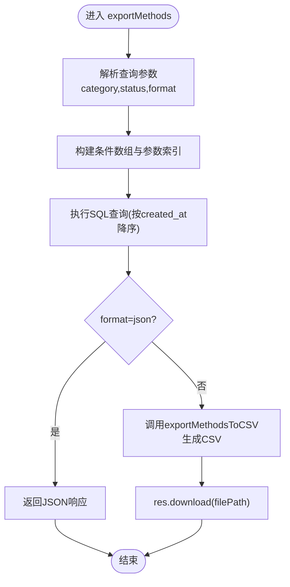
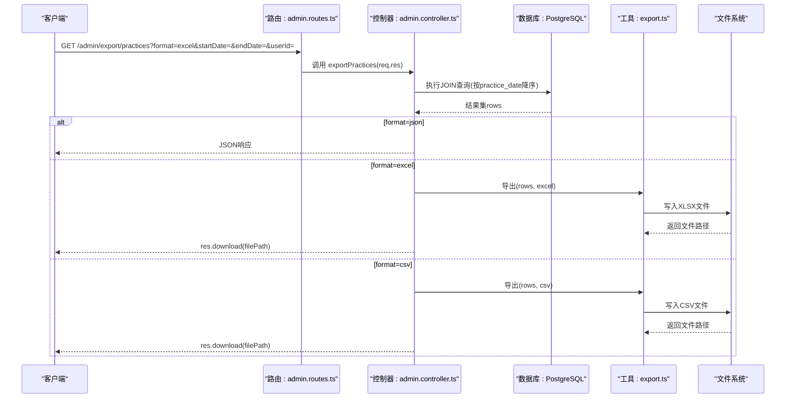
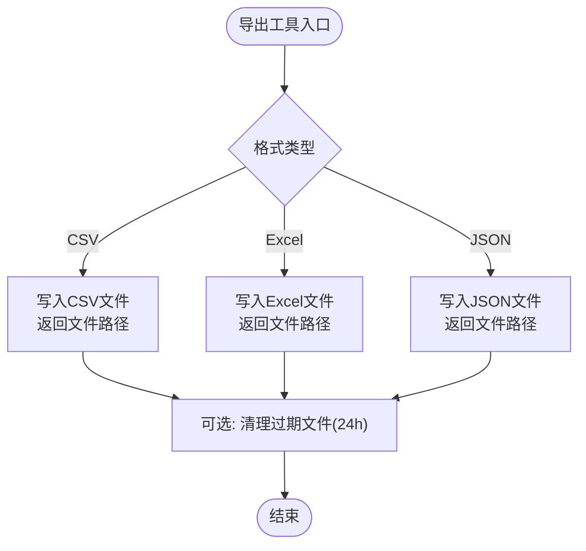
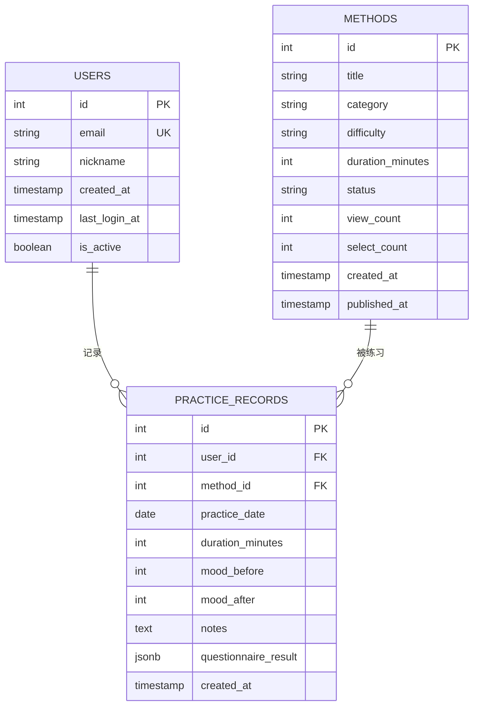
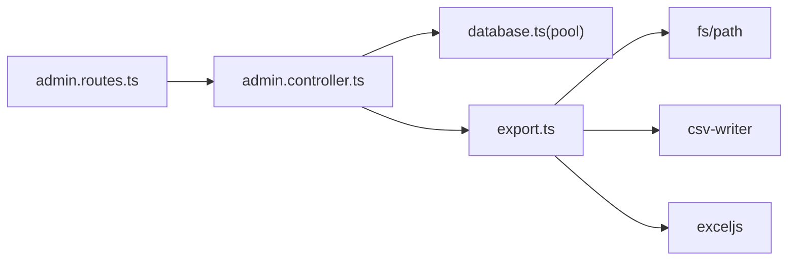

# 数据导出逻辑

<cite>
**本文引用的文件**
- [backend/src/controllers/admin.controller.ts](file://backend/src/controllers/admin.controller.ts)
- [backend/src/routes/admin.routes.ts](file://backend/src/routes/admin.routes.ts)
- [backend/src/utils/export.ts](file://backend/src/utils/export.ts)
- [backend/src/config/database.ts](file://backend/src/config/database.ts)
- [backend/src/types/index.ts](file://backend/src/types/index.ts)
- [database/init.sql](file://database/init.sql)
</cite>

## 目录
1. [简介](#简介)
2. [项目结构](#项目结构)
3. [核心组件](#核心组件)
4. [架构总览](#架构总览)
5. [详细组件分析](#详细组件分析)
6. [依赖关系分析](#依赖关系分析)
7. [性能考量](#性能考量)
8. [故障排查指南](#故障排查指南)
9. [结论](#结论)

## 简介
本文件聚焦于系统中“用户、方法、练习记录”三大核心数据的导出功能实现，围绕以下目标展开：
- 深入剖析三个导出控制器的查询构建逻辑，包括动态条件过滤（日期范围、状态筛选）与多表关联查询（练习记录关联用户与方法信息）。
- 对比多格式导出策略：JSON直接响应与CSV/Excel文件生成的差异处理，重点解析通过export.ts工具类实现的异步文件生成与res.download流式传输机制。
- 阐述导出安全考虑：大数据量的内存优化、临时文件清理策略与下载链接有效期管理。
- 提供性能优化建议：大数据集的分批查询与压缩传输等。

## 项目结构
后端采用Express + PostgreSQL + Redis的典型架构，导出功能位于admin控制器，路由在admin.routes中声明，导出工具位于utils/export.ts，数据库连接池在config/database.ts中配置，类型定义在types/index.ts中，数据库初始化脚本在database/init.sql中。

图表来源
- [backend/src/routes/admin.routes.ts](file://backend/src/routes/admin.routes.ts#L56-L60)
- [backend/src/controllers/admin.controller.ts](file://backend/src/controllers/admin.controller.ts#L608-L747)
- [backend/src/utils/export.ts](file://backend/src/utils/export.ts#L1-L130)
- [backend/src/config/database.ts](file://backend/src/config/database.ts#L1-L47)
- [database/init.sql](file://database/init.sql#L1-L120)

章节来源
- [backend/src/routes/admin.routes.ts](file://backend/src/routes/admin.routes.ts#L56-L60)
- [backend/src/controllers/admin.controller.ts](file://backend/src/controllers/admin.controller.ts#L608-L747)
- [backend/src/utils/export.ts](file://backend/src/utils/export.ts#L1-L130)
- [backend/src/config/database.ts](file://backend/src/config/database.ts#L1-L47)
- [database/init.sql](file://database/init.sql#L1-L120)

## 核心组件
- 导出路由：在admin.routes.ts中暴露三组GET接口，分别对应用户、方法、练习记录导出。
- 导出控制器：admin.controller.ts中的exportUsers、exportMethods、exportPractices负责参数解析、动态条件拼装、SQL查询与格式化输出。
- 导出工具：utils/export.ts提供CSV/Excel/JSON三种格式的异步文件生成，并内置过期文件清理。
- 数据库连接：config/database.ts提供PostgreSQL连接池，用于高并发场景下的稳定查询。
- 类型定义：types/index.ts定义了用户、方法、练习记录等核心实体类型，确保控制器与工具层的数据契约一致。
- 数据模型：database/init.sql定义了users、methods、practice_records等核心表及索引，支撑导出所需的多表关联与日期范围过滤。

章节来源
- [backend/src/routes/admin.routes.ts](file://backend/src/routes/admin.routes.ts#L56-L60)
- [backend/src/controllers/admin.controller.ts](file://backend/src/controllers/admin.controller.ts#L608-L747)
- [backend/src/utils/export.ts](file://backend/src/utils/export.ts#L1-L130)
- [backend/src/config/database.ts](file://backend/src/config/database.ts#L1-L47)
- [backend/src/types/index.ts](file://backend/src/types/index.ts#L1-L126)
- [database/init.sql](file://database/init.sql#L1-L120)

## 架构总览
导出流程遵循“请求 -> 路由 -> 控制器 -> 工具 -> 下载”的链路，其中：
- 请求参数通过query解析，动态构建WHERE子句与参数数组。
- 控制器根据format参数决定直接返回JSON或生成文件并通过res.download流式传输。
- 工具层负责将结果写入CSV/Excel/JSON文件，并返回文件路径。
- 过期文件清理通过定时任务或手动触发，避免磁盘膨胀。

图表来源
- [backend/src/routes/admin.routes.ts](file://backend/src/routes/admin.routes.ts#L56-L60)
- [backend/src/controllers/admin.controller.ts](file://backend/src/controllers/admin.controller.ts#L608-L747)
- [backend/src/utils/export.ts](file://backend/src/utils/export.ts#L1-L130)

## 详细组件分析

### 导出控制器：exportUsers
- 参数与过滤
  - 支持日期范围过滤：startDate、endDate（按created_at比较）。
  - 支持状态过滤：status=active/inactive映射为is_active布尔值。
  - 排序：按created_at降序。
- SQL构建
  - 条件数组与参数索引递增，保证占位符安全。
  - 使用WHERE子句拼接动态条件，避免SQL注入。
- 输出策略
  - format=json：直接返回JSON响应。
  - format=csv：调用exportUsersToCSV生成CSV文件并通过res.download流式下载。
- 错误处理
  - 使用AppError进行统一错误抛出，便于中间件捕获与标准化响应。

图表来源
- [backend/src/controllers/admin.controller.ts](file://backend/src/controllers/admin.controller.ts#L608-L655)
- [backend/src/utils/export.ts](file://backend/src/utils/export.ts#L18-L37)

章节来源
- [backend/src/controllers/admin.controller.ts](file://backend/src/controllers/admin.controller.ts#L608-L655)
- [backend/src/utils/export.ts](file://backend/src/utils/export.ts#L18-L37)

### 导出控制器：exportMethods
- 参数与过滤
  - 支持分类过滤：category。
  - 支持状态过滤：status（all表示不过滤）。
  - 排序：按created_at降序。
- SQL构建
  - 条件数组与参数索引递增，支持category与status的动态组合。
- 输出策略
  - format=json：直接返回JSON响应。
  - format=csv：调用exportMethodsToCSV生成CSV文件并通过res.download流式下载。

图表来源
- [backend/src/controllers/admin.controller.ts](file://backend/src/controllers/admin.controller.ts#L658-L698)
- [backend/src/utils/export.ts](file://backend/src/utils/export.ts#L39-L61)

章节来源
- [backend/src/controllers/admin.controller.ts](file://backend/src/controllers/admin.controller.ts#L658-L698)
- [backend/src/utils/export.ts](file://backend/src/utils/export.ts#L39-L61)

### 导出控制器：exportPractices
- 参数与过滤
  - 必填：startDate、endDate（按practice_date比较）。
  - 可选：userId（按pr.user_id过滤）。
  - 多表关联：JOIN users与methods，获取用户邮箱与方法标题。
- SQL构建
  - 固定日期范围条件，可选userId追加。
  - 使用WHERE子句拼接动态条件，保证占位符安全。
- 输出策略
  - format=json：直接返回JSON响应。
  - format=excel：调用exportPracticesToExcel生成Excel文件并通过res.download流式下载。
  - format=csv：当前分支会复用Excel导出逻辑（见后续说明），实际应生成CSV。
- 错误处理
  - 若缺少startDate或endDate，抛出参数校验错误。

图表来源
- [backend/src/routes/admin.routes.ts](file://backend/src/routes/admin.routes.ts#L56-L60)
- [backend/src/controllers/admin.controller.ts](file://backend/src/controllers/admin.controller.ts#L700-L747)
- [backend/src/utils/export.ts](file://backend/src/utils/export.ts#L63-L103)

章节来源
- [backend/src/controllers/admin.controller.ts](file://backend/src/controllers/admin.controller.ts#L700-L747)
- [backend/src/utils/export.ts](file://backend/src/utils/export.ts#L63-L103)

### 导出工具：export.ts
- CSV导出
  - 使用csv-writer生成CSV文件，列头与数据一一对应。
  - 生成唯一文件名（带时间戳），写入exports目录。
- Excel导出
  - 使用exceljs创建工作簿与工作表，设置列宽与表头样式。
  - 将数据逐行写入，保存为xlsx文件。
- JSON导出
  - 将数据序列化为JSON字符串，写入exports目录。
- 过期文件清理
  - 遍历exports目录，删除24小时前的文件，防止磁盘占用增长。

图表来源
- [backend/src/utils/export.ts](file://backend/src/utils/export.ts#L1-L130)

章节来源
- [backend/src/utils/export.ts](file://backend/src/utils/export.ts#L1-L130)

### 数据模型与索引
- users表：包含邮箱、昵称、注册时间、最后登录、激活状态等字段，导出用户时按created_at排序。
- methods表：包含标题、分类、难度、时长、状态、浏览/选择计数、发布时间等字段，导出方法时按created_at排序。
- practice_records表：包含用户ID、方法ID、练习日期、时长、前后心情、备注、问卷结果等字段，导出练习记录时按practice_date降序。
- 关键索引：users.created_at、methods.created_at、practice_records.user_id+date、practice_records.user_id+method_id等，有助于导出查询的性能。

图表来源
- [database/init.sql](file://database/init.sql#L1-L120)

章节来源
- [database/init.sql](file://database/init.sql#L1-L120)

## 依赖关系分析
- 控制器依赖
  - admin.controller.ts依赖config/database.ts提供的pool进行数据库查询。
  - admin.controller.ts在导出时动态require utils/export.ts，实现格式化输出。
- 工具依赖
  - export.ts依赖csv-writer与exceljs进行文件生成；依赖fs与path进行文件系统操作。
- 路由依赖
  - admin.routes.ts将导出接口映射到admin.controller.ts的具体函数。

图表来源
- [backend/src/routes/admin.routes.ts](file://backend/src/routes/admin.routes.ts#L56-L60)
- [backend/src/controllers/admin.controller.ts](file://backend/src/controllers/admin.controller.ts#L608-L747)
- [backend/src/utils/export.ts](file://backend/src/utils/export.ts#L1-L130)
- [backend/src/config/database.ts](file://backend/src/config/database.ts#L1-L47)

章节来源
- [backend/src/routes/admin.routes.ts](file://backend/src/routes/admin.routes.ts#L56-L60)
- [backend/src/controllers/admin.controller.ts](file://backend/src/controllers/admin.controller.ts#L608-L747)
- [backend/src/utils/export.ts](file://backend/src/utils/export.ts#L1-L130)
- [backend/src/config/database.ts](file://backend/src/config/database.ts#L1-L47)

## 性能考量
- 大数据量导出的内存优化
  - 当前实现将查询结果一次性加载到内存后再写入文件，适合中小规模数据。对于大规模数据，建议采用流式查询与分批写入，避免峰值内存占用。
- 分批查询与游标
  - 可使用LIMIT/OFFSET或服务端游标（cursor）进行分页导出，结合定时任务或后台作业队列，降低单次请求的资源消耗。
- 索引与排序
  - users与methods按created_at排序，practice_records按practice_date排序，配合WHERE条件可显著提升查询效率。
- 文件生成与传输
  - CSV/Excel/JSON均写入本地exports目录，再通过res.download流式传输，减少内存复制。建议对超大文件启用压缩传输（如gzip）以降低带宽占用。
- 连接池与并发
  - 使用连接池（最大20）并发查询，避免阻塞；导出期间可适当降低并发或限速，保障线上业务稳定性。

[本节为通用性能建议，不直接分析具体文件，故无章节来源]

## 故障排查指南
- 常见问题
  - 参数缺失：exportPractices要求startDate与endDate，若缺失将抛出参数校验错误。
  - 文件未生成：检查exports目录是否存在且具备写权限；确认工具层写入成功。
  - 下载失败：确认res.download传入的是有效文件路径；检查文件是否被清理。
  - SQL异常：检查动态条件拼装是否正确，参数索引是否递增。
- 日志与监控
  - 在控制器与工具层添加关键节点的日志记录，定位耗时点。
  - 对导出接口增加超时与重试策略，避免长时间占用连接。
- 安全加固
  - 严格校验输入参数类型与范围，防止注入与越权访问。
  - 对导出接口增加频率限制与鉴权，避免滥用。

章节来源
- [backend/src/controllers/admin.controller.ts](file://backend/src/controllers/admin.controller.ts#L700-L747)
- [backend/src/utils/export.ts](file://backend/src/utils/export.ts#L114-L130)

## 结论
本导出体系以“动态条件构建 + 多格式输出 + 流式传输”为核心设计，既满足快速导出需求，又通过工具层的文件生成与清理机制保障运行时稳定性。针对大规模数据，建议引入分批查询、游标与压缩传输等优化手段，进一步提升性能与用户体验。同时，完善参数校验、鉴权与限流策略，确保导出功能的安全与可靠。