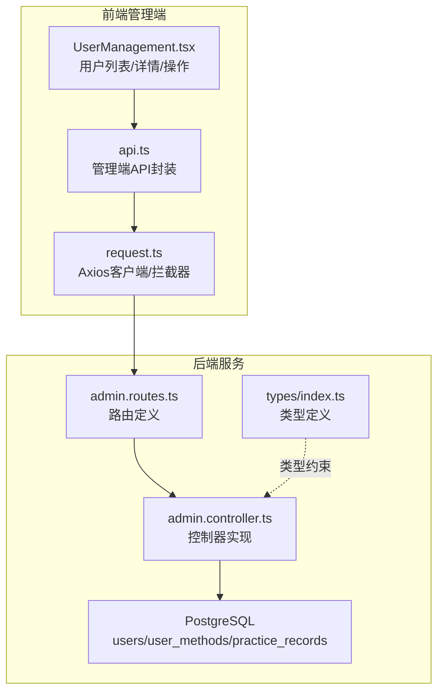
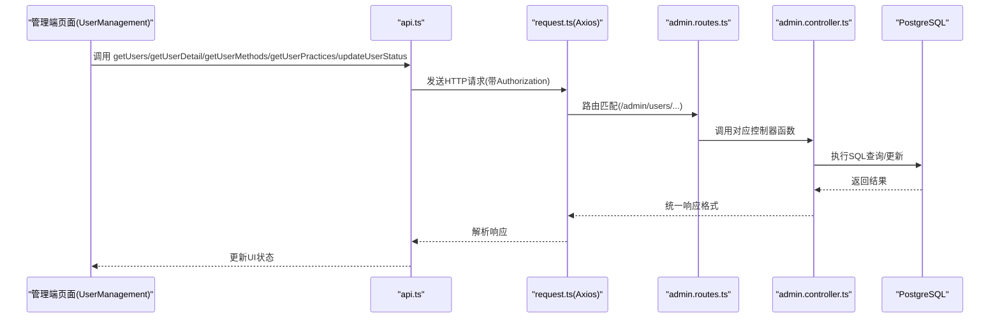
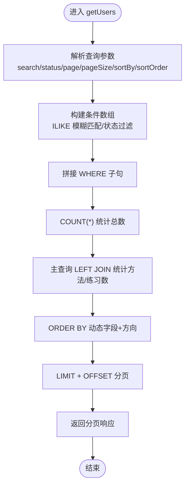
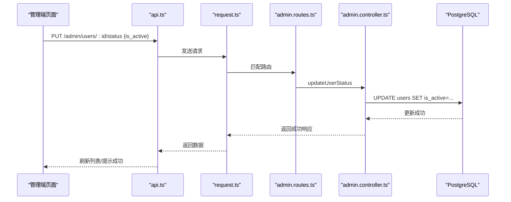
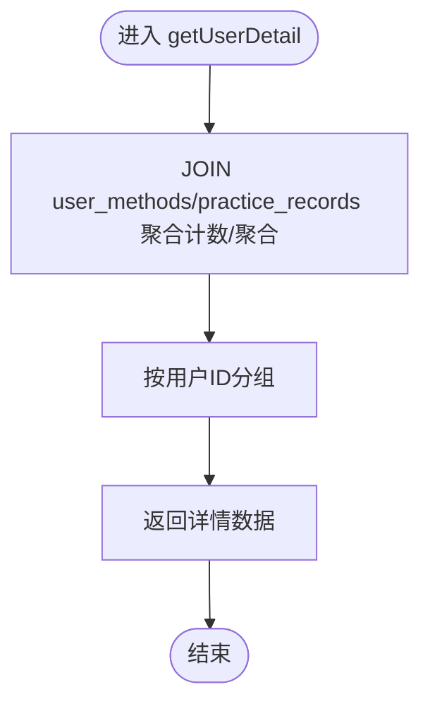
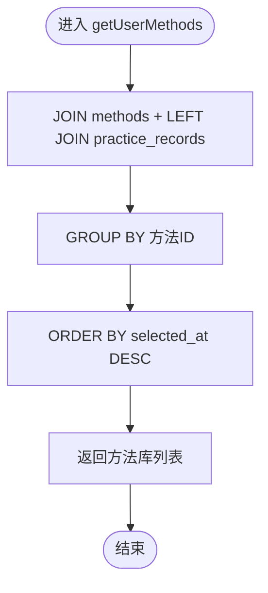
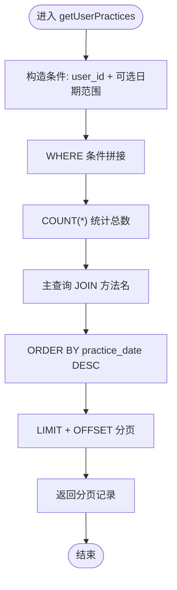
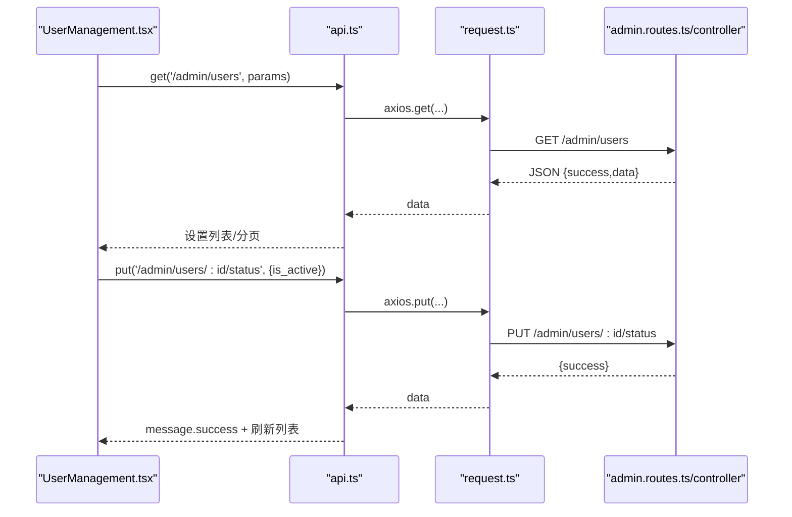
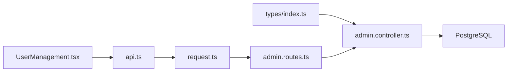
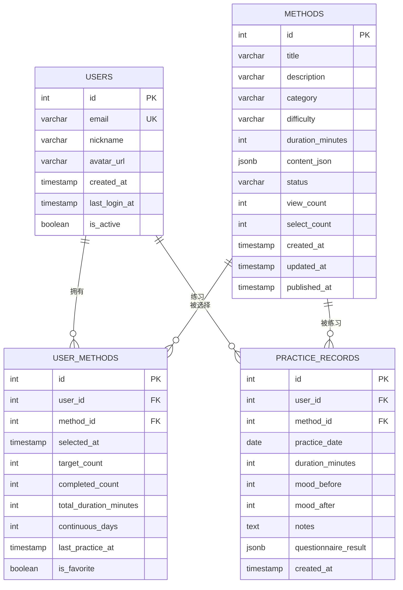

# 用户管理逻辑

<cite>
**本文引用的文件**
- [backend/src/controllers/admin.controller.ts](file://backend/src/controllers/admin.controller.ts)
- [backend/src/routes/admin.routes.ts](file://backend/src/routes/admin.routes.ts)
- [backend/src/types/index.ts](file://backend/src/types/index.ts)
- [database/init.sql](file://database/init.sql)
- [home/user/nian/admin-web/src/pages/UserManagement.tsx](file://home/user/nian/admin-web/src/pages/UserManagement.tsx)
- [home/user/nian/admin-web/src/services/api.ts](file://home/user/nian/admin-web/src/services/api.ts)
- [home/user/nian/admin-web/src/utils/request.ts](file://home/user/nian/admin-web/src/utils/request.ts)
</cite>

## 目录
1. [简介](#简介)
2. [项目结构](#项目结构)
3. [核心组件](#核心组件)
4. [架构总览](#架构总览)
5. [详细组件分析](#详细组件分析)
6. [依赖关系分析](#依赖关系分析)
7. [性能考量](#性能考量)
8. [故障排查指南](#故障排查指南)
9. [结论](#结论)
10. [附录](#附录)

## 简介
本文件面向管理员对普通用户的管理功能进行系统化文档化，覆盖用户列表查询、状态管理与行为分析。重点说明：
- getUsers 接口的复合查询能力：多字段模糊搜索（邮箱、昵称）、状态过滤（激活/非激活）、结果排序（按创建时间、登录时间等）。
- updateUserStatus 接口的状态变更业务规则与审计日志记录。
- getUserDetail、getUserMethods、getUserPractices 如何构建用户全景视图，关联查询个性化方法库与练习历史。
- 结合前端 UserManagement 页面，梳理批量操作的 API 调用模式与错误处理策略。

## 项目结构
后端采用控制器-路由分层，前端使用 React + Ant Design 的管理页面，通过统一的请求封装与拦截器完成鉴权与错误处理。

图表来源
- [backend/src/routes/admin.routes.ts](file://backend/src/routes/admin.routes.ts#L1-L98)
- [backend/src/controllers/admin.controller.ts](file://backend/src/controllers/admin.controller.ts#L1231-L1428)
- [backend/src/types/index.ts](file://backend/src/types/index.ts#L1-L126)
- [database/init.sql](file://database/init.sql#L1-L124)
- [home/user/nian/admin-web/src/pages/UserManagement.tsx](file://home/user/nian/admin-web/src/pages/UserManagement.tsx#L1-L456)
- [home/user/nian/admin-web/src/services/api.ts](file://home/user/nian/admin-web/src/services/api.ts#L1-L61)
- [home/user/nian/admin-web/src/utils/request.ts](file://home/user/nian/admin-web/src/utils/request.ts#L1-L81)

章节来源
- [backend/src/routes/admin.routes.ts](file://backend/src/routes/admin.routes.ts#L1-L98)
- [backend/src/controllers/admin.controller.ts](file://backend/src/controllers/admin.controller.ts#L1231-L1428)
- [backend/src/types/index.ts](file://backend/src/types/index.ts#L1-L126)
- [database/init.sql](file://database/init.sql#L1-L124)
- [home/user/nian/admin-web/src/pages/UserManagement.tsx](file://home/user/nian/admin-web/src/pages/UserManagement.tsx#L1-L456)
- [home/user/nian/admin-web/src/services/api.ts](file://home/user/nian/admin-web/src/services/api.ts#L1-L61)
- [home/user/nian/admin-web/src/utils/request.ts](file://home/user/nian/admin-web/src/utils/request.ts#L1-L81)

## 核心组件
- 后端控制器：提供用户管理相关接口实现，包含列表查询、详情、状态变更、方法库与练习记录查询。
- 路由层：暴露 /admin/users 及其子路径，统一鉴权中间件。
- 前端页面：UserManagement.tsx 实现用户列表筛选、排序、分页、详情弹窗、状态切换与批量操作。
- 数据模型：users、user_methods、practice_records 表及索引，支撑查询与统计。

章节来源
- [backend/src/controllers/admin.controller.ts](file://backend/src/controllers/admin.controller.ts#L1231-L1428)
- [backend/src/routes/admin.routes.ts](file://backend/src/routes/admin.routes.ts#L61-L67)
- [database/init.sql](file://database/init.sql#L1-L124)
- [home/user/nian/admin-web/src/pages/UserManagement.tsx](file://home/user/nian/admin-web/src/pages/UserManagement.tsx#L1-L456)

## 架构总览
管理员用户管理的端到端流程如下：

图表来源
- [home/user/nian/admin-web/src/pages/UserManagement.tsx](file://home/user/nian/admin-web/src/pages/UserManagement.tsx#L90-L141)
- [home/user/nian/admin-web/src/services/api.ts](file://home/user/nian/admin-web/src/services/api.ts#L1-L61)
- [home/user/nian/admin-web/src/utils/request.ts](file://home/user/nian/admin-web/src/utils/request.ts#L1-L81)
- [backend/src/routes/admin.routes.ts](file://backend/src/routes/admin.routes.ts#L61-L67)
- [backend/src/controllers/admin.controller.ts](file://backend/src/controllers/admin.controller.ts#L1231-L1428)
- [database/init.sql](file://database/init.sql#L1-L124)

## 详细组件分析

### 用户列表查询 getUsers
- 功能要点
  - 多字段模糊搜索：支持邮箱与昵称的模糊匹配。
  - 状态过滤：支持“激活/非激活”筛选。
  - 排序：支持按创建时间、最后登录时间、方法数、练习次数等字段排序。
  - 分页：内置分页参数 page/pageSize。
  - 关联统计：返回每条用户记录的方法数与练习次数。
- SQL 特性
  - 使用 ILIKE 进行大小写无关的模糊匹配。
  - 使用 LEFT JOIN 统计 user_methods 与 practice_records 数量。
  - 支持动态 ORDER BY 字段与方向。
- 复杂度
  - 时间复杂度近似 O(N)（N 为返回记录数），受索引影响；建议在 email、created_at、last_login_at 上保持索引。
  - 空间复杂度 O(N)。

图表来源
- [backend/src/controllers/admin.controller.ts](file://backend/src/controllers/admin.controller.ts#L1231-L1295)

章节来源
- [backend/src/controllers/admin.controller.ts](file://backend/src/controllers/admin.controller.ts#L1231-L1295)
- [database/init.sql](file://database/init.sql#L1-L18)

### 用户状态管理 updateUserStatus
- 功能要点
  - 接收 is_active 参数，执行用户状态更新。
  - 当前实现为直接更新 users.is_active 字段。
- 审计与会话影响
  - 当前控制器未记录审计日志。
  - 未对已登录会话进行强制失效处理。
- 建议改进
  - 引入审计日志记录（如插入 audit_logs 或用户变更日志表）。
  - 在禁用状态下主动使现有令牌失效（例如黑名单或签发新密钥）。

图表来源
- [backend/src/routes/admin.routes.ts](file://backend/src/routes/admin.routes.ts#L63-L63)
- [backend/src/controllers/admin.controller.ts](file://backend/src/controllers/admin.controller.ts#L1326-L1344)
- [home/user/nian/admin-web/src/pages/UserManagement.tsx](file://home/user/nian/admin-web/src/pages/UserManagement.tsx#L149-L157)

章节来源
- [backend/src/controllers/admin.controller.ts](file://backend/src/controllers/admin.controller.ts#L1326-L1344)
- [backend/src/routes/admin.routes.ts](file://backend/src/routes/admin.routes.ts#L63-L63)
- [home/user/nian/admin-web/src/pages/UserManagement.tsx](file://home/user/nian/admin-web/src/pages/UserManagement.tsx#L149-L157)

### 用户详情 getUserDetail
- 功能要点
  - 返回用户基本信息与统计指标：方法数、练习次数、总练习时长、平均心情改善。
  - 使用 LEFT JOIN 聚合计数与聚合统计。
- 性能
  - 单次查询即可获得用户全景视图，避免多次往返。

图表来源
- [backend/src/controllers/admin.controller.ts](file://backend/src/controllers/admin.controller.ts#L1298-L1324)

章节来源
- [backend/src/controllers/admin.controller.ts](file://backend/src/controllers/admin.controller.ts#L1298-L1324)
- [database/init.sql](file://database/init.sql#L43-L79)

### 用户方法库 getUserMethods
- 功能要点
  - 返回用户已选方法库，包含方法名、分类、难度、练习次数与收藏标记。
  - 使用 LEFT JOIN 统计每种方法的练习次数。
- 性能
  - 按选中时间倒序，便于展示最新选择。

图表来源
- [backend/src/controllers/admin.controller.ts](file://backend/src/controllers/admin.controller.ts#L1346-L1366)

章节来源
- [backend/src/controllers/admin.controller.ts](file://backend/src/controllers/admin.controller.ts#L1346-L1366)
- [database/init.sql](file://database/init.sql#L43-L61)

### 用户练习记录 getUserPractices
- 功能要点
  - 支持按日期范围筛选，支持分页。
  - 返回练习日期、方法名、时长、前后心情等。
- 性能
  - 使用 WHERE 条件与 LIMIT/OFFSET 实现分页，建议在 user_id/date 上建索引。

图表来源
- [backend/src/controllers/admin.controller.ts](file://backend/src/controllers/admin.controller.ts#L1368-L1427)

章节来源
- [backend/src/controllers/admin.controller.ts](file://backend/src/controllers/admin.controller.ts#L1368-L1427)
- [database/init.sql](file://database/init.sql#L63-L79)

### 前端 UserManagement 页面与批量操作
- 用户列表
  - 支持搜索邮箱/昵称、状态筛选、排序字段与方向切换、分页。
  - 调用 GET /admin/users 并传入 search/status/page/pageSize/sortBy/sortOrder。
- 详情弹窗
  - 点击“详情”后并发请求：GET /admin/users/:id、GET /admin/users/:id/methods、GET /admin/users/:id/practices。
  - 展示基本信息、统计卡片、方法库与最近练习记录。
- 状态切换
  - 通过 Switch 触发 PUT /admin/users/:id/status { is_active }。
  - 成功后刷新列表。
- 错误处理
  - 请求拦截器统一处理 401 自动跳转登录。
  - 页面内对各接口调用使用 try/catch 并提示消息。

图表来源
- [home/user/nian/admin-web/src/pages/UserManagement.tsx](file://home/user/nian/admin-web/src/pages/UserManagement.tsx#L90-L157)
- [home/user/nian/admin-web/src/services/api.ts](file://home/user/nian/admin-web/src/services/api.ts#L1-L61)
- [home/user/nian/admin-web/src/utils/request.ts](file://home/user/nian/admin-web/src/utils/request.ts#L1-L81)
- [backend/src/routes/admin.routes.ts](file://backend/src/routes/admin.routes.ts#L61-L67)
- [backend/src/controllers/admin.controller.ts](file://backend/src/controllers/admin.controller.ts#L1326-L1344)

章节来源
- [home/user/nian/admin-web/src/pages/UserManagement.tsx](file://home/user/nian/admin-web/src/pages/UserManagement.tsx#L1-L456)
- [home/user/nian/admin-web/src/services/api.ts](file://home/user/nian/admin-web/src/services/api.ts#L1-L61)
- [home/user/nian/admin-web/src/utils/request.ts](file://home/user/nian/admin-web/src/utils/request.ts#L1-L81)
- [backend/src/routes/admin.routes.ts](file://backend/src/routes/admin.routes.ts#L61-L67)
- [backend/src/controllers/admin.controller.ts](file://backend/src/controllers/admin.controller.ts#L1231-L1428)

## 依赖关系分析
- 控制器依赖
  - admin.controller.ts 依赖数据库连接池与统一错误类型 AppError。
  - 类型定义位于 types/index.ts，确保请求/响应结构一致。
- 路由依赖
  - admin.routes.ts 将 /admin/users 及其子路径映射到对应控制器函数。
- 前端依赖
  - UserManagement.tsx 通过 api.ts 封装的 HTTP 方法调用后端接口。
  - request.ts 提供全局拦截器，自动注入 Authorization 并处理 401。
- 数据库依赖
  - users、user_methods、practice_records 表及索引支撑查询性能。

图表来源
- [backend/src/types/index.ts](file://backend/src/types/index.ts#L1-L126)
- [backend/src/controllers/admin.controller.ts](file://backend/src/controllers/admin.controller.ts#L1231-L1428)
- [backend/src/routes/admin.routes.ts](file://backend/src/routes/admin.routes.ts#L1-L98)
- [database/init.sql](file://database/init.sql#L1-L124)
- [home/user/nian/admin-web/src/pages/UserManagement.tsx](file://home/user/nian/admin-web/src/pages/UserManagement.tsx#L1-L456)
- [home/user/nian/admin-web/src/services/api.ts](file://home/user/nian/admin-web/src/services/api.ts#L1-L61)
- [home/user/nian/admin-web/src/utils/request.ts](file://home/user/nian/admin-web/src/utils/request.ts#L1-L81)

章节来源
- [backend/src/types/index.ts](file://backend/src/types/index.ts#L1-L126)
- [backend/src/controllers/admin.controller.ts](file://backend/src/controllers/admin.controller.ts#L1231-L1428)
- [backend/src/routes/admin.routes.ts](file://backend/src/routes/admin.routes.ts#L1-L98)
- [database/init.sql](file://database/init.sql#L1-L124)
- [home/user/nian/admin-web/src/pages/UserManagement.tsx](file://home/user/nian/admin-web/src/pages/UserManagement.tsx#L1-L456)
- [home/user/nian/admin-web/src/services/api.ts](file://home/user/nian/admin-web/src/services/api.ts#L1-L61)
- [home/user/nian/admin-web/src/utils/request.ts](file://home/user/nian/admin-web/src/utils/request.ts#L1-L81)

## 性能考量
- 索引优化
  - users: email、created_at 等常用过滤/排序字段。
  - practice_records: user_id+practice_date、user_id+method_id、created_at。
  - user_methods: user_id、method_id、selected_at。
- 查询优化
  - 使用 LEFT JOIN 聚合计数，避免 N+1 查询。
  - 分页使用 LIMIT/OFFSET，避免一次性返回大量数据。
- 建议
  - 对高频查询增加物化视图或缓存层（如 Redis）存储热门用户统计。
  - 对模糊搜索使用 ILIKE 时注意索引策略，必要时考虑 gin 索引或全文检索。

章节来源
- [database/init.sql](file://database/init.sql#L1-L124)

## 故障排查指南
- 常见问题
  - 401 未授权：检查本地存储中的 admin_token 是否存在且有效；确认请求拦截器是否正确注入 Authorization。
  - 400 参数校验失败：确认请求体/查询参数是否符合接口要求（如 updateUserStatus 的 is_active）。
  - 404 用户不存在：确认用户 ID 是否正确。
- 前端处理
  - UserManagement.tsx 中对列表、详情、状态切换均使用 try/catch 并提示错误消息。
  - 请求拦截器对 401 自动清理本地 token 并跳转登录页。
- 后端处理
  - 控制器内部抛出 AppError，统一响应格式，便于前端识别。

章节来源
- [home/user/nian/admin-web/src/pages/UserManagement.tsx](file://home/user/nian/admin-web/src/pages/UserManagement.tsx#L90-L157)
- [home/user/nian/admin-web/src/utils/request.ts](file://home/user/nian/admin-web/src/utils/request.ts#L1-L81)
- [backend/src/controllers/admin.controller.ts](file://backend/src/controllers/admin.controller.ts#L1326-L1344)

## 结论
本模块围绕管理员对普通用户的管理提供了完整的 CRUD 与分析能力：复合查询、状态变更、用户全景视图与前端交互闭环。当前实现满足基本需求，建议后续增强审计日志与会话治理，以提升安全与可观测性。

## 附录
- 数据模型概览（users/user_methods/practice_records）

图表来源
- [database/init.sql](file://database/init.sql#L1-L124)