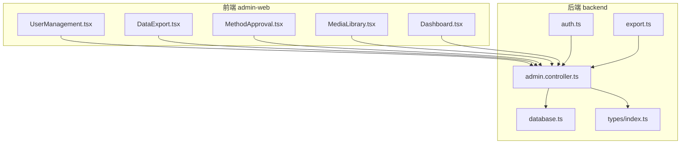
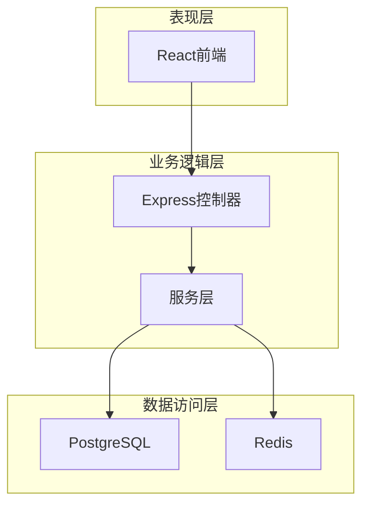
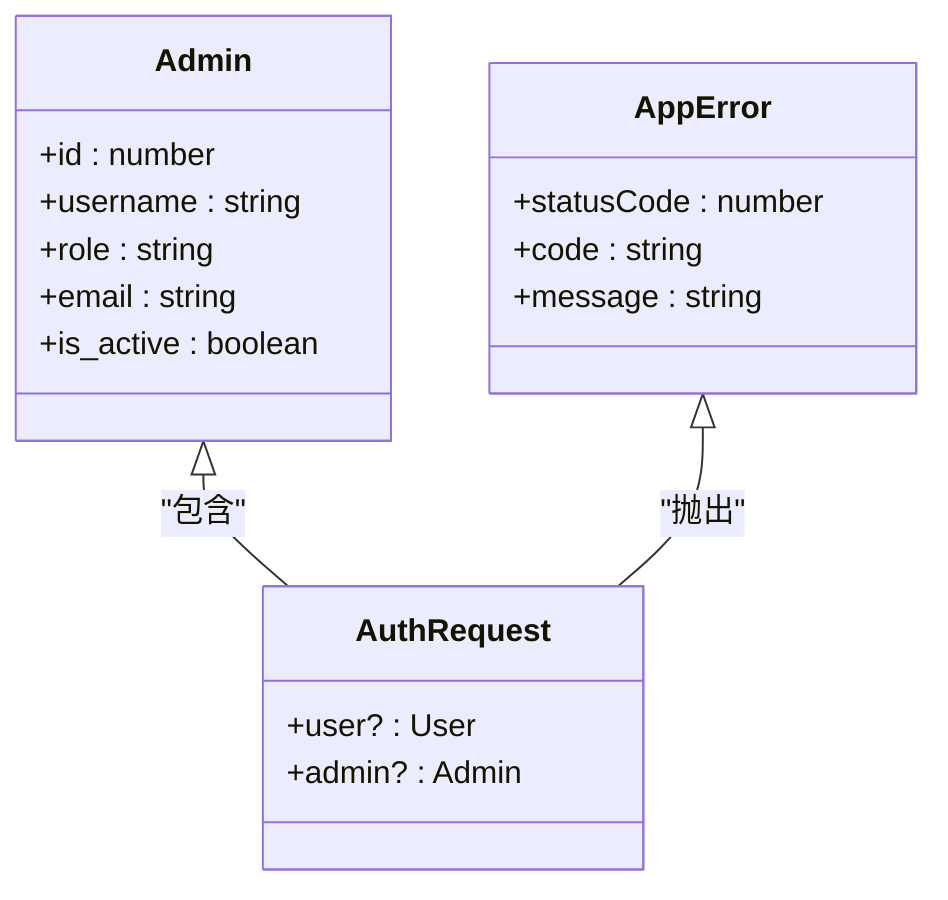
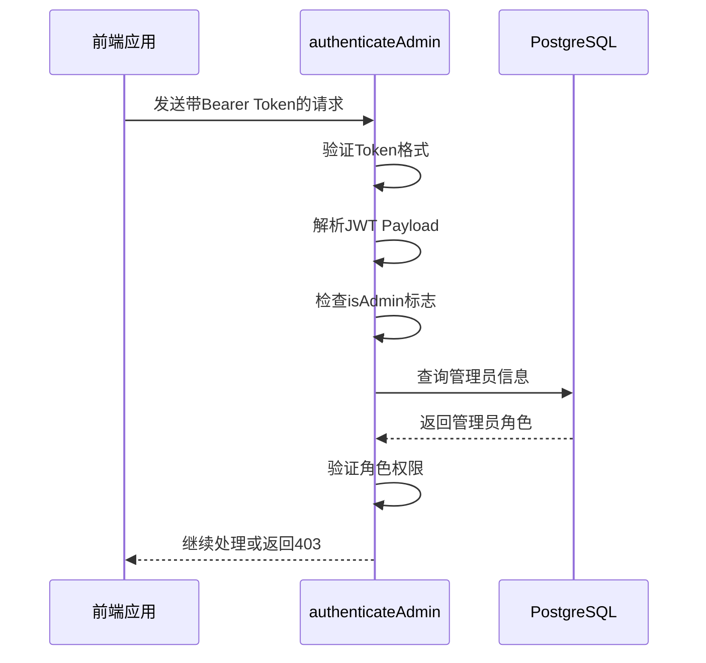
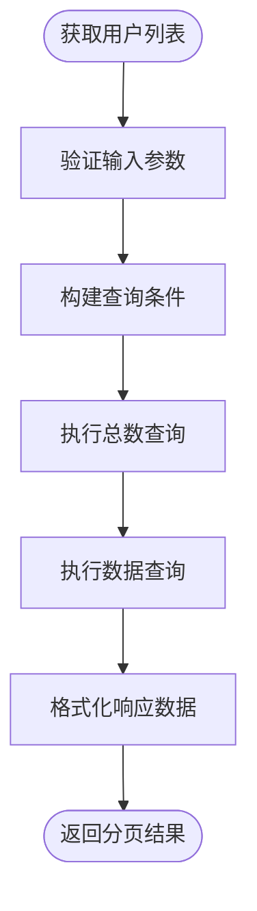
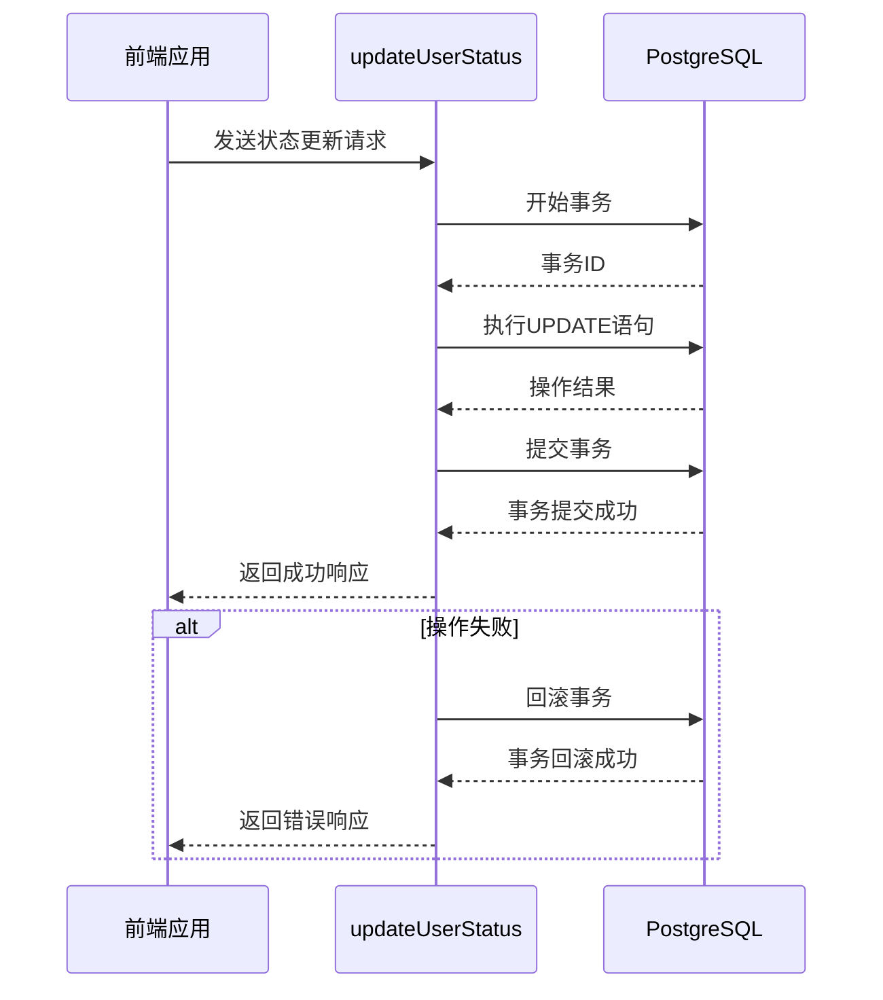
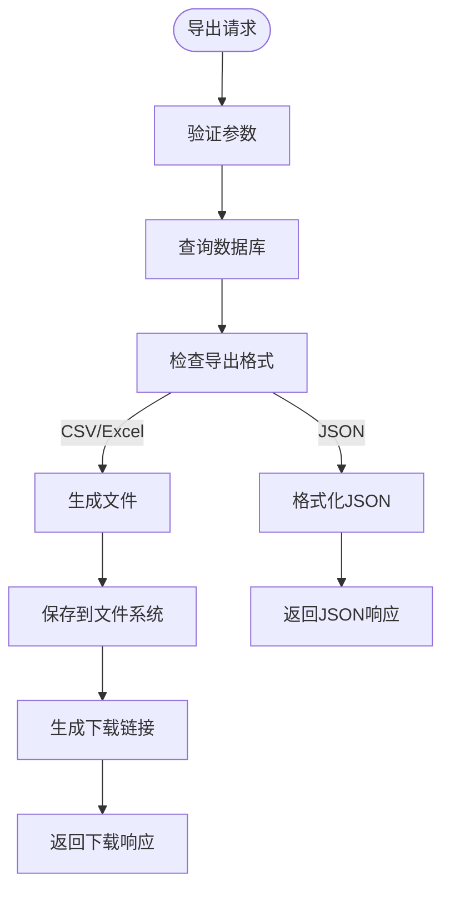
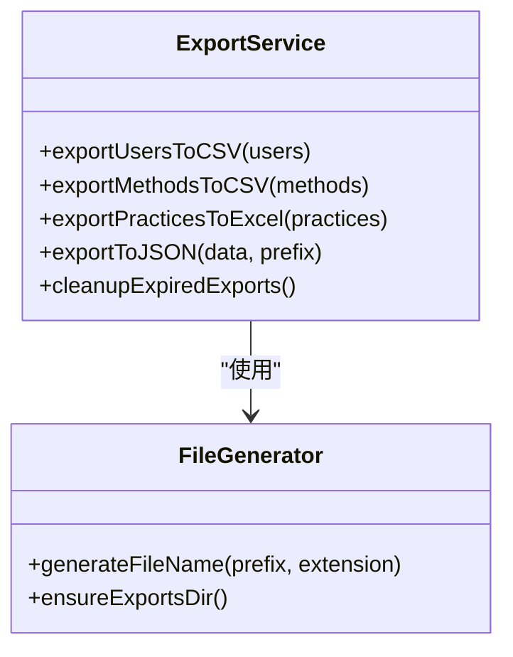
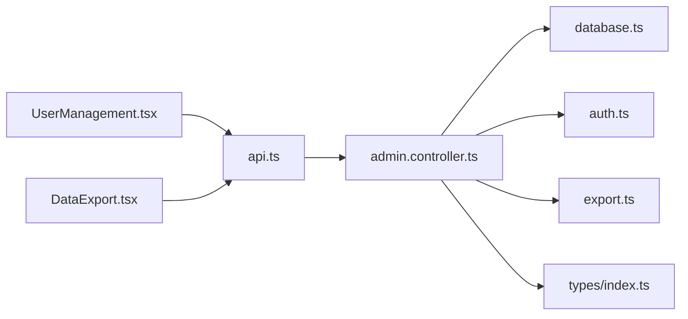

# 管理后台业务逻辑

<cite>
**本文档引用文件**   
- [admin.controller.ts](file://backend/src/controllers/admin.controller.ts)
- [auth.ts](file://backend/src/middleware/auth.ts)
- [export.ts](file://backend/src/utils/export.ts)
- [UserManagement.tsx](file://home/user/nian/admin-web/src/pages/UserManagement.tsx)
- [DataExport.tsx](file://home/user/nian/admin-web/src/pages/DataExport.tsx)
- [types/index.ts](file://backend/src/types/index.ts)
- [database.ts](file://backend/src/config/database.ts)
</cite>

## 目录
1. [引言](#引言)
2. [项目结构](#项目结构)
3. [核心组件](#核心组件)
4. [架构概述](#架构概述)
5. [详细组件分析](#详细组件分析)
6. [依赖分析](#依赖分析)
7. [性能考虑](#性能考虑)
8. [故障排除指南](#故障排除指南)
9. [结论](#结论)

## 引言
本文档全面解析管理后台的核心业务功能，重点分析管理员权限验证、用户管理、数据导出等关键接口的实现。详细说明RBAC权限模型的实施细节，包括角色定义、权限校验中间件的执行流程。阐述批量用户操作（如禁用、重置密码）的事务处理机制与错误恢复策略。解释数据导出功能的异步处理模式、文件生成格式（CSV/Excel）及安全下载链接的生成逻辑。结合管理后台的UserManagement和DataExport页面，说明前后端交互的最佳实践。

## 项目结构
管理后台项目采用前后端分离架构，后端基于Node.js + Express + PostgreSQL技术栈，前端采用React + Ant Design实现。项目结构清晰，模块化程度高，便于维护和扩展。

**图表来源**
- [admin.controller.ts](file://backend/src/controllers/admin.controller.ts)
- [UserManagement.tsx](file://home/user/nian/admin-web/src/pages/UserManagement.tsx)
- [DataExport.tsx](file://home/user/nian/admin-web/src/pages/DataExport.tsx)

**章节来源**
- [admin.controller.ts](file://backend/src/controllers/admin.controller.ts)
- [UserManagement.tsx](file://home/user/nian/admin-web/src/pages/UserManagement.tsx)

## 核心组件
管理后台的核心组件包括管理员认证、用户管理、方法管理、数据导出等模块。这些模块通过清晰的接口定义和严格的权限控制，确保系统的安全性和稳定性。

**章节来源**
- [admin.controller.ts](file://backend/src/controllers/admin.controller.ts)
- [types/index.ts](file://backend/src/types/index.ts)

## 架构概述
系统采用典型的三层架构：表现层（前端）、业务逻辑层（后端控制器）、数据访问层（数据库）。通过JWT实现无状态认证，利用Redis缓存提高性能，使用PostgreSQL作为持久化存储。

**图表来源**
- [admin.controller.ts](file://backend/src/controllers/admin.controller.ts)
- [database.ts](file://backend/src/config/database.ts)

## 详细组件分析

### 管理员权限验证分析
管理员权限验证采用RBAC（基于角色的访问控制）模型，通过JWT令牌实现安全认证。系统定义了三种角色：super_admin、content_admin、analyst，不同角色拥有不同的操作权限。

**图表来源**
- [types/index.ts](file://backend/src/types/index.ts)
- [auth.ts](file://backend/src/middleware/auth.ts)

#### 权限校验中间件执行流程
权限校验中间件通过解析JWT令牌，验证管理员身份和角色权限，确保只有授权用户才能访问特定资源。

**图表来源**
- [auth.ts](file://backend/src/middleware/auth.ts)
- [admin.controller.ts](file://backend/src/controllers/admin.controller.ts)

**章节来源**
- [auth.ts](file://backend/src/middleware/auth.ts#L35-L77)

### 用户管理分析
用户管理模块提供用户列表查询、用户详情查看、用户状态更新等功能。通过分页查询和多条件过滤，支持高效管理大量用户数据。

**图表来源**
- [admin.controller.ts](file://backend/src/controllers/admin.controller.ts#L751-L816)
- [UserManagement.tsx](file://home/user/nian/admin-web/src/pages/UserManagement.tsx#L67-L240)

#### 批量用户操作事务处理
批量用户操作采用数据库事务机制，确保操作的原子性和一致性。当操作失败时，系统自动回滚事务，保持数据完整性。

**图表来源**
- [admin.controller.ts](file://backend/src/controllers/admin.controller.ts#L846-L864)
- [UserManagement.tsx](file://home/user/nian/admin-web/src/pages/UserManagement.tsx#L149-L157)

**章节来源**
- [admin.controller.ts](file://backend/src/controllers/admin.controller.ts#L846-L864)

### 数据导出分析
数据导出功能支持CSV、Excel、JSON等多种格式，采用异步处理模式，避免阻塞主线程。系统自动生成唯一文件名，并在24小时后自动清理过期文件。

**图表来源**
- [admin.controller.ts](file://backend/src/controllers/admin.controller.ts#L608-L747)
- [export.ts](file://backend/src/utils/export.ts#L1-L112)
- [DataExport.tsx](file://home/user/nian/admin-web/src/pages/DataExport.tsx#L28-L293)

#### 文件生成格式与安全下载
系统支持多种文件格式导出，其中Excel格式提供更丰富的数据展示能力。下载链接通过res.download()安全传输，防止路径遍历攻击。

**图表来源**
- [export.ts](file://backend/src/utils/export.ts#L1-L112)
- [admin.controller.ts](file://backend/src/controllers/admin.controller.ts#L608-L747)

**章节来源**
- [export.ts](file://backend/src/utils/export.ts#L1-L112)

## 依赖分析
系统依赖关系清晰，各模块耦合度低。后端控制器依赖数据库配置和工具函数，前端页面通过API服务与后端交互。

**图表来源**
- [admin.controller.ts](file://backend/src/controllers/admin.controller.ts)
- [UserManagement.tsx](file://home/user/nian/admin-web/src/pages/UserManagement.tsx)
- [DataExport.tsx](file://home/user/nian/admin-web/src/pages/DataExport.tsx)

**章节来源**
- [admin.controller.ts](file://backend/src/controllers/admin.controller.ts)
- [types/index.ts](file://backend/src/types/index.ts)

## 性能考虑
系统在性能方面做了多项优化：使用连接池管理数据库连接，通过分页查询避免大数据量加载，利用Redis缓存频繁访问的数据。数据导出功能采用异步处理，防止阻塞主线程。

## 故障排除指南
常见问题包括管理员登录失败、数据导出超时、用户状态更新无效等。排查时应首先检查日志输出，验证参数正确性，确认数据库连接状态。

**章节来源**
- [errorHandler.ts](file://backend/src/middleware/errorHandler.ts)
- [logger.ts](file://backend/src/utils/logger.ts)

## 结论
管理后台实现了完整的RBAC权限控制体系，提供了高效的用户管理和数据导出功能。系统架构合理，代码结构清晰，具备良好的可维护性和扩展性。建议进一步完善单元测试和API文档，提升系统质量。