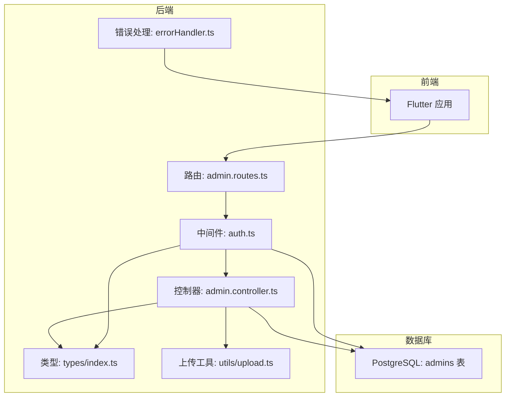
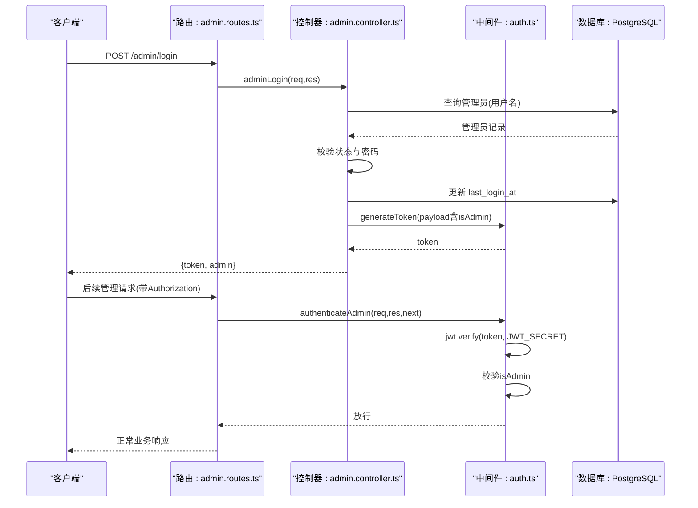
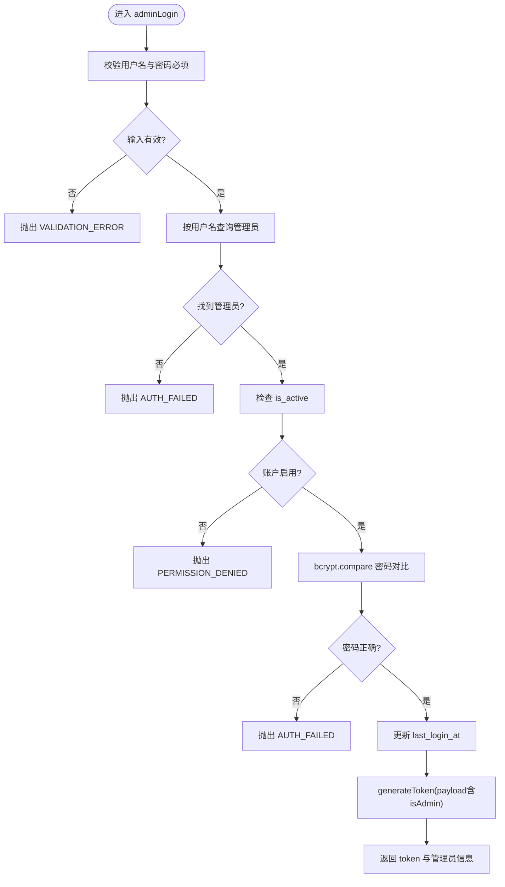
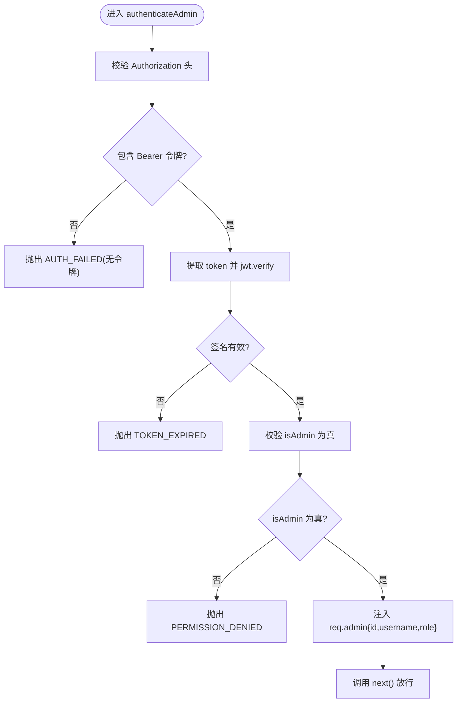
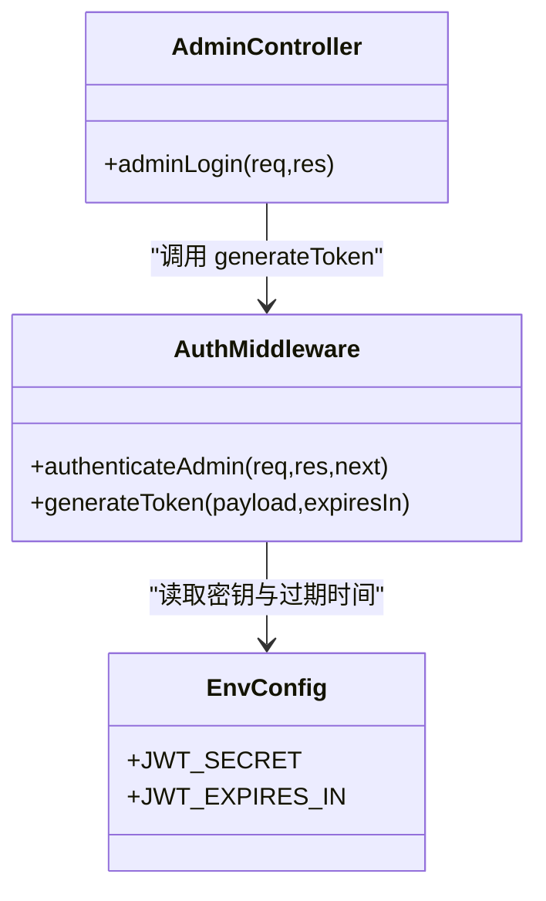
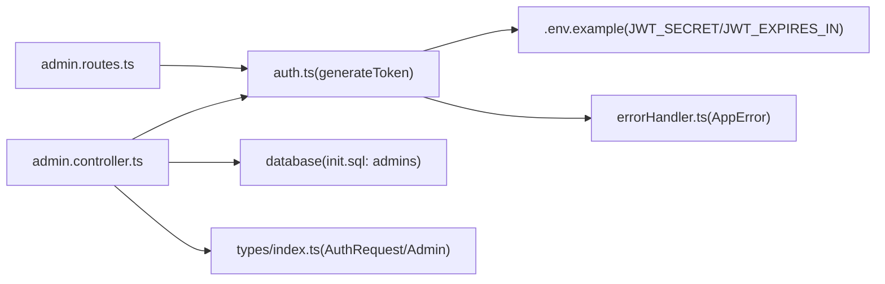

# 管理员认证逻辑

<cite>
**本文引用的文件**
- [backend/src/controllers/admin.controller.ts](file://backend/src/controllers/admin.controller.ts)
- [backend/src/middleware/auth.ts](file://backend/src/middleware/auth.ts)
- [backend/src/routes/admin.routes.ts](file://backend/src/routes/admin.routes.ts)
- [backend/src/middleware/errorHandler.ts](file://backend/src/middleware/errorHandler.ts)
- [backend/src/times/index.ts](file://backend/src/types/index.ts)
- [backend/src/utils/upload.ts](file://backend/src/utils/upload.ts)
- [.env.example](file://.env.example)
- [database/init.sql](file://database/init.sql)
</cite>

## 目录
1. [简介](#简介)
2. [项目结构](#项目结构)
3. [核心组件](#核心组件)
4. [架构总览](#架构总览)
5. [详细组件分析](#详细组件分析)
6. [依赖关系分析](#依赖关系分析)
7. [性能考量](#性能考量)
8. [故障排查指南](#故障排查指南)
9. [结论](#结论)

## 简介
本文件深入解析管理员认证机制的实现，重点围绕 adminLogin 控制器与 authenticateAdmin 中间件的协同工作流程展开。文档将详细说明：
- JWT 令牌的生成、签名与验证过程，包括 payload 结构设计（id、username、role、isAdmin 字段）与密钥管理策略
- 密码哈希处理（bcrypt）的安全实践，包括盐值生成与比较机制
- 管理员会话状态管理，特别是 last_login_at 字段的更新时机与安全意义
- 结合 auth.middleware.ts 的权限校验逻辑，说明如何通过 isAdmin 标志位实现管理后台的访问控制
- 提供错误处理示例（无效凭据、账户禁用、令牌过期等场景）

## 项目结构
后端采用分层架构，认证相关的关键文件分布如下：
- 控制器层：adminLogin 登录控制器位于 admin.controller.ts
- 中间件层：JWT 生成与验证、用户/管理员认证中间件位于 auth.ts
- 路由层：admin 路由在 admin.routes.ts 中定义，并挂载 authenticateAdmin 进行统一鉴权
- 类型定义：AuthRequest、Admin、AdminWithPassword 等类型在 types/index.ts 中定义
- 错误处理：统一的 AppError 异常类与全局错误处理器在 errorHandler.ts 中定义
- 环境变量：JWT_SECRET、JWT_EXPIRES_IN 等配置在 .env.example 中给出
- 数据库模式：admins 表结构与字段定义在 database/init.sql 中

图表来源
- [backend/src/routes/admin.routes.ts](file://backend/src/routes/admin.routes.ts#L1-L68)
- [backend/src/controllers/admin.controller.ts](file://backend/src/controllers/admin.controller.ts#L1-L66)
- [backend/src/middleware/auth.ts](file://backend/src/middleware/auth.ts#L1-L86)
- [backend/src/types/index.ts](file://backend/src/types/index.ts#L65-L91)
- [backend/src/middleware/errorHandler.ts](file://backend/src/middleware/errorHandler.ts#L1-L97)
- [backend/src/utils/upload.ts](file://backend/src/utils/upload.ts#L1-L128)
- [database/init.sql](file://database/init.sql#L94-L109)

章节来源
- [backend/src/routes/admin.routes.ts](file://backend/src/routes/admin.routes.ts#L1-L68)
- [backend/src/controllers/admin.controller.ts](file://backend/src/controllers/admin.controller.ts#L1-L66)
- [backend/src/middleware/auth.ts](file://backend/src/middleware/auth.ts#L1-L86)
- [backend/src/types/index.ts](file://backend/src/types/index.ts#L65-L91)
- [backend/src/middleware/errorHandler.ts](file://backend/src/middleware/errorHandler.ts#L1-L97)
- [backend/src/utils/upload.ts](file://backend/src/utils/upload.ts#L1-L128)
- [database/init.sql](file://database/init.sql#L94-L109)

## 核心组件
- 管理员登录控制器（adminLogin）
  - 输入校验：用户名与密码必填
  - 数据库查询：按用户名查找管理员
  - 账户状态检查：is_active 为真才允许登录
  - 密码验证：bcrypt.compare 对比密码哈希
  - 会话状态更新：last_login_at 更新为当前时间
  - 令牌生成：generateToken 生成包含 id、username、role、isAdmin 的 payload
  - 成功响应：返回 token 与管理员基本信息

- 管理员认证中间件（authenticateAdmin）
  - 请求头校验：Authorization 必须以 Bearer 开头
  - 令牌解码：jwt.verify 使用 JWT_SECRET 验证签名
  - 权限校验：要求 payload 中 isAdmin 为真
  - 上下文注入：将 id、username、role 注入 req.admin
  - 错误处理：未提供令牌、令牌无效或过期、非管理员访问均抛出 AppError

- JWT 生成工具（generateToken）
  - 使用 JWT_SECRET 签名
  - 支持自定义过期时间，默认从环境变量读取

- 错误处理（AppError 与 errorHandler）
  - 统一异常类，携带状态码、错误码与消息
  - 全局中间件捕获并返回标准化错误响应

章节来源
- [backend/src/controllers/admin.controller.ts](file://backend/src/controllers/admin.controller.ts#L1-L66)
- [backend/src/middleware/auth.ts](file://backend/src/middleware/auth.ts#L35-L86)
- [backend/src/middleware/errorHandler.ts](file://backend/src/middleware/errorHandler.ts#L1-L97)

## 架构总览
管理员认证的整体流程如下：
- 客户端向 /admin/login 发起登录请求
- 控制器执行输入校验、数据库查询、状态检查、密码验证与 last_login_at 更新
- 控制器调用 generateToken 生成 JWT，返回 token 与管理员信息
- 管理后台后续请求需携带 Authorization: Bearer <token>
- authenticateAdmin 中间件验证令牌有效性与 isAdmin 权限，成功则放行，失败则返回标准化错误

图表来源
- [backend/src/routes/admin.routes.ts](file://backend/src/routes/admin.routes.ts#L1-L35)
- [backend/src/controllers/admin.controller.ts](file://backend/src/controllers/admin.controller.ts#L1-L66)
- [backend/src/middleware/auth.ts](file://backend/src/middleware/auth.ts#L35-L86)

## 详细组件分析

### 管理员登录控制器（adminLogin）
- 输入参数校验：用户名与密码必填，否则抛出 VALIDATION_ERROR
- 数据库查询：按 username 查找管理员，不存在则抛出 AUTH_FAILED
- 账户状态检查：is_active 为假时抛出 PERMISSION_DENIED
- 密码验证：使用 bcrypt.compare 对比明文密码与数据库存储的 password_hash
- 会话状态更新：登录成功后更新 last_login_at 为当前时间
- 令牌生成：generateToken 传入 { id, username, role, isAdmin: true }
- 成功响应：返回 success、message、token 与 admin 基本信息

图表来源
- [backend/src/controllers/admin.controller.ts](file://backend/src/controllers/admin.controller.ts#L1-L66)

章节来源
- [backend/src/controllers/admin.controller.ts](file://backend/src/controllers/admin.controller.ts#L1-L66)

### 管理员认证中间件（authenticateAdmin）
- 请求头解析：Authorization 必须以 Bearer 开头，否则抛出 AUTH_FAILED
- 令牌验证：jwt.verify 使用 JWT_SECRET 验证签名，失败抛出 TOKEN_EXPIRED
- 权限校验：payload 中 isAdmin 必须为真，否则抛出 PERMISSION_DENIED
- 上下文注入：将 id、username、role 注入 req.admin，供后续控制器使用
- 错误处理：若非 AppError，则统一转换为 TOKEN_EXPIRED

图表来源
- [backend/src/middleware/auth.ts](file://backend/src/middleware/auth.ts#L35-L77)

章节来源
- [backend/src/middleware/auth.ts](file://backend/src/middleware/auth.ts#L35-L77)

### JWT 令牌生成与验证
- 生成：generateToken 使用 JWT_SECRET 与可选过期时间（默认从环境变量读取），返回签名后的 token
- 验证：authenticateAdmin 在每次受保护请求中调用 jwt.verify，确保签名与过期时间有效
- 密钥管理：JWT_SECRET 优先从环境变量读取；.env.example 中给出了建议长度与默认值
- payload 设计：包含 id、username、role、isAdmin 四个关键字段，用于权限判定与上下文传递

图表来源
- [backend/src/middleware/auth.ts](file://backend/src/middleware/auth.ts#L35-L86)
- [.env.example](file://.env.example#L1-L61)

章节来源
- [backend/src/middleware/auth.ts](file://backend/src/middleware/auth.ts#L35-L86)
- [.env.example](file://.env.example#L1-L61)

### 密码哈希处理（bcrypt）
- 存储：管理员密码以 password_hash 形式存储于 admins 表
- 生成：登录前对明文密码进行哈希（盐值由 bcrypt 自动生成）
- 验证：登录时使用 bcrypt.compare 将明文与存储的 hash 对比
- 安全性：bcrypt 自动处理盐值生成与迭代次数，降低彩虹表与暴力破解风险

章节来源
- [database/init.sql](file://database/init.sql#L94-L109)
- [backend/src/controllers/admin.controller.ts](file://backend/src/controllers/admin.controller.ts#L1-L66)

### 管理员会话状态管理（last_login_at）
- 更新时机：adminLogin 在密码验证通过后立即更新 last_login_at
- 安全意义：记录最近一次登录时间，可用于审计、异常检测与会话追踪
- 数据库字段：admins 表包含 last_login_at 字段

章节来源
- [backend/src/controllers/admin.controller.ts](file://backend/src/controllers/admin.controller.ts#L1-L66)
- [database/init.sql](file://database/init.sql#L94-L109)

### 权限校验与访问控制（isAdmin）
- 标志位：payload 中 isAdmin 为 true 时，authenticateAdmin 才放行
- 路由挂载：admin.routes.ts 中对 /admin 下的所有路由统一挂载 authenticateAdmin
- 作用范围：确保只有具备管理员身份的用户才能访问管理后台接口

章节来源
- [backend/src/middleware/auth.ts](file://backend/src/middleware/auth.ts#L35-L77)
- [backend/src/routes/admin.routes.ts](file://backend/src/routes/admin.routes.ts#L1-L35)

### 错误处理示例
- 无效凭据：用户名或密码为空、用户名不存在、密码错误、账户禁用
- 令牌问题：未提供令牌、令牌无效或过期
- 权限不足：非管理员访问管理接口
- 统一响应：AppError 包含 statusCode、code、message，全局 errorHandler 输出标准化错误

章节来源
- [backend/src/controllers/admin.controller.ts](file://backend/src/controllers/admin.controller.ts#L1-L66)
- [backend/src/middleware/auth.ts](file://backend/src/middleware/auth.ts#L35-L77)
- [backend/src/middleware/errorHandler.ts](file://backend/src/middleware/errorHandler.ts#L1-L97)

## 依赖关系分析
- 控制器依赖中间件：adminLogin 调用 generateToken 生成 token
- 中间件依赖环境变量：JWT_SECRET、JWT_EXPIRES_IN
- 路由依赖中间件：admin.routes.ts 挂载 authenticateAdmin
- 类型定义：AuthRequest、Admin、AdminWithPassword 为上下文与数据库模型提供类型约束
- 错误处理：全局 errorHandler 捕获 AppError 并输出标准响应

图表来源
- [backend/src/controllers/admin.controller.ts](file://backend/src/controllers/admin.controller.ts#L1-L66)
- [backend/src/middleware/auth.ts](file://backend/src/middleware/auth.ts#L35-L86)
- [backend/src/routes/admin.routes.ts](file://backend/src/routes/admin.routes.ts#L1-L35)
- [backend/src/types/index.ts](file://backend/src/types/index.ts#L65-L91)
- [backend/src/middleware/errorHandler.ts](file://backend/src/middleware/errorHandler.ts#L1-L97)
- [.env.example](file://.env.example#L1-L61)
- [database/init.sql](file://database/init.sql#L94-L109)

章节来源
- [backend/src/controllers/admin.controller.ts](file://backend/src/controllers/admin.controller.ts#L1-L66)
- [backend/src/middleware/auth.ts](file://backend/src/middleware/auth.ts#L35-L86)
- [backend/src/routes/admin.routes.ts](file://backend/src/routes/admin.routes.ts#L1-L35)
- [backend/src/types/index.ts](file://backend/src/types/index.ts#L65-L91)
- [backend/src/middleware/errorHandler.ts](file://backend/src/middleware/errorHandler.ts#L1-L97)
- [.env.example](file://.env.example#L1-L61)
- [database/init.sql](file://database/init.sql#L94-L109)

## 性能考量
- bcrypt 成本因子：当前实现使用默认成本因子，建议根据服务器性能调整以平衡安全性与性能
- 令牌过期策略：JWT_EXPIRES_IN 可按需缩短，减少长期有效令牌带来的风险
- 数据库索引：admins 表对 username、email 建有索引，有助于登录查询性能
- 中间件开销：jwt.verify 为轻量级操作，整体对请求延迟影响较小

## 故障排查指南
- 登录失败（无效凭据）
  - 现象：返回 AUTH_FAILED
  - 排查：确认用户名是否存在、密码是否正确、账户是否启用
  - 参考路径：[backend/src/controllers/admin.controller.ts](file://backend/src/controllers/admin.controller.ts#L1-L66)

- 令牌缺失或格式错误
  - 现象：返回 AUTH_FAILED（无令牌）、TOKEN_EXPIRED（无效或过期）
  - 排查：确认 Authorization 头格式为 Bearer <token>，检查 JWT_SECRET 是否正确
  - 参考路径：[backend/src/middleware/auth.ts](file://backend/src/middleware/auth.ts#L35-L77)

- 非管理员访问管理接口
  - 现象：返回 PERMISSION_DENIED
  - 排查：确认 payload 中 isAdmin 为 true，检查生成 token 的 payload
  - 参考路径：[backend/src/middleware/auth.ts](file://backend/src/middleware/auth.ts#L35-L77)

- 服务器内部错误
  - 现象：返回 SERVER_ERROR
  - 排查：查看全局错误处理器输出的日志与堆栈
  - 参考路径：[backend/src/middleware/errorHandler.ts](file://backend/src/middleware/errorHandler.ts#L1-L97)

- 环境变量配置
  - 确认 JWT_SECRET 至少 32 字符，JWT_EXPIRES_IN 设置合理
  - 参考路径：[.env.example](file://.env.example#L1-L61)

章节来源
- [backend/src/controllers/admin.controller.ts](file://backend/src/controllers/admin.controller.ts#L1-L66)
- [backend/src/middleware/auth.ts](file://backend/src/middleware/auth.ts#L35-L77)
- [backend/src/middleware/errorHandler.ts](file://backend/src/middleware/errorHandler.ts#L1-L97)
- [.env.example](file://.env.example#L1-L61)

## 结论
本认证体系通过 adminLogin 控制器与 authenticateAdmin 中间件的紧密协作，实现了安全、可控的管理员认证与授权：
- 使用 bcrypt 对密码进行安全存储与验证
- 通过 JWT 令牌承载必要上下文并进行签名验证
- 以 isAdmin 标志位为核心实现管理后台访问控制
- 通过标准化错误处理与环境变量配置提升可维护性与安全性