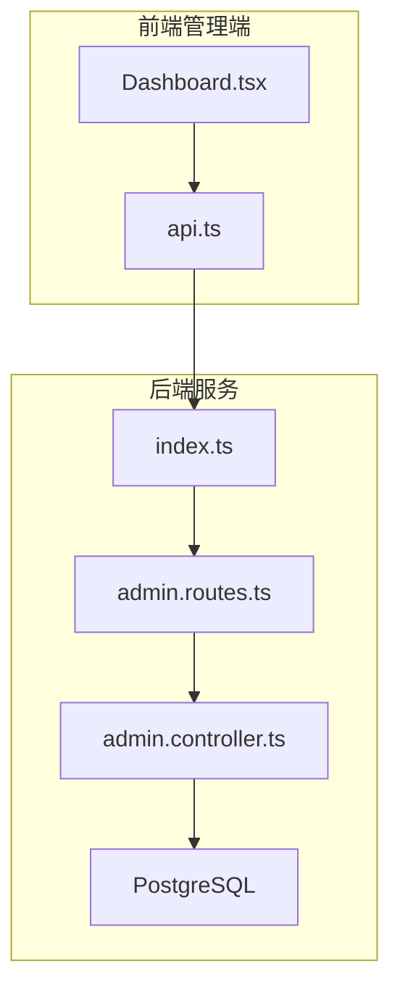
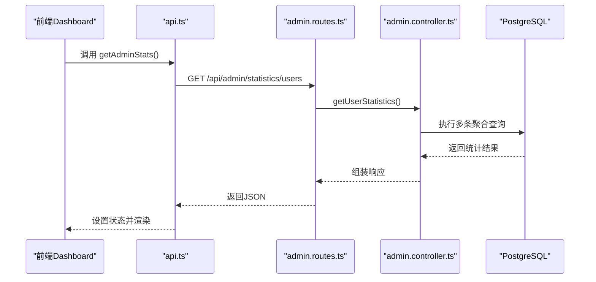
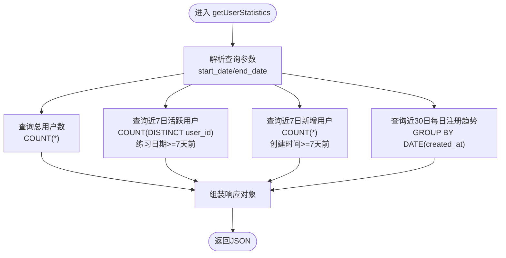
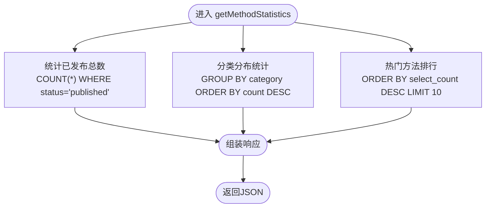
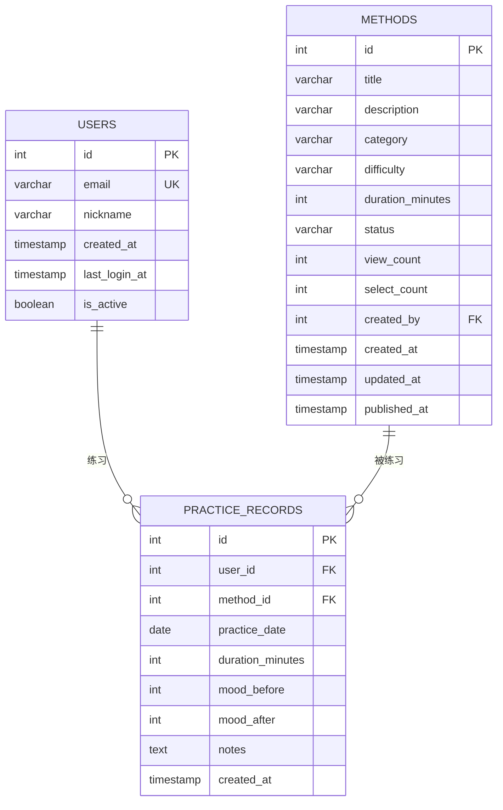
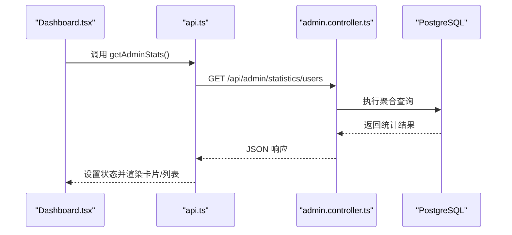
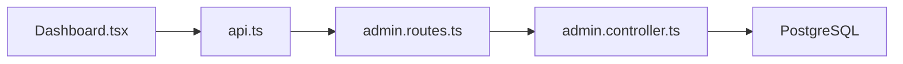

# 统计分析逻辑

<cite>
**本文引用的文件**
- [backend/src/controllers/admin.controller.ts](file://backend/src/controllers/admin.controller.ts)
- [backend/src/routes/admin.routes.ts](file://backend/src/routes/admin.routes.ts)
- [backend/src/index.ts](file://backend/src/index.ts)
- [database/init.sql](file://database/init.sql)
- [home/user/nian/admin-web/src/pages/Dashboard.tsx](file://home/user/nian/admin-web/src/pages/Dashboard.tsx)
- [home/user/nian/admin-web/src/services/api.ts](file://home/user/nian/admin-web/src/services/api.ts)
- [docs/QUALITY_REPORT.md](file://docs/QUALITY_REPORT.md)
</cite>

## 目录
1. [简介](#简介)
2. [项目结构](#项目结构)
3. [核心组件](#核心组件)
4. [架构总览](#架构总览)
5. [详细组件分析](#详细组件分析)
6. [依赖关系分析](#依赖关系分析)
7. [性能考量](#性能考量)
8. [故障排查指南](#故障排查指南)
9. [结论](#结论)
10. [附录](#附录)

## 简介
本文件系统化阐述管理后台的统计分析功能，聚焦用户增长与内容使用两大维度。重点解析以下能力：
- 用户统计：总用户数、近7日活跃用户、近7日新增用户、近30日每日注册趋势
- 方法统计：已发布方法总数、分类分布、热门方法排行（基于 select_count）

同时，结合数据库索引与视图设计，给出避免N+1查询、合理使用聚合函数（COUNT、GROUP BY）与缓存策略的优化建议，并提供Dashboard页面的可视化应用示例。

## 项目结构
后端采用Express + PostgreSQL，统计接口位于管理控制器中；前端通过API服务调用后端统计接口并在Dashboard页面展示。

图表来源
- [backend/src/index.ts](file://backend/src/index.ts#L33-L48)
- [backend/src/routes/admin.routes.ts](file://backend/src/routes/admin.routes.ts#L28-L54)
- [backend/src/controllers/admin.controller.ts](file://backend/src/controllers/admin.controller.ts#L389-L467)
- [database/init.sql](file://database/init.sql#L1-L124)

章节来源
- [backend/src/index.ts](file://backend/src/index.ts#L33-L48)
- [backend/src/routes/admin.routes.ts](file://backend/src/routes/admin.routes.ts#L28-L54)
- [backend/src/controllers/admin.controller.ts](file://backend/src/controllers/admin.controller.ts#L389-L467)
- [database/init.sql](file://database/init.sql#L1-L124)

## 核心组件
- 用户统计接口：计算总用户、近7日活跃用户、近7日新增用户、近30日每日注册趋势
- 方法统计接口：统计已发布方法总数、按分类分布、热门方法排行（select_count降序）
- 数据库索引与视图：为统计查询提供高效支撑
- 前端Dashboard：拉取统计并以卡片与列表形式展示

章节来源
- [backend/src/controllers/admin.controller.ts](file://backend/src/controllers/admin.controller.ts#L389-L467)
- [database/init.sql](file://database/init.sql#L1-L124)
- [database/init.sql](file://database/init.sql#L316-L348)
- [home/user/nian/admin-web/src/pages/Dashboard.tsx](file://home/user/nian/admin-web/src/pages/Dashboard.tsx#L1-L107)

## 架构总览
统计分析的端到端流程如下：

图表来源
- [home/user/nian/admin-web/src/services/api.ts](file://home/user/nian/admin-web/src/services/api.ts#L23-L26)
- [backend/src/routes/admin.routes.ts](file://backend/src/routes/admin.routes.ts#L47-L50)
- [backend/src/controllers/admin.controller.ts](file://backend/src/controllers/admin.controller.ts#L389-L467)

## 详细组件分析

### 用户统计 getUserStatistics
该接口负责计算用户增长关键指标，并返回近30日每日注册趋势。

- 总用户数
  - 条件：可选起止日期过滤
  - 查询：COUNT(*) 聚合
- 近7日活跃用户
  - 条件：练习记录表中，练习日期在最近7天内
  - 查询：COUNT(DISTINCT user_id) 去重计数
- 近7日新增用户
  - 条件：用户创建时间在最近7天内
  - 查询：COUNT(*) 计数
- 近30日每日注册趋势
  - 条件：用户创建时间在最近30天内
  - 查询：按日期分组（DATE(created_at)），统计每日数量并排序

图表来源
- [backend/src/controllers/admin.controller.ts](file://backend/src/controllers/admin.controller.ts#L389-L435)

章节来源
- [backend/src/controllers/admin.controller.ts](file://backend/src/controllers/admin.controller.ts#L389-L435)

### 方法统计 getMethodStatistics
该接口构建内容使用维度的关键指标。

- 已发布方法总数
  - 条件：status='published'
  - 查询：COUNT(*) 聚合
- 分类分布统计
  - 条件：status='published'
  - 查询：按 category 分组，COUNT(*) 排序
- 热门方法排行（select_count）
  - 条件：status='published'
  - 查询：按 select_count 降序，LIMIT 10

图表来源
- [backend/src/controllers/admin.controller.ts](file://backend/src/controllers/admin.controller.ts#L437-L467)

章节来源
- [backend/src/controllers/admin.controller.ts](file://backend/src/controllers/admin.controller.ts#L437-L467)

### 数据模型与索引支撑
- 用户表 users：包含邮箱、昵称、创建时间等字段，并建立邮箱与创建时间索引
- 方法表 methods：包含分类、难度、状态、浏览/选择计数等字段，并建立状态、分类、难度、创建时间索引
- 练习记录表 practice_records：包含用户、方法、练习日期、时长、情绪等字段，并建立复合索引支持按用户+日期、用户+方法、创建时间查询
- 视图 user_practice_stats 与 method_popularity：预聚合常用统计，降低查询复杂度

图表来源
- [database/init.sql](file://database/init.sql#L1-L124)
- [database/init.sql](file://database/init.sql#L316-L348)

章节来源
- [database/init.sql](file://database/init.sql#L1-L124)
- [database/init.sql](file://database/init.sql#L316-L348)

### 前端可视化应用示例
- Dashboard 页面通过 api.ts 的 getAdminStats 发起请求，获取后端统计结果
- 使用 Ant Design 的 Statistic/Card 组件展示关键指标
- 方法分类与难度统计以列表形式展示

图表来源
- [home/user/nian/admin-web/src/pages/Dashboard.tsx](file://home/user/nian/admin-web/src/pages/Dashboard.tsx#L1-L107)
- [home/user/nian/admin-web/src/services/api.ts](file://home/user/nian/admin-web/src/services/api.ts#L23-L26)
- [backend/src/controllers/admin.controller.ts](file://backend/src/controllers/admin.controller.ts#L389-L467)

章节来源
- [home/user/nian/admin-web/src/pages/Dashboard.tsx](file://home/user/nian/admin-web/src/pages/Dashboard.tsx#L1-L107)
- [home/user/nian/admin-web/src/services/api.ts](file://home/user/nian/admin-web/src/services/api.ts#L23-L26)

## 依赖关系分析
- 路由层 admin.routes.ts 将 /api/admin/statistics/users 与 /api/admin/statistics/methods 映射到控制器方法
- 控制器 admin.controller.ts 通过数据库连接池执行聚合查询
- 前端通过 api.ts 统一发起请求，Dashboard.tsx 渲染数据

图表来源
- [backend/src/routes/admin.routes.ts](file://backend/src/routes/admin.routes.ts#L28-L54)
- [backend/src/controllers/admin.controller.ts](file://backend/src/controllers/admin.controller.ts#L389-L467)
- [home/user/nian/admin-web/src/services/api.ts](file://home/user/nian/admin-web/src/services/api.ts#L23-L26)

章节来源
- [backend/src/routes/admin.routes.ts](file://backend/src/routes/admin.routes.ts#L28-L54)
- [backend/src/controllers/admin.controller.ts](file://backend/src/controllers/admin.controller.ts#L389-L467)
- [home/user/nian/admin-web/src/services/api.ts](file://home/user/nian/admin-web/src/services/api.ts#L23-L26)

## 性能考量
- 避免N+1查询
  - 用户统计与方法统计均通过单次聚合查询完成，无需二次遍历
  - 若后续扩展为“带分页/排序”的复杂列表，请确保一次性聚合，避免逐条查询
- 合理使用聚合函数与索引
  - users 表：对 created_at 建立索引，支持按日期范围过滤与趋势聚合
  - methods 表：对 status、category、difficulty、created_at 建立索引，支持快速筛选与排序
  - practice_records 表：对 user_id+practice_date、user_id+method_id、created_at 建立索引，支持活跃用户与趋势统计
- 缓存策略
  - 对高频访问但不频繁变动的统计结果（如总用户、已发布方法总数、分类分布）实施短期缓存
  - 结合缓存失效策略，保证数据新鲜度
- 其他优化建议
  - 在高并发场景考虑数据库读写分离
  - 对响应进行压缩（gzip）
  - 前端分页与懒加载，避免一次性传输大量趋势数据

章节来源
- [database/init.sql](file://database/init.sql#L1-L124)
- [docs/QUALITY_REPORT.md](file://docs/QUALITY_REPORT.md#L205-L234)

## 故障排查指南
- 接口返回异常
  - 检查路由是否正确映射至控制器方法
  - 核对请求路径与参数（如日期范围）
- 统计结果异常
  - 确认数据库索引是否存在且生效
  - 检查聚合查询条件（如日期边界、状态过滤）
- 前端无数据显示
  - 确认 api.ts 的请求地址与后端路由一致
  - 检查 Dashboard.tsx 是否正确接收并设置响应数据

章节来源
- [backend/src/routes/admin.routes.ts](file://backend/src/routes/admin.routes.ts#L28-L54)
- [backend/src/controllers/admin.controller.ts](file://backend/src/controllers/admin.controller.ts#L389-L467)
- [home/user/nian/admin-web/src/services/api.ts](file://home/user/nian/admin-web/src/services/api.ts#L23-L26)
- [home/user/nian/admin-web/src/pages/Dashboard.tsx](file://home/user/nian/admin-web/src/pages/Dashboard.tsx#L1-L107)

## 结论
本系统通过明确的统计接口与完善的数据库索引/视图设计，实现了用户增长与内容使用的高效统计。配合前端Dashboard的直观展示与可选的缓存策略，能够满足日常运营监控与决策支持需求。建议在业务增长期持续评估查询性能，适时引入缓存与读写分离，保障高并发下的稳定性与响应速度。

## 附录
- 接口定义（后端路由）
  - GET /api/admin/statistics/users -> getUserStatistics
  - GET /api/admin/statistics/methods -> getMethodStatistics
- 前端调用
  - getAdminStats -> /api/admin/statistics/users
- 数据库索引
  - users: created_at
  - methods: status, category, difficulty, created_at
  - practice_records: user_id+practice_date, user_id+method_id, created_at

章节来源
- [backend/src/routes/admin.routes.ts](file://backend/src/routes/admin.routes.ts#L28-L54)
- [home/user/nian/admin-web/src/services/api.ts](file://home/user/nian/admin-web/src/services/api.ts#L23-L26)
- [database/init.sql](file://database/init.sql#L1-L124)