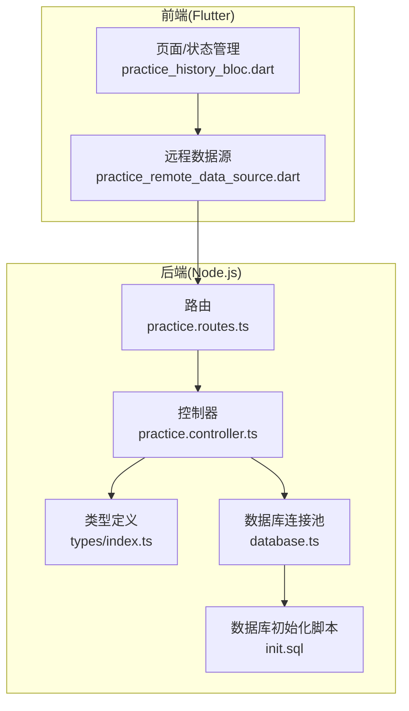
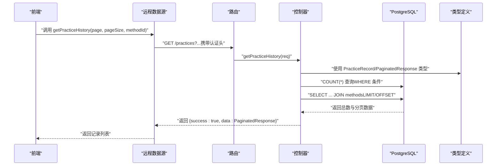
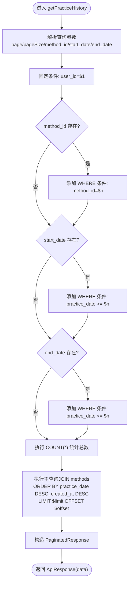
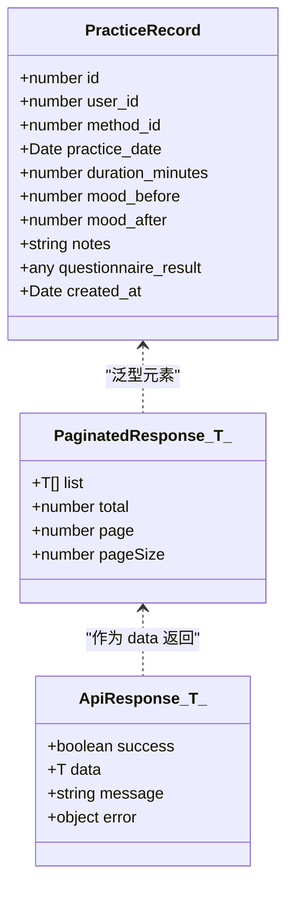
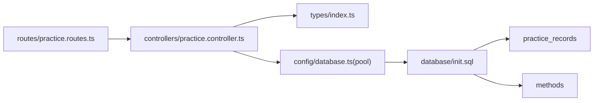

# 练习历史查询管理

<cite>
**本文引用的文件**
- [backend/src/controllers/practice.controller.ts](file://backend/src/controllers/practice.controller.ts)
- [backend/src/types/index.ts](file://backend/src/types/index.ts)
- [backend/src/routes/practice.routes.ts](file://backend/src/routes/practice.routes.ts)
- [backend/src/config/database.ts](file://backend/src/config/database.ts)
- [database/init.sql](file://database/init.sql)
- [flutter_app/lib/data/datasources/remote/practice_remote_data_source.dart](file://flutter_app/lib/data/datasources/remote/practice_remote_data_source.dart)
- [flutter_app/lib/presentation/practice/bloc/practice_history_bloc.dart](file://flutter_app/lib/presentation/practice/bloc/practice_history_bloc.dart)
</cite>

## 目录
1. [简介](#简介)
2. [项目结构](#项目结构)
3. [核心组件](#核心组件)
4. [架构总览](#架构总览)
5. [详细组件分析](#详细组件分析)
6. [依赖关系分析](#依赖关系分析)
7. [性能考量](#性能考量)
8. [故障排查指南](#故障排查指南)
9. [结论](#结论)
10. [附录](#附录)

## 简介
本文件围绕“练习历史查询”功能展开，重点解析后端控制器中 getPracticeHistory 的实现细节，包括：
- 分页查询机制（page/pageSize 参数处理）
- 多条件过滤逻辑（method_id、start_date、end_date 的动态 SQL 拼接）
- PaginatedResponse 类型定义在 types/index.ts 中的结构设计及其在接口响应中的应用
- 查询性能优化策略（WHERE 条件索引匹配、COUNT(*) 与分页数据分离查询、JOIN 关联 methods 表获取方法标题）
- 查询流程的数据流图
- 大数据量下的分页性能调优方案

## 项目结构
后端采用 Express + PostgreSQL 架构，练习历史查询涉及以下关键文件：
- 路由层：定义 /practices 的 GET 接口
- 控制器层：实现 getPracticeHistory 的业务逻辑
- 类型定义：PaginatedResponse、PracticeRecord 等
- 数据库：PostgreSQL 表结构与索引
- 前端：Flutter 应用通过远程数据源调用后端接口

图表来源
- [backend/src/routes/practice.routes.ts](file://backend/src/routes/practice.routes.ts#L1-L20)
- [backend/src/controllers/practice.controller.ts](file://backend/src/controllers/practice.controller.ts#L101-L172)
- [backend/src/types/index.ts](file://backend/src/types/index.ts#L52-L110)
- [backend/src/config/database.ts](file://backend/src/config/database.ts#L1-L47)
- [database/init.sql](file://database/init.sql#L63-L79)

章节来源
- [backend/src/routes/practice.routes.ts](file://backend/src/routes/practice.routes.ts#L1-L20)
- [backend/src/controllers/practice.controller.ts](file://backend/src/controllers/practice.controller.ts#L101-L172)
- [backend/src/types/index.ts](file://backend/src/types/index.ts#L52-L110)
- [backend/src/config/database.ts](file://backend/src/config/database.ts#L1-L47)
- [database/init.sql](file://database/init.sql#L63-L79)

## 核心组件
- 练习历史控制器函数：负责接收查询参数、构建动态 WHERE 条件、执行 COUNT 与分页查询、JOIN methods 表获取方法标题、封装 PaginatedResponse 并返回
- 路由：对 /practices 的 GET 请求进行认证拦截并转发至控制器
- 类型定义：PracticeRecord、PaginatedResponse、AuthRequest 等
- 数据库：practice_records、methods、user_methods 等表及索引

章节来源
- [backend/src/controllers/practice.controller.ts](file://backend/src/controllers/practice.controller.ts#L101-L172)
- [backend/src/routes/practice.routes.ts](file://backend/src/routes/practice.routes.ts#L1-L20)
- [backend/src/types/index.ts](file://backend/src/types/index.ts#L52-L110)
- [database/init.sql](file://database/init.sql#L63-L79)

## 架构总览
练习历史查询的端到端流程如下：

图表来源
- [flutter_app/lib/data/datasources/remote/practice_remote_data_source.dart](file://flutter_app/lib/data/datasources/remote/practice_remote_data_source.dart#L38-L58)
- [backend/src/routes/practice.routes.ts](file://backend/src/routes/practice.routes.ts#L1-L20)
- [backend/src/controllers/practice.controller.ts](file://backend/src/controllers/practice.controller.ts#L101-L172)
- [backend/src/types/index.ts](file://backend/src/types/index.ts#L52-L110)

## 详细组件分析

### getPracticeHistory 函数实现要点
- 参数解析与校验
  - 从请求查询参数中读取 method_id、start_date、end_date、page、pageSize
  - 默认 page=1、pageSize=20；计算 offset=(page-1)*pageSize、limit=pageSize
  - 使用数组 conditions 和 params 动态构建 WHERE 条件，避免 SQL 注入
- 动态 WHERE 条件拼接
  - 固定条件：user_id = $1
  - 可选条件：method_id、start_date、end_date，按需追加
  - 将 conditions 以 AND 连接生成 whereClause
- 分页与计数分离
  - 先执行 COUNT(*) 统计满足条件的总记录数
  - 再执行主查询，包含 JOIN methods 表获取方法标题
  - 主查询按 practice_date、created_at 降序排序
- 响应封装
  - 使用 PaginatedResponse<T> 结构返回 list、total、page、pageSize
  - 返回统一的 ApiResponse 包裹

图表来源
- [backend/src/controllers/practice.controller.ts](file://backend/src/controllers/practice.controller.ts#L101-L172)

章节来源
- [backend/src/controllers/practice.controller.ts](file://backend/src/controllers/practice.controller.ts#L101-L172)

### PaginatedResponse 类型定义与应用
- 类型定义
  - 泛型接口 PaginatedResponse<T>，包含 list、total、page、pageSize 字段
- 在接口响应中的应用
  - 控制器将查询结果与总数封装为 PaginatedResponse
  - 前端远程数据源解析 data 为列表并映射为实体模型

图表来源
- [backend/src/types/index.ts](file://backend/src/types/index.ts#L52-L110)

章节来源
- [backend/src/types/index.ts](file://backend/src/types/index.ts#L52-L110)

### 前端集成与调用链
- 远程数据源
  - 通过 DioClient 发起 GET /practices，支持 page、pageSize、methodId 查询参数
  - 解析响应 data 为列表并映射为实体模型
- 状态管理
  - BLoC 在加载历史时触发仓库调用，根据需要在本地进行时间范围筛选与统计

章节来源
- [flutter_app/lib/data/datasources/remote/practice_remote_data_source.dart](file://flutter_app/lib/data/datasources/remote/practice_remote_data_source.dart#L38-L58)
- [flutter_app/lib/presentation/practice/bloc/practice_history_bloc.dart](file://flutter_app/lib/presentation/practice/bloc/practice_history_bloc.dart#L18-L44)

## 依赖关系分析
- 控制器依赖
  - 数据库连接池：用于执行 COUNT 与主查询
  - 类型定义：使用 PracticeRecord、PaginatedResponse
- 路由依赖
  - 认证中间件：确保只有已认证用户可访问
- 数据库依赖
  - practice_records 表：存储练习记录
  - methods 表：存储方法信息（标题等）
  - user_methods 表：用户与方法关联统计（非本次查询直接使用）

图表来源
- [backend/src/routes/practice.routes.ts](file://backend/src/routes/practice.routes.ts#L1-L20)
- [backend/src/controllers/practice.controller.ts](file://backend/src/controllers/practice.controller.ts#L101-L172)
- [backend/src/types/index.ts](file://backend/src/types/index.ts#L52-L110)
- [backend/src/config/database.ts](file://backend/src/config/database.ts#L1-L47)
- [database/init.sql](file://database/init.sql#L63-L79)

章节来源
- [backend/src/routes/practice.routes.ts](file://backend/src/routes/practice.routes.ts#L1-L20)
- [backend/src/controllers/practice.controller.ts](file://backend/src/controllers/practice.controller.ts#L101-L172)
- [backend/src/types/index.ts](file://backend/src/types/index.ts#L52-L110)
- [backend/src/config/database.ts](file://backend/src/config/database.ts#L1-L47)
- [database/init.sql](file://database/init.sql#L63-L79)

## 性能考量
- WHERE 条件索引匹配
  - practice_records 已创建复合索引 idx_practice_records_user_id_date(user_id, practice_date)，有利于按用户与日期范围过滤
  - idx_practice_records_user_id_method_id(user_id, method_id)，有利于按用户与方法过滤
  - idx_practice_records_created_at(created_at)，有利于按创建时间排序
- COUNT(*) 与分页数据分离查询
  - 控制器先执行 COUNT(*) 再执行主查询，避免一次性扫描全表，降低延迟与资源消耗
- JOIN 关联 methods 表获取方法标题
  - 主查询包含 JOIN methods，按 method_id 关联，减少后续客户端二次查询
- 排序字段
  - 主查询按 practice_date DESC、created_at DESC 排序，利于展示最新记录
- 大数据量下的分页性能调优建议
  - 使用游标分页（cursor-based pagination）替代 OFFSET，避免深层偏移导致的性能问题
  - 对高频查询字段建立合适索引（如 user_id + practice_date + method_id）
  - 合理限制 pageSize 上限，防止单次请求过大
  - 使用缓存（如 Redis）缓存热门时间段的历史列表
  - 对 COUNT(*) 进行近似统计或定期物化视图，降低实时 COUNT 成本

章节来源
- [database/init.sql](file://database/init.sql#L63-L79)
- [backend/src/controllers/practice.controller.ts](file://backend/src/controllers/practice.controller.ts#L143-L160)

## 故障排查指南
- 认证失败
  - 若未携带有效认证头，控制器会抛出错误并返回 401
- 参数缺失或非法
  - method_id、start_date、end_date 为可选参数，但若传入需符合日期格式；控制器通过动态 WHERE 条件处理
- 数据库连接异常
  - 数据库连接池配置在 config/database.ts，检查主机、端口、凭据是否正确
- 查询结果为空
  - 确认 user_id 是否正确（由认证中间件注入），以及是否存在满足条件的记录
- 前端调用失败
  - 检查远程数据源的 URL、查询参数（page、pageSize、methodId）是否正确传递

章节来源
- [backend/src/controllers/practice.controller.ts](file://backend/src/controllers/practice.controller.ts#L101-L172)
- [backend/src/config/database.ts](file://backend/src/config/database.ts#L1-L47)
- [flutter_app/lib/data/datasources/remote/practice_remote_data_source.dart](file://flutter_app/lib/data/datasources/remote/practice_remote_data_source.dart#L38-L58)

## 结论
练习历史查询功能通过清晰的分页与动态过滤机制、合理的 COUNT 与数据分离查询、以及 JOIN methods 表获取标题，实现了高效稳定的查询体验。结合现有索引与类型定义，配合前端状态管理，能够满足日常使用场景。针对大数据量，建议引入游标分页、索引优化与缓存策略进一步提升性能。

## 附录
- 接口定义（语义说明）
  - 方法：GET
  - 路径：/practices
  - 查询参数：
    - page：页码，默认 1
    - pageSize：每页条数，默认 20
    - method_id：方法 ID（可选）
    - start_date：开始日期（可选）
    - end_date：结束日期（可选）
  - 响应：
    - success：布尔值
    - data：PaginatedResponse<PracticeRecord>
      - list：记录数组
      - total：满足条件的总记录数
      - page：当前页码
      - pageSize：每页条数

章节来源
- [backend/src/controllers/practice.controller.ts](file://backend/src/controllers/practice.controller.ts#L101-L172)
- [backend/src/types/index.ts](file://backend/src/types/index.ts#L52-L110)
- [flutter_app/lib/data/datasources/remote/practice_remote_data_source.dart](file://flutter_app/lib/data/datasources/remote/practice_remote_data_source.dart#L38-L58)