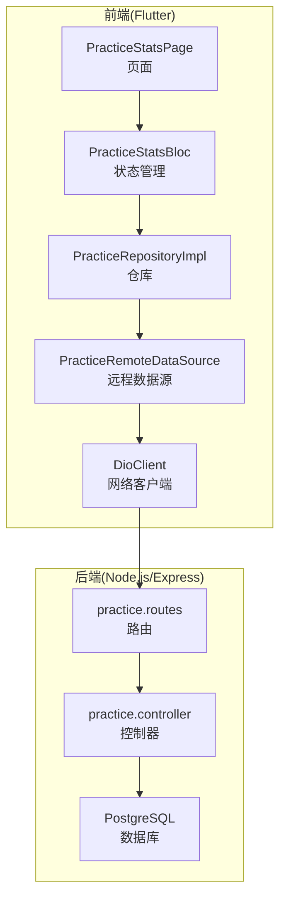
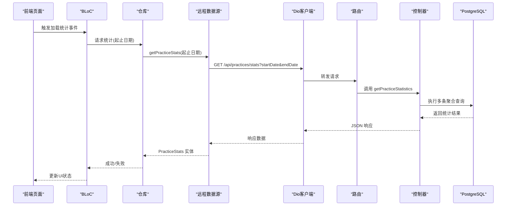
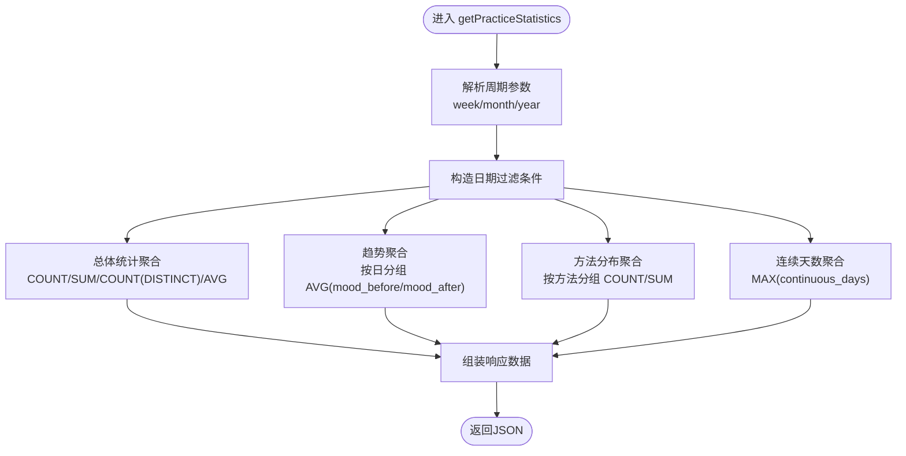
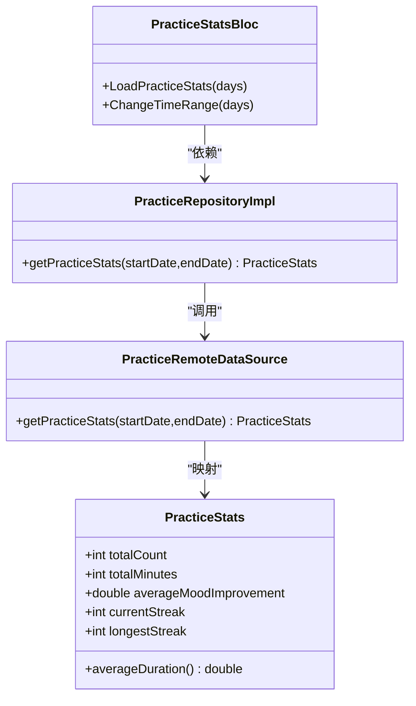
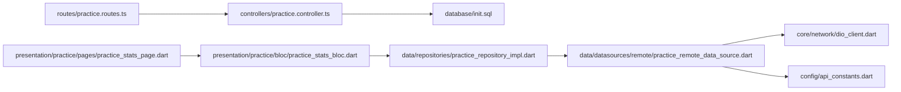

# 练习统计与数据分析

<cite>
**本文引用的文件**
- [backend/src/controllers/practice.controller.ts](file://backend/src/controllers/practice.controller.ts)
- [backend/src/routes/practice.routes.ts](file://backend/src/routes/practice.routes.ts)
- [backend/src/types/index.ts](file://backend/src/types/index.ts)
- [database/init.sql](file://database/init.sql)
- [flutter_app/lib/domain/entities/practice_stats.dart](file://flutter_app/lib/domain/entities/practice_stats.dart)
- [flutter_app/lib/data/datasources/remote/practice_remote_data_source.dart](file://flutter_app/lib/data/datasources/remote/practice_remote_data_source.dart)
- [flutter_app/lib/config/api_constants.dart](file://flutter_app/lib/config/api_constants.dart)
- [flutter_app/lib/core/network/dio_client.dart](file://flutter_app/lib/core/network/dio_client.dart)
- [flutter_app/lib/presentation/practice/pages/practice_stats_page.dart](file://flutter_app/lib/presentation/practice/pages/practice_stats_page.dart)
- [flutter_app/lib/presentation/practice/bloc/practice_stats_bloc.dart](file://flutter_app/lib/presentation/practice/bloc/practice_stats_bloc.dart)
- [flutter_app/lib/data/repositories/practice_repository_impl.dart](file://flutter_app/lib/data/repositories/practice_repository_impl.dart)
</cite>

## 目录
1. [简介](#简介)
2. [项目结构](#项目结构)
3. [核心组件](#核心组件)
4. [架构总览](#架构总览)
5. [详细组件分析](#详细组件分析)
6. [依赖分析](#依赖分析)
7. [性能考虑](#性能考虑)
8. [故障排查指南](#故障排查指南)
9. [结论](#结论)
10. [附录](#附录)

## 简介
本文件系统性阐述“练习统计”功能的数据聚合逻辑，重点解析后端 getPracticeStatistics 函数按周期（周/月/年）过滤的 SQL 实现，以及各项统计指标的计算方法：总练习次数、累计时长、练习天数、情绪改善均值；同时说明 mood_trend 趋势数据的按日分组查询、method_distribution 方法分布的 TOP 10 排序逻辑，以及连续打卡最大天数的独立查询机制。文档还结合移动端 PracticeStats 实体类，分析后端统计结果与前端数据模型的映射关系，并给出统计查询的执行计划优化建议与缓存策略，以提升高频访问性能。

## 项目结构
该功能横跨后端 Express 控制器与前端 Flutter 应用：
- 后端：控制器负责统计聚合与 SQL 查询，路由层进行鉴权与参数透传。
- 前端：通过远程数据源调用后端接口，将返回数据映射为 PracticeStats 实体，供 BLoC 和页面展示使用。
- 数据库：包含 practice_records 与 user_methods 两张核心表，分别承载练习记录与用户方法统计信息。

图表来源
- [backend/src/routes/practice.routes.ts](file://backend/src/routes/practice.routes.ts#L1-L20)
- [backend/src/controllers/practice.controller.ts](file://backend/src/controllers/practice.controller.ts#L174-L260)
- [flutter_app/lib/data/datasources/remote/practice_remote_data_source.dart](file://flutter_app/lib/data/datasources/remote/practice_remote_data_source.dart#L60-L84)
- [flutter_app/lib/core/network/dio_client.dart](file://flutter_app/lib/core/network/dio_client.dart#L1-L120)

章节来源
- [backend/src/routes/practice.routes.ts](file://backend/src/routes/practice.routes.ts#L1-L20)
- [backend/src/controllers/practice.controller.ts](file://backend/src/controllers/practice.controller.ts#L174-L260)
- [flutter_app/lib/data/datasources/remote/practice_remote_data_source.dart](file://flutter_app/lib/data/datasources/remote/practice_remote_data_source.dart#L60-L84)
- [flutter_app/lib/core/network/dio_client.dart](file://flutter_app/lib/core/network/dio_client.dart#L1-L120)

## 核心组件
- 后端统计控制器：提供 getPracticeStatistics 接口，按周期过滤、聚合统计、返回趋势与分布。
- 数据库表结构：practice_records 记录每日练习详情，user_methods 维护用户方法维度的统计与连续天数。
- 前端实体与映射：PracticeStats 实体承载后端返回的核心指标，前端通过远程数据源与仓库完成数据绑定。

章节来源
- [backend/src/controllers/practice.controller.ts](file://backend/src/controllers/practice.controller.ts#L174-L260)
- [database/init.sql](file://database/init.sql#L43-L75)
- [flutter_app/lib/domain/entities/practice_stats.dart](file://flutter_app/lib/domain/entities/practice_stats.dart#L1-L47)

## 架构总览
后端通过路由层鉴权后，进入控制器执行多条 SQL 聚合查询，分别产出总体统计、趋势、分布与连续天数；前端通过 API 常量与 Dio 客户端发起请求，远程数据源将响应映射为 PracticeStats 实体。

图表来源
- [flutter_app/lib/presentation/practice/pages/practice_stats_page.dart](file://flutter_app/lib/presentation/practice/pages/practice_stats_page.dart#L1-L73)
- [flutter_app/lib/presentation/practice/bloc/practice_stats_bloc.dart](file://flutter_app/lib/presentation/practice/bloc/practice_stats_bloc.dart#L1-L55)
- [flutter_app/lib/data/repositories/practice_repository_impl.dart](file://flutter_app/lib/data/repositories/practice_repository_impl.dart#L63-L82)
- [flutter_app/lib/data/datasources/remote/practice_remote_data_source.dart](file://flutter_app/lib/data/datasources/remote/practice_remote_data_source.dart#L60-L84)
- [flutter_app/lib/config/api_constants.dart](file://flutter_app/lib/config/api_constants.dart#L24-L31)
- [flutter_app/lib/core/network/dio_client.dart](file://flutter_app/lib/core/network/dio_client.dart#L1-L120)
- [backend/src/routes/practice.routes.ts](file://backend/src/routes/practice.routes.ts#L1-L20)
- [backend/src/controllers/practice.controller.ts](file://backend/src/controllers/practice.controller.ts#L174-L260)

## 详细组件分析

### 后端统计控制器：getPracticeStatistics
- 周期过滤
  - 支持 week/month/year 三种周期，通过 CURRENT_DATE 的区间差值生成 WHERE 条件，仅对 user_id 进行过滤。
- 总体统计
  - 使用 COUNT(*) 计算总练习次数，SUM(duration_minutes) 计算累计时长，COUNT(DISTINCT practice_date) 计算练习天数，AVG(mood_after - mood_before) 计算平均情绪改善。
- 心理状态趋势
  - 按 practice_date 分组，计算每日平均 mood_before 与 mood_after，作为趋势折线的输入。
- 方法分布
  - 关联 methods 表，按方法统计练习次数与总时长，按练习次数降序取前 10。
- 连续打卡最大天数
  - 从 user_methods 表取 MAX(continuous_days)，按用户维度返回最大值。

图表来源
- [backend/src/controllers/practice.controller.ts](file://backend/src/controllers/practice.controller.ts#L174-L260)

章节来源
- [backend/src/controllers/practice.controller.ts](file://backend/src/controllers/practice.controller.ts#L174-L260)

### 数据库表结构与索引
- practice_records
  - 字段包含 user_id、method_id、practice_date、duration_minutes、mood_before、mood_after 等，支撑按日趋势与按方法分布的聚合。
  - 已创建 user_id+date 复合索引，有利于按用户与日期过滤。
- user_methods
  - 字段包含 continuous_days 等，支撑连续天数的最大值查询。
  - 已创建 user_id、method_id 等索引，有利于按用户与方法维度的统计。

章节来源
- [database/init.sql](file://database/init.sql#L43-L75)
- [database/init.sql](file://database/init.sql#L76-L79)

### 前端实体与映射关系
- PracticeStats 实体
  - 字段：totalCount、totalMinutes、averageMoodImprovement、currentStreak、longestStreak。
  - 提供 averageDuration 计算属性，便于前端展示。
- 远程数据源映射
  - 远程数据源将后端返回的字段映射为 PracticeStats 实体，字段名需与后端一致。
- 页面与状态管理
  - 页面通过 BLoC 发起加载统计事件，仓库调用远程数据源，最终在页面渲染指标卡片。

图表来源
- [flutter_app/lib/domain/entities/practice_stats.dart](file://flutter_app/lib/domain/entities/practice_stats.dart#L1-L47)
- [flutter_app/lib/data/datasources/remote/practice_remote_data_source.dart](file://flutter_app/lib/data/datasources/remote/practice_remote_data_source.dart#L60-L84)
- [flutter_app/lib/data/repositories/practice_repository_impl.dart](file://flutter_app/lib/data/repositories/practice_repository_impl.dart#L63-L82)
- [flutter_app/lib/presentation/practice/bloc/practice_stats_bloc.dart](file://flutter_app/lib/presentation/practice/bloc/practice_stats_bloc.dart#L1-L55)

章节来源
- [flutter_app/lib/domain/entities/practice_stats.dart](file://flutter_app/lib/domain/entities/practice_stats.dart#L1-L47)
- [flutter_app/lib/data/datasources/remote/practice_remote_data_source.dart](file://flutter_app/lib/data/datasources/remote/practice_remote_data_source.dart#L60-L84)
- [flutter_app/lib/presentation/practice/bloc/practice_stats_bloc.dart](file://flutter_app/lib/presentation/practice/bloc/practice_stats_bloc.dart#L1-L55)

### API 定义与调用链
- 后端路由
  - /practices/stats：GET，鉴权中间件保护。
- 前端调用
  - 通过 DioClient 发起 GET 请求，携带 startDate/endDate 查询参数。
  - 远程数据源将响应映射为 PracticeStats。

章节来源
- [backend/src/routes/practice.routes.ts](file://backend/src/routes/practice.routes.ts#L1-L20)
- [flutter_app/lib/config/api_constants.dart](file://flutter_app/lib/config/api_constants.dart#L24-L31)
- [flutter_app/lib/core/network/dio_client.dart](file://flutter_app/lib/core/network/dio_client.dart#L1-L120)
- [flutter_app/lib/data/datasources/remote/practice_remote_data_source.dart](file://flutter_app/lib/data/datasources/remote/practice_remote_data_source.dart#L60-L84)

## 依赖分析
- 控制器依赖
  - 使用数据库连接池执行多条聚合查询，耦合 PostgreSQL 表结构与索引设计。
- 路由依赖
  - 路由层统一鉴权，确保统计接口的安全性。
- 前端依赖
  - 远程数据源依赖 Dio 客户端与 API 常量，仓库依赖远程数据源，BLoC 依赖仓库，页面依赖 BLoC。

图表来源
- [backend/src/routes/practice.routes.ts](file://backend/src/routes/practice.routes.ts#L1-L20)
- [backend/src/controllers/practice.controller.ts](file://backend/src/controllers/practice.controller.ts#L174-L260)
- [database/init.sql](file://database/init.sql#L43-L75)
- [flutter_app/lib/presentation/practice/pages/practice_stats_page.dart](file://flutter_app/lib/presentation/practice/pages/practice_stats_page.dart#L1-L73)
- [flutter_app/lib/presentation/practice/bloc/practice_stats_bloc.dart](file://flutter_app/lib/presentation/practice/bloc/practice_stats_bloc.dart#L1-L55)
- [flutter_app/lib/data/repositories/practice_repository_impl.dart](file://flutter_app/lib/data/repositories/practice_repository_impl.dart#L63-L82)
- [flutter_app/lib/data/datasources/remote/practice_remote_data_source.dart](file://flutter_app/lib/data/datasources/remote/practice_remote_data_source.dart#L60-L84)
- [flutter_app/lib/core/network/dio_client.dart](file://flutter_app/lib/core/network/dio_client.dart#L1-L120)
- [flutter_app/lib/config/api_constants.dart](file://flutter_app/lib/config/api_constants.dart#L24-L31)

章节来源
- [backend/src/controllers/practice.controller.ts](file://backend/src/controllers/practice.controller.ts#L174-L260)
- [backend/src/routes/practice.routes.ts](file://backend/src/routes/practice.routes.ts#L1-L20)
- [flutter_app/lib/data/datasources/remote/practice_remote_data_source.dart](file://flutter_app/lib/data/datasources/remote/practice_remote_data_source.dart#L60-L84)

## 性能考虑
- 执行计划优化建议
  - 在 practice_records 上确保 user_id + practice_date 复合索引生效，以支持按用户与日期的高效过滤与分组。
  - 对 mood_before/mood_after 非空过滤会引入额外筛选，建议在该列上建立索引或保持数据质量以减少回表。
  - method_distribution 的 TOP 10 排序涉及大表分组，建议在 user_id + method_id 上建立复合索引，减少排序成本。
  - 连续天数查询 MAX(continuous_days) 可直接利用 user_methods 的索引，但需避免全表扫描。
- 缓存策略
  - 高频访问的统计接口可采用 Redis 缓存，键名建议包含用户ID与时间窗口，如 user:{userId}:stats:{period}，设置合理过期时间（如 5-15 分钟）。
  - 对于趋势与分布数据，可按日缓存，热点时段缩短过期时间。
  - 写路径（新增练习记录）需使缓存失效，保证一致性。
- 其他优化
  - 将平均情绪改善保留到小数位后再格式化，避免前端多次计算。
  - 若用户数据量增长，可考虑物化视图或定时任务预聚合，降低实时查询压力。

[本节为通用性能建议，不直接分析具体文件，故无章节来源]

## 故障排查指南
- 常见问题
  - 未登录或鉴权失败：后端抛出 401，前端收到未授权错误，需检查令牌与路由鉴权。
  - 参数校验失败：后端对起止日期与周期参数进行校验，前端需确保传参正确。
  - 数据为空：当用户无练习记录时，聚合结果可能为空，前端需做好空态处理。
- 前端错误处理
  - 远程数据源对 Dio 异常进行分类处理，区分网络超时、服务器错误等场景，统一抛出业务异常。
  - 页面层根据状态显示加载、错误与重试按钮，提升用户体验。

章节来源
- [backend/src/controllers/practice.controller.ts](file://backend/src/controllers/practice.controller.ts#L174-L260)
- [flutter_app/lib/data/datasources/remote/practice_remote_data_source.dart](file://flutter_app/lib/data/datasources/remote/practice_remote_data_source.dart#L60-L84)
- [flutter_app/lib/core/network/dio_client.dart](file://flutter_app/lib/core/network/dio_client.dart#L120-L200)

## 结论
本功能通过后端多 SQL 聚合实现“练习统计”的核心指标计算，覆盖周期过滤、趋势、分布与连续天数等关键维度；前端以 PracticeStats 实体承接后端返回数据，形成清晰的前后端契约。建议在现有索引基础上进一步完善缓存与物化视图策略，以应对高并发与大数据量场景，持续保障统计查询的性能与稳定性。

[本节为总结性内容，不直接分析具体文件，故无章节来源]

## 附录

### 统计指标与计算方法对照
- 总练习次数：COUNT(*)
- 累计时长：SUM(duration_minutes)
- 练习天数：COUNT(DISTINCT practice_date)
- 情绪改善均值：AVG(mood_after - mood_before)
- 心理状态趋势：按日分组，计算 AVG(mood_before) 与 AVG(mood_after)
- 方法分布 TOP 10：按方法分组，COUNT(*) 降序取前 10
- 连续打卡最大天数：MAX(continuous_days)

章节来源
- [backend/src/controllers/practice.controller.ts](file://backend/src/controllers/practice.controller.ts#L174-L260)
- [database/init.sql](file://database/init.sql#L43-L75)