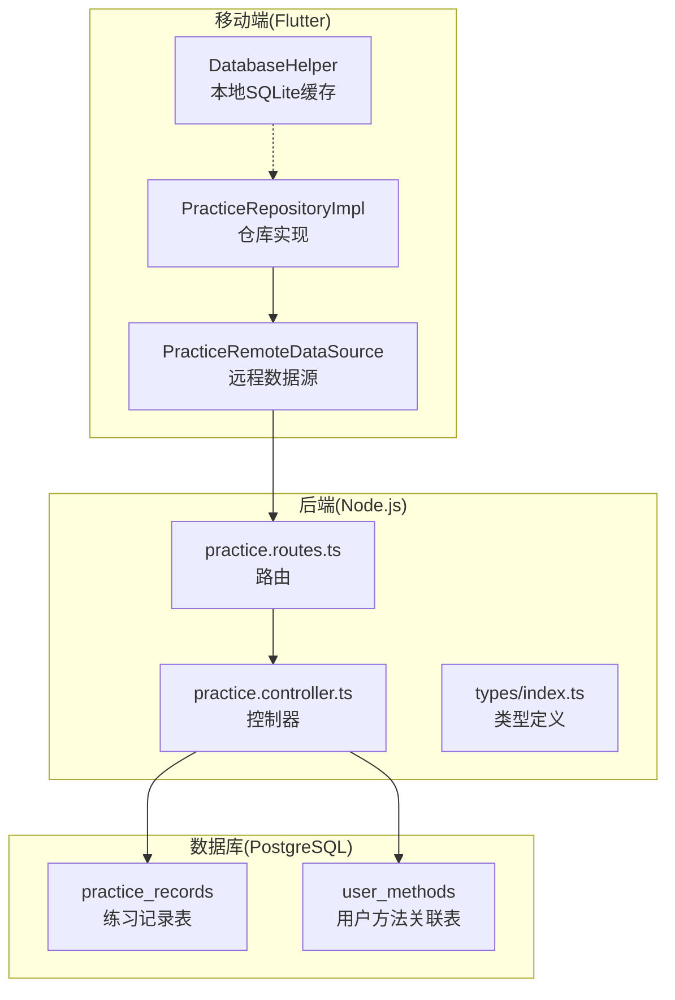
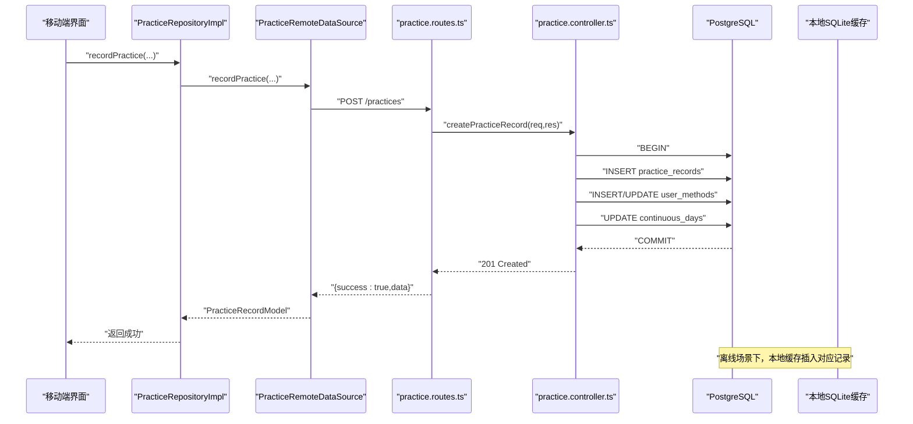
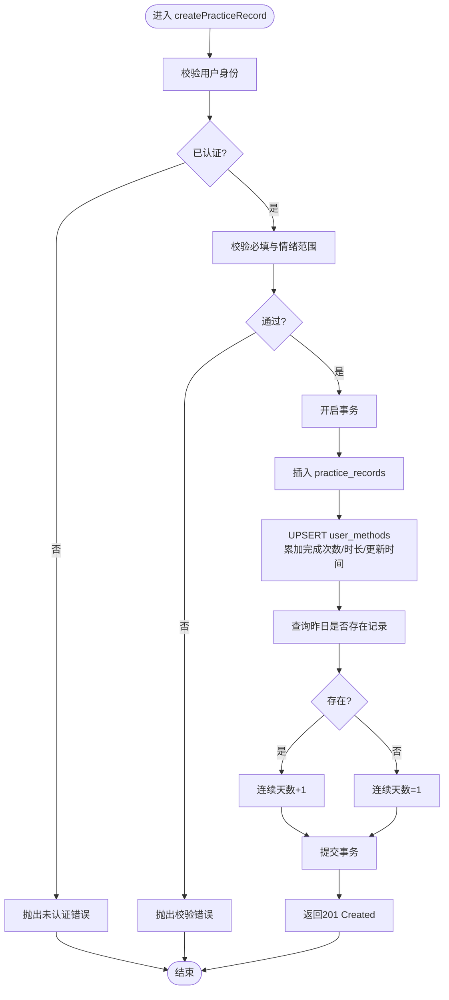
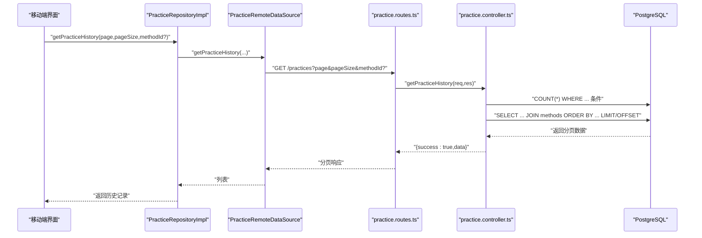
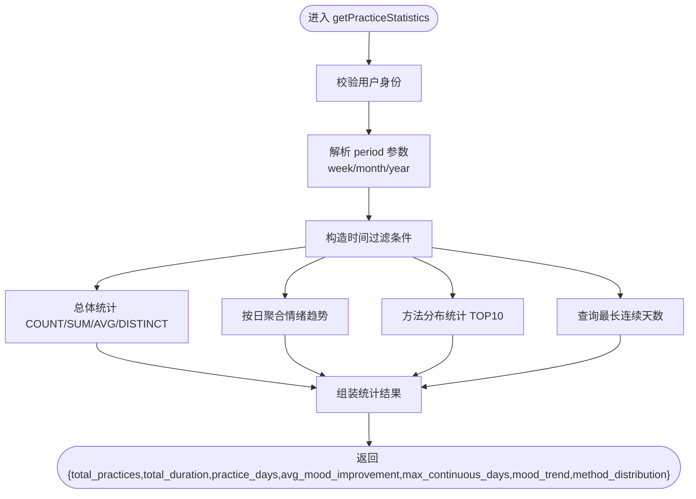
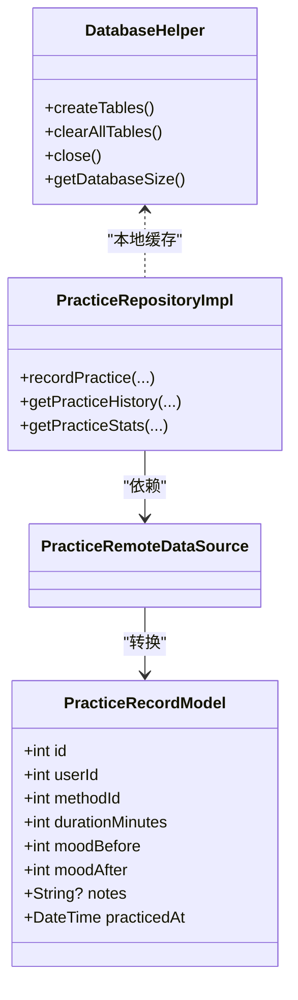
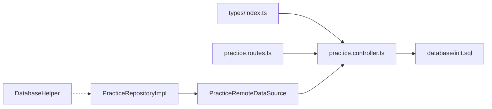

# 练习记录业务逻辑

<cite>
**本文引用的文件**
- [backend/src/controllers/practice.controller.ts](file://backend/src/controllers/practice.controller.ts)
- [backend/src/routes/practice.routes.ts](file://backend/src/routes/practice.routes.ts)
- [backend/src/types/index.ts](file://backend/src/types/index.ts)
- [database/init.sql](file://database/init.sql)
- [flutter_app/lib/data/repositories/practice_repository_impl.dart](file://flutter_app/lib/data/repositories/practice_repository_impl.dart)
- [flutter_app/lib/data/datasources/remote/practice_remote_data_source.dart](file://flutter_app/lib/data/datasources/remote/practice_remote_data_source.dart)
- [flutter_app/lib/data/models/practice_record_model.dart](file://flutter_app/lib/data/models/practice_record_model.dart)
- [flutter_app/lib/domain/entities/practice_record.dart](file://flutter_app/lib/domain/entities/practice_record.dart)
- [flutter_app/lib/domain/entities/practice_stats.dart](file://flutter_app/lib/domain/entities/practice_stats.dart)
- [flutter_app/lib/core/storage/database_helper.dart](file://flutter_app/lib/core/storage/database_helper.dart)
</cite>

## 目录
1. [简介](#简介)
2. [项目结构](#项目结构)
3. [核心组件](#核心组件)
4. [架构总览](#架构总览)
5. [详细组件分析](#详细组件分析)
6. [依赖关系分析](#依赖关系分析)
7. [性能考量](#性能考量)
8. [故障排查指南](#故障排查指南)
9. [结论](#结论)
10. [附录](#附录)

## 简介
本文件围绕“练习记录”模块进行深入剖析，重点覆盖以下方面：
- 练习记录的创建流程：输入验证（时长范围、情绪值有效性）、事务性数据持久化、用户与方法的外键约束处理、连续打卡天数更新策略。
- 历史查询：分页条件查询、动态where拼接、排序规则与索引利用。
- 统计计算：总体统计、心理状态趋势、方法分布、连续天数等指标的聚合算法与时间窗口选择。
- 移动端离线同步：基于SQLite缓存表的离线记录、索引设计与查询路径，以及与后端同步时的冲突处理思路。
- 大数据量下的查询性能优化建议：索引策略、查询计划与分页优化。

## 项目结构
练习记录模块由三层组成：
- 前端（Flutter）：通过远程数据源调用后端接口，同时在本地SQLite缓存练习记录。
- 后端（Node.js + Express + PostgreSQL）：提供REST接口，执行业务逻辑与数据库操作。
- 数据库（PostgreSQL）：定义练习记录与用户方法关联表的结构、索引与约束。

图表来源
- [backend/src/routes/practice.routes.ts](file://backend/src/routes/practice.routes.ts#L1-L20)
- [backend/src/controllers/practice.controller.ts](file://backend/src/controllers/practice.controller.ts#L1-L261)
- [backend/src/types/index.ts](file://backend/src/types/index.ts#L51-L63)
- [database/init.sql](file://database/init.sql#L63-L79)
- [flutter_app/lib/data/repositories/practice_repository_impl.dart](file://flutter_app/lib/data/repositories/practice_repository_impl.dart#L1-L83)
- [flutter_app/lib/data/datasources/remote/practice_remote_data_source.dart](file://flutter_app/lib/data/datasources/remote/practice_remote_data_source.dart#L1-L101)
- [flutter_app/lib/core/storage/database_helper.dart](file://flutter_app/lib/core/storage/database_helper.dart#L124-L152)

章节来源
- [backend/src/routes/practice.routes.ts](file://backend/src/routes/practice.routes.ts#L1-L20)
- [backend/src/controllers/practice.controller.ts](file://backend/src/controllers/practice.controller.ts#L1-L261)
- [database/init.sql](file://database/init.sql#L63-L79)
- [flutter_app/lib/data/repositories/practice_repository_impl.dart](file://flutter_app/lib/data/repositories/practice_repository_impl.dart#L1-L83)
- [flutter_app/lib/data/datasources/remote/practice_remote_data_source.dart](file://flutter_app/lib/data/datasources/remote/practice_remote_data_source.dart#L1-L101)
- [flutter_app/lib/core/storage/database_helper.dart](file://flutter_app/lib/core/storage/database_helper.dart#L124-L152)

## 核心组件
- 练习控制器：负责创建记录、历史查询、统计聚合。
- 路由层：统一鉴权中间件与REST端点映射。
- 类型系统：定义练习记录、用户方法、分页响应等类型。
- 数据库：定义练习记录与用户方法关联表的结构、索引与约束。
- 移动端仓库与远程数据源：封装网络请求与错误处理；本地SQLite用于离线缓存。
- 本地数据库：定义练习记录缓存表、索引与外键约束。

章节来源
- [backend/src/controllers/practice.controller.ts](file://backend/src/controllers/practice.controller.ts#L1-L261)
- [backend/src/routes/practice.routes.ts](file://backend/src/routes/practice.routes.ts#L1-L20)
- [backend/src/types/index.ts](file://backend/src/types/index.ts#L51-L63)
- [database/init.sql](file://database/init.sql#L63-L79)
- [flutter_app/lib/data/repositories/practice_repository_impl.dart](file://flutter_app/lib/data/repositories/practice_repository_impl.dart#L1-L83)
- [flutter_app/lib/data/datasources/remote/practice_remote_data_source.dart](file://flutter_app/lib/data/datasources/remote/practice_remote_data_source.dart#L1-L101)
- [flutter_app/lib/core/storage/database_helper.dart](file://flutter_app/lib/core/storage/database_helper.dart#L124-L152)

## 架构总览
下面的序列图展示了移动端创建练习记录的完整流程，包括网络请求、后端事务处理与本地缓存更新。

图表来源
- [flutter_app/lib/data/repositories/practice_repository_impl.dart](file://flutter_app/lib/data/repositories/practice_repository_impl.dart#L16-L39)
- [flutter_app/lib/data/datasources/remote/practice_remote_data_source.dart](file://flutter_app/lib/data/datasources/remote/practice_remote_data_source.dart#L14-L36)
- [backend/src/routes/practice.routes.ts](file://backend/src/routes/practice.routes.ts#L10-L12)
- [backend/src/controllers/practice.controller.ts](file://backend/src/controllers/practice.controller.ts#L7-L99)
- [database/init.sql](file://database/init.sql#L63-L79)
- [flutter_app/lib/core/storage/database_helper.dart](file://flutter_app/lib/core/storage/database_helper.dart#L124-L152)

## 详细组件分析

### 组件A：练习记录创建（输入验证、事务持久化、外键约束）
- 输入验证要点
  - 必填字段：方法ID与时长（分钟）。
  - 情绪值范围：前后情绪评分需在1-10之间，超出范围抛出校验错误。
- 事务与持久化
  - 使用显式事务包裹插入与更新，确保原子性。
  - 插入练习记录：写入用户ID、方法ID、当日日期、时长、情绪与备注。
  - 更新用户方法统计：使用ON CONFLICT UPSERT累加完成次数、总时长与最近练习时间。
  - 连续打卡天数：若昨天存在记录则自增，否则重置为1。
- 外键约束
  - 练习记录表与用户表、方法表存在外键约束，删除行为采用级联删除。
  - 数据库层对情绪值进行CHECK约束，保证数据一致性。

图表来源
- [backend/src/controllers/practice.controller.ts](file://backend/src/controllers/practice.controller.ts#L7-L99)
- [database/init.sql](file://database/init.sql#L63-L79)

章节来源
- [backend/src/controllers/practice.controller.ts](file://backend/src/controllers/practice.controller.ts#L7-L99)
- [database/init.sql](file://database/init.sql#L63-L79)

### 组件B：练习历史查询（分页、动态条件、排序与索引）
- 认证与参数
  - 需要认证用户ID；支持按方法ID、起止日期过滤；分页参数默认每页20条。
- 动态where拼接
  - 条件数组与参数数组动态构建，避免SQL注入风险。
- 排序与索引
  - 按练习日期与创建时间降序排列，利于最新记录优先展示。
  - 数据库已建立复合索引以支撑按用户+日期、用户+方法ID的查询。
- 返回结构
  - 包含列表、总数、页码与页大小的分页响应对象。

图表来源
- [flutter_app/lib/data/repositories/practice_repository_impl.dart](file://flutter_app/lib/data/repositories/practice_repository_impl.dart#L41-L61)
- [flutter_app/lib/data/datasources/remote/practice_remote_data_source.dart](file://flutter_app/lib/data/datasources/remote/practice_remote_data_source.dart#L38-L58)
- [backend/src/routes/practice.routes.ts](file://backend/src/routes/practice.routes.ts#L13-L15)
- [backend/src/controllers/practice.controller.ts](file://backend/src/controllers/practice.controller.ts#L101-L172)
- [database/init.sql](file://database/init.sql#L76-L79)

章节来源
- [backend/src/controllers/practice.controller.ts](file://backend/src/controllers/practice.controller.ts#L101-L172)
- [backend/src/routes/practice.routes.ts](file://backend/src/routes/practice.routes.ts#L13-L15)
- [database/init.sql](file://database/init.sql#L76-L79)

### 组件C：练习统计接口（聚合与趋势分析）
- 时间窗口
  - 支持按周/月/年聚合，默认为月。
- 聚合指标
  - 总练习次数、总时长、练习天数、平均情绪改善度。
  - 心理状态趋势：按日聚合平均练习前/后情绪。
  - 方法分布：按方法统计练习次数与时长，取前10名。
  - 连续天数：取用户方法表中的最大连续天数。
- 数据来源
  - 练习记录表与方法表JOIN，配合WHERE用户ID与时间窗口过滤。

图表来源
- [backend/src/controllers/practice.controller.ts](file://backend/src/controllers/practice.controller.ts#L174-L260)

章节来源
- [backend/src/controllers/practice.controller.ts](file://backend/src/controllers/practice.controller.ts#L174-L260)

### 组件D：移动端离线练习数据同步（本地缓存与索引）
- 本地缓存表
  - 练习记录缓存表包含用户ID、方法ID、时长、情绪、笔记、练习时间戳等字段，并建立用户ID、方法ID与时间戳索引。
- 外键约束
  - 与用户表、方法表建立外键约束，删除行为级联。
- 同步策略（概念性说明）
  - 离线记录先写入本地缓存表；联网后将本地未同步记录批量上传至后端。
  - 冲突解决思路（概念）：以服务器端记录为准，若本地记录与服务器记录在相同用户+方法+日期组合上冲突，则保留服务器端数据；本地新增记录优先上传；删除操作可采用软删除或服务端统一清理策略。
  - 上传成功后，本地删除对应记录或标记为已同步。

图表来源
- [flutter_app/lib/data/models/practice_record_model.dart](file://flutter_app/lib/data/models/practice_record_model.dart#L1-L93)
- [flutter_app/lib/core/storage/database_helper.dart](file://flutter_app/lib/core/storage/database_helper.dart#L124-L152)
- [flutter_app/lib/data/repositories/practice_repository_impl.dart](file://flutter_app/lib/data/repositories/practice_repository_impl.dart#L1-L83)

章节来源
- [flutter_app/lib/core/storage/database_helper.dart](file://flutter_app/lib/core/storage/database_helper.dart#L124-L152)
- [flutter_app/lib/data/models/practice_record_model.dart](file://flutter_app/lib/data/models/practice_record_model.dart#L1-L93)
- [flutter_app/lib/data/repositories/practice_repository_impl.dart](file://flutter_app/lib/data/repositories/practice_repository_impl.dart#L1-L83)

## 依赖关系分析
- 控制器依赖类型定义与数据库连接池。
- 路由层统一挂载认证中间件，所有练习相关端点均受保护。
- 数据库层通过初始化脚本定义表结构、索引与约束，确保查询性能与数据完整性。
- 移动端通过远程数据源封装HTTP请求，仓库实现负责错误分类与返回Either类型。

图表来源
- [backend/src/types/index.ts](file://backend/src/types/index.ts#L51-L63)
- [backend/src/routes/practice.routes.ts](file://backend/src/routes/practice.routes.ts#L1-L20)
- [backend/src/controllers/practice.controller.ts](file://backend/src/controllers/practice.controller.ts#L1-L261)
- [database/init.sql](file://database/init.sql#L63-L79)
- [flutter_app/lib/data/repositories/practice_repository_impl.dart](file://flutter_app/lib/data/repositories/practice_repository_impl.dart#L1-L83)
- [flutter_app/lib/data/datasources/remote/practice_remote_data_source.dart](file://flutter_app/lib/data/datasources/remote/practice_remote_data_source.dart#L1-L101)
- [flutter_app/lib/core/storage/database_helper.dart](file://flutter_app/lib/core/storage/database_helper.dart#L124-L152)

章节来源
- [backend/src/types/index.ts](file://backend/src/types/index.ts#L51-L63)
- [backend/src/routes/practice.routes.ts](file://backend/src/routes/practice.routes.ts#L1-L20)
- [backend/src/controllers/practice.controller.ts](file://backend/src/controllers/practice.controller.ts#L1-L261)
- [database/init.sql](file://database/init.sql#L63-L79)
- [flutter_app/lib/data/repositories/practice_repository_impl.dart](file://flutter_app/lib/data/repositories/practice_repository_impl.dart#L1-L83)
- [flutter_app/lib/data/datasources/remote/practice_remote_data_source.dart](file://flutter_app/lib/data/datasources/remote/practice_remote_data_source.dart#L1-L101)
- [flutter_app/lib/core/storage/database_helper.dart](file://flutter_app/lib/core/storage/database_helper.dart#L124-L152)

## 性能考量
- 索引策略
  - 练习记录表：用户+日期、用户+方法ID、创建时间索引，有利于历史查询与统计聚合。
  - 用户方法表：用户ID、方法ID索引，支持快速定位用户方法统计。
- 查询优化
  - 使用LIMIT/OFFSET分页，避免一次性加载大量数据。
  - 动态where拼接与参数绑定，减少全表扫描。
  - 统计查询尽量利用现有索引，避免在大表上进行无索引的聚合。
- 大数据量建议
  - 对高频查询字段建立复合索引（如用户+日期）。
  - 将统计任务拆分为定时任务或物化视图，降低在线查询压力。
  - 对历史数据进行归档或分区，减少主表膨胀。

[本节为通用性能指导，不直接分析具体文件]

## 故障排查指南
- 常见错误与处理
  - 未认证：路由层统一鉴权，控制器内再次校验用户ID，返回未认证错误。
  - 校验失败：必填字段缺失或情绪值越界，返回校验错误。
  - 事务回滚：创建记录过程中任一环节异常，事务回滚，避免脏数据。
  - 网络异常：移动端远程数据源捕获Dio异常，区分超时、连接失败与服务器错误，转换为领域失败类型。
- 本地缓存问题
  - 若出现重复记录，检查本地缓存表的唯一性约束与同步策略。
  - 确保索引存在且有效，避免查询缓慢。

章节来源
- [backend/src/controllers/practice.controller.ts](file://backend/src/controllers/practice.controller.ts#L18-L32)
- [backend/src/controllers/practice.controller.ts](file://backend/src/controllers/practice.controller.ts#L94-L98)
- [flutter_app/lib/data/datasources/remote/practice_remote_data_source.dart](file://flutter_app/lib/data/datasources/remote/practice_remote_data_source.dart#L86-L100)
- [flutter_app/lib/data/repositories/practice_repository_impl.dart](file://flutter_app/lib/data/repositories/practice_repository_impl.dart#L23-L39)

## 结论
练习记录模块在后端通过严格的输入验证、事务性持久化与外键约束保障了数据一致性；在移动端通过本地SQLite缓存与索引提升了离线体验。统计接口提供了多维度的聚合分析能力，配合数据库索引与分页机制，能够在大数据量场景下保持较好的查询性能。建议进一步完善离线同步的冲突解决策略与统计任务的异步化处理，以提升系统的可维护性与扩展性。

[本节为总结性内容，不直接分析具体文件]

## 附录
- 数据模型与实体
  - 练习记录实体与模型：包含ID、用户ID、方法ID、时长、情绪、笔记与练习时间等字段。
  - 练习统计实体：包含总次数、总时长、平均情绪改善、当前/最长连续天数等指标。

章节来源
- [flutter_app/lib/domain/entities/practice_record.dart](file://flutter_app/lib/domain/entities/practice_record.dart#L1-L67)
- [flutter_app/lib/data/models/practice_record_model.dart](file://flutter_app/lib/data/models/practice_record_model.dart#L1-L93)
- [flutter_app/lib/domain/entities/practice_stats.dart](file://flutter_app/lib/domain/entities/practice_stats.dart#L1-L47)