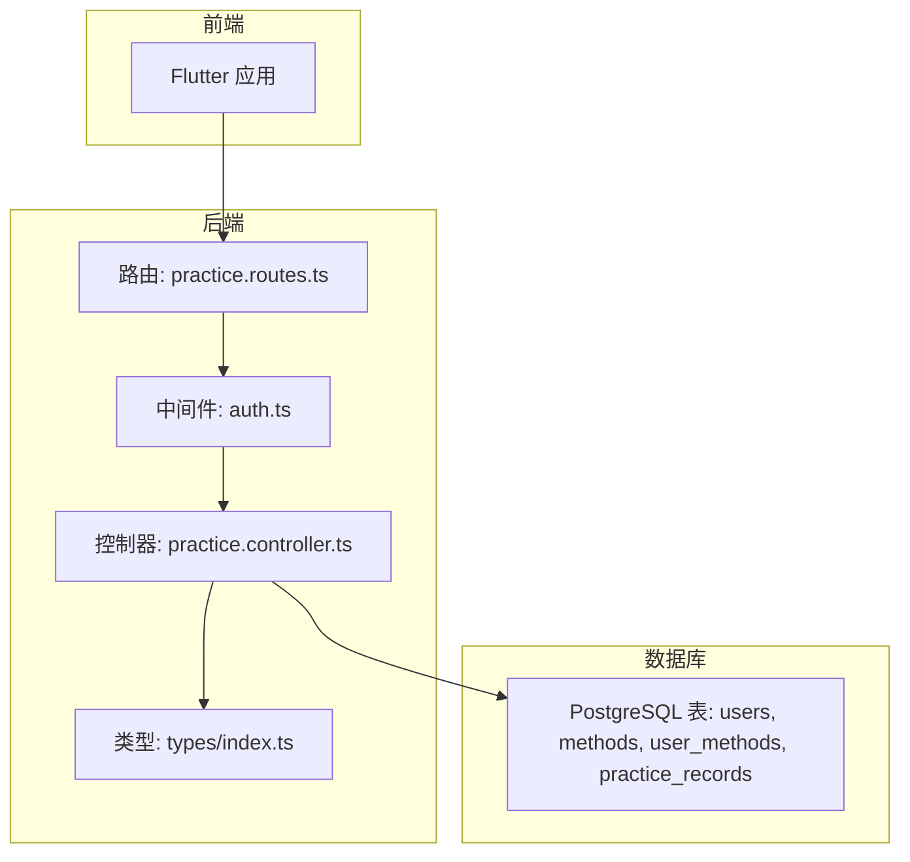
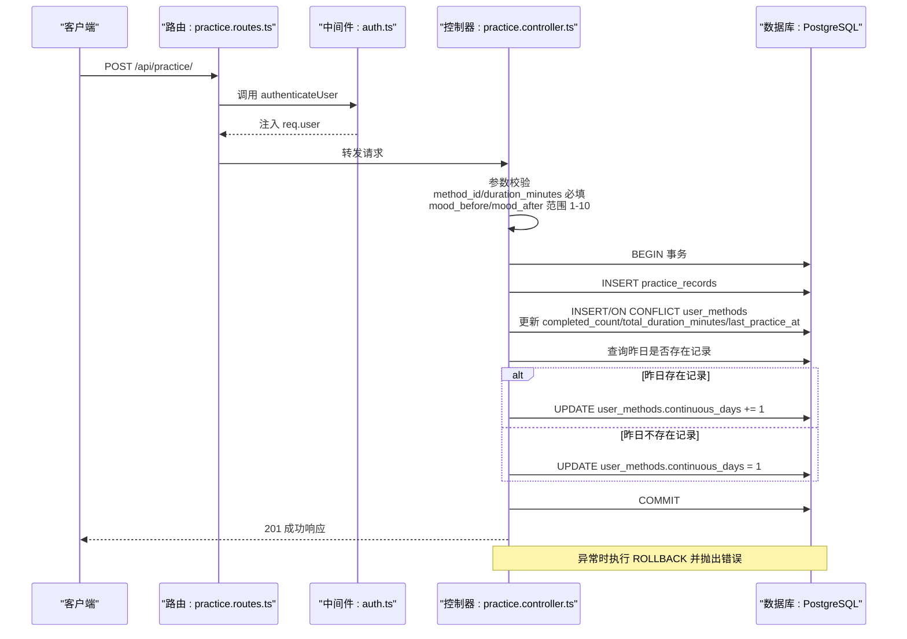
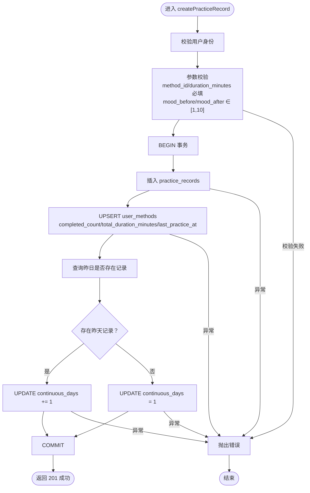
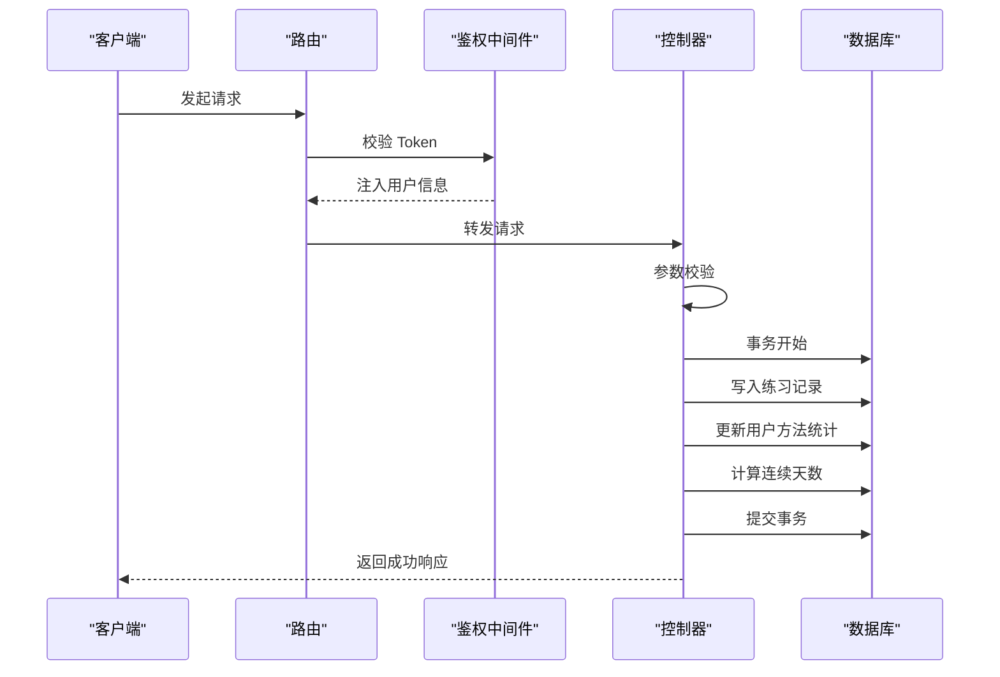
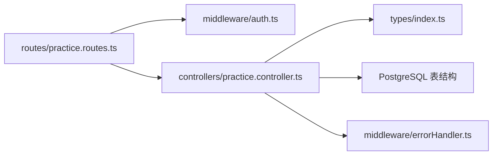

# 练习记录创建逻辑

<cite>
**本文引用的文件列表**
- [backend/src/controllers/practice.controller.ts](file://backend/src/controllers/practice.controller.ts)
- [backend/src/routes/practice.routes.ts](file://backend/src/routes/practice.routes.ts)
- [backend/src/middleware/auth.ts](file://backend/src/middleware/auth.ts)
- [backend/src/middleware/errorHandler.ts](file://backend/src/middleware/errorHandler.ts)
- [backend/src/types/index.ts](file://backend/src/types/index.ts)
- [database/init.sql](file://database/init.sql)
</cite>

## 目录
1. [简介](#简介)
2. [项目结构](#项目结构)
3. [核心组件](#核心组件)
4. [架构总览](#架构总览)
5. [详细组件分析](#详细组件分析)
6. [依赖关系分析](#依赖关系分析)
7. [性能考量](#性能考量)
8. [故障排查指南](#故障排查指南)
9. [结论](#结论)

## 简介
本文件围绕“练习记录创建”这一核心业务流程进行深入解析，重点聚焦于后端控制器中的 createPracticeRecord 函数实现机制。文档将从请求参数验证规则、事务处理与数据一致性保障、外键约束与完整性、时序图与异常处理策略、以及性能优化建议等维度展开，帮助读者全面理解该功能在代码与数据库层面的协作方式。

## 项目结构
后端采用 Express + PostgreSQL 的典型分层架构：
- 路由层：定义 /api/practice 的认证保护与路由映射
- 中间件层：鉴权中间件负责 Token 校验并将用户信息注入请求对象
- 控制器层：实现练习记录创建、历史查询与统计分析
- 类型定义：统一前后端交互的数据模型
- 数据库初始化：定义表结构、索引与约束，确保数据完整性

图表来源
- [backend/src/routes/practice.routes.ts](file://backend/src/routes/practice.routes.ts#L1-L20)
- [backend/src/middleware/auth.ts](file://backend/src/middleware/auth.ts#L1-L87)
- [backend/src/controllers/practice.controller.ts](file://backend/src/controllers/practice.controller.ts#L1-L120)
- [database/init.sql](file://database/init.sql#L63-L88)

章节来源
- [backend/src/routes/practice.routes.ts](file://backend/src/routes/practice.routes.ts#L1-L20)
- [backend/src/middleware/auth.ts](file://backend/src/middleware/auth.ts#L1-L87)
- [backend/src/controllers/practice.controller.ts](file://backend/src/controllers/practice.controller.ts#L1-L120)
- [database/init.sql](file://database/init.sql#L63-L88)

## 核心组件
- 路由与鉴权
  - practice.routes.ts 将所有练习相关接口置于 authenticateUser 中间件之下，确保只有携带有效 Bearer Token 的已登录用户可访问。
  - authenticateUser 从 Authorization 头解析 JWT，解码后将用户信息挂载到 req.user，供后续控制器使用。
- 控制器与业务逻辑
  - createPracticeRecord 负责接收请求体参数、执行参数校验、开启数据库事务、插入练习记录、更新 user_methods 关联表、计算连续打卡天数，并在成功后提交事务；若任一步骤失败则回滚。
- 类型与错误处理
  - types/index.ts 定义了 PracticeRecord、UserMethod 等实体类型，保证前后端契约一致。
  - errorHandler.ts 定义 AppError 并统一拦截处理，返回标准化错误响应。

章节来源
- [backend/src/routes/practice.routes.ts](file://backend/src/routes/practice.routes.ts#L1-L20)
- [backend/src/middleware/auth.ts](file://backend/src/middleware/auth.ts#L1-L87)
- [backend/src/controllers/practice.controller.ts](file://backend/src/controllers/practice.controller.ts#L1-L120)
- [backend/src/middleware/errorHandler.ts](file://backend/src/middleware/errorHandler.ts#L1-L97)
- [backend/src/types/index.ts](file://backend/src/types/index.ts#L52-L63)

## 架构总览
下面的时序图展示了从客户端发起创建练习记录请求，到数据库完成事务提交的完整流程。

图表来源
- [backend/src/routes/practice.routes.ts](file://backend/src/routes/practice.routes.ts#L1-L20)
- [backend/src/middleware/auth.ts](file://backend/src/middleware/auth.ts#L1-L87)
- [backend/src/controllers/practice.controller.ts](file://backend/src/controllers/practice.controller.ts#L1-L120)
- [database/init.sql](file://database/init.sql#L63-L88)

## 详细组件分析

### 请求参数验证规则
- method_id 与 duration_minutes 必填校验
  - 若缺失任一参数，控制器立即抛出参数校验错误，阻止后续数据库操作。
- mood_before 与 mood_after 取值范围限制
  - 当提供上述字段时，需满足 1 ≤ 值 ≤ 10，否则返回参数校验错误。
- 其他字段
  - notes 与 questionnaire_result 支持为空，控制器按需传入 null，避免破坏约束。

章节来源
- [backend/src/controllers/practice.controller.ts](file://backend/src/controllers/practice.controller.ts#L18-L32)

### 事务处理与数据一致性
- 事务边界
  - 控制器显式开启 BEGIN、COMMIT，并在异常时执行 ROLLBACK，确保多步写入的原子性。
- 写入顺序与一致性
  1) 插入 practice_records
     - 使用 CURRENT_DATE 作为 practice_date，duration_minutes 作为时长，mood_before/mood_after/notes/questionnaire_result 可空。
  2) 更新 user_methods
     - 以 (user_id, method_id) 为唯一键，首次插入时设置 completed_count、total_duration_minutes、last_practice_at；若已存在则执行增量更新。
  3) 计算连续打卡天数
     - 查询是否存在“昨天”的练习记录；存在则 continuous_days + 1，否则重置为 1。
- 异常处理
  - 任一步骤抛错均触发 ROLLBACK，随后重新抛出错误，交由全局错误处理器统一返回。

图表来源
- [backend/src/controllers/practice.controller.ts](file://backend/src/controllers/practice.controller.ts#L1-L120)

章节来源
- [backend/src/controllers/practice.controller.ts](file://backend/src/controllers/practice.controller.ts#L1-L120)

### 外键约束与完整性保障
- 表结构与约束
  - practice_records.user_id 引用 users(id)，method_id 引用 methods(id)，删除策略为级联删除。
  - user_methods(user_id, method_id) 唯一键，确保同一用户对同一方法仅有一条记录。
- 数据库层面的约束
  - mood_before 与 mood_after 字段带有 1-10 的 CHECK 约束，进一步保证数据质量。
- 业务层与数据库层的协同
  - 业务层在进入事务前进行参数校验，数据库层通过外键与 CHECK 约束保障引用完整性与取值范围，二者共同确保数据一致性。

章节来源
- [database/init.sql](file://database/init.sql#L63-L88)
- [database/init.sql](file://database/init.sql#L44-L56)

### 时序图（概念化）
以下为概念化流程图，展示从请求到响应的关键步骤，便于理解整体调用链路。

（该图为概念化示意，无需图表来源）

## 依赖关系分析
- 控制器依赖
  - 依赖数据库连接池 pool 进行事务控制与查询。
  - 依赖 AppError 统一错误处理。
- 路由与中间件
  - 路由层统一使用 authenticateUser 中间件，确保所有练习接口的鉴权。
- 类型与契约
  - PracticeRecord、UserMethod 等类型定义了前后端交互的数据结构，避免类型不一致导致的运行时问题。

图表来源
- [backend/src/routes/practice.routes.ts](file://backend/src/routes/practice.routes.ts#L1-L20)
- [backend/src/middleware/auth.ts](file://backend/src/middleware/auth.ts#L1-L87)
- [backend/src/controllers/practice.controller.ts](file://backend/src/controllers/practice.controller.ts#L1-L120)
- [backend/src/middleware/errorHandler.ts](file://backend/src/middleware/errorHandler.ts#L1-L97)
- [backend/src/types/index.ts](file://backend/src/types/index.ts#L52-L63)

章节来源
- [backend/src/routes/practice.routes.ts](file://backend/src/routes/practice.routes.ts#L1-L20)
- [backend/src/middleware/auth.ts](file://backend/src/middleware/auth.ts#L1-L87)
- [backend/src/controllers/practice.controller.ts](file://backend/src/controllers/practice.controller.ts#L1-L120)
- [backend/src/middleware/errorHandler.ts](file://backend/src/middleware/errorHandler.ts#L1-L97)
- [backend/src/types/index.ts](file://backend/src/types/index.ts#L52-L63)

## 性能考量
- 索引设计
  - practice_records(user_id, practice_date)：支持按用户与日期快速检索，有利于统计与历史查询。
  - practice_records(user_id, method_id)：支持按用户与方法聚合统计，提升报表与分析效率。
  - practice_records(created_at)：便于按创建时间排序与分页。
  - user_methods(user_id)、user_methods(method_id)：加速 user_methods 的查询与更新。
- 事务粒度
  - 单次创建仅包含少量写入，事务开销可控；通过一次性提交减少锁竞争与回滚成本。
- 建议
  - 在高频写入场景下，可考虑将连续天数计算逻辑异步化或引入缓存，降低热点更新带来的写放大。
  - 对于历史查询接口，结合分页与索引使用，避免全表扫描。

章节来源
- [database/init.sql](file://database/init.sql#L76-L78)
- [database/init.sql](file://database/init.sql#L58-L61)

## 故障排查指南
- 常见错误与定位
  - 401 未认证：检查 Authorization 头是否为 Bearer Token，且 Token 未过期。
  - 400 参数校验失败：确认 method_id 与 duration_minutes 是否存在，mood_before/mood_after 是否在 1-10 区间内。
  - 500 服务器错误：查看全局错误处理器输出的日志，定位具体异常位置。
- 事务回滚
  - 控制器在捕获异常后会执行 ROLLBACK，确保数据不被部分写入破坏；若出现数据不一致，优先检查异常堆栈与数据库日志。
- 日志与监控
  - errorHandler.ts 已记录错误信息、路径与方法，便于线上问题定位。

章节来源
- [backend/src/middleware/auth.ts](file://backend/src/middleware/auth.ts#L1-L87)
- [backend/src/controllers/practice.controller.ts](file://backend/src/controllers/practice.controller.ts#L1-L120)
- [backend/src/middleware/errorHandler.ts](file://backend/src/middleware/errorHandler.ts#L1-L97)

## 结论
练习记录创建功能通过严格的参数校验、严谨的事务处理与完善的数据库约束，实现了数据一致性与业务正确性的双重保障。配合合理的索引设计与错误处理机制，能够在高并发场景下保持稳定与可维护性。建议在后续迭代中持续关注热点更新的性能瓶颈，并结合业务需求对统计与分析模块进行优化。