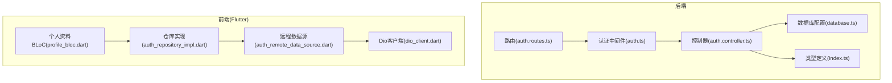
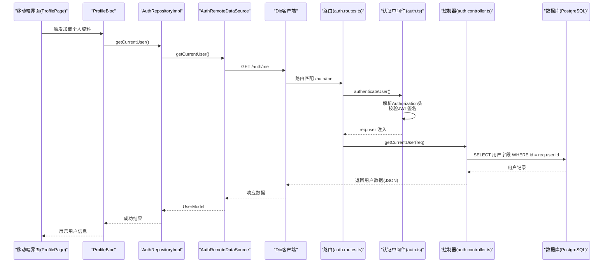
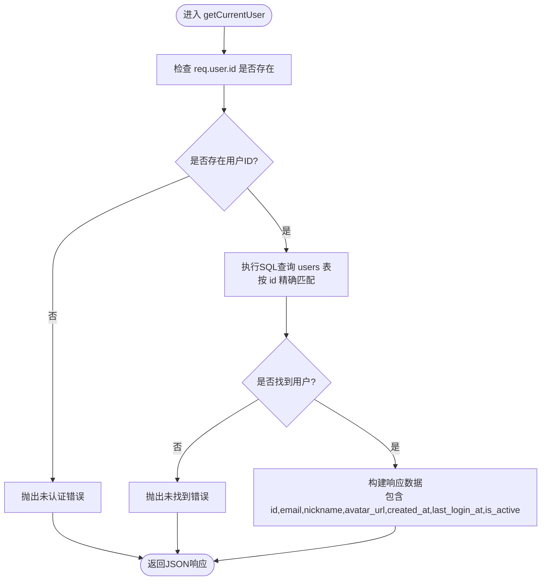
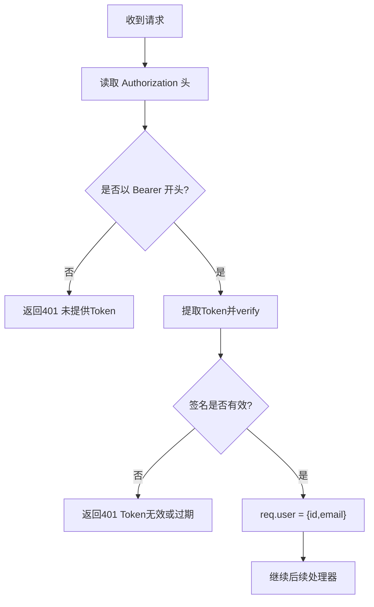
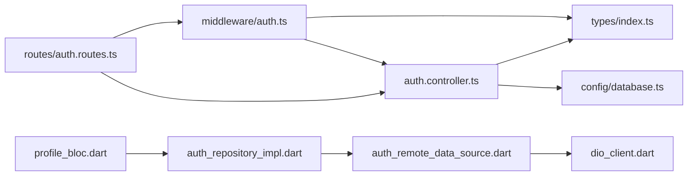

# 用户信息获取逻辑

<cite>
**本文引用的文件**
- [backend/src/controllers/auth.controller.ts](file://backend/src/controllers/auth.controller.ts)
- [backend/src/middleware/auth.ts](file://backend/src/middleware/auth.ts)
- [backend/src/routes/auth.routes.ts](file://backend/src/routes/auth.routes.ts)
- [backend/src/types/index.ts](file://backend/src/types/index.ts)
- [backend/src/config/database.ts](file://backend/src/config/database.ts)
- [database/init.sql](file://database/init.sql)
- [.env.example](file://.env.example)
- [flutter_app/lib/data/datasources/remote/auth_remote_data_source.dart](file://flutter_app/lib/data/datasources/remote/auth_remote_data_source.dart)
- [flutter_app/lib/data/repositories/auth_repository_impl.dart](file://flutter_app/lib/data/repositories/auth_repository_impl.dart)
- [flutter_app/lib/presentation/profile/bloc/profile_bloc.dart](file://flutter_app/lib/presentation/profile/bloc/profile_bloc.dart)
- [flutter_app/lib/core/network/dio_client.dart](file://flutter_app/lib/core/network/dio_client.dart)
</cite>

## 目录
1. [引言](#引言)
2. [项目结构](#项目结构)
3. [核心组件](#核心组件)
4. [架构总览](#架构总览)
5. [详细组件分析](#详细组件分析)
6. [依赖关系分析](#依赖关系分析)
7. [性能考量](#性能考量)
8. [故障排查指南](#故障排查指南)
9. [结论](#结论)

## 引言
本文围绕 nian 后端“获取当前用户信息”接口展开，基于后端控制器中的 getCurrentUser 函数进行深入分析。重点说明该接口如何依赖 JWT 中间件注入的 req.user 对象完成身份识别，如何验证用户 ID 的存在性与有效性，如何通过数据库查询返回指定字段并进行敏感字段脱敏，以及权限控制如何确保用户仅能访问自身信息。同时结合移动端个人中心页面，给出用户信息缓存与刷新策略，并提供接口调用时序图与潜在风险及增强建议。

## 项目结构
后端采用 Express + TypeScript 架构，按职责分层组织：
- 控制器层：处理业务请求，如用户注册、登录、获取当前用户信息
- 中间件层：认证与错误处理
- 路由层：定义 REST 接口路径与访问控制
- 类型定义：统一前后端数据契约
- 数据库配置：PostgreSQL 连接池与 Redis 客户端
- Flutter 移动端：通过 Dio 客户端发起请求，拦截器自动附加 Authorization 头

图表来源
- [backend/src/routes/auth.routes.ts](file://backend/src/routes/auth.routes.ts#L1-L17)
- [backend/src/middleware/auth.ts](file://backend/src/middleware/auth.ts#L1-L87)
- [backend/src/controllers/auth.controller.ts](file://backend/src/controllers/auth.controller.ts#L127-L150)
- [backend/src/types/index.ts](file://backend/src/types/index.ts#L1-L126)
- [backend/src/config/database.ts](file://backend/src/config/database.ts#L1-L47)
- [flutter_app/lib/data/datasources/remote/auth_remote_data_source.dart](file://flutter_app/lib/data/datasources/remote/auth_remote_data_source.dart#L46-L54)
- [flutter_app/lib/data/repositories/auth_repository_impl.dart](file://flutter_app/lib/data/repositories/auth_repository_impl.dart#L77-L92)
- [flutter_app/lib/presentation/profile/bloc/profile_bloc.dart](file://flutter_app/lib/presentation/profile/bloc/profile_bloc.dart#L28-L64)
- [flutter_app/lib/core/network/dio_client.dart](file://flutter_app/lib/core/network/dio_client.dart#L62-L98)

章节来源
- [backend/src/routes/auth.routes.ts](file://backend/src/routes/auth.routes.ts#L1-L17)
- [backend/src/middleware/auth.ts](file://backend/src/middleware/auth.ts#L1-L87)
- [backend/src/controllers/auth.controller.ts](file://backend/src/controllers/auth.controller.ts#L127-L150)
- [backend/src/types/index.ts](file://backend/src/types/index.ts#L1-L126)
- [backend/src/config/database.ts](file://backend/src/config/database.ts#L1-L47)
- [flutter_app/lib/data/datasources/remote/auth_remote_data_source.dart](file://flutter_app/lib/data/datasources/remote/auth_remote_data_source.dart#L46-L54)
- [flutter_app/lib/data/repositories/auth_repository_impl.dart](file://flutter_app/lib/data/repositories/auth_repository_impl.dart#L77-L92)
- [flutter_app/lib/presentation/profile/bloc/profile_bloc.dart](file://flutter_app/lib/presentation/profile/bloc/profile_bloc.dart#L28-L64)
- [flutter_app/lib/core/network/dio_client.dart](file://flutter_app/lib/core/network/dio_client.dart#L62-L98)

## 核心组件
- 路由层：在 auth.routes.ts 中为 GET /auth/me 挂载 authenticateUser 中间件，确保只有携带有效 JWT 的请求才能进入控制器
- 认证中间件：在 auth.ts 中从 Authorization 头解析 Bearer Token，使用 JWT_SECRET 验证签名；成功则将解码后的用户标识写入 req.user，失败抛出 401 错误
- 控制器：在 auth.controller.ts 的 getCurrentUser 中读取 req.user.id，查询 users 表，返回用户基本信息（id, email, nickname, avatar_url, created_at, last_login_at, is_active），不包含 password_hash 等敏感字段
- 类型定义：types/index.ts 定义了 User、UserWithPassword、AuthRequest 等类型，保证前后端契约一致
- 数据库配置：database.ts 提供 PostgreSQL 连接池，供控制器执行 SQL 查询
- Flutter 端：通过 Dio 客户端自动在请求头添加 Authorization: Bearer <token>，并在 401 时清理本地 token

章节来源
- [backend/src/routes/auth.routes.ts](file://backend/src/routes/auth.routes.ts#L13-L14)
- [backend/src/middleware/auth.ts](file://backend/src/middleware/auth.ts#L14-L33)
- [backend/src/controllers/auth.controller.ts](file://backend/src/controllers/auth.controller.ts#L127-L149)
- [backend/src/types/index.ts](file://backend/src/types/index.ts#L1-L126)
- [backend/src/config/database.ts](file://backend/src/config/database.ts#L1-L47)
- [flutter_app/lib/core/network/dio_client.dart](file://flutter_app/lib/core/network/dio_client.dart#L62-L98)

## 架构总览
下面的时序图展示了移动端个人中心页面调用“获取当前用户信息”的完整流程，包括请求发起、JWT 校验、数据库查询与响应返回。

图表来源
- [flutter_app/lib/presentation/profile/bloc/profile_bloc.dart](file://flutter_app/lib/presentation/profile/bloc/profile_bloc.dart#L28-L64)
- [flutter_app/lib/data/repositories/auth_repository_impl.dart](file://flutter_app/lib/data/repositories/auth_repository_impl.dart#L77-L92)
- [flutter_app/lib/data/datasources/remote/auth_remote_data_source.dart](file://flutter_app/lib/data/datasources/remote/auth_remote_data_source.dart#L46-L54)
- [flutter_app/lib/core/network/dio_client.dart](file://flutter_app/lib/core/network/dio_client.dart#L62-L98)
- [backend/src/routes/auth.routes.ts](file://backend/src/routes/auth.routes.ts#L13-L14)
- [backend/src/middleware/auth.ts](file://backend/src/middleware/auth.ts#L14-L33)
- [backend/src/controllers/auth.controller.ts](file://backend/src/controllers/auth.controller.ts#L127-L149)
- [backend/src/config/database.ts](file://backend/src/config/database.ts#L1-L47)

## 详细组件分析

### 控制器：getCurrentUser 的实现与数据流
- 身份识别：从 req.user.id 获取当前用户标识，若不存在则直接返回未认证错误
- 用户存在性与有效性：通过 WHERE id = $1 查询 users 表，若无记录则返回未找到错误
- 字段集合：返回 id, email, nickname, avatar_url, created_at, last_login_at, is_active
- 敏感字段脱敏：未返回 password_hash 等敏感字段，避免泄露
- 数据库查询：使用连接池执行 SQL 查询，返回单条用户记录

图表来源
- [backend/src/controllers/auth.controller.ts](file://backend/src/controllers/auth.controller.ts#L127-L149)

章节来源
- [backend/src/controllers/auth.controller.ts](file://backend/src/controllers/auth.controller.ts#L127-L149)

### 认证中间件：JWT 校验与 req.user 注入
- 请求头解析：要求 Authorization 以 Bearer 开头，提取 Token
- 签名验证：使用 JWT_SECRET 对 Token 进行 verify，成功则将 {id, email} 写入 req.user 并放行
- 异常处理：缺失 Token 或签名无效均返回 401
- 管理员中间件：额外校验 isAdmin 标识，确保管理员专用接口

图表来源
- [backend/src/middleware/auth.ts](file://backend/src/middleware/auth.ts#L14-L33)

章节来源
- [backend/src/middleware/auth.ts](file://backend/src/middleware/auth.ts#L14-L33)

### 路由与权限控制
- 路由挂载：GET /auth/me 使用 authenticateUser 中间件，确保只有已认证用户可访问
- 权限边界：中间件只校验 JWT，不进行资源级权限判断；控制器通过 WHERE id = $1 限定仅返回当前用户信息，天然满足“只能访问自身”的约束

章节来源
- [backend/src/routes/auth.routes.ts](file://backend/src/routes/auth.routes.ts#L13-L14)

### 数据库与类型契约
- 用户表结构：users 包含 id, email, password_hash, nickname, avatar_url, created_at, last_login_at, is_active 等字段
- 查询字段：控制器仅选择非敏感字段返回，避免 password_hash 泄露
- 类型定义：User 接口与 AuthRequest 扩展，确保编译期类型安全

章节来源
- [database/init.sql](file://database/init.sql#L5-L14)
- [backend/src/controllers/auth.controller.ts](file://backend/src/controllers/auth.controller.ts#L135-L139)
- [backend/src/types/index.ts](file://backend/src/types/index.ts#L1-L126)

### 移动端个人中心页面与缓存刷新策略
- 请求发起：ProfileBloc 在加载个人资料时调用 AuthRepository.getCurrentUser
- 仓库实现：AuthRepositoryImpl 调用 AuthRemoteDataSource.getCurrentUser
- 远程数据源：AuthRemoteDataSource 通过 DioClient 发起 GET /auth/me，自动附加 Authorization 头
- 401 处理：Dio 客户端拦截器在 401 时删除本地 token，防止继续发送无效请求
- 缓存与刷新建议：
  - 首次加载：从后端拉取最新用户信息
  - 本地缓存：将用户信息持久化到安全存储（如 Flutter Secure Storage），在应用启动时优先展示缓存，后台异步刷新
  - 刷新策略：在用户操作昵称/头像等可能变更的场景后，立即刷新缓存；在网络异常时回退到缓存并提示用户
  - 主题与设置：个人中心的其他设置（如主题、通知）可独立缓存，不影响用户信息的刷新

章节来源
- [flutter_app/lib/presentation/profile/bloc/profile_bloc.dart](file://flutter_app/lib/presentation/profile/bloc/profile_bloc.dart#L28-L64)
- [flutter_app/lib/data/repositories/auth_repository_impl.dart](file://flutter_app/lib/data/repositories/auth_repository_impl.dart#L77-L92)
- [flutter_app/lib/data/datasources/remote/auth_remote_data_source.dart](file://flutter_app/lib/data/datasources/remote/auth_remote_data_source.dart#L46-L54)
- [flutter_app/lib/core/network/dio_client.dart](file://flutter_app/lib/core/network/dio_client.dart#L62-L98)

## 依赖关系分析
- 控制器依赖：依赖数据库连接池与类型定义，不直接依赖前端
- 中间件依赖：依赖 JWT 库与自定义 AppError，负责全局认证与错误处理
- 路由依赖：依赖控制器与中间件，定义访问路径与权限
- 前端依赖：Dio 客户端依赖安全存储，自动附加 Authorization 头并在 401 时清理

图表来源
- [backend/src/controllers/auth.controller.ts](file://backend/src/controllers/auth.controller.ts#L1-L150)
- [backend/src/middleware/auth.ts](file://backend/src/middleware/auth.ts#L1-L87)
- [backend/src/routes/auth.routes.ts](file://backend/src/routes/auth.routes.ts#L1-L17)
- [backend/src/types/index.ts](file://backend/src/types/index.ts#L1-L126)
- [backend/src/config/database.ts](file://backend/src/config/database.ts#L1-L47)
- [flutter_app/lib/data/datasources/remote/auth_remote_data_source.dart](file://flutter_app/lib/data/datasources/remote/auth_remote_data_source.dart#L46-L54)
- [flutter_app/lib/data/repositories/auth_repository_impl.dart](file://flutter_app/lib/data/repositories/auth_repository_impl.dart#L77-L92)
- [flutter_app/lib/presentation/profile/bloc/profile_bloc.dart](file://flutter_app/lib/presentation/profile/bloc/profile_bloc.dart#L28-L64)
- [flutter_app/lib/core/network/dio_client.dart](file://flutter_app/lib/core/network/dio_client.dart#L62-L98)

章节来源
- [backend/src/controllers/auth.controller.ts](file://backend/src/controllers/auth.controller.ts#L1-L150)
- [backend/src/middleware/auth.ts](file://backend/src/middleware/auth.ts#L1-L87)
- [backend/src/routes/auth.routes.ts](file://backend/src/routes/auth.routes.ts#L1-L17)
- [backend/src/types/index.ts](file://backend/src/types/index.ts#L1-L126)
- [backend/src/config/database.ts](file://backend/src/config/database.ts#L1-L47)
- [flutter_app/lib/data/datasources/remote/auth_remote_data_source.dart](file://flutter_app/lib/data/datasources/remote/auth_remote_data_source.dart#L46-L54)
- [flutter_app/lib/data/repositories/auth_repository_impl.dart](file://flutter_app/lib/data/repositories/auth_repository_impl.dart#L77-L92)
- [flutter_app/lib/presentation/profile/bloc/profile_bloc.dart](file://flutter_app/lib/presentation/profile/bloc/profile_bloc.dart#L28-L64)
- [flutter_app/lib/core/network/dio_client.dart](file://flutter_app/lib/core/network/dio_client.dart#L62-L98)

## 性能考量
- 数据库查询：单字段精确匹配，索引覆盖 email 与 created_at，查询成本低
- 连接池：PostgreSQL 连接池最大并发 20，idle/timeout 设置合理，避免连接泄漏
- 响应体积：仅返回必要字段，避免大字段（如头像 URL）过大导致带宽浪费
- 前端缓存：建议在移动端对用户信息做本地缓存，减少频繁请求

章节来源
- [database/init.sql](file://database/init.sql#L5-L14)
- [backend/src/config/database.ts](file://backend/src/config/database.ts#L1-L47)
- [backend/src/controllers/auth.controller.ts](file://backend/src/controllers/auth.controller.ts#L135-L139)

## 故障排查指南
- 401 未认证
  - 检查移动端是否正确保存并附加 Authorization: Bearer <token>
  - 确认后端 JWT_SECRET 与前端一致，且未过期
- 404 用户不存在
  - 可能是用户被删除或 ID 不匹配；检查 req.user.id 与数据库记录一致性
- 401 Token 无效或过期
  - 后端中间件会返回该错误；前端应清理本地 token 并引导重新登录
- JWT 配置
  - 环境变量 JWT_SECRET 需足够强度，JWT_EXPIRES_IN 建议短期（如 15-60 分钟）以降低风险

章节来源
- [backend/src/middleware/auth.ts](file://backend/src/middleware/auth.ts#L14-L33)
- [flutter_app/lib/core/network/dio_client.dart](file://flutter_app/lib/core/network/dio_client.dart#L62-L98)
- [.env.example](file://.env.example#L13-L16)

## 结论
nian 后端“获取当前用户信息”接口通过 JWT 中间件注入的 req.user 对象完成身份识别，控制器以用户 ID 作为唯一过滤条件，返回非敏感字段集合，并在用户不存在时返回 404。权限控制通过“中间件 + 资源级过滤”双重保障，确保用户仅能访问自身信息。移动端通过 Dio 自动附加 Authorization 头并在 401 时清理 token，配合本地缓存与异步刷新策略，可获得良好的用户体验。建议进一步引入短期 Token、刷新机制与双因素认证以提升安全性。