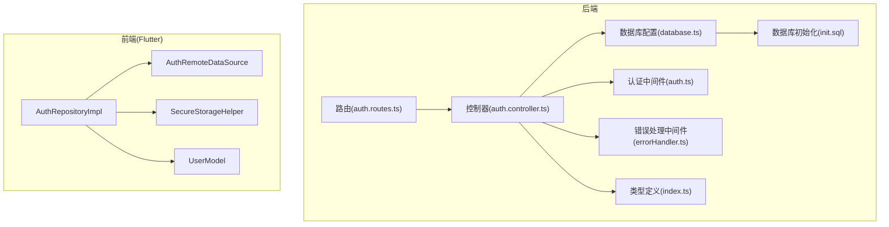
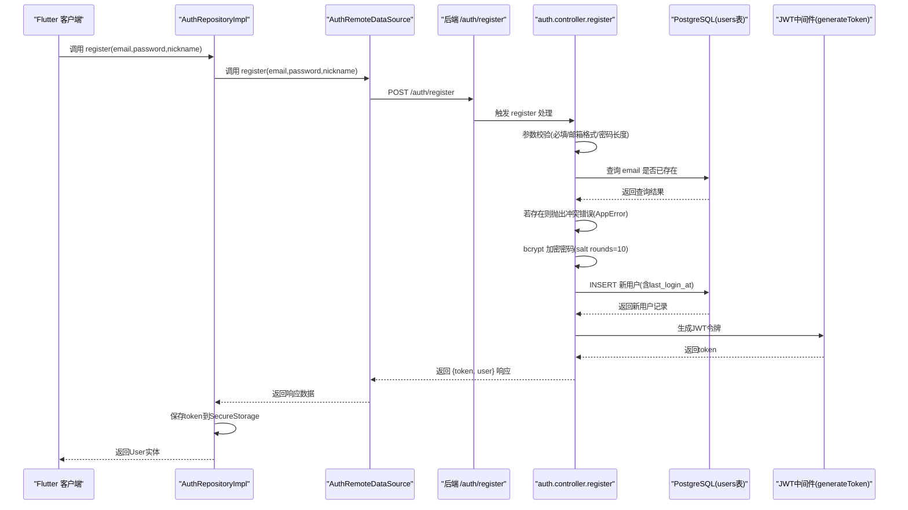
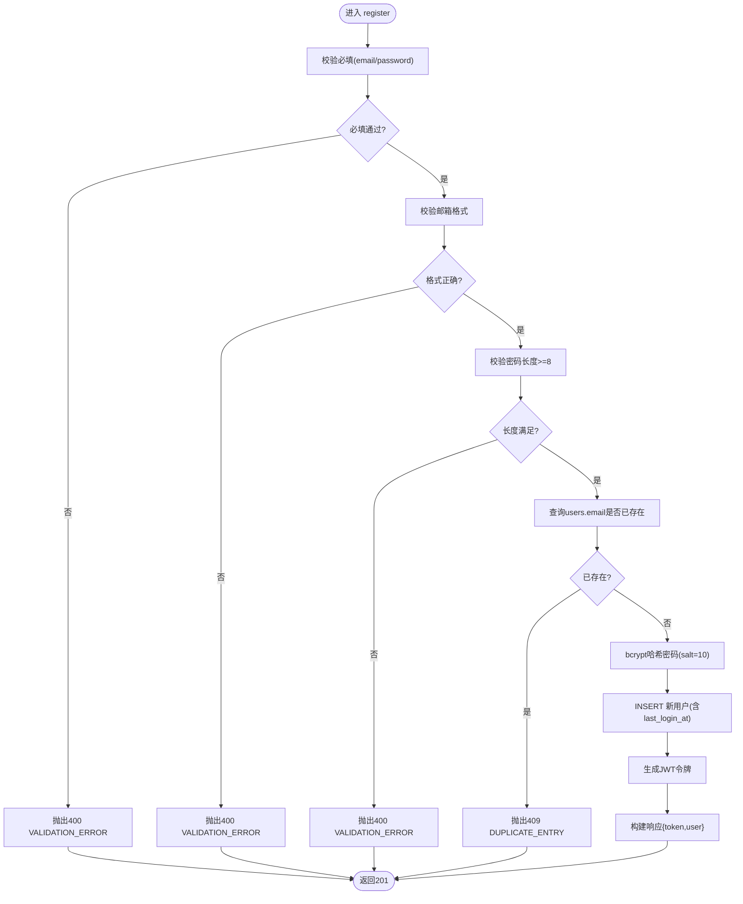
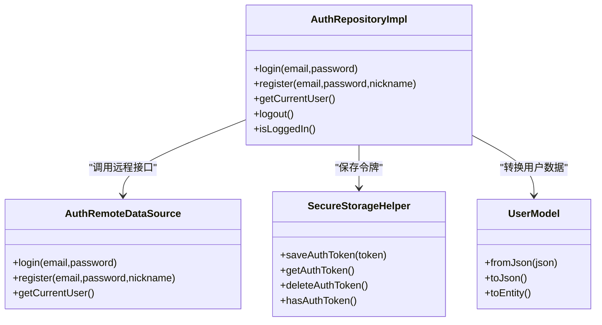
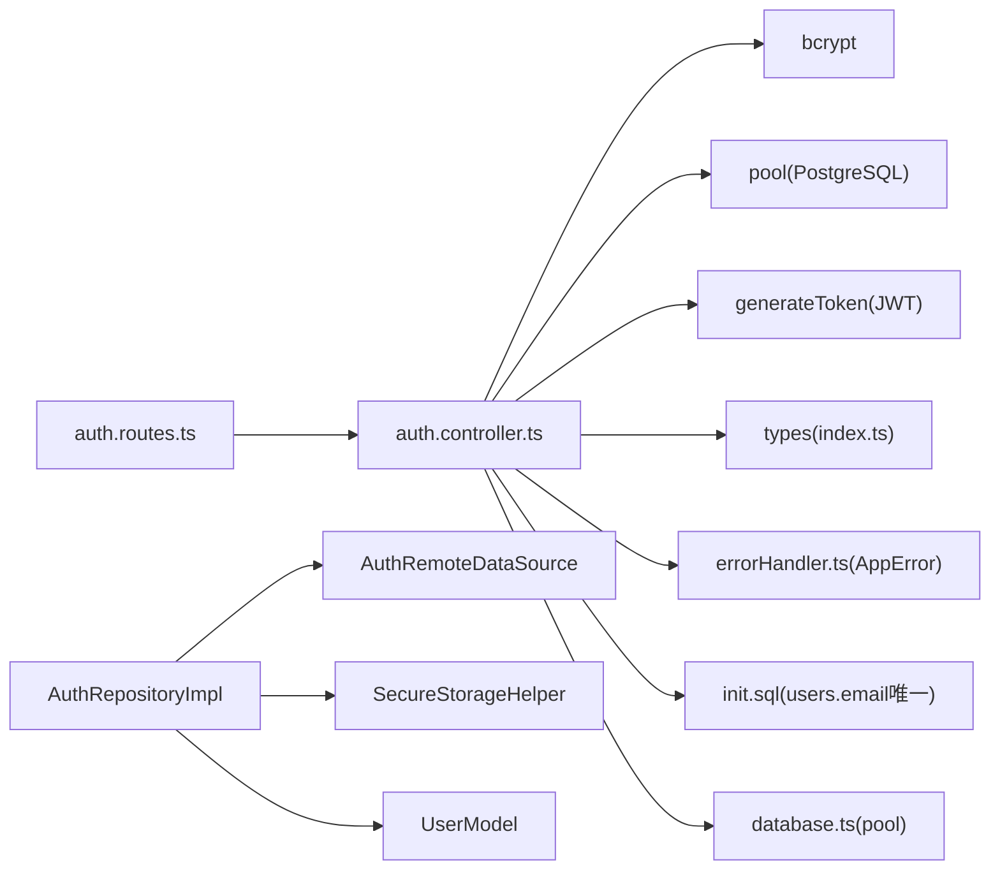

# 用户注册逻辑

<cite>
**本文引用的文件**
- [backend/src/controllers/auth.controller.ts](file://backend/src/controllers/auth.controller.ts)
- [backend/src/routes/auth.routes.ts](file://backend/src/routes/auth.routes.ts)
- [backend/src/middleware/auth.ts](file://backend/src/middleware/auth.ts)
- [backend/src/middleware/errorHandler.ts](file://backend/src/middleware/errorHandler.ts)
- [backend/src/config/database.ts](file://backend/src/config/database.ts)
- [backend/src/types/index.ts](file://backend/src/types/index.ts)
- [database/init.sql](file://database/init.sql)
- [flutter_app/lib/data/repositories/auth_repository_impl.dart](file://flutter_app/lib/data/repositories/auth_repository_impl.dart)
- [flutter_app/lib/data/datasources/remote/auth_remote_data_source.dart](file://flutter_app/lib/data/datasources/remote/auth_remote_data_source.dart)
- [flutter_app/lib/data/models/user_model.dart](file://flutter_app/lib/data/models/user_model.dart)
- [flutter_app/lib/core/storage/secure_storage_helper.dart](file://flutter_app/lib/core/storage/secure_storage_helper.dart)
</cite>

## 目录
1. [简介](#简介)
2. [项目结构](#项目结构)
3. [核心组件](#核心组件)
4. [架构总览](#架构总览)
5. [详细组件分析](#详细组件分析)
6. [依赖关系分析](#依赖关系分析)
7. [性能考量](#性能考量)
8. [故障排查指南](#故障排查指南)
9. [结论](#结论)
10. [附录](#附录)

## 简介
本文件围绕 nian 后端“用户注册”功能进行深入技术剖析，重点聚焦于后端控制器 auth.controller.ts 中 register 函数的完整执行流程。内容涵盖：
- 请求参数校验机制（邮箱格式、密码长度）
- 数据库唯一性检查（邮箱重复）
- Bcrypt 密码加密过程（salt rounds=10）
- 用户创建后的 JWT 令牌生成策略
- 响应数据结构设计原则（敏感信息过滤与脱敏）
- 结合 Flutter 客户端 AuthRepositoryImpl 的状态同步与本地存储机制
- 注册流程时序图
- 潜在安全风险（如邮箱枚举攻击）与防护建议（统一错误消息、速率限制）

## 项目结构
后端采用 Express + TypeScript 架构，注册流程涉及控制器、路由、中间件、数据库配置与类型定义；前端 Flutter 使用 Repository + Remote DataSource + Secure Storage 的分层设计。

图表来源
- [backend/src/routes/auth.routes.ts](file://backend/src/routes/auth.routes.ts#L1-L17)
- [backend/src/controllers/auth.controller.ts](file://backend/src/controllers/auth.controller.ts#L1-L68)
- [backend/src/middleware/auth.ts](file://backend/src/middleware/auth.ts#L1-L87)
- [backend/src/middleware/errorHandler.ts](file://backend/src/middleware/errorHandler.ts#L1-L97)
- [backend/src/config/database.ts](file://backend/src/config/database.ts#L1-L47)
- [backend/src/types/index.ts](file://backend/src/types/index.ts#L1-L126)
- [database/init.sql](file://database/init.sql#L1-L30)
- [flutter_app/lib/data/repositories/auth_repository_impl.dart](file://flutter_app/lib/data/repositories/auth_repository_impl.dart#L1-L114)
- [flutter_app/lib/data/datasources/remote/auth_remote_data_source.dart](file://flutter_app/lib/data/datasources/remote/auth_remote_data_source.dart#L1-L77)
- [flutter_app/lib/data/models/user_model.dart](file://flutter_app/lib/data/models/user_model.dart#L1-L44)
- [flutter_app/lib/core/storage/secure_storage_helper.dart](file://flutter_app/lib/core/storage/secure_storage_helper.dart#L1-L194)

章节来源
- [backend/src/routes/auth.routes.ts](file://backend/src/routes/auth.routes.ts#L1-L17)
- [backend/src/controllers/auth.controller.ts](file://backend/src/controllers/auth.controller.ts#L1-L68)
- [backend/src/config/database.ts](file://backend/src/config/database.ts#L1-L47)
- [database/init.sql](file://database/init.sql#L1-L30)
- [flutter_app/lib/data/repositories/auth_repository_impl.dart](file://flutter_app/lib/data/repositories/auth_repository_impl.dart#L1-L114)
- [flutter_app/lib/data/datasources/remote/auth_remote_data_source.dart](file://flutter_app/lib/data/datasources/remote/auth_remote_data_source.dart#L1-L77)
- [flutter_app/lib/core/storage/secure_storage_helper.dart](file://flutter_app/lib/core/storage/secure_storage_helper.dart#L1-L194)

## 核心组件
- 后端控制器 register：完成参数校验、唯一性检查、密码加密、用户创建、JWT 令牌生成与响应封装。
- 路由层：将 /auth/register 映射到 register 控制器。
- 中间件：认证中间件负责 JWT 解析与校验；错误处理中间件统一返回错误格式。
- 数据库：PostgreSQL 连接池与 Redis 客户端；users 表具备 email 唯一约束。
- 类型定义：User、UserWithPassword、ApiResponse 等接口规范。
- 前端仓库：AuthRepositoryImpl 调用远程数据源，保存令牌至安全存储，并将响应转换为领域实体。
- 前端数据源：AuthRemoteDataSource 发起 HTTP 请求，处理 Dio 异常并映射为业务异常。
- 前端模型与安全存储：UserModel 负责 JSON 序列化/反序列化；SecureStorageHelper 负责令牌持久化。

章节来源
- [backend/src/controllers/auth.controller.ts](file://backend/src/controllers/auth.controller.ts#L1-L68)
- [backend/src/routes/auth.routes.ts](file://backend/src/routes/auth.routes.ts#L1-L17)
- [backend/src/middleware/auth.ts](file://backend/src/middleware/auth.ts#L1-L87)
- [backend/src/middleware/errorHandler.ts](file://backend/src/middleware/errorHandler.ts#L1-L97)
- [backend/src/config/database.ts](file://backend/src/config/database.ts#L1-L47)
- [backend/src/types/index.ts](file://backend/src/types/index.ts#L1-L126)
- [flutter_app/lib/data/repositories/auth_repository_impl.dart](file://flutter_app/lib/data/repositories/auth_repository_impl.dart#L1-L114)
- [flutter_app/lib/data/datasources/remote/auth_remote_data_source.dart](file://flutter_app/lib/data/datasources/remote/auth_remote_data_source.dart#L1-L77)
- [flutter_app/lib/data/models/user_model.dart](file://flutter_app/lib/data/models/user_model.dart#L1-L44)
- [flutter_app/lib/core/storage/secure_storage_helper.dart](file://flutter_app/lib/core/storage/secure_storage_helper.dart#L1-L194)

## 架构总览
后端注册流程遵循“路由 -> 控制器 -> 数据库”的标准分层；前端通过 Repository 与 Remote DataSource 协作，使用 Secure Storage 保存令牌，形成完整的认证闭环。

图表来源
- [backend/src/routes/auth.routes.ts](file://backend/src/routes/auth.routes.ts#L1-L17)
- [backend/src/controllers/auth.controller.ts](file://backend/src/controllers/auth.controller.ts#L1-L68)
- [backend/src/middleware/auth.ts](file://backend/src/middleware/auth.ts#L80-L87)
- [backend/src/config/database.ts](file://backend/src/config/database.ts#L1-L47)
- [flutter_app/lib/data/repositories/auth_repository_impl.dart](file://flutter_app/lib/data/repositories/auth_repository_impl.dart#L49-L75)
- [flutter_app/lib/data/datasources/remote/auth_remote_data_source.dart](file://flutter_app/lib/data/datasources/remote/auth_remote_data_source.dart#L25-L44)
- [flutter_app/lib/core/storage/secure_storage_helper.dart](file://flutter_app/lib/core/storage/secure_storage_helper.dart#L104-L122)

## 详细组件分析

### 后端控制器 register 流程详解
- 输入参数校验
  - 必填字段：email、password 缺失时抛出 400 VALIDATION_ERROR。
  - 邮箱格式：使用正则表达式验证；不合法时抛出 400 VALIDATION_ERROR。
  - 密码长度：小于 8 字符时抛出 400 VALIDATION_ERROR。
- 唯一性检查
  - 通过数据库查询 users.email 是否已存在；若存在则抛出 409 DUPLICATE_ENTRY。
  - 数据库层面也通过 email 唯一约束保障一致性。
- 密码加密
  - 使用 bcrypt.hash(password, 10) 对明文密码进行哈希，盐轮数为 10。
- 用户创建
  - 执行 INSERT users，包含 email、password_hash、nickname、last_login_at；返回 id、email、nickname、avatar_url、created_at、is_active。
- JWT 令牌生成
  - 使用 generateToken(payload) 生成 JWT，默认过期时间由环境变量控制（未显式传参时默认 7 天）。
- 响应封装
  - 返回 201 成功，包含 success、message、data（token、user），其中 user 不包含 password_hash，避免敏感信息泄露。

图表来源
- [backend/src/controllers/auth.controller.ts](file://backend/src/controllers/auth.controller.ts#L1-L68)
- [database/init.sql](file://database/init.sql#L1-L30)

章节来源
- [backend/src/controllers/auth.controller.ts](file://backend/src/controllers/auth.controller.ts#L1-L68)
- [database/init.sql](file://database/init.sql#L1-L30)

### 响应数据结构设计原则
- 统一响应结构：success、message、data 或 error，便于前端一致处理。
- 敏感信息脱敏：返回的 user 对象不包含 password_hash，避免泄露。
- 错误结构：error.code 与 error.message 保持一致的错误语义，便于国际化与前端提示。

章节来源
- [backend/src/controllers/auth.controller.ts](file://backend/src/controllers/auth.controller.ts#L54-L67)
- [backend/src/middleware/errorHandler.ts](file://backend/src/middleware/errorHandler.ts#L1-L97)
- [backend/src/types/index.ts](file://backend/src/types/index.ts#L94-L102)

### 前端状态同步与本地存储
- AuthRepositoryImpl
  - 调用 AuthRemoteDataSource.register 发起注册请求。
  - 成功后从响应中提取 token 并调用 SecureStorageHelper.saveToken 持久化。
  - 将响应中的 user JSON 转换为 UserModel，再映射为领域 User 实体返回。
- AuthRemoteDataSource
  - 通过 DioClient.post 调用 /auth/register，封装 DioException 并映射为业务异常（ValidationException、ServerException、NetworkException 等）。
- SecureStorageHelper
  - 提供 saveAuthToken/getAuthToken/deleteAuthToken 等方法，统一管理令牌的读写与删除。

图表来源
- [flutter_app/lib/data/repositories/auth_repository_impl.dart](file://flutter_app/lib/data/repositories/auth_repository_impl.dart#L1-L114)
- [flutter_app/lib/data/datasources/remote/auth_remote_data_source.dart](file://flutter_app/lib/data/datasources/remote/auth_remote_data_source.dart#L1-L77)
- [flutter_app/lib/core/storage/secure_storage_helper.dart](file://flutter_app/lib/core/storage/secure_storage_helper.dart#L104-L122)
- [flutter_app/lib/data/models/user_model.dart](file://flutter_app/lib/data/models/user_model.dart#L1-L44)

章节来源
- [flutter_app/lib/data/repositories/auth_repository_impl.dart](file://flutter_app/lib/data/repositories/auth_repository_impl.dart#L49-L75)
- [flutter_app/lib/data/datasources/remote/auth_remote_data_source.dart](file://flutter_app/lib/data/datasources/remote/auth_remote_data_source.dart#L25-L44)
- [flutter_app/lib/core/storage/secure_storage_helper.dart](file://flutter_app/lib/core/storage/secure_storage_helper.dart#L104-L122)
- [flutter_app/lib/data/models/user_model.dart](file://flutter_app/lib/data/models/user_model.dart#L1-L44)

### 安全风险与防护建议
- 邮箱枚举攻击
  - 现状：后端在邮箱已存在时返回 409 DUPLICATE_ENTRY，可能被用于探测已注册邮箱。
  - 建议：
    - 统一错误消息：对邮箱已存在与参数校验错误使用相同 400 错误语义，隐藏邮箱是否已被注册的事实。
    - 速率限制：对 /auth/register 接口增加限流，防止暴力枚举。
    - 隐私设计：前端可提示“请稍后再试”，不暴露具体原因。
- 密码安全
  - 已使用 bcrypt 且 salt rounds=10，符合常见安全实践。
  - 建议：定期评估安全参数，必要时提升轮数或引入配额策略。
- JWT 安全
  - 建议：缩短过期时间、支持刷新令牌、服务端黑名单（如需）。
- 前端安全
  - 令牌仅存于 Secure Storage，避免明文存储；登出时清理令牌。

章节来源
- [backend/src/controllers/auth.controller.ts](file://backend/src/controllers/auth.controller.ts#L34-L36)
- [backend/src/middleware/auth.ts](file://backend/src/middleware/auth.ts#L80-L87)
- [flutter_app/lib/core/storage/secure_storage_helper.dart](file://flutter_app/lib/core/storage/secure_storage_helper.dart#L104-L122)

## 依赖关系分析
- 控制器依赖
  - bcrypt：密码加密
  - pool：数据库连接池
  - generateToken：JWT 生成
  - AppError：统一错误封装
  - User/UserWithPassword：类型约束
- 路由依赖
  - 将 /auth/register 映射到 register 控制器
- 中间件依赖
  - auth.ts：JWT 解析与生成
  - errorHandler.ts：统一错误处理
- 数据库依赖
  - users 表 email 唯一约束与索引
- 前端依赖
  - Repository 依赖 Remote DataSource 与 Secure Storage
  - Model 依赖 Domain Entity

图表来源
- [backend/src/controllers/auth.controller.ts](file://backend/src/controllers/auth.controller.ts#L1-L68)
- [backend/src/routes/auth.routes.ts](file://backend/src/routes/auth.routes.ts#L1-L17)
- [backend/src/middleware/auth.ts](file://backend/src/middleware/auth.ts#L80-L87)
- [backend/src/middleware/errorHandler.ts](file://backend/src/middleware/errorHandler.ts#L1-L97)
- [backend/src/config/database.ts](file://backend/src/config/database.ts#L1-L47)
- [backend/src/types/index.ts](file://backend/src/types/index.ts#L1-L126)
- [database/init.sql](file://database/init.sql#L1-L30)
- [flutter_app/lib/data/repositories/auth_repository_impl.dart](file://flutter_app/lib/data/repositories/auth_repository_impl.dart#L1-L114)
- [flutter_app/lib/data/datasources/remote/auth_remote_data_source.dart](file://flutter_app/lib/data/datasources/remote/auth_remote_data_source.dart#L1-L77)
- [flutter_app/lib/core/storage/secure_storage_helper.dart](file://flutter_app/lib/core/storage/secure_storage_helper.dart#L104-L122)
- [flutter_app/lib/data/models/user_model.dart](file://flutter_app/lib/data/models/user_model.dart#L1-L44)

章节来源
- [backend/src/controllers/auth.controller.ts](file://backend/src/controllers/auth.controller.ts#L1-L68)
- [backend/src/routes/auth.routes.ts](file://backend/src/routes/auth.routes.ts#L1-L17)
- [backend/src/middleware/auth.ts](file://backend/src/middleware/auth.ts#L80-L87)
- [backend/src/middleware/errorHandler.ts](file://backend/src/middleware/errorHandler.ts#L1-L97)
- [backend/src/config/database.ts](file://backend/src/config/database.ts#L1-L47)
- [backend/src/types/index.ts](file://backend/src/types/index.ts#L1-L126)
- [database/init.sql](file://database/init.sql#L1-L30)
- [flutter_app/lib/data/repositories/auth_repository_impl.dart](file://flutter_app/lib/data/repositories/auth_repository_impl.dart#L1-L114)
- [flutter_app/lib/data/datasources/remote/auth_remote_data_source.dart](file://flutter_app/lib/data/datasources/remote/auth_remote_data_source.dart#L1-L77)
- [flutter_app/lib/core/storage/secure_storage_helper.dart](file://flutter_app/lib/core/storage/secure_storage_helper.dart#L104-L122)
- [flutter_app/lib/data/models/user_model.dart](file://flutter_app/lib/data/models/user_model.dart#L1-L44)

## 性能考量
- 数据库查询
  - users.email 唯一索引可加速去重检查；建议在高并发场景下配合连接池参数优化。
- 密码哈希
  - bcrypt 10 轮在安全性与性能间取得平衡；可根据服务器负载调整。
- JWT 生成
  - 生成成本低，注意避免频繁刷新导致的额外开销。
- 前端
  - 令牌读写为本地操作，影响有限；建议在 UI 上提供加载反馈，避免重复提交。

[本节为通用指导，无需列出具体文件来源]

## 故障排查指南
- 常见错误与定位
  - 400 VALIDATION_ERROR：检查 email/password/nickname 是否缺失或格式不正确。
  - 409 DUPLICATE_ENTRY：确认邮箱是否已被注册；建议统一错误消息以避免枚举攻击。
  - 500 SERVER_ERROR：查看日志输出，定位数据库连接或查询异常。
- 前端异常映射
  - Dio 超时/网络错误映射为 NetworkException；后端 400/401 映射为 ValidationException/AuthenticationException。
- 令牌问题
  - 登录/注册成功后需确保 SecureStorageHelper.saveToken 正确写入；登出时清理令牌。

章节来源
- [backend/src/middleware/errorHandler.ts](file://backend/src/middleware/errorHandler.ts#L1-L97)
- [flutter_app/lib/data/datasources/remote/auth_remote_data_source.dart](file://flutter_app/lib/data/datasources/remote/auth_remote_data_source.dart#L56-L76)
- [flutter_app/lib/core/storage/secure_storage_helper.dart](file://flutter_app/lib/core/storage/secure_storage_helper.dart#L104-L122)

## 结论
后端 register 流程在参数校验、唯一性检查、密码加密与 JWT 生成方面实现了清晰的职责分离；前端通过 Repository/DataSource/Secure Storage 形成稳定的认证闭环。为进一步提升安全性，建议统一错误消息、增加速率限制、缩短令牌有效期并支持刷新令牌策略。

[本节为总结性内容，无需列出具体文件来源]

## 附录
- 关键实现路径参考
  - 注册控制器：[backend/src/controllers/auth.controller.ts](file://backend/src/controllers/auth.controller.ts#L1-L68)
  - 路由映射：[backend/src/routes/auth.routes.ts](file://backend/src/routes/auth.routes.ts#L1-L17)
  - JWT 生成：[backend/src/middleware/auth.ts](file://backend/src/middleware/auth.ts#L80-L87)
  - 错误处理：[backend/src/middleware/errorHandler.ts](file://backend/src/middleware/errorHandler.ts#L1-L97)
  - 数据库初始化(users 表)：[database/init.sql](file://database/init.sql#L1-L30)
  - 前端仓库：[flutter_app/lib/data/repositories/auth_repository_impl.dart](file://flutter_app/lib/data/repositories/auth_repository_impl.dart#L49-L75)
  - 前端数据源：[flutter_app/lib/data/datasources/remote/auth_remote_data_source.dart](file://flutter_app/lib/data/datasources/remote/auth_remote_data_source.dart#L25-L44)
  - 前端模型：[flutter_app/lib/data/models/user_model.dart](file://flutter_app/lib/data/models/user_model.dart#L1-L44)
  - 前端安全存储：[flutter_app/lib/core/storage/secure_storage_helper.dart](file://flutter_app/lib/core/storage/secure_storage_helper.dart#L104-L122)