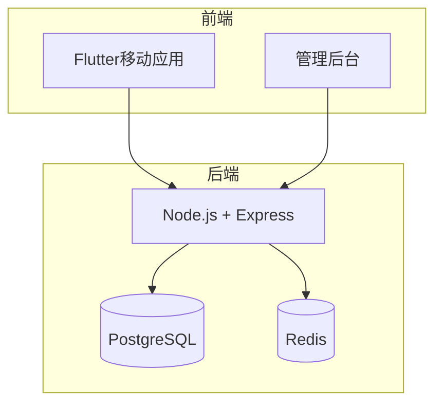
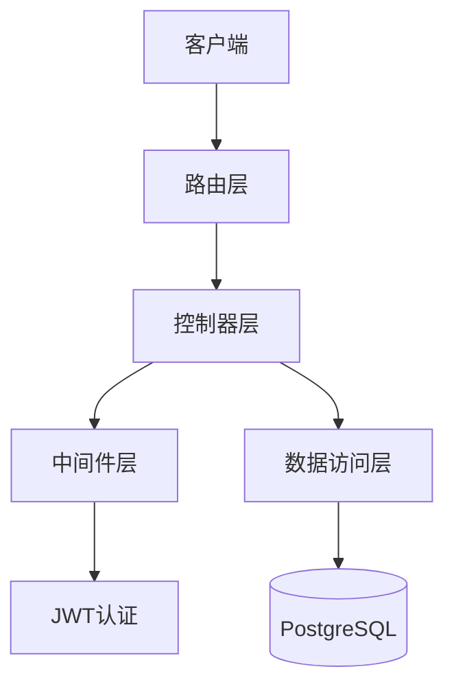
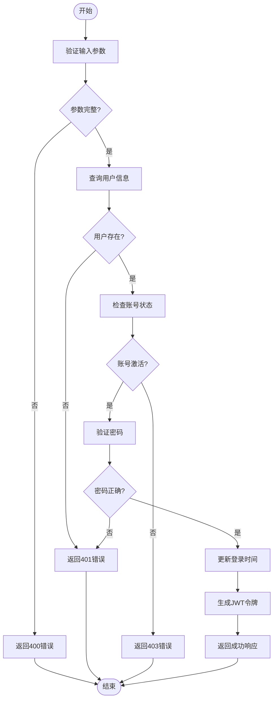
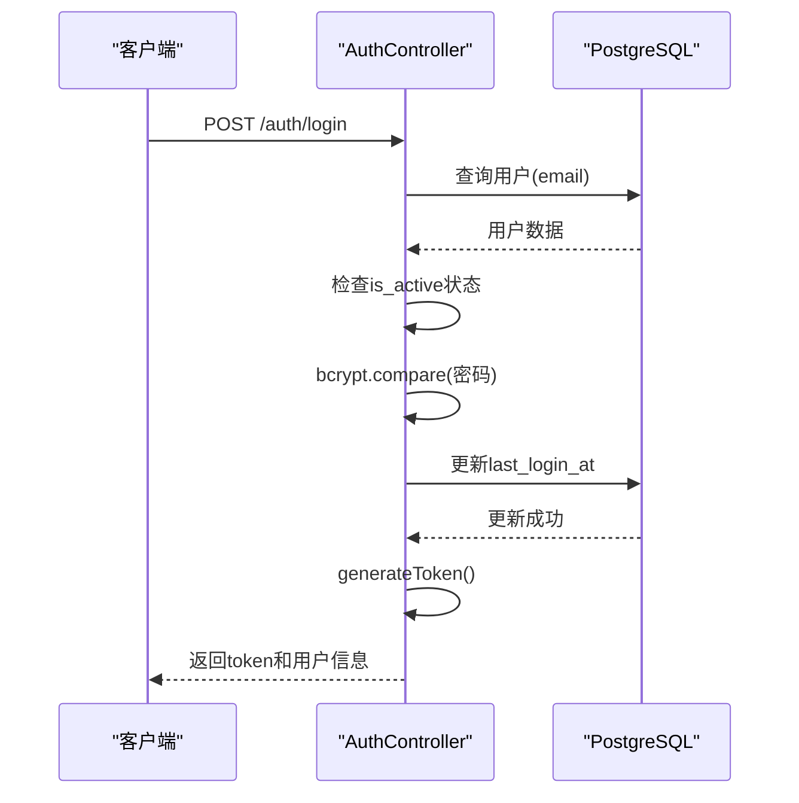
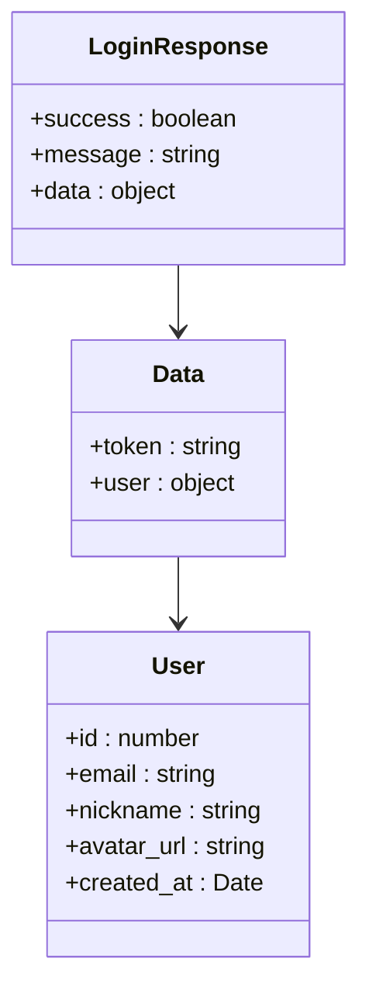
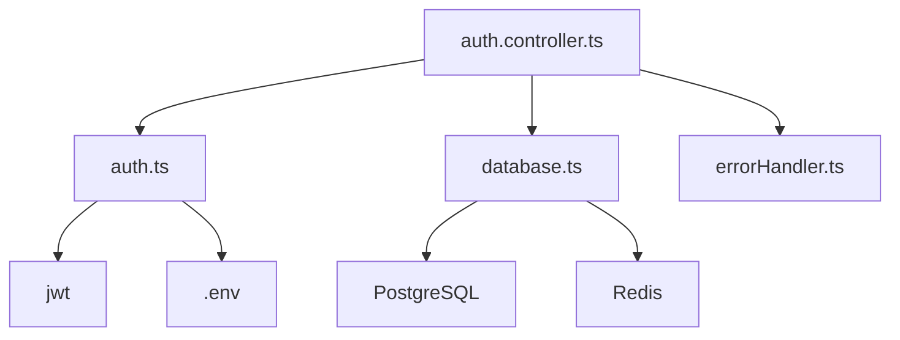

# 用户登录逻辑

<cite>
**本文档引用文件**   
- [auth.controller.ts](file://backend/src/controllers/auth.controller.ts)
- [auth.routes.ts](file://backend/src/routes/auth.routes.ts)
- [auth.ts](file://backend/src/middleware/auth.ts)
- [database.ts](file://backend/src/config/database.ts)
- [index.ts](file://backend/src/types/index.ts)
- [init.sql](file://database/init.sql)
- [Login.tsx](file://home/user/nian/admin-web/src/pages/Login.tsx)
- [login_page.dart](file://flutter_app/lib/presentation/auth/pages/login_page.dart)
- [auth_remote_data_source.dart](file://flutter_app/lib/data/datasources/remote/auth_remote_data_source.dart)
- [.env.example](file://.env.example)
</cite>

## 目录
1. [项目结构](#项目结构)
2. [核心组件](#核心组件)
3. [架构概述](#架构概述)
4. [详细组件分析](#详细组件分析)
5. [依赖分析](#依赖分析)
6. [性能考虑](#性能考虑)
7. [故障排除指南](#故障排除指南)
8. [结论](#结论)

## 项目结构

nian项目是一个全平台心理自助应用系统，包含后端服务、Flutter移动应用和管理后台三个主要部分。后端使用Node.js + Express框架，数据库采用PostgreSQL，前端移动应用使用Flutter框架，管理后台使用React + Ant Design。

**图示来源**
- [auth.controller.ts](file://backend/src/controllers/auth.controller.ts)
- [database.ts](file://backend/src/config/database.ts)
- [init.sql](file://database/init.sql)

**本节来源**
- [auth.controller.ts](file://backend/src/controllers/auth.controller.ts)
- [database.ts](file://backend/src/config/database.ts)

## 核心组件

用户登录功能的核心实现位于后端的`auth.controller.ts`文件中，主要包含登录、注册和获取当前用户信息三个接口。登录流程涉及凭证验证、密码比对、状态检查、数据库更新和JWT令牌签发等多个步骤。

**本节来源**
- [auth.controller.ts](file://backend/src/controllers/auth.controller.ts#L70-L125)
- [auth.routes.ts](file://backend/src/routes/auth.routes.ts#L11)

## 架构概述

用户登录功能的架构设计遵循分层模式，包含路由层、控制器层、中间件层和数据访问层。路由层负责请求分发，控制器层处理业务逻辑，中间件层提供认证和错误处理，数据访问层通过数据库连接池与PostgreSQL交互。

**图示来源**
- [auth.routes.ts](file://backend/src/routes/auth.routes.ts#L11)
- [auth.controller.ts](file://backend/src/controllers/auth.controller.ts#L70-L125)
- [auth.ts](file://backend/src/middleware/auth.ts#L79-L87)

## 详细组件分析

### 登录控制器分析

登录功能的实现遵循严格的验证流程，确保用户凭证的安全性和有效性。

#### 凭证验证流程

**图示来源**
- [auth.controller.ts](file://backend/src/controllers/auth.controller.ts#L70-L125)
- [database.ts](file://backend/src/config/database.ts#L5-L14)

**本节来源**
- [auth.controller.ts](file://backend/src/controllers/auth.controller.ts#L70-L125)
- [auth.routes.ts](file://backend/src/routes/auth.routes.ts#L11)

### 凭证验证步骤

登录功能的凭证验证包含多个安全检查步骤：

1. **邮箱查询**：通过`SELECT * FROM users WHERE email = $1`查询用户信息，确保邮箱存在
2. **账号激活状态检查**：验证`is_active`字段，防止禁用账号登录
3. **Bcrypt密码比对**：使用`bcrypt.compare()`方法安全比对密码哈希值

**图示来源**
- [auth.controller.ts](file://backend/src/controllers/auth.controller.ts#L78-L109)
- [auth.ts](file://backend/src/middleware/auth.ts#L79-L87)
- [init.sql](file://database/init.sql#L5-L13)

**本节来源**
- [auth.controller.ts](file://backend/src/controllers/auth.controller.ts#L78-L109)
- [init.sql](file://database/init.sql#L5-L13)

### 响应结构分析

登录成功后的响应结构设计遵循安全原则，避免返回敏感数据：

**图示来源**
- [auth.controller.ts](file://backend/src/controllers/auth.controller.ts#L111-L123)
- [index.ts](file://backend/src/types/index.ts#L4-L12)

**本节来源**
- [auth.controller.ts](file://backend/src/controllers/auth.controller.ts#L111-L123)
- [index.ts](file://backend/src/types/index.ts#L4-L12)

## 依赖分析

用户登录功能依赖多个核心模块和外部服务，形成完整的认证体系。

**图示来源**
- [auth.controller.ts](file://backend/src/controllers/auth.controller.ts#L1-L6)
- [auth.ts](file://backend/src/middleware/auth.ts#L1-L6)
- [database.ts](file://backend/src/config/database.ts#L1-L14)

**本节来源**
- [auth.controller.ts](file://backend/src/controllers/auth.controller.ts#L1-L6)
- [auth.ts](file://backend/src/middleware/auth.ts#L1-L6)
- [database.ts](file://backend/src/config/database.ts#L1-L14)

## 性能考虑

用户登录功能在性能方面进行了多项优化：

1. **数据库索引**：在users表的email字段上创建了索引，加速查询性能
2. **连接池**：使用PostgreSQL连接池，避免频繁创建和销毁数据库连接
3. **异步处理**：所有数据库操作和密码比对都采用异步方式，避免阻塞事件循环

## 故障排除指南

### 常见登录问题及解决方案

| 问题类型 | 错误代码 | 解决方案 |
|---------|---------|---------|
| 邮箱或密码错误 | AUTH_FAILED | 检查输入凭证，确认邮箱注册状态 |
| 账号被禁用 | PERMISSION_DENIED | 联系管理员激活账号 |
| 输入验证失败 | VALIDATION_ERROR | 确认邮箱格式和密码长度要求 |
| 服务器错误 | SERVER_ERROR | 检查后端服务状态和数据库连接 |

**本节来源**
- [auth.controller.ts](file://backend/src/controllers/auth.controller.ts#L74-L99)
- [errorHandler.ts](file://backend/src/middleware/errorHandler.ts#L4-L13)

## 结论

nian项目的用户登录功能实现了安全、高效的认证机制。通过多层验证确保凭证安全，使用Bcrypt加密算法保护密码，JWT令牌实现无状态认证。响应结构设计遵循最小权限原则，不返回敏感信息。前后端分离架构使得移动应用和管理后台可以共享同一套认证体系，提高了系统的可维护性和扩展性。