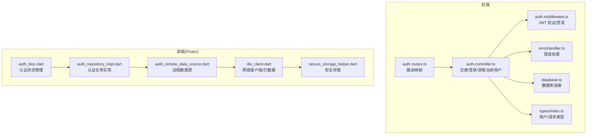
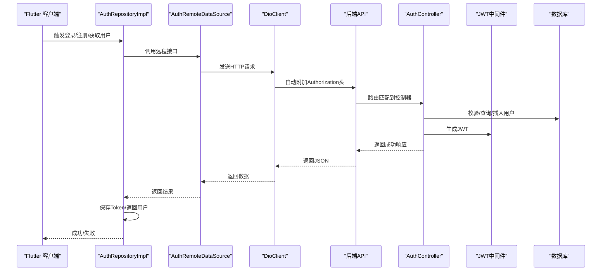
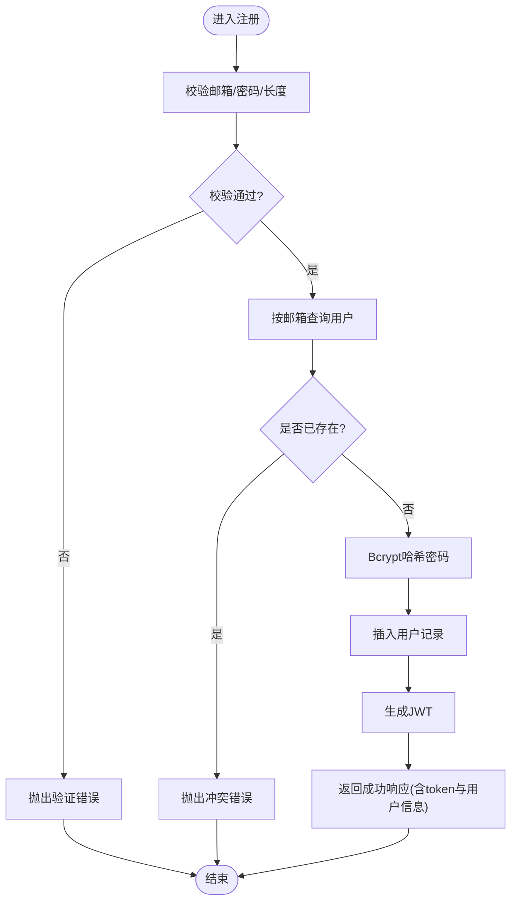
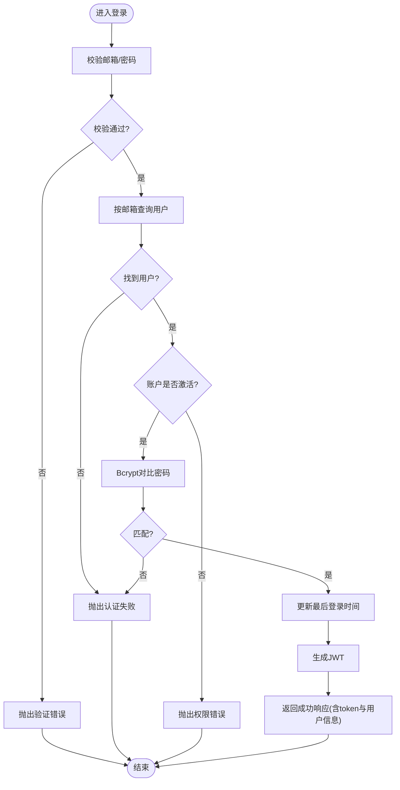
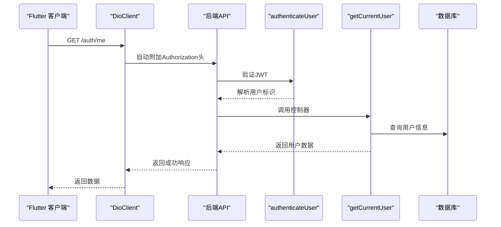
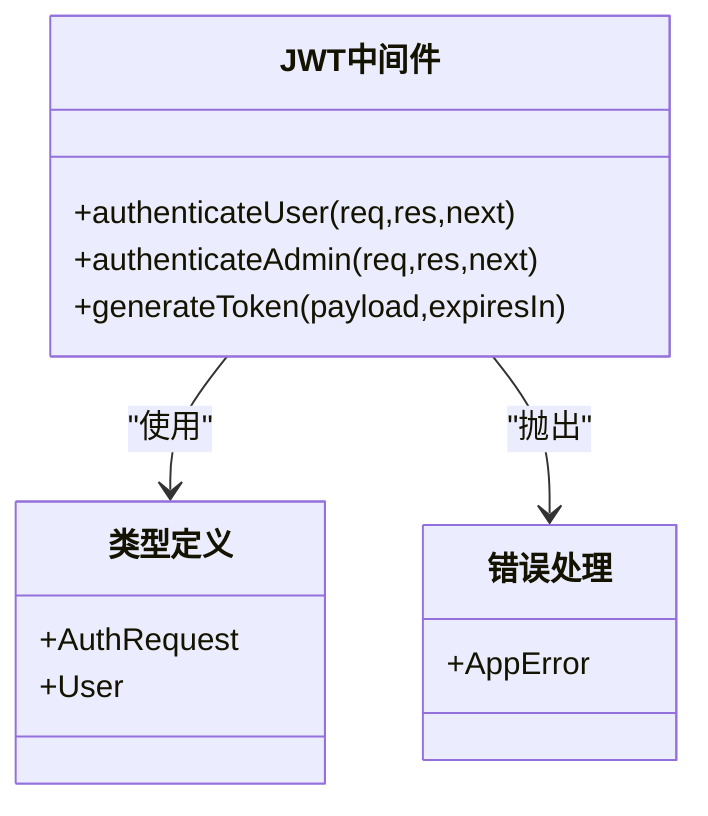
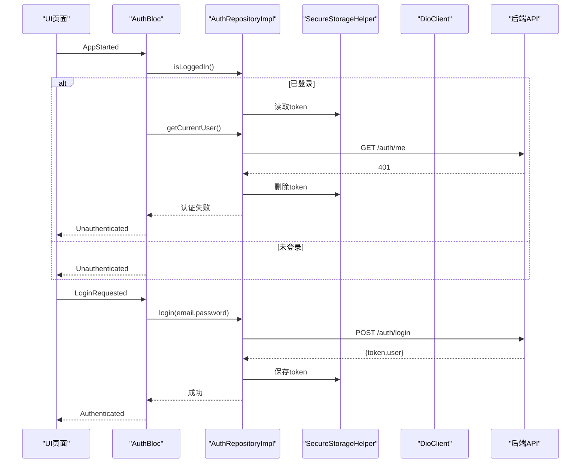
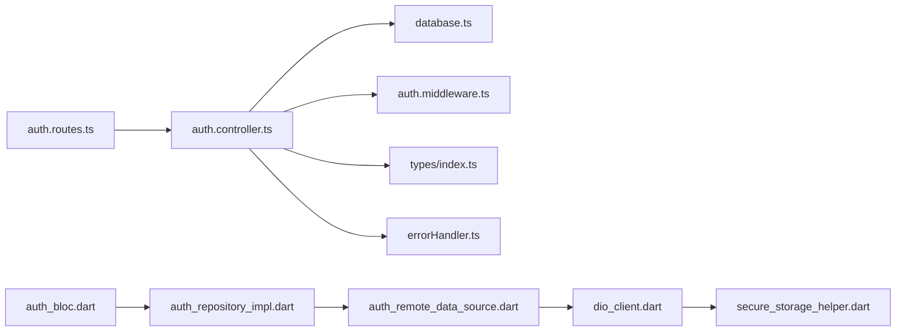

# 认证业务逻辑

<cite>
**本文引用的文件**
- [backend/src/controllers/auth.controller.ts](file://backend/src/controllers/auth.controller.ts)
- [backend/src/middleware/auth.ts](file://backend/src/middleware/auth.ts)
- [backend/src/routes/auth.routes.ts](file://backend/src/routes/auth.routes.ts)
- [backend/src/types/index.ts](file://backend/src/types/index.ts)
- [backend/src/middleware/errorHandler.ts](file://backend/src/middleware/errorHandler.ts)
- [backend/src/config/database.ts](file://backend/src/config/database.ts)
- [flutter_app/lib/data/repositories/auth_repository_impl.dart](file://flutter_app/lib/data/repositories/auth_repository_impl.dart)
- [flutter_app/lib/data/datasources/remote/auth_remote_data_source.dart](file://flutter_app/lib/data/datasources/remote/auth_remote_data_source.dart)
- [flutter_app/lib/core/storage/secure_storage_helper.dart](file://flutter_app/lib/core/storage/secure_storage_helper.dart)
- [flutter_app/lib/core/network/dio_client.dart](file://flutter_app/lib/core/network/dio_client.dart)
- [flutter_app/lib/presentation/auth/bloc/auth_bloc.dart](file://flutter_app/lib/presentation/auth/bloc/auth_bloc.dart)
- [.env.example](file://.env.example)
- [docs/QUALITY_REPORT.md](file://docs/QUALITY_REPORT.md)
</cite>

## 目录
1. [简介](#简介)
2. [项目结构](#项目结构)
3. [核心组件](#核心组件)
4. [架构总览](#架构总览)
5. [详细组件分析](#详细组件分析)
6. [依赖关系分析](#依赖关系分析)
7. [性能考量](#性能考量)
8. [故障排查指南](#故障排查指南)
9. [结论](#结论)
10. [附录](#附录)

## 简介
本文件深入解析 nian 后端认证模块的业务逻辑，围绕用户注册、登录、JWT 令牌生成与验证、以及“获取当前用户信息”的权限控制与数据脱敏策略展开。同时结合 Flutter 客户端的 AuthRepositoryImpl 实现，说明前后端认证状态同步机制，并提供认证流程时序图、潜在安全风险与防护建议（如速率限制、Token 刷新机制）。

## 项目结构
认证相关代码主要分布在后端控制器、中间件、路由与类型定义，以及 Flutter 客户端的数据层、存储层与网络层。

图表来源
- [backend/src/controllers/auth.controller.ts](file://backend/src/controllers/auth.controller.ts#L1-L150)
- [backend/src/middleware/auth.ts](file://backend/src/middleware/auth.ts#L1-L87)
- [backend/src/routes/auth.routes.ts](file://backend/src/routes/auth.routes.ts#L1-L17)
- [backend/src/types/index.ts](file://backend/src/types/index.ts#L1-L126)
- [backend/src/middleware/errorHandler.ts](file://backend/src/middleware/errorHandler.ts#L1-L97)
- [backend/src/config/database.ts](file://backend/src/config/database.ts#L1-L47)
- [flutter_app/lib/data/datasources/remote/auth_remote_data_source.dart](file://flutter_app/lib/data/datasources/remote/auth_remote_data_source.dart#L1-L77)
- [flutter_app/lib/data/repositories/auth_repository_impl.dart](file://flutter_app/lib/data/repositories/auth_repository_impl.dart#L1-L114)
- [flutter_app/lib/core/network/dio_client.dart](file://flutter_app/lib/core/network/dio_client.dart#L1-L262)
- [flutter_app/lib/core/storage/secure_storage_helper.dart](file://flutter_app/lib/core/storage/secure_storage_helper.dart#L1-L194)
- [flutter_app/lib/presentation/auth/bloc/auth_bloc.dart](file://flutter_app/lib/presentation/auth/bloc/auth_bloc.dart#L1-L82)

章节来源
- [backend/src/controllers/auth.controller.ts](file://backend/src/controllers/auth.controller.ts#L1-L150)
- [backend/src/middleware/auth.ts](file://backend/src/middleware/auth.ts#L1-L87)
- [backend/src/routes/auth.routes.ts](file://backend/src/routes/auth.routes.ts#L1-L17)
- [backend/src/types/index.ts](file://backend/src/types/index.ts#L1-L126)
- [backend/src/middleware/errorHandler.ts](file://backend/src/middleware/errorHandler.ts#L1-L97)
- [backend/src/config/database.ts](file://backend/src/config/database.ts#L1-L47)
- [flutter_app/lib/data/datasources/remote/auth_remote_data_source.dart](file://flutter_app/lib/data/datasources/remote/auth_remote_data_source.dart#L1-L77)
- [flutter_app/lib/data/repositories/auth_repository_impl.dart](file://flutter_app/lib/data/repositories/auth_repository_impl.dart#L1-L114)
- [flutter_app/lib/core/network/dio_client.dart](file://flutter_app/lib/core/network/dio_client.dart#L1-L262)
- [flutter_app/lib/core/storage/secure_storage_helper.dart](file://flutter_app/lib/core/storage/secure_storage_helper.dart#L1-L194)
- [flutter_app/lib/presentation/auth/bloc/auth_bloc.dart](file://flutter_app/lib/presentation/auth/bloc/auth_bloc.dart#L1-L82)

## 核心组件
- 注册接口：输入校验（邮箱格式、密码长度）、重复邮箱检查、Bcrypt 密码哈希、创建用户、签发 JWT 并返回用户信息。
- 登录接口：输入校验、按邮箱查询用户、账户激活状态检查、Bcrypt 密码比对、更新最后登录时间、签发 JWT 并返回用户信息。
- 获取当前用户信息接口：基于认证中间件的用户标识，查询用户并返回脱敏后的字段。
- JWT 中间件：从 Authorization 头提取 Bearer Token，使用密钥验证并解码；签发 JWT 使用可配置过期时间。
- 错误处理：统一 AppError 类型化错误，标准化响应结构。
- 前端认证状态同步：通过 Dio 拦截器自动附加 Authorization 头，401 时清理本地 Token；仓库实现负责保存/读取 Token，BLoC 在应用启动时尝试恢复认证状态。

章节来源
- [backend/src/controllers/auth.controller.ts](file://backend/src/controllers/auth.controller.ts#L1-L150)
- [backend/src/middleware/auth.ts](file://backend/src/middleware/auth.ts#L1-L87)
- [backend/src/middleware/errorHandler.ts](file://backend/src/middleware/errorHandler.ts#L1-L97)
- [flutter_app/lib/data/repositories/auth_repository_impl.dart](file://flutter_app/lib/data/repositories/auth_repository_impl.dart#L1-L114)
- [flutter_app/lib/core/network/dio_client.dart](file://flutter_app/lib/core/network/dio_client.dart#L1-L262)

## 架构总览
后端采用 Express + PostgreSQL + Redis 的组合，认证流程由控制器处理业务，中间件负责 JWT 验证与签发，路由将 HTTP 请求映射到控制器方法。前端通过 Dio 客户端统一发送请求，拦截器自动携带 Token，异常时进行统一处理与状态清理。

图表来源
- [backend/src/controllers/auth.controller.ts](file://backend/src/controllers/auth.controller.ts#L1-L150)
- [backend/src/middleware/auth.ts](file://backend/src/middleware/auth.ts#L1-L87)
- [backend/src/routes/auth.routes.ts](file://backend/src/routes/auth.routes.ts#L1-L17)
- [flutter_app/lib/data/datasources/remote/auth_remote_data_source.dart](file://flutter_app/lib/data/datasources/remote/auth_remote_data_source.dart#L1-L77)
- [flutter_app/lib/data/repositories/auth_repository_impl.dart](file://flutter_app/lib/data/repositories/auth_repository_impl.dart#L1-L114)
- [flutter_app/lib/core/network/dio_client.dart](file://flutter_app/lib/core/network/dio_client.dart#L1-L262)

## 详细组件分析

### 注册流程（auth.controller.ts）
- 输入校验：要求邮箱与密码非空；邮箱格式校验；密码长度至少 8。
- 去重检查：按邮箱查询用户，若存在则抛出冲突错误。
- 密码加密：使用 Bcrypt 对明文密码进行哈希（固定轮数）。
- 用户创建：插入用户记录，包含邮箱、哈希密码、昵称、最后登录时间等。
- Token 签发：调用中间件生成 JWT，返回给客户端。
- 响应结构：统一 success 字段与 data 结构，包含 token 与用户基本信息。

图表来源
- [backend/src/controllers/auth.controller.ts](file://backend/src/controllers/auth.controller.ts#L1-L68)

章节来源
- [backend/src/controllers/auth.controller.ts](file://backend/src/controllers/auth.controller.ts#L1-L68)

### 登录流程（auth.controller.ts）
- 输入校验：邮箱与密码必填。
- 查询用户：按邮箱查询用户记录。
- 账户状态：检查 is_active 是否为真，否则拒绝访问。
- 密码验证：使用 Bcrypt.compare 对比哈希值。
- 更新登录时间：记录最后登录时间。
- Token 签发：生成 JWT 并返回。
- 响应结构：统一 success 字段与 data 结构，包含 token 与用户基本信息。

图表来源
- [backend/src/controllers/auth.controller.ts](file://backend/src/controllers/auth.controller.ts#L70-L125)

章节来源
- [backend/src/controllers/auth.controller.ts](file://backend/src/controllers/auth.controller.ts#L70-L125)

### 获取当前用户信息（auth.controller.ts）
- 权限控制：依赖 authenticateUser 中间件，从 Authorization 头中提取并验证 JWT，将用户标识注入请求对象。
- 数据查询：按用户 ID 查询用户信息。
- 数据脱敏：返回字段包含 id、email、nickname、avatar_url、created_at、last_login_at、is_active，未包含敏感字段（如 password_hash）。
- 响应结构：统一 success 字段与 data 结构。

图表来源
- [backend/src/controllers/auth.controller.ts](file://backend/src/controllers/auth.controller.ts#L127-L149)
- [backend/src/middleware/auth.ts](file://backend/src/middleware/auth.ts#L1-L33)
- [backend/src/routes/auth.routes.ts](file://backend/src/routes/auth.routes.ts#L1-L17)

章节来源
- [backend/src/controllers/auth.controller.ts](file://backend/src/controllers/auth.controller.ts#L127-L149)
- [backend/src/middleware/auth.ts](file://backend/src/middleware/auth.ts#L1-L33)
- [backend/src/routes/auth.routes.ts](file://backend/src/routes/auth.routes.ts#L1-L17)

### JWT 生成与验证（middleware/auth.ts）
- 生成：使用 jsonwebtoken.sign，载荷为 { id, email }，密钥来自环境变量，过期时间可配置。
- 验证：从 Authorization 头解析 Bearer Token，使用相同密钥验证；成功则将用户信息注入请求对象，失败则抛出 401 错误。
- 管理员中间件：额外校验 isAdmin 标记，仅管理员可用。

图表来源
- [backend/src/middleware/auth.ts](file://backend/src/middleware/auth.ts#L1-L87)
- [backend/src/types/index.ts](file://backend/src/types/index.ts#L80-L91)
- [backend/src/middleware/errorHandler.ts](file://backend/src/middleware/errorHandler.ts#L1-L97)

章节来源
- [backend/src/middleware/auth.ts](file://backend/src/middleware/auth.ts#L1-L87)
- [backend/src/types/index.ts](file://backend/src/types/index.ts#L80-L91)
- [backend/src/middleware/errorHandler.ts](file://backend/src/middleware/errorHandler.ts#L1-L97)

### 前后端认证状态同步（Flutter）
- Dio 拦截器：在请求前从安全存储读取 token 并附加到 Authorization 头；当收到 401 时自动清理 token。
- 安全存储：封装 FlutterSecureStorage，提供保存/读取/删除/清空等方法，键名包含 auth_token、refresh_token 等。
- 认证仓库：登录/注册成功后保存 token；获取用户信息失败且 401 时清理 token；登出时删除 token；判断是否已登录。
- BLoC：应用启动时检查是否已登录，若已登录则拉取用户信息以恢复认证状态。

图表来源
- [flutter_app/lib/presentation/auth/bloc/auth_bloc.dart](file://flutter_app/lib/presentation/auth/bloc/auth_bloc.dart#L1-L82)
- [flutter_app/lib/data/repositories/auth_repository_impl.dart](file://flutter_app/lib/data/repositories/auth_repository_impl.dart#L1-L114)
- [flutter_app/lib/core/storage/secure_storage_helper.dart](file://flutter_app/lib/core/storage/secure_storage_helper.dart#L1-L194)
- [flutter_app/lib/core/network/dio_client.dart](file://flutter_app/lib/core/network/dio_client.dart#L1-L262)

章节来源
- [flutter_app/lib/presentation/auth/bloc/auth_bloc.dart](file://flutter_app/lib/presentation/auth/bloc/auth_bloc.dart#L1-L82)
- [flutter_app/lib/data/repositories/auth_repository_impl.dart](file://flutter_app/lib/data/repositories/auth_repository_impl.dart#L1-L114)
- [flutter_app/lib/core/storage/secure_storage_helper.dart](file://flutter_app/lib/core/storage/secure_storage_helper.dart#L1-L194)
- [flutter_app/lib/core/network/dio_client.dart](file://flutter_app/lib/core/network/dio_client.dart#L1-L262)

## 依赖关系分析
- 控制器依赖：
  - 数据库连接：PostgreSQL 连接池与 Redis 客户端初始化。
  - JWT 中间件：用于签发与验证。
  - 错误处理：统一错误类型化处理。
- 路由依赖：将 /auth/register、/auth/login、/auth/me 映射到对应控制器方法。
- 类型定义：User、UserWithPassword、AuthRequest 等，确保请求与响应结构一致。
- 前端依赖：
  - Dio 客户端：统一请求配置与拦截器。
  - 安全存储：持久化 token。
  - 仓库与 BLoC：协调认证状态与 UI 行为。

图表来源
- [backend/src/routes/auth.routes.ts](file://backend/src/routes/auth.routes.ts#L1-L17)
- [backend/src/controllers/auth.controller.ts](file://backend/src/controllers/auth.controller.ts#L1-L150)
- [backend/src/config/database.ts](file://backend/src/config/database.ts#L1-L47)
- [backend/src/middleware/auth.ts](file://backend/src/middleware/auth.ts#L1-L87)
- [backend/src/types/index.ts](file://backend/src/types/index.ts#L1-L126)
- [backend/src/middleware/errorHandler.ts](file://backend/src/middleware/errorHandler.ts#L1-L97)
- [flutter_app/lib/presentation/auth/bloc/auth_bloc.dart](file://flutter_app/lib/presentation/auth/bloc/auth_bloc.dart#L1-L82)
- [flutter_app/lib/data/repositories/auth_repository_impl.dart](file://flutter_app/lib/data/repositories/auth_repository_impl.dart#L1-L114)
- [flutter_app/lib/data/datasources/remote/auth_remote_data_source.dart](file://flutter_app/lib/data/datasources/remote/auth_remote_data_source.dart#L1-L77)
- [flutter_app/lib/core/network/dio_client.dart](file://flutter_app/lib/core/network/dio_client.dart#L1-L262)
- [flutter_app/lib/core/storage/secure_storage_helper.dart](file://flutter_app/lib/core/storage/secure_storage_helper.dart#L1-L194)

章节来源
- [backend/src/routes/auth.routes.ts](file://backend/src/routes/auth.routes.ts#L1-L17)
- [backend/src/controllers/auth.controller.ts](file://backend/src/controllers/auth.controller.ts#L1-L150)
- [backend/src/config/database.ts](file://backend/src/config/database.ts#L1-L47)
- [backend/src/middleware/auth.ts](file://backend/src/middleware/auth.ts#L1-L87)
- [backend/src/types/index.ts](file://backend/src/types/index.ts#L1-L126)
- [backend/src/middleware/errorHandler.ts](file://backend/src/middleware/errorHandler.ts#L1-L97)
- [flutter_app/lib/presentation/auth/bloc/auth_bloc.dart](file://flutter_app/lib/presentation/auth/bloc/auth_bloc.dart#L1-L82)
- [flutter_app/lib/data/repositories/auth_repository_impl.dart](file://flutter_app/lib/data/repositories/auth_repository_impl.dart#L1-L114)
- [flutter_app/lib/data/datasources/remote/auth_remote_data_source.dart](file://flutter_app/lib/data/datasources/remote/auth_remote_data_source.dart#L1-L77)
- [flutter_app/lib/core/network/dio_client.dart](file://flutter_app/lib/core/network/dio_client.dart#L1-L262)
- [flutter_app/lib/core/storage/secure_storage_helper.dart](file://flutter_app/lib/core/storage/secure_storage_helper.dart#L1-L194)

## 性能考量
- 密码哈希成本：Bcrypt 轮数固定，影响注册/登录耗时，需根据硬件能力权衡安全性与性能。
- 数据库连接池：PostgreSQL 连接池大小与超时配置影响并发处理能力。
- Redis：可用于缓存热点数据、会话存储或速率限制计数器，减少数据库压力。
- 响应时间：JWT 验证为内存计算，通常开销较小；I/O 主要集中在数据库查询与写入。

章节来源
- [backend/src/controllers/auth.controller.ts](file://backend/src/controllers/auth.controller.ts#L1-L150)
- [backend/src/config/database.ts](file://backend/src/config/database.ts#L1-L47)

## 故障排查指南
- 400 验证错误：检查邮箱格式与密码长度是否满足要求。
- 401 认证失败：确认 Authorization 头是否正确携带 Bearer Token；检查 JWT 是否过期或被篡改。
- 403 权限拒绝：账户未激活或管理员权限不足。
- 409 冲突：邮箱已被注册。
- 500 服务器错误：查看后端日志定位具体异常。
- 前端 401：Dio 拦截器会自动清理本地 token，确保后续请求不再携带无效 token。

章节来源
- [backend/src/middleware/errorHandler.ts](file://backend/src/middleware/errorHandler.ts#L1-L97)
- [backend/src/controllers/auth.controller.ts](file://backend/src/controllers/auth.controller.ts#L1-L150)
- [flutter_app/lib/core/network/dio_client.dart](file://flutter_app/lib/core/network/dio_client.dart#L1-L262)

## 结论
该认证模块实现了标准的注册、登录与 JWT 令牌管理流程，具备基本的输入校验、密码加密与权限控制。前端通过拦截器与安全存储实现了认证状态的自动同步与清理。为进一步提升安全性与用户体验，建议引入速率限制、Token 刷新机制与更完善的日志与监控体系。

## 附录

### 环境变量与默认配置
- JWT_SECRET：JWT 密钥，建议至少 32 位。
- JWT_EXPIRES_IN：Token 过期时间，默认 7 天。
- 数据库与 Redis：主机、端口、连接池参数。

章节来源
- [.env.example](file://.env.example#L1-L60)

### 安全风险与防护建议
- 暴力破解风险：建议在后端实现速率限制（如每 IP 每分钟最多尝试次数），并在前端进行输入防抖与验证码。
- Token 泄露：建议缩短过期时间并引入刷新 Token 机制；在移动端启用生物识别与安全存储。
- 网络传输：生产环境必须启用 HTTPS，避免明文传输。
- 日志与监控：记录认证相关事件并设置告警阈值，及时发现异常行为。

章节来源
- [docs/QUALITY_REPORT.md](file://docs/QUALITY_REPORT.md#L394-L466)
- [backend/src/middleware/auth.ts](file://backend/src/middleware/auth.ts#L1-L87)