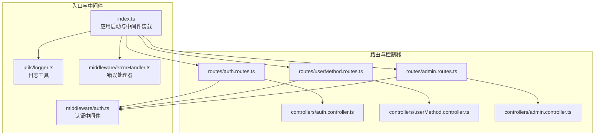
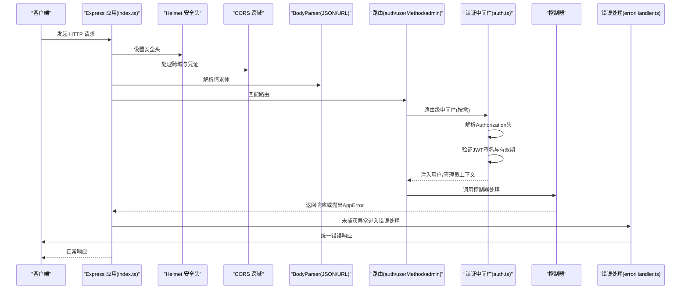
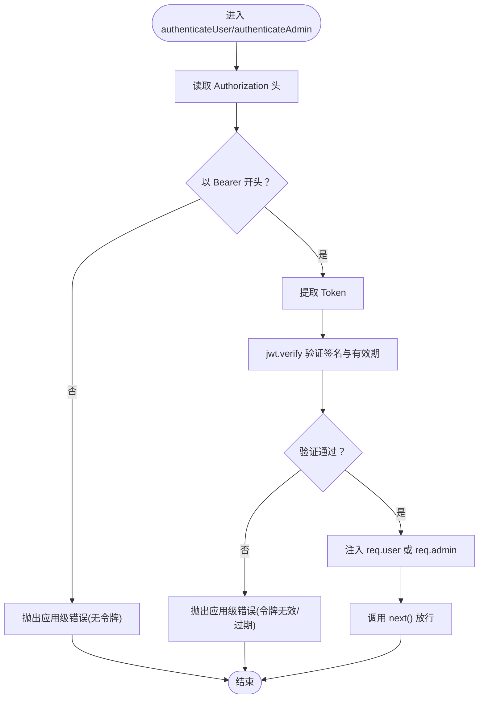
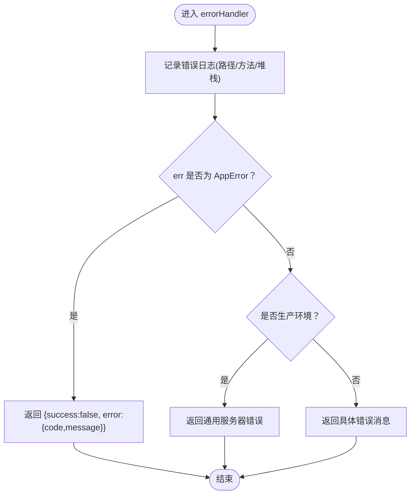
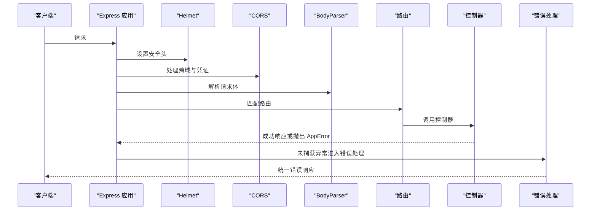
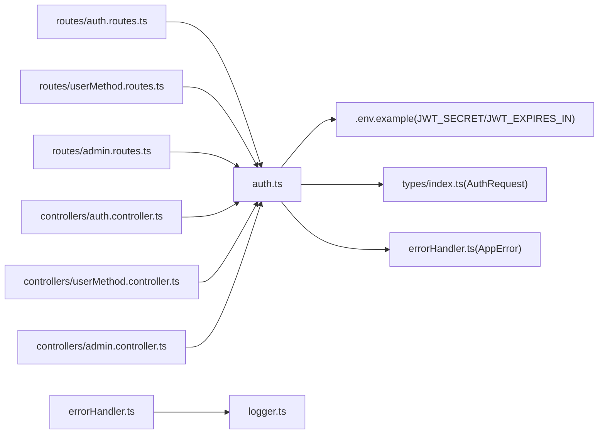

# 中间件

<cite>
**本文引用的文件**
- [backend/src/index.ts](file://backend/src/index.ts)
- [backend/src/middleware/auth.ts](file://backend/src/middleware/auth.ts)
- [backend/src/middleware/errorHandler.ts](file://backend/src/middleware/errorHandler.ts)
- [backend/src/utils/logger.ts](file://backend/src/utils/logger.ts)
- [backend/src/types/index.ts](file://backend/src/types/index.ts)
- [backend/src/controllers/auth.controller.ts](file://backend/src/controllers/auth.controller.ts)
- [backend/src/controllers/userMethod.controller.ts](file://backend/src/controllers/userMethod.controller.ts)
- [backend/src/controllers/admin.controller.ts](file://backend/src/controllers/admin.controller.ts)
- [backend/src/routes/auth.routes.ts](file://backend/src/routes/auth.routes.ts)
- [backend/src/routes/userMethod.routes.ts](file://backend/src/routes/userMethod.routes.ts)
- [backend/src/routes/admin.routes.ts](file://backend/src/routes/admin.routes.ts)
- [.env.example](file://.env.example)
</cite>

## 目录
1. [简介](#简介)
2. [项目结构](#项目结构)
3. [核心组件](#核心组件)
4. [架构总览](#架构总览)
5. [详细组件分析](#详细组件分析)
6. [依赖关系分析](#依赖关系分析)
7. [性能考量](#性能考量)
8. [故障排查指南](#故障排查指南)
9. [结论](#结论)
10. [附录：自定义中间件开发指南](#附录自定义中间件开发指南)

## 简介
本文件聚焦 nian 后端中间件系统，系统性阐述身份验证与错误处理机制，解析 auth.ts 如何解析 JWT、校验签名与有效期并将用户信息注入请求对象；说明 errorHandler.ts 如何捕获与处理应用级异常并输出标准化错误响应。结合 index.ts 的中间件加载顺序，解释 CORS、请求日志（logger.ts）与错误处理中间件的执行流程。同时提供自定义中间件（日志、请求验证、性能监控）的开发指南，并讨论中间件链顺序对应用安全的影响。

## 项目结构
后端采用 Express 应用，中间件在全局层面集中配置，路由层按功能模块划分，控制器层负责业务逻辑，类型定义扩展了 Express 请求对象以承载用户与管理员上下文。

图表来源
- [backend/src/index.ts](file://backend/src/index.ts#L1-L85)
- [backend/src/middleware/auth.ts](file://backend/src/middleware/auth.ts#L1-L87)
- [backend/src/middleware/errorHandler.ts](file://backend/src/middleware/errorHandler.ts#L1-L97)
- [backend/src/utils/logger.ts](file://backend/src/utils/logger.ts#L1-L37)
- [backend/src/routes/auth.routes.ts](file://backend/src/routes/auth.routes.ts#L1-L17)
- [backend/src/routes/userMethod.routes.ts](file://backend/src/routes/userMethod.routes.ts#L1-L23)
- [backend/src/routes/admin.routes.ts](file://backend/src/routes/admin.routes.ts#L1-L98)
- [backend/src/controllers/auth.controller.ts](file://backend/src/controllers/auth.controller.ts#L1-L150)
- [backend/src/controllers/userMethod.controller.ts](file://backend/src/controllers/userMethod.controller.ts#L1-L162)
- [backend/src/controllers/admin.controller.ts](file://backend/src/controllers/admin.controller.ts#L1-L1428)

章节来源
- [backend/src/index.ts](file://backend/src/index.ts#L1-L85)

## 核心组件
- 身份验证中间件（auth.ts）
  - 解析 Authorization 头，提取 Bearer Token
  - 使用环境变量中的 JWT_SECRET 对 Token 进行签名验证
  - 校验失败或过期时抛出应用级错误
  - 将用户信息注入 req.user 或管理员信息注入 req.admin
  - 提供 generateToken 工具函数用于签发 JWT
- 错误处理中间件（errorHandler.ts）
  - 自定义 AppError 类型，携带状态码与业务错误码
  - 记录错误日志（包含路径、方法、堆栈等）
  - 区分应用级错误与默认服务器错误，返回统一 JSON 结构
- 日志工具（logger.ts）
  - 基于 winston 的结构化日志记录，支持控制台输出与 JSON 格式
- 类型扩展（types/index.ts）
  - 扩展 Express Request 接口，为 req.user 与 req.admin 提供类型安全

章节来源
- [backend/src/middleware/auth.ts](file://backend/src/middleware/auth.ts#L1-L87)
- [backend/src/middleware/errorHandler.ts](file://backend/src/middleware/errorHandler.ts#L1-L97)
- [backend/src/utils/logger.ts](file://backend/src/utils/logger.ts#L1-L37)
- [backend/src/types/index.ts](file://backend/src/types/index.ts#L80-L91)

## 架构总览
下图展示从客户端请求进入应用到响应返回的关键路径，以及中间件链的执行顺序与职责边界。

图表来源
- [backend/src/index.ts](file://backend/src/index.ts#L1-L85)
- [backend/src/middleware/auth.ts](file://backend/src/middleware/auth.ts#L1-L87)
- [backend/src/middleware/errorHandler.ts](file://backend/src/middleware/errorHandler.ts#L1-L97)
- [backend/src/routes/auth.routes.ts](file://backend/src/routes/auth.routes.ts#L1-L17)
- [backend/src/routes/userMethod.routes.ts](file://backend/src/routes/userMethod.routes.ts#L1-L23)
- [backend/src/routes/admin.routes.ts](file://backend/src/routes/admin.routes.ts#L1-L98)

## 详细组件分析

### 身份验证中间件（auth.ts）
- 功能要点
  - 用户认证：从 Authorization 头解析 Bearer Token，使用 JWT_SECRET 验证签名与有效期，成功则将用户信息注入 req.user 并放行
  - 管理员认证：除验证 Token 外，还要求 isAdmin 为真，成功则将管理员信息注入 req.admin 并放行
  - Token 生成：基于 payload 与过期时间生成 JWT，默认过期时间来自环境变量
- 关键行为
  - 缺失或格式不正确的 Authorization 头会抛出应用级错误
  - 签名验证失败或过期抛出应用级错误
  - 管理员认证中若角色非管理员，抛出权限不足错误
- 与控制器协作
  - 控制器通过 req.user 或 req.admin 获取调用者上下文，实现受保护资源访问

图表来源
- [backend/src/middleware/auth.ts](file://backend/src/middleware/auth.ts#L1-L87)

章节来源
- [backend/src/middleware/auth.ts](file://backend/src/middleware/auth.ts#L1-L87)
- [backend/src/types/index.ts](file://backend/src/types/index.ts#L80-L91)
- [backend/src/controllers/auth.controller.ts](file://backend/src/controllers/auth.controller.ts#L1-L150)
- [backend/src/controllers/userMethod.controller.ts](file://backend/src/controllers/userMethod.controller.ts#L1-L162)
- [backend/src/controllers/admin.controller.ts](file://backend/src/controllers/admin.controller.ts#L1-L1428)

### 错误处理中间件（errorHandler.ts）
- 功能要点
  - 自定义 AppError：构造函数包含状态码与业务错误码，便于统一识别与处理
  - 记录错误日志：包含错误消息、堆栈、请求路径与方法
  - 统一响应：
    - 若为 AppError：返回 success=false 与 { code, message }
    - 其他错误：在生产环境返回通用错误提示，在开发环境返回具体错误消息
- 与全局中间件的关系
  - 在 index.ts 中作为最后一个中间件注册，确保所有路由与控制器抛出的异常均能被捕获

图表来源
- [backend/src/middleware/errorHandler.ts](file://backend/src/middleware/errorHandler.ts#L1-L97)
- [backend/src/utils/logger.ts](file://backend/src/utils/logger.ts#L1-L37)

章节来源
- [backend/src/middleware/errorHandler.ts](file://backend/src/middleware/errorHandler.ts#L1-L97)
- [backend/src/utils/logger.ts](file://backend/src/utils/logger.ts#L1-L37)

### 中间件加载顺序与执行流程（index.ts）
- 加载顺序
  - 安全头：Helmet
  - 跨域：CORS（支持多源与凭证）
  - 请求体解析：JSON 与 URL 编码
  - 静态文件：上传与导出目录
  - 健康检查：/health
  - 路由挂载：/api/auth、/api/methods、/api/user/methods、/api/user/practice、/api/admin
  - 404 处理：未匹配路由统一返回
  - 错误处理：全局错误处理器
- 执行流程
  - CORS 与 Helmet 在路由之前生效，保障跨域与安全头
  - 路由层根据需要挂载用户或管理员认证中间件
  - 控制器可能抛出 AppError，最终由全局错误处理器统一响应

图表来源
- [backend/src/index.ts](file://backend/src/index.ts#L1-L85)

章节来源
- [backend/src/index.ts](file://backend/src/index.ts#L1-L85)

### 路由与中间件的协同
- 认证路由（/api/auth）
  - 登录与注册无需认证，但后续使用认证中间件保护“获取当前用户”接口
- 用户方法路由（/api/user/methods）
  - 整个路由组使用用户认证中间件，确保所有操作均需有效用户上下文
- 管理员路由（/api/admin）
  - 登录接口无需认证；其余接口使用管理员认证中间件，确保仅管理员可访问

章节来源
- [backend/src/routes/auth.routes.ts](file://backend/src/routes/auth.routes.ts#L1-L17)
- [backend/src/routes/userMethod.routes.ts](file://backend/src/routes/userMethod.routes.ts#L1-L23)
- [backend/src/routes/admin.routes.ts](file://backend/src/routes/admin.routes.ts#L1-L98)

## 依赖关系分析
- 中间件依赖
  - auth.ts 依赖：
    - 环境变量 JWT_SECRET 与 JWT_EXPIRES_IN
    - AppError（errorHandler.ts）用于抛出业务错误
    - 类型扩展（types/index.ts）用于 req.user 与 req.admin
  - errorHandler.ts 依赖：
    - logger.ts 输出错误日志
    - AppError 识别应用级错误
- 路由依赖
  - 各路由导入对应控制器与认证中间件
- 环境变量
  - .env.example 提供 JWT_SECRET、JWT_EXPIRES_IN、CORS_ORIGIN 等关键配置项

图表来源
- [backend/src/middleware/auth.ts](file://backend/src/middleware/auth.ts#L1-L87)
- [backend/src/middleware/errorHandler.ts](file://backend/src/middleware/errorHandler.ts#L1-L97)
- [backend/src/utils/logger.ts](file://backend/src/utils/logger.ts#L1-L37)
- [backend/src/types/index.ts](file://backend/src/types/index.ts#L80-L91)
- [backend/src/routes/auth.routes.ts](file://backend/src/routes/auth.routes.ts#L1-L17)
- [backend/src/routes/userMethod.routes.ts](file://backend/src/routes/userMethod.routes.ts#L1-L23)
- [backend/src/routes/admin.routes.ts](file://backend/src/routes/admin.routes.ts#L1-L98)
- [backend/src/controllers/auth.controller.ts](file://backend/src/controllers/auth.controller.ts#L1-L150)
- [backend/src/controllers/userMethod.controller.ts](file://backend/src/controllers/userMethod.controller.ts#L1-L162)
- [backend/src/controllers/admin.controller.ts](file://backend/src/controllers/admin.controller.ts#L1-L1428)
- [.env.example](file://.env.example#L1-L60)

章节来源
- [.env.example](file://.env.example#L1-L60)

## 性能考量
- JWT 验证成本
  - 使用对称密钥签名验证，CPU 开销较低；建议合理设置过期时间，避免频繁刷新
- 中间件链长度
  - 在路由层按需挂载认证中间件，减少不必要的验证开销
- 日志输出
  - logger.ts 使用 JSON 格式，便于日志收集与检索；生产环境建议降低日志级别
- 跨域与安全头
  - Helmet 与 CORS 在请求早期生效，避免后续处理中重复计算

[本节为通用指导，不直接分析具体文件]

## 故障排查指南
- 认证失败
  - 确认 Authorization 头格式为 Bearer <token>
  - 检查 JWT_SECRET 是否正确配置且与签发端一致
  - 核对 JWT_EXPIRES_IN 是否过短导致频繁过期
- 权限不足
  - 管理员接口需确保 Token 中 isAdmin 为真，且角色满足接口要求
- 错误响应不符合预期
  - 确认控制器是否抛出了 AppError
  - 检查 errorHandler 是否在 index.ts 中注册为最后一个中间件
- 生产环境错误信息泄露
  - 确认 NODE_ENV 设置为 production，errorHandler 将返回通用错误消息

章节来源
- [backend/src/middleware/auth.ts](file://backend/src/middleware/auth.ts#L1-L87)
- [backend/src/middleware/errorHandler.ts](file://backend/src/middleware/errorHandler.ts#L1-L97)
- [backend/src/index.ts](file://backend/src/index.ts#L1-L85)
- [.env.example](file://.env.example#L1-L60)

## 结论
nian 的中间件体系以简洁清晰的方式实现了身份验证与错误处理：
- 认证中间件通过 JWT 实现用户与管理员的上下文注入，路由层按需挂载，保证最小化验证开销
- 错误处理中间件统一捕获异常并输出标准化响应，结合日志工具提升可观测性
- 中间件加载顺序明确，CORS、安全头与错误处理在路由之前生效，形成稳定的安全边界

[本节为总结性内容，不直接分析具体文件]

## 附录：自定义中间件开发指南
- 日志中间件
  - 目标：记录请求开始、结束与耗时
  - 建议：在请求进入后记录时间戳，响应发送后计算耗时并写入日志
  - 注意：避免在日志中输出敏感信息（如密码、Token）
- 请求验证中间件
  - 目标：对请求参数进行格式与范围校验
  - 建议：使用 schema 校验库（如 Joi、Zod），统一错误格式并抛出 AppError
- 性能监控中间件
  - 目标：采集路由耗时、并发数、错误率等指标
  - 建议：结合 Prometheus 或自定义指标上报，注意采样与降噪
- 安全加固中间件
  - 目标：限流、防暴力破解、XSS/CSRF 防护
  - 建议：在 Helmet 基础上增加速率限制与输入净化
- 中间件链顺序对安全的影响
  - CORS 与 Helmet 应尽早执行，避免后续中间件绕过安全头
  - 认证中间件应紧随 BodyParser 之后，确保后续控制器可安全访问用户上下文
  - 错误处理中间件必须置于最后，确保所有异常被统一捕获与记录

[本节为通用指导，不直接分析具体文件]